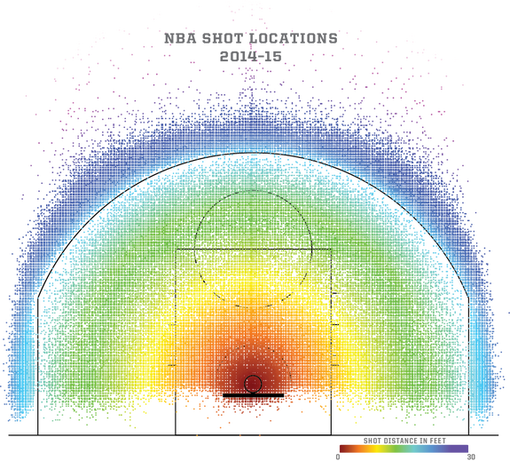
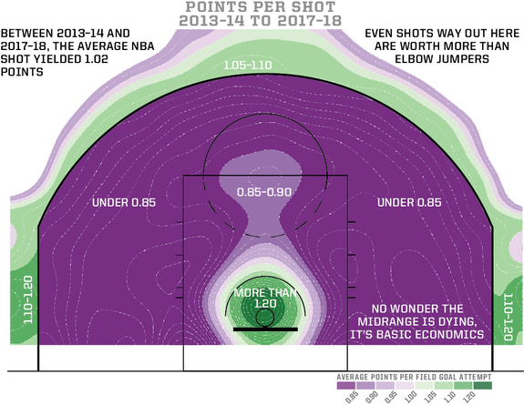
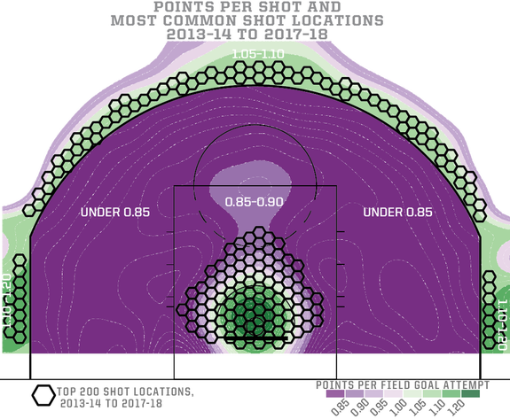

How Mapping Shots In The NBA Changed It Forever

May 2, 2019, at11:36 AM

# How Mapping Shots In The NBA Changed It Forever

By [Kirk Goldsberry](https://fivethirtyeight.com/contributors/kirk-goldsberry/)
Filed under [NBA](https://fivethirtyeight.com/tag/nba/)

- [](https://fivethirtyeight.com/features/how-mapping-shots-in-the-nba-changed-it-forever/?share=facebook&nb=1)
- [](https://fivethirtyeight.com/features/how-mapping-shots-in-the-nba-changed-it-forever/?share=twitter&nb=1)

*Kirk Goldsberry is an ESPN analyst and FiveThirtyEight contributor. His new book, “SprawlBall: A Visual Tour of the New Era of the NBA,” is*  [*available this week*](https://www.amazon.com/SprawlBall-Visual-Tour-New-Era/dp/1328767515)*. In it, he examines the history of the NBA’s 3-point line and how players and teams are using it to change the game. We’re publishing an excerpt of the book on how the NBA’s genome is mapped.*

* * *

Every year, NBA players take about 200,000 shots. Each season, 30 teams combine to play 1,230 games, and at the end of the regular season, you can bet the sum total of shots taken will be very close to 200,000. In the hands of a cartographer, a season’s worth of this shooting data is a veritable treasure trove of information. But here’s the thing: In the first decade of this century, there weren’t many cartographers working in the NBA league office or for analytics departments in any of the team front offices.

Back then, basketball analytics was still in its infancy; it was all about spreadsheets and linear regression, not spatial and visual reasoning. Still, whether the league knew it or not, by adding these little spatial references to their game data, basketball analytics was about to become a lot more than spreadsheets. Things like data visualization and spatial analyses were going to be very important.

Unfortunately, there weren’t many folks with those skills working in pro basketball, and even though countless analysts had access to all the data the league was collecting — including all of the shot data — nobody was applying a spatial treatment. Nobody was mapping the NBA.

*[[Related: Kirk Goldsberry joins Hot Takedown to discuss his new book](https://fivethirtyeight.com/features/what-were-the-giants-thinking/).]*

When I first got my hands on these massive haystacks of shooting data, I was teaching cartography at Harvard. I’d found a way to retrieve five seasons’ worth of shooting data from the web, and I built a database that included over 1 million NBA field-goal attempts, who shot them and where they shot them from. As an analyst, I knew there was amazing intelligence waiting to be revealed within the database. As a mapmaker, I was confident I could visualize some of it in cool new ways. And as a huge NBA fan, I couldn’t wait to see the results.

Although I was desperate to chart out the shooting abilities of players like Kobe Bryant and Dirk Nowitzki, the first thing I wanted to see was the basic shooting patterns of the entire league. When you plot an entire season’s worth of shot data, some interesting patterns quickly emerge:

The graphic is more than just a shitload of dots. This basic plot shows us where on the floor the most important concentrations of field-goal attempts occurred in 2014-15. We can see that there was a major hub of shooting activity near the basket and another band of activity out beyond the 3-point arc. We can also see that the league’s shooters were generally less active in the 2-point jump-shooting areas between the arc and the paint, but this plot says nothing about the relative values or successes of shots in different areas.

Each one of these dots has a backstory. Each one has a shooter attached, a team attached and an outcome attached. We know who took each shot and whether it went in or not. And we can smooth out these dots statistically and map out the overall field-goal percentage of the NBA as a collective.

Aha. Now we’re getting somewhere. Now we can see that the probability of a shot going through the net greatly depends on where that shot came from. This insight is not surprising on its own, but it does reveal specifics about the basic relationships between distance, direction and field-goal percentage. What did surprise me when I first studied this chart was learning that outside of 6 feet, there is no place on the court where shooters make more than 45 percent of their shots. I’d always thought that 50 percent was the magic field-goal percentage threshold, but this graphic shows that the only place on the floor where players exceed that magic number is the tiny swath of space just in front of the basket.

The next thing I noticed was even more surprising. When you look at leaguewide shooting numbers between 6 and 25 feet, the league is strangely consistent. I expected to see a marked decrease in field-goal percentage with greater distance: I thought shorter jump shots would go in at higher rates than longer jump shots. While this is true, the effect is much more subtle than I would have expected.

As it turns out, NBA players make only 40 percent of their shots between 8 and 9 feet from the rim, and that number drops to only 35 percent between 25 and 26 feet from the rim. When it comes to field-goal percentage on jump shots, the effect of shot distance is pretty minor. It was a revelation, and it drove me to quickly build the following map, which would forever change the way I viewed scoring in the NBA.

Field-goal percentage is only part of the story, and in a league with a 3-point line, it is a very misleading part of the story. After all, points are the ultimate currency in the NBA.

When we visualize the average points per shot according to shot location, only then does the true economic landscape of the contemporary NBA reveal itself. Only then does Daryl Morey’s economic vision become clear. Only then do we see the massive economic subsidy represented by the 3-point line. And when we compare the points-per-shot map with the field-goal percentage map, we are left with a troubling thought about the contemporary geography of NBA basketball.

If it’s true that 3-point shots go in 36 percent of the time and 10-foot shots go in just 40 percent of the time, then why are we assigning 50 percent more value to shots from beyond that magical little arc?

The natural landscape depicted in the field-goal percentage map demonstrates that jump shooting in the NBA is essentially a 35 to 45 percent proposition; however, some of those shots are worth 3 and some are worth 2. Naturally, as basic economics would predict, the behavior of players and teams has reacted in the form of shot selection. When we overlay the most common 200 shot locations in today’s NBA, we see that shot selection and economic efficiency are aligned.

No wonder 2-point jump shooting is dying.

* * *

*Excerpted from “SprawlBall: A Visual Tour of the New Era of the NBA” by Kirk Goldsberry. Copyright © 2019 by Kirk Goldsberry. Reprinted by permission of Houghton Mifflin Harcourt Publishing Company. All rights reserved.*