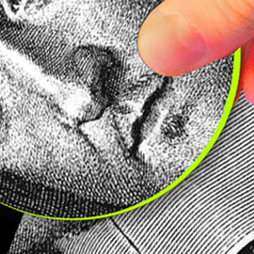

How Math’s Most Famous Proof Nearly Broke - Issue 67: Reboot - Nautilus

How Math’s Most Famous Proof Nearly Broke - Issue 67: Reboot - Nautilus

http://nautil.us/issue/67/reboot/how-maths-most-famous-proof-nearly-broke-rp

Andrew Wiles gave a series of lectures cryptically titled “Modular Forms, Elliptic Curves, and Galois Representations” at a mathematics&#8230;