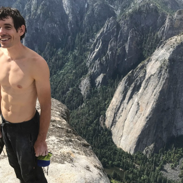

How One Man Climbed 3,000 Feet Without a Rope

How One Man Climbed 3,000 Feet Without a Rope

https://www.gq.com/story/alex-honnold-el-capitan-as-told-to?verso=true

Alex Honnold walks us through how he pulled off such an audacious feat, and what ran through his mind as he climbed his way to the top.