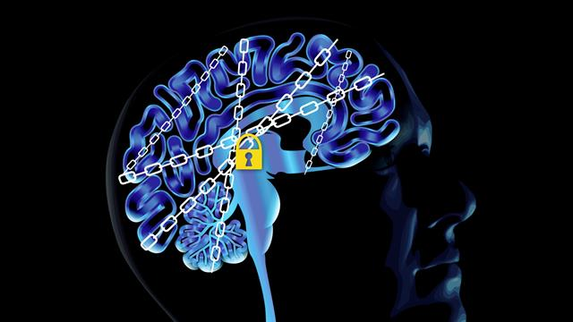

How Science Is Unlocking the Secrets of Addiction

Magazine

##

How Science Is Unlocking the Secrets of Addiction

We're learning more about the craving that fuels self-defeating habits—and how new discoveries can help us kick the habit.

Addiction hijacks the brain’s neural pathways. Scientists are challenging the view that it’s a moral failing and researching treatments that could offer an exit from the cycle of desire, bingeing, and withdrawal that traps tens of millions of people. Janna Raine became addicted to heroin two decades ago after taking prescription pain pills for a work injury. Last year she was living in a homeless encampment under a Seattle freeway.

Photograph by Max Aguilera-Hellweg

 [(L)](http://www.nationalgeographic.com/magazine/2017/09/the-addicted-brain/#)

 [(L)](http://www.nationalgeographic.com/magazine/2017/09/the-addicted-brain/#)

 [(L)](http://www.nationalgeographic.com/magazine/2017/09/the-addicted-brain/#)

 [(L)](http://www.nationalgeographic.com/magazine/2017/09/the-addicted-brain/#)

 By analyzing brain scans of recovering cocaine addicts, clinical neuroscientist Anna Rose Childress, a professor at the University of Pennsylvania, studies how subliminal drug cues excite the brain’s reward system and contribute to relapse. When she showed images such as the one of cocaine on the left screen to patients for 33 milliseconds, their reward circuitry was stimulated. She’s trying to find medications that can prevent this activation and keep people from falling prey to “unseen” triggers.

By **Fran Smith**

Photographs by [**Max Aguilera-Hellweg**](http://www.nationalgeographic.com/contributors/a/photographer-max-aguilera-hellweg.html)

> open-quote>  This story appears in the > [> September 2017](http://www.nationalgeographic.com/magazine/2017/09/)>  issue of *> National Geographic*>  magazine.

Patrick Perotti scoffed when his mother told him about a doctor who uses electromagnetic waves to treat drug addiction. “I thought he was a swindler,” Perotti says.

Perotti, who is 38 and lives in Genoa, Italy, began snorting cocaine at 17, a rich kid who loved to party. His indulgence gradually turned into a daily habit and then an all-consuming compulsion. He fell in love, had a son, and opened a restaurant. Under the weight of his addiction, his family and business eventually collapsed.

He did a three-month stint in rehab and relapsed 36 hours after he left. He spent eight months in another program, but the day he returned home, he saw his dealer and got high. “I began to use cocaine with rage,” he says. “I became paranoid, obsessed, crazy. I could not see any way to stop.”

When his mother pressed him to call the doctor, Perotti gave in. He learned he would just have to sit in a chair like a dentist’s and let the doctor, Luigi Gallimberti, hold a device near the left side of his head, on the theory it would suppress his hunger for cocaine. “It was either the cliff or Dr. Gallimberti,” he recalls.

 BREAKING THE CHAIN

A serious cocaine addict who’d relapsed several times after treatment, Patrick Perotti finally resorted to an experimental treatment—the application of electromagnetic pulses to his prefrontal cortex— at a clinic in Padua, Italy. It worked. Psychiatrist Luigi Gallimberti has used transcranial magnetic stimulation on other patients with similar success. He and his colleagues are planning a large-scale trial. The technique is now being tested for other types of addiction by researchers around the world.

Gallimberti, a gray-haired, bespectacled psychiatrist and toxicologist who has treated addiction for 30 years, runs a clinic in Padua. His decision to try the technique, called transcranial magnetic stimulation (TMS), stemmed from dramatic advances in the science of addiction—and from his frustration with traditional treatments. Medications can help people quit drinking, smoking, or using heroin, but relapse is common, and there’s no effective medical remedy for addiction to stimulants like cocaine. “It’s very, very difficult to treat these patients,” he says.

More than 200,000 people worldwide die every year from drug overdoses and drug-related illnesses, such as HIV, according to the United Nations Office on Drugs and Crime, and far more die from smoking and drinking. More than a billion people smoke, and tobacco is implicated in the top five causes of death: heart disease, stroke, respiratory infections, chronic obstructive pulmonary disease, and lung cancer. Nearly one of every 20 adults worldwide is addicted to alcohol. No one has yet counted people hooked on gambling and other compulsive activities gaining recognition as addictions.

|  |
|  |

|     |
| --- |
|  |

|     |
| --- |
| 0:00 |

|     |
| --- |
| \|  |

|     |
| --- |
| 3:42 |

|     |
| --- |
|  |

|     |
| --- |
|     |

  Related video: The Science of Addiction

Addiction affects tens of millions of people across the planet. But where does it come from? This animated video breaks down how the brain’s dopamine-based reward system works and how different drugs hijack this system.

In the United States an epidemic of opioid addiction continues to get worse. The Centers for Disease Control and Prevention reported a record 33,091 overdose deaths in 2015 from opioids, including prescription painkillers and heroin—16 percent more than the previous record, set just the year before. In response to the crisis, the first ever U.S. surgeon general’s report on addiction was released in November 2016. It concluded that 21 million Americans have a drug or alcohol addiction, making the disorder more common than cancer.

After spending decades probing the brains of drug-loving lab animals and scanning the brains of human volunteers, scientists have developed a detailed picture of how addiction disrupts pathways and processes that underlie desire, habit formation, pleasure, learning, emotional regulation, and cognition. Addiction causes hundreds of changes in brain anatomy, chemistry, and cell-to-cell signaling, including in the gaps between neurons called synapses, which are the molecular machinery for learning. By taking advantage of the brain’s marvelous plasticity, addiction remolds neural circuits to assign supreme value to cocaine or heroin or gin, at the expense of other interests such as health, work, family, or life itself.

“In a sense, addiction is a pathological form of learning,” says Antonello Bonci, a neurologist at the National Institute on Drug Abuse.

 CREATURE OF COMPULSION

This rat, in a simulation of a slot machine, is lured by the same types of flashing lights and throbbing sounds that keep humans playing in casinos. With a choice of openings that pay off in sugar pellets, the rat will consistently poke at the one with the biggest payoff but the smallest chance of winning. Using similar studies, Catharine Winstanley, a neuroscientist at the University of British Columbia, has discovered that a medication that blocks a dopamine receptor can reduce risky decision-making linked to compulsive gambling.

**Gallimberti was fascinated** when he read a newspaper article about experiments by Bonci and his colleagues at NIDA and the University of California, San Francisco. They had measured electrical activity in neurons in cocaine-seeking rats and discovered that a region of the brain involved in inhibiting behavior was abnormally quiet. Using optogenetics, which combines fiber optics and genetic engineering to manipulate animal brains with once unimaginable speed and precision, the researchers activated these listless cells in the rats. “Their interest in cocaine basically vanished,” Bonci says. The researchers suggested that stimulating the region of the human brain responsible for inhibiting behavior, in the prefrontal cortex, might quell an addict’s insatiable urge to get high.

Gallimberti thought TMS might offer a practical way to do that. Our brains run on electrical impulses that zip among neurons with every thought and movement. Brain stimulation, which has been used for years to treat depression and migraines, taps that circuitry. The device is nothing but a coiled wire inside a wand. When electric current runs through it, the wand creates a magnetic pulse that alters electrical activity in the brain. Gallimberti thought repeated pulses might activate drug-damaged neural pathways, like a reboot on a frozen computer.

He and his partner, neurocognitive psychologist Alberto Terraneo, teamed up with Bonci to test the technique. They recruited a group of cocaine addicts: Sixteen underwent one month of brain stimulation while 13 received standard care, including medication for anxiety and depression. By the end of the trial, 11 people in the stimulation group, but only three in the other group, were drug free.

The investigators published their findings in the January 2016 issue of the journal *European Neuropsychopharmacology.* That prompted a flurry of publicity, which drew hundreds of cocaine users to the clinic. Perotti came in edgy and agitated. After his first session, he says, he felt calm. Soon he lost the desire for cocaine. It was still gone six months later. “It has been a complete change,” he says. “I feel a vitality and desire to live that I had not felt for a long time.”

It will take large, placebo-controlled trials to prove that the treatment works and the benefits last. The team plans to conduct further studies, and researchers around the world are testing brain stimulation to help people stop smoking, drinking, gambling, binge eating, and misusing opioids. “It’s so promising,” Bonci says. “Patients tell me, ‘Cocaine used to be part of who I am. Now it’s a distant thing that no longer controls me.’ ”

 IN THE GRIP OF GAMING

In Seoul, e-stadiums and gaming parlors charge about a dollar an hour, and some venues are open around the clock. Soon after South Korea made super-high-speed Internet cheap and widely available, it became clear that some people were ruining their lives through obsessive game playing. The government now pays for treatment. The American Psychiatric Association hasn’t recognized compulsive gaming as an addiction, but it lists Internet gaming disorder as requiring more study.

**Not long ago** the idea of repairing the brain’s wiring to fight addiction would have seemed far-fetched. But advances in neuroscience have upended conventional notions about addiction—what it is, what can trigger it, and why quitting is so tough. If you’d opened a medical textbook 30 years ago, you would have read that addiction means dependence on a substance with increasing tolerance, requiring more and more to feel the effects and producing a nasty withdrawal when use stops. That explained alcohol, nicotine, and heroin reasonably well. But it did not account for marijuana and cocaine, which typically don’t cause the shakes, nausea, and vomiting of heroin withdrawal.

The old model also didn’t explain perhaps the most insidious aspect of addiction: relapse. Why do people long for the burn of whiskey in the throat or the warm bliss of heroin after the body is no longer physically dependent?

######

Related Stories

   [(L)](http://www.nationalgeographic.com/magazine/2017/09/science-of-addiction-babies-opioids)

- [Babies Fall Victim to the Opioid Crisis](http://www.nationalgeographic.com/magazine/2017/09/science-of-addiction-babies-opioids)

- [Can Repairing Your Brain’s Wiring Help You Fight Addiction?](http://www.nationalgeographic.com/magazine/2017/09/editors-note-addiction-babies-opioids)

- [How to Find Help to Recover From Addiction](http://www.nationalgeographic.com/magazine/2017/09/addiction-help-recovery)

The surgeon general’s report reaffirms what the scientific establishment has been saying for years: Addiction is a disease, not a moral failing. It’s characterized not necessarily by physical dependence or withdrawal but by compulsive repetition of an activity despite life-damaging consequences. This view has led many scientists to accept the once heretical idea that addiction is possible without drugs.

The most recent revision of the *Diagnostic and Statistical Manual of Mental Disorders,* the handbook of American psychiatry, for the first time recognizes a behavioral addiction: gambling. Some scientists believe that many allures of modern life—junk food, shopping, smartphones—are potentially addictive because of their powerful effects on the brain’s reward system, the circuitry underlying craving.

“We are all exquisite reward detectors,” says Anna Rose Childress, a clinical neuroscientist at the University of Pennsylvania’s Center for Studies of Addiction. “It’s our evolutionary legacy.”

For years Childress and other scientists have tried to unravel the mysteries of addiction by studying the reward system. Much of Childress’s research involves sliding people addicted to drugs into the tube of a magnetic resonance imaging (MRI) machine, which tracks blood flow in the brain as a way to analyze neural activity. Through complex algorithms and color-coding, brain scans are converted into images that pinpoint the circuits that kick into high gear when the brain lusts.

Childress, who has flaming red hair and a big laugh, sits at her computer, scrolling through a picture gallery of brains—gray ovals with bursts of color as vivid as a Disney movie. “It sounds nerdy, but I could look at these images for hours, and I do,” she says. “They are little gifts. To think you can actually visualize a brain state that’s so powerful and at the same time so dangerous. It’s like reading tea leaves. All we see is spots that the computer turns into fuchsia and purple and green. But what are they trying to tell us?”

The reward system, a primitive part of the brain that isn’t much different in rats, exists to ensure we seek what we need, and it alerts us to the sights, sounds, and scents that point us there. It operates in the realm of instinct and reflex, built for when survival depended on the ability to obtain food and sex before the competition got to them. But the system can trip us up in a world with 24/7 opportunities to fulfill our desires.

Hijacking The Brain
New research suggests that the brain’s reward system has different mechanisms
for craving and pleasure. Craving is driven by the neurotransmitter dopamine.

Pleasure is stimulated by other neurotransmitters in “hedonic hot spots.” When the

craving circuitry overwhelms the pleasure hot spots, addiction occurs, leading
people to pursue a behavior or drug despite the consequences.
Dorsal striatum

Pathways to Craving
Neurons here help form habits by
identifying enjoyable patterns, such
as the anticipation of buying drugs.
Desire is triggered when dopamine, which
originates near the top of the brain stem, travels
through neural pathways to act on the brain.
Drugs increase the flow of dopamine.
Ventral tegmental area (VTA)
Dopamine is produced here
and flows outward along
neurons distributed throughout
the brain’s reward system.
Prefrontal cortex

The amino acid glutamate, produced
here, interacts with dopamine to spark
visualizations that cue cravings.
Amygdala
Neurons here are stimulated by
learned emotional responses, such as
memories of cravings and pleasure.
Brain stem
Orbitofrontal cortex
Basic visceral sensations
and reactions to pleasure,
such as smiling, originate
from this hot spot.
This hot spot gives a sense
of gratification but is also the
first to shut down if a person
has indulged too much.
Ventral pallidum
Nucleus accumbens
Animal experiments show that
damaging this hot spot can turn
something that once gave
pleasure into a source of disgust.
A hot spot within this
key part of the craving
circuitry amplifies the
response to pleasure.
pleasure Hot spots
A system of small hedonic hot spots, unrelated
to dopamine, provides temporary sensations of
pleasure and forms a feedback loop with the
reward system that controls desire.
In a normal state
Neuron ACTIVITY
In an excited state
Terminal of neuron
A Natural High
Our brains evolved a dopamine-based
reward system to encourage behaviors
that help us survive, such as eating,
procreating, and interacting socially.
Dopamine
stored in
neurons
Dopamine
transporters
Dopamine
transporters
remove excess
dopamine from
synapse
Dopamine
temporarily
floods
synapse
Synapse
Dopamine
Dopamine
receptors
A chemical rush
Dendrite
Different drugs interact with the reward
system in unique ways to keep synapses
artificially flooded with dopamine. That
dopamine rush can rewire your brain to
want more drugs, leading to addiction.
Neurotransmitters carry nerve
impulses across synapses between
cells to excite or inhibit activity.
Dopamine temporarily floods a synapse when a
pleasurable activity, such as gambling, sex, shopping,
or gaming, is anticipated or experienced.
On heroin
On methamphetamine
On cocaine
Dopamine
inhibitor
receptors
Heroin
blocks
dopamine
inhibitors
Meth
displaces
dopamine
into synapse
Cocaine
blocks
dopamine
removal from
synapse
In VTA
In brain
reward
system
Dopamine
floods
synapse
Synapses flood with dopamine
when heroin blocks dopamine
inhibitors in the VTA.
The drug reverses the natural, controlled
flow of dopamine into neurons, forcing
dopamine to rush into synapses instead.
By interfering with dopamine
transport, cocaine prevents removal
of excess dopamine from synapses.

Jason Treat and Ryan T. Williams, NGM Staff
Art: Daniel Hertzberg
Source: KENT Berridge, University of Michigan

Desire depends on a complex cascade of brain actions, but scientists believe that the trigger for this is likely to be a spike in the neurotransmitter dopamine. A chemical messenger that carries signals across synapses, dopamine plays wide-ranging roles in the brain. Most relevant to addiction, the flow of dopamine heightens what scientists call salience, or the motivational pull of a stimulus—cocaine, for instance, or reminders of it, such as a glimpse of white powder. Each drug that’s abused affects brain chemistry in a distinct way, but they all send dopamine levels soaring far beyond the natural range. Wolfram Schultz, a University of Cambridge neuroscientist, calls the cells that make dopamine “the little devils in our brain,” so powerfully does the chemical drive desire.

How powerfully? Consider the strange side effect of medications that mimic natural dopamine and are used to treat Parkinson’s. The disease destroys dopamine-producing cells, primarily affecting movement. Dopamine-replacement drugs relieve the symptoms, but about 14 percent of Parkinson’s patients who take these medications develop addictions to gambling, shopping, pornography, eating, or the medication itself. A report in the journal *Movement Disorders* describes three patients who became consumed by “reckless generosity,” hooked on giving cash to strangers and friends they thought needed it.

Through learning, the signals or reminder cues for rewards come to provoke surges of dopamine. That’s why the aroma of snickerdoodles baking in the oven, the ping of a text alert, or chatter spilling out the open door of a bar can yank a person’s attention and trigger craving. Childress has shown that people who are addicted don’t have to consciously register a cue for it to arouse their reward system. In a study published in *PLoS One* she scanned the brains of 22 recovering cocaine addicts while photos of crack pipes and other drug paraphernalia flashed before their eyes for 33 milliseconds, one-tenth the time it takes to blink. The men didn’t consciously “see” anything, but the images activated the same parts of the reward circuitry that visible drug cues excite.

In Childress’s view the findings support stories she has heard from cocaine patients who relapsed yet couldn’t explain what prompted it. “They were walking around in environments where most of the time one thing or another had been signals for cocaine,” she says. “They were basically getting primed, having that ancient reward system tingled. By the time they became conscious of it, it was like a snowball rolling downhill.”

> 1.1 billion people worldwide smoke tobacco

 World Health Organization

**The brain, of course,** is more than an organ of reward. It houses evolution’s most sophisticated machinery for thinking, considering risks, and controlling runaway desire. Why do craving and habits overpower reason, good intentions, and awareness of the toll of addiction?

“There’s a strong-ass demon that messes you up,” says a burly man with a booming voice who smokes crack regularly.

He sits in a black swivel chair in a small windowless room at the Icahn School of Medicine at Mount Sinai in Manhattan, waiting for his MRI. He’s taking part in a study in the lab of Rita Z. Goldstein, a professor of psychiatry and neuroscience, about the role of the brain’s executive control center, the prefrontal cortex. While the scanner records his brain activity, he’ll view pictures of cocaine with instructions to imagine either the pleasures or the perils that each image evokes. Goldstein and her team are testing whether neurofeedback, which allows people to observe their brains in action, can help addicts take more control over compulsive habits.

“I keep thinking, I can’t believe I’ve wasted all that damn money on the drug,” the man says as he’s led to the MRI machine. “It never balances out, what you gain versus what you lose.”

Goldstein’s neuroimaging studies helped expand understanding of the brain’s reward system by exploring how addiction is associated with the prefrontal cortex and other cortical regions. Changes in this part of the brain affect judgment, self-control, and other cognitive functions tied to addiction. “Reward is important in the beginning of the addiction cycle, but the response to reward is reduced as the disorder continues,” she says. People with addiction often persist in using drugs to relieve the misery they feel when they stop.

 AVERSION TACTICS

At Marshak Clinic, a drug-treatment center near Moscow, a six-month dose of Antabuse is implanted under the skin of a recovering alcoholic about to be discharged after a 30-day stay. The medication will cause him to vomit if he drinks, a form of aversion therapy. The clinic also relies heavily on other strategies to try to break the addiction, including yoga, individual and group counseling sessions, amino acid supplements, dietary changes, and antidepressants.

In 2002, working with Nora Volkow, now the director of NIDA, Goldstein published what has become an influential model of addiction, called iRISA, or impaired response inhibition and salience attribution. That’s a mouthful of a name for a fairly simple idea. As drug cues gain prominence, the field of attention narrows, like a camera zooming in on one object and pushing everything else out of view. Meanwhile the brain’s ability to control behavior in the face of those cues diminishes.

Goldstein has shown that as a group, cocaine addicts have reduced gray matter volume in the prefrontal cortex, a structural deficiency associated with poorer executive function, and they perform differently from people who aren’t addicted on psychological tests of memory, attention, decision-making, and the processing of nondrug rewards such as money. They generally perform worse, but not always. It depends on the context.

For example, on a standard task that measures fluency—how many farm animals can you name in a minute?—people with addiction may lag. But when Goldstein asks them to list words related to drugs, they tend to outperform everyone else. Chronic drug users are often great at planning and executing tasks that involve using drugs, but this bias may compromise other cognitive processes, including knowing how and when to stop. The behavioral and brain impairments are sometimes more subtle than in other brain disorders, and they’re more heavily influenced by the situation.

“We think that is one of the reasons why addiction has been and still is one of the last disorders to be recognized as a disorder of the brain,” she says.

Goldstein’s studies don’t answer the chicken-and-egg question: Does addiction cause these impairments, or do brain vulnerabilities due to genetics, trauma, stress, or other factors increase the risk of becoming addicted? But Goldstein’s lab has discovered tantalizing evidence that frontal brain regions begin to heal when people stop using drugs. A 2016 study tracked 19 cocaine addicts who had abstained or severely cut back for six months. They showed significant increases in gray matter volume in two regions involved in inhibiting behavior and evaluating rewards.

> 91 Americans die each day from opioid overdoses

 Centers for Disease Control and Prevention

**Marc Potenza strides** through the cavernous Venetian casino in Las Vegas. Electronic games—slot machines, roulette, blackjack, poker—beep and clang and trill. Potenza, an affable and energetic psychiatrist at Yale University and director of the school’s Program for Research on Impulsivity and Impulse Control Disorders, hardly seems to notice. “I’m not a gambler,” he says with a slight shrug and a grin. Out of the pleasure palazzo, he heads down an escalator and through a long concourse to a sedate meeting room in the Sands Expo Convention Center, where he will present his research on gambling addiction to about a hundred scientists and clinicians.

The meeting is organized by the National Center for Responsible Gaming, an industry-supported group that has funded gambling research by Potenza and others. It takes place on the eve of the industry’s mega convention, the Global Gaming Expo. Potenza stands at the podium, talking about white matter integrity and cortical blood flow in gamblers. Just beyond the room, expo exhibitors are setting up displays touting innovations engineered to get dopamine flowing in millennials. E-sports betting. Casino games modeled on Xbox. More than 27,000 game manufacturers, designers, and casino operators will attend.

Potenza and other scientists pushed the psychiatric establishment to accept the idea of behavioral addiction. In 2013 the American Psychiatric Association moved problem gambling out of a chapter called “Impulse Control Disorder Not Elsewhere Classified” in the *Diagnostic and Statistical Manual *and into the chapter called “Substance-Related and Addictive Disorders.” This was no mere technicality. “It breaks the dam for considering other behaviors as addiction,” says Judson Brewer, director of research at the Center for Mindfulness at the University of Massachusetts Medical School.

The association considered the matter for more than a decade while research accumulated on how gambling resembles drug addiction. Insatiable desire, preoccupation, and uncontrollable urges. The fast thrill and the need to keep upping the ante to feel the fireworks. An inability to stop, despite promises and resolve. Potenza did some of the first brain-imaging studies of gamblers and discovered that they looked similar to scans of drug addicts, with sluggish activity in the parts of the brain responsible for impulse control.

 CASUAL DRINKING

Sylvie Imbert and Yves Brasey credit baclofen, a medication used to treat muscle spasms, with freeing them from their devotion to the bottle. In studies, baclofen has shown promise for treating alcohol dependency. Brasey, having a beer at the Hotel Luxembourg Parc in Paris, now has just a few drinks at a time. Imbert had six to nine drinks almost daily until she started taking baclofen. Now she drinks only occasionally. Imbert and Brasey have become outspoken advocates for the drug.

**Now that the psychiatric** establishment accepts the idea that addiction is possible without drugs, researchers are trying to determine what types of behaviors qualify as addictions. Are all pleasurable activities potentially addictive? Or are we medicalizing every habit, from the minute-to-minute glance at email to the late-afternoon candy break?

In the United States the *Diagnostic and Statistical Manual* now lists Internet gaming disorder as a condition worthy of more study, along with chronic, debilitating grief and caffeine-use disorder. Internet addiction didn’t make it.

But it makes psychiatrist Jon Grant’s list of addictions. So do compulsive shopping and sex, food addiction, and kleptomania. “Anything that’s overly rewarding, anything that induces euphoria or is calming, can be addictive,” says Grant, who runs the Addictive, Compulsive and Impulsive Disorders Clinic at the University of Chicago. Whether it will be addictive depends on a person’s vulnerability, which is affected by genetics, trauma, and depression, among other factors. “We don’t all get addicted,” he says.

Perhaps the most controversial of the “new” addictions are food and sex. Can a primal desire be addictive? The World Health Organization has recommended including compulsive sex as an impulse control disorder in its next edition of the *International Classification of Diseases,* due out by 2018. But the American Psychiatric Association rejected compulsive sex for its latest diagnostic manual, after serious debate about whether the problem is real. The association didn’t consider food addiction.

Nicole Avena, a neuroscientist at Mount Sinai St. Luke’s Hospital in New York, has shown that rats will keep gobbling sugar if you let them, and they develop tolerance, craving, and withdrawal, just as they do when they get hooked on cocaine. She says high-fat foods and highly processed foods such as refined flour may be as problematic as sugar. Avena and researchers at the University of Michigan recently surveyed 384 adults: Ninety-two percent reported a persistent desire to eat certain foods and repeated unsuccessful attempts to stop, two hallmarks of addiction. The respondents ranked pizza—typically made with a white-flour crust and topped with sugar-laden tomato sauce—as the most addictive food, with chips and chocolate tied for second place. Avena has no doubt food addiction is real. “That’s a major reason why people struggle with obesity.”

> 3.3 million worldwide die each year from alcohol

 World Health Organization

**Science has been more successful** in charting what goes awry in the addicted brain than in devising ways to fix it. A few medications can help people overcome certain addictions. For example, naltrexone was developed to treat opioid misuse, but it’s also prescribed to help cut down or stop drinking, binge eating, and gambling.

Buprenorphine activates opioid receptors in the brain but to a much lesser degree than heroin does. The medication suppresses the awful symptoms of craving and withdrawal so people can break addictive patterns. “It’s a miracle,” says Justin Nathanson, a filmmaker and gallery owner in Charleston, South Carolina. He used heroin for years and tried rehab twice but relapsed. Then a doctor prescribed buprenorphine. “In five minutes I felt completely normal,” he says. He hasn’t used heroin for 13 years.

Most medications used to treat addiction have been around for years. The latest advances in neuroscience have yet to produce a breakthrough cure. Researchers have tested dozens of compounds, but while many show promise in the lab, results in clinical trials have been mixed at best. Brain stimulation for addiction treatment, an outgrowth of recent neuroscience discoveries, is still experimental.

Although 12-step programs, cognitive therapy, and other psychotherapeutic approaches are transformative for many people, they don’t work for everyone, and relapse rates are high.

In the world of addiction treatment, there are two camps. One believes that a cure lies in fixing the faulty chemistry or wiring of the addicted brain through medication or techniques like TMS, with psychosocial support as an adjunct. The other sees medication as the adjunct, a way to reduce craving and the agony of withdrawal while allowing people to do the psychological work essential to addiction recovery. Both camps agree on one thing: Current treatment falls short. “Meanwhile my patients are suffering,” says Brewer, the mindfulness researcher in Massachusetts.

Brewer is a student of Buddhist psychology. He’s also a psychiatrist who specializes in addiction. He believes the best hope for treating addiction lies in melding modern science and ancient contemplative practice. He’s an evangelist for mindfulness, which uses meditation and other techniques to bring awareness to what we’re doing and feeling, especially to habits that drive self-defeating behavior.

 PATIENTS, NOT PRISONERS

The law enforcement officers arresting this man on suspicion of smoking heroin in downtown Seattle chose to refer him to a treatment program for certain low-level drug offenders, rather than take him to jail. The innovative program, under way for more than five years, reflects an increasing awareness that habitual drug abuse stems from addiction and can be treated as a disease, not a crime. The program has reduced recidivism among offenders diverted from the criminal justice system.

In Buddhist philosophy, craving is viewed as the root of all suffering. The Buddha wasn’t talking about heroin or ice cream or some of the other compulsions that bring people to Brewer’s groups. But there’s growing evidence that mindfulness can counter the dopamine flood of contemporary life. Researchers at the University of Washington showed that a program based on mindfulness was more effective in preventing drug-addiction relapse than 12-step programs. In a head-to-head comparison, Brewer showed that mindfulness training was twice as effective as the gold-standard behavioral antismoking program.

Mindfulness trains people to pay attention to cravings without reacting to them. The idea is to ride out the wave of intense desire. Mindfulness also encourages people to notice why they feel pulled to indulge. Brewer and others have shown that meditation quiets the posterior cingulate cortex, the neural space involved in the kind of rumination that can lead to a loop of obsession.

Brewer speaks in the soothing tones you’d want in your therapist. His sentences toggle between scientific terms—hippocampus, insula—and Pali, a language of Buddhist texts. On a recent evening he stands in front of 23 stress eaters, who sit in a semicircle in beige molded plastic chairs, red round cushions nestling their stockinged feet.

Donnamarie Larievy, a marketing consultant and executive coach, joined the weekly mindfulness group to break her ice cream and chocolate habit. Four months in, she eats healthier food and enjoys an occasional scoop of double fudge but rarely yearns for it. “It has been a life changer,” she says. “Bottom line, my cravings have decreased.”

**Nathan Abels has decided** to stop drinking—several times. In July 2016 he ended up in the emergency room at the Medical University of South Carolina in Charleston, hallucinating after a three-day, gin-fueled bender. While undergoing treatment, he volunteered for a TMS study by neuroscientist Colleen A. Hanlon.

For Abels, 28, a craftsman and lighting design technician who understands how circuitry works, the insights of neuroscience provide a sense of relief. He doesn’t feel trapped by biology or stripped of responsibility for his drinking. Instead he feels less shame. “I forever thought of drinking as a weakness,” he says. “There’s so much power in understanding it’s a disease.”

He’s throwing everything that the medical center offers at his recovery—medication, psychotherapy, support groups, and electromagnetic zaps to the head. “The brain can rebuild itself,” he says. “That’s the most amazing thing.”

> open-quote>  Fran Smith is a writer and editor. This is her first article for *> National Geographic. *> Max Aguilera-­Hellweg ****> is a photographer who also trained as a medical doctor. His last assignment for the magazine was > [> “Beyond Reasonable Doubt,”](http://www.nationalgeographic.com/magazine/2016/07/forensic-science-justice-crime-evidence/)>  in the July 2016 issue.