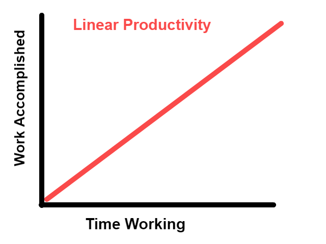
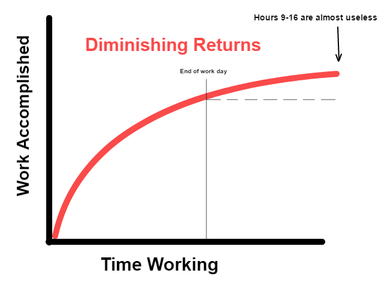
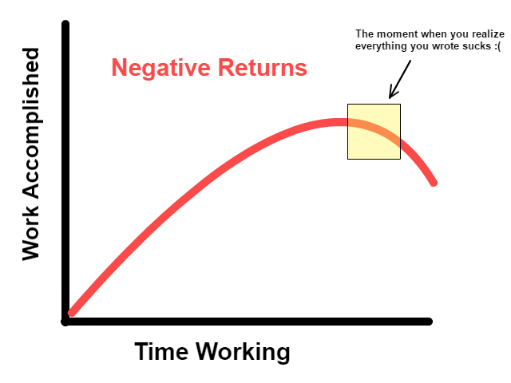
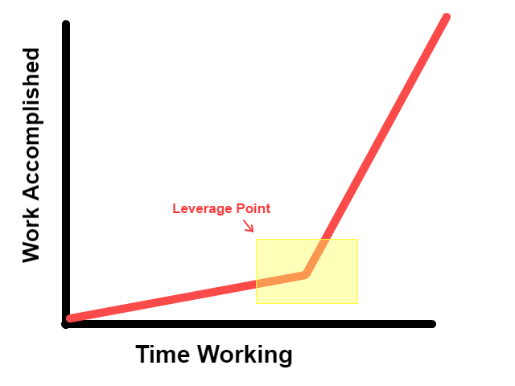
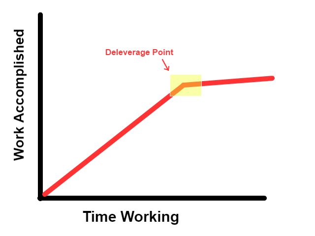
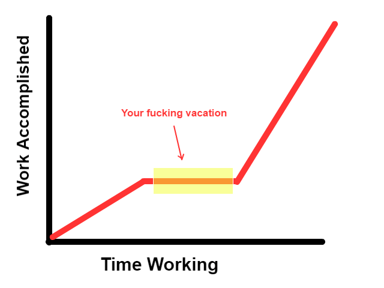

How To Be More Productive by Working Less

# [Mark Manson](https://markmanson.net/)

Author. Thinker. Life Enthusiast.

[*b*](https://markmanson.net/how-to-be-more-productive?utm_source=pocket&utm_medium=email&utm_campaign=pockethits#)

# How To Be More Productive by Working Less

[May 12, 2017](https://markmanson.net/how-to-be-more-productive)•15 minute read•by [Mark Manson](https://markmanson.net/author/mark-manson)••

*g*

It took me 18 months to write [*The Subtle Art of Not Giving A Fuck*](http://amzn.to/2q5RPXC). Over that time period, I wrote somewhere in the vicinity of 150,000 words for the book (about 600 pages). Most of that came in the final three months. In fact, I can confidently say I got far more done in the final three months than I did in the first 12 combined.

Now, is that because I was on a deadline and worked like an insane person? Did I shove Adderall up my ass and work in 36-hour spurts or something?

No, in fact, those last three months, I worked *less* each day than I did the first 12, yet I still accomplished far more.

In this article, I’d like to make a simple argument (backed with lots of shitty images I created in MS Paint): that when it comes to productivity, things are not what they seem.

Every productivity book on the planet, from David Allen to Benjamin Franklin, tells you more or less the same thing: wake up at the ass-crack of dawn and drink some stimulating liquid, segment your work periods into bite-sized chunks organized by urgency and importance, keep fastidious lists and calendars, and schedule appointments 15 weeks in advance and be early to everything.

Fuck that. I hate mornings. You know what my “morning routine” usually is? Jerk off and read Facebook. And if I’m lucky, the garbage on my newsfeed will piss me off enough that I’ll start writing without even realizing it (after all, what’s more important than proving to someone on the internet that they’re wrong?).

The truth is, I do some of my best writing at 3 AM while blasting [*Every Time I Die*](https://www.youtube.com/watch?v=AW61H9roTSs) into my ear drums. I take random Thursdays off. I hate calendars and after running my own online business for almost 10 years, I still don’t have one.

That’s what works for me and probably not what works for you. So why even bother talking about it?

I believe productivity is a deeply personal thing. We all have different brains and, therefore, different preferences, perspectives, and situations where we feel most effective. Thus, the few times I’ve attempted to wade into the productivity waters on this site, instead of jerking off over new apps or morning rituals, I’ve focused on understanding one’s own psychology.

For example, [procrastination](https://markmanson.net/procrastination) is deeply tied to anxiety – so it’s important to develop an understanding of your own neuroses and fears. Action [has a momentum to it](https://markmanson.net/do-something), and so developing personal rituals to get your own snowball rolling downhill is likely far more important than what yerba mate supplements to take, or what fucking yoga mat to sit and scratch your ass on in the morning.

Aside from birthing me my first grey hairs and keeping me up at night more times than I’d like to count, *The Subtle Art* taught me a lot about the nature of work. And a lot of that had to do with how my perception of the work itself evolved over the course of writing the book. So much so that I want to take some time and write a post about the nature of work itself.

Because see, this may surprise you, *but not all work is created equal*.

Productivity tips for, say, painting a landscape in watercolors, are probably not useful for finishing your tax returns on time. Or the advice that might help you come up with a way to re-organize the team you manage to get rid of some bottlenecks is not the same advice that would help you clean your apartment faster.

So if you’ve got a burning desire to paint a landscape or do your tax return this weekend,[1](https://markmanson.net/how-to-be-more-productive?utm_source=pocket&utm_medium=email&utm_campaign=pockethits#footnote-1) listen the fuck up.

## Work as a linear function

Most of us, for most of our lives, conceptualize work as a linear function. What I mean by “linear” is that the amount of productive output you create is directly proportional to a number of hours you input.

So working two hours will produce twice the results as one hour. And eight hours will produce four times that of two hours.

We all kind of go through life assuming this is the way things work (for the most part). This is mostly because [school work](https://markmanson.net/taught-in-school) functions pretty linearly. They give you a bunch of stuff to memorize, and if you spend two hours memorizing it, you’ll remember about twice as much as if you had spent one hour.

Then we get older and stop picking our noses in public and we just assume that the rest of life will function the same way.

But it doesn’t.

The truth is that most thoughtful, brain-intensive work does not unfold like this. And this feels really unfair to us. So we spend a lot of time complaining to our parents and making excuses that our bosses don’t appreciate our “genius” or whatever.

The only work that is linear is really basic, repetitive stuff. Like hauling bales of hay. Or packing boxes. Or really obnoxious data entry on gigantic spreadsheets. Or operating the fryer at McDonalds.

Four hours is twice as productive as two hours is twice as productive as one and so on.

Sadly, the “work as a linear function” is where all the religion of “Bro, you’ve just gotta hustle” comes from in the startup world. Since, in their minds, 16 hours of work is twice as productive as eight, the logical conclusion is that you’re all just a bunch of lazy sacks of shit, and you should be putting butter in your coffee at 4 AM and coding until your eyeballs bleed. Hustle, hustle, hustle.

As we’ll see, as well-intentioned and glamorous as the Religion of Hustle is, it often backfires on people. Because the truth is that most types of work (especially work that will make you some money in 2017) does not produce linear returns, it produces diminishing returns.

## Work that produces diminishing (or even negative) returns

Imagine that you went outside and jogged for 10 minutes. This would be a healthy thing to do.

Now imagine you went outside and ran for 20 minutes. It’d also be healthy, but it wouldn’t necessarily be twice as healthy as the 10 minutes.

What if you ran for an hour? Well, you’d definitely push yourself, but chances are you’d still see most of the benefits from those first 10 minutes of exercise.

Exercise has diminishing returns for the simple reason that your muscles tire out. And as your muscles tire out, their ability to be stimulated for further growth diminishes until it’s more or less non-existent. Spending two hours in the gym gets you little to no extra benefit as spending an hour. And spending an hour only gives you slightly more benefit than spending 45 minutes.

Most work is this way. Why? Because, like a muscle, your brain tires out. And if you’re exercising your brain by doing any sort of problem-solving, or important decision-making, then you’re limited in how much you can effectively accomplish in a day.

My wife used to work in the advertising industry and, like many industries, there was a fetish for working insane hours, especially when a major presentation or campaign proposal was due. People would stay late, often working until 9 or 10 o’clock at night. Sometimes they would come in on Saturdays.

But she noticed that most of this extra time was pretty ineffective. The four hours at the end of the day, from say 6 PM to 10 PM, contributed about as much usable work as the first two hours of the day. People were essentially slaving away for marginal benefits.

And in worst case scenarios, people would start producing *bad* work or make *bad* decisions because they were so tired. And when you accumulate enough bad work and bad decisions, you actually unintentionally create *more* work for yourself. So you go from working for diminishing returns to working for *negative* returns.

You dumbass, now look what you’ve done.

This happened to me when I started working on *The Subtle Art*. I was hanging out with a few other writers and we’d get together for “write-a-thons” and bang out as many words as humanly possible in an afternoon. It was basically one big pissing contest where we’d gloat about our word counts over drinks later that evening.

My best day was 8,000 words, all in about 6 hours of total work.

“Holy shit!” I thought, “I just produced 32 pages in a single day!” All you would need is 10 days of that kind of productivity to write an entire book.

There was just one problem.
It all sucked.

I mean *all of it*. When I eventually went back to revise the chapter a few weeks later, out of those 8,000 words, there were maybe 500 that were usable.

The problem is that it took me *four days* to sort through all the garbage, re-write the few parts that were salvageable, and make the decision to delete the parts that just sucked.

Suddenly, my 8,000-word burst of “massive” creativity created so much extra work for myself that I would have been better off not writing at all that day.

This was a huge realization for me. When it comes to creative work, not only is there a diminishing return, but at a certain point, writing more produced a *negative return*. Because bad writing isn’t just bad—bad writing creates *more work for yourself*, because it requires way more time to revise and edit.

I spent most of the first year writing *The Subtle Art* with this mindset of “more = better.” As a result, looking back, I spent at least half of my working hours fixing the messes I created unnecessarily in the first place.

Eventually, after months of frustration, I began to notice that most days, everything I wrote in the first 1-2 hours was great. It needed little revision and usually fit quite well with the message I was trying to go for in the book.

Everything written between 3-4 hours was mixed. On good days, I’d produce some good content (although almost never as good as the first two hours). But on bad days, most of it wasn’t usable and I was creating more work for myself.

Pretty much everything beyond hour number four sucked. Past that, any writing I attempted had *negative returns* and I was strangely better off [playing video games](https://markmanson.net/life-cheat-codes) or something.

It wasn’t until I had been writing for over a year that I worked up the courage to try limiting my writing to two hours a day. I was still so stuck in the mindset of linear returns, and I was so invested in this monstrous mess of a first draft (125,000 words, and most of it was shit) that I was afraid to find out that literally 50+% of the previous year’s “work” had not only been pointless, but had actually made me less productive.

But I tried it. And my god, did the book just shoot out of my fingers like my undiscovered Jedi powers. I banged out a new draft of the book in two months flat.

Me writing the second draft of my book in record time.

My guess is that most creative work operates on a negative returns curve. I know in the past when I’ve done design work, I’ve tinkered with an image so much that I can’t even tell if it looks good or not anymore. I would then spend half the night trying to make it “look right,” only to wake up in the morning realizing the idea sucked in the first place and I was better off starting over.

Work that’s highly social or requires a lot of team building can produce negative returns too. If you always need to be on point, then whenever your energy or mood slips, you might actually end up repelling customers, costing you potential long-term profits. Micromanaging the hell out of your employees won’t only *not* make them more productive, they’ll come to hate you and be even less motivated to produce results for you in the future.

## Leverage and Deleverage Points

So again, not all work is created equal.

Every business, job, or project has what I call a leverage point that instantly makes everything else you do more effective.

If you’re a team manager, it might be some ritual you create to keep morale high among your workers. If you’re a programmer, it might be educating yourself on new types of databases. If you work in face-to-face sales, it might be spiffying up your appearance and learning how to understand your customers on an emotional level.

When it comes to online content, branding is a leverage point—it’s something that the more you work on and perfect, the more it will have a multiplier effect on everything else—sales will come easier, traffic will stick better, people will talk about you and spread your content more efficiently.

So, accomplishing some aspects of your job well can make everything else that much easier…

…Or that much harder.

My one and only “real” job was at a bank for a grand total of about six weeks. This bank (which shall remain nameless) had a very specific procedure for a certain type of data entry that involved software as old as my mother and a totally backwards-ass way of inputting the data. It made the entire process mind-numbingly slow.

Essentially, the bank had created what I call a deleverage point—work that made all other work slower and more difficult. 

But about as soon as I pointed out to my boss that all of this work could be handled by a simple script and compiled into a spreadsheet, I was told to sit down, shut up, and enter the data how I’d been told to.

I quit a few weeks later.

## Strategic Laziness as a Leverage Point

Let’s pretend you love Indian food. You love it more than your spouse and your kids. You love it so much you’d bathe in mango chutney if you could afford that much mango chutney.

Now, let’s say you go out to your favorite Indian spot and engorge yourself. We’re talking on the order of 4,000 to 5,000 calories in one sitting. Like Monty Python in “The Meaning of Life” type gluttony.

##

###

["a thin mint" Monty Python](https://www.youtube.com/watch?v=HJZPzQESq_0)

Now, imagine you roll yourself out of the restaurant, and then someone comes up and offers you some fresh samosas and chutney (or maybe a thin mint). How would you feel?

We’ve all been in that state where we overeat a food we like and then the mere thought of that food for the following week makes us nauseous and we question the meaning of our own existence.

But then, a week later, Indian food doesn’t sound so bad. And then about another week or two later, you’re all geared up to go back to your favorite Indian spot and stuff yourself blind all over again.

Your brain works the same way with productivity.

See, solving problems is like food for your mind. It makes your mind happy. It makes it feel important and worthy and capable—all things [directly linked to happiness](https://markmanson.net/how-to-be-happy).

But solving problems is to your mind as food is to your stomach. It needs a variety of stimulation and too much of one kind will cause it to get sick and tired.

But what’s amazing is that this leisure time—this ability to distract one’s brain away from problem-solving and work, *actually makes your brain far more effective upon returning to work*.

I know, I know—it’s crazy, but weekends and vacation *really do* exist for a reason. 

When I started my business in 2008, I was a bona fide work-a-holic. I was pulling 14-15 hour days and rarely taking days off. And although I [traveled constantly](https://markmanson.net/courses/escape-plan), I rarely took “vacations” per se. It was more like, “hey, that beach looks like a really beautiful place to check my email for the next two hours.”

It wasn’t until I met my wife (who had a steady 9-5) that she put her (high-heeled) foot down and was like, “Hey fucknuts, put the laptop away and spend some time with me at the beach.”

I, of course, was horrified. It was like asking someone to leave the house without their right arm.

“But what about my emails?” I stammered.

I spent that first night in a fetal position, shaking. I had dreams where my website was hacked and my identity stolen and there was nothing I could do. I imagined the web servers spontaneously bursting into flames at the same time my bank accounts were being drained.

None of that happened, of course.

In fact, what happened was the complete opposite. Sitting there on that beach for five days, with no phone, no computer, no electronics – just me and a wonderful woman and my thoughts, I began to see my own work more clearly than I had ever seen it before. It was as if I had spent five years huddling over my business, scrutinizing and obsessing over every part and detail, and then hopping into a hot air balloon, and gliding so high above that I could see the whole thing with more perspective than I ever had before.

And it was on that beach that I came up with two ideas that would change my life.

The first was changing this website to markmanson.net (BRANDING!!! LEVERAGE POINTS!!!). Within six months, traffic increased 5-fold and my income 3-fold. The site would soon be read by millions of people, shared in over 100 countries, and get me published in some of the most prestigious publications around the world. And this would all happen while doing *fewer hours of work than I had been doing before*.

Whereas I had spent years trying to grow my website through sheer willpower and time commitment, it was by letting go of what was not working that my business took off without even needing me in it half the time.

The other idea I had on that beach was my book.

### These 3 Ideas Will Change Your Life

I’ve written a 21-page ebook about three ideas that heavily influenced my life, and that I believe can influence your life too. Put your email in the form and I’ll send it to you. No spam. I promise.

Footnotes

1. Spoiler: You’re a month late, ass wad.[↵](https://markmanson.net/how-to-be-more-productive?utm_source=pocket&utm_medium=email&utm_campaign=pockethits#refmark-1)

[e Share](http://www.facebook.com/sharer/sharer.php?u=https%3A%2F%2Fmarkmanson.net%2Fhow-to-be-more-productive)[f Tweet](https://twitter.com/share?original_referer=https%3A%2F%2Fmarkmanson.net%2Fhow-to-be-more-productive&text=How%20To%20Be%20More%20Productive%20by%20Working%20Less&url=https%3A%2F%2Fmarkmanson.net%2Fhow-to-be-more-productive&via=IAmMarkManson)[q Google+](https://plus.google.com/share?url=https%3A%2F%2Fmarkmanson.net%2Fhow-to-be-more-productive)

 Stay Connected:

|     |     |     |
| --- | --- | --- |
|     | [(L)](https://www.facebook.com/sharer/sharer.php?u=https%3A%2F%2Fwww.facebook.com%2FMarkmansonnet&display=popup&ref=plugin&src=like&kid_directed_site=0&app_id=308502612619041) | 380K people like this. Be the first of your friends. |

[**Follow **@iammarkmanson**](https://twitter.com/intent/follow?original_referer=https%3A%2F%2Fmarkmanson.net%2Fhow-to-be-more-productive%3Futm_source%3Dpocket%26utm_medium%3Demail%26utm_campaign%3Dpockethits&ref_src=twsrc%5Etfw&region=follow_link&screen_name=iammarkmanson&tw_p=followbutton)

Pinterest

### Related Articles You May Like -

- [Further Reading and References for The Subtle Art](https://markmanson.net/the-subtle-art-further-reading)
- [The Responsibility/Fault Fallacy](https://markmanson.net/responsibility-fault-fallacy)
- [The Paradox of Success](https://markmanson.net/paradox-of-success)
- [How to 80/20 Your Life](https://markmanson.net/80-20-your-life)
- [This Is Water](https://markmanson.net/this-is-water)

# Subscribe to the Site and Get Access to More Amazing Shit

Hi there. This is the part of the website where I put a big toothy grin on my face and scream “BUT WAIT! THERE’S MORE!” at you in hopes to hold your attention for more than 30 milliseconds.

Because wait, there actually *is* more. If you’d like to check out some online courses I’ve put together, if you’d like to get special subscribers-only articles and responses from me, and if you’re interested in hearing me answer reader questions like I’m Anne fucking Landers and talk a bit more about my own experiences, my business ventures, and what I eat for breakfast on Sundays, well, then there actually is more. A lot more.

Become a subscriber to the site and get all that extra cool stuff. Just click the pretty, pretty button below to get started.

[Click Me](https://markmanson.net/subscribe)
© 2017 Infinity Squared Media LLC

- [Terms and Conditions](https://markmanson.net/terms-and-conditions)
- /[Privacy Policy](https://markmanson.net/privacy-policy)
- /[Affiliates](https://markmanson.net/affiliates)
- /[Contact](https://markmanson.net/contact)
- /[Subscribe](https://markmanson.net/subscribe)
- /[Login](https://markmanson.net/log-in)