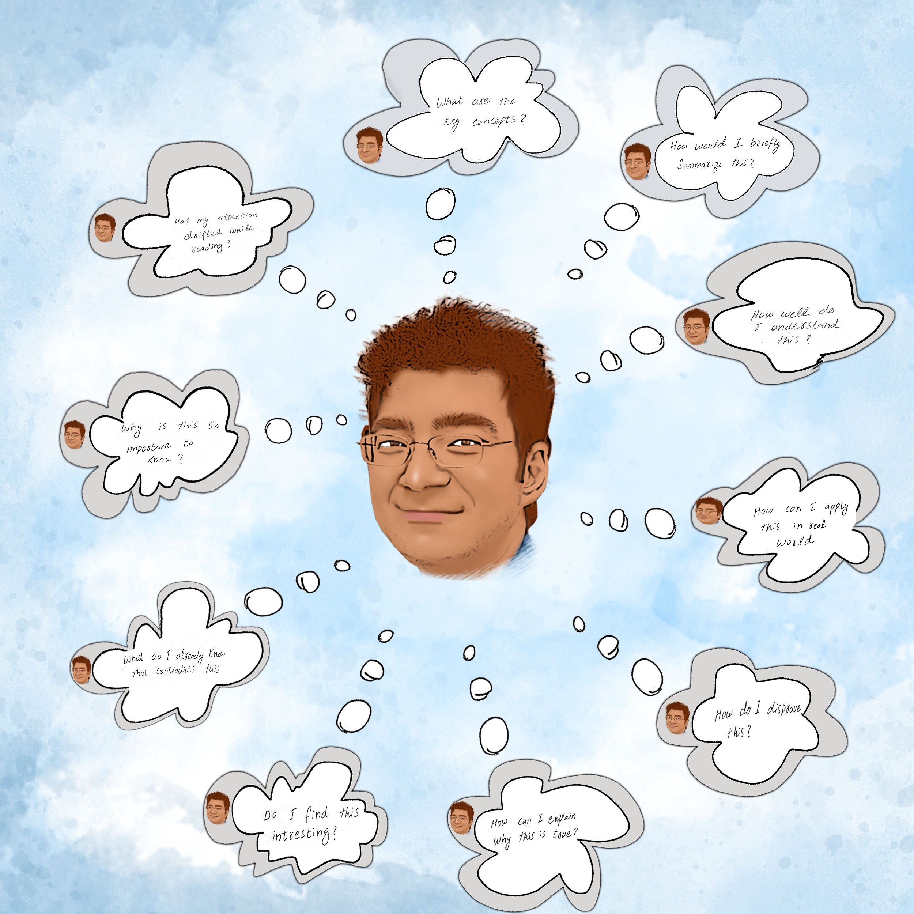
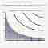
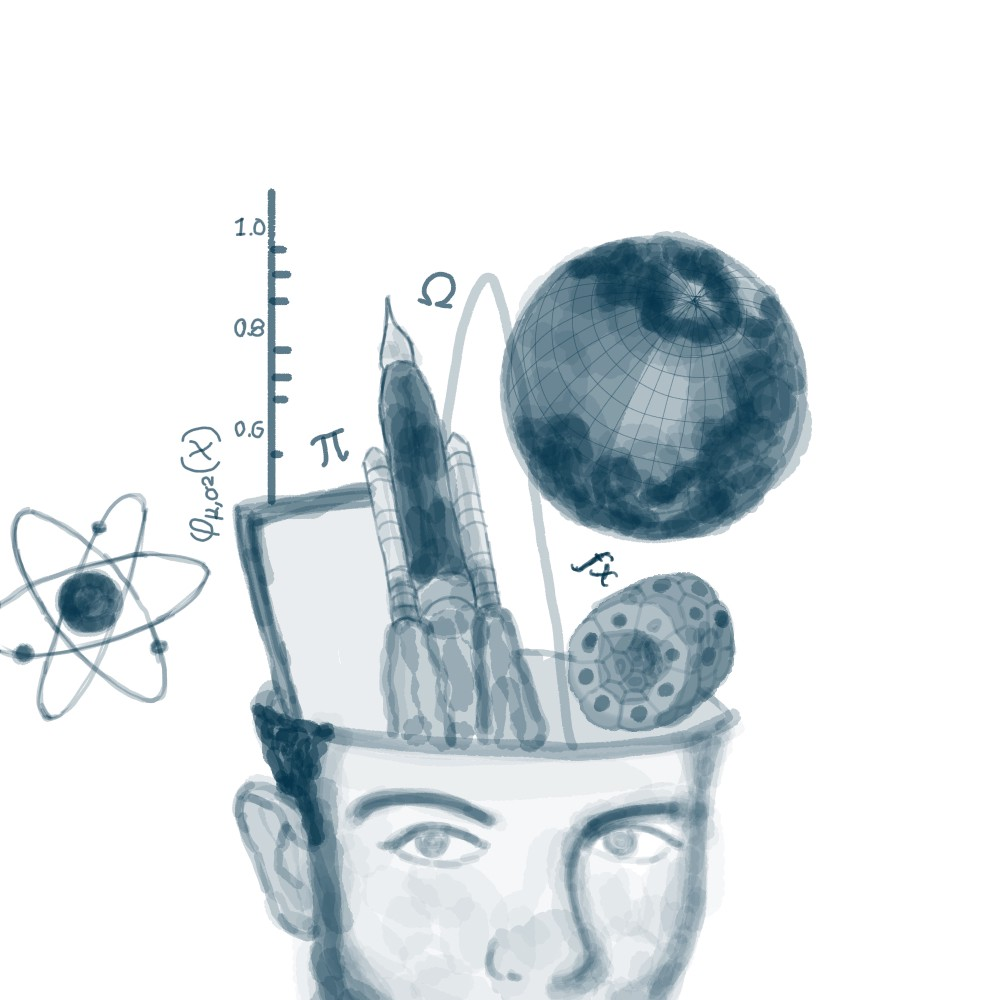
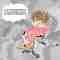
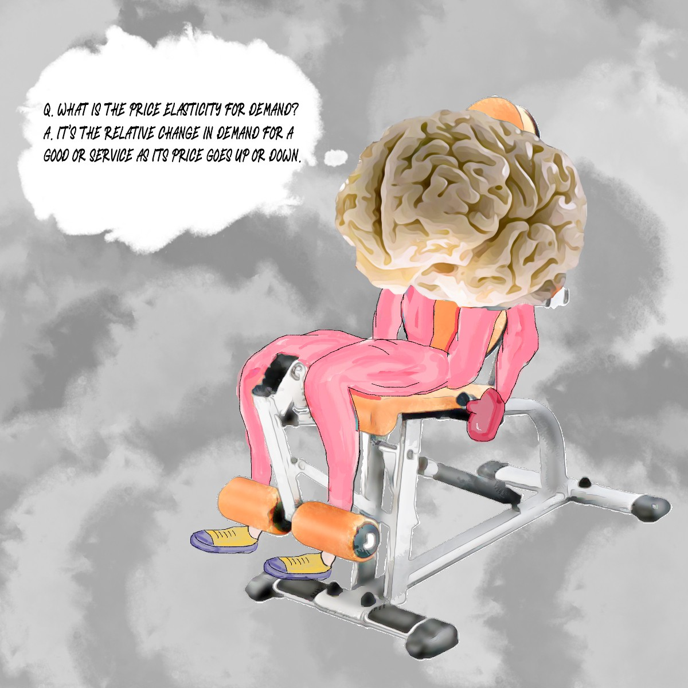
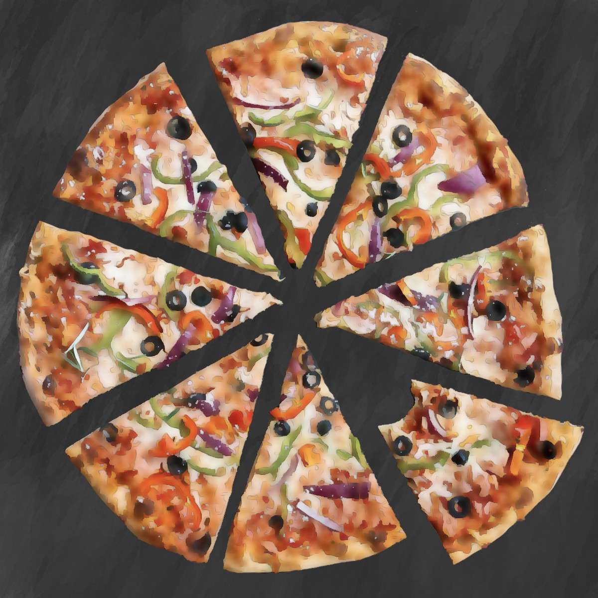

How To Read Academic Content Once and Remember it Forever

# How To Read Academic Content Once and Remember it Forever

## Metacognition and spaced retrieval: science-backed learning techniques that work

[David Handel, MD](https://medium.com/@iDoRecall?source=post_page-----e44f26d82566----------------------)

[Aug 29](https://medium.com/better-humans/how-to-read-academic-content-once-and-remember-it-forever-e44f26d82566?source=post_page-----e44f26d82566----------------------) · 15 min read

Photo by [congerdesign](https://pixabay.com/users/congerdesign-509903/) via Pixabay

All of your conceptual knowledge and autobiographical memory is a collection of stories. They’re all connected, like the many URLs that together make up the worldwide web. Like the web, if a “page” in your knowledge and memory “intranet” has no other pages linked to it, then you will no longer be able to retrieve this orphan, and it ceases to be knowledge.

Your conceptual knowledge is part of a narrative by your inner voice. As you come across new opportunities to learn, you play with the new concepts and facts and talk about them with yourself using that inner voice. Subconsciously, you link them to the things that you already know, the stories you’ve already internalized.

I want to teach you how to deliberately hold this inner dialogue with yourself and do this in a manner that will make you a powerful learner by more intentionally linking your memory and knowledge together through narrative. This skill, when applied with conscious awareness, is called metacognition, *thinking about your thinking*. And more than simply thinking about your thinking, you must exercise self-control and make choices in how you regulate your cognition and learning. (Figure 1)

Figure 1. Metacognition is the superpower that enables high-caliber learners to read deeply, extract the key concepts and facts from the content, and convert these learnings into new knowledge. All illustrations are courtesy of [iDoRecall.com](https://idorecall.com/).

# **Why I Had to Develop These Techniques for Myself**

I’m the kind of person who isn’t great at connecting [names and faces](https://youtu.be/sK7kfE6SuJs).

Occasionally, I’ll walk into a room and forget why I was headed there.

More than a few times in my life I have struggled to find my way back to my car in a large mall parking lot.

And I’m certainly no memory athlete like the ones who compete and accomplish seemingly [superhuman feats](https://www.usamemorychampionship.com/records/).

I’m also no genius. My sense is that I’m definitely in the top quartile of the population. I’m likely somewhere within the top decile. But I doubt I’m in the top percentile. There are many people in my life who I’m certain are far more intelligent than me.

I was a mediocre K-12 student. I graduated near the 50th percentile of my high school class. But after initially struggling in college, I redesigned my entire approach to learning by incorporating a set of practices we now know are backed by cognitive science. After making those changes, I earned straight A’s the remainder of my college career. I matriculated into medical school and four years later, I graduated No. 1 in my class. In fact, *I had the top score in my class of about 200 on every single medical school exam*.

I’ve [previously written](https://medium.com/better-humans/how-to-unlock-the-amazing-power-of-your-brain-and-become-a-top-student-369e5ba59484) about how I transformed my ability to learn. In that article, I discussed the importance of *reflection*, but I barely delved into how I trained myself to *think about my thinking *when I read non-fiction and academic content. This process, termed *metacognition*, has supercharged my ability to learn.

I am going to teach you how to read your learning materials and watch educational videos with the mission to **consume**  **the content once and remember it forever**. I will use something called spaced repetition here and there to help you remember what you learn. (What do I mean when I say *spaced repetition*? We’ll get to the answer soon.)

Before I dive in deeper, a bit of housekeeping. I am going to use the word ***consume*** here as a shorthand to indicate reading, watching, or listening, depending on the delivery method of the learning content that you are working with at the moment, whether it’s written material, images, video, audio, or some other medium. I may refer to these media collectively as learning materials, academic content, or some similar variation.

I’d like to focus your attention on a critical set of skills that will enable you to consume all of your academic content **once** and prepare your mind to remember it forever. By following these steps, you’ll be capable of reading your class notes, handouts, academic papers, and textbooks just once, harvesting all the knowledge and insight they have to offer. Then I will teach you how to install what you’ve learned into your everyday thinking, remembering all the facts and concepts. Forever.

* * *

*...*

# **An Introduction to Knowledge Acquisition and Knowledge Maintenance**

You must employ two distinct science-backed steps:

- The first step is the *knowledge-acquisition phase*, which is powered by metacognition. Here you’ll consume learning materials in a new way that will enable you to not only store them in memory but retrieve them at will, which leads to…
- The second step, which is a perpetual *knowledge-maintenance plan* based on practicing accessing what you’ve learned and spacing out these practices over time. (Yes, this is what we mean by *spaced repetition*! Figure 2.)

Leverage these tactics, and you’ll not only be a star pupil, but you’ll remember what you learn forever.

Figure 2. It is natural that we forget recently learned material. By practicing retrieval of a memory, spaced over time, we can make that memory easily retrievable.

Your primary objective when approaching your learning materials is to extract all of the important concepts and facts. You’ll need to process that information in very specific ways in order to create an infrastructure of knowledge that will provide the foundation for later higher-order thinking processes.

Think of it this way: What you learn and commit to memory forms a foundation on which to build more complicated thinking and analysis. You’ll be able to take what you’ve learned and play with it, build on it, apply it, evaluate it, and create with it. And if you’re anything like me, you’ll derive tremendous satisfaction from using all that you’ve learned, from across numerous knowledge domains, to create mashups that deliver new inventions and ideas to the world.

* * *

*...*

# **How To Process and Extract the Pearls in Your Learning Materials**

When I consume my learning materials, I mentally process that content with the intention of never coming back to re-read, re-watch, or re-listen to it.

One of the biggest inefficiencies, endemic among students as they study, is the consumption and re-consumption of their learning materials. Students highlight what they perceive to be important concepts, then repeatedly re-read the highlights. They’ll listen to a lecture, then listen again. They’ll watch a video over and over again, hoping that the knowledge contained there will stick. Because students generally approach reading as a passive activity, only a small amount of the content is transferred from the page to their brain. Passive re-reading accomplishes little more than was achieved during the first pass, and it takes just as long. Highlighting text and passively re-reading the highlights [adds very little](https://onlinelibrary.wiley.com/doi/full/10.1111/1541-4329.12075) to a student’s knowledge.

If you are on a serious mission to learn, then you must become skilled at extracting knowledge from the content and grafting it into your mind. This is a very active and deliberate process — *not *the passive consumption and re-consumption of learning materials.

The knowledge contained in a piece of academic content invariably includes facts relevant to that subject domain. These facts are the most granular and atomic elements of any body of knowledge — the building blocks that form the foundation of greater and more complex scholarship. For your purposes, not all of the factual information may be worth committing to memory. As you read, you need to make educated judgments about which facts need to be harvested and retained and which only add color commentary to the story.

When you consume academic content, your mission is to parse, comprehend, and extract. Even the densest academic writing contains *some* chaff. When you read to learn, you need to process the material and distill it down to the core substance. You’re looking for the relevant information that you wish to take with you. Then you need to install the new knowledge in your thought processes so that you can make real use of it.

This is an almost military exercise. At times it may not be a joyride. It takes effort. It’s far more rigorous than the passive and ineffective way most students read. You are working your way through the material in search of the important facts, central themes, concepts, and procedural knowledge that you will determine to be worthy of your focus, cognitive load, comprehension, and committing to memory.

Generally, the *concepts* in your learning materials require you to expend the greatest metacognitive effort. Concepts are abstractions that often help organize facts and ideas into a system of understanding. Conceptual knowledge can be difficult to comprehend and “wrap your head around” on a first pass.

In an optimal circumstance, you will finish reading a piece of content and then never need to return to it. But you may find yourself re-reading a sentence, paragraph, or section of the content *during your first-and-only reading* as you struggle to parse and understand it.

This can sometimes be an arduous exercise. It’s also one of the many times that you will apply metacognition as you deconstruct and reconstruct a concept. You will need to create a mental representation of something that might be concrete and real-world or is perhaps something more abstract that is only a concept or idea. This internal representation or mental model (Figure 3) is how you will think about, intellectually manipulate, and play with the concept. This process is “wrapping your head around it,” as you mentally digest the new idea and deliberately attach it to other knowledge that you already possess. This is where you are most actively learning as you read.

Figure 3. Mental models enable us to organize our understanding of a real-world entity or even an abstract concept so that we can intellectually examine, analyze, and manipulate it.

As you parse the words, phrases, sentences, paragraphs, sections, and illustrations of the learning content, you should identify and record every fact that you want to remember. (I’ll say more in a moment about how to record what you want to remember.) You will encounter all the concepts presented in the piece. With each concept, you need to perform an internal quality assessment to determine if you have full comprehension. This is an important part of the metacognitive process. This *thinking about your thinking* is how you actively assess the status of your comprehension.

Rather than recording ineffectual notes as I read, I do something far more powerful: I leverage technology to [create spaced-repetition flashcards](https://idorecall.com/) linked to the concepts and facts in my learning materials. Then, on retrieval practice, if I struggle with an answer, I can click a link that will open the source learning content at the exact spot relevant to the flashcard. I can refresh my memory and quickly get back to my retrieval practice session. *[Note from the editors of Better Humans: IDoRecall.com is a flashcard product sold by the author of this article. While we do not allow product pitches in Better Humans articles, there are examples, like this, where the author has created a relevant product out of their own experience—one that would be odd to not mention at all.]*

Thinking about the material you are reading and reflecting on how you are mentally processing the material requires some context switching. Read and think about the content. Then think about how you are processing the content. As you are learning to perform this switching, you will experience a potentially taxing cognitive load, especially until metacognition becomes a habit. Don’t be discouraged — it will get easier. Metacognition is something that [can be taught and learned](http://citeseerx.ist.psu.edu/viewdoc/download?doi=10.1.1.460.5895&rep=rep1&type=pdf).

When you consume your learning sources, you will encounter the presentation of concepts that are sometimes obtuse and not explained in a manner that you can grasp. The best approach when you have this experience is to find another source for learning that concept. Rather than wrestling with one author’s approach to delivering that specific knowledge, you should seek the teaching of other experts. This is easy to accomplish thanks to the web and Google. In fact, one of the most powerful strategies that I employed in college and medical school was to routinely read multiple sources on the same subject. I had the time to do that because I was not wasting time rereading my required content.

## A guided example of using metacognition

So, what does metacognition look like? Let me take you for a ride along with my mind as I consume learning content.

When I consume learning content, I am thinking about the content, but I am also thinking about whether my attention has lapsed and assessing how well I am processing the facts and concepts that I am encountering. I go through cycles of parsing and identifying *the what*. *What* are the important facts? *What* are the salient concepts? *What* do I understand? *What* don’t I comprehend?

Then I switch gears and dive deeper, identifying where the important knowledge I want to take with me fits within my pre-existing knowledge. I ask myself the answer to questions such as:

- How would I briefly summarize this? What are the key concepts?
- Does this remind me of anything that I already know in this domain of knowledge?
- Does this remind me of anything in another unrelated domain of knowledge?
- What other things do I know that support the veracity of this concept?
- Can I think of anything else I know that contradicts this concept?
- Do I know any concrete or practical examples that illustrate or illuminate this concept?
- How challenging is it for me to comprehend this?
- If this is a WHAT, can I explain the WHY? (or vice versa, as applicable)
- Why is this so important to know?
- Do I find this interesting? Why is that the case, or why not?
- Do I find this surprising? Why is that or why is that not the case?
- How can I apply this in the real world?

That is a quick peek at a short list of generic questions that I use in my internal dialogue. I have scores of these questions that I use to interrogate my learning as I consume content. Even more important are the custom-tailored questions that I improvise as I read.

This [metacognitive approach to learning](https://www.ncbi.nlm.nih.gov/pubmed/31223149) is a very active way to interact with the content. Sure, my “read only once” approach takes longer than a single passive reading. But the learning is much deeper. Facts and concepts are placed into mental models and associated with my prior knowledge of the subject domain at hand and even with other seemingly unrelated domains.

But, as fantastic as this technique is, this style of consuming content is not sufficient for the *perpetual recall* of what I’ve learned.

* * *

*...*

# **Remembering What You Learn Forever**

How can you remember what you learn forever? Forgetting is the normal M.O. of the human mind. This was proven by the [experiments performed by Ebbinghaus](https://www.ncbi.nlm.nih.gov/pmc/articles/PMC4492928/) more than a century ago. The only way to deliberately maintain your ability to recall the specific knowledge you want to remember is to purposely maintain your memories through *retrieval practice*.

If this term is new to you, we’re talking about testing your memory for each individual concept and fact. Retrieval practice can be carried out by using flashcards. This is especially handy since you can do it on your own, any time that you desire. Practice can also be achieved by studying with friends or in school when your teacher tests you during classroom discussions, quizzes, or exams. I’m many years beyond my formal academic phase of life, but as a lifelong learner, flashcards are my go-to for the things that I want to remember forever.

The benefits of retrieval practice and what has come to be known as *the testing effect* have been [proven hundreds of times](https://psycnet.apa.org/doiLanding?doi=10.1037%2Fa0037559) in cognitive psychology research. I like to think of this retrieval practice as taking my brain to the gym and hopping on a piece of equipment that has been specifically designed to maintain my recall for a particular concept or fact. Each flashcard is a very custom piece of equipment or exercise in my mental gymnasium. (Figure 4)

Figure 4. Retrieval practice is like taking your brain to the gym and using a specific piece of equipment to build robust recall ability of that specific concept, fact, or memory.

***Warning: Flashcards are a powerful tool for strengthening recall ability, but they should not be used for learning something in the first place! ***Actively consume and comprehend the material first. Record the key concepts and facts that you want to remember by creating spaced-repetition flashcards. *Then *test and build your recall ability of what you’ve learned with flashcards!

Figure 5. Close your eyes for a minute and think about PIZZA. Let your mind go. What were the various thoughts and memories that were triggered? Each of our memories is associated with other memories because of the way that engrams overlap.

## **Why is retrieval practice so powerful, and how can you make it even more effective?**

We know that every time you retrieve a memory, you change the memory and also strengthen your ability to recall it. Based on current research, we know that memories are stored at the level of a grouping of synapses belonging to a collection of neurons. This group of neurons is called an [*engram*](https://www.cell.com/neuron/pdf/S0896-6273(15)00677-7.pdf). The typical neuron has thousands of synapses, and undoubtedly every neuron that participates in one engram storing a specific memory also participates in many other engrams storing other memories. This explains why memories are so associative and why when we recall one memory, we quickly have other memories pop into consciousness in what seems to be a spontaneous cascade.

If I ask you to think of *pizza (*Figure*  *5*)*, no doubt a thread of related and sometimes seemingly unrelated thoughts will arise. For instance, your first thought of pizza might trigger a memory of your first date with your spouse when you went to a pizzeria. That thought might lead to remembering that this morning your dear spouse asked you to come home early from work today. Then you might recall that you are annoyed about having to go to that dinner obligation that you’re rushing home to attend. This is how the Internet of our brain works.

We are blessed with a nearly [unlimited storage capacity](https://www.livescience.com/53751-brain-could-store-internet.html) for memories, but where we struggle is in retrieving them when we need them. That is what *forgetting* and the *tip of the tongue *experience is all about.

When we practice retrieval, we strengthen our ability to recall that memory. This is because we strengthen the synaptic connections of the memory’s engram. But we also create new associations each time we retrieve a memory as we link that memory to the circumstances and context we’re in each time we retrieve it. The cognitive science and neuroscience maxim [*neurons that fire together wire together*](https://www.sciencedirect.com/science/article/abs/pii/S0361923099001823?via%3Dihub) is a truism and is embodied in the power of deliberate retrieval practice. Each time you practice retrieval of a fact or concept, you make it easier to retrieve again in the future.

## **But is it scalable to practice retrieval of every academic fact and concept that you’d like to keep at your fingertips?**

Imagine that you have a collection of 20,000 flashcards of the academic concepts and facts you want to be able to easily recall. What do you do when you wake up each morning? Practice retrieval of all 20,000?

This is where spaced repetition, AKA spacing, comes in. Spacing permits you to practice only the small subset of your collection that you are most likely close to forgetting. With a good spacing algorithm that selects and schedules your daily practice, we’re probably talking about [reviewing less than 100 cards a day out of the 20,000](https://www.gwern.net/Spaced-repetition#the-workload) that have been in your collection for at least a month. (Newer flashcards generally need more frequent practice during their first month.) Spacing algorithms typically take into account your rating of how easily you were able to recall the correct answer the previous time that you practiced the flashcard and the length of time since you last practiced it.

Besides making it scalable to manage a large collection of flashcards, the other big advantage of spacing is that you should optimally practice retrieval when you are [close to forgetting](http://citeseerx.ist.psu.edu/viewdoc/download?doi=10.1.1.512.8427&rep=rep1&type=pdf) an answer, but not quite crossed over to complete forgetting. The more effort it takes to retrieve an answer, the stronger the effect of building your ability to recall that concept or fact in the future.

* * *

*...*

# **Key Takeaways**

If you want to be a highly efficient and powerful learner, you don’t have to be a memory athlete or a genius. You can even be an absentminded professor in other aspects of your life. There is no skill that you can master that is more valuable than the ability to consume academic content with an inquiring mind by utilizing metacognition. By thinking about your mindful interaction with the content and having an internal dialogue as you process it, you can identify the important parts, QA your level of attention and comprehension, and carefully consider where these new learnings fit within the universe of what you already know.

As you build your knowledge base, make it your habit and practice to capture your learnings in spaced-repetition flashcards as you consume your learning materials. Then, every day, practice retrieval of that small subset of the cards you are close to forgetting. You will discover that you can maintain, on an ongoing basis, all the learnings that you want to remember. Forever.

What I propose here is based upon well-known cognitive science principles and also on [my own personal success](https://medium.com/better-humans/how-to-unlock-the-amazing-power-of-your-brain-and-become-a-top-student-369e5ba59484). I was a mediocre K-12 student who made a miraculous transformation and ended up graduating No. 1 in my medical school class.