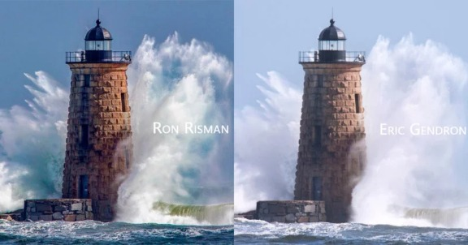
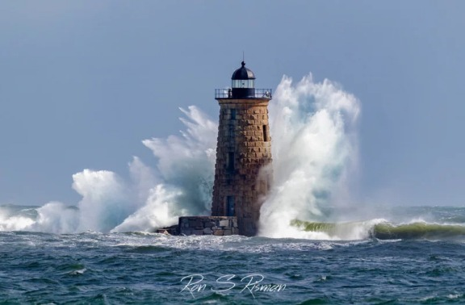
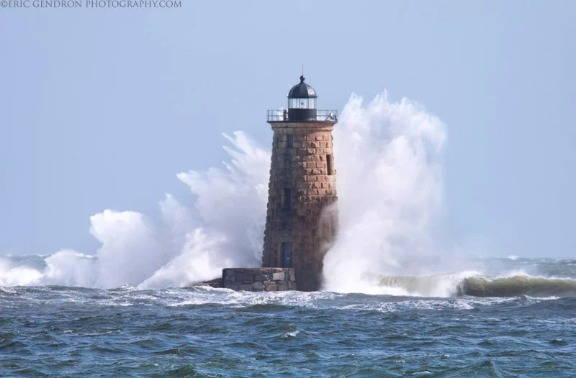
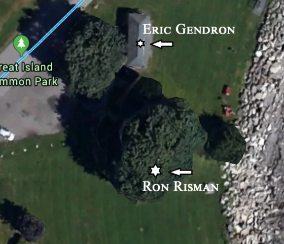
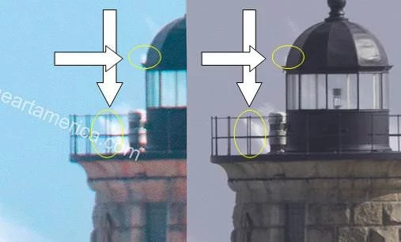

How Two Photographers Unknowingly Shot the Same Millisecond in Time

# How Two Photographers Unknowingly Shot the Same Millisecond in Time

Mar 07, 2018

### 6000

#### Shares

[6.3k Share]()
[360 Tweet]()
[0 Share]()

#### [54 Comments](https://petapixel.com/2018/03/07/two-photographers-unknowingly-shot-millisecond-time/#disqus_thread)

On March 3rd, during a large East Coast winter storm, I headed to the ocean to capture some wave action. My travels eventually took me to Great Island Commons in New Castle, New Hampshire, where Whaleback Lighthouse is prominently featured .8 miles offshore. I was hoping to capture big waves crashing around the lighthouse, and Mother Nature didn’t disappoint.

Great Island Common is a wide open park where people come to picnic during the summer and to watch the ocean during the winter.

After arriving, I set up my tripod and my Canon 5D Mark IV with Sigma 150-600mm lens on a tripod and positioned myself just to the right of a tree in order to help reduce the pummeling Northerly winds. As many of you know it’s a challenge keeping 600mm stable in high winds, even on a tripod.

I set the camera up and then waited until I saw a wave starting to hit the lighthouse. I then kept firing until the splash ended, not knowing ahead of time the action of the wave. Most shots never panned out, but about three of them over the course of about 45 minutes were pretty decent.

Once back at home I culled through the images, and choose one to edit and upload to Instagram, replacing an earlier upload that was done in haste while still in the parking lot. When a local TV station shared the photo to their Facebook page (with permission) it started to receive a large amount of shares, comments, and likes.

However, there was one comment that mentioned that I had stolen the image from another New England photographer, [Eric Gendon](https://www.facebook.com/ericgendronphotography/). After letting the commenter know that it was indeed my image and that I possess the original RAW file, I headed over to the other photographers page and was blown away. We had what looked like the exact same image, taken at the exact millisecond in time, from what looked like the same exact location and perspective.

Photo by me, Ron Risman.

Photo by [Eric Gendon](http://www.ericgendronphotography.com/)

Aside from choices made in Lightroom, the photos at first glance look virtually identical aside from water in front and some of the white caps being in different position. Even then, the white caps were identical in size and shape – and I know those things are easily moved using the clone stamp in Photoshop – so I was concerned that maybe MY image was stolen and altered a bit.

Initially, I only had access to his shared, low-resolution, image so I wasn’t able to make out some of the very fine details that ultimately helped to convince me that we both had originals. After overlaying and aligning the images in Photoshop I was blown away that the lighthouse and waves were carbon copies, almost to the pixel. As mentioned already, there were many differences in the foreground water and the white caps on the horizon, and it was these differences that held me back from claiming he stole my image.

It wasn’t until another local photographer started comparing my photo to a higher resolution version of Eric’s image that he noticed that the iron gating around the top of the lighthouse had slightly different spacing between the vertical bars compared to my image. This would indicate that the other photographer was likely standing just a little bit left of where I was standing.

Since the 60D uses an APS-C sensor he would have also likely been back a little further to compensate for the 1.6x “zoom” / crop of the sensor or using a shorter focal length to compensate. This would also explain the white caps being in different positions.

However, the fact that the lighthouse doesn’t really show any rotational changes and the crashing wave is an exact match – makes this all the more remarkable that these were captured randomly from two different photographers.

The next morning Eric woke up to a flood of messages from me as well as other photographers, and immediately contacted me to share his EXIF data, and to agree that it was astounding that we both captured the exact same image of water motion at the exact millisecond in time. What makes this even more amazing is that this wasn’t a planned event (aka. Sporting event, shuttle launch, etc.).

I also didn’t know Eric; we each chose this location randomly; we both shot with different cameras (60D and 5D Mark IV) with different size sensors; the 60D has a burst mode of 5.3fps, the 5DMKIV is 7fps; we both used a 600mm focal length; our exposures and depth-of-field were almost the same as well (f/8 aperture, ISO 400, 1/1600th shutter vs. f/8, ISO 320, 1/1000th shutter); and ultimately we both selected the same photo from that day to promote. Come to find out we were only 28 meters away from each other. He was hunkered down under a picnic enclosure to help block some of the wind and I was up against a tree to help reduce the wind.

I did a Google search to see how often this happens and could only find one article from 2011 where two photographers filming a surf competition on Huntington Beach ended up catching a virtually identical image of a surfer and its wave action.

If you shoot water in burst mode you know how different each exposure is even when the difference in time is just 1/7th of a second between shots. And I have been leading night-sky photography workshops for five years and have had well over 200 photographers who are often aiming at the same subject, shooting with similar cameras and lenses, and capturing at the same moment in time, even doing continuous shooting for time lapse, and until now I have never seen two images that were so close as to be virtual clones of each other.

While this is a rare occurrence, I believe that with cameras getting faster and photographers taking more time to prepare for their shots, I have to imagine that these situations will happen more frequently. It happens every day with stationary or slow motion objects (buildings, sun/moon rise) but almost never with water movement.

* * *

***About the author**: Ron Risman is a timelapse photographer and owner of [Timelapse Workshops](https://www.timelapseworkshops.com/). The opinions expressed in this article are solely those of the author. You can find more of his work on [Facebook](https://www.facebook.com/ron.risman) and [Instagram](https://www.instagram.com/Timeographer/).*