How We Implemented a Fully Serverless Recommender System Using GCP

# How We Implemented a Fully Serverless Recommender System Using GCP

Just recently we were faced with a quite exciting challenge by our company and I’d like to take the opportunity to write down about it and what we’ve learned along the way.

Our main goal was to work together with our central team at [GFG Group](http://global-fashion-group.com/) to develop a Recommender System capable of interacting effectively with our customers for our different ventures, with one catch: it should be built on top of [Apache-Spark](https://spark.apache.org/); reason being that the team already had a know-how on Spark systems and its management in production environment.

So, in this post, I’d like to write about what implementation we came up with. We had two months to implement something and the final solution ended up being a fully Serverless system built on top of Google Cloud Platform (GCP).

The final algorithm implemented is known as “DIMSUM” and is the one currently running at Twitter as well. Here’s an overview of the implemented architecture of what we’ll be discussing in this post:

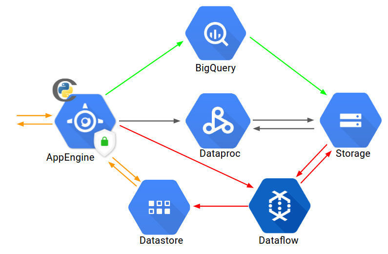

In a nutshell: AppEngine orchestrates calls (triggered by crons) that loads data to our Cloud Storage, builds a Dataproc cluster, process our main algorithm, saves results to Storage again and finally we have a Dataflow pipeline execution that loads the results to Datastore so that Appengine has direct access and can serve recommendations to our customers.

Ok, that was quite of a hell of a nutshell.

Don’t worry about all these operations for now, notice though that we have different colors connecting different elements and those will be discussed separately as they constitute the main blocks of our system. Themes covered in this post will be:

1. Understanding the Algorithm
2. Getting the Data
3. Cron Jobs in AppEngine
4. Dataproc Execution
5. Pipeline Process with Dataflow
6. Making Recommendations
7. Costs Estimation
8. Future Work
9. Conclusion
With no further ado, let’s go!

### 1. Understanding the Algorithm (DIMSUM)

Our first approach was trying to implement the [neighborhood algorithm](http://yifanhu.net/PUB/cf.pdf), a very successful implementation very popular in the Recommender Systems literature, specially in the field of [Collaborative Filtering](https://en.wikipedia.org/wiki/Collaborative_filtering).

It works by basically finding similarity scores between different items (and items here can be products, customers, music, anything in which you can extract some sense of correlation between elements) and uses these scores to predict how much customers will enjoy a given each item.

In eCommerce, for the most part, we don’t know exactly whether a given customer liked an item or not; that means that all we can do is compute general interactions from customers such as “how many times he or she visited this product? Did he put this to basket? Did she purchased it? If so, we try to add values that indicates some sense of likability for that particular item, as implicit as it may be, we still try to extract signal from those actions.

To make it more clear, let’s say we observed 4 customers and their interactions with 2 distinct products (1 means customer browsed the product page):

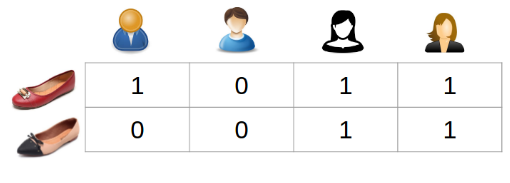

To find a correlation between these two shoes, we use the cosine similarity given by the formula:

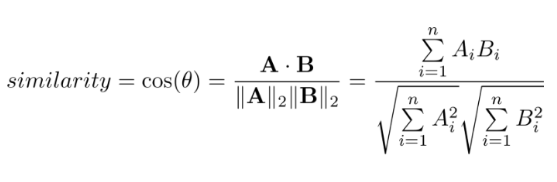

All the equation is saying is the similarity metric is the summation of intersections between products for each customer normalized by those interactions.

If, say, every single customer interacts with both products then the result will be exactly 1 which means both products are 100% similar. Customers who likes one are expected to like just the same the other; if they interact with just one of the skus and not the other then final result will be 0 which leads to the notion that if a customer likes one there’s no expectation that he or she will like the other.

In the previous example we have:
**A** = [1, 0, 1, 1]; **B** = [0, 0, 1, 1]
Applying the similarity score equation we get:

*similarity* = (1 * 0 + 0 * 0 + 1 * 1 + 1 * 1) / √(1² + 0² + 1² + 1²) * √(0² + 0² + 1² + 1²) ≈ 0.82

As you can see, it’s literally an extraction of intersections between products normalized by the all the values on that product.

With these similarities scores we can make predictions of how much customers might enjoy items not seem so far. Let’s take our previous example: if we know that the similarity between red shoes and beige is 82% and suppose we know a customer liked one of them; we can infer that there’s a 82% chance that he will like the other given their similarity score. We can express this notion of making predictions to new items mathematically by:

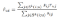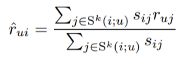

Time to introduce some notation: in the above equation, “u” identifies a given customer at our website; “i” and “j” are identifiers for items, the “r” is a metric that tells us how user *u* interacted with an item so in our previous example it’s the 1s and 0s. The “s” is the similarity we just computed, so “s_ij” is the similarity between item “i” with “j” (in our example, “i” could be the red shoes and “j” the beige one).

So all the formula is saying: to predict how much user “u” will like item “i”, expressed by the “r” with the “^” symbol, we observe all items that he or she interacted with; we observe the similarities between those and the one we want to make the prediction, multiply all the interactions by the similarities and sum everything up (the division is a way of normalizing the equation and in practice we don’t apply it as recommended by the literature). I know it sounds confusing, but given that an image is worth a thousand words, here’s a depiction of how it works:

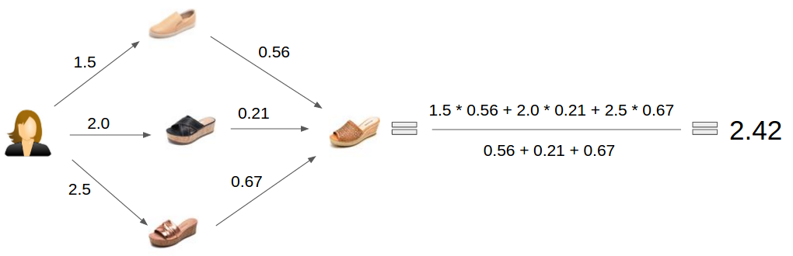

In this case, our customer interacted “1.5” points with first sku, 2 with second and 2.5 with third. The similarities between those same products and the one we want to make the prediction is 56%, 21% and 67% respectively. Therefore, for us to predict how much this customer will enjoy the fourth product we multiply the interactions and similarities of each sku we know about the customer, sum everything up and normalize by the similarity scores which results in 2.42. This is an expectation of how much we predict our customer will enjoy this particular item.

And that’s pretty much it! In summary, neighborhood observes all interactions of customers and items and extract these similarities metrics between them which allows us to predict how customers will enjoy new items.

There’s one problem though and here is where the challenge begins: at Dafiti (one of the ventures from GFG), we have millions of customers visiting our website everyday and they can potentially interact with some other hundreds of thousands of available products.

If you take Dafiti’s data and try to find all interactions of customers and items and then try to build all similarities between all products you’ll find your computer/cluster exploding and burning into flames after a few seconds in. And if you do that in some shared cluster make sure to leave the building ASAP (remove digital prints before doing so*).

Well, as it turns out, there’s smarter ways of doing it and here’s where we started making some considerable progress in our challenge.

#### 1.1 The DIMSUM Approach

As using Spark was a mandatory request for this project, we searched for ways on how to implement cosines computation in a MapReduce fashion; what we found is that the framework is basically a pipeline of steps where you can map your input value to new values and reduce it (if you ever need so) to aggregate results into some final metric. Main idea therefore is: apply map to transform data and if you need some aggregation (you normally do) then use some reduce operation.

And if you think it through, you’ll end up realizing that it’s actually quite simple to implement some neighborhood approach in a MapReduce framework: we have our training data which contains users and their interactions with products (we’ll discuss more about those later) so we can arrange it like:

{“user”: “user_0”, “items”: [{“sku”: “sku_0”, “r”: 1},
{“sku”: “sku_1”, “r”: 2}]}
{“user”: “user_1”, “items”: [{“sku”: “sku_0”, “r”: 2},
{“sku”: “sku_2”, “r”: 1}]}
(...)
{“user”: “user_m”, “items”: [{“sku”: “sku_0”, “r”: 2},
{“sku”: “sku_n”, “r”: 1}]}

In other words, we can arrange it to *m* users and their interactions for potentially *n* items (remember that we do not save “zero” values as this would consume huge amounts of memory unnecessarily).

As the cosine metric looks for correlations between products on a customer level (if a customer interacts with both items then their intersection grows), we can use this simple algorithm to extract similarities:

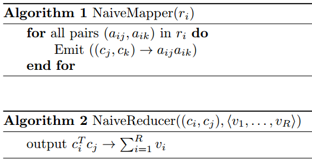

Notice that this algorithm is not extracting the cosine similarity per say as it’s not normalizing by the norm of each sku vector of interactions; in practice, we still need to make this normalization (this is quite simple and we’ll show you how we did it). Visually, it’s something like this:

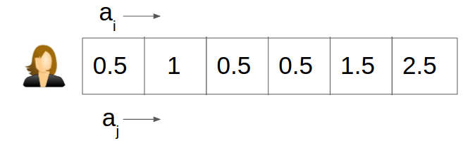

For each customer we have this double “for” corresponding to each “ai” and “aj” where we scan through the vector emitting ai * aj.

We took this algorithm from [Reza Zadeh’s paper](https://stanford.edu/~rezab/papers/dimsum.pdf) discussing the DIMSUM implementation at Twitter (it’s quite an amazing read and if you are a Data Scientist or enjoys this area in computer science I highly recommend the read, it’s certainly worth it).

Well, this algorithm is called the “NaiveMapper” (for a good reason). For each row representing a customer, we make a cross-product between all items. Say, for instance, a given customer interacted with skus 0, 1 and 2; we might end up with (just an example, the numbers were written randomly):

[((sku0, sku0), 1),
 ((sku0, sku1), 2),
 ((sku0, sku2), 0),
 ((sku1, sku0), 2),
 ((sku1, sku1), 2),
 ((sku1, sku2), 1),
((sku2, sku0), 0),
((sku2, sku1), 1),
((sku2, sku2), 1)]

The step of extracting all these correlations for each customer is our mapping phase (or “*Shuffle Phase”*) whose BigO is *O*(mL²) (“L” is the maximum number of interactions a customer had in our whole training set). Well, if you are a developer you certainly already know what happens when we have *O*(n²): smooooke on the waaaaateeeer…

Not good. Not necessarily infeasible but mainly not that…cool. As in Dafiti *L *can be potentially thousands of skus and *m* is millions, you see the problem we have in hands. Well, DIMSUM is the way to break this problem into a more tractable one by implementing this new algorithm:

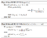
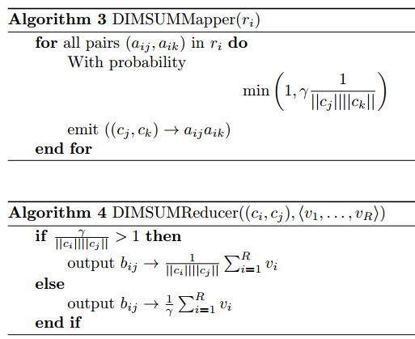

It’s the same idea with one smart change: now we have this scalar “γ” that works as a sampling rate for the emission of correlations in the shuffle phase. But it’s not just adding a simple scalar and “voilá”, it’s done! We need some rigorous mathematical analysis to understand what are the trade-offs of having this sampling happening!

I’ll take the time now to explain a bit further how it works but the next mini-session is totally “skip-able”.

(I’ll be following Rezab’s paper notation thoroughly). As we already discussed, let **A** be the matrix whose rows are customers and columns are products and values in each cell corresponds to some implicit metric of how much our customers enjoyed a given item (say each time he browsed a product we add 1 point for instance).

As previously discussed, for each row we iterate over all products interactions building combinations and emitting those values to the Reduce phase. Now that we have a sampling rate for the emission, it must follow for each intersection:

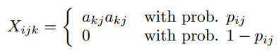
And:
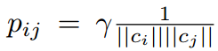

The “‖ci‖” is the norm of the product vector “i”. That means that the more interactions a product has the less likely we are to emit its values; the reasoning is that we already have lots of information about it so we can afford to emit a bit less information and still converge to the real similarity value within a bounded error.

**X** is a [random variable](https://www.khanacademy.org/math/statistics-probability/random-variables-stats-library/random-variables-discrete/v/random-variables) since it follows now a probability distribution and the final similarity score is the normalized summation of these Xs which gives us:

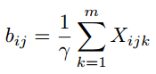

Ok, I confess, I just couldn’t understand where the “γ” came from; as it turns out, it’s quite simple: the similarity is the summation of the “X” normalized by the norms of each product vector (as we discussed in the beginning of this post). But given that we are emitting these values with a given probability, the expected value will be multiplied by this probability as well.

That means that if we do not correct for this effect, we’ll end up with something like “p * similarity” as for the final result. This being the case, we need to divide by “p” so that the expected value converges to the real value. But given our equation for probability, if we divide the cosine by “p” we cancel out the norms of the skus and the “γ” will remain in the denominator.

It’s possible to deduce the following: if γ = Ω(n/ε²) (that is, the sampling rate is proportional to the amount of products in training data divided by the squared expected relative error between true value and estimated one) then:

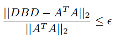

With probability of at least 50%. **B **is our similarity matrix and **D** is a diagonal matrix whose each value in the diagonal is the norm a correspondent product. The deduction is somewhat extensive and we won’t go through here, still the paper has a thorough deduction of each step).

This formulation also leads us to the following: if γ ≥ α/ε for a given α ∈ ℝ¹ then:

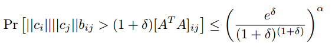
And:
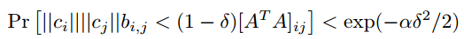

This gives us a upper and lower limit for how wrong we may end up being in our computation given the value we’ve chosen for γ. The bigger α is the lower are the chances of computed value being too far away from true value, for a given bounded error ε.

The beauty of this all: our shuffle phase ends up having *O*(nLγ/H²) where “H” is the smallest nonzero entry in **A** after we scale it to be between 0 and 1.

This is the reason the algorithm is called “DIMSUM” which extends for “**Dimension Independent Matrix Square Using MapReduce**”: notice that, before, this value was *O*(mL²) and now it’s completely unrelated to how many customers we have in our training data! The “m” is gone and now we basically have a linear *O* which allows us to process huge amounts of data, build our similarity matrix and have some guarantees that obtained values are converging to real values given defined boundaries.

The Reduce phase will be just a summation so the best strategy here is avoiding to emit too many values to this phase.

And that hopefully is a good enough of an introduction to how we compute these algorithms using MapReduce framework. There’s definitely some heavy mathematics behind it but still it’ll allow us to make all sorts of linear algebra operations on matrices as effectively as possible, given bounded errors we’ll be trading-off.

What changes therefore is the following: remember our previous example on the emissions for each customer? If we take the same example, now with DIMSUM we might end up with something like this:

[((sku0, sku0), 1),

((sku0, sku2), 0),

 ((sku1, sku2), 1),
((sku2, sku0), 0),

((sku2, sku2), 1)]

The absent values are no longer being emitted as now we have a probability of emitting each correlation.

When implementing the algorithm we’ll be making a small adaptation to the mapping phase, like so:

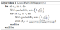
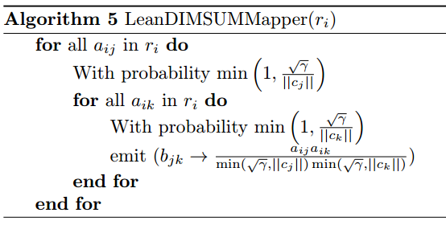

Which reduces not only the emissions but also the computation required as the second “aik” is computed only if the first “aij” has been accepted in the sampling scheme.

And that’s pretty much it! We basically need to extract correlations between products for each customers but doing so in big data is unfeasible for the most part. We, therefore, use sampling techniques to bring the *O* to much lower value ranges so we can implement all sorts of linear algebra operations to data.

Well, we are ready to start implementing DIMSUM!
Kinda…

We still need data to feed the algorithm! Data is the new gold so…let’s dig for it!

### 2. Show Me The Data

This is what we’ll be talking about right now:

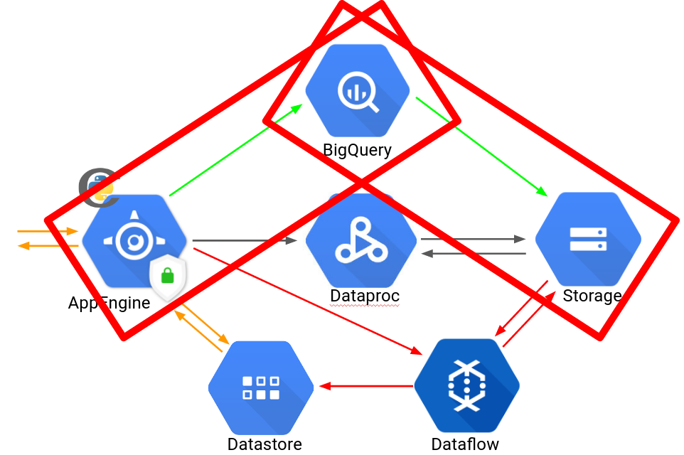

First tools we used to come up with our Serverless implementation were AppEngine, BigQuery and Cloud Storage.

[BigQuery](https://cloud.google.com/products/big-data/?hl=pt-br&utm_source=google&utm_medium=cpc&utm_campaign=latam-BR-all-pt-dr-bkws-all-all-trial-b-latam-1002243-LUAC0000358&utm_content=text-ad-none-any-DEV_c-CRE_204833483167-ADGP_BKWS+%7C+Multi+~+Bigquery+Google-KWID_43700022301561115-kwd-302438885959-userloc_1001773&utm_term=KW_%2Bbigquery%20%2Bgoogle-ST_%2Bbigquery+%2Bgoogle&dclid=CL_tiJTPgNgCFQcchwodeagASQ) is basically a genius implementation of a new concept for a database that is designed to work with big data as easily as possible. There’s no indexes nor any infrastructure you need to take care of. You just load your data there and it just process everything you need, on-demand, on-the-fly, on-freaking-awesome.

We used BQ to transform our data from [Google Analytics](https://support.google.com/analytics/answer/3437719?hl=en) to a format that our algorithm in Spark could work with; as we were working with our central team at GFG, we used the same input schema as theirs for production environment. Here’s an example of the data we feed our algorithm with:

user,productSku,type
95106786645166913,AG672APF78UCF,1
8897887309145128270,FI911APF10HUZ,2
1153521620412862249,CO515APM42GTT,2
1819629928011287314,FI911SHM06PUF,1
1133082218947946503,JO546APM50KFT,3

Some points to make: remember from our previous discussion that we track signs from customers to implicitly infer how much a given customer enjoys a given item? So, here’s how we make it: “1” means that the customer browsed a given product; “2” the product was added to basket and finally “3”: the product was purchased.

We infer therefore that user `95106786645166913` browsed on product `AG672APF78UCF` , user `8897...` added `FI911APF10HUZ` to basket and so on.

For now, this is just an indication for us. A customer browsing an item does not mean at all that he or she likes it. But it’s also an implicit signal that we don’t want to get rid off; if the same customer adds the same item to basket we have something more meaningful than just “a browsing” and the same goes for purchasing. Notice that a customer buying a product still does not mean that he or she likes it. Maybe it was a gift for somebody else, maybe he returns the item later on, maybe he’s in a hurry and had to buy what he found first...this is the query we run to extract these values:

So far so good! But if we want a Serverless solution, we need somehow to trigger this query execution automatically, without having a machine with a cron service running.

This is where [AppEngine](https://console.cloud.google.com/appengine?src=ac) comes into play.

### 3. Bless the Crons

Google AppEngine is, in a nutshell, a [Serverless WSGI](http://wsgi.readthedocs.io/en/latest/what.html) server where you can upload routes, their associated functions and directive rules; just build the code associated to each route and deploy to GAE and it will just work: auto-scaling, traffic allocation, logging, authentication, memcache and many other features.

I’d like to right now already show you an example of one of our code deployed for managing the crons we’ll be talking soon. This is known as our **main.py** service:

Notice this is a [Flask](http://flask.pocoo.org/) application with one route rule specified: for requests having a URL with pattern `/run_job/job_name/` will trigger the `run_job()` function (where later on we’ll be scheduling our tasks in GCP). This is basically the code you deploy to GAE and it take care of the rest.

If you read GAE docs, you’ll notice there’s two types of environment where you can upload your code: Standard vs Flexible.

Main difference is: Standard runs in a [sandboxed](https://en.wikipedia.org/wiki/Sandbox_%28software_development%29) environment that blocks several things such as running user C code, multi-threading/processing, writing to disk and so on. What you get in return is the possibility of scaling down to zero machines, as well as a set of tools only available in this option, such as the [NDB](https://cloud.google.com/appengine/docs/standard/python/ndb/) library (designed by BDFL Guido Van Rossum).

Flexible Environment, on the other hand, receives a Docker image where you expose a port that routes traffic to an internal WSGI server (for Python, [gunicorn](http://gunicorn.org/) is quite popular and will be used later on in this post) which guarantees you can install pretty much anything. The downside for the flexibility is that creating a new instance for the auto-scaling is more time consuming and thanks to that there’s always going to be at least one machine running all the time, i.e, you can’t scale down to zero instances in this option.

So a good rule of thumb we use is: if what we are designing will have large periods of inactivity (no requests) then we go with Standard; if more advanced coding is required (such as multiprocessing and C based processing) and is always receiving requests non-stop, go with Flexible.

Well, you might be asking: “What this all has to do with us being able to run cron jobs for the queries in BigQuery”?

No worries. Let’s talk about that!
This is what we’ll be discussing now:

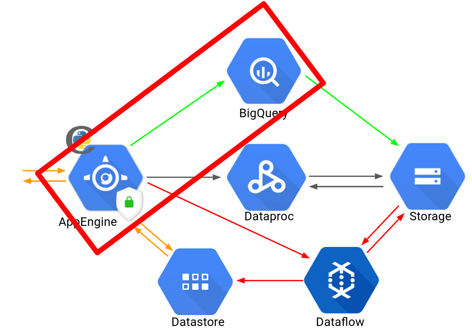

GAE has native support for Serverless CRON triggers. All you have to do is specifiy a URL that will receive a GET request and you just code whatever you need in that URL. You’ll have to deploy a [cron.yaml](https://cloud.google.com/appengine/docs/standard/python/config/cronref) file specifying routes and rules; here’s one example from the official docs:

`#cron.yaml[[NEWLINE]]cron:[[NEWLINE]]- description: "daily summary job"[[NEWLINE]]  url: /tasks/summary[[NEWLINE]]  schedule: every 24 hours`

This means every 24 hours a GET request will be issued to the URL `/tasks/summary.`

There’s one important requirement in GAE: requests must be completed within a 60 seconds time frame as otherwise you’ll have to schedule the operation to join a [queue](https://cloud.google.com/appengine/docs/standard/python/taskqueue/) and the task will be processed as a background one, outside of the input request.

We want our cron to run a query in BigQuery and then export results to GCS; this can potentially take more than 60s so we created a [scheduler](https://cloud.google.com/appengine/docs/standard/python/taskqueue/) for the cron to initiate when the specified time trigger occurs.

Basically, what happens then is: our cron issues a GET to our main router which in turn adds a task to our scheduler defined by (we used the concept of [push queues](https://cloud.google.com/appengine/docs/standard/python/taskqueue/push/) in this case):

So far we have: a cron that issues a GET request to `/run_job/job_name` which in turn adds to our task queue a job associated to URL `/export_customers` which in turn runs our query and extraction operations. Gosh that is confusing! Maybe a picture helps a bit here:

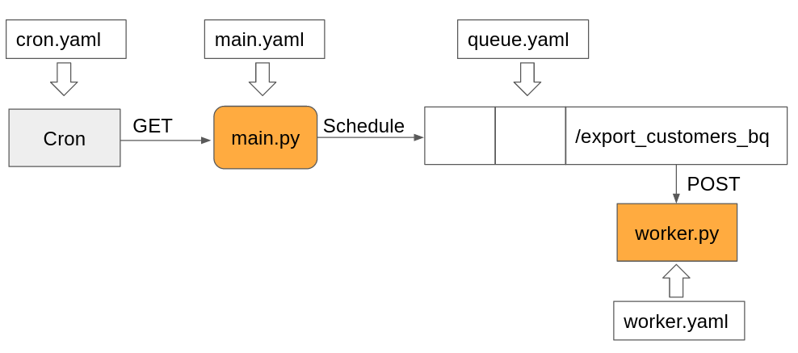

Our main service is defined by this [yaml](https://cloud.google.com/appengine/docs/standard/python/config/appref) file:

This is where our discussion about Standard vs Flexible comes into play: we don’t need those machines up and running all the time. Only when they are processing the scheduled tasks; if we don’t specify an environment in this ymal file, then standard is deployed by default.

So now we can setup a cron that looks for the service “dataproc-twitter” and find in the handlers definition where to redirect the request, that is, the application called “app” inside the file called “main.py”. This is our yaml definition for the workers that will run our scheduled processes in background:

We also need to define a rate at which our [queue](https://cloud.google.com/appengine/docs/standard/python/config/queueref) will be processed. This is simple, for our project we did it like:

And finally, our cron:

Deploying to GAE is quite simple; [gcloud](https://cloud.google.com/sdk/downloads) is required to be installed, after that, we just run:

`gcloud app deploy main.yaml worker.yaml`
And that’s it. The other deploys goes like:
gcloud app deploy queue.yaml
gcloud app deploy cron.yaml
In GCP dashboard there’s an update to everything that is happening:
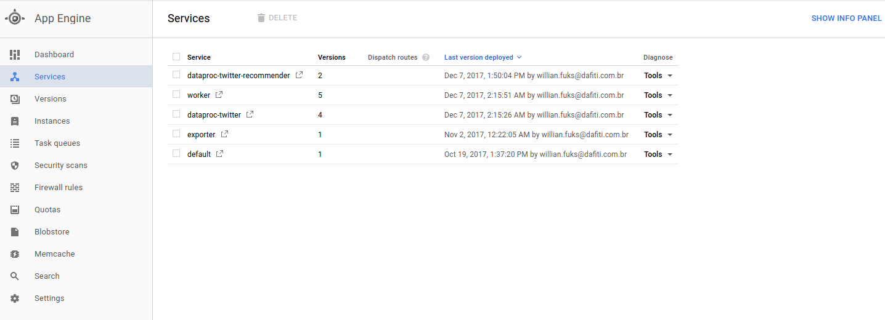
As well as information about the crons that we just installed:
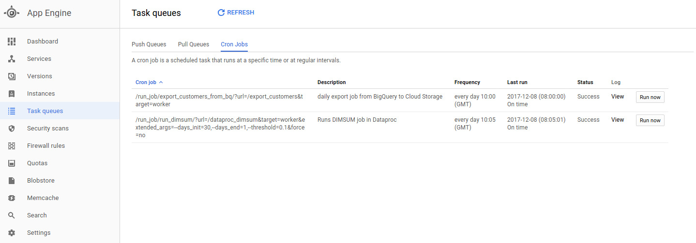
(The cron “run_dimsum” will be explained later).

Well, now we already know how to run Serverless cron jobs in GCP. Let’s go to the Spark implementation then!

### 4. Dataproc PySpark To Heaven

In a nutshell, Dataproc is a Google fully managed cluster that already have Spark builtin ready to go. You basically specify how many workers you want and pretty much it, hit the play and wait a few minutes for the cluster to be created.

Well, as previously discussed, we aimed to implement the DIMSUM algorithm in Spark. First thing we created was a cron based trigger that when initiated builds a whole cluster for us, process the Spark job and when it’s over, deletes the cluster. Why is that? So costs plummet. We literally pay for what we use and nothing more.

So, let’s do it! Here’s what we’ll be discussing now:
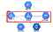
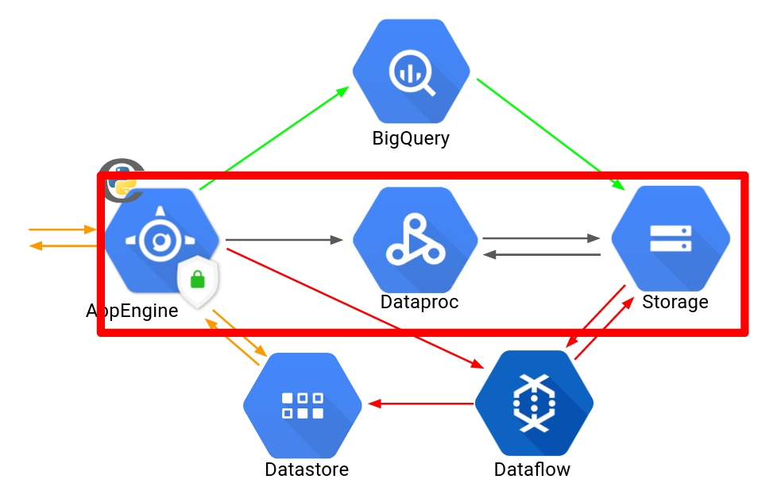

We already have our cron job receiver as well as the scheduler worker. This is the [code](https://github.com/WillianFuks/example_dataproc_twitter/blob/master/gae/worker.py) we used to run all these operations:

What is happening here is: first our cron job will send a GET request to the URL `/run_job/run_dimsum/.` This in turn will schedule a task that is triggered by the URL `/dataproc_dimsum` which runs the function `dataproc_dimsum().`

What this function does is:
1. Creates Spark cluster
2. Uploads the PySpark files required to run the jobs to GCS
3. Runs the PySpark job
4. Deletes the cluster
5. Schedule a task to start the Dataflow extraction from GCS to Datastore.
With this in mind, we can dive into understanding the PySpark jobs.

#### 4.1 PySpark

Here’s how we like to work with Dataproc. First we usually create a very small cluster with `n1-standard-1` machines with [this script](https://github.com/WillianFuks/example_dataproc_twitter/blob/master/dataproc/bin/create_cluster.sh) and run it like

`./create_cluster -n=cluster_name -b=bucket_name`

Important catch here: if you pay close attention the the `gcloud` command, you’ll see that there’s a `jupyter.sh`initialization-action. What this does is prepare our cluster with a J[upyter-notebook](http://jupyter.org/) service ready to use to which we create a ssh tunnel (you can see how we do that in this [folder](https://github.com/WillianFuks/example_dataproc_twitter/tree/master/dataproc/bin) in files [utils.sh](https://github.com/WillianFuks/example_dataproc_twitter/blob/master/dataproc/bin/utils.sh) and [launch_jupyter.sh](https://github.com/WillianFuks/example_dataproc_twitter/blob/master/dataproc/bin/launch_jupyter.sh)).

[This is an example](https://github.com/WillianFuks/example_dataproc_twitter/blob/master/dataproc/notebooks/df_naive.ipynb) of how our Notebook looked like when we completed the implementation:

On the main repository used as basis for this post you can see in folder “dataproc” the folder “notebooks”. The cool thing about those is that you can see how helpful this tool can be when working with PySpark. I literally open up a pyspark-notebook and start testing everything possible: all testings, questions, observations, all at once one after the other.

This ends up being a huge time savior when developing as you test on the-fly quite easily and fast. If you check my notebooks you’ll see that I don’t even follow the lines, I start at one line, then I jump over to the bottom, then I come back to the beginning. It doesn’t really matter, what does matter is testing quickly, prototyping as fast as possible and then building the final code accordingly (still notice that all of our jobs are unit tested so we have some guarantees the code is working).

With that in mind, here’s how we approached the job development for our DIMSUM algorithm. First, we created a [base](https://github.com/WillianFuks/example_dataproc_twitter/blob/master/dataproc/jobs/base.py) file with general helper functions; here’s part of it:

When working with Spark you usually start by creating a `SparkContext` which sets general guidelines about how Spark should run the jobs. Notice in the method `process_day_input` the MapReduce operations happening; first, we read from `textFile` source and then a set of map and reduce operations follows.

Remember that we mapped our customers behavior to “1” for browsing a given sku, “2” for when it was added to basket and “3” for when purchased happened? Well, here we transform those numbers into a final score that indicate to us implicitly how much a given customer is likely to enjoy a given item.

To do so, we make this mapping: `{"browsed": 0.5, "basket": 2., "purchase: 6.}` (in production at Dafiti we have different values which are obtained through [Bayesian Black-Box Optimization](https://en.wikipedia.org/wiki/Bayesian_optimization); as discussing these is not the main focus of this post, we’ll probably do that on another opportunity).

Each time a customer browses an item we add up 0.5 points; if it’s added to basket then 2 points and 6 points if purchased. This is a sample of the output we get:

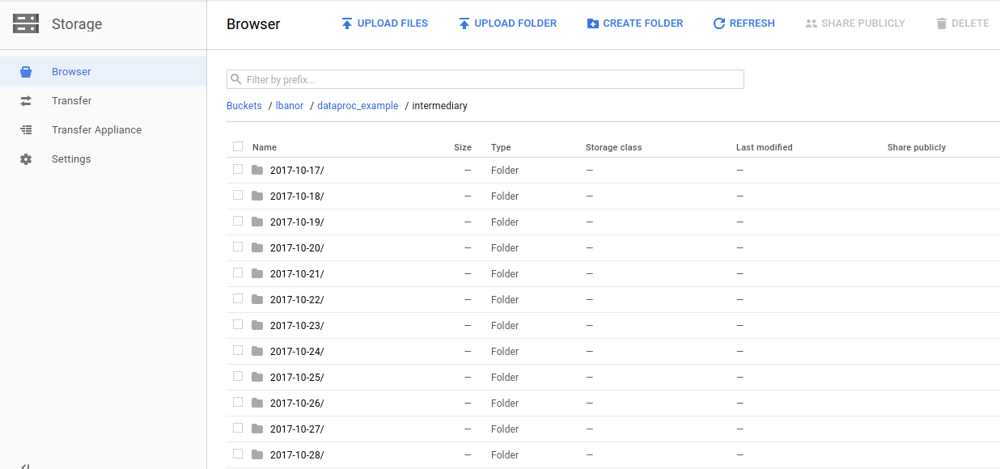

{“user”:”8291743389332496534",”interactions”:[{“item”:”RE499APM08ZTZ”,”score”:0.5},{“item”:”RE499APM85DGC”,”score”:0.5}]}

{“user”:”5843584611541988560",”interactions”:[{“item”:”SA232SHF47ZZO”,”score”:0.5},{“item”:”SA232SHF89GXI”,”score”:1.0}]}

{“user”:”6935962925703084781",”interactions”:[{“item”:”DE996ACF83KYE”,”score”:0.5},{“item”:”CR177ACF76BIH”,”score”:0.5},{“item”:”MA318ACF62LRP”,”score”:0.5},{“item”:”DE996ACF23CIQ”,”score”:0.5},{“item”:”QU097ACF76IKL”,”score”:0.5},{“item”:”QU097ACF44IPN”,”score”:0.5},{“item”:”QU097ACF77IOG”,”score”:0.5},{“item”:”DE996ACF50CHP”,”score”:1.5}]}

With this process complete, we are ready to finally run the [DIMSUM](https://github.com/WillianFuks/example_dataproc_twitter/blob/master/dataproc/jobs/dimsum.py) implementation:

This script basically scans through all the intermediary data we computed in the previous step aggregating all customers interactions into a single row (this is our matrix **A** we discussed in the beginning) and then executes the `run_DIMSUM` method. Notice first the broadcasting of `pq.` This is a computation for the probability of each product and their normalizing factor for the emission of the correlation (ai * bi). When we broadcast something in Spark, the object is serialized and spread over the net of workers so they have in their memory direct access to the object; we broadcast a dictionary with information of each sku to improve performance.

Notice the DIMSUM script basically loops through all interactions of our customers and emits the correlation when the probability of doing so outperforms the generation of a random number (the idea is trowing a dice and seeing whether to release the number or not).

And that’s basically all there’s to it. Despite of all the complicated equations, the final implementation ends up being quite simple. After that, result is uploaded to GCS; a quick sample:

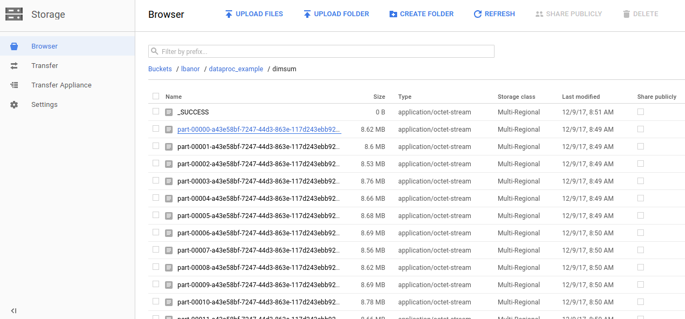
{“item”:”LO611APF49EBY”,”similarity_items”:
[{“item”:”DI944APF23XPS”,”similarity”:0.017922988},
{“item”:”ME700ACF75HAQ”,”similarity”:0.035410713},
{“item”:”LO611APF47ECA”,”similarity”:0.1254363},
{“item”:”TR943APF03NGY”,”similarity”:0.024296477},
{“item”:”CA700APF63DSU”,”similarity”:0.044455424},
{“item”:”LO611APF43ECE”,”similarity”:0.33709994},
{“item”:”LO611APF41ECG”,”similarity”:0.07137738},
{“item”:”LO611APF80EAT”,”similarity”:0.02228836},
{“item”:”LO611APF84EAP”,”similarity”:0.03180418},
{“item”:”DE234APF58ION”,”similarity”:0.013907681}]}

Notice here we don’t sort the result by the similarity metric. This is done in our Dataflow pipeline, speaking of which…

### 5. Gotta Beam`em All!

Just after results are saved to GCS, a new task is scheduled to retrieve this data to Datastore. This is what we’ll be talking about now:

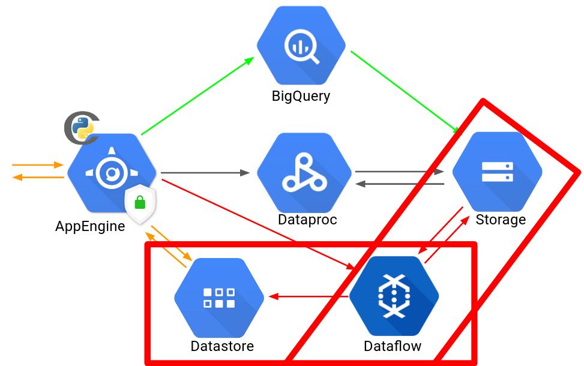

[Datastore](https://cloud.google.com/datastore/) is a NoSQL database from Google and it has direct integration with AppEngine which makes things 100x easier and faster. What we want to do now is to upload results there in a key-value fashion so that when a request to our system arrives asking “What should I recommend to a customer that likes this red shoes?” our system can query over Datastore and retrieve all the similarities required to come up with an answer.

There’s one problem though: how to save results from GCS to Datastore?

That’s where [Dataflow](https://cloud.google.com/dataflow/) comes into play! Dataflow is a Serverless framework ready to compute general ETL tasks by running a unified model for data processing (which means that it has the concept of an “engine” or “runner” and you can choose which engine to run: Dataflow, Apache Spark, Flink and any other tool that follows the unified model).

[Apache Beam](https://beam.apache.org/) is the tool required to create the pipeline operations. It’s an open source project and currently has support for Java and Python SDKs (even though unfortunately the Python implementation has been lagging behind Java’s, it still already offers lots of features).

Well, what we have to do now is implement a pipeline process that reads the results of DIMSUM saved in GCS, process it accordingly and saves results to Datastore. Here’s our pipeline [implementation](https://github.com/WillianFuks/example_dataproc_twitter/blob/master/dataflow/build_datastore_template.py):

Here we used the concept of [templated Dataflow](https://cloud.google.com/dataflow/docs/templates/overview): basically all it does is create the necessary code and json metadata exporting it to a location path in GCS; the advantage is that any other client at any other time can run the template just by issuing a HTTP request pointing to the template location. That means that it’s not necessary to re-compile the code or to have the whole environment setup. This is quite valuable for us as we are working in Standard GAE (remember everything so far has been activated by crons) and the sandboxed environment would not allow us to run a beam pipeline there.

With the templates it really doesn’t matter what environment and restrictions we may have, we just issue a GET request to the job execution and it happens automatically; here’s an example of our processed pipeline.

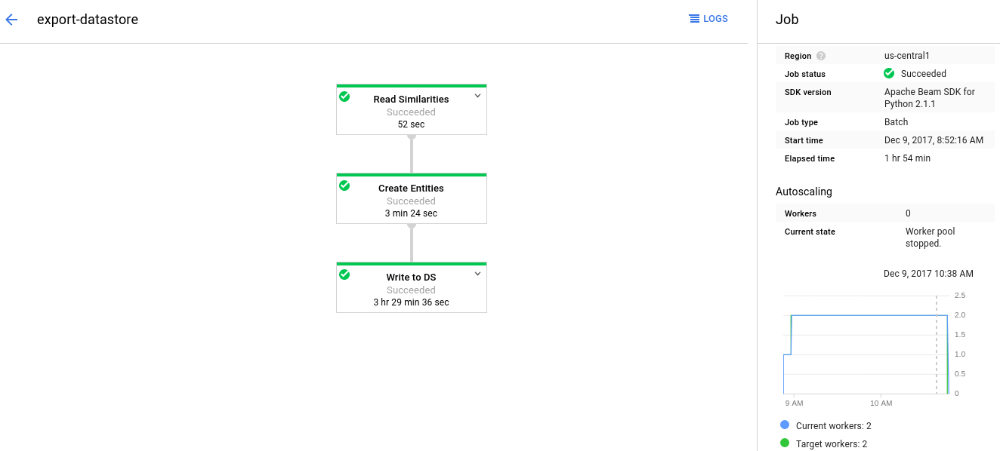

Cool thing to notice: we setup our pipeline execution to have at maximum 2 workers; Dataflow knows automatically when to spawn more workers so to optimize total costs in a viable time frame.

One thing you may notice though is the quite long time consumed when writing our entities to Datastore. I’m not sure why this is happening and luckily this is not a problem for us as this process runs at night, but I’d expect the writing step to be way faster than it currently is (if you know how to improve performance please let us know :)!). Maybe there’s some optimization step that we missed but as our deadline to deliver the product was reaching its end this is how we delivered the product so far.

With our data being ready to go, it’s time to serve the recommendations. We’re getting there!

### Madame, Monsieur, ceci est pour vous.

(I don’t speak French so I just hope the Translator got it right) Here’s what we’ll be discussing now:

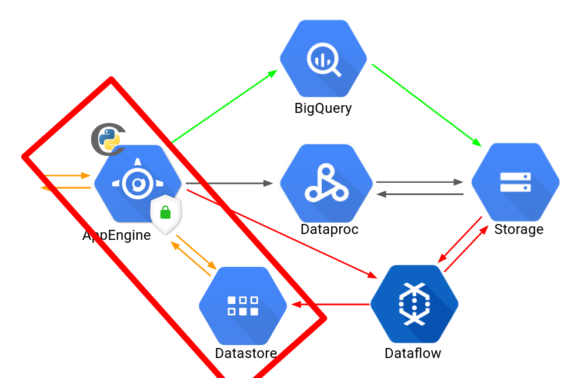
So, let us recommend!

Remember from our introduction that this is how we compute the final recommendations:

In practice, we don’t make the normalization (the similarities summation in the denominator) as this is suggested by the literature.

This means that we can take all interactions customers had with items, come up with an implicit score metric “r” and multiply similarities between items and those scores to predict how much a given customer will enjoy a given product we may recommend. Seeing the code might make this easier to visualize. This is our first [implementation](https://github.com/WillianFuks/example_dataproc_twitter/blob/master/gae/main.py) to accomplish that:

And `process_recommendations` is given by:

This is how it works: we receive input requests like this:
/make_recommendation?browsed=CA278SHF46UJH

Which means: “I have a customer who browsed on item CA278SHF46UJH, what are your recommendations here?”

And then we implement the equation by looping through all similarities that CA278SHF46UJH had as output from DIMSUM and order from best to worst and select only top “n”.

All this said, this is what we got:
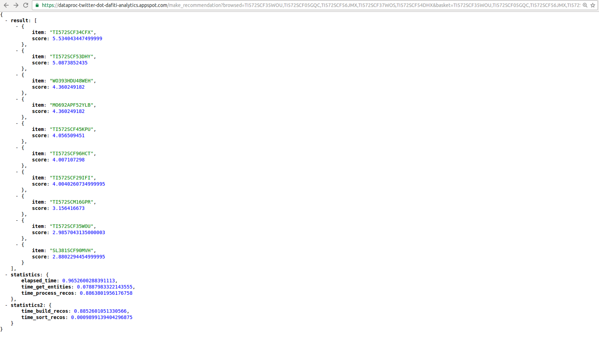

Yeap, that’s right. A bizarre disaster...it took almost 1 entire second to process the recommendations. And from that 1s, **800ms in just one single method!**  `process_recommendations` here ended up being a disaster.

Don’t get me wrong, this is a big failure. If you develop a recommender system that takes 1s to respond you won’t be attracting that many customers nor making them happy by waiting; this is ugly and ineffective.

Well, that would mean that all of our endeavor so far has failed greatly. But we had still one last trick up our sleeve: we’ve been using Standard environment all this time due its simplicity and capacity to scale down to zero instances if so required to. But this time, the sandboxed feature has been probably hurting more than helping and reality is a recommender system very likely will always be receiving requests; this is the case for Dafiti and many of our ventures so it doesn’t make much sense to keep using Standard.

Our time was short so we quickly migrated environments and started using Flexible Environment with another big trick being played: we decided to [cythonize](http://cython.readthedocs.io/en/latest/) the `process_recommendation` operation.

Well, this is the beauty of Python: *“premature optimization is the source of all evil”*. This is a fundamental truth in code development. Python served us greatly so far and it made us as productive as possible. But in this particular method, it certainly didn’t do a very good job so a workaround for that is to use Cython to get some performances boosts; Cython is basically a language that is capable of mixing Python and C/C++.

The advantage here is, for the most part, that Python treats every single object as…well, an object. That means that the concept of “int” does not quite exist in Python. In practice, ints are encapsulated by an object that contains an int. This is amazing and bad, just depends on how you look at it (or rather how you use it). This gives Python all the flexibility it has and all the coding implementation speed it offers but the trade-off is performance. What we can do in Cython though is to remove those questions that Python has to make on each object like “ok object, what are you?” and we can just say beforehand: “This is an array of ints, you don’t have to ask what those are anymore”.

[That’s what we implemented](https://github.com/WillianFuks/example_dataproc_twitter/blob/master/gae/cythonized/c_funcs.pyx) in Cython:

Here’s a Cython profiling on requests done to the Python-API:

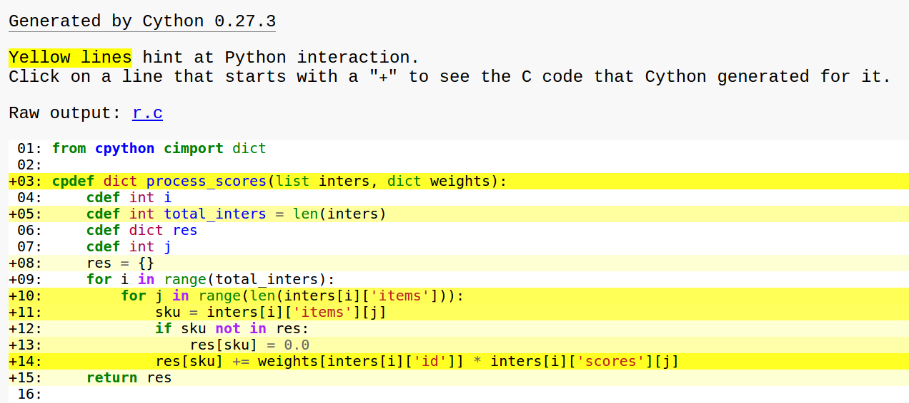
Well….kinda….ok.

This code already made our processing **7x** faster on our local computer. That’s quite cool! But notice in the profiling the yellow lines: the stronger it gets the more requests to the Python-API is made. As our input is a list of dicts, Cython cannot convert it directly to any C structure. This means that those objects are still treated like so in Cython and we don’t get as much of a performance gain as it would be possible had those conversions being successfully made.

Still, no worries. We created then a separate [service](https://github.com/WillianFuks/example_dataproc_twitter/blob/master/gae/recommender.py) for the recommendations, this time in flexible environment:

Notice the `cy_process_recommendations.` This is where our call to the Cython script is being made.

Deploying to flexible in our case is just as simple as standard. We have our [requirements.txt](https://github.com/WillianFuks/example_dataproc_twitter/blob/master/gae/requirements.txt) file already defined so we just run:

`gcloud app deploy recommender.yaml`
And now, these are the new results:
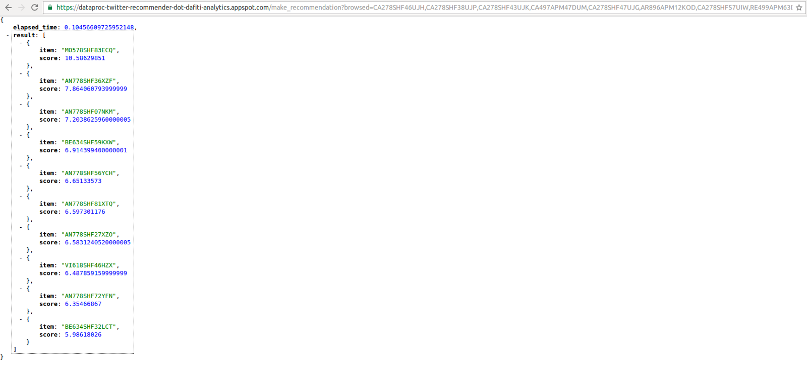

Whole processing time went from 1 second to **104ms.** This is for quite an expensive request with several skus as input. Simpler inputs we get:

Somewhere around **20ms **(it’s important to note that Datastore standard deviation on response time is somewhat considerable but average and median remains around this value).

The main bottleneck now is retrieving the keys from Datastore and as the time consumed is totally acceptable, we could consider our mission accomplished by now (oooh yeeeah!!!)

One thing that happened here is the time to get entities from Datastore became much bigger; this happened because we had to change the client to make the connection and it uses HTTP instead of [gRPC](https://grpc.io/) which means we can make time decrease even lower with a more appropriate client.

This is an example of results we get for this input `/make_recommendation?browsed=DA923SHF25QXA`:

### 7. Show Me Da Money! (costs)

Costs are important, still, in practice what really matters is cost-income ratio, not just cost.

While I can’t make public Dafiti’s data and costs, let us see how a system like this would cost for a simulated eCommerce.

First of all, we have the Standard AppEngine cron service. This cost is basically negligible, it probably will be $1 per month. Now we have BigQuery making the data processing, which, assuming process 100 GB everyday, adds $15 in queries per month. Lets simulate a Dataproc cluster running everyday for roughly 2 hours, 3 machines of type n1-standard-4 which adds $36 a month. We also have the Dataflow machines but as the bottleneck is the writing operation we can use quite basic instances n1-standard-1 which, assuming 3 hours of work with 2 workers adds up $9 a month. Now we have Datastore. As each 100k writes is $0.18, assuming 300k ends up being around 16$ per month. Now let’s say the eCommerce is big and has around 5 million requests everyday. That would be $90 a month. There’s also price for storage. If we consume 5GBs that leads to just $1 at the end of the month. Finally we have the Flexible Environment machine. Here we choose a quite basic machine since we saw main bottleneck is Datastore. Considering we’ll be using 1 vCPU and 2GB of memory this gives us roughly $46.8.

This all adds up to **$214 per month** for an eCommerce receiving 5 million requests per day.

With one very important note: the system is totally Serverless, which means we have no expenses with an infrastructure team or devOps. We literally pay just for what we use and nothing more; there’s no extra costs into play here.

### 8. And Now We Improve

Well, there’s still some changes we can make to improve the system. At Dafiti, we don’t use Spark in production. Our similarities are extract with a BigQuery query that already computes all correlations for us.

Also, using Python to make the recommendations didn’t end up being very effective. A better alternative could be using [GoLang](https://golang.org/) here. This would lead to the possibility of not having to export data to Datastore and each instance loads a file from GCS to its own local memory. Costs would probably be much less then **$100 **in this architecture for our simulated store.

As we had to make the delivery, we couldn’t further explore this approach but it’s definitely something we’ll be testing soon.

### 9. And That’s It!

What a journey…

When we started implementing this system we just couldn’t imagine how challenging and demanding it would end up being. It was exhausting, painful, we had to face bug after bug every single day in a tight deadline; it was quite quite quite challenging.

I remember seeing this phrase “The Best Sailors Are Not Made In Calm Seas”. I confess that this version of “no pain no gain” made me reconsider keep going through the all the hurdle this project implementation presented itself to be. I’m glad we successfully worked it through as we learned a lot throughout the process.

We managed to make it work and made the delivery just in time. We are very happy with the accomplishment and excited to see what’s coming next.

We have developed some knowledge now on how to implement quite demanding systems in production with a complete Serverless architecture that is cheap and effective. Hopefully, this will open us the doors to build even more complex systems fast, easy, Serverless and ready to interact with customers in no time.

Just until recently we thought it would be impossible to build a recommender system totally Serverless as the computing in each request can be quite demanding but as we could confirm, that’s quite possible and should be our main goal as developers now.

If you read it through all that, gosh you deserve it! Hopefully it was worth the read and you could learn something out of that. If you have suggestions or anything to comment, please let us know!

The whole code is available [here](https://github.com/WillianFuks/example_dataproc_twitter).

Well, we look forward to our next mission (you can play [Super Metroid Ending](https://www.youtube.com/watch?v=KWdRKZ6QgcU) soundtrack now, it’ll be epic, guaranteed).

Thanks a lot!
(Beam fires. Apache-beam, that is*)