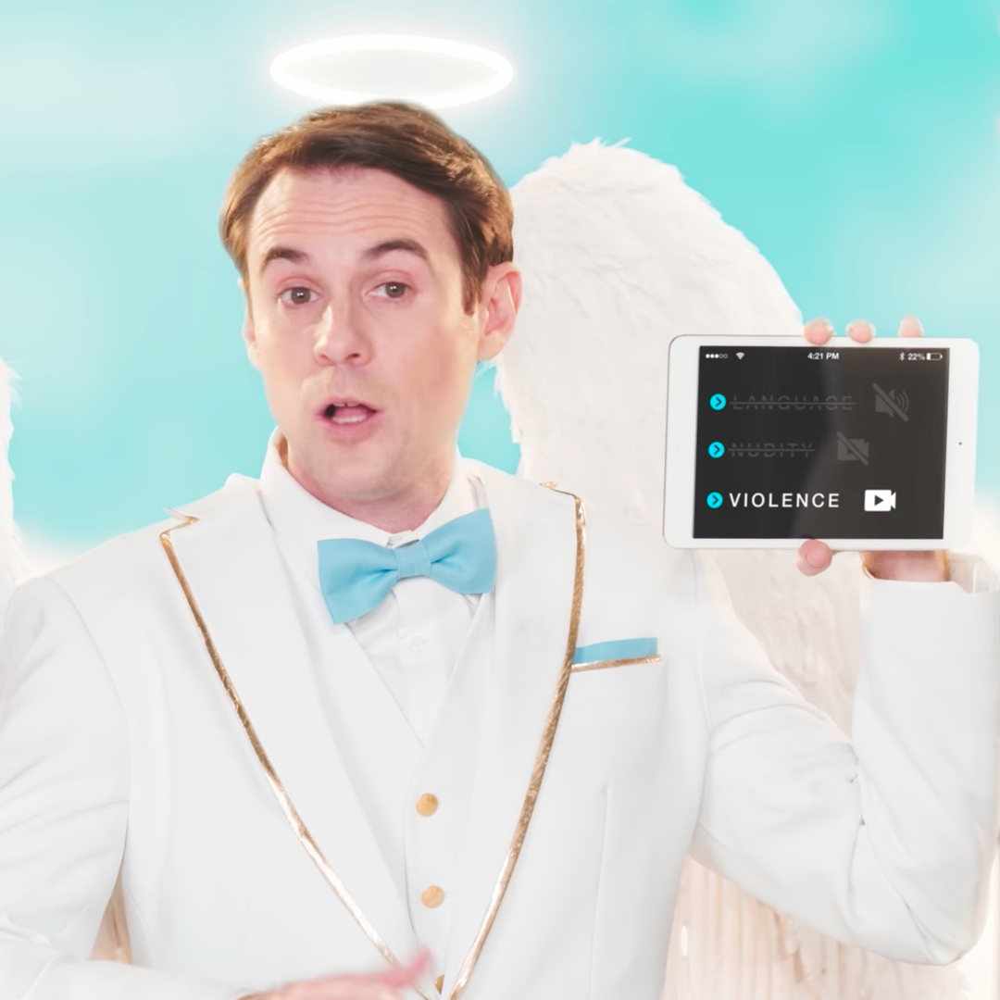
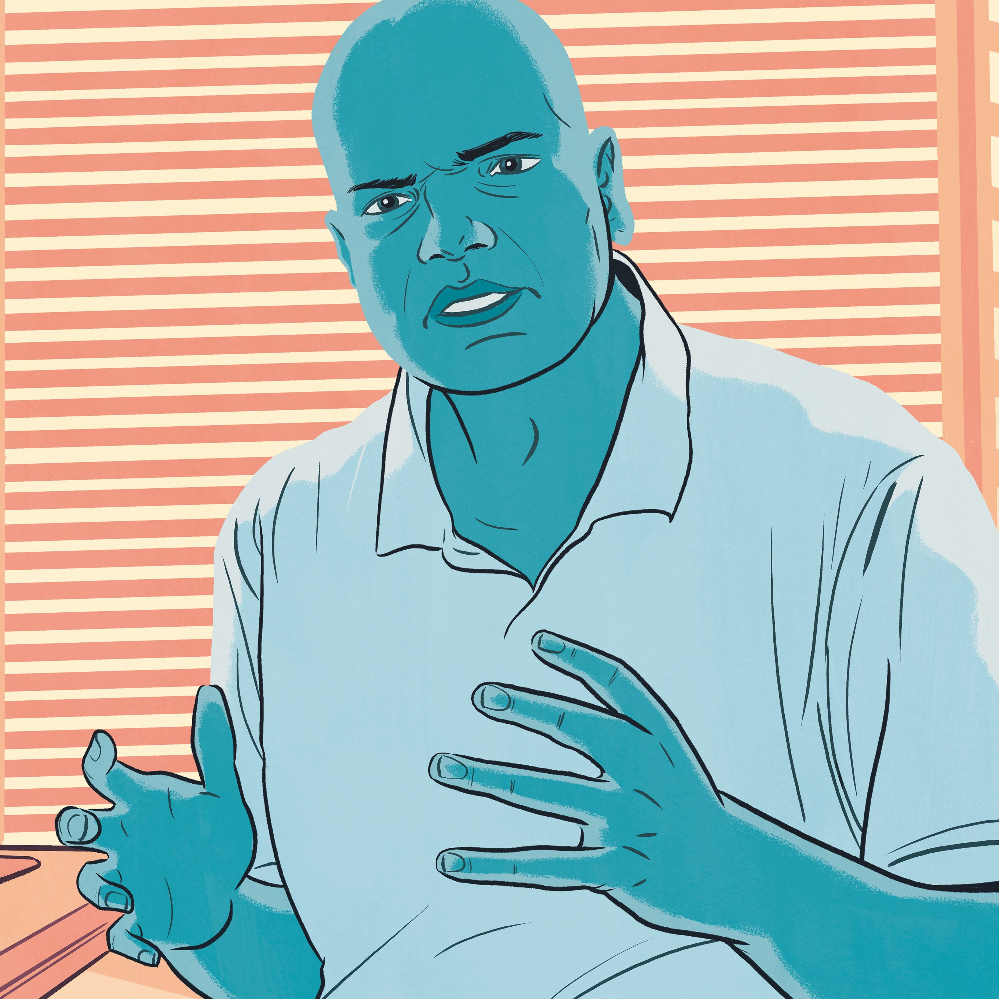

How YouTube Became the World's Best Film School

All Michael Tucker wanted was to learn how to be a better writer. Film school had given him a solid background in film theory and plenty of directing experience, but when he moved to Los Angeles a couple of years after graduation, Tucker decided his weakest asset was his screenwriting. "If I want to be serious and get to the next level," he told himself, "I need to have a script that is good."

So in early 2016, Tucker dove into screenwriting—reading screenplays, reading books about screenplays, trying to figure out how the great writers write. He took copious notes, and thought it might be interesting to write a blog post summarizing what he learned from each screenplay. It'd be a good exercise, plus Tucker thought it might get his name out there in Hollywood circles. As he was writing the first post, he had a new thought: *Maybe this should be a video*. Tucker was an avid fan of [YouTube channels](https://www.wired.com/tag/youtube/) like [Every Frame a Painting](https://www.youtube.com/channel/UCjFqcJQXGZ6T6sxyFB-5i6A), which dissected film form, and other explainer-y folks like [VSauce](https://www.youtube.com/channel/UC6nSFpj9HTCZ5t-N3Rm3-HA) and [CGP Gray](https://www.youtube.com/channel/UC2C_jShtL725hvbm1arSV9w). He Googled around a bit, looking for a similar channel on screenwriting. Nothing. So Tucker started his own.

[Lessons from the Screenplay](https://www.youtube.com/channel/UCErSSa3CaP_GJxmFpdjG9Jw) launched on June 8, 2016, with a video called ["Gone Girl—Don't Underestimate the Screenwriter."](https://www.youtube.com/watch?v=CF3lFPW4E1o) In it, Tucker explains why screenplays matter more than you think, and dissects the techniques Gillian Flynn used in adapting her novel for the film. As Tucker narrates over clips from the movie, the corresponding lines and notes from the original screenplay appear underneath. The video blew up immediately, climbing the [r/movies](https://www.reddit.com/r/movies/) Subreddit and eventually landing on Reddit's front page. Lessons from the Screenplay had 8,000 subscribers after just one day, and the Gone Girl video racked up 200,000 views in a week.

[Gone Girl — Don't Underestimate the Screenwriter](https://www.youtube.com/watch?v=CF3lFPW4E1o)

[  Ex Machina — The Control of Information  Lessons from the Screenplay • 742K views  10:45](https://www.youtube.com/watch?v=1Ko9mWdqW-M)[  Inglourious Basterds — The Elements of Suspense  Lessons from the Screenplay • 1M views  13:08](https://www.youtube.com/watch?v=AvtOY0YrF-g)[  The Dark Knight — Creating the Ultimate Antagonist  Lessons from the Screenplay • 2.7M views  11:00](https://www.youtube.com/watch?v=pFUKeD3FJm8)[  Whiplash vs. Black Swan — The Anatomy of the Obsessed Artist  Lessons from the Screenplay • 1.2M views  16:37](https://www.youtube.com/watch?v=ba-CB6wVuvQ)[  Dialogue in Film: How Should Characters Talk?  Now You See It • 1M views  5:58](https://www.youtube.com/watch?v=WpK5dXw0WzI)[  The Social Network — Sorkin, Structure, and Collaboration  Lessons from the Screenplay • 582K views  13:24](https://www.youtube.com/watch?v=8IAGH6k17nw)[  Rogue One vs. The Force Awakens — The Fault in Our Star Wars  Lessons from the Screenplay • 1.4M views  13:42](https://www.youtube.com/watch?v=gsIQa7sH5_Y)[  Why Gone Girl's Amy Dunne is the Most Disturbing Female Villain of All Time | Psych of a Psycho  Vanity Fair • 844K views  3:02](https://www.youtube.com/watch?v=CdxInrVPUzg)[  Nightcrawler — Empathy for the Antihero  Lessons from the Screenplay • 633K views  9:40](https://www.youtube.com/watch?v=vC1e0eAWd7c)[  Gone Girl - What it all Meant  What it all Meant • 526K views  5:54](https://www.youtube.com/watch?v=T15SMwnPeo8)[  Breaking Bad — Crafting a TV Pilot  Lessons from the Screenplay • 597K views  11:41](https://www.youtube.com/watch?v=sbMgYMY9Ryw)[  American Beauty (Part 1) — The Art of Character  Lessons from the Screenplay • 456K views  8:07](https://www.youtube.com/watch?v=fg0kn1rEHTA)

0:28 / 7:06
[(L)](https://www.youtube.com/watch?v=CF3lFPW4E1o)

With that, Tucker had found himself part of a rich, growing corner of YouTube. You could call it YouTube Film School, staffed by creators all over the platform who spend their time helping viewers understand how film and TV work. YouTube is rich with movie reviews, hilariously re-cut trailers, and haphazardly uploaded clips of dubious quality and legality. But the best channels are the ones that teach film as an art form, that help you understand why a particular cut or camera move makes you feel the way it does.

When Roger Ebert died, the film critic [Wesley Morris wrote](http://grantland.com/hollywood-prospectus/the-peoples-critic-remembering-roger-ebert/) that "what Siskel and Ebert instilled in the civilian filmgoer was perception. Movies had a surface that could be penetrated and explored. They taught us how else to watch." That idea is everywhere in the YouTube Film School. Many of the creators work in film; others studied it, and some are just avid fans. Some offer technical tips, others critical dissections of works you know and love. If you watch them all long enough, you'll learn that there's more to the stuff you watch than you ever realized. And you'll learn how to watch for it.

### Lesson Plans

You can't talk about YouTube Film School without talking about Tony Zhou, Taylor Ramos, and [Every Frame a Painting](https://www.youtube.com/channel/UCjFqcJQXGZ6T6sxyFB-5i6A). When Zhou, a film editor, and Ramos, an animator, created their channel in 2014, there wasn't much like it on YouTube. Video essays had been around for decades, of course: Zhou says some of the inspiration for the channel came from Orson Welles' *F for Fake*, which Zhou calls "the great essay-film." They'd seen a few essays online, too, from people like Kevin B. Lee and Matt Zoller Seitz. But nobody was doing it quite the way Zhou and Ramos wanted to do it. Their plan was "to have incredibly tight concentration of visual and aural cues," Zhou says. "The audience is sometimes listening, sometimes watching, and you get handed off from one to another." Too many videos were just narration over still shots, or text written on the screen, and neither worked for Zhou and Ramos. "Our videos were designed so you had to actually watch them."

#### Recommended

- [         David Pierce  YouTube's Redesign Makes It Easier to Watch All the Videos](https://www.wired.com/story/youtubes-redesign-watch-all-the-videos/)
- [         Andrew Zaleski  YouTube's Orson Welles of Poop Wants to Sanitize Cinema](https://www.wired.com/story/youtubes-orson-welles-of-poop-wants-to-sanitize-cinema/)
- [         Alexis Sobel Fitts  The YouTube Celebrity Taking the H-1B Fight Public](https://www.wired.com/story/youtube-celebrity-h1b-visa/)
- [         David Pierce  YouTube's Quest to Make TV Work Everywhere](https://www.wired.com/story/youtubes-quest-to-make-tv-work-everywhere/)

Every Frame a Painting was a huge undertaking. Every video took weeks to create, dozens of hours sitting in front of a computer. They developed a style specifically to work within the confines of YouTube's Content ID system, which automatically flags copyrighted material on the site. Fair-use laws cover what Zhou and Ramos were doing, but YouTube's algorithms can be finicky. Like other YouTubers, they quickly learned a few tricks. "There were other people who would upload things at half-speed, then use the tool to play it back faster and see it normally," Zhou remembers. "I remember one day seeing clips on YouTube, and what they would do is take the video and flip it horizontally, then shrink the size and upload it." That worked too.

There were no ads on Every Frame a Painting videos, in yet another effort from the creators to stay out of copyright trouble. But pretty quickly, fans of the channel started asking how they could support the work. Ramos and Zhou set up an account on Patreon, the then-new site that let fans directly support and give money to their favorite creators. More than 4,000 people eventually signed up to support the channel, adding up to $7,310 per video. Since then, other essayists have set up their own Patreons, and some have started making sponsored videos to pay the bills as well.

In three years, Zhou and Ramos made 28 videos for their channel. They dived deep into Michael Bay's unique "Bayhem" directing style, explained what makes Edgar Wright so much funnier than other directors, and looked at how Martin Scorsese uses silence to such great effect in his films. But my favorite Every Frame a Painting video is titled ["David Fincher—And the Other Way is Wrong."](https://www.youtube.com/watch?v=QPAloq5MCUA) Zhou, the narrator for all the duo's videos, spends seven minutes and 28 seconds looking at how Fincher, director of *The Social Network* and *Seven* and *Zodiac* and so many other great movies, uses the camera in his movies. His use of a rock-steady camera to communicate omniscience and destiny; the way he moves the camera to subtly explain the nature of a relationship or expose new information; the way he uses, and doesn't use, close-up shots. I've loved Fincher films forever, but in seven minutes, Zhou taught me how to watch the movies in an entirely new and more sophisticated way.

[David Fincher - And the Other Way is Wrong](https://www.youtube.com/watch?v=QPAloq5MCUA)

As of December, Every Frame a Painting is no longer. Ramos and Zhou got busy with other work, and couldn't figure out how to keep doing what they wanted within the confines of both their channel and YouTube's systems. So they spent six months trying to figure out how to make a goodbye video, before just putting their final script on Medium for everyone to read. "When we started this YouTube project," Ramos was supposed to say in the script, "we gave ourselves one simple rule: If we ever stopped enjoying the videos, we’d also stop making them. And one day, we woke up and felt it was time."

### New School

Luckily for fans of the YouTube Film School, Every Frame a Painting inspired a lot of other people to put their own spin on the film essay. There seems to be an archetype: film school veterans, usually men, who either work in or have been disillusioned by the film industry (and sometimes both). They tend to have the vocabulary and eye for the nuances of filmmaking. They also like the process of creating and editing, and see YouTube as a way to explore their own questions in public. "It's in the construction of a video that I understand and learn the most," says Evan Puschak, who runs a popular channel called [Nerdwriter](https://www.youtube.com/channel/UCJkMlOu7faDgqh4PfzbpLdg) that contains essays about everything from [why *The Prisoner of Azkaban* is the best Harry Potter movie](https://www.youtube.com/watch?v=3hZ_ZyzCO24) to a deep dissection of [Donald Trump's speech patterns](https://www.youtube.com/watch?v=_aFo_BV-UzI). "I just move toward what interests me in that week, or that month."

Puschak's process mirrors that of other YouTube Film School creators. For [a recent video](https://www.youtube.com/watch?v=GfqD5WqChUY), also about David Fincher (apparently the unofficial patron saint of YouTube Film School), it started with a weird feeling Puschak got while binge-watching *Mindhunter* on Netflix. Every time he looked around, something felt weird, like he was suddenly in a Fincher scene. *What was that about?* With that, he had a video idea.

[How David Fincher Hijacks Your Eyes](https://www.youtube.com/watch?v=GfqD5WqChUY)

Puschak moved to his computer, and started re-watching everything with his finger over the pause button. "I just watch it frame by frame, shot by shot," he says, looking for patterns. And he noticed this weird thing that kept happening. "[Fincher] is doing this thing where he's moving the camera in a very specific way," Puschak explains. "He's matching the velocity of the actors." When they stand up, the camera stands with them. When they move, the camera moves with the same pace and direction. It's like you, the viewer, have become the camera. "You start to feel like you're with this people," Puschak says. "That's a unique thing."

Once he figured out what was going on, Puschak began the most time-consuming part of the process: re-watching everything Fincher's ever made with the same careful eye. (Time-consuming, sure, but still a pretty good gig.) Sometimes he watches the whole movie in Final Cut, to make cutting easier. He's pausing and rewinding, watching the same moments over and over again. "If you want to understand a film more," he says, "watch it where you control the play time. It just unearths all kinds of cool stuff."

Next comes script-writing, sort of. Puschak says he usually gets halfway into writing, and then just starts cutting a video. Soon he gets into a rhythm, the story unfolding in front of him in the editing timeline.

Puschak makes it sound easier than Zhou, for whom putting a video together took a huge amount of thinking and revision. He and Ramos even had a step they call The Exercise: They'd write out each step of an essay's argument on a notecard, and then Zhou had to recite them to Ramos, from memory, without stopping. If he stuttered or paused, back to the beginning. "It's pretty much designed to piss me off," Zhou says, but it also kept him focused. Videos could take weeks, even months to finish. But Zhou, like Puschak and Tucker, noted how much he loved making them.

The YouTube Film School scene just keeps growing, in part because viewers love watching them. Want more Fincher knowledge? You can learn about how he made music videos from [Patrick Willems](https://www.youtube.com/channel/UCF1fG3gT44nGTPU2sVLoFWg), dig into the "invisible details" in his work with [kaptainkristian](https://www.youtube.com/channel/UCuPgdqQKpq4T4zeqmTelnFg), or get a 14-minute breakdown on lots of his tricks from [The Film Guy](https://www.youtube.com/channel/UCDoCEdzxpixjrESsi5Ph-VQ). These videos offer so many new ways to watch movies, TV, or anything else. You might grow fascinated with how texting is represented on screen, learn why a focus-puller is so important, or discover how color tints can completely change the way you experience a film.

The YouTube Film School instills a new appreciation for why props matter, how foley art works (and what foley art is), and why a one-shot or a dolly zoom can hijack your brain and make you feel something. "You have these film-school people who are like, 'Let me tell you what you're feeling intuitively about what Spielberg is trying to do to your brain,’" says Jason Kottke, a prominent blogger and YouTube Film School fan whose posts turned me on to many of these creators. "There's been film criticism as long as there's been films," he says, "but writing about film is a little like dancing about architecture. Video lends itself really well to looking at how these moviemakers put things together." Whether you want to be a filmmaker yourself, or just want to understand more about why movies matter and what they do to your brain, it's all right there on YouTube. Like and subscribe.