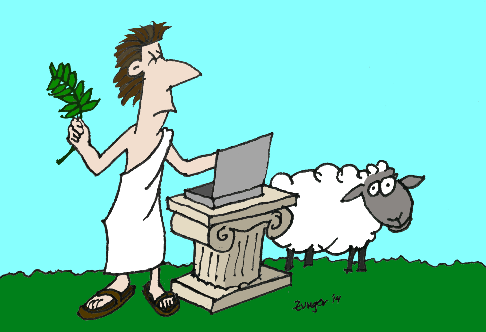

How Your Data is Stored, or, The Laws of the Imaginary Greeks

# **How Your Data is Stored, or*,* The Laws of the Imaginary Greeks**

If you don’t work in computers, you probably haven’t spent much time thinking about how data gets stored on computers or in the cloud. I’m not talking about the physical ways that hard disks or memory chips work, but about something that’s both a lot more complex and a lot more understandable than you might think: if you have a piece of data that many people want to read and edit at once, like a shared text file, a bank’s records, or the world in a multiplayer game, how does everyone agree on what’s *in* the document, and make sure that nobody overwrites someone else’s work? This is the problem of “distributed consensus,” and in order to discuss it, we’ll have to discuss bad burritos, sheep-tyrants, and the imaginary islands of ancient Greece.

“The imaginary islands of *what?,”* you ask?

It turns out that the original scientific paper about one of the most important methods used to solve this problem was written in the form of a lengthy discussion of how the part-time parliament of the imaginary ancient Greek island of Paxos managed to pass laws, despite nobody ever reliably showing up at the legislature. It was a wonderful metaphor for how a bunch of people can agree on what to write to a file, even though they might be unreachable or distant for a time — and the paper is both one of the funniest serious research papers ever published, and one of the best explanations of a complicated algorithm I’ve ever seen. And since this metaphor worked so well to explain one part of this problem, and because it’s a lot more fun than talking about file systems, I’m going to use it to explain all of it to you.

Note that I am a computer scientist, not an illustrator. This represents the upper bound of my artistic skills.

The reason this metaphor works so well is that with both files and laws, we have some data which many people wish to change, many people wish to read, and none of these people want to spend forever doing so. Simultaneous reading of a law-book is limited by the number of people who can see the book at a time, just like reading a file can be limited by the speed at which data can come off a disk; simultaneous *writing* requires that everyone somehow agree not to overwrite one another, but without having to have lengthy debates before proceeding. Short of having every single person in the world take turns, with one person holding the book at a time, how can we solve this problem?

So instead of a conversation about file systems and database transactions, let’s transport ourselves to the islands of the Fictional Aegean Sea, where everyone is obsessed with issuing decrees and making laws: they just need to make sure that everyone can read up on the law when they need to. We’ll go through some twisty passages, and by the time we’re done, you’ll actually understand distributed consensus the way professional computer scientists do. Only with more sheep.

(Incidentally, there will be a bunch of islands, and their names are entirely made-up, except for the one which sparked this whole story, about which more later.)

#### **Of Hermits and Mexican Food**

We begin our story with the simplest of all of these islands, Pseudemoxos, home to a single hermit who is writing laws and decrees for her own use. At first, she used a very simple and obvious method: a notebook and a pencil. She could add laws, change laws, and reorganize laws at will, by simply erasing and writing new things down, wherever she pleased. (And this is, essentially, how the disks in your own computer worked until the late 1990’s)

This method appeared to work reasonably well, except for the tendency of overly erased paper to wear thin. The hermit became horribly aware of the flaw in the design, however, when one day a crate of dubious burritos washed up on the shore. Halfway through writing a change in the law — having erased text and begun to write something — she experienced what we politely refer to in computer science as a “production emergency.” When our hermit returned to her law-book, somewhat the worse for wear, she found that not only had she forgotten what she was about to write, but there was now an empty space in the middle of the law-book filled with neither the old nor the new law, but scribbles written in such haste that even *she* couldn’t read them!

(The metaphor, of course, is for what happens when a computer or a program suddenly failed partway through a write — the data on disk could get hopelessly corrupted. The metaphor extends as well to more serious failures of the hermit, where events like a head crash could cause damage not only to the words being written, but leave a rather unpleasant and permanent mark across the entire page.)

Both of these problems are solved with what is known as **journaling.** The rule is to never erase anything — just like when people keep logbooks or lab notebooks. Now, our hermit keeps a stack of paper. When she wishes to make a change to the laws, she adds a note to her journal:

*June 4th, 10:32 — Append to the laws of food safety: The consumption of burritos which have been at sea for an undetermined length of time is forbidden.*

Every edit, be it an insertion, change, or deletion, is logged at the end of the journal, in pen. The hermit is protected from an emergency, because nothing is ever erased; at worst, there is an incomplete or damaged journal entry (missing, perhaps, its final period), the sign of a failed attempt at writing, which one may simply ignore. The journal has the additional advantage of serving as a record of all changes; to see how the law looked a year ago, for example, our hermit can simply read the journal and stop at that date.

The one obvious flaw of the journal is that reading it is more difficult than reading a notebook: to know the current law on food safety, one has to start from the very beginning of the journal and read all the way through to the end, keeping track of all changes to the food safety law as one goes, a process which becomes steadily more onerous as time goes by and the journal gets longer.

To simplify this, our hermit keeps a stack of empty law-books handy. Whenever the journal gets too long, she sets aside some time to make a *digest* of the law: she reads the journal from beginning to end, keeping notes on scrap paper if needed, forming a description of the current state of all of the law, and then writes out that current state into the law-book. On the cover of the law-book, she writes “This was the state of the law as of [some date].” Further reading of the law then only requires that she read the digest, and the journal of changes made after the digest’s date. Journals older than this can be kept, if a record of the change history prior to the digest is occasionally needed, or simply thrown away.

If our hermit is too occupied with the business of drafting new legislation to regularly make a digest, she can simply employ a scribe (that is, a second computer program running in parallel to the first) to assist her. The scribe will simply read the journal up to some agreed-upon time, writing a digest and informing our hermit when he has finished, so that she can start using the new digest. The scribe need speak to nobody in order to do his job, so the hermit can continue in her labors, her silence unbroken.

This method has still more benefits. Our hermit having become widely known for her wisdom (for example, her lessons on avoiding sea-borne Mexican cooking), many people may wish to read her law. So long as these readers are content to know the digest of the law up to a fairly recent time, they can simply make their own copies of a digest, and read freely without needing to disturb the sage at her work. Only a reader who needs an absolutely up-to-the-minute view of the laws need bother her directly.

(The use of journaling for individual computers began in the late 1990’s, and became common in the mid-2000’s. Your computer today probably does this.)

#### **Chaos on the Island of Fotas**

Near Pseudemoxos is the somewhat larger island of Fotas. This island is sparsely inhabited, but there are enough people that the Fotans have all agreed that they need a mutual system of laws to govern their lives. However, the Fotans are known for their fierce independence: they are unwilling to allow any other Fotan, or group of Fotans, to have power over them, and so have decided that any and every Fotan shall have the power, independently, to enact a law, simply by writing down the law they wish to enact on a piece of paper, together with the date and time and their name, and sending it by messenger to the Library of Fotas, where a scribe will append it to the law-journals.

(If it’s not clear, this represents the case where many people are trying to simultaneously write a single file without making any attempt to reach consensus about what goes into the file before they do so. It’s perhaps unsurprisingly difficult to do so without all hell breaking loose, but with a bit of cleverness — and some restrictions about how people learn about changes — it’s actually possible!)

To see some of the ways in which this can go wrong, let us begin by considering Agnes, who lives on one side of the island and is very concerned with the purity of ritual sacrifices. She enacts a law:

*June 1st, Noon — Law 32.1.2 on the sale of sheep is amended to read: The sale or purchase of any sheep whose wool is not perfectly white shall be forbidden on penalty of death. Signed, Agnes.*

On the other side of the island, Basil, who has recently had a number of black sheep born which he is having trouble selling, enacts his own law:

*June 1st, Noon — Law 32.1.2 on the sale of sheep is amended to read: No person may refuse to buy or sell a sheep on the account of the color of its wool. Signed, Basil.*

Later that day, the scribe finds himself with two new laws, with the same time-stamp, even. What is he to do? When Basil next arrives in town to sell a black sheep to Galatea, and she refuses to buy a non-white sheep, and they go to read the law-book, which law should they obey? And what should happen when the scribe tries to write the next law-digest — what will Law 32.1.2 say? (In computer terms, two people have tried to write different data to the same part of the same file at once; the result could be absolutely anything. Agnes’s law may win, Basil’s law may win, we may end up with every other letter coming from each law, or anything else)

To illustrate a more subtle kind of problem, imagine that Agnes wants to perform a “read-modify-write” of the law — that is, she looks at the current law, decides to make a change, and then writes the change. But just as she is doing this, Basil makes a conflicting change to the law. For example, at 10:00, Agnes reads the law to be

*Section 32.1.3. Any person selling a goat must pay a tax of one obol to the library general fund.*

She ponders this, and at 10:02 issues the following write:

*June 1st, 10:02 — Law 32.1.3 shall be amended to change “one obol” to “two obols.” Signed, Agnes.*

Unfortunately, at 10:01, Basil (who has little patience with goat-taxes) issued:

*June 1st, 10:01 — Law 32.1.3 shall be replaced with “The Ides of February is national olive day.” So there. Signed, Basil.*

Our scribe, attempting to reconcile the laws in order, is going to be very confused: when he reaches Agnes’ entry, law 32.1.3 is talking about National Olive Day, and doesn’t mention “one obol” anywhere. What is he to do? (And if you think this case is obvious, imagine if Basil’s law had instead replaced “the library general fund” with “Basil!” The scribe has no way of knowing if Agnes knew about this change or not before her own edit.)

Situations like this happen whenever multiple writers can compete to edit the same book of law. There are numerous solutions, each with different pros and cons. These solutions fall into two basic categories. One is “eventual consistency” (or “weak consistency”), where a few rules about how writes work will allow everyone to write at the same time without speaking to one another. The cost of this is that nobody can know the exact state of the law at this instant; they can only know how it was a short time ago. The other is “strong consistency,” where all kinds of write are possible and everyone can know the current state of the law, but at the cost of each write requiring a process of consensus-building.

Both of these turn out to be useful. Sometimes, you have information where a bit of staleness is alright; for example, when the inhabitants of Fotas are making their annual yearbook, and exchanging pictures of one another’s profiles, there’s no pressing need to have the most up-to-the-moment pictures, and so the simpler eventually-consistent protocol will do nicely. On the other hand, for actual laws, strong consistency will prove the more useful, despite its cost. (This is true with computers as well. For example, images you upload to Google are stored using an eventually-consistent system, while the access control lists which define who can view what are stored using a strongly-consistent one)

Let us return to the island of Fotas.

#### **Eventually, This All Makes Sense**

We could easily solve the first of our two problems — contradictory laws at the same timestamp — simply by agreeing upon a tie-breaking rule so that no two timestamps can ever match. For example, we could break ties in timestamp by the name of the author, in alphabetical order, so that in case of a race Agnes’ changes will always happen before Basil’s. (Or if names match, we could assign each Fotan a unique number ahead of time) Once the timestamps no longer match, there is no confusion: later laws always supercede earlier ones, and so when Galatea comes to town, Basil’s law is the one on the books.

If mutual overwriting of this sort is a problem, it can be avoided by prior agreement about who can write what. For example, for one week Agnes might be allowed to edit only even-numbered laws, and Basil odd-numbered ones, switching the next week. (In computers, the space of files is often divided up so that two writers never attempt to write the same file at all, much less at the same time. For example, each newly-uploaded photo might be automatically assigned a unique name, so that only its uploader ever need write to that file)

To solve the second problem, we simply decree it out of existence: we change the rules of the journal to forbid any “edit” statements, allowing only replacement, addition, or deletion. This means that no statement in the journal can ever depend on the current state of the law for its interpretation. Agnes would have had to instead write her law in the form

*June 1st, 10:02 — Law 32.1.3 shall be replaced with “Any person selling a goat must pay a tax of two obols to the Senate.” Agnes.*

and, since her write had a later timestamp, her version would win over Basil’s without confusion.

* * *

*...*

Such a system of writing laws has the benefit of speed and simplicity: anyone can still write a law at any time, without consulting with anyone else. However, *reading* the laws becomes surprisingly tricky. Say you want to know the current goat-selling tax, and so you go to the library and ask to read Law 32.1.3. Arriving at 10:05, you read the digest and the journal, and find that it reads: “Any person selling a goat must pay a tax of one obol to the Senate.”

You see, Agnes changed the law at 10:02 by her time — but her messenger hasn’t arrived yet! All you can know is that, as of the last time the journals were written, this was what the law said.

To make things a little better, messengers can check in at the library: whenever a messenger arrives from a given Fotan, after they deliver their messages, they write a note on the board indicating that all of the given Fotan’s messages have been delivered at such-and-such a time. A visitor can then look at the board. If the last message from Agnes was at 9 that morning, and the last message from Basil was at 7 the previous evening, and so on, then you know, at least, that the laws you are reading were accurate as of 7 the previous evening — the *earliest* of the times shown on the board, since all edits prior to that must have arrived. (This time is known as the “low-water mark”)

Of course, if a particular Fotan isn’t very litigious, their updates might be rare, and so everyone will be wondering if they have made a recent change which simply hasn’t arrived at the library yet, or if they simply haven’t had anything to report in weeks. To avoid this problem, each Fotan must send a messenger to the library at regular intervals, whether they have any updates to make or not, so that the board remains fresh.

Now, the Fotans are a creative people, and so they quickly realized that this steady stream of messengers could simplify their lives further. Rather than having to make the tedious trek to the library themselves, they can simply maintain their own copy of the law-digest and law-journal. Their messenger simply returns, each time, with all of the changes to the law-journal which have been made since the last time they sent a messenger to the library, as well as a copy of the dates which were on the board then. They simply update their own copy of the law-journal, digesting as needed, and can now refer to their own copy with as much ease as they could to the central reference copy.

As the Fotan population progressed, however, the traffic at the library became a problem, what with all of the messengers running back and forth and the scribes copying journals and digests, and the task of simply making a law to change the goat-tax became obnoxiously slow. Fortunately, the Fotans realized that they had solved their own problem: having their own copies of the law, they no longer needed a single central library!

Instead, several branch libraries were opened. Messengers could simply deliver and receive updates at the nearest branch libraries, and other messengers would travel between each pair of branch libraries, transferring copies of all of the updates to the journals. Ultimately, a “tree map” was built: a diagram connecting each of the branches to one another, and each Fotan to a branch library. Updates were delivered only along the routes shown in the tree, but since each Fotan or library was connected to each other Fotan or library, *eventually,* any change made by any Fotan would reach every other Fotan. And since everyone would ultimately have the same journal in hand, their law-books would eventually be consistent!

This has many nice advantages: for example, when having to navigate a difficult or expensive road, such as the treacherous toll-road which is the only access from the central island to its eastern mountains, only one messenger need traverse that path; he will simply deliver updates from the West to the East, and vice-versa, with the branch libraries at opposite ends of the road propagating the information to the rest of their ends of the island.

(You may notice, at this point, that there is no longer any meaningful difference between an individual Fotan and a branch library — and that’s exactly right! Everyone has a copy, and so long as they continue to send messengers along the appropriate routes, everyone can change the law simply by writing in their own journal, and trusting in their messengers to propagate the information elsewhere)

This method is thus very efficient, but has three notable weaknesses. First, it is impossible for anyone to know the current state of the law with certainty. Unlike writing to one’s own journal, like a Pseudemoxian hermit, one no longer has the guarantee that, after finishing a change, anyone reading in the future will see that change; only that anyone reading *sufficiently far* in the future will see that change. (This is known as a lack of “read-after-write” consistency)

Second, it is impossible to perform a read-modify-write. This means that, if there are ever two Fotans attempting to change the same law, the consequences are unpredictable: neither Fotan, at the moment that they issue the change, can know with certainty if another change hasn’t already begun, and whether that other change will end up happening before or after theirs, meaning which change will end up in their law-journals after all changes have arrived at both of their homes. To circumvent this, a Fotan has to both find some way to guarantee that he is the *only* Fotan attempting to change a given law, and that he has read an up-to-the-minute version of the law prior to changing it.

Third, this method is vulnerable to network failures: imagine that the road leading up to a single Fotan’s remote house is cut off by a rockslide. No updates can reach the outside world from him, and so nobody can assume that they have all the updates from any time more recent than the last message to get from this Fotan to the safe side of the road. But neither can they assume that he transmitted nothing since then; for all they know, he is blissfully unaware of the rockslide and continuing to write to his own journal, awaiting a messenger who will never come. The entire system therefore comes to a halt, with nobody’s low-water mark advancing, and therefore nobody able to form a new digest, all because a single road failed!

In computing practice, such problems are real and serious. Whenever a single node (a computer, or perhaps a datacenter) becomes disconnected, production engineers need to immediately evaluate the situation and determine if it is likely to be fixed and reconnected quickly. If it does not, every other server will be unable to form digests, and so their journals will continue to grow, causing problems for readers, while the isolated writer becomes more and more out-of-sync. If the problem cannot be fixed quickly, the isolated nodes are often switched off completely, and other methods are used to route people who wish to connect to them to other computers elsewhere — often through a much slower external network, but hopefully one which was not compromised. However, the other nodes will continue to wait. If it becomes clear that a fix will not be short in coming at all, there is only one alternative: remove the missing nodes from the network entirely, telling the other nodes to pretend that they no longer exist and that no updates from them will ever be forthcoming. The other nodes progress, but any writes which the isolated node performed after the isolation — unless they can be copied off and transferred to the main network by other means — will be permanently lost.

#### **The Clients of Fotas, and Strong Consistency**

So what we have seen above is a reasonable solution for fiercely independent islanders like the Fotans, who want to be able to write quickly and aren’t entirely concerned with being able to read the latest version of something. But what happens in situations where that simply isn’t acceptable? Laws are actually a good example — if you commit a crime at 10:00, it matters a lot whether the law against it was passed at 9:00 or 11:00. Knowing the law up-to-the-moment is important.

The problem became far worse when Fotas went into the law-book business. You see, Fotas is surrounded by many much smaller islands, each of which has its own industry and thus requires its own law-book. Being small islands, they do not have the resources to maintain the intensive Fotian system of scribes and messengers themselves; and even if they did, they would never be able to train those scribes and messengers to work as quickly or efficiently as those of the Fotans, who are (one must admit) kind of obsessed with this. These small islands therefore continued for years to use the simplest and most brute-force solution: each island had its own hermit with a law-journal, in the Pseudemoxian Style, and everyone who wished to read or change a law simply lined up and dealt with the hermit one-by-one. It is slow and inefficient, and may the Immortal Gods protect them if their hermit happens to get sick, or be swept away by a tidal wave. But lacking the resources of an island like Fotas, they simply continued about their way.

The Fotans therefore smelled an opportunity of offering their law-books as a service to their neighbors; those client islands could simply read and write their information from a part of the Fotian law-book, each island receiving its own dedicated chapter which nobody else could write.

The neighbors, at first, were thrilled: because everyone no longer had to line up to speak to a single hermit, the process became much faster, even taking into account the travel time to Fotas. (In fact, the Fotans worked to improve this travel time by setting up embassies on these various islands which were part of the Fotan network) It was also much more reliable, as everyone was reminded when a tidal wave destroyed several islands and severely damaged Fotas itself. Because each Fotan had replicas of the full law-book, it was easy to recover. (The Fotans later improved on the system by having each chapter maintained by only some Fotans, spread across the island; this gave them the same general reliability without the expense of copying each client island’s laws to absolutely *every* point on Fotas) And since Fotas was close to so many islands, the islands could even begin to use the Fotian system as a way to reliably send messages to one another.

But the two problems we saw above became much more evident. For example, on the island of Parafoitas (one of the client islands), Andros’ wine company had been using Fotian storage to keep track of its orders. One day, Andros took an order for 100 amphorae of wine for a local politician’s wedding, and entered it in the order-book. The next day, one of his employees checked the order-book — but that employee’s messenger to Fotas happened to go to a different port than Andros’, and this port had not yet received the updates from the previous day’s write due to a mud-clogged road. The employee therefore didn’t know about the order, and the wine didn’t make it until the day after the wedding! (Andros considered keeping a board in his office listing at what time each order-entry had been made, which everyone would check prior to filing or fulfilling orders, but stopped when he realized that he had just made his very own hermit-board, in which case what the hell was he paying these Fotans for, anyway?)

On the island of Siranos, things went no better. There, they had tried to resolve the problem of read-modify-writes by having Baucis in charge of even-numbered laws on Monday and Galen the odd-numbered ones, switching on Tuesdays, and so on, so that only one person might try to affect a law at a time. But as it happened, Galen was quite impatient to change a certain even-numbered law, and so he did so at precisely midnight on Tuesday, as soon as he could. Unfortunately, Baucis had made a change to the same law at 11:58 the previous night, and her change was not yet visible to Galen when he made his own change — so Galen issued a change, thinking he was the only person doing so, and unintentionally overwrote Baucis’ work.

Some of the neighboring islands, on the other hand, were quite satisfied; Epifoitas, for example, had been using Fotian storage to keep an archive of their poetry. Once a poem was committed to the archive, it would never be changed, only read, and new poems perhaps added in response; as such, there was never a concern that a poem might be overwritten. For them, the Fotian system was both reliable and inexpensive. But on the whole, there were enough islands who wanted to regularly read and write their texts that the inadequacies of the Fotian method became clear.

#### **The Part-Time Parliament of Paxos**

So now we come to the island of Paxos. This is the original imaginary Aegean island of Leslie Lamport’s invention which led to this whole metaphor, and in fact the method he described is universally known as “the Paxos algorithm” because of it. (All of the other island names in this article have been my own invention)

The good news about this algorithm is that it’s no more complicated than what we just discussed, and his paper discusses it in the same style; if you’re comfortable reading this, you can now simply pick up Lamport’s paper “[The Part-Time Parliament](https://research.microsoft.com/en-us/um/people/lamport/pubs/lamport-paxos.pdf)” and read it without difficulty. The bad news is that I can’t think of any way to explain it which is shorter than Lamport’s explanation, and that would make this already-long story *insanely* long, so I’ll leave you to his tender mercies for the details. But I can give you a summary of the idea:

The Paxons were concerned with keeping track of their own laws, and as such were very concerned with having read-after-write consistency, so that everyone might know the current law of the land. They also wished to have read-modify-write consistency, since otherwise they might accidentally pass conflicting laws. Together, this kind of consistency is often referred to as *strong consistency,* whereas the weaker properties of the Fotian system are called *eventual (or weak) consistency.*

The details of the Paxon problem (which you’ll learn more about if you read the paper) were slightly different: their laws were passed only by their Parliament, which met in a single house and so they didn’t have to worry about members suddenly becoming unreachable due to mudslides or tidal waves. But instead, they had a part-time parliament: legislators who were prone to coming and going as they pleased, becoming unreachable not because of a natural disaster but because of a particularly good amphora of wine. And due to poor acoustics in the hall, oratory was impossible, and legislators had to communicate with each other via messengers, just like the Fotans. So despite the superficial differences, the part-time parliament of Paxos posed all of the same logistical complications as the spread-out parliament of Fotas.

The core idea of the Paxos solution is simple: in order to make a change to the laws, you get a majority of Paxons to make the same change. At that point, if someone is trying to make a contradictory change, when they try to build up their own majority, it’s guaranteed to include at least one person who knows about the other change, and who can stop them and say “Wait! We are already voting on something different!” (Because if you have two sets of Paxons, each of which is bigger than half, there must be at least one person in common between them!) Likewise, when you wish to read the laws, you ask a majority of Paxons for the latest version of the law; again, if any change has been made, at least one of them must have heard of it. The details amount to a method of keeping track of which ballots are currently in progress, based on each Paxon having their own law-journal and note-pad where they track their own votes and the messages they have received.

Lamport’s method provides several important guarantees: it has read-after-write consistency, in that once the consensus condition has occurred for a proposed law, it is guaranteed that every future attempt to read that law will see that consensus; it makes read-modify-writes possible, in that once a change to a given law begins, either that change will end with no intervening writes having been allowed, or (if it was discovered partway through that an intervening write had already started) that change will fail unambiguously and everyone will know to try again; and it further satisfies the “progress condition,” that “if a majority of the legislators were in the Chamber and no one entered or left the Chamber for a sufficiently long period of time, then any decree proposed by a legislator in the Chamber would be passed, and every decree that had been passed would appear in the ledger of every legislator in the Chamber.”

However, it does this at a cost. Passing a law — that is, writing to the system — requires building a consensus among a majority of members. If some of the members are distant from the originator, then this is potentially a very slow process; you can no longer add a law by simply writing it in your own journal. Reading a law becomes a slow process as well, as that process now requires asking a quorum of Paxons about their view of the law.

To moderate this, in practice Paxon systems provide two methods of reading: “Read-latest,” which performs the quorum read as above, and “read-recent,” which consists of simply checking your own log-book. Recent reads lack the consistency guarantees of the Paxos system, but they are quick, and in practice many systems require these strong guarantees only some of the time. (e.g., Agnes and Basil may wish to do a read-latest when they are resolving their dispute over the sale of sheep, but on an ordinary day when one of them is heading to market, they will content themselves with a read-recent before leaving the house)

Nonetheless, this means that the Paxos method always has a nontrivial speed cost, and as the number of people involved grows, this cost increases rapidly. (Even in the absence of long transit times, simple random variation in the time-to-answer of the individual Paxons takes its toll, as each operation requires waiting for over half of them to answer, so you end up waiting for the slower individuals)

#### **Composite Systems and Master Election: Back to Siranos**

One interesting property of these systems is that they can be combined. For example, in both the Fotas and Paxos systems, each legislator had a copy of the law-journals and their own note-pad. The design of those systems relies only on the fact that the legislator can write in their *own* books with the guarantees of strong consistency. In the case of those being ordinary notebooks, written and read only by one legislator, this is trivially achieved.

But there’s no reason that this could only be achieved with a notebook, and this lets us solve more problems. Imagine a network of islands, each individually small, but separated from each other by large seas, as in the Pacific. (Or in computer terms, imagine a network of datacenters, each within a building, but spread over the entire world) Providing a strongly-consistent store using Paxos over such distances is horribly impractical, because each read or write requires a quorum, which requires multiple inter-island trips. However, each island can maintain its own strongly-consistent store using any of the means above, and then a separate, inter-island organization can maintain its own laws using any means it wishes, simply replacing individual notebooks with single-island stores. A client limited to a single island can then deal only with their own island’s system, while clients doing inter-island business can use a different system but get all of the robustness advantages of having more than a single point of contact on their island.

This possibility led the Siranoi to reconsider their own system. Remember that this island had tried to achieve strong consistency by dividing up their laws by day, so that Baucis could write even-numbered laws on Monday and Galen on Tuesday, and vice-versa. Even though this simple system ran in to problems, it revealed an important truth: someone interested in the laws on sheep-selling on Monday was likely to still be interested in it on Tuesday, and changes of interest were relatively rare; and likewise, accidents which caused people to simply vanish — leaving nobody to deal with the laws on sheep — were also relatively rare. And even though many strongly-consistent methods are slow, it’s OK if you have to do something slow on rare occasion, if your day-to-day is quick.

This led the Siranoi to ask themselves if, for any subject, they could simply elect a Tyrant who would be responsible for all laws related to that subject. So long as everyone could easily find out the Tyrant for any particular subject, and the Tyrant himself did not become overloaded with requests, this would achieve an even simpler form of strong consistency: anyone wishing to change the laws on that subject, or know the latest laws on the subject would simply communicate with the Tyrant, Pseudemoxian-Hermit style; whereas anyone wishing to simply get a good idea of the latest situation would read their own copy of the general law-books, copied to them Fotan-style.

The basic principle is simple. Say Baucis wishes to know the sheep-law. Baucis inquires of the central registry of Tyrants, “Who is the current Sheep-Tyrant?” If the registry says that Philemon is, then Baucis immediately knows where to go. If the registry says that *nobody* is, then she simply proposes a law to this registry, “Baucis shall be the Tyrant of Sheep.” If this law passes, then Baucis is now the sheep-tyrant, and can proceed entirely on her own; if the law fails, then another law must have passed in the interim, so she simply repeats her query.

As you may have guessed, the central registry of Tyrants is nothing more than another strongly-consistent store. For very small groups, a single hermit may be workable, but both for reasons of scale and reliability, it’s typically better to use the Paxos method to build the central Tyrant-registry. While inter-island Paxos can be extremely slow, you only need to access it on rare occasion, when you want to find out (or become) the Tyrant for some particular subject; ordinary communication on that subject is then one-to-one.

This method has some wonderful advantages. If only one person is interested in a given subject (a common case, especially if the subjects are fairly narrow) then that person can become the Tyrant of that subject themselves, and need not deal with any neighbors at all; they can simply proceed like a hermit, reading and writing from their own book, secure in the knowledge that nobody else is permitted to change the law on their subject. If many people share a particular interest, then all of those people will have to queue up to speak to one Tyrant, but the Tyrant can immediately give them an answer, without having to wait for information to be carried across the island.

There are a few problems, however. The first is dead Tyrants. Baucis, having reigned as the Tyrant of Sheep for many years, one day had a heart attack. Nobody knew about this, though, and so everyone concerned with ovine matters ended up queueing at her door, waiting forever for her to show up, and all sheep-law came to a halt for several days, until finally the door was broken down, and discovering her death, the Siranoi passed a law revoking her Tyranny. After this happened once, the Siranoi formalized the solution in a simple fashion, namely terms of office: rather than passing “Baucis shall be the Tyrant of Sheep,” Baucis would propose “Baucis shall be the Tyrant of Sheep until Thursday at Noon.” If she is still alive, and interested in sheep, then sometime that Thursday morning she can propose another ballot measure to extend her reign.

The second problem is overloaded Tyrants. It’s one thing to be the Tyrant of Sheep on a small Aegean island; quite another to be the Tyrant of Sheep of New Zealand, where sheep outnumber people 7:1. The queues outside the Tyrant’s door would become quite intolerable!

Fortunately, nothing in this system requires the Tyrant to be an individual — simply that the Tyrant must provide a strongly-consistent representation of their subject, as well as transmit updates to all other law-journals using some robust method. So on New Zealand, rather than a single individual being elected Tyrant of Sheep, a group of interested ranchers joined to form the Kiwi Sheep Tyranny Combine. Being a relatively small group of relatively reliable people, they can maintain a shared law-book using Paxos (or any other system) with reasonable ease and speed. If they find themselves routinely overloaded, they can simply add new members to their organization, so that more people can service client requests.

And rather usefully, they can continually improve their methods. When the KSTC is small, they might use a large-print journal which everyone can read at once, and in-house simply take turns; or they might divide up subjects amongst themselves, and if someone is temporarily unavailable deal with the matter on an *ad hoc* basis, someone else filling in; or they might use Paxos; or ultimately, as the KSTC grows, they might even subdivide sheep-law in their own way and perform internal master elections to determine, say, the Sub-Tyrant of Shearing in the Otago Region. What’s nice about this is that their clients never need understand, or even know, the details of how they store information in-house; so long as the KSTC provides the guarantee that anyone coming to the door will be treated to a strongly-consistent representation of the sheep-law, the methods can change repeatedly.

The classic version of this master election protocol is called [*Chubby*](http://static.googleusercontent.com/media/research.google.com/en/us/archive/chubby-osdi06.pdf)*.*

#### **In Summary**

If you have made it this far, you have just learned some of the most challenging topics in distributed computing. Nearly every problem in datacenter- or planet-scale computing boils down to these issues: how do you get a bunch of computers, often distant from one another, connected via unreliable links, and prone to going down at unpredictable intervals, to nonetheless agree on what information they store?

In practice, there are four methods which are commonly used:

- •Single data stores (the Pseudemoxian Hermit), where a single computer keeps its own copy, everyone wishing to use it must take turns, and the system is vulnerable to a single disaster; however, the system is strongly consistent, dead-simple, and all other systems are built on top of it.
- •Eventually consistent replication (the Fotan system), where each participant has their own (strongly-consistent) store, and everyone changes and reads their own copy, distributing and receiving updates to all of their fellows later on. This has the advantage of speed and simplicity, as well as robustness to many kinds of disaster, but lacks the strong-consistent guarantees that once you write, all future readers will know about it. This system is very useful in cases where that guarantee isn’t needed, such as distributing copies of images (or other bulky data) which will never change after it is written, and where freshness isn’t really required.
- •Quorum decisions (the Paxon system — and unlike the other examples, this one is actually called “Paxos” in normal CS conversations), where reads and writes involve getting a majority of the participants to agree. This provides strong consistency and robustness, but can be very slow, especially when spread out over a wide area.
- •Master election (the Siranon system), where an expensive, strongly-consistent store is used to decide who is in charge of any subject for a time, and then that responsible party uses their own, smaller, strongly-consistent store to maintain the laws on that subject.

The choice of systems, and how to combine them, is therefore a matter of practicality. For example, if one wishes to maintain a system where many users can simultaneously see changes to a piece of shared data in nearly real-time — perhaps a shared document, or a computer game — then it is helpful for that single piece of shared data to be administered by as small a group as possible. Master election works well in this case, with the individual master being optimized to handle a single piece of data quickly. Latency comes from the message transit time from the client to the master, and from queueing delays at the master; the latter can be resolved by making the master itself bigger (even turning it into a small cluster itself), while the former is just a problem.

On the other hand, if one wishes to serve billions of images — data which tends towards the bulky — which are uploaded by users, then there is little advantage to be had from strong consistency, except as far as the uploading user is concerned. You can then handle the upload process itself by having a single server communicate with the user until the data is fully uploaded; since we know that this user is the only one looking at the pictures until the upload is complete, that single server is the “master” of that data by default with no additional trickery. Once the upload is complete, eventual consistency is more than enough. (This brings up even more interesting questions, like the possibility of “partial replication:” only some sites having a copy of each picture, but any site being able to access another site’s pictures if need be. My own work, a few years ago, was in that field)

The best thing about these systems is that, from a client’s perspective, they are defined not by the methods but by the guarantees they provide. If you tell your clients that there is a strongly-consistent system here, and they can perform writes, read-current, and read-latest by coming to this Greek, so to speak, then you can continually change the method which you use (from single data files up through master election which selects clusters which themselves use Paxos or what-not) as the needs of your clients grow and change, without requiring any sort of consensus or agreement among them.

* * *

*...*

And with this, I now leave you. You have wandered through a series of ridiculous stories about imaginary islands, Sheep-Tyrants, mudslides, and the like; but what you just learned isn’t a baby version of computer science at all, but the actual real thing, what professionals spend their time on every day. So I hope that, even if you’re not a computer scientist yourself and never plan to be, you now have a better understanding of what’s involved in modern computing — or at least, the part which involves sheep.

[*This story previously appeared on Google+*](https://plus.google.com/+YonatanZunger/posts/ZZ9wDbLDr3A)*.*