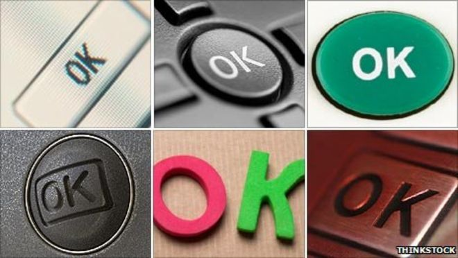
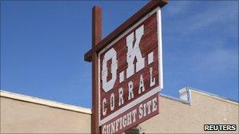
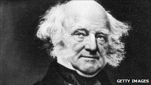

How 'OK' took over the world - BBC News

# How 'OK' took over the world

- 18 February 2011

- From the section [Magazine](http://www.bbc.co.uk/news/magazine)

- 1 comments

 These are external links and will open in a new window

- [Share](http://www.bbc.co.uk/news/magazine-12503686#share-tools)

   

It crops up in our speech dozens of times every day, although it apparently means little. So how did the word "OK" conquer the world, asks Allan Metcalf.

"OK" is one of the most frequently used and recognised words in the world.

It is also one of the oddest expressions ever invented. But this oddity may in large measure account for its popularity.

It's odd-looking. It's a word that looks and sounds like an abbreviation, an acronym.

We generally spell it OK - the spelling okay is relatively recent, and still relatively rare - and we pronounce it not "ock" but by sounding the names of the letters O and K.

Visually, OK pairs the completely round O with the completely straight lines of K.

So both in speech and in writing OK stands out clearly, easily distinguished from other words, and yet it uses simple sounds that are familiar to a multitude of languages.

Almost every language has an O vowel, a K consonant, and an A vowel. So OK is a very distinctive combination of very familiar elements. And that's one reason it's so successful. OK stands apart.

Ordinarily a word so odd, so distinctive from others, wouldn't be allowed in a language to begin with. As a general rule, a language allows new words only when they resemble familiar ones.

Clever coinages may be laughed at and enjoyed, but hardly ever adopted by users of the language.

So it was in Boston, Massachusetts, USA, in the late 1830s, when newspaper editors enjoyed inventing fanciful abbreviations, like "WOOOFC" for "with one of our first citizens" and OW for "all right".

Needless to say, neither of these found a permanent place in the language. But they provided the unusual context that enabled the creation of OK.

On 23 March 1839, OK was introduced to the world on the second page of the Boston Morning Post, in the midst of a long paragraph, as "o.k. (all correct)".

   

How this weak joke survived at all, instead of vanishing like its counterparts, is a matter of lucky coincidence involving the American presidential election of 1840.

One candidate, Martin Van Buren, was nicknamed Old Kinderhook, and there was a false tale that a previous American president couldn't spell properly and thus would approve documents with an "OK", thinking it was the abbreviation for "all correct".

Within a decade, people began actually marking OK on documents and using OK on the telegraph to signal that all was well. So OK had found its niche, being easy to say or write and also distinctive enough to be clear.

But there was still only restricted use of OK. The misspelled abbreviation may have implied illiteracy to some, and OK was generally avoided in anything but business contexts, or in fictional dialogue by characters deemed to be rustic or illiterate.

Indeed, by and large American writers of fiction avoided OK altogether, even those like Mark Twain who freely used slang.

But in the 20th Century OK moved from margin to mainstream, gradually becoming a staple of nearly everyone's conversation, no longer looked on as illiterate or slang.

Its true origin was gradually forgotten. OK used such familiar sounds that speakers of other languages, hearing it, could rethink it as an expression or abbreviation in their own language.

Thus it was taken into the Choctaw Native American language, whose expression "okeh" meant something like "it is so".

US President Woodrow Wilson, early in the 20th Century, lent his prestige by marking okeh on documents he approved.

And soon OK was to find its place in many languages as a reminder of a familiar word or abbreviation.

But what makes OK so useful that we incorporate it into so many conversations?

It's not that it was needed to "fill a gap" in any language. Before 1839, English speakers had "yes", "good", "fine", "excellent", "satisfactory", and "all right".

What OK provided that the others did not was neutrality, a way to affirm or to express agreement without having to offer an opinion.

Consider this dialogue: "Let's meet again this afternoon."
Reply: "OK."
Compare that with: "Let's meet again this afternoon."
Reply: "Wonderful!" or "If we must."
   
OK allows us to view a situation in simplest terms, just OK or not.

When someone falls down, the question is not "how well are you feeling?" but the more basic "are you OK?".

And any lingering stigma associated with OK is long since gone. Now OK is not out of place in the mouth of a US president like Barack Obama.

Speaking to schoolchildren in 2009 he said: "That's OK. Some of the most successful people in the world are the ones who've had the most failures."

The word would also easily slip from the mouth of a British prime minister like David Cameron.

And yet, despite its conquest of conversations the world over, there remain vast areas of language where OK is scarcely to be found.

You won't find OK in prepared speeches. Indeed, most formal speeches and reports are free of OK.

Modern English translations of the Bible remain almost entirely OK-free. Many a published book has not a single instance of OK.

But OK still rules over the vast domain of our conversation.

**Allan Metcalf is the author of OK: The Improbable Story of America's Greatest Word.**