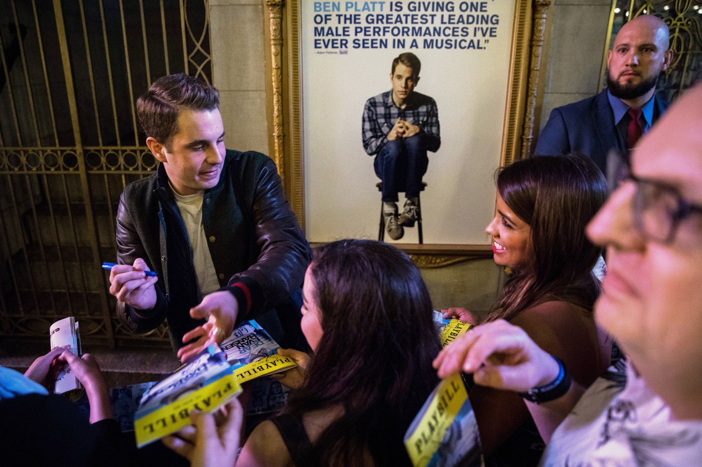
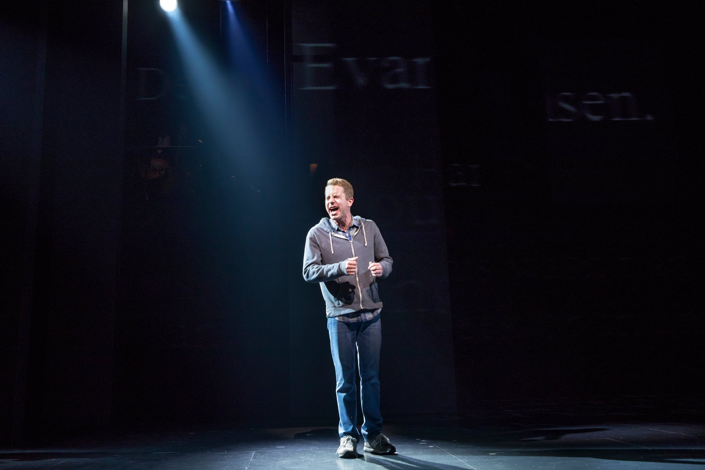

How a 23-Year-Old With Mild Anxiety and a Charmed Life Became the Lying, Sobbing, Lovesick Toast of Broadway

 Cover Photo
 

 Ben Platt, who plays the title role in Broadway’s “Dear Evan Hansen.”    Credit Damon Winter/The New York Times

# How a 23-Year-Old With Mild Anxiety and a Charmed Life Became the Lying, Sobbing, Lovesick Toast of Broadway

Ben Platt wrecks himself onstage in “Dear Evan Hansen.” Surviving it takes practice — and has made him a favorite to win a Tony Award.

By JOEL LOVELLMAY 10, 2017

[Continue reading the main story](https://www.nytimes.com/2017/05/10/theater/how-ben-platt-beame-the-toast-of-broadway-dear-evan-hansen-tony-awards.html?smid=tw-nytimes&smtyp=cur&_r=0#story-continues-1)Share This Page

- [**Share](#)
- [**Tweet](#)
- [**Pin](#)
- [**Email](#)
- [**More](#)
- [**Save](#)

I recently followed Ben Platt up to his dressing room after a Sunday matinee of the Broadway musical [“Dear Evan Hansen.”](https://www.nytimes.com/2016/12/04/theater/dear-evan-hansen-review.html) He looked worn out. His eyes were puffy and red. He sat shirtless in front of his mirror, against which leaned a framed photograph of Judy Garland, and removed his makeup. He’d lost 30 pounds to more convincingly play the part of an anxiety-crippled 17-year-old (he’s 23), and it was a little startling to see up close how lean he was. There were four perfectly round bruises on his back from his regular cupping sessions, among the therapies he employs to keep himself healthy enough to go onstage eight times a week and perform a role that ranks with Hedwig and Jean Valjean in its physical and emotional demands.

He pulled on a T-shirt and jacket, and now that he was dressed gave me a hug hello. (A friend of his described him to me as “the warmest person you’ll ever meet — a champion hugger.”) We headed down to the blue room in the Music Box Theater, where celebrities and friends convene after the show. The actress [Katie Finneran](http://www.nytimes.com/2012/10/21/theater/katie-finneran-takes-on-annie.html) (twice a Tony Award winner) was there and wrapped her arms around him the moment he stepped through the door. She held him for a long time, then stepped back and put her hands on his face, then pulled him close again. “Do you promise you’re taking care of yourself?” she whispered into his ear.

 Photo
 
**

 Mr. Platt is nominated for a Tony Award for his performance in “Dear Evan Hansen.”    Credit Sara Krulwich/The New York Times

Even if you don’t know Mr. Platt, this is the instinctive response to his performance, a nightly display of almost unbearable anguish and likely to earn him a Tony Award on June 11. You’re stunned by the intensity of it, and then you immediately think of the toll it must take on him night after night. It seems impossible to sustain, and yet he’s been doing it now since mid-November, a feat that has made him not just musical-theater famous, but also Met Gala, late-night-TV, Time 100-most-influential-people-in-the-world famous.

A lot has been said about the extraordinary physicality of Mr. Platt’s performance: the hunched posture he maintains throughout the show, the facial tics and nail-biting and the repetitive worrying of his fingers at the seam of his pants, the way in which he never for a moment loses this finely grained physical expression of Evan, even in the midst of the 11 songs that he performs, three of which are wrenching solos. He conveys such longing and loneliness and guilt and shame in those songs, with his voice, of course, but also through the pained contortions of his body and face.

 [Continue reading the main story](https://www.nytimes.com/2017/05/10/theater/how-ben-platt-beame-the-toast-of-broadway-dear-evan-hansen-tony-awards.html?smid=tw-nytimes&smtyp=cur&_r=0#story-continues-1)

## [Tony Awards](https://www.nytimes.com/news-event/tony-awards)

###

- [ ##    After a Nominator Is Denied Access, ‘1984’ Is Ineligible for Tonys   NOV 10](https://www.nytimes.com/2017/11/10/theater/1984-ineligible-tony-awards-nominator-denied-access.html?rref=collection%2Fnewseventcollection%2FTony%20Awards)

- [ ##    Unzipping After a Big Night Out   SEP 12](https://www.nytimes.com/2017/09/12/nyregion/metropolitan-diary-unzipping-after-the-tonys.html?rref=collection%2Fnewseventcollection%2FTony%20Awards)

- [ ##    Thomas Meehan, Who Wrote the Books for Broadway Hits, Dies at 88   AUG 22](https://www.nytimes.com/2017/08/22/theater/thomas-meehan-dead-tony-winner-hairspray.html?rref=collection%2Fnewseventcollection%2FTony%20Awards)

- [ ##    Lynn Ahrens and Her Little House in the Sky   JUL 7](https://www.nytimes.com/2017/07/07/realestate/lynn-ahrenss-little-house-in-the-sky.html?rref=collection%2Fnewseventcollection%2FTony%20Awards)

- [ ##    What I Love | Lynn Ahrens   JUL 7](https://www.nytimes.com/slideshow/2017/07/07/realestate/what-i-love-lynn-ahrens.html?rref=collection%2Fnewseventcollection%2FTony%20Awards)

[See More »](https://www.nytimes.com/news-event/tony-awards)

## Related Coverage

- [              ##   Review: In ‘Dear Evan Hansen,’ a Lonely Teenager, a Viral Lie and a Breakout Star  DEC. 4, 2016](https://www.nytimes.com/2016/12/04/theater/dear-evan-hansen-review.html)

- [              ##   ‘Dear Evan Hansen’ Is Shaping Up to Be a Hit  DEC. 19, 2016](https://www.nytimes.com/2016/12/19/theater/dear-evan-hansen-is-shaping-to-be-a-hit.html)

- [              ##   What It’s Like to Make It in Showbiz With Your Best Friend  NOV. 10, 2016](https://www.nytimes.com/2016/11/13/theater/benj-pasek-justin-paul-dear-evan-hansen.html)

- [              ##   Ben Platt, From ‘Pitch Perfect’ to an Anxious Teen on Stage  MARCH 31, 2016](https://www.nytimes.com/2016/04/03/theater/ben-platt-from-pitch-perfect-to-an-anxious-teen-on-stage.html)

Advertisement

[Continue reading the main story](https://www.nytimes.com/2017/05/10/theater/how-ben-platt-beame-the-toast-of-broadway-dear-evan-hansen-tony-awards.html?smid=tw-nytimes&smtyp=cur&_r=0#story-continues-2)

 [    ADVERTISEMENT:Turkish Airlines             Your browser does not support the element.   ](https://adclick.g.doubleclick.net/pcs/click?xai=AKAOjsvZguaxCE88n6msLLvTV0tm59SXVSM8DDtoT7toVYpiN1ATlooqClgjUbiuSI4IZDTLQqQAEIv1P7lzlRSVFQMoJJLbPbe23ESU9RrJxN9RAh_3CTfYrYreDnXrjo6Eh7-seCnTGq40MStFF-rIltK_tnNiZBlbjzujtmb2t_ebqsvpNjIzlbcM4Svnu7NG-ckiuX4xOxu6zYbufSlyF2DqITA7_wW1EFbF8rXkCr0uazDQLhwfj4w2bYk&sig=Cg0ArKJSzDrm8Jsv94cfEAE&urlfix=1&adurl=https://bs.serving-sys.com/serving/adServer.bs?cn=trd&mc=click&pli=23077793&PluID=0&ord=1388303765)

“He sings through tears!” Neil Patrick Harris said when we spoke recently. “Think of how hard that is to do, to sing an entire song and cry simultaneously. I couldn’t do it. I *physically* couldn’t do it. I’d sound like a goat.”

We were talking about the ways in which Mr. Platt’s Evan reminded me of the transgender glam rocker and title character of [“](https://www.nytimes.com/2014/04/23/theater/hedwig-and-the-angry-inch-stars-neil-patrick-harris.html)[Hedwig](https://www.nytimes.com/2014/04/23/theater/hedwig-and-the-angry-inch-stars-neil-patrick-harris.html)[and the Angry Inch,”](https://www.nytimes.com/2014/04/23/theater/hedwig-and-the-angry-inch-stars-neil-patrick-harris.html) for which Mr. Harris won a Tony in 2014. “When I was doing Hedwig,” he said, “it was kind of euphoric in its masochism. I’d stumble off at the end, and my leg would be bleeding, and I wouldn’t know when it happened. It was just a kind of mania that carried me to some other place each night. When I watched Ben’s performance, I felt myself carried into his world in that same way.”

“He sings through tears!
Think of how hard that is
to do, to sing an entire
song and cry simultaneously.”
 Neil Patrick Harris

It’s hard to think of a character in a musical who is so relatable to so many people in the crowd each night — teenagers struggling with anxiety, parents clinging to whatever fine thread still connects them to their kids, people who are ashamed of something they’ve done or who fear they are unlovable. It seems like a more intense level of responsibility, psychologically speaking, than most Broadway stars have to bear.

“I have my own issues with anxiety and self-love, just like everybody does,” Mr. Platt said. “So I don’t want to suggest that just because I’ve been given this role, I know how to fix other people’s problems. I want to honor what’s happening, the way people are responding, but — I’m still trying to understand where to draw the line.”

After small talk with a family friend in the blue room (“I remember your two very cute children!”), he had the final hurdle of his performing week: the fans. He was off to sign autographs and then head straight uptown to his apartment to do nothing but order from Seamless and watch TV and embark, literally, on “20 straight hours of mouth-shutting.”

At the bottom of the stairs, an imposing-looking bodyguard was waiting to shadow him while he greeted the crowd that had gathered beyond the stage door. It was four or five people deep, and everyone erupted when he stepped outside.

#### A ‘Freak,’ a ‘Unicorn’

For those who haven’t seen the show, an incomplete (and partly spoiler-laden) recap: As part of the therapy for Evan’s anxiety, his doctor instructs him to write a letter, addressed to himself, at the beginning of each day (“Dear Evan Hansen, Today is going to be a good day. …”). One of those letters, in which he also confesses his longing for a classmate named Zoe Murphy, falls into the hands of Zoe’s alienated, depressed brother, Connor. When Connor kills himself, Evan’s letter, which Connor’s parents mistakenly assume was written *by* Connor *to* Evan, is discovered in his pocket.

What follows is the gut-twisting cascade familiar to anyone who’s ever borne the weight of, or been wounded by, a lie that can’t be contained. Evan encourages the Murphys to believe he and Connor were friends; he grows close to the family, their grief alleviated by the stories he tells them of his relationship with their son, and Zoe begins to fall in love with him; eventually he gives an excruciating address at a school assembly, which on the surface is about Connor, but really is his own fantasy of connection and unconditional love. A video of the address goes viral, and Evan becomes a kind of hero for the world’s lonely souls. There’s no reeling the lie back in.

 [Continue reading the main story](https://www.nytimes.com/2017/05/10/theater/how-ben-platt-beame-the-toast-of-broadway-dear-evan-hansen-tony-awards.html?smid=tw-nytimes&smtyp=cur&_r=0#story-continues-4)

 Photo
 
**

 Mr. Platt in his dressing room at the Music Box Theater.    Credit Damon Winter/The New York Times

Three years ago, the show’s creators — [Steven Levenson](https://www.nytimes.com/2017/03/14/theater/steven-levenson-the-first-time-i-attended-a-political-protest.html), who wrote the book; [Benj Pasek and Justin Paul](https://www.nytimes.com/2016/11/13/theater/benj-pasek-justin-paul-dear-evan-hansen.html?action=click&contentCollection=Theater&module=RelatedCoverage&region=Marginalia&pgtype=article), the music and lyrics; and Michael Greif, its director — brought a group of actors together for the first time to read through the script. They’d been developing the story since 2011, and while they weren’t completely sure of what they had, it felt promising, and the producers were vigilant about controlling when and how word of it would eventually get out. Watermarked copies of the script were handed out and collected at the end of the session. Nondisclosure agreements were signed. “We came in for that first reading,” Mr. Platt recalled, “and they said, ‘We’re not going to tell you who he is or what the story is — we’re just going to read through and see what happens.’”

Three years before that, when he was 17, he’d auditioned for Mr. Pasek and Mr. Paul’s musical [“Dogfight,”](http://www.nytimes.com/2012/07/17/theater/reviews/dogfight-at-second-stage-theater.html?smid=pl-share) about a group of Marines on the eve of shipping out to Vietnam. “He was incredible,” Mr. Paul said. “But we’d begun casting the show, and the leads were all in their early 20s. It was one those casting moments when you know someone is so special, but you also know he just doesn’t fit.”

Mr. Pasek sent him a Facebook message the afternoon of the audition, mentioning this other idea they were developing and suggesting they stay in touch (“I was like, that’s nice, but nothing will ever happen,” Mr. Platt said). Over the next few years, they tracked his life and career — his performance in the 2012 film “Pitch Perfect” as Benji, the magic-loving misfit; his enrolling in Columbia University and then dropping out six weeks later to play Elder Cunningham in the Chicago production of “The Book of Mormon”; and eventually his assuming the role [on Broadway](https://www.nytimes.com/2014/08/21/theater/the-book-of-mormon-on-broadway-retains-its-charms.html?smid=pl-share) in early 2014.

Mr. Platt said he was initially being considered for the “Dear Evan Hansen” role of Jared, the title character’s wisecracking friend, who spends much of the musical hurling abuse at Evan but is all in on the deception once he senses that Evan’s newfound social status might elevate his own. “I think Benj was the one who wanted to give me a shot to be the hero of the story, though,” Mr. Platt said. “And he convinced everybody that I should read for the lead.”

[Ben Platt - "Waving through a Window" from "Dear Evan Hansen"](https://www.youtube.com/watch?v=NlHALdSTPX0)

[  Ben Platt Made Stephen Cry For Two Hours Straight  The Late Show with Stephen Colbert • 859K views  6:39](https://www.youtube.com/watch?v=wktjTBJwbwo)[  Dear Evan Hansen - "Waving Through a Window " HD (Lyrics in the description)  McKenna Webb • 65K views  4:58](https://www.youtube.com/watch?v=42Jgqg_9cA0)[  Dear Evan Hansen - 2016 Obie Awards Performance - Waving Through a Window  Obie Awards • 445K views  4:26](https://www.youtube.com/watch?v=L27tzA6UWD8)[  Dear Evan Hansen - Live Tony Awards 2017 - Waving Through a Window  BuddyTravelr • 535K views  4:30](https://www.youtube.com/watch?v=Nlw8hp_vzec)[  Oasis - Where Did It All Go Wrong? (Acoustic @ Jools Holland)  PeiBoLedZepp • 168K views  4:32](https://www.youtube.com/watch?v=glGZ3lDlKLU)[  "Only Us" featuring Laura Dreyfuss and Ben Platt | DEAR EVAN HANSEN  Dear Evan Hansen • 1.6M views  3:44](https://www.youtube.com/watch?v=s1Evnzkez7o)[  Dear Evan Hansen Cast Performs on 2017 Macy's Thanksgiving Day Parade  Victor Legra • 601K views  4:17](https://www.youtube.com/watch?v=fjmwAwMUID8)[  Pitch Perfect Auditions [ Unpitched ]  MHKM :P • 3.2M views  3:43](https://www.youtube.com/watch?v=4gXxtoQ73zM)[  Broadway Carpool Karaoke ft. Hamilton & More  The Late Late Show with James Corden • 23M views  11:05](https://www.youtube.com/watch?v=YshgmStEZh0)[  Damiyr - I'm Right Here  Damiyr • 99K views  4:01](https://www.youtube.com/watch?v=UrgaE1bSxdw)[  I Believe from the Book of Mormon Musical on the 65th Tony Awards.  Kevin price • 6M views  5:24](https://www.youtube.com/watch?v=GVJgmp2Tc2s)[  Noah Galvin- Waving Through a Window from Dear Evan Hansen  Joseph M • 65K views  4:20](https://www.youtube.com/watch?v=dnfttfivfYw)

3:16 / 3:52
[(L)](https://www.youtube.com/watch?v=NlHALdSTPX0)

Ben Platt Sings “Waving through a Window” from “Dear Evan Hansen.”  Video by TimesTalks

They needed an actor whose innate warmth and likability would help them figure out just how far Evan could go in the other direction, Mr. Pasek said — how egregious his actions could be, while still keeping the audience on his side. “It’s such a complex role; we were still trying to get a handle on what it was,” he said. “We went into that first workshop thinking, we’ll see what we think of Ben, and we’ll see if this role is written right. We’ll just see. Then, honestly, within five minutes into that first reading, Michael [Greif] turned to us and said, ‘O.K., we know what we have here.’”

“I’ve never met an actor who has such emotional access,” Mr. Levenson said. “Yet every night, as intense as the role is internally, he hits each moment exactly the same. He’s technically perfect, *every* time. I find it a mystery. He really is a unicorn.”

I know what he means. It’s like trying to describe why Stephen Curry is good at basketball. There’s an element of genius there that can’t really be captured. On the other hand, it’s not so mysterious at all. Stephen Curry is the son of one of the greatest shooters in N.B.A. history. And Ben Platt grew up in Beverly Hills, the son of the theater and film producer Marc Platt, the producer of the Broadway blockbuster “Wicked” and the Oscar-winning movie “La La Land.”

“He’s technically
perfect, every time.
I find it a mystery.
He really is a unicorn.”
 Steven Levenson

“He was part of this big musical-theater-obsessed family,” Mr. Pasek said, “and because of that he’s an incredible student of the form. He was basically an empty vessel that got filled with show tunes.”

It’s true, Mr. Platt said, that while other kids were playing sports or video games, he was listening to “Gypsy”: “I spent a lot of time turning over furniture and trash cans and staging ‘Cats’ in my backyard.” And it’s true, too, that being the son of Marc Platt opened doors for him. “It would be totally disingenuous if I didn’t acknowledge that being my father’s son has helped me,” he said. “But it’s also made me aware of how lucky I am, and how hard I have to work to prove I deserve these opportunities I’ve been given. I hope this” — meaning his performance as Evan — “kind of puts that question to rest.”

Mr. Levenson told me he didn’t learn who Mr. Platt’s father was until a year into knowing him. “He doesn’t wear that at all,” he said. “You’d have no idea that he comes from L.A. and that community.”

## Newsletter Sign Up

 [Continue reading the main story](https://www.nytimes.com/2017/05/10/theater/how-ben-platt-beame-the-toast-of-broadway-dear-evan-hansen-tony-awards.html?smid=tw-nytimes&smtyp=cur&_r=0#continues-post-newsletter)

### Theater Update

Every week, stay on top of the top-grossing Broadway shows, recent reviews, Critics’ Picks and more.

 You agree to receive occasional updates and special offers for The New York Times's products and services.

I'm not a robot

reCAPTCHA

[Privacy](https://www.google.com/intl/en/policies/privacy/) - [Terms](https://www.google.com/intl/en/policies/terms/)

- [See Sample](http://www.nytimes.com/newsletters/sample/theater-update?pgtype=subscriptionspage&version=lifestyle&contentId=CU&eventName=sample&module=newsletter-sign-up)

- [Manage Email Preferences](https://www.nytimes.com/mem/email.html)

- [Privacy Policy](https://www.nytimes.com/privacy)

- Opt out or [contact us](https://www.nytimes.com/help/index.html) anytime

Every person I spoke with talked in hyperbolic terms about Mr. Platt’s work ethic, apparently present since even before he was cast in a tour of “Caroline, or Change” at 10, and also about his instinctive ability to do things, as Mr. Greif put it, “that only the greats can do.” He compared him to [Patti LuPone and Christine Ebersole](https://www.nytimes.com/2017/03/29/theater/patti-lupone-christine-ebersole-war-paint-broadway.html?action=click&contentCollection=Theater&module=RelatedCoverage&region=Marginalia&pgtype=article) (whom Mr. Greif recently directed in [“War Paint,”](https://www.nytimes.com/2017/04/06/theater/review-war-paint-patti-lupone-christine-ebersole.html) co-produced by Marc Platt). “You feel you’re in the presence of someone who conserves himself all day so that he can be most alive on the stage,” Mr. Greif explained.

Will Roland, who ended up with the role of Jared, put it most succinctly: “He’s a freak. What else can I say?”

#### Managing the Strain

Seven of the eight cast members in “Dear Evan Hansen” have been together since the original eight-week run at Arena Stage in Washington in 2015, and they still have their rituals, including a preperformance dance party in Mr. Platt’s dressing room minutes before they go onstage. Often on Sundays they’ll go out for a drink to celebrate the end of the week. “We ask Ben to come every time, and he almost always says, ‘No, I have to go home and rest my voice.’’’ Mr. Roland said. “*Every* once in a while he’ll say, ‘I’m going crazy, please take me out.’ And then he’ll come and have one drink and go home.”

“I live a pretty monkish existence,” Mr. Platt said.

“It won’t always be like this,” he added. (His contract is up in November.) “But I feel as long as I’m doing this role, everything I do has to be in the service of that. I don’t want there to be a single performance where people leave feeling like they didn’t get the best I could offer. If that means denying myself some things, that’s O.K. I don’t think anything can be genuinely fulfilling or powerful if it’s not taking some kind of a toll. For now, I’m definitely willing to let that toll be taken.”

 [Continue reading the main story](https://www.nytimes.com/2017/05/10/theater/how-ben-platt-beame-the-toast-of-broadway-dear-evan-hansen-tony-awards.html?smid=tw-nytimes&smtyp=cur&_r=0#story-continues-8)

 Photo
 
**

 Mr. Platt outside the Music Box Theater.    Credit Damon Winter/The New York Times

There are levels to the monkishness. On the purely physical, he sleeps nine or 10 hours a night, eats no gluten or dairy and goes for long stretches each day in silence to rest his voice. He takes zinc and oregano supplements and constantly hydrates. He has two physical therapy sessions a week, “to make sure I don’t develop tree-trunk neck and to keep my posture from becoming too much like Evan’s.” He adds: “It’s a losing battle, though. My posture’s horrible now.” (He also bites his nails and cracks his knuckles obsessively, in a way he never did before, he said.)

His longtime voice coach, Liz Caplan, comes to his dressing room twice each week. She was there recently, a few days after he’d missed his first performance since 2015. “I got a yeast infection on my vocal cords,” Mr. Platt said. “I really wanted to get through the run without missing a performance.” It was during [Passover](http://topics.nytimes.com/top/reference/timestopics/subjects/p/passover/index.html?inline=nyt-classifier), and his entire family, parents and siblings and nephews, were in town to be with him. He didn’t speak for two days. “I whiteboarded my way through the seders,” he said.

Ms. Caplan massaged the muscles around his larynx and had him put peppermint oil in his nose. “We need to Roto-Rooter out his sinuses,” she said. They went through a series of exercises that gradually grew more intense, his range expanding and volume rising. “Use the knees,” she said. “Let the hip flexors help you.” As he started to belt more, he lifted one leg and bent at the knee, to relieve pressure on the vagus nerve and, as Ms. Caplan described it, “keep the neck and upper body from straining and separating.”

“We’re putting notes into his body in a positive, non-stressed way,” she said. “So then when he’s onstage in those unhealthy positions, he’ll be able to access them.”

It’s a gesture you see him repeat in the show, most notably in the second-act aria, “Words Fail,” in which he confesses to the Murphys that everything he’s told them is a lie. He’s standing before them, hunched and sobbing. It seems an impossible posture from which to project a song, but he’s incorporated the leg-lifting into his character so that it reads to the audience like a bodily expression of intolerable emotion. “There are all these other little places where I lean back and fill my diaphragm, and then go back into it,” he said. “Or, because I’m crying so hard, spaces where I know I can swallow the mucus that’s coming down. We put all these little things in place, and now they’re just there, they’re second nature, so I can just let it fly.”

It’s harder to describe how he manages the emotional strain, he said. “I look at Rachel” — Rachel Bay Jones, who plays Evan’s mother and has also been nominated for a Tony — “and if we’re dropped in, it’s just there. I don’t have to work for it at all. If for some reason it’s not, then I have to go into things in my own life, and that’s much harder. It’s harder to do and harder to come back from afterward.”

He didn’t say what those personal things were. When I spoke with Ms. Jones, she said: “I don’t really know how he does it, especially at such a young age. We all have those parts of ourselves we don’t find attractive and don’t want to show thousands of people. It takes so much work to strip away our protections around those things. But he’s able to let his guard fall away so naturally, and just be.”

I asked her if she had any idea why, and she was quiet for a moment. “I think it’s — he has this incredible relationship with his family,” she finally said. “I think his awareness of what it would be like to not have that, to lose that, is so deep.”

 [Continue reading the main story](https://www.nytimes.com/2017/05/10/theater/how-ben-platt-beame-the-toast-of-broadway-dear-evan-hansen-tony-awards.html?smid=tw-nytimes&smtyp=cur&_r=0#story-continues-11)

 Photo
 
**

 Ben Platt in Broadway’s “Dear Evan Hansen.”    Credit Sara Krulwich/The New York Times

In a recent phone interview, his mother, Julie Beren Platt, said: “I contemplate Ben’s emotional well-being every day. He’s very mature. But he’s also 23 and should be out with friends and meeting people. I worry about how much time he spends alone.”

She and her husband alternate coming to New York to be with him, she said, and Ben has a close group of friends from high school, the Harvard-Westlake School, who are all actors in New York. “Beanie Feldstein” — Jonah Hill’s younger sister — “is his nearest and dearest,” Ms. Platt said. “And Beanie is a block away in ‘Hello, Dolly!’ The two of them quietly keep each other company in between shows, which they’ve done since ninth grade when they were in ‘Guys and Dolls’ together.” (He watched news of the [Tony nominations](http://www.nytimes.com/pages/theater/theaterspecial/index.html?inline=nyt-classifier) at home with his mother and friends, celebrating with gluten-free pastries.)

Ms. Platt talked about her and her husband’s traditional Jewish upbringing, and how it was important to them to raise their own five children in the same way, in part to “protect them from Marc’s world, to teach them to be committed to a community larger than themselves and to live a grounded life.”

Mr. Platt’s lifelong rabbi, David Wolpe, has been close friends with Marc and Julie Platt since college. We talked just after Ben was named to the Time 100 list. “What do you do if you’re one of the most influential people at 23?” Rabbi Wolpe said. “What do you do at 25? Or 30? Or as you truly age? That’s where his family’s wisdom will come in. I think he understands the ephemeral nature of [being in](http://time.com/collection/2017-time-100/)[Time,](http://time.com/collection/2017-time-100/) and the permanent nature of the support that comes from the people who love him.”

His mother isn’t leaving that to chance. Part of her job, she said, is “to be very diligent about stopping and saying: ‘Let’s process this wonderful thing that’s happening to you right now. Let’s think about who came to see it today. What did that feel like to have them come backstage?’ I’m equal parts worry and celebration, but I want to help him focus on the celebration.”

#### Exposure and Retreat

“To-ny! To-ny!”

Outside the stage door on that Sunday afternoon, a brief chant broke out, rooting Mr. Platt on to the award that he hadn’t yet been nominated for. He raised his hands in a gesture that seemed to say “Thank you, and I’m humbled,” but also, “Please stop.”

He moved down the line, signing what had to be more than a hundred Playbills and ticket stubs and posters, nodding and briefly responding to people telling him how moved they are by his performance, that they suffer from anxiety, too, or their kid does, or their sister, and that they’re so grateful for what he’s done. Two girls who had been standing there since midway through the second act (they came in from Long Island because they’d heard he comes to the stage door on Sundays) cried as they told him they’d seen the show three times and they loved him.

He had this glazed, slightly pained look on his face that was hard to describe. It made me think there must still be a little transition period, even after all of these performances, between Evan onstage and Ben in real life, between all of that raw exposure and the self-preserving retreat from it.

That’s a lot to project onto a moment, I know. It might be more accurate to just say he was very tired. Whatever the case, I liked the idea that even as we all stared, projecting ourselves onto him, he was slipping back into his own skin, and for the next 48 hours, anyway, he didn’t have to be anything other than a 23-year-old in New York, listening to show tunes and waiting for his Seamless order to arrive.

 ** Correction: May 13, 2017 **

A capsule summary on the cover this weekend for an article about the actor Ben Platt misstates the number of times he performs the title role each week in the musical “Dear Evan Hansen.” It is eight times, not seven. (The error also appears in the article, which begins on Page 10.) In addition, the article misstates the year in which Mr. Platt performed the title role during the musical’s original eight-week run at the Arena Stage in Washington. It was 2015, not 2014.

A version of this article appears in print on May 14, 2017, on Page AR10 of the New York edition with the headline: He Sobs 8 Times a Week.   [Order Reprints](http://www.nytreprints.com/)|  [Today's Paper](http://www.nytimes.com/pages/todayspaper/index.html)|[Subscribe](http://www.nytimes.com/subscriptions/Multiproduct/lp839RF.html?campaignId=48JQY)

 [Continue reading the main story](https://www.nytimes.com/2017/05/10/theater/how-ben-platt-beame-the-toast-of-broadway-dear-evan-hansen-tony-awards.html?smid=tw-nytimes&smtyp=cur&_r=0#whats-next)