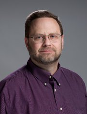

How a Church Deacon Found the Biggest Prime Number Yet (It Wasn’t as Hard as You Think)

# How a Church Deacon Found the Biggest Prime Number Yet (It Wasn’t as Hard as You Think)

Photo

 

Jon Pace is the discoverer of the largest known prime number, 23.2 million digits long. Credit Steve Cook/FedEx Corporate Communications

A huge math discovery in December was made in the unlikeliest of places: on a church computer in a Memphis suburb.

The background software running on the computer unearthed a rare kind of prime number called a Mersenne prime. It was [the 50th and largest one](https://www.mersenne.org/primes/press/M77232917.html) to be found, containing over 23 million digits.

But for this behemoth to come to light, someone had to have installed free software used to search for Mersenne prime numbers, and that someone is Jon Pace, a deacon, FedEx finance manager and math aficionado who had spent 14 years hunting for such a number.

“There are tens of thousands of computers involved in the search,” Mr. Pace, 51, said in a phone interview on Wednesday. “On average, they are finding less than one a year. The odds of one of my computers making a prime number discovery are astronomical.”

 [Continue reading the main story](https://www.nytimes.com/2018/01/26/science/prime-number-mersenne-church.html?module=WatchingPortal&region=c-column-middle-span-region&pgType=Homepage&action=click&mediaId=thumb_square&state=standard&contentPlacement=9&version=internal&contentCollection=www.nytimes.com&contentId=https%3A%2F%2Fwww.nytimes.com%2F2018%2F01%2F26%2Fscience%2Fprime-number-mersenne-church.html&eventName=Watching-article-click#story-continues-1)

## Related Coverage

Advertisement

[Continue reading the main story](https://www.nytimes.com/2018/01/26/science/prime-number-mersenne-church.html?module=WatchingPortal&region=c-column-middle-span-region&pgType=Homepage&action=click&mediaId=thumb_square&state=standard&contentPlacement=9&version=internal&contentCollection=www.nytimes.com&contentId=https%3A%2F%2Fwww.nytimes.com%2F2018%2F01%2F26%2Fscience%2Fprime-number-mersenne-church.html&eventName=Watching-article-click#story-continues-2)

Mr. Pace’s discovery is known as M77232917 and was announced on Jan. 3. It is expressed as 277,232,917 – 1 and is 23,249,425 digits, nearly one million digits larger than the previous record-holder, which [The New York Times wrote about in 2016](https://www.nytimes.com/2016/01/22/science/new-biggest-prime-number-mersenne-primes.html). As we explained then:

A prime number is not divisible by any positive integer except 1 and itself. Some prime numbers are named after [Marin Mersenne](http://www.britannica.com/biography/Marin-Mersenne), a French theologian and mathematician who studied them in the early 17th century. They can be written in the form 2*n* – 1 where *n *is an integer. For example, 3 is a Mersenne prime. Plug in 2 for *n,* and you find 22 − 1 = 4 − 1 = 3. But not all integers plugged into this expression generate a prime number, and as integers get bigger, prime numbers become rarer.

To recruit hunters for them, a volunteer project called the [Great Internet Mersenne Prime Search](http://www.mersenne.org/), or Gimps, came on the scene in 1996.

Mr. Pace said that when he became a Gimps volunteer, 14 years ago, he was excited by the idea of finding the first Mersenne prime with at least 10 million digits, and winning the $100,000 prize. But that discovery was made on a [U.C.L.A. computer in 2008](http://www.math.ucla.edu/~edson/prime/).

##  More Reporting on Mathematics

As the years went by, and other Mersenne prime numbers were found, Mr. Pace kept running the software in the background. “The C.P.U. will only work on it if there is literally nothing else for it to do,” he said. He started with computers at home and then used the ones at the Germantown Church of Christ, where he is a deacon and the network administrator.

Mr. Pace, who has a bachelor’s degree in electrical engineering and an M.B.A., described growing up in a community so small and rural that there were “cattle across the street.” He said his passion for math was ignited by an inspirational high school teacher named Harold Knight, who had a reputation for putting together formidable math teams.

“He was giving me problems that were unambiguous, as in there was one and only one correct answer,” Mr. Pace said, explaining how this appealed to his problem-solver personality.

“He’d challenge me, and if I failed he’d show me where I’d made a mistake or used an incorrect method, then move to the next challenge,” Mr. Pace recalled of the teacher, who died years ago.

## Newsletter Sign Up

 [Continue reading the main story](https://www.nytimes.com/2018/01/26/science/prime-number-mersenne-church.html?module=WatchingPortal&region=c-column-middle-span-region&pgType=Homepage&action=click&mediaId=thumb_square&state=standard&contentPlacement=9&version=internal&contentCollection=www.nytimes.com&contentId=https%3A%2F%2Fwww.nytimes.com%2F2018%2F01%2F26%2Fscience%2Fprime-number-mersenne-church.html&eventName=Watching-article-click#continues-post-newsletter)

### Science Times

We’ll bring you stories that capture the wonders of the human body, nature and the cosmos.

 You agree to receive occasional updates and special offers for The New York Times's products and services.

The moment of the discovery on Dec. 26 was not immediately apparent. The system is supposed to tell you if you find a Mersenne prime, Mr. Pace said, but that didn’t happen. Instead George Woltman, who founded the Gimps project, emailed him.

“Congratulations Jon!” Mr. Woltman wrote. “It’s either a new Mersenne prime (99.999%)” or a “bug (.001%).”

The software itself can help spot problems. Mersenne prime software is used to test computers for hardware errors, Mr. Woltman said. Smaller prime numbers are important to cryptography, but larger ones, so far, mostly just dazzle us.

To demonstrate the length of the number, Mr. Pace said that it took 69½ sheets of 11 by 17 paper to print out the number he found — in two-point font.

Discoverers of a Mersenne prime get their names recorded and, if it’s not a benchmark number, a modest cash prize. Mr. Pace is eligible for a $3,000 award. He has been interviewed by TV crews from as far away as Brazil.

All that publicity has led his college-age son and daughter, who were less interested before, to proudly make it known that this nerdy discovery was made possible by their father.

Mr. Pace’s son, Bryan, 22, who is studying computer engineering and shares an interest in math, said that the recent success had motivated him to set up the Gimps program again on his own computer.

And Mr. Pace’s daughter, Katherine, 19, has her own thoughts about the discovery. “It’s something that I’m oddly proud of, even though it isn’t actually my accomplishment,” she said. “The coolest thing about it is really seeing my dad’s humility on display. He is quick to tell people that anyone could have done it.”

Indeed, even as Mr. Pace promised to keep searching for the next big trophy — the 100-million-digit Mersenne prime, with a prize of $150,000 — he said there were two much smaller numbers he was even prouder of: “the 20 years I’ve served as a deacon at Germantown,” and “the 44 gallons of blood and platelets I’ve donated in my life.”

 [Continue reading the main story](https://www.nytimes.com/2018/01/26/science/prime-number-mersenne-church.html?module=WatchingPortal&region=c-column-middle-span-region&pgType=Homepage&action=click&mediaId=thumb_square&state=standard&contentPlacement=9&version=internal&contentCollection=www.nytimes.com&contentId=https%3A%2F%2Fwww.nytimes.com%2F2018%2F01%2F26%2Fscience%2Fprime-number-mersenne-church.html&eventName=Watching-article-click#whats-next)

## From Our Advertisers