How a Kalman filter works, in pictures | Bzarg

# How a Kalman filter works, in pictures

I have to tell you about the Kalman filter, because what it does is pretty damn amazing.

Surprisingly few software engineers and scientists seem to know about it, and that makes me sad because it is such a general and powerful tool for **combining information** in the presence of uncertainty. At times its ability to extract accurate information seems almost magical— and if it sounds like I’m talking this up too much, then take a look at [this previously posted video](http://www.bzarg.com/p/improving-imu-attitude-estimates-with-velocity-data) where I demonstrate a Kalman filter figuring out the *orientation* of a free-floating body by looking at its *velocity*. Totally neat!

# What is it?

You can use a Kalman filter in any place where you have **uncertain information** about some dynamic system, and you can make an **educated guess** about what the system is going to do next. Even if messy reality comes along and interferes with the clean motion you guessed about, the Kalman filter will often do a very good job of figuring out what actually happened. And it can take advantage of correlations between crazy phenomena that you maybe wouldn’t have thought to exploit!

Kalman filters are ideal for systems which are **continuously changing**. They have the advantage that they are light on memory (they don’t need to keep any history other than the previous state), and they are very fast, making them well suited for real time problems and embedded systems.

The math for implementing the Kalman filter appears pretty scary and opaque in most places you find on Google. That’s a bad state of affairs, because the Kalman filter is actually super simple and easy to understand if you look at it in the right way. Thus it makes a great article topic, and I will attempt to illuminate it with lots of clear, pretty pictures and colors. The prerequisites are simple; all you need is a basic understanding of probability and matrices.

I’ll start with a loose example of the kind of thing a Kalman filter can solve, but if you want to get right to the shiny pictures and math, feel free to [jump ahead](http://www.bzarg.com/p/how-a-kalman-filter-works-in-pictures/#mathybits).

# What can we do with a Kalman filter?

Let’s make a toy example: You’ve built a little robot that can wander around in the woods, and the robot needs to know exactly where it is so that it can navigate.

We’ll say our robot has a state xk→, which is just a position and a velocity:
xk→=(p⃗ ,v⃗ )

Note that the state is just a list of numbers about the underlying configuration of your system; it could be anything. In our example it’s position and velocity, but it could be data about the amount of fluid in a tank, the temperature of a car engine, the position of a user’s finger on a touchpad, or any number of things you need to keep track of.

Our robot also has a GPS sensor, which is accurate to about 10 meters, which is good, but it needs to know its location more precisely than 10 meters. There are lots of gullies and cliffs in these woods, and if the robot is wrong by more than a few feet, it could fall off a cliff. So GPS by itself is not good enough.

We might also know something about how the robot moves: It knows the commands sent to the wheel motors, and its knows that if it’s headed in one direction and nothing interferes, at the next instant it will likely be further along that same direction. But of course it doesn’t know everything about its motion: It might be buffeted by the wind, the wheels might slip a little bit, or roll over bumpy terrain; so the amount the wheels have turned might not exactly represent how far the robot has actually traveled, and the prediction won’t be perfect.

The GPS **sensor** tells us something about the state, but only indirectly, and with some uncertainty or inaccuracy. Our **prediction** tells us something about how the robot is moving, but only indirectly, and with some uncertainty or inaccuracy.

But if we use all the information available to us, can we get a better answer than **either estimate would give us by itself**? Of course the answer is yes, and that’s what a Kalman filter is for.

# How a Kalman filter sees your problem

Let’s look at the landscape we’re trying to interpret. We’ll continue with a simple state having only position and velocity.

x⃗ =[pv]

We don’t know what the *actual* position and velocity are; there are a whole range of possible combinations of position and velocity that might be true, but some of them are more likely than others:

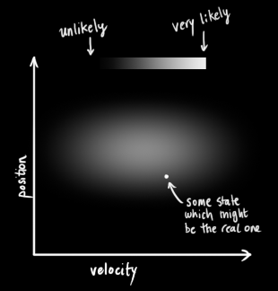

The Kalman filter assumes that both variables (postion and velocity, in our case) are random and *Gaussian distributed.* Each variable has a **mean** value μ, which is the center of the random distribution (and its most likely state), and a **variance**  σ2, which is the uncertainty:

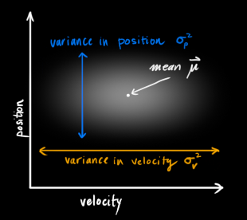

In the above picture, position and velocity are **uncorrelated**, which means that the state of one variable tells you nothing about what the other might be.

The example below shows something more interesting: Position and velocity are **correlated**. The likelihood of observing a particular position depends on what velocity you have:

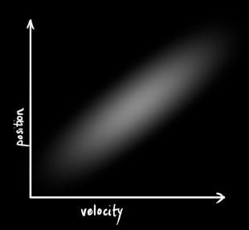This kind of situation might arise if, for example, we are estimating a new position based on an old one. If our velocity was high, we probably moved farther, so our position will be more distant. If we’re moving slowly, we didn’t get as far.

This kind of relationship is really important to keep track of, because it gives us **more information: **One measurement tells us something about what the others could be. And that’s the goal of the Kalman filter, we want to squeeze as much information from our uncertain measurements as we possibly can!

This correlation is captured by something called a [covariance matrix](https://en.wikipedia.org/wiki/Covariance_matrix). In short, each element of the matrix Σij is the degree of correlation between the *ith* state variable and the *jth* state variable. (You might be able to guess that the covariance matrix is [symmetric](https://en.wikipedia.org/wiki/Symmetric_matrix), which means that it doesn’t matter if you swap *i* and *j*). Covariance matrices are often labelled “Σ”, so we call their elements “Σij”.

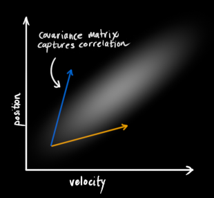

# Describing the problem with matrices

We’re modeling our knowledge about the state as a Gaussian blob, so we need two pieces of information at time k: We’ll call our best estimate x̂ k (the mean, elsewhere named μ ), and its covariance matrix Pk.

x̂ kPk=[positionvelocity]=[ΣppΣvpΣpvΣvv](1)

(Of course we are using only position and velocity here, but it’s useful to remember that the state can contain any number of variables, and represent anything you want).

Next, we need some way to look at the **current state** (at time **k-1**) and **predict the next state** at time **k**. Remember, we don’t know which state is the “real” one, but our prediction function doesn’t care. It just works on *all of them*, and gives us a new distribution:

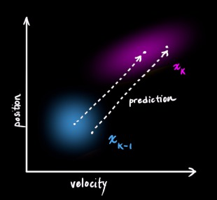We can represent this prediction step with a matrix, Fk:

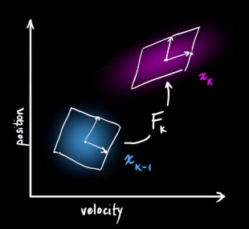It takes *every point* in our original estimate and moves it to a new predicted location, which is where the system would move if that original estimate was the right one.

Let’s apply this. How would we use a matrix to predict the position and velocity at the next moment in the future? We’ll use a really basic kinematic formula:

pkvk=pk−1+Δt=vk−1vk−1
In other words:
x̂ k=[10Δt1]x̂ k−1=Fkx̂ k−1(2)(3)

We now have a **prediction matrix** which gives us our next state, but we still don’t know how to update the covariance matrix.

This is where we need another formula. If we multiply every point in a distribution by a matrix A, then what happens to its covariance matrix Σ?

Well, it’s easy. I’ll just give you the identity:
Cov(x)Cov(Ax)=Σ=AΣAT(4)

So combining [(4)](http://www.bzarg.com/p/how-a-kalman-filter-works-in-pictures/#mjx-eqn-covident) with equation [(3)](http://www.bzarg.com/p/how-a-kalman-filter-works-in-pictures/#mjx-eqn-statevars):

x̂ kPk=Fkx̂ k−1=FkPk−1FTk(5)

## External influence

We haven’t captured everything, though. There might be some changes that **aren’t related to the state** itself— the outside world could be affecting the system.

For example, if the state models the motion of a train, the train operator might push on the throttle, causing the train to accelerate. Similarly, in our robot example, the navigation software might issue a command to turn the wheels or stop. If we know this additional information about what’s going on in the world, we could stuff it into a vector called uk→, do something with it, and add it to our prediction as a correction.

Let’s say we know the expected acceleration a due to the throttle setting or control commands. From basic kinematics we get:

pkvk=pk−1+Δt=vk−1+vk−1+12aΔt2aΔt
In matrix form:
x̂ k=Fkx̂ k−1+[Δt22Δt]a=Fkx̂ k−1+Bkuk→(6)

Bk is called the **control matrix** and uk→ the **control vector.** (For very simple systems with no external influence, you could omit these).

Let’s add one more detail. What happens if our prediction is not a 100% accurate model of what’s actually going on?

## External uncertainty

Everything is fine if the state evolves based on its own properties. Everything is *still *fine if the state evolves based on external forces, so long as we know what those external forces are.

But what about forces that we *don’t *know about? If we’re tracking a quadcopter, for example, it could be buffeted around by wind. If we’re tracking a wheeled robot, the wheels could slip, or bumps on the ground could slow it down. We can’t keep track of these things, and if any of this happens, our prediction could be off because we didn’t account for those extra forces.

We can model the uncertainty associated with the “world” (i.e. things we aren’t keeping track of) by adding some new uncertainty after every prediction step:

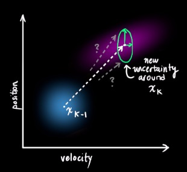

Every state in our original estimate could have moved to a *range* of states. Because we like Gaussian blobs so much, we’ll say that each point in x̂ k−1 is moved to somewhere inside a Gaussian blob with covariance Qk. Another way to say this is that we are treating the untracked influences as **noise** with covariance Qk.

[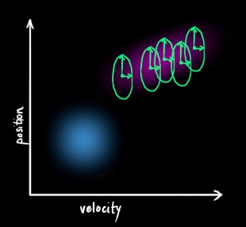](http://www.bzarg.com/wp-content/uploads/2015/08/gauss_10a.jpg)This produces a new Gaussian blob, with a different covariance (but the same mean):

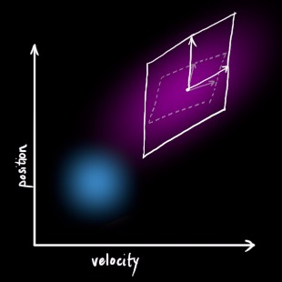

We get the expanded covariance by simply **adding**  Qk, giving our complete expression for the **prediction step**:

x̂ kPk=Fkx̂ k−1+Bkuk→=FkPk−1FTk+Qk(7)

In other words, the **new best estimate** is a **prediction** made from** previous best estimate**, plus a **correction** for **known external influences**.

And the **new uncertainty** is **predicted** from the **old uncertainty**, with some **additional uncertainty from the environment**.

All right, so that’s easy enough. We have a fuzzy estimate of where our system might be, given by x̂ k and Pk. What happens when we get some data from our sensors?

# Refining the estimate with measurements

We might have several sensors which give us information about the state of our system. For the time being it doesn’t matter what they measure; perhaps one reads position and the other reads velocity. Each sensor tells us something **indirect** about the state— in other words, the sensors operate on a state and produce a set of **readings**.

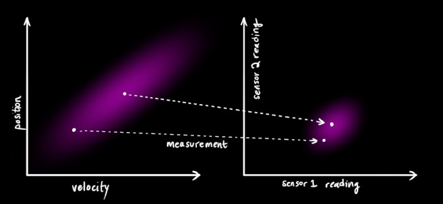Notice that the units and scale of the reading might not be the same as the units and scale of the state we’re keeping track of. You might be able to guess where this is going: We’ll model the sensors with a matrix, Hk.

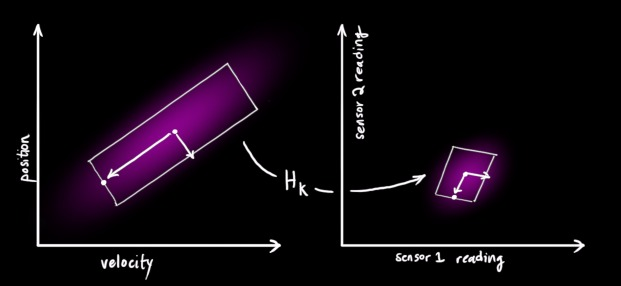

We can figure out the distribution of sensor readings we’d expect to see in the usual way:

μ⃗ expectedΣexpected=Hkx̂ k=HkPkHTk(8)

One thing that Kalman filters are great for is dealing with *sensor noise*. In other words, our sensors are at least somewhat unreliable, and every state in our original estimate might result in a *range* of sensor readings. 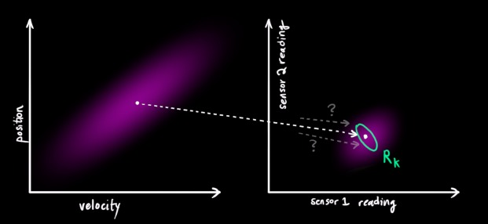

From each reading we observe, we might guess that our system was in a particular state. But because there is uncertainty, **some states are more likely than others** to have have produced the reading we saw: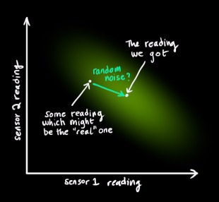

We’ll call the **covariance** of this uncertainty (i.e. of the sensor noise) Rk. The distribution has a **mean** equal to the reading we observed, which we’ll call zk→.

So now we have two Gaussian blobs: One surrounding the mean of our transformed prediction, and one surrounding the actual sensor reading we got.

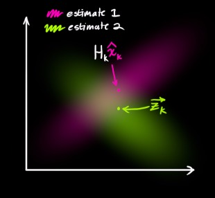

We must try to reconcile our guess about the readings we’d see based on the **predicted state** (**pink**) with a *different* guess based on our **sensor readings** (**green**) that we actually observed.

So what’s our new most likely state? For any possible reading (z1,z2), we have two associated probabilities: (1) The probability that our sensor reading zk→ is a (mis-)measurement of (z1,z2), and (2) the probability that our previous estimate thinks (z1,z2) is the reading we should see.

If we have two probabilities and we want to know the chance that *both *are true, we just multiply them together. So, we take the two Gaussian blobs and multiply them:

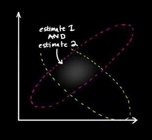

What we’re left with is the **overlap**, the region where *both* blobs are bright/likely. And it’s a lot more precise than either of our previous estimates. The mean of this distribution is the configuration for which **both estimates are most likely**, and is therefore the **best guess** of the true configuration given all the information we have.

Hmm. This looks like another Gaussian blob.
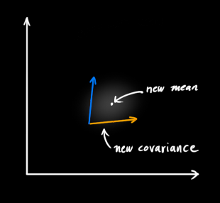

As it turns out, when you multiply two Gaussian blobs with separate means and covariance matrices, you get a *new* Gaussian blob with its **own** mean and covariance matrix! Maybe you can see where this is going: There’s got to be a formula to get those new parameters from the old ones!

# Combining Gaussians

Let’s find that formula. It’s easiest to look at this first in **one dimension**. A 1D Gaussian bell curve with variance σ2 and mean μ is defined as:

(x,μ,σ)=1σ2π‾‾‾√e−(x–μ)22σ2(9)

We want to know what happens when you multiply two Gaussian curves together. The blue curve below represents the (unnormalized) intersection of the two Gaussian populations:

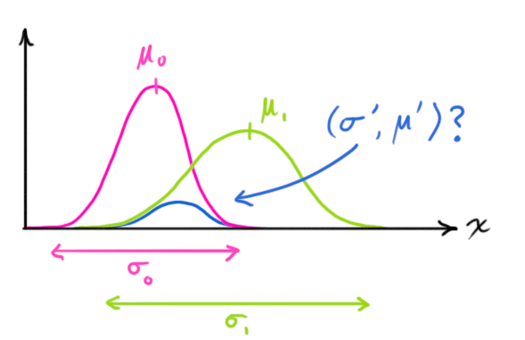
(x,μ0,σ0)⋅(x,μ1,σ1)=?(x,μ′,σ′)(10)

You can substitute equation [(9)](http://www.bzarg.com/p/how-a-kalman-filter-works-in-pictures/#mjx-eqn-gaussformula) into equation [(10)](http://www.bzarg.com/p/how-a-kalman-filter-works-in-pictures/#mjx-eqn-gaussequiv) and do some algebra (being careful to renormalize, so that the total probability is 1) to obtain:

μ′σ′2=μ0+σ20(μ1–μ0)σ20+σ21=σ20–σ40σ20+σ21(11)
We can simplify by factoring out a little piece and calling it k:
k=σ20σ20+σ21(12)

μ′σ′2=μ0+=σ20–k(μ1–μ0)kσ20(13)

Take note of how you can take your previous estimate and **add something** to make a new estimate. And look at how simple that formula is!

But what about a matrix version? Well, let’s just re-write equations [(12)](http://www.bzarg.com/p/how-a-kalman-filter-works-in-pictures/#mjx-eqn-gainformula) and [(13)](http://www.bzarg.com/p/how-a-kalman-filter-works-in-pictures/#mjx-eqn-update) in matrix form. If Σ is the covariance matrix of a Gaussian blob, and μ⃗  its mean along each axis, then:

K=Σ0(Σ0+Σ1)−1(14)

μ⃗ ′Σ′=μ0→+=Σ0–K(μ1→–μ0→)KΣ0(15)
K is a matrix called the **Kalman gain**, and we’ll use it in just a moment.
Easy! We’re almost finished!

# Putting it all together

We have two distributions: The predicted measurement with (μ0,Σ0)=(Hkx̂ k,HkPkHTk), and the observed measurement with (μ1,Σ1)=(zk→,Rk). We can just plug these into equation [(15)](http://www.bzarg.com/p/how-a-kalman-filter-works-in-pictures/#mjx-eqn-matrixupdate) to find their overlap:

Hkx̂ ′kHkP′kHTk=Hkx̂ k=HkPkHTk+–K(zk→–Hkx̂ k)KHkPkHTk(16)

And from [(14)](http://www.bzarg.com/p/how-a-kalman-filter-works-in-pictures/#mjx-eqn-matrixgain), the Kalman gain is:

K=HkPkHTk(HkPkHTk+Rk)−1(17)

We can knock an Hk off the front of every term in [(16)](http://www.bzarg.com/p/how-a-kalman-filter-works-in-pictures/#mjx-eqn-kalunsimplified) and [(17)](http://www.bzarg.com/p/how-a-kalman-filter-works-in-pictures/#mjx-eqn-eqkalgainunsimplified) (note that one is hiding inside K ), and an HTk off the end of all terms in the equation for P′k.

x̂ ′kP′k=x̂ k=Pk+–K′(zk→–Hkx̂ k)K′HkPk(18)

K′=PkHTk(HkPkHTk+Rk)−1(19)
…giving us the complete equations for the **update step.**

And that’s it! x̂ ′k is our new best estimate, and we can go on and feed it (along with P′k ) back into another round of **predict **or **update** as many times as we like.

[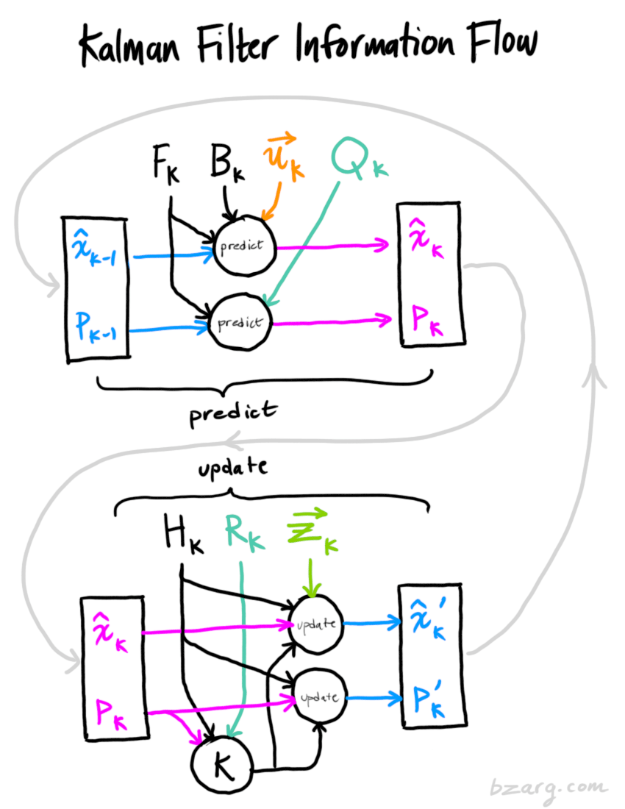](http://www.bzarg.com/wp-content/uploads/2015/08/kalflow.png)

# Wrapping up

Of all the math above, all you need to implement are equations [(7)](http://www.bzarg.com/p/how-a-kalman-filter-works-in-pictures/#mjx-eqn-kalpredictfull),[(18)](http://www.bzarg.com/p/how-a-kalman-filter-works-in-pictures/#mjx-eqn-kalupdatefull), and [(19)](http://www.bzarg.com/p/how-a-kalman-filter-works-in-pictures/#mjx-eqn-kalgainfull). (Or if you forget those, you could re-derive everything from equations [(4)](http://www.bzarg.com/p/how-a-kalman-filter-works-in-pictures/#mjx-eqn-covident) and [(15)](http://www.bzarg.com/p/how-a-kalman-filter-works-in-pictures/#mjx-eqn-matrixupdate).)

This will allow you to model any linear system accurately. For nonlinear systems, we use the **extended Kalman filter**, which works by simply linearizing the predictions and measurements about their mean. (I may do a second write-up on the EKF in the future).

If I’ve done my job well, hopefully someone else out there will realize how cool these things are and come up with an unexpected new place to put them into action.

* * *

Some credit and referral should be given to [this fine document](http://www.cl.cam.ac.uk/~rmf25/papers/Understanding%20the%20Basis%20of%20the%20Kalman%20Filter.pdf), which uses a similar approach involving overlapping Gaussians. More in-depth derivations can be found there, for the curious.

Share this article:

This entry was posted in [Mini-courses](http://www.bzarg.com/p/category/mini-courses/), [Programming](http://www.bzarg.com/p/category/programming/) on [August 11, 2015](http://www.bzarg.com/p/how-a-kalman-filter-works-in-pictures/).