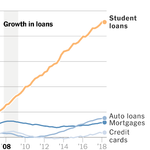

How a Lone Norwegian Trader Shook the World’s Financial System

Image

The town of Grimstad, Norway.CreditCreditThomas Ekstrom for The New York Times

# How a Lone Norwegian Trader Shook the World’s Financial SystemHow a Lone Norwegian Trader Shook the World’s Financial System

A futures bet gone spectacularly wrong provoked a daylong crisis at one of the clearinghouses that are supposed to be global safeguards.

The town of Grimstad, Norway.CreditCreditThomas Ekstrom for The New York Times
By [Jack Ewing](https://www.nytimes.com/by/jack-ewing) and Milan Schreuer

- May 3, 2019

-

    - 
    - 
    - [](https://www.nytimes.com/2019/05/03/business/central-counterparties-financial-meltdown.htmlmailto:?subject=NYTimes.com%3A%20How%20a%20Lone%20Norwegian%20Trader%20Shook%20the%20World%E2%80%99s%20Financial%20System&body=From%20The%20New%20York%20Times%3A%0A%0AHow%20a%20Lone%20Norwegian%20Trader%20Shook%20the%20World%E2%80%99s%20Financial%20System%0A%0AA%20futures%20bet%20gone%20spectacularly%20wrong%20provoked%20a%20daylong%20crisis%20at%20one%20of%20the%20clearinghouses%20that%20are%20supposed%20to%20be%20global%20safeguards.%0A%0Ahttps%3A%2F%2Fwww.nytimes.com%2F2019%2F05%2F03%2Fbusiness%2Fcentral-counterparties-financial-meltdown.html)

    -
    -
    -

On a breezy day in September, an ominous text message appeared on Fredrik Ekstrom’s phone: Go immediately to the war room.

Mr. Ekstrom is chairman of Nasdaq Clearing, an outpost of the American stock exchange company in Stockholm, which processes futures trading and acts, in part, as a shield against contagious losses in the global financial system. He headed toward an ordinary conference room outfitted with extra phones, video hookups, data terminals and policy manuals, designed to be a command center in case of a financial crisis. Until then, the war room had been used only for drills.

Other senior executives were waiting when he arrived. They described an unfolding disaster. A trader named Einar Aas was having a spectacularly bad day.

Mr. Ekstrom knew the name. Mr. Aas worked from his seaside home in a remote Norwegian fishing village, trading futures contracts tied to the price of Scandinavian electricity. Known for taking huge risks, Mr. Aas had once been one of Norway’s richest people.

Advertisement

But Mr. Aas’s bets on energy prices had gone sour, upended by a recent quirk of rainy weather and a shift in government energy policy. This day, he had exceeded his borrowing limits at Nasdaq Clearing and was unable to cover a shortfall of tens of millions of dollars, the executives said.

Mr. Aas’s losses threatened other traders. And his mess could blow through Nasdaq Clearing, which regulators, central bankers and world leaders had believed was equipped with safeguards — and enough deep capital — to ward off cross-border financial calamities.

It was Sept. 10, 2018, nearly 10 years to the day that the bankruptcy of the investment bank Lehman Brothers sparked a global financial panic.

The short, intense crisis Mr. Aas created was a precarious moment for the financial industry. It cast doubt on the safety of institutions like Nasdaq Clearing, which were supposed to prevent another meltdown, not create one. Within the small and dispersed community of regulators and central bankers whose job it is to maintain the infrastructure of global commerce, the incident provoked a debate about contagion that continues to rage.

Clearinghouses like Nasdaq Clearing have been around for centuries. But their importance to the global economy soared in the wake of Lehman’s collapse.CreditLinus Sundahl-Djerf for The New York Times

Image

Clearinghouses like Nasdaq Clearing have been around for centuries. But their importance to the global economy soared in the wake of Lehman’s collapse.CreditLinus Sundahl-Djerf for The New York Times

“I will always remember that day,” Mr. Ekstrom said, with deeply Scandinavian understatement. “Not as a positive memory.”

Advertisement

##   The bulwark that may not be

Though largely invisible to the public, clearinghouses like Nasdaq Clearing — known as central counterparties — have been around for centuries, acting as intermediaries in all sorts of financial transactions. But their importance to the global economy soared in the wake of Lehman’s collapse.

Before Lehman, most futures, options and other types of derivatives were traded among banks, in secret. After Lehman, central bankers and governments looked for a way to avoid being blindsided again.

At a summit in 2009 in Pittsburgh, the United States, the European Union, China, Japan and other Group of 20 powers agreed to compel banks to run most derivatives transactions through central counterparties, or CCPs. The clearinghouses — owned by companies like Nasdaq, Deutsche Börse and the London Stock Exchange — could track such transactions and share information with regulators.

The idea was that firms like Nasdaq Clearing would act as a bulwark against the greed, hubris or poor judgment of some traders in the grand casino that is derivatives trading.

Central counterparties sit in the middle of trades, handling the exchange of money and securities between buyers and sellers. They screen their members and require them to back up their transactions with cash or government bonds. They work to maintain the mutual trust essential to the functioning of global finance. And they provide layers of protection in case a member goes bankrupt and can’t pay its debts.

CCPs also put up capital to absorb losses. Their members — typically banks but sometimes investment funds or individual traders like Mr. Aas — contribute to a common emergency fund to be used as a last resort in a crisis.

Advertisement

As Mr. Ekstrom and his colleagues worked through the night to contain the crisis in Stockholm, Mr. Aas’s losses gorged on Nasdaq Clearing’s capital and nearly depleted the emergency default fund. Dawn brought a sobering realization about central counterparties.

The hilltop villa owned by Einar Aas, overlooking a bay. In recent years, residents said, he bought all the neighboring plots and houses to ensure his family’s privacy.CreditJohn Terje Pedersen

Image

The hilltop villa owned by Einar Aas, overlooking a bay. In recent years, residents said, he bought all the neighboring plots and houses to ensure his family’s privacy.CreditJohn Terje Pedersen

By staking so much trust on central counterparties, “authorities have stepped into the unknown,” said Peter Norman, who has written several books on the subject. “These are disasters waiting to happen.”

“They should be managed so they don’t fail,” said Darrell Duffie, a professor at the Stanford University Graduate School of Business who has written about central counterparties. “Like a nuclear power reactor. You don’t design them to survive in all but the most extreme circumstances. You just design them to survive.”

Alarmed by the events at Nasdaq Clearing, some financial heavyweights recently sounded a 12-page warning. The group included Paul Tucker, a former deputy governor of the Bank of England; Paul A. Volcker, a former chairman of the Federal Reserve; and Sheila C. Bair, a former chairwoman of the Federal Deposit Insurance Corporation.

Central counterparties, they warned, “[occupy a position in the financial system that leaves them too important to fail.”](https://www.systemicriskcouncil.org/2019/03/systemic-risk-council-urges-action-on-resolution-of-central-counterparty-clearing-houses/) The lack of a clear plan to cope with a meltdown, the group said, is “one of the biggest gaps in the post-crisis regime for financial stability.”

##   $1,000,000,000,000,000 (that’s 1 quadrillion)

There are more than 80 central counterparties around the world, but most of the volume is concentrated at a few, like the Intercontinental Exchange or CME Clearing in the United States or Eurex Clearing in Frankfurt. Attempts to prepare for possible systemic shocks have faltered because of political rivalries between the United States and Europe, and competition between London and Frankfurt for lucrative clearing business.

Advertisement

The largest is London Clearing House, or LCH. Last year, it processed contracts that covered the risk of a quadrillion dollars’ worth of derivatives trading — that’s a thousand trillion dollars. By comparison, the total annual economic output of everyone on the planet is worth about $80 trillion.

The volume of transactions flowing through LCH has increased fivefold since 2008. The risks of relying so heavily on clearinghouses are hard to quantify, though, and there are many believers in the new regimen of oversight.

“Compared to a world that was unsecured and uncollateralized, you have made the financial system much more stable,” said Erik Tim Müller, chief executive of Eurex Clearing, a unit of Deutsche Börse, the company that operates the Frankfurt stock exchange.

There are more than 80 central counterparties around the world, but most of the volume is concentrated at a few — like Eurex Clearing in Frankfurt.CreditFelix Schmitt for The New York Times

Image

There are more than 80 central counterparties around the world, but most of the volume is concentrated at a few — like Eurex Clearing in Frankfurt.CreditFelix Schmitt for The New York Times

At Eurex, the system calculates the value of member banks’ obligations in real time as well as the fluctuating market value of the assets they have posted as collateral. If a bank’s collateral falls short, its name flashes red on a big screen in a command center at Eurex headquarters in a Frankfurt suburb. The bank has half an hour to make up the shortfall. Usually banks do. If not, Eurex can draw funds directly from the member’s account at Germany’s central bank.

In Stockholm, Mr. Aas’s losses spiraled before Nasdaq Clearing intervened, shaking confidence in the way that some CCPs monitor their members. It also forced the financial industry to confront a mind-boggling question: What if one of these things blew up?

The events at Nasdaq Clearing have “certainly focused the minds of policymakers on this issue,” Benoît Cœuré, a member of the executive board of the European Central Bank, said during a [conference on central counterparties](https://www.ecb.europa.eu/press/key/date/2019/html/ecb.sp190227~cf2acdb23d.en.html) in February. The failure of a central counterparty, he said in a separate speech last year, [“would be disastrous.”](https://www.ecb.europa.eu/press/key/date/2018/html/ecb.sp180423.en.html)

Advertisement

A central counterparty that went bad would no longer be able to fulfill its main duty: making sure everyone is paid for every trade. A bank dealing with one bankrupt clearinghouse could default on its obligations at other ones, which in turn could falter. Central bankers and regulators would be hard pressed to prevent the damage from spreading like a pandemic.

In fact, it has happened. In 1987, after a stock market crash, [Hong Kong’s futures exchange clearinghouse failed](https://www.bis.org/publ/qtrpdf/r_qt1812z.htm), setting off a chain reaction that forced the Hong Kong Stock Exchange to shut down and brought the local financial system to a halt. The government stepped in with a bailout.

Central counterparties are much bigger and more important to the system now. But regulation has not kept pace, experts say. Regulators have no plan, for example, to cope with the failure of a European central counterparty. In the United States, it is unclear which regulator would deal with a failure.

##   A shy man with an appetite for risk

Mr. Aas is an outwardly reserved person. “He is a very shy person, low key, not flashy,” said Lars Eckhardt, who hired Mr. Aas out of business school in 1995 as a risk manager at Interkraft, an energy trading firm. “He was also willing to take more risk than most people.”

Though he earned a handsome salary, Mr. Aas was often broke, Mr. Eckhardt said, because he spent weekends betting on racehorses. Contacted by phone and email, Mr. Aas, 48, declined to comment.

Lars Eckhardt hired Mr. Aas out of business school in 1995. “He is very shy person, low key, not flashy,” Mr. Eckhardt said. “He was also willing to take more risk than most people.”CreditThomas Ekstrom for The New York Times

Image

Lars Eckhardt hired Mr. Aas out of business school in 1995. “He is very shy person, low key, not flashy,” Mr. Eckhardt said. “He was also willing to take more risk than most people.”CreditThomas Ekstrom for The New York Times

At Interkraft, Mr. Aas learned about the arcane world of energy futures, contracts that give the owner the right to buy electricity at a specified time for a certain price. Companies use them to protect against fluctuations in energy prices. But the contracts also give speculators a way to bet on how prices will move.

Advertisement

At Interkraft, Mr. Aas moved from risk management to trading and was soon earning tens of millions of dollars in bonuses. After stints at other firms, he decided to strike out on his own.

He set up shop in his hometown, Grimstad, in a hilltop villa overlooking a bay. In recent years, residents said, he bought all the neighboring plots and houses to ensure his family’s privacy. By 2016, Mr. Aas had become the largest taxpayer in Norway, where tax returns are public information. He reported income of 833 million Norwegian kroner that year, or $97 million.

Grimstad, with a population of about 20,000, collected a tax windfall, using the money to improve schools and the library, and to cut the cost of public kindergarten, said Monica Helland, Grimstad’s highest-ranking civil servant.

Mr. Aas became so wealthy that in 2007, Nasdaq Clearing allowed him to become a member, a privilege normally reserved for banks and investment funds. That status permitted him to clear his trades without going through a bank, and was highly unusual.

By late summer 2018, Mr. Aas had made huge bets on the difference in price, or the spread, between futures on the Nordic power market and futures on the German power market. Mr. Aas was “a big whale in the market,” said Peter C. Warren, a British derivatives expert and financial commentator based in Norway. “It was him on one side with this huge position, and the rest of the market on the other side.”

Usually, the spread between German and Nordic futures remained within a narrow band. But in August, a confluence of events pushed the gap far wider than Mr. Aas had wagered.

The cost of carbon emissions permits, which power companies must buy in order to burn coal, spiked after European governments reduced the supply. That pushed up the price of German power. In Scandinavia, [an unusually dry summer](https://www.nytimes.com/2018/08/04/world/europe/europe-heat-wave.html?module=inline) suddenly turned rainy, and the cost of hydropower plunged. The price of Nordic energy futures fell as the price of German futures rose.

Advertisement

“I say, ‘Easy come, easy go,’” said Tor Atle, a fisherman who knew Mr. Aas as a neighbor who would walk with his two young sons around town. “He earned a lot, paid a lot of taxes. Now he lost. So be it.”CreditThomas Ekström for The New York Times

Image

“I say, ‘Easy come, easy go,’” said Tor Atle, a fisherman who knew Mr. Aas as a neighbor who would walk with his two young sons around town. “He earned a lot, paid a lot of taxes. Now he lost. So be it.”CreditThomas Ekström for The New York Times

Mr. Aas had no way out. “Nobody wanted to buy,” said Hermund Ulstein, chairman of the Nordic Association of Electricity Traders. “There were just not enough traders who could take on such positions.”

Emerging from the Nasdaq Clearing war room on the morning of Sept. 11, Mr. Ekstrom, the chairman, issued a declaration that Mr. Aas was officially in default. It was the first time a Nasdaq Clearing member had ever defaulted. Other clearinghouse members had to pitch in 107 million euros, or $121 million, to replenish the default fund.

Central counterparties spun the incident as proof that the system worked. After all, Nasdaq Clearing was afloat.

“We could contain the risk within the local market,” Mr. Ekstrom said. “It did not spread to other parts of the financial system, and it did not create any financial instability.”

Still, Nasdaq Clearing has made changes. It no longer allows individuals to be members. It also tightened margin requirements and increased the capital that members must commit to absorb losses.

Some investors viewed the Aas debacle as a sign that regulation is inadequate and that some CCPs are too secretive about risk. “You can’t have that big a position for one market player. That’s insane,” said Arne Osterlind, a portfolio manager at Shepherd Energy, an investment fund in Stockholm.

Advertisement

Aside from the Nasdaq Clearing members, the people who felt the crisis most acutely were the residents of Grimstad, where services have been cut after Mr. Aas’s fortunes — and tax payments — fell.

“I say, ‘Easy come, easy go,’” said Tor Atle, a fisherman who, like many people, knew Mr. Aas as a neighbor who would walk with his two young sons around town. “He earned a lot, paid a lot of taxes. Now he lost. So be it.”

But Mr. Atle added: “This is one man sitting in his home with his PC. If one man can do such a thing, there is something wrong with the system.”

*Follow Jack Ewing and Milan Schreuer on Twitter: [@JackEwingNYT](https://twitter.com/JackEwingNYT) and [@MilanSchreuer](https://twitter.com/MilanSchreuer).*

A version of this article appears in print on May 5, 2019, on Page BU1 of the New York edition with the headline: A Lone Trader Shook the World’s Financial System. [Order Reprints](http://www.nytreprints.com/) | [Today’s Paper](http://www.nytimes.com/pages/todayspaper/index.html) | [Subscribe](https://www.nytimes.com/subscriptions/Multiproduct/lp8HYKU.html?campaignId=48JQY)

- 
- 
- [](https://www.nytimes.com/2019/05/03/business/central-counterparties-financial-meltdown.htmlmailto:?subject=NYTimes.com%3A%20How%20a%20Lone%20Norwegian%20Trader%20Shook%20the%20World%E2%80%99s%20Financial%20System&body=From%20The%20New%20York%20Times%3A%0A%0AHow%20a%20Lone%20Norwegian%20Trader%20Shook%20the%20World%E2%80%99s%20Financial%20System%0A%0AA%20futures%20bet%20gone%20spectacularly%20wrong%20provoked%20a%20daylong%20crisis%20at%20one%20of%20the%20clearinghouses%20that%20are%20supposed%20to%20be%20global%20safeguards.%0A%0Ahttps%3A%2F%2Fwww.nytimes.com%2F2019%2F05%2F03%2Fbusiness%2Fcentral-counterparties-financial-meltdown.html)

-

### Related Coverage

[   ## The Recovery Threw the Middle-Class Dream Under a Benz  Sept. 12, 2018     Image  ](https://www.nytimes.com/2018/09/12/business/middle-class-financial-crisis.html?action=click&module=RelatedCoverage&pgtype=Article&region=Footer)[   ## The World of Today Brought to You by the Financial Crisis  Sept. 14, 2018     Image  ](https://www.nytimes.com/interactive/2018/09/14/business/2008-financial-crisis.html?action=click&module=RelatedCoverage&pgtype=Article&region=Footer)[   ## The Next Financial Calamity Is Coming. Here’s What to Watch.  Sept. 12, 2018     Image  ](https://www.nytimes.com/interactive/2018/09/12/business/the-next-recession-financial-crisis.html?action=click&module=RelatedCoverage&pgtype=Article&region=Footer)

## [More in Business](https://www.nytimes.com/section/business)

[   Elaine Thompson/Associated Press](https://www.nytimes.com/2019/05/20/technology/amazon-facial-recognition.html?action=click&module=MoreInSection&pgtype=Article&region=Footer&contentCollection=Business)

[## Amazon Faces Investor Pressure Over Facial Recognition](https://www.nytimes.com/2019/05/20/technology/amazon-facial-recognition.html?action=click&module=MoreInSection&pgtype=Article&region=Footer&contentCollection=Business)5h ago

[   Brooks Kraft/Corbis, via Getty Images](https://www.nytimes.com/2019/05/19/business/media/social-media-presidential-campaign-2020.html?action=click&module=MoreInSection&pgtype=Article&region=Footer&contentCollection=Business)

[## Kissing Babies, Loving Scrapple, Fighting Viral Hoaxes: ’20 Race’s New Routine](https://www.nytimes.com/2019/05/19/business/media/social-media-presidential-campaign-2020.html?action=click&module=MoreInSection&pgtype=Article&region=Footer&contentCollection=Business)May 20

 [   PAID POST: Slovenian Tourism Board](https://adclick.g.doubleclick.net/pcs/click?xai=AKAOjssbv1ELzg9HpynHusqIeCKzqis6WXHPTgHa8eqB-ReSBi5oFOeOYhrQmwTFoyphv3kpCJXnd5n9AMB_LKsX2cIJv6YAM-2G9I65ja75n1VbqagZo5Ysu_7IWp91rlIR8pdSGyHTBviLIfYT2hDXcUO_OY4WBj9AyobQXLCiIEY_IPArK44WSx4JwZ-x9n3jW-XpWNMYztnHi8U6gA1Q7sNnJs55Zq_mHUkkuqT1xfeD4FJHQXgs71uGiY55ZcKGkGFn&sig=Cg0ArKJSzHTsTurH6mCrEAE&urlfix=1&adurl=https://www.nytimes.com/paidpost/slovenian-tourism-board/a-trip-through-the-wonders-of-slovenia.html%3Fcpv_ap_id%3D50006611%26sr_source%3Dlift_morein%26tbs_nyt%3D2019-april-nytnative_morein)  [Discover the Romantic and Picturesque Towns of Slovenia’s Mediterranean](https://adclick.g.doubleclick.net/pcs/click?xai=AKAOjssbv1ELzg9HpynHusqIeCKzqis6WXHPTgHa8eqB-ReSBi5oFOeOYhrQmwTFoyphv3kpCJXnd5n9AMB_LKsX2cIJv6YAM-2G9I65ja75n1VbqagZo5Ysu_7IWp91rlIR8pdSGyHTBviLIfYT2hDXcUO_OY4WBj9AyobQXLCiIEY_IPArK44WSx4JwZ-x9n3jW-XpWNMYztnHi8U6gA1Q7sNnJs55Zq_mHUkkuqT1xfeD4FJHQXgs71uGiY55ZcKGkGFn&sig=Cg0ArKJSzHTsTurH6mCrEAE&urlfix=1&adurl=https://www.nytimes.com/paidpost/slovenian-tourism-board/a-trip-through-the-wonders-of-slovenia.html%3Fcpv_ap_id%3D50006611%26sr_source%3Dlift_morein%26tbs_nyt%3D2019-april-nytnative_morein)

[](https://adclick.g.doubleclick.net/pcs/click?xai=AKAOjssbv1ELzg9HpynHusqIeCKzqis6WXHPTgHa8eqB-ReSBi5oFOeOYhrQmwTFoyphv3kpCJXnd5n9AMB_LKsX2cIJv6YAM-2G9I65ja75n1VbqagZo5Ysu_7IWp91rlIR8pdSGyHTBviLIfYT2hDXcUO_OY4WBj9AyobQXLCiIEY_IPArK44WSx4JwZ-x9n3jW-XpWNMYztnHi8U6gA1Q7sNnJs55Zq_mHUkkuqT1xfeD4FJHQXgs71uGiY55ZcKGkGFn&sig=Cg0ArKJSzHTsTurH6mCrEAE&urlfix=1&adurl=https://www.nytimes.com/paidpost/slovenian-tourism-board/a-trip-through-the-wonders-of-slovenia.html%3Fcpv_ap_id%3D50006611%26sr_source%3Dlift_morein%26tbs_nyt%3D2019-april-nytnative_morein)

[   T.J. Kirkpatrick for The New York Times](https://www.nytimes.com/2019/05/20/business/dealbook/sprint-tmobile-merger.html?action=click&module=MoreInSection&pgtype=Article&region=Footer&contentCollection=Business)

[## F.C.C. Chairman Recommends Approval of $26 Billion T-Mobile-Sprint Merger](https://www.nytimes.com/2019/05/20/business/dealbook/sprint-tmobile-merger.html?action=click&module=MoreInSection&pgtype=Article&region=Footer&contentCollection=Business)41m ago

[   The Life Picture Collection/Getty Images](https://www.nytimes.com/2019/05/20/business/media/whitney-houston-hologram-album.html?action=click&module=MoreInSection&pgtype=Article&region=Footer&contentCollection=Business)

[## Whitney Houston’s Estate Plans a Hologram Tour and a New Album](https://www.nytimes.com/2019/05/20/business/media/whitney-houston-hologram-album.html?action=click&module=MoreInSection&pgtype=Article&region=Footer&contentCollection=Business)5h ago

[   Travis Dove for The New York Times](https://www.nytimes.com/2019/05/19/business/tech-jobs-middle-class.html?action=click&module=MoreInSection&pgtype=Article&region=Footer&contentCollection=Business)

[## Tech Jobs Lead to the Middle Class. Just Not for the Masses.](https://www.nytimes.com/2019/05/19/business/tech-jobs-middle-class.html?action=click&module=MoreInSection&pgtype=Article&region=Footer&contentCollection=Business)May 19

## Editors’ Picks

[   Paul Miller](https://www.nytimes.com/2019/05/11/books/review/megan-stack-womens-work.html?fallback=0&recId=1LV8g7eej0RpqrmTgaXoibW2MCI&locked=0&geoContinent=EU&geoRegion=LND&recAlloc=story&geoCountry=GB&blockId=home-featured&imp_id=806269248&action=click&module=editorsPicks&pgtype=Article&region=Footer)

[## A New Mom, Her Nannies and the Often Exploitive Labor of Motherhood](https://www.nytimes.com/2019/05/11/books/review/megan-stack-womens-work.html?fallback=0&recId=1LV8g7eej0RpqrmTgaXoibW2MCI&locked=0&geoContinent=EU&geoRegion=LND&recAlloc=story&geoCountry=GB&blockId=home-featured&imp_id=806269248&action=click&module=editorsPicks&pgtype=Article&region=Footer)May 11

[   Nathan Bajar for The New York Times](https://www.nytimes.com/2019/05/15/style/luxury-retirement-communities.html?fallback=0&recId=1LV8g7eej0RpqrmTgaXoibW2MCI&locked=0&geoContinent=EU&geoRegion=LND&recAlloc=story&geoCountry=GB&blockId=home-featured&imp_id=589325622&action=click&module=editorsPicks&pgtype=Article&region=Footer)

[## Vanity Is Not a Deadly Sin. It’s One of Life’s Last Vital Signs.](https://www.nytimes.com/2019/05/15/style/luxury-retirement-communities.html?fallback=0&recId=1LV8g7eej0RpqrmTgaXoibW2MCI&locked=0&geoContinent=EU&geoRegion=LND&recAlloc=story&geoCountry=GB&blockId=home-featured&imp_id=589325622&action=click&module=editorsPicks&pgtype=Article&region=Footer)May 15

[   David Williams for The New York Times](https://www.nytimes.com/2019/05/19/arts/robert-mnuchin-steven-cohen-koons.html?fallback=0&recId=1LV8g7eej0RpqrmTgaXoibW2MCI&locked=0&geoContinent=EU&geoRegion=LND&recAlloc=story&geoCountry=GB&blockId=home-featured&imp_id=557736258&action=click&module=editorsPicks&pgtype=Article&region=Footer)

[## Robert Mnuchin Would Rather Not Discuss His Client (or His Son)](https://www.nytimes.com/2019/05/19/arts/robert-mnuchin-steven-cohen-koons.html?fallback=0&recId=1LV8g7eej0RpqrmTgaXoibW2MCI&locked=0&geoContinent=EU&geoRegion=LND&recAlloc=story&geoCountry=GB&blockId=home-featured&imp_id=557736258&action=click&module=editorsPicks&pgtype=Article&region=Footer)May 19

Most Popular

- [Why Working Till Whenever Is a Risky Retirement Strategy](https://www.nytimes.com/2019/05/16/business/retirement-layoff-working-longer.html?fallback=0&recId=1LV8gCpaCBRyU2N1fziAYnGePhh&locked=0&geoContinent=EU&geoRegion=LND&recAlloc=top_conversion&geoCountry=GB&blockId=most-popular&imp_id=430147112&action=click&module=trending&pgtype=Article&region=Footer)
- [Robert Mnuchin Would Rather Not Discuss His Client (or His Son)](https://www.nytimes.com/2019/05/19/arts/robert-mnuchin-steven-cohen-koons.html?fallback=0&recId=1LV8gCpaCBRyU2N1fziAYnGePhh&locked=0&geoContinent=EU&geoRegion=LND&recAlloc=top_conversion&geoCountry=GB&blockId=most-popular&imp_id=786052942&action=click&module=trending&pgtype=Article&region=Footer)
- [‘Game of Thrones’ Series Finale Recap: All Hail King Who?](https://www.nytimes.com/2019/05/19/arts/television/game-of-thrones-series-finale-recap.html?fallback=0&recId=1LV8gCpaCBRyU2N1fziAYnGePhh&locked=0&geoContinent=EU&geoRegion=LND&recAlloc=top_conversion&geoCountry=GB&blockId=most-popular&imp_id=189232181&action=click&module=trending&pgtype=Article&region=Footer)
- [Deutsche Bank Staff Saw Suspicious Activity in Trump and Kushner Accounts](https://www.nytimes.com/2019/05/19/business/deutsche-bank-trump-kushner.html?fallback=0&recId=1LV8gCpaCBRyU2N1fziAYnGePhh&locked=0&geoContinent=EU&geoRegion=LND&recAlloc=top_conversion&geoCountry=GB&blockId=most-popular&imp_id=413176007&action=click&module=trending&pgtype=Article&region=Footer)
- [‘Game of Thrones’: 8 Questions the Series Finale Must Answer](https://www.nytimes.com/2019/05/19/arts/television/game-of-thrones-series-finale-preview.html?fallback=0&recId=1LV8gCpaCBRyU2N1fziAYnGePhh&locked=0&geoContinent=EU&geoRegion=LND&recAlloc=top_conversion&geoCountry=GB&blockId=most-popular&imp_id=152707516&action=click&module=trending&pgtype=Article&region=Footer)
- [Venezuela’s Collapse Is the Worst Outside of War in Decades, Economists Say](https://www.nytimes.com/2019/05/17/world/americas/venezuela-economy.html?fallback=0&recId=1LV8gCpaCBRyU2N1fziAYnGePhh&locked=0&geoContinent=EU&geoRegion=LND&recAlloc=top_conversion&geoCountry=GB&blockId=most-popular&imp_id=651935685&action=click&module=trending&pgtype=Article&region=Footer)
- [A Rare Genetic Mutation Leads to Cancer. The Fix May Already Be in the Drugstore.](https://www.nytimes.com/2019/05/17/health/gene-mutation-cancer.html?fallback=0&recId=1LV8gCpaCBRyU2N1fziAYnGePhh&locked=0&geoContinent=EU&geoRegion=LND&recAlloc=top_conversion&geoCountry=GB&blockId=most-popular&imp_id=446312898&action=click&module=trending&pgtype=Article&region=Footer)
- [‘They Were Conned’: How Reckless Loans Devastated a Generation of Taxi Drivers](https://www.nytimes.com/2019/05/19/nyregion/nyc-taxis-medallions-suicides.html?fallback=0&recId=1LV8gCpaCBRyU2N1fziAYnGePhh&locked=0&geoContinent=EU&geoRegion=LND&recAlloc=top_conversion&geoCountry=GB&blockId=most-popular&imp_id=579288751&action=click&module=trending&pgtype=Article&region=Footer)
- [Opinion: Will Trump Be the Sage One?](https://www.nytimes.com/2019/05/18/opinion/sunday/trump-bolton-war.html?fallback=0&recId=1LV8gCpaCBRyU2N1fziAYnGePhh&locked=0&geoContinent=EU&geoRegion=LND&recAlloc=top_conversion&geoCountry=GB&blockId=most-popular&imp_id=323850239&action=click&module=trending&pgtype=Article&region=Footer)
- [She Said Yes. Fourteen Times.](https://www.nytimes.com/2019/05/17/fashion/weddings/she-said-yes-fourteen-times.html?fallback=0&recId=1LV8gCpaCBRyU2N1fziAYnGePhh&locked=0&geoContinent=EU&geoRegion=LND&recAlloc=top_conversion&geoCountry=GB&blockId=most-popular&imp_id=776259303&action=click&module=trending&pgtype=Article&region=Footer)

Advertisement