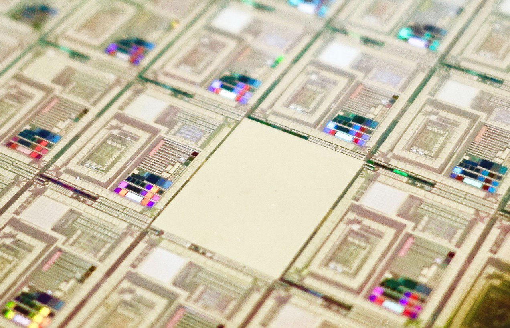

How a quantum computer could break 2048-bit RSA encryption in 8 hours

Steve Jurvetson | Flickr

### [Computing](https://www.technologyreview.com/computing/)

# How a quantum computer could break 2048-bit RSA encryption in 8 hours

## A new study shows that quantum technology will catch up with today’s encryption standards much sooner than expected. That should worry anybody who needs to store data securely for 25 years or so.

by [Emerging Technology from the arXiv](https://www.technologyreview.com/profile/emerging-technology-from-the-arxiv/)

May 30, 2019

Many people worry that quantum computers will be able to crack certain codes used to send secure messages. The codes in question encrypt data using “trapdoor” mathematical functions that work easily in one direction but not in the other. That makes encrypting data easy but decoding it hugely difficult without the help of a special key.

These encryption systems have never been unbreakable. Instead, their security is based on the huge amount of time it would take for a classical computer to do the job. Modern encryption methods are specifically designed so that decoding them would take so long they are practically unbreakable.

#### Sign up for **The Download** — your daily dose of what's up in emerging technology

Also stay updated on MIT Technology Review initiatives and events?
YesNo

But quantum computers change this thinking. These machines are far more powerful than classical computers and should be able to break these codes with ease.

That raises an important question—when will quantum computers be powerful enough to do this? After that date, any information protected by this form of encryption becomes insecure.

So computer scientists have attempted to calculate the resources such a quantum computer might need and then work out how long it will be until such a machine can be built. And the answer has always been decades.

Today, that thinking needs to be revised thanks to the work of Craig Gidney at [Google in Santa Barbara](https://www.technologyreview.com/s/609035/google-reveals-blueprint-for-quantum-supremacy/) and Martin Ekerå at the KTH Royal Institute of Technology in Stockholm, Sweden. These guys have found a more efficient way for quantum computers to perform the code-breaking calculations, reducing the resources they require by orders of magnitude.

Consequently, these machines are significantly closer to reality than anyone suspected. The result will make uncomfortable reading for governments, military and security organizations, banks, and anyone else who needs to secure data for 25 years or longer.

First some background. Back in 1994, the American mathematician Peter Shor discovered a quantum algorithm that outperformed its classical equivalent. Shor’s algorithm factors large numbers and is the crucial element in the process for cracking trapdoor-based codes.

Trapdoor functions are based on the process of multiplication, which is easy to perform in one direction but much harder to do in reverse. For example, it is trivial to multiply two numbers together: 593 times 829 is 491,597. But it is hard to start with the number 491,597 and work out which two prime numbers must be multiplied to produce it.

And it becomes increasingly difficult as the numbers get larger. Indeed, computer scientists consider it practically impossible for a classical computer to factor numbers that are longer than 2048 bits, which is the basis of the most commonly used form of RSA encryption.

Shor showed that a sufficiently powerful quantum computer could do this with ease, a result that sent shock waves through the security industry.

And since then, quantum computers have been increasing in power. In 2012, physicists used a four-qubit quantum computer to factor 143. Then in 2014 they used a similar device to factor 56,153.

It’s easy to imagine that at this rate of progress, quantum computers should soon be able to outperform the best classical ones.

Not so. It turns out that quantum factoring is much harder in practice than might otherwise be expected. The reason is that noise becomes a significant problem for large quantum computers. And the best way currently to tackle noise is to use error-correcting codes that require significant extra qubits themselves.

Taking this into account dramatically increases the resources required to factor 2048-bit numbers. In 2015, researchers estimated that a quantum computer would need a billion qubits to do the job reliably. That’s significantly more than [the 70 qubits in today’s state-of-the-art quantum computers](https://www.technologyreview.com/s/613507/the-new-benchmark-quantum-computers-must-beat-to-achieve-quantum-supremacy/).

On that basis, security experts might well have been able to justify the idea that it would be decades before messages with 2048-bit RSA encryption could be broken by a quantum computer.

Now Gidney and Ekerå have shown how a quantum computer could do the calculation with just 20 million qubits. Indeed, they show that such a device would take just eight hours to complete the calculation.  “[As a result], the worst case estimate of how many qubits will be needed to factor 2048 bit RSA integers has dropped nearly two orders of magnitude,” they say.

Their method focuses on a more efficient way to perform a mathematical process called modular exponentiation. This is the process of finding the remainder when a number is raised to a certain power and then divided by another number.

This process is the most computationally expensive operation in Shor’s algorithm. But Gidney and Ekerå have found various ways to optimize it, significantly reducing the resources needed to run the algorithm.

That’s interesting work that should have important implications for anyone storing information for the future. A 20-million-qubit quantum computer certainly seems a distant dream today. But the question these experts should be asking themselves is whether such a device could be possible within the 25 years they want to secure the information. If they think it is, then they need a new form of encryption.

Indeed,[security experts have developed post-quantum codes that even a quantum computer will not be able to crack](https://www.technologyreview.com/s/420287/1978-cryptosystem-resists-quantum-attack/). So it is already possible to safeguard data today against future attack by quantum computers. But these codes are not yet used as standard.

For ordinary people, there is little risk. Most people use 2048-bit encryption, or something similar, for tasks like sending credit card details over the internet. If these transactions are recorded today and broken in 25 years, little will be lost.

But for governments, there is more at stake. The messages they send today—between embassies or the military, for example—may well be significant in 20 years and so worth keeping secret. If such messages are still being sent via 2048-bit RSA encryption, or something similar, then these organizations should start worrying—quickly.

Ref: [arxiv.org/abs/1905.09749](https://arxiv.org/abs/1905.09749) : How To Factor 2048 Bit RSA Integers In 8 Hours Using 20 Million Noisy Qubits' class='jsx-671803276 js-evernote-checked' data-evernote-id='592'%3e%3c/path%3e%3c/svg%3e)