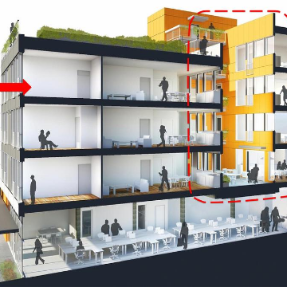

How cohousing can make us happier (and live longer)

How cohousing can make us happier (and live longer)

https://www.ted.com/talks/grace_kim_how_cohousing_can_make_us_happier_and_live_longer

Loneliness doesn't always stem from being alone. For architect Grace Kim, loneliness is a function of how socially connected we feel to the people around us -- and it's often the result of the homes we live in. She shares an age-old antidote to isolation: cohousing, a way of living where people choose to share space with their neighbors, get to know them, and look after them. Rethink your home and how you live in it with this eye-opening talk.