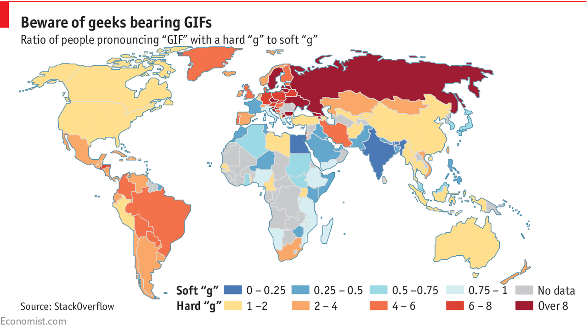
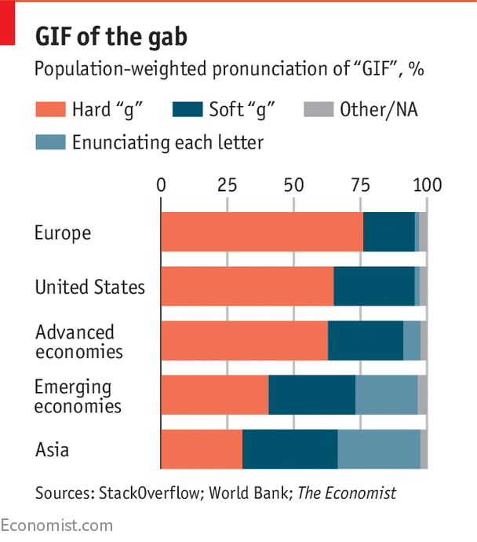
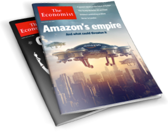

How do you pronounce “GIF”?

# Daily chartHow do you pronounce “GIF”?

It depends on where you live

### [Graphic detail](http://www.economist.com/blogs/graphicdetail)

Jun 29th 2017

| by THE DATA TEAM

[(L)](https://twitter.com/intent/tweet?url=)
[(L)](http://www.facebook.com/sharer/sharer.php?u=)
[(L)](https://www.linkedin.com/cws/share?url=)

[(L)](http://www.economist.com/blogs/graphicdetail/2017/06/daily-chart-21?utm_source=nextdraft&utm_medium=emailmailto:?body=)

[(L)](#)
[(L)](http://www.economist.com/node/21724487/comments)

SOME questions will be pondered for all eternity. What is the meaning of life? Where do you go when you die? And even more puzzlingly, what is the right way to pronounce “GIF”? The Graphics Interchange Format, a file type commonly associated with web animations, is older than the world wide web itself. Debates over whether it begins with a hard “g”, as in “gift”, or a soft one, as in “giraffe”, can make discussions about religion or politics look civil by comparison. Well aware of the risk that taking a side could lead to protests, boycotts or worse, the Oxford English Dictionary and Merriam-Webster have maintained strict neutrality. They proclaim that both pronunciations are acceptable, betraying nary a hint of favouritism.

With the lexicographical authorities resigned to a “descriptivist” approach, following words and pronunciations wherever the unwashed masses go, those determined to resolve the question once and for all are taking matters into their own hands. In a recent survey StackOverflow, a forum for computer programmers, asked over 50,000 users in nearly 200 countries a battery of questions. The study began with softball inquiries, such as what respondents had studied and how long they had been coding. Only once they felt at ease and were likely to share their true sentiments, rather than providing whatever they believed was the “politically correct” answer, did the poll segue to its highly sensitive aim: the pronunciation of GIF.

## Latest updates

- [ ### Why Washington, DC’s programme for homeless families isn't working](http://www.economist.com/blogs/democracyinamerica/2017/06/down-and-out-district)

[Democracy in America](http://www.economist.com/blogs/democracyinamerica)

- [ ### How do you pronounce “GIF”?](http://www.economist.com/blogs/graphicdetail/2017/06/daily-chart-21)

[Graphic detail](http://www.economist.com/blogs/graphicdetail)

- [ ### The involuntary bumping of flyers is likely to be outlawed](http://www.economist.com/blogs/gulliver/2017/06/united-against-united)

[Gulliver](http://www.economist.com/blogs/gulliver)
[See all updates](http://www.economist.com/latest-updates)

On the surface, the results looked like a slam-dunk victory for hard-line partisans of the hard “g”. Fully 65% of respondents opted for the hard “g”, compared with just 26% who backed the soft option. However, incensed soft-“g” supporters can muster formidable counter-arguments that the StackOverflow study was rigged.

First, many languages lack one sound or the other, and the split is far from even: the hard “g” is found in far more languages than the soft one is. (Spanish and Finnish lack the soft “g” in native words, for example, and most dialects of Arabic lack the hard one.) If there are more people who lack exposure to the soft “g” than the hard one, a global survey will reflect that bias. Moreover, StackOverflow’s sample was far from representative. People in countries where the hard “g” is the leading choice make up just 45% of the world’s population, but accounted for 79% of respondents to the poll.

Correcting for the latter disparity by weighting answers from each country by its population yields a far closer race. Nonetheless, the hard “g” still comes out on top, leading the soft one by 44% to 32%. Perhaps the most surprising result is that a third contender is nipping at the heels of the soft “g”. Enunciating each individual letter (“gee eye eff”), though more time-consuming than combining them into a single syllable, is common in Asia, and accounted for 21% of the population-weighted sample. Around half of respondents from China and 70% from South Korea plumped for this option.

Just because a belief is popular does not make it right, as heretics from Galileo on down can attest. If anyone should have an authoritative take on the matter, it is Steve Wilhite, who invented the GIF in 1987 while working for CompuServe, one of the first major internet-service providers. He has consistently sided with the soft-“g” brigade, most recently in an interview in 2013 with the *New York Times*. Moreover, the documentation for CompuShow, a graphics program made by CompuServe that utilised the novel image-file format, states clearly that GIF is pronounced “JIF”, like the American peanut-butter brand.

So far, though, it seems that Mr Wilhite’s entreaties are falling on deaf ears. Only time will tell if his fervent faith in the soft “g” is vindicated, or consigned to the dustbin of history.

* * *

*How do you pronounce it? Join the debate with our [Twitter Poll](https://twitter.com/TheEconomist/status/880449022032531462)*

 You’ve seen the news, now discover the story

 Get incisive analysis on the issues that matter. Whether you read each issue cover to cover, listen to the audio edition, or scan the headlines on your phone, time with *The Economist* is always well spent.

 [Enjoy 12 weeks’ access for £12](https://subscription.economist.com/DE/EngCore/Ecom/EndOfArticle)

 
[(L)](https://twitter.com/intent/tweet?url=)
[(L)](http://www.facebook.com/sharer/sharer.php?u=)
[(L)](https://www.linkedin.com/cws/share?url=)

[(L)](http://www.economist.com/blogs/graphicdetail/2017/06/daily-chart-21?utm_source=nextdraft&utm_medium=emailmailto:?body=)

[(L)](#)
[ View comments](http://www.economist.com/node/21724487/comments)

[Reuse this content](https://s100.copyright.com/AppDispatchServlet?publisherName=economist&publication=economist&title=How%20do%20you%20pronounce%20%E2%80%9CGIF%E2%80%9D%3F&publicationDate=NaN0NaN0NaN&contentID=21724487&type=BL&orderBeanReset=0)