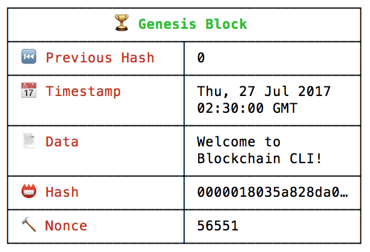
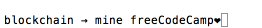

How does blockchain really work? I built an app to show you.

# How does blockchain really work? I built an app to show you.

According to Wikipedia, a blockchain is:

> A distributed database that is used to maintain a continuously growing list of records, called *> blocks*> .

That sounds nice, but how does it work?

To illustrate a blockchain, we will use an open source command-line interface called [Blockchain CLI](https://github.com/seanseany/blockchain-cli).

I also built a [browser-based version of this here](http://blockchaindemo.io/).

### Installing the Command-Line Interface version

If you haven’t already, install [Node.js](https://nodejs.org/download/).
Then run the following in your terminal:
npm install blockchain-cli -g
blockchain

You should see `👋 Welcome to Blockchain CLI!`and a `blockchain →` prompt ready to take commands.

### What does a block look like?

To see your current blockchain, enter `blockchain` or `bc` into the command prompt. You should see a block like the image below.

A block on the blockchain

- •**Index (Block #):** Which block is it? (Genesis block has index 0)
- •**Hash:** Is the block valid?
- •**Previous Hash: **Is the previous block valid?
- •**Timestamp: **When was the block added?
- •**Data: **What information is stored on the block?
- •**Nonce: **How many iterations did we go through before we found a valid block?

#### Genesis Block

Every blockchain will start with the`🏆 Genesis Block`. As you will see later, each block on the blockchain is dependent on the previous block. So, the Genesis block is needed to mine our first block.

### What happens when a new block is mined?

Let’s mine our first block. Enter `mine freeCodeCamp♥︎` into the prompt.

The blockchain looks at the latest block on the blockchain for the index and previous hash. In this case Genesis block is the latest block.

- •**Index:** o+1 = 1
- •**Previous Hash: **0000018035a828da0…
- •**Timestamp: **When the block is added
- •**Data: **freeCodeCamp❤
- •**Hash:** ??
- •**Nonce:** ??

### How is the hash calculated?

A **hash value** is a numeric **value** of a fixed length that uniquely identifies data.

The hash is calculated by taking the index, previous block hash, timestamp, block data, and nonce as input.

CryptoJS.SHA256(index + previousHash + timestamp + data + nonce)

The SHA256 algorithm will calculate a unique hash, given those inputs. The same inputs will always return the same hash.

#### Did you notice the four leading 0’s in the block hash?

The four leading 0’s is a minimum requirement for a valid hash. The number of leading 0’s required is called **difficulty**.

`function isValidHashDifficulty(hash, difficulty) {[[NEWLINE]]  for (var i = 0, b = hash.length; i < b; i ++) {[[NEWLINE]]      if (hash[i] !== '0') {[[NEWLINE]]          break;[[NEWLINE]]      }[[NEWLINE]]  }[[NEWLINE]]  return i >= difficulty;[[NEWLINE]]}`

This is also known as the [Proof-of-Work system](https://en.wikipedia.org/wiki/Proof-of-work_system).

### What’s a nonce?

A nonce is a number used to find a valid hash.
let nonce = 0;
let hash;
let input;
while(!isValidHashDifficulty(hash)) {
nonce = nonce + 1;
input = index + previousHash + timestamp + data + nonce;
hash = CryptoJS.SHA256(input)
}

The nonce iterates until the hash is valid. In our case, a valid hash has at least four leading 0’s. The process of finding a nonce that corresponds to a valid hash is **mining**.

As the difficulty **increases**, the number of possible valid hashes **decreases***.* With less possible valid hashes, it takes more processing power to find a valid hash.

### Why does this matter?

It matters because it keeps the blockchain immutable.

If we have the following blockchain A → B → C, and someone wants to change data on Block A. This is what happens:

1. 1Data changes on Block A.
2. 2Block A’s hash changes because data is used to calculate the hash.
3. 3Block A becomes invalid because its hash no longer has four leading 0’s.

4. 4Block B’s hash changes because Block A’s hash was used to calculate Block B’s hash.

5. 5Block B becomes invalid because its hash no longer has four leading 0's.

6. 6Block C’s hash changes because Block B’s hash was used to calculate Block C’s hash.

7. 7Block C becomes invalid because its hash no longer has four leading 0's.

The only way to mutate a block would be to mine the block again, and all the blocks after. Since new blocks are always being added, it’s nearly impossible to mutate the blockchain.

I hope this tutorial was helpful for you!

If you would like to checkout a web version of the demo, head on over to [http://blockchaindemo.io](http://blockchaindemo.io/)