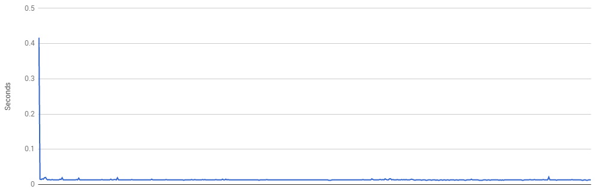
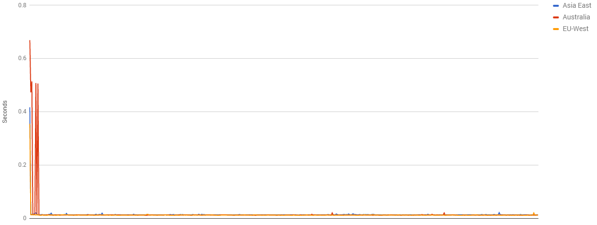
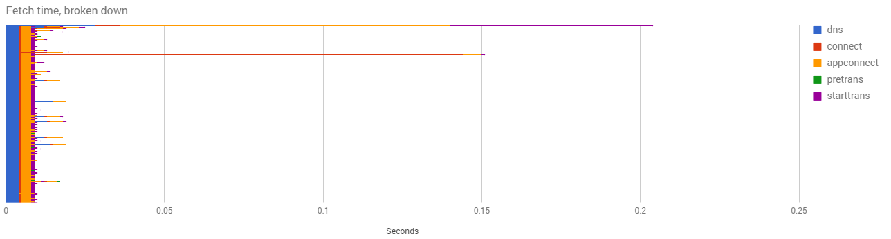
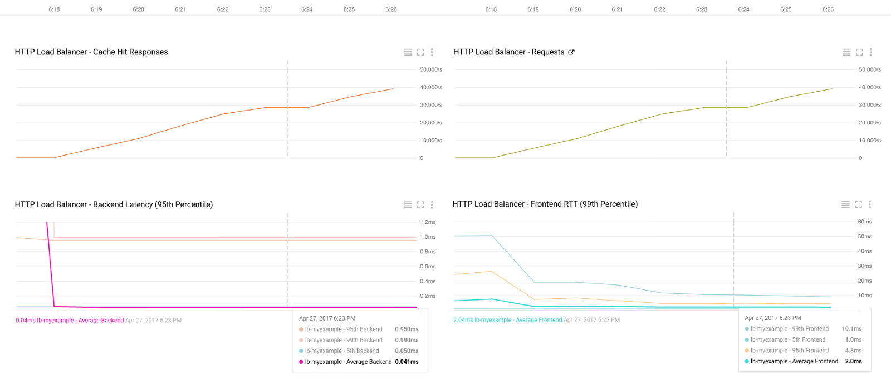
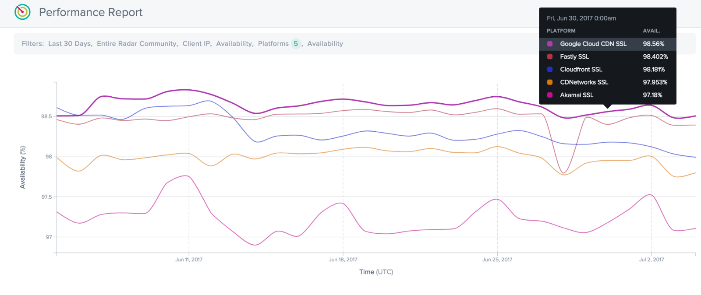

How good is Google Cloud’s CDN? – Google Cloud Platform — Community – Medium

# How good is Google Cloud’s CDN?

We talked [before](https://medium.com/@duhroach/removing-the-need-for-caching-servers-with-gcps-load-balancers-ae516497c7fb)about how the Load Balancer can be extended to take advantage of [Google’s CDN](https://cloud.google.com/cdn/). The result was less headache for you, and faster fetches for the end user.

A few social media friends reached out to say “*That’s all fine, but how good is Google’s CDN, anyway?*”

That’s…... Actually a really good question. Let’s take a look at how to profile Google’s CDN.

[Profiling Google Cloud’s CDN](https://www.youtube.com/watch?list=PLIivdWyY5sqK5zce0-fd1Vam7oPY-s_8X&v=hJUmBVLVZi8)

Too busy to read? Check out the video above!

### CDN transfer time

A CDN is working properly when it can cache a requested asset as close to the requestor as possible. This has two main factors : A) Does it work, and B) Does it work everywhere?

“*Does it work*” is easy to test. We simply set up an asset on the CDN, with caching headers, and throw a cURL command at it 500 times or so.

You know your CDN is working properly when the latency of that request looks something like the image below. You get a bunch of standard requests at the front of your timeline, (where the latency is tied to the physical distance between the requester and the server), and then latency drops significantly once the caching occurs. In this case the caching result was almost instantaneous:

Probably most important is that CDNs minimize the impact that geographical differences impose in a fetch. This is why the “Does it work everywhere” part is just as important, and for our purposes, just as easy to test.

First, place an asset on a server, say, in North America, (maybe [near a BBQ restaurant](https://www.google.com/maps/place/Franklin+Barbecue/@30.270142,-97.7334652,17z/data=!3m1!4b1!4m5!3m4!1s0x8644b5a4ae3bcc33:0x31aba8abf8f64c84!8m2!3d30.270142!4d-97.7312712)) and then fetch that asset from a bunch of machines located around the world.

The graph below shows our asset being fetched from a machine in Asia, Australia and Europe.

This graph shows Google’s CDN is working properly, despite geographical distances from the requester to the server. From this test, we can see the performance is taking advantage of the power of [Google’s Edge Network](https://peering.google.com/#/infrastructure), where assets are moved to closer points-of-presence for later fetches.

### Getting more details

For most developers, the test can stop at the above data. Besides [nuances on features](https://cloud.google.com/cdn/#features), most companies choose a CDN due to it’s performance, cost, and uptime. But, since the behavior of CDNs may vary, we want to break apart our request latency, and see each stage individually. Specifically, I want to see the DNS time, Connection time, and Wait time.

Why do these things matter?

**DNS time**: It is the time that it takes for the hostname to get resolved. DNS resolution is really important to understand user performance, since end users rely on DNS resolvers of their ISPs for the last mile. Some CDNs have more complex DNS setup than others, which means the time gained in Wait time was diluted by slower DNS response time.

**Connect time**: Connect is the time it takes to make the TCP connection. It depends on the network (end-to-end latency). For SSL add also the time it takes to establish the encrypted tunnel. Quite important here, is that if your CDN is susceptible to peak-hour restrictions, Connect time will show it.

**Wait time**: is the time that it takes for the remote server to process the request. IF your content is on the edge of the network (close to you) then this time should be really low, however, if the content needs to be fetched from the origin server, it can be higher. A CDN will deliver good performance if the asset is cached, due to it’s popularity.

With a handy cURL command, we can get all this data:

*(Note, these times are absolute since the beginning of the connection. To figure out how long each stage lasts, you need to sort them properly and then subtract them!)*

What’s really nice here is that we can see, firstly, that the times line up pretty well with the non-broken-apart version (this means our break-out doesn’t seem to be adding much overhead to the test), but secondly, that overall, the DNS, Connect, and pre-transfer stages are exceptionally fast, and very consistent. Exactly what we want in a CDN.

### We’re going to need a bigger test

Now, a few folks pointed out that my tests might not produce the most accurate results, given that there’s a single origin point that’s requesting the same asset multiple times. No problem, let’s build a bigger test.

For this, a team used used [Vegeta](https://github.com/tsenart/vegeta), running on[Google Container Engine](https://cloud.google.com/container-engine/) , which allowed each pod to create 1000 requests per second (RPS) and then scaled up quickly to 50,000 RPS. The following Stackdriver dashboard shows how Cloud CDN handled the load:

- •The cache hit chart closely follows the request chart.
- •The latency decreases consistently and remains constant once reaching its average backend minimum.

Note: See a similar use case on [Github](https://github.com/GoogleCloudPlatform/serverless-pixel-tracking) for load testing a [serverless pixel tracking solution](https://cloud.google.com/solutions/serverless-pixel-tracking).

### Nope, not big enough. Go bigger.

So that’s fine, but you could argue that again, it’s not enough, and that to really test the power of a CDN, you need to have billions of requests passing through it every day. Sadly, I don’t have a website that popular, and I don’t have access to all the other websites in the world (yet), but thankfully, the folks at Cedexis, do.

The [Cedexis Radar Community](https://www.cedexis.com/products/radar/) collects over 14 billion real user measurements each day from users all around the world. This data is aggregated and delivered free to all members of the Radar Community, who can see in near real-time the state of the Internet: the availability, latency, and throughput of global CDNs, ISPs, Clouds, and their own web properties.

Their [reports](https://www.cedexis.com/google-reports/) make it really easy to see how your favorite CDN is doing with respect to latency, uptime, and throughput

### OK, that’s big enough

So, we’ve presented a few ways that you could move forward testing Google’s CDN. Not only can you run it yourself with a small test, but can expand to a 50k RPS system, or just take a look at the performance numbers from a few different groups who collect RUM stats.

Figure out your needs, boot up the tests, and see if Google’s CDN can help you improve performance for your end users!

### HEY! Listen!

There’s some great [tools to help you profile your networking perf](https://medium.com/@duhroach/tools-to-profile-networking-performance-3141870d5233).

Don’t forget to check you’re using the [right region for your GCP instance](https://medium.com/@duhroach/fixing-regional-networking-performance-ee069a7ae066).

And make sure you’re using the right [CPU counts for your networking performance](https://medium.com/@duhroach/core-count-and-the-egress-problem-607fb6b51fa9).