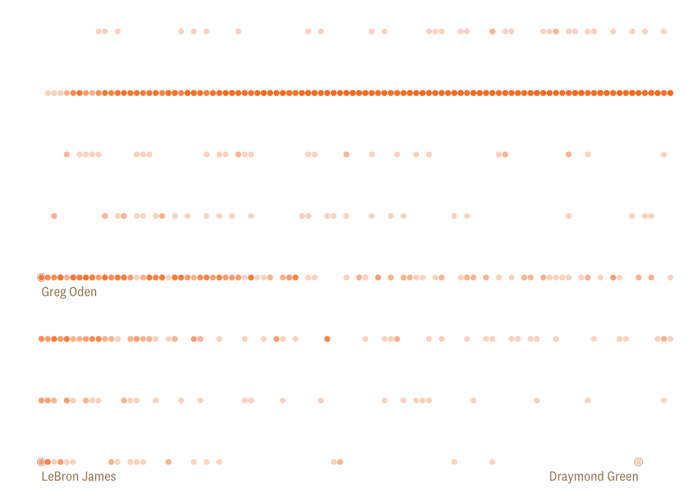
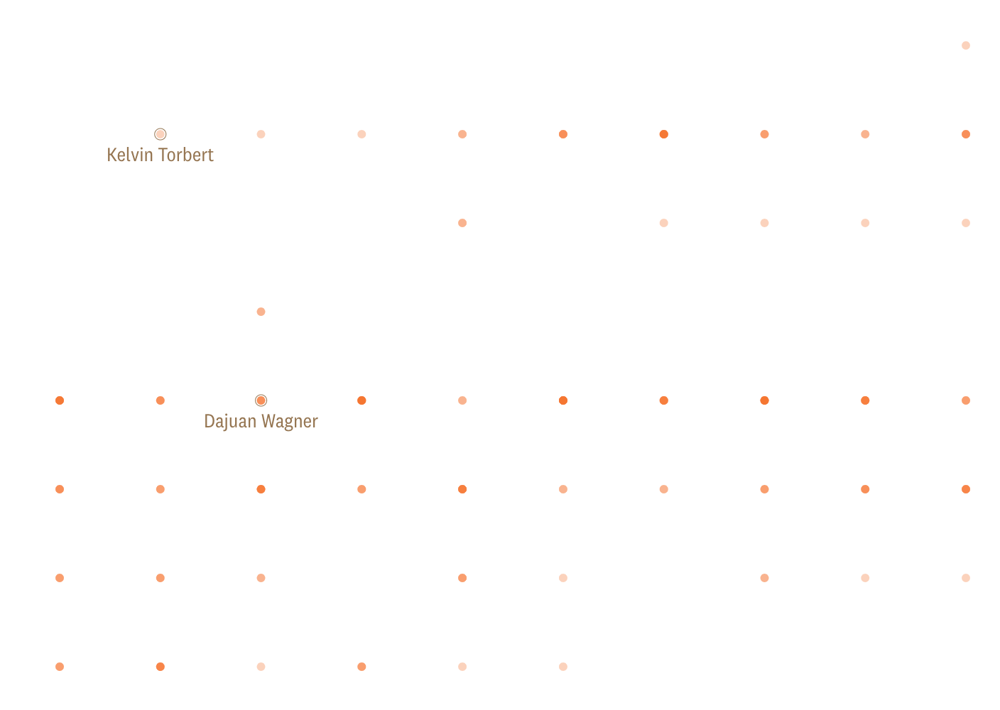
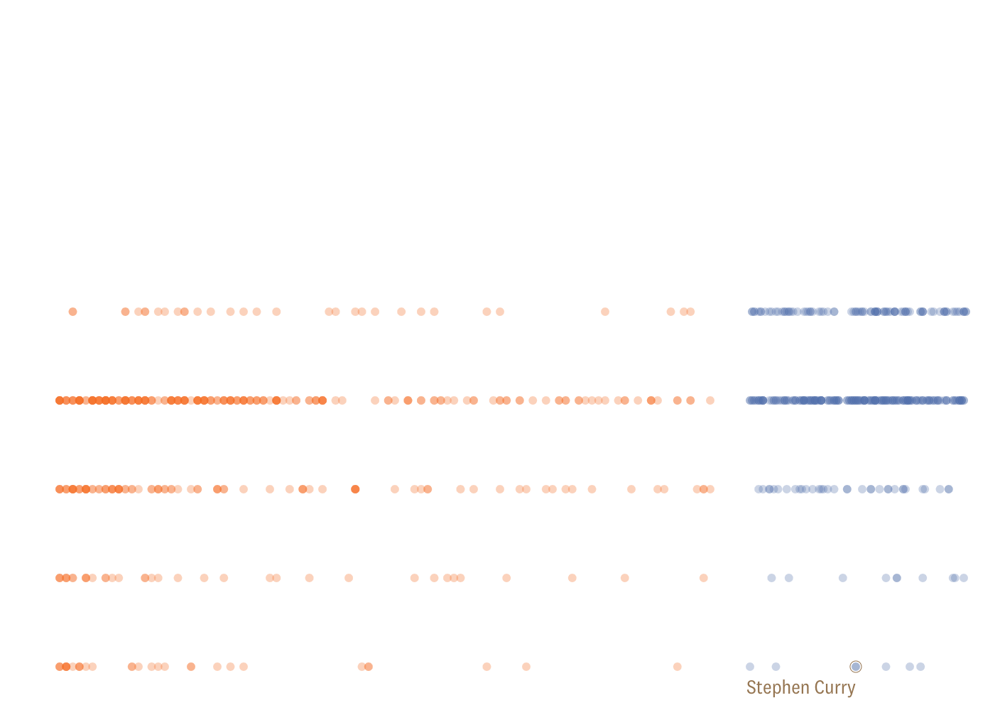
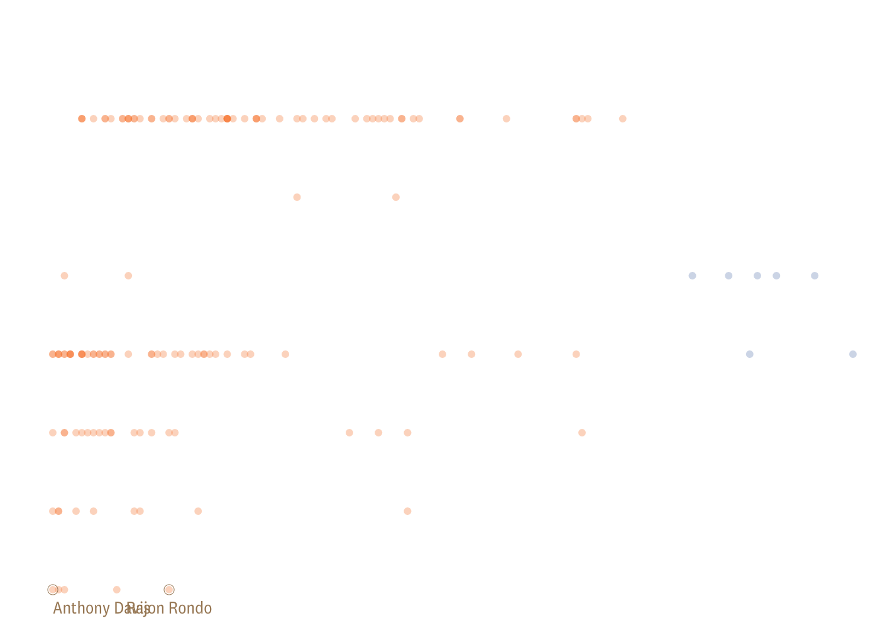

How many high school stars make it in the NBA?

# How many high school stars make it in the NBA?

Every year the top high school basketball recruits get hyped up. How often do they pan out?

By[**Russell Goldenberg**](https://pudding.cool/author/russell-goldenberg/) & [**Amber Thomas**](https://pudding.cool/author/amber-thomas/)

Feb 2019

Remember NBA great Donnell Harvey? Neither do we. Despite being the #1 high school recruit in 2000—something that you think would indicate future NBA stardom—he put together a meager career in the league, averaging around 5 points per game over 5 years. On the flip side is LeBron James—the #1 high school recruit just a few years later—and we all know what he’s been up to.

This disparity got us thinking, **are these top 100 recruit lists any indication of making it to the NBA, let alone becoming a star?**

It must be really hard to assess top talent when the pool is so large in high school. Now that we’ve entered the YouTube era, hype surrounding players can inflate in an instant. Sure, LeBron paved the way with some nationally televised games, but now millions of people are watching Zion Williamson throw down dunks in warm ups, or Lamelo Ball hit threes from half court in eight grade.

Let’s take a look at just how far the high school stars of the past 20 years made it in their basketball careers.

Below, each circle is a player that ranked amongst the top 100 high school recruits in the US according to the Recruiting Services Consensus Index.

High school rank: #1

- Dwight Howard
- Anthony Davis
- LeBron James

#### Level Reached of Top 100 High School Players

Percentage of players that reach each level (out of 1,563 players) from 1998 - 2013

' data-evernote-id='139'%3e%3c/rect%3e%3ctext transform='translate(21%2c 375)rotate(-90)' text-anchor='middle' data-evernote-id='140' class='js-evernote-checked'%3eNBA career%3c/text%3e%3c/g%3e%3ccircle class='tooltip__circle is-visible js-evernote-checked' r='5' cx='42' cy='469.5' data-evernote-id='141'%3e%3c/circle%3e%3cg class='g-labels js-evernote-checked' transform='translate(0%2c 32)' data-evernote-id='142'%3e%3cg class='g-label g-label-highSchool js-evernote-checked' data-evernote-id='143'%3e%3ctext class='label js-evernote-checked' alignment-baseline='middle' text-anchor='middle' transform='translate(352%2c -12.5)' data-evernote-id='144'%3ehigh school rank%3c/text%3e%3ctext class='percentage percentage__top percentage__top-highSchool js-evernote-checked' alignment-baseline='middle' text-anchor='end' transform='translate(680%2c -12.5)' data-evernote-id='145'%3e%3c/text%3e%3ctext class='count count__top count__top-highSchool js-evernote-checked' alignment-baseline='middle' text-anchor='end' transform='translate(680%2c 12.5)' data-evernote-id='146'%3e%3c/text%3e%3c/g%3e%3cg class='g-label g-label-college js-evernote-checked' data-evernote-id='147'%3e%3ctext class='label js-evernote-checked' alignment-baseline='middle' text-anchor='middle' transform='translate(352%2c 50)' data-evernote-id='148'%3ecollege%3c/text%3e%3ctext class='percentage percentage__top percentage__top-college js-evernote-checked' alignment-baseline='middle' text-anchor='end' transform='translate(680%2c 50)' data-evernote-id='149'%3e98 %25%3c/text%3e%3ctext class='count count__top count__top-college js-evernote-checked' alignment-baseline='middle' text-anchor='end' transform='translate(680%2c 75)' data-evernote-id='150'%3e1503 players%3c/text%3e%3c/g%3e%3cg class='g-label g-label-draft js-evernote-checked' data-evernote-id='151'%3e%3ctext class='label js-evernote-checked' alignment-baseline='middle' text-anchor='middle' transform='translate(352%2c 112.5)' data-evernote-id='152'%3edrafted%3c/text%3e%3ctext class='percentage percentage__top percentage__top-draft js-evernote-checked' alignment-baseline='middle' text-anchor='end' transform='translate(680%2c 112.5)' data-evernote-id='153'%3e29 %25%3c/text%3e%3ctext class='count count__top count__top-draft js-evernote-checked' alignment-baseline='middle' text-anchor='end' transform='translate(680%2c 137.5)' data-evernote-id='154'%3e445%3c/text%3e%3c/g%3e%3cg class='g-label g-label-rookie js-evernote-checked' data-evernote-id='155'%3e%3ctext class='label js-evernote-checked' alignment-baseline='middle' text-anchor='middle' transform='translate(352%2c 175)' data-evernote-id='156'%3e%26lt%3b 2 years in NBA%3c/text%3e%3ctext class='percentage percentage__top percentage__top-rookie js-evernote-checked' alignment-baseline='middle' text-anchor='end' transform='translate(680%2c 175)' data-evernote-id='157'%3e27 %25%3c/text%3e%3ctext class='count count__top count__top-rookie js-evernote-checked' alignment-baseline='middle' text-anchor='end' transform='translate(680%2c 200)' data-evernote-id='158'%3e414%3c/text%3e%3c/g%3e%3cg class='g-label g-label-bad js-evernote-checked' data-evernote-id='159'%3e%3ctext class='label js-evernote-checked' alignment-baseline='middle' text-anchor='middle' transform='translate(352%2c 237.5)' data-evernote-id='160'%3ebelow average%3c/text%3e%3ctext class='percentage percentage__top percentage__top-bad js-evernote-checked' alignment-baseline='middle' text-anchor='end' transform='translate(680%2c 237.5)' data-evernote-id='161'%3e25 %25%3c/text%3e%3ctext class='count count__top count__top-bad js-evernote-checked' alignment-baseline='middle' text-anchor='end' transform='translate(680%2c 262.5)' data-evernote-id='162'%3e382%3c/text%3e%3c/g%3e%3cg class='g-label g-label-good js-evernote-checked' data-evernote-id='163'%3e%3ctext class='label js-evernote-checked' alignment-baseline='middle' text-anchor='middle' transform='translate(352%2c 300)' data-evernote-id='164'%3emediocre%3c/text%3e%3ctext class='percentage percentage__top percentage__top-good js-evernote-checked' alignment-baseline='middle' text-anchor='end' transform='translate(680%2c 300)' data-evernote-id='165'%3e11 %25%3c/text%3e%3ctext class='count count__top count__top-good js-evernote-checked' alignment-baseline='middle' text-anchor='end' transform='translate(680%2c 325)' data-evernote-id='166'%3e163%3c/text%3e%3c/g%3e%3cg class='g-label g-label-great js-evernote-checked' data-evernote-id='167'%3e%3ctext class='label js-evernote-checked' alignment-baseline='middle' text-anchor='middle' transform='translate(352%2c 362.5)' data-evernote-id='168'%3egreat%3c/text%3e%3ctext class='percentage percentage__top percentage__top-great js-evernote-checked' alignment-baseline='middle' text-anchor='end' transform='translate(680%2c 362.5)' data-evernote-id='169'%3e4 %25%3c/text%3e%3ctext class='count count__top count__top-great js-evernote-checked' alignment-baseline='middle' text-anchor='end' transform='translate(680%2c 387.5)' data-evernote-id='170'%3e67%3c/text%3e%3c/g%3e%3cg class='g-label g-label-allstar js-evernote-checked' data-evernote-id='171'%3e%3ctext class='label js-evernote-checked' alignment-baseline='middle' text-anchor='middle' transform='translate(352%2c 425)' data-evernote-id='172'%3esuperstar%3c/text%3e%3ctext class='percentage percentage__top percentage__top-allstar js-evernote-checked' alignment-baseline='middle' text-anchor='end' transform='translate(680%2c 425)' data-evernote-id='173'%3e2 %25%3c/text%3e%3ctext class='count count__top count__top-allstar js-evernote-checked' alignment-baseline='middle' text-anchor='end' transform='translate(680%2c 450)' data-evernote-id='174'%3e31%3c/text%3e%3c/g%3e%3c/g%3e%3cg data-evernote-id='175' class='js-evernote-checked'%3e%3cg class='g-annotations js-evernote-checked' data-evernote-id='176'%3e%3cg class='annotations__rank js-evernote-checked' transform='translate(42%2c 32)' data-evernote-id='177'%3e%3ctext alignment-baseline='baseline' text-anchor='middle' transform='translate(0%2c -12.5)' data-evernote-id='178' class='js-evernote-checked'%3e%231%3c/text%3e%3c/g%3e%3cg class='annotations__rank js-evernote-checked' transform='translate(680%2c 32)' data-evernote-id='179'%3e%3ctext alignment-baseline='baseline' text-anchor='middle' transform='translate(0%2c -12.5)' data-evernote-id='180' class='js-evernote-checked'%3e%23100%3c/text%3e%3c/g%3e%3c/g%3e%3cg class='g-vis js-evernote-checked' data-evernote-id='181'%3e%3c/g%3e%3c/g%3e%3cg class='g-stops js-evernote-checked' data-evernote-id='182'%3e%3c/g%3e%3c/svg%3e)

27% of the 1,563 top-ranked high school players made it to the NBA and only 25% made it past their two-year rookie contract. Put another way, 441 of the 900 draft picks in that 15 year span were top 100 recruits. Just 31 players eventually reached “superstar” status (based on advanced statistics, details at the bottom).

But perhaps the top 100 is too broad of a categorization. Surely the top 10 players will make it to the NBA more often, right?

High school rank: #10

- David Lee

#### Level Reached of Top 10 High School Players

Percentage of players that reach each level (out of 158 players) from 1998 - 2013

' data-evernote-id='205'%3e%3c/rect%3e%3ctext transform='translate(21%2c 375)rotate(-90)' text-anchor='middle' data-evernote-id='206' class='js-evernote-checked'%3eNBA career%3c/text%3e%3c/g%3e%3ccircle class='tooltip__circle is-visible js-evernote-checked' r='5' cx='680' cy='407' data-evernote-id='207'%3e%3c/circle%3e%3cg class='g-labels js-evernote-checked' transform='translate(0%2c 32)' data-evernote-id='208'%3e%3cg class='g-label g-label-highSchool js-evernote-checked' data-evernote-id='209'%3e%3ctext class='label js-evernote-checked' alignment-baseline='middle' text-anchor='middle' transform='translate(352%2c -12.5)' data-evernote-id='210'%3ehigh school rank%3c/text%3e%3ctext class='percentage percentage__top percentage__top-highSchool js-evernote-checked' alignment-baseline='middle' text-anchor='end' transform='translate(680%2c -12.5)' data-evernote-id='211'%3e%3c/text%3e%3ctext class='count count__top count__top-highSchool js-evernote-checked' alignment-baseline='middle' text-anchor='end' transform='translate(680%2c 12.5)' data-evernote-id='212'%3e%3c/text%3e%3c/g%3e%3cg class='g-label g-label-college js-evernote-checked' data-evernote-id='213'%3e%3ctext class='label js-evernote-checked' alignment-baseline='middle' text-anchor='middle' transform='translate(352%2c 50)' data-evernote-id='214'%3ecollege%3c/text%3e%3ctext class='percentage percentage__top percentage__top-college js-evernote-checked' alignment-baseline='middle' text-anchor='end' transform='translate(680%2c 50)' data-evernote-id='215'%3e99 %25%3c/text%3e%3ctext class='count count__top count__top-college js-evernote-checked' alignment-baseline='middle' text-anchor='end' transform='translate(680%2c 75)' data-evernote-id='216'%3e157 players%3c/text%3e%3c/g%3e%3cg class='g-label g-label-draft js-evernote-checked' data-evernote-id='217'%3e%3ctext class='label js-evernote-checked' alignment-baseline='middle' text-anchor='middle' transform='translate(352%2c 112.5)' data-evernote-id='218'%3edrafted%3c/text%3e%3ctext class='percentage percentage__top percentage__top-draft js-evernote-checked' alignment-baseline='middle' text-anchor='end' transform='translate(680%2c 112.5)' data-evernote-id='219'%3e84 %25%3c/text%3e%3ctext class='count count__top count__top-draft js-evernote-checked' alignment-baseline='middle' text-anchor='end' transform='translate(680%2c 137.5)' data-evernote-id='220'%3e132%3c/text%3e%3c/g%3e%3cg class='g-label g-label-rookie js-evernote-checked' data-evernote-id='221'%3e%3ctext class='label js-evernote-checked' alignment-baseline='middle' text-anchor='middle' transform='translate(352%2c 175)' data-evernote-id='222'%3e%26lt%3b 2 years in NBA%3c/text%3e%3ctext class='percentage percentage__top percentage__top-rookie js-evernote-checked' alignment-baseline='middle' text-anchor='end' transform='translate(680%2c 175)' data-evernote-id='223'%3e80 %25%3c/text%3e%3ctext class='count count__top count__top-rookie js-evernote-checked' alignment-baseline='middle' text-anchor='end' transform='translate(680%2c 200)' data-evernote-id='224'%3e126%3c/text%3e%3c/g%3e%3cg class='g-label g-label-bad js-evernote-checked' data-evernote-id='225'%3e%3ctext class='label js-evernote-checked' alignment-baseline='middle' text-anchor='middle' transform='translate(352%2c 237.5)' data-evernote-id='226'%3ebelow average%3c/text%3e%3ctext class='percentage percentage__top percentage__top-bad js-evernote-checked' alignment-baseline='middle' text-anchor='end' transform='translate(680%2c 237.5)' data-evernote-id='227'%3e78 %25%3c/text%3e%3ctext class='count count__top count__top-bad js-evernote-checked' alignment-baseline='middle' text-anchor='end' transform='translate(680%2c 262.5)' data-evernote-id='228'%3e124%3c/text%3e%3c/g%3e%3cg class='g-label g-label-good js-evernote-checked' data-evernote-id='229'%3e%3ctext class='label js-evernote-checked' alignment-baseline='middle' text-anchor='middle' transform='translate(352%2c 300)' data-evernote-id='230'%3emediocre%3c/text%3e%3ctext class='percentage percentage__top percentage__top-good js-evernote-checked' alignment-baseline='middle' text-anchor='end' transform='translate(680%2c 300)' data-evernote-id='231'%3e43 %25%3c/text%3e%3ctext class='count count__top count__top-good js-evernote-checked' alignment-baseline='middle' text-anchor='end' transform='translate(680%2c 325)' data-evernote-id='232'%3e68%3c/text%3e%3c/g%3e%3cg class='g-label g-label-great js-evernote-checked' data-evernote-id='233'%3e%3ctext class='label js-evernote-checked' alignment-baseline='middle' text-anchor='middle' transform='translate(352%2c 362.5)' data-evernote-id='234'%3egreat%3c/text%3e%3ctext class='percentage percentage__top percentage__top-great js-evernote-checked' alignment-baseline='middle' text-anchor='end' transform='translate(680%2c 362.5)' data-evernote-id='235'%3e19 %25%3c/text%3e%3ctext class='count count__top count__top-great js-evernote-checked' alignment-baseline='middle' text-anchor='end' transform='translate(680%2c 387.5)' data-evernote-id='236'%3e30%3c/text%3e%3c/g%3e%3cg class='g-label g-label-allstar js-evernote-checked' data-evernote-id='237'%3e%3ctext class='label js-evernote-checked' alignment-baseline='middle' text-anchor='middle' transform='translate(352%2c 425)' data-evernote-id='238'%3esuperstar%3c/text%3e%3ctext class='percentage percentage__top percentage__top-allstar js-evernote-checked' alignment-baseline='middle' text-anchor='end' transform='translate(680%2c 425)' data-evernote-id='239'%3e9 %25%3c/text%3e%3ctext class='count count__top count__top-allstar js-evernote-checked' alignment-baseline='middle' text-anchor='end' transform='translate(680%2c 450)' data-evernote-id='240'%3e14%3c/text%3e%3c/g%3e%3c/g%3e%3cg data-evernote-id='241' class='js-evernote-checked'%3e%3cg class='g-annotations js-evernote-checked' data-evernote-id='242'%3e%3cg class='annotations__rank js-evernote-checked' transform='translate(42%2c 32)' data-evernote-id='243'%3e%3ctext alignment-baseline='baseline' text-anchor='middle' transform='translate(0%2c -12.5)' data-evernote-id='244' class='js-evernote-checked'%3e%231%3c/text%3e%3c/g%3e%3cg class='annotations__rank js-evernote-checked' transform='translate(680%2c 32)' data-evernote-id='245'%3e%3ctext alignment-baseline='baseline' text-anchor='middle' transform='translate(0%2c -12.5)' data-evernote-id='246' class='js-evernote-checked'%3e%2310%3c/text%3e%3c/g%3e%3c/g%3e%3cg class='g-vis js-evernote-checked' data-evernote-id='247'%3e%3c/g%3e%3c/g%3e%3cg class='g-stops js-evernote-checked' data-evernote-id='248'%3e%3c/g%3e%3c/svg%3e)

Players ranked in the top 10 certainly appear to have slightly better odds—a full 84% of them eventually made it to the NBA. Though with 60 draft picks a year, you might expect that number to be higher.

In the late 1990’s and early 2000’s, teams could bet hard enough on a player’s future success that they could draft them straight out of high school. This ended in 2006 when a [rule](https://web.archive.org/web/20080227065646/http://www.nbpa.com/cba_articles/article-X.php) was [put into place](https://www.nytimes.com/2005/06/28/sports/basketball/nba-draft-will-close-book-on-high-school-stars.html), declaring that players had to be at least 19 years old or one year removed from high school before getting drafted. But talks are escalating about [reversing this rule](http://www.espn.com/nba/story/_/id/26049542/nba-proposes-changing-draft-age-19-18-players-union), especially in light of the [“shoe incident”](https://www.youtube.com/watch?v=LqJUgQAyDMo). Let’s look at the success of the straight-to-NBA high school players.

High school rank: #1

- LeBron James
- Dwight Howard

#### Level Reached of Straight-to-NBA HS Players

Percentage of players that reach each level (out of 35 players) from 1998 - 2005

' data-evernote-id='276'%3e%3c/rect%3e%3ctext transform='translate(21%2c 375)rotate(-90)' text-anchor='middle' data-evernote-id='277' class='js-evernote-checked'%3eNBA career%3c/text%3e%3c/g%3e%3ccircle class='tooltip__circle is-visible js-evernote-checked' r='5' cx='42' cy='469.5' data-evernote-id='278'%3e%3c/circle%3e%3cg class='g-labels js-evernote-checked' transform='translate(0%2c 32)' data-evernote-id='279'%3e%3cg class='g-label g-label-highSchool js-evernote-checked' data-evernote-id='280'%3e%3ctext class='label js-evernote-checked' alignment-baseline='middle' text-anchor='middle' transform='translate(352%2c -12.5)' data-evernote-id='281'%3ehigh school rank%3c/text%3e%3ctext class='percentage percentage__top percentage__top-highSchool js-evernote-checked' alignment-baseline='middle' text-anchor='end' transform='translate(680%2c -12.5)' data-evernote-id='282'%3e%3c/text%3e%3ctext class='count count__top count__top-highSchool js-evernote-checked' alignment-baseline='middle' text-anchor='end' transform='translate(680%2c 12.5)' data-evernote-id='283'%3e%3c/text%3e%3c/g%3e%3cg class='g-label g-label-college js-evernote-checked' data-evernote-id='284'%3e%3ctext class='label js-evernote-checked' alignment-baseline='middle' text-anchor='middle' transform='translate(352%2c 50)' data-evernote-id='285'%3ecollege%3c/text%3e%3ctext class='percentage percentage__top percentage__top-college js-evernote-checked' alignment-baseline='middle' text-anchor='end' transform='translate(680%2c 50)' data-evernote-id='286'%3e100 %25%3c/text%3e%3ctext class='count count__top count__top-college js-evernote-checked' alignment-baseline='middle' text-anchor='end' transform='translate(680%2c 75)' data-evernote-id='287'%3e33 players%3c/text%3e%3c/g%3e%3cg class='g-label g-label-draft js-evernote-checked' data-evernote-id='288'%3e%3ctext class='label js-evernote-checked' alignment-baseline='middle' text-anchor='middle' transform='translate(352%2c 112.5)' data-evernote-id='289'%3edrafted%3c/text%3e%3ctext class='percentage percentage__top percentage__top-draft js-evernote-checked' alignment-baseline='middle' text-anchor='end' transform='translate(680%2c 112.5)' data-evernote-id='290'%3e100 %25%3c/text%3e%3ctext class='count count__top count__top-draft js-evernote-checked' alignment-baseline='middle' text-anchor='end' transform='translate(680%2c 137.5)' data-evernote-id='291'%3e33%3c/text%3e%3c/g%3e%3cg class='g-label g-label-rookie js-evernote-checked' data-evernote-id='292'%3e%3ctext class='label js-evernote-checked' alignment-baseline='middle' text-anchor='middle' transform='translate(352%2c 175)' data-evernote-id='293'%3e%26lt%3b 2 years in NBA%3c/text%3e%3ctext class='percentage percentage__top percentage__top-rookie js-evernote-checked' alignment-baseline='middle' text-anchor='end' transform='translate(680%2c 175)' data-evernote-id='294'%3e94 %25%3c/text%3e%3ctext class='count count__top count__top-rookie js-evernote-checked' alignment-baseline='middle' text-anchor='end' transform='translate(680%2c 200)' data-evernote-id='295'%3e31%3c/text%3e%3c/g%3e%3cg class='g-label g-label-bad js-evernote-checked' data-evernote-id='296'%3e%3ctext class='label js-evernote-checked' alignment-baseline='middle' text-anchor='middle' transform='translate(352%2c 237.5)' data-evernote-id='297'%3ebelow average%3c/text%3e%3ctext class='percentage percentage__top percentage__top-bad js-evernote-checked' alignment-baseline='middle' text-anchor='end' transform='translate(680%2c 237.5)' data-evernote-id='298'%3e88 %25%3c/text%3e%3ctext class='count count__top count__top-bad js-evernote-checked' alignment-baseline='middle' text-anchor='end' transform='translate(680%2c 262.5)' data-evernote-id='299'%3e29%3c/text%3e%3c/g%3e%3cg class='g-label g-label-good js-evernote-checked' data-evernote-id='300'%3e%3ctext class='label js-evernote-checked' alignment-baseline='middle' text-anchor='middle' transform='translate(352%2c 300)' data-evernote-id='301'%3emediocre%3c/text%3e%3ctext class='percentage percentage__top percentage__top-good js-evernote-checked' alignment-baseline='middle' text-anchor='end' transform='translate(680%2c 300)' data-evernote-id='302'%3e55 %25%3c/text%3e%3ctext class='count count__top count__top-good js-evernote-checked' alignment-baseline='middle' text-anchor='end' transform='translate(680%2c 325)' data-evernote-id='303'%3e18%3c/text%3e%3c/g%3e%3cg class='g-label g-label-great js-evernote-checked' data-evernote-id='304'%3e%3ctext class='label js-evernote-checked' alignment-baseline='middle' text-anchor='middle' transform='translate(352%2c 362.5)' data-evernote-id='305'%3egreat%3c/text%3e%3ctext class='percentage percentage__top percentage__top-great js-evernote-checked' alignment-baseline='middle' text-anchor='end' transform='translate(680%2c 362.5)' data-evernote-id='306'%3e30 %25%3c/text%3e%3ctext class='count count__top count__top-great js-evernote-checked' alignment-baseline='middle' text-anchor='end' transform='translate(680%2c 387.5)' data-evernote-id='307'%3e10%3c/text%3e%3c/g%3e%3cg class='g-label g-label-allstar js-evernote-checked' data-evernote-id='308'%3e%3ctext class='label js-evernote-checked' alignment-baseline='middle' text-anchor='middle' transform='translate(352%2c 425)' data-evernote-id='309'%3esuperstar%3c/text%3e%3ctext class='percentage percentage__top percentage__top-allstar js-evernote-checked' alignment-baseline='middle' text-anchor='end' transform='translate(680%2c 425)' data-evernote-id='310'%3e15 %25%3c/text%3e%3ctext class='count count__top count__top-allstar js-evernote-checked' alignment-baseline='middle' text-anchor='end' transform='translate(680%2c 450)' data-evernote-id='311'%3e5%3c/text%3e%3c/g%3e%3c/g%3e%3cg data-evernote-id='312' class='js-evernote-checked'%3e%3cg class='g-annotations js-evernote-checked' data-evernote-id='313'%3e%3cg class='annotations__rank js-evernote-checked' transform='translate(42%2c 32)' data-evernote-id='314'%3e%3ctext alignment-baseline='baseline' text-anchor='middle' transform='translate(0%2c -12.5)' data-evernote-id='315' class='js-evernote-checked'%3e%231%3c/text%3e%3c/g%3e%3cg class='annotations__rank js-evernote-checked' transform='translate(680%2c 32)' data-evernote-id='316'%3e%3ctext alignment-baseline='baseline' text-anchor='middle' transform='translate(0%2c -12.5)' data-evernote-id='317' class='js-evernote-checked'%3e%23100%3c/text%3e%3c/g%3e%3c/g%3e%3cg class='g-vis js-evernote-checked' data-evernote-id='318'%3e%3c/g%3e%3c/g%3e%3cg class='g-stops js-evernote-checked' data-evernote-id='319'%3e%3c/g%3e%3c/svg%3e)

Opponents of removing the age limit often cite players like Korleone Young as reasons to keep it in place. Young, the #3 ranked high school player in 1998, ultimately fizzled out of the NBA having played only [15 minutes](http://www.basketball-reference.com/players/y/youngko01.html) across 3 games. However, he appears to be the exception more than the rule. Of the other 34 players drafted straight out of high school, 94% made it past their rookie contract, with 55% eventually becoming mediocre or better NBA players.

Let’s switch our view once more, away from the highest ranking high school players to those that played in a US high school, but did not appear on the top 100 list. We found 338 of these players that were eventually drafted into the NBA, despite being undervalued in high school. Let’s compare their career paths with our highly-ranked and drafted high schoolers.

High school rank:

#### Level Reached of Drafted Top & Unranked HS Players

Percentage of players that reach each level (out of 779 players) from 1998 - 2013

' data-evernote-id='343'%3e%3c/rect%3e%3ctext transform='translate(21%2c 375)rotate(-90)' text-anchor='middle' data-evernote-id='344' class='js-evernote-checked'%3eNBA career%3c/text%3e%3c/g%3e%3ccircle class='tooltip__circle js-evernote-checked' r='5' data-evernote-id='345'%3e%3c/circle%3e%3cg class='g-labels js-evernote-checked' transform='translate(0%2c 32)' data-evernote-id='346'%3e%3cg class='g-label g-label-highSchool js-evernote-checked' data-evernote-id='347'%3e%3ctext class='label js-evernote-checked' alignment-baseline='middle' text-anchor='middle' transform='translate(264%2c -12.5)' data-evernote-id='348'%3ehigh school rank%3c/text%3e%3ctext class='percentage percentage__top percentage__top-highSchool js-evernote-checked' alignment-baseline='middle' text-anchor='end' transform='translate(500%2c -12.5)' data-evernote-id='349'%3e%3c/text%3e%3ctext class='count count__top count__top-highSchool js-evernote-checked' alignment-baseline='middle' text-anchor='end' transform='translate(500%2c 12.5)' data-evernote-id='350'%3e%3c/text%3e%3ctext class='percentage percentage__underdog percentage__underdog-highSchool js-evernote-checked' alignment-baseline='middle' text-anchor='start' transform='translate(528%2c -12.5)' data-evernote-id='351'%3e%3c/text%3e%3ctext class='count count__underdog count__underdog-highSchool js-evernote-checked' alignment-baseline='middle' text-anchor='start' transform='translate(528%2c 12.5)' data-evernote-id='352'%3e%3c/text%3e%3c/g%3e%3cg class='g-label g-label-college js-evernote-checked' data-evernote-id='353'%3e%3ctext class='label js-evernote-checked' alignment-baseline='middle' text-anchor='middle' transform='translate(264%2c 50)' data-evernote-id='354'%3ecollege%3c/text%3e%3ctext class='percentage percentage__top percentage__top-college js-evernote-checked' alignment-baseline='middle' text-anchor='end' transform='translate(500%2c 50)' data-evernote-id='355'%3e100 %25%3c/text%3e%3ctext class='count count__top count__top-college js-evernote-checked' alignment-baseline='middle' text-anchor='end' transform='translate(500%2c 75)' data-evernote-id='356'%3e414 players%3c/text%3e%3ctext class='percentage percentage__underdog percentage__underdog-college js-evernote-checked' alignment-baseline='middle' text-anchor='start' transform='translate(528%2c 50)' data-evernote-id='357'%3e100 %25%3c/text%3e%3ctext class='count count__underdog count__underdog-college js-evernote-checked' alignment-baseline='middle' text-anchor='start' transform='translate(528%2c 75)' data-evernote-id='358'%3e338 players%3c/text%3e%3c/g%3e%3cg class='g-label g-label-draft js-evernote-checked' data-evernote-id='359'%3e%3ctext class='label js-evernote-checked' alignment-baseline='middle' text-anchor='middle' transform='translate(264%2c 112.5)' data-evernote-id='360'%3edrafted%3c/text%3e%3ctext class='percentage percentage__top percentage__top-draft js-evernote-checked' alignment-baseline='middle' text-anchor='end' transform='translate(500%2c 112.5)' data-evernote-id='361'%3e100 %25%3c/text%3e%3ctext class='count count__top count__top-draft js-evernote-checked' alignment-baseline='middle' text-anchor='end' transform='translate(500%2c 137.5)' data-evernote-id='362'%3e414%3c/text%3e%3ctext class='percentage percentage__underdog percentage__underdog-draft js-evernote-checked' alignment-baseline='middle' text-anchor='start' transform='translate(528%2c 112.5)' data-evernote-id='363'%3e100 %25%3c/text%3e%3ctext class='count count__underdog count__underdog-draft js-evernote-checked' alignment-baseline='middle' text-anchor='start' transform='translate(528%2c 137.5)' data-evernote-id='364'%3e338%3c/text%3e%3c/g%3e%3cg class='g-label g-label-rookie js-evernote-checked' data-evernote-id='365'%3e%3ctext class='label js-evernote-checked' alignment-baseline='middle' text-anchor='middle' transform='translate(264%2c 175)' data-evernote-id='366'%3e%26lt%3b 2 years in NBA%3c/text%3e%3ctext class='percentage percentage__top percentage__top-rookie js-evernote-checked' alignment-baseline='middle' text-anchor='end' transform='translate(500%2c 175)' data-evernote-id='367'%3e100 %25%3c/text%3e%3ctext class='count count__top count__top-rookie js-evernote-checked' alignment-baseline='middle' text-anchor='end' transform='translate(500%2c 200)' data-evernote-id='368'%3e414%3c/text%3e%3ctext class='percentage percentage__underdog percentage__underdog-rookie js-evernote-checked' alignment-baseline='middle' text-anchor='start' transform='translate(528%2c 175)' data-evernote-id='369'%3e100 %25%3c/text%3e%3ctext class='count count__underdog count__underdog-rookie js-evernote-checked' alignment-baseline='middle' text-anchor='start' transform='translate(528%2c 200)' data-evernote-id='370'%3e338%3c/text%3e%3c/g%3e%3cg class='g-label g-label-bad js-evernote-checked' data-evernote-id='371'%3e%3ctext class='label js-evernote-checked' alignment-baseline='middle' text-anchor='middle' transform='translate(264%2c 237.5)' data-evernote-id='372'%3ebelow average%3c/text%3e%3ctext class='percentage percentage__top percentage__top-bad js-evernote-checked' alignment-baseline='middle' text-anchor='end' transform='translate(500%2c 237.5)' data-evernote-id='373'%3e92 %25%3c/text%3e%3ctext class='count count__top count__top-bad js-evernote-checked' alignment-baseline='middle' text-anchor='end' transform='translate(500%2c 262.5)' data-evernote-id='374'%3e382%3c/text%3e%3ctext class='percentage percentage__underdog percentage__underdog-bad js-evernote-checked' alignment-baseline='middle' text-anchor='start' transform='translate(528%2c 237.5)' data-evernote-id='375'%3e73 %25%3c/text%3e%3ctext class='count count__underdog count__underdog-bad js-evernote-checked' alignment-baseline='middle' text-anchor='start' transform='translate(528%2c 262.5)' data-evernote-id='376'%3e248%3c/text%3e%3c/g%3e%3cg class='g-label g-label-good js-evernote-checked' data-evernote-id='377'%3e%3ctext class='label js-evernote-checked' alignment-baseline='middle' text-anchor='middle' transform='translate(264%2c 300)' data-evernote-id='378'%3emediocre%3c/text%3e%3ctext class='percentage percentage__top percentage__top-good js-evernote-checked' alignment-baseline='middle' text-anchor='end' transform='translate(500%2c 300)' data-evernote-id='379'%3e39 %25%3c/text%3e%3ctext class='count count__top count__top-good js-evernote-checked' alignment-baseline='middle' text-anchor='end' transform='translate(500%2c 325)' data-evernote-id='380'%3e163%3c/text%3e%3ctext class='percentage percentage__underdog percentage__underdog-good js-evernote-checked' alignment-baseline='middle' text-anchor='start' transform='translate(528%2c 300)' data-evernote-id='381'%3e15 %25%3c/text%3e%3ctext class='count count__underdog count__underdog-good js-evernote-checked' alignment-baseline='middle' text-anchor='start' transform='translate(528%2c 325)' data-evernote-id='382'%3e51%3c/text%3e%3c/g%3e%3cg class='g-label g-label-great js-evernote-checked' data-evernote-id='383'%3e%3ctext class='label js-evernote-checked' alignment-baseline='middle' text-anchor='middle' transform='translate(264%2c 362.5)' data-evernote-id='384'%3egreat%3c/text%3e%3ctext class='percentage percentage__top percentage__top-great js-evernote-checked' alignment-baseline='middle' text-anchor='end' transform='translate(500%2c 362.5)' data-evernote-id='385'%3e16 %25%3c/text%3e%3ctext class='count count__top count__top-great js-evernote-checked' alignment-baseline='middle' text-anchor='end' transform='translate(500%2c 387.5)' data-evernote-id='386'%3e67%3c/text%3e%3ctext class='percentage percentage__underdog percentage__underdog-great js-evernote-checked' alignment-baseline='middle' text-anchor='start' transform='translate(528%2c 362.5)' data-evernote-id='387'%3e5 %25%3c/text%3e%3ctext class='count count__underdog count__underdog-great js-evernote-checked' alignment-baseline='middle' text-anchor='start' transform='translate(528%2c 387.5)' data-evernote-id='388'%3e17%3c/text%3e%3c/g%3e%3cg class='g-label g-label-allstar js-evernote-checked' data-evernote-id='389'%3e%3ctext class='label js-evernote-checked' alignment-baseline='middle' text-anchor='middle' transform='translate(264%2c 425)' data-evernote-id='390'%3esuperstar%3c/text%3e%3ctext class='percentage percentage__top percentage__top-allstar js-evernote-checked' alignment-baseline='middle' text-anchor='end' transform='translate(500%2c 425)' data-evernote-id='391'%3e7 %25%3c/text%3e%3ctext class='count count__top count__top-allstar js-evernote-checked' alignment-baseline='middle' text-anchor='end' transform='translate(500%2c 450)' data-evernote-id='392'%3e31%3c/text%3e%3ctext class='percentage percentage__underdog percentage__underdog-allstar js-evernote-checked' alignment-baseline='middle' text-anchor='start' transform='translate(528%2c 425)' data-evernote-id='393'%3e2 %25%3c/text%3e%3ctext class='count count__underdog count__underdog-allstar js-evernote-checked' alignment-baseline='middle' text-anchor='start' transform='translate(528%2c 450)' data-evernote-id='394'%3e7%3c/text%3e%3c/g%3e%3c/g%3e%3cg data-evernote-id='395' class='js-evernote-checked'%3e%3cg class='g-annotations js-evernote-checked' data-evernote-id='396'%3e%3cg class='annotations__rank js-evernote-checked' transform='translate(42%2c 32)' data-evernote-id='397'%3e%3ctext alignment-baseline='baseline' text-anchor='middle' transform='translate(0%2c -12.5)' data-evernote-id='398' class='js-evernote-checked'%3e%231%3c/text%3e%3c/g%3e%3cg class='annotations__rank js-evernote-checked' transform='translate(500%2c 32)' data-evernote-id='399'%3e%3ctext alignment-baseline='baseline' text-anchor='middle' transform='translate(0%2c -12.5)' data-evernote-id='400' class='js-evernote-checked'%3e%23100%3c/text%3e%3c/g%3e%3cg class='annotations__underdog js-evernote-checked' transform='translate(0%2c 32)' data-evernote-id='401'%3e%3ctext text-anchor='middle' class='underdog-label js-evernote-checked' transform='translate(604%2c -12.5)' data-evernote-id='402'%3enot in Top 100%3c/text%3e%3c/g%3e%3c/g%3e%3cg class='g-vis js-evernote-checked' data-evernote-id='403'%3e%3c/g%3e%3c/g%3e%3cg class='g-stops js-evernote-checked' data-evernote-id='404'%3e%3c/g%3e%3c/svg%3e)

Even when we limit the top ranked players to just those that were eventually drafted, the success rate of players ranked in high school is notably higher than for those who weren’t. Where 92% of the drafted and ranked players made it past their rookie contract, only 73% of the unranked and drafted players stayed more than two years. Seven players—Dwyane Wade, Marc Gasol, Paul George, Jimmy Butler,Russell Westbrook, Stephen Curry, and Damian Lillard—whose high school careers were apparently not worthy of a spot amongst the top 100, still broke into the ranks of superstars in their NBA careers.

Let’s look at one more slice that has lofty expectations; The Big 4. Kentucky, Kansas, Duke, and UNC are known to consistently land the biggest recruits. Do these recruits translate into NBA success stories or is college their last stop?

High school rank:

#### Level Reached of Players from Kentucky, Kansas, Duke, and UNC

Percentage of players that reach each level (out of 157 players) from 1998 - 2013

' data-evernote-id='426'%3e%3c/rect%3e%3ctext transform='translate(21%2c 375)rotate(-90)' text-anchor='middle' data-evernote-id='427' class='js-evernote-checked'%3eNBA career%3c/text%3e%3c/g%3e%3ccircle class='tooltip__circle js-evernote-checked' r='5' data-evernote-id='428'%3e%3c/circle%3e%3cg class='g-labels js-evernote-checked' transform='translate(0%2c 32)' data-evernote-id='429'%3e%3cg class='g-label g-label-highSchool js-evernote-checked' data-evernote-id='430'%3e%3ctext class='label js-evernote-checked' alignment-baseline='middle' text-anchor='middle' transform='translate(264%2c -12.5)' data-evernote-id='431'%3ehigh school rank%3c/text%3e%3ctext class='percentage percentage__top percentage__top-highSchool js-evernote-checked' alignment-baseline='middle' text-anchor='end' transform='translate(500%2c -12.5)' data-evernote-id='432'%3e%3c/text%3e%3ctext class='count count__top count__top-highSchool js-evernote-checked' alignment-baseline='middle' text-anchor='end' transform='translate(500%2c 12.5)' data-evernote-id='433'%3e%3c/text%3e%3ctext class='percentage percentage__underdog percentage__underdog-highSchool js-evernote-checked' alignment-baseline='middle' text-anchor='start' transform='translate(528%2c -12.5)' data-evernote-id='434'%3e%3c/text%3e%3ctext class='count count__underdog count__underdog-highSchool js-evernote-checked' alignment-baseline='middle' text-anchor='start' transform='translate(528%2c 12.5)' data-evernote-id='435'%3e%3c/text%3e%3c/g%3e%3cg class='g-label g-label-college js-evernote-checked' data-evernote-id='436'%3e%3ctext class='label js-evernote-checked' alignment-baseline='middle' text-anchor='middle' transform='translate(264%2c 50)' data-evernote-id='437'%3ecollege%3c/text%3e%3ctext class='percentage percentage__top percentage__top-college js-evernote-checked' alignment-baseline='middle' text-anchor='end' transform='translate(500%2c 50)' data-evernote-id='438'%3e100 %25%3c/text%3e%3ctext class='count count__top count__top-college js-evernote-checked' alignment-baseline='middle' text-anchor='end' transform='translate(500%2c 75)' data-evernote-id='439'%3e147 players%3c/text%3e%3ctext class='percentage percentage__underdog percentage__underdog-college js-evernote-checked' alignment-baseline='middle' text-anchor='start' transform='translate(528%2c 50)' data-evernote-id='440'%3e100 %25%3c/text%3e%3ctext class='count count__underdog count__underdog-college js-evernote-checked' alignment-baseline='middle' text-anchor='start' transform='translate(528%2c 75)' data-evernote-id='441'%3e7 players%3c/text%3e%3c/g%3e%3cg class='g-label g-label-draft js-evernote-checked' data-evernote-id='442'%3e%3ctext class='label js-evernote-checked' alignment-baseline='middle' text-anchor='middle' transform='translate(264%2c 112.5)' data-evernote-id='443'%3edrafted%3c/text%3e%3ctext class='percentage percentage__top percentage__top-draft js-evernote-checked' alignment-baseline='middle' text-anchor='end' transform='translate(500%2c 112.5)' data-evernote-id='444'%3e56 %25%3c/text%3e%3ctext class='count count__top count__top-draft js-evernote-checked' alignment-baseline='middle' text-anchor='end' transform='translate(500%2c 137.5)' data-evernote-id='445'%3e83%3c/text%3e%3ctext class='percentage percentage__underdog percentage__underdog-draft js-evernote-checked' alignment-baseline='middle' text-anchor='start' transform='translate(528%2c 112.5)' data-evernote-id='446'%3e100 %25%3c/text%3e%3ctext class='count count__underdog count__underdog-draft js-evernote-checked' alignment-baseline='middle' text-anchor='start' transform='translate(528%2c 137.5)' data-evernote-id='447'%3e7%3c/text%3e%3c/g%3e%3cg class='g-label g-label-rookie js-evernote-checked' data-evernote-id='448'%3e%3ctext class='label js-evernote-checked' alignment-baseline='middle' text-anchor='middle' transform='translate(264%2c 175)' data-evernote-id='449'%3e%26lt%3b 2 years in NBA%3c/text%3e%3ctext class='percentage percentage__top percentage__top-rookie js-evernote-checked' alignment-baseline='middle' text-anchor='end' transform='translate(500%2c 175)' data-evernote-id='450'%3e55 %25%3c/text%3e%3ctext class='count count__top count__top-rookie js-evernote-checked' alignment-baseline='middle' text-anchor='end' transform='translate(500%2c 200)' data-evernote-id='451'%3e81%3c/text%3e%3ctext class='percentage percentage__underdog percentage__underdog-rookie js-evernote-checked' alignment-baseline='middle' text-anchor='start' transform='translate(528%2c 175)' data-evernote-id='452'%3e100 %25%3c/text%3e%3ctext class='count count__underdog count__underdog-rookie js-evernote-checked' alignment-baseline='middle' text-anchor='start' transform='translate(528%2c 200)' data-evernote-id='453'%3e7%3c/text%3e%3c/g%3e%3cg class='g-label g-label-bad js-evernote-checked' data-evernote-id='454'%3e%3ctext class='label js-evernote-checked' alignment-baseline='middle' text-anchor='middle' transform='translate(264%2c 237.5)' data-evernote-id='455'%3ebelow average%3c/text%3e%3ctext class='percentage percentage__top percentage__top-bad js-evernote-checked' alignment-baseline='middle' text-anchor='end' transform='translate(500%2c 237.5)' data-evernote-id='456'%3e54 %25%3c/text%3e%3ctext class='count count__top count__top-bad js-evernote-checked' alignment-baseline='middle' text-anchor='end' transform='translate(500%2c 262.5)' data-evernote-id='457'%3e79%3c/text%3e%3ctext class='percentage percentage__underdog percentage__underdog-bad js-evernote-checked' alignment-baseline='middle' text-anchor='start' transform='translate(528%2c 237.5)' data-evernote-id='458'%3e29 %25%3c/text%3e%3ctext class='count count__underdog count__underdog-bad js-evernote-checked' alignment-baseline='middle' text-anchor='start' transform='translate(528%2c 262.5)' data-evernote-id='459'%3e2%3c/text%3e%3c/g%3e%3cg class='g-label g-label-good js-evernote-checked' data-evernote-id='460'%3e%3ctext class='label js-evernote-checked' alignment-baseline='middle' text-anchor='middle' transform='translate(264%2c 300)' data-evernote-id='461'%3emediocre%3c/text%3e%3ctext class='percentage percentage__top percentage__top-good js-evernote-checked' alignment-baseline='middle' text-anchor='end' transform='translate(500%2c 300)' data-evernote-id='462'%3e23 %25%3c/text%3e%3ctext class='count count__top count__top-good js-evernote-checked' alignment-baseline='middle' text-anchor='end' transform='translate(500%2c 325)' data-evernote-id='463'%3e34%3c/text%3e%3ctext class='percentage percentage__underdog percentage__underdog-good js-evernote-checked' alignment-baseline='middle' text-anchor='start' transform='translate(528%2c 300)' data-evernote-id='464'%3e0%25%3c/text%3e%3ctext class='count count__underdog count__underdog-good js-evernote-checked' alignment-baseline='middle' text-anchor='start' transform='translate(528%2c 325)' data-evernote-id='465'%3e0%3c/text%3e%3c/g%3e%3cg class='g-label g-label-great js-evernote-checked' data-evernote-id='466'%3e%3ctext class='label js-evernote-checked' alignment-baseline='middle' text-anchor='middle' transform='translate(264%2c 362.5)' data-evernote-id='467'%3egreat%3c/text%3e%3ctext class='percentage percentage__top percentage__top-great js-evernote-checked' alignment-baseline='middle' text-anchor='end' transform='translate(500%2c 362.5)' data-evernote-id='468'%3e10 %25%3c/text%3e%3ctext class='count count__top count__top-great js-evernote-checked' alignment-baseline='middle' text-anchor='end' transform='translate(500%2c 387.5)' data-evernote-id='469'%3e14%3c/text%3e%3ctext class='percentage percentage__underdog percentage__underdog-great js-evernote-checked' alignment-baseline='middle' text-anchor='start' transform='translate(528%2c 362.5)' data-evernote-id='470'%3e0%25%3c/text%3e%3ctext class='count count__underdog count__underdog-great js-evernote-checked' alignment-baseline='middle' text-anchor='start' transform='translate(528%2c 387.5)' data-evernote-id='471'%3e0%3c/text%3e%3c/g%3e%3cg class='g-label g-label-allstar js-evernote-checked' data-evernote-id='472'%3e%3ctext class='label js-evernote-checked' alignment-baseline='middle' text-anchor='middle' transform='translate(264%2c 425)' data-evernote-id='473'%3esuperstar%3c/text%3e%3ctext class='percentage percentage__top percentage__top-allstar js-evernote-checked' alignment-baseline='middle' text-anchor='end' transform='translate(500%2c 425)' data-evernote-id='474'%3e3 %25%3c/text%3e%3ctext class='count count__top count__top-allstar js-evernote-checked' alignment-baseline='middle' text-anchor='end' transform='translate(500%2c 450)' data-evernote-id='475'%3e5%3c/text%3e%3ctext class='percentage percentage__underdog percentage__underdog-allstar js-evernote-checked' alignment-baseline='middle' text-anchor='start' transform='translate(528%2c 425)' data-evernote-id='476'%3e0%25%3c/text%3e%3ctext class='count count__underdog count__underdog-allstar js-evernote-checked' alignment-baseline='middle' text-anchor='start' transform='translate(528%2c 450)' data-evernote-id='477'%3e0%3c/text%3e%3c/g%3e%3c/g%3e%3cg data-evernote-id='478' class='js-evernote-checked'%3e%3cg class='g-annotations js-evernote-checked' data-evernote-id='479'%3e%3cg class='annotations__rank js-evernote-checked' transform='translate(42%2c 32)' data-evernote-id='480'%3e%3ctext alignment-baseline='baseline' text-anchor='middle' transform='translate(0%2c -12.5)' data-evernote-id='481' class='js-evernote-checked'%3e%231%3c/text%3e%3c/g%3e%3cg class='annotations__rank js-evernote-checked' transform='translate(500%2c 32)' data-evernote-id='482'%3e%3ctext alignment-baseline='baseline' text-anchor='middle' transform='translate(0%2c -12.5)' data-evernote-id='483' class='js-evernote-checked'%3e%23100%3c/text%3e%3c/g%3e%3cg class='annotations__underdog js-evernote-checked' transform='translate(0%2c 32)' data-evernote-id='484'%3e%3ctext text-anchor='middle' class='underdog-label js-evernote-checked' transform='translate(604%2c -12.5)' data-evernote-id='485'%3enot in Top 100%3c/text%3e%3c/g%3e%3c/g%3e%3cg class='g-vis js-evernote-checked' data-evernote-id='486'%3e%3c/g%3e%3c/g%3e%3cg class='g-stops js-evernote-checked' data-evernote-id='487'%3e%3c/g%3e%3c/svg%3e)

The college funnel is an interesting discussion, especially when it surrounds the lack of pay for NCAA student athletes. Below we widen the field to take a look at the biggest NBA-producing colleges and see how many yield NBA talent.

NBA Career

college
drafted
< 3 years in NBA
below average
mediocre
great
superstar
University of Kentucky
38 student athletes

38

23

23

22

11

5

5
Duke University
37 student athletes

37

21

21

20

9

5

0
University of North Carolina
36 student athletes

36

18

17

17

7

2

0
University of Florida
36 student athletes

36

16

16

14

9

4

2
University of Kansas
36 student athletes

36

21

20

20

7

2

0
University of California, Los Angeles
33 student athletes

33

17

17

17

7

4

1
University of Arizona
30 student athletes

30

16

15

13

6

4

1
University of Connecticut
30 student athletes

30

16

12

12

7

3

1
Syracuse University
29 student athletes

29

10

10

8

2

1

1
University of Louisville
27 student athletes

27

6

6

5

1

1

0
University of Texas at Austin
27 student athletes

27

12

12

12

5

2

2
Georgia Institute of Technology
26 student athletes

26

9

9

8

5

2

1
Ohio State University
26 student athletes

26

9

7

7

3

1

1
Michigan State University
26 student athletes

26

10

9

9

4

3

1
University of Memphis
26 student athletes

26

7

7

7

3

0

0
Villanova University
25 student athletes

25

2

2

2

1

1

1
Georgetown University
24 student athletes

24

5

5

4

2

1

0
University of Alabama
24 student athletes

24

6

4

4

2

1

1
University of Tennessee
23 student athletes

23

4

4

3

1

0

0
North Carolina State University
23 student athletes

23

5

5

5

0

0

0
University of Southern California
19 student athletes

19

6

5

5

2

0

0
Florida State University
19 student athletes

19

5

5

5

1

0

0