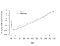
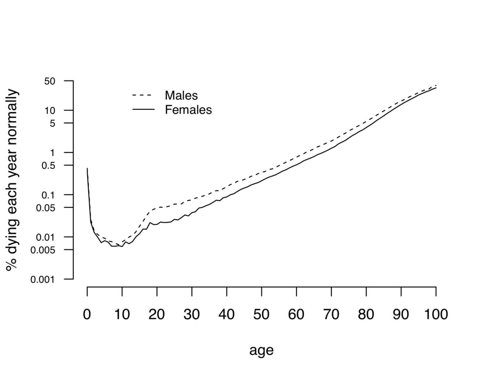
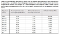
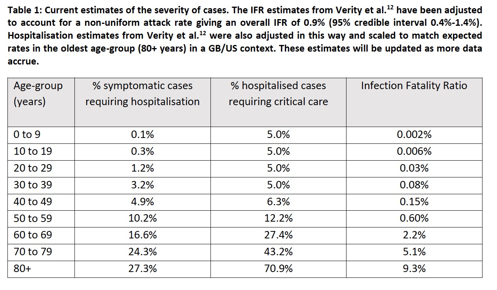
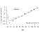
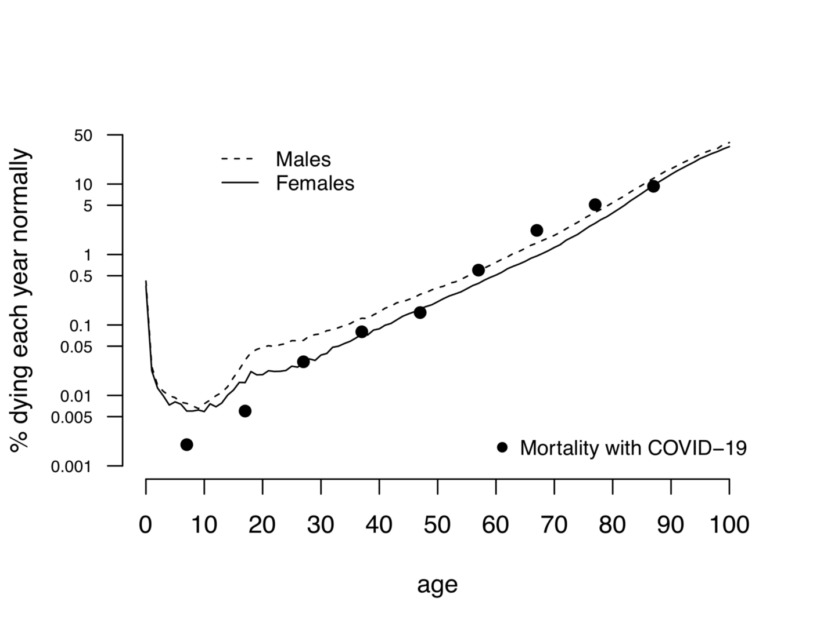
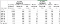
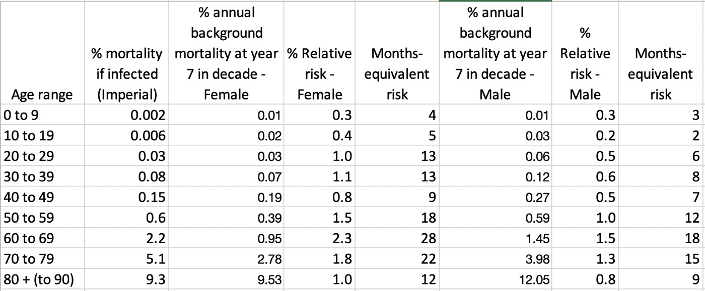

How much ‘normal’ risk does Covid represent? - WintonCentre - Medium

# **How much ‘normal’ risk does Covid represent?**

[David Spiegelhalter](https://medium.com/@d_spiegel?source=post_page-----4539118e1196----------------------)

[Mar 21](https://medium.com/wintoncentre/how-much-normal-risk-does-covid-represent-4539118e1196?source=post_page-----4539118e1196----------------------) · 4 min read

An article by [Nick Triggle on BBC Online](https://www.bbc.co.uk/news/health-51979654) raises the issue of whether many deaths from COVID-19 would have occurred anyway as part of the ‘normal’ risks faced by people, particularly the elderly and those with chronic health problems who are the main victims of COVID. To provide some background, I’ve had a look at how much ‘normal’ risk COVID seems to represent.

It’s always useful to remember that we’re all going to die sometime, and the rate at which we do so is faithfully recorded in the [life tables provided by the Office For National Statistics](https://www.ons.gov.uk/peoplepopulationandcommunity/birthsdeathsandmarriages/lifeexpectancies/bulletins/nationallifetablesunitedkingdom/2016to2018).

These provide annual ‘hazards’ — that is the proportion of people of each year of age, who do not reach their next birthday. These are plotted below on a logarithmic scale, showing an early peak due to congenital diseases and birth trauma, then a minimum around age 9 or 10 (nobody in the history of humanity has been as safe as a contemporary primary school child), and then a steady increase which is remarkably linear, apart from a sad bump in late teens and early 20’s, whose cause is all too clear. This linearity on a logarithmic scale corresponds to exponential increase— the proportion of people dying each year increases at about 9%, regardless of age. So average risk of death doubles in 8 years.

Annual risk of death (hazard) for England and Wales, 2016–2018, from Office for National Statistics.

The recent [report by researchers from Imperial College London](https://www.imperial.ac.uk/mrc-global-infectious-disease-analysis/news--wuhan-coronavirus/) provided estimates of the age-specific risks of dying following infection with coronavirus — these are shown in the Table below.

Mortality rates following Covid-19 infection for different age groups, estimated by researchers at Imperial College London

These can be superimposed on the background mortality to produce the fgure below— they are plotted at year 7 of the decade as this more accurately represents the age at which this risk, averaged over the whole decade, pertains. The agreement is remarkable, showing the Covid risk follows a similar pattern as the background risk.

The mortality risk with COVID-19 superimposed on background annual risk. (The COVID-19 risks have been plotted at the 7th year of the decade, as that more accurately represents the specific age at which the decade-average pertains).

The Table below compares the risk following infection with the background hazard later in the relevant decade (the 7th year). Their ratio, the relative risk, ranges around 0.5 to 2.

Comparson of COVID-19 risk with background mortality from life-tables. The relative risk is the ratio of the Covid-19 risk to background. When multiplied by 12, it provides the equivalent risk in terms of months of ‘normal life’.

This suggests that COVID-19 very roughly contributes a year’s worth of risk. There is a simple reality check on this figure. Every year around 600,000 people die in the UK. The Imperial College team estimates that if the virus went completely unchallenged, around 80% of people would be infected and there would be around 510,000 deaths.

So, roughly speaking, we might say that getting COVID-19 is like packing a year’s worth of risk into a week or two. Which is why it’s important to spread out the infections to avoid the NHS being overwhelmed.

It’s important to note that all the risks quoted are the average (mean) risks for people of the relevant age, but are not the risks of the average person! This is because, both for COVID and in normal circumstances, much of the risk is held by people whom are already chronically ill. So for the large majority of healthy people, their risks of either dying from COVID, or dying of something else, are much lower than those quoted here. Although of course for every death there will be others who are seriously ill.

Also, as Triggle points out, there will be substantial overlap in these two groups — many people who die of COVID would have died anyway within a short period — and so these risks cannot be simply added, and it does not simply double the risk of people who get infected. It is crucially important that the NHS is not overwhelmed, but if COVID deaths can be kept in the order of say 20,000 by stringent suppression measures, as is [now being suggested](https://www.bbc.co.uk/news/health-51979654), there may end up being a minimal impact on overall mortality for 2020 (although background mortality could increase due to pressures on the health services and the side-effects of isolation). Although, as we are seeing, at vast cost.