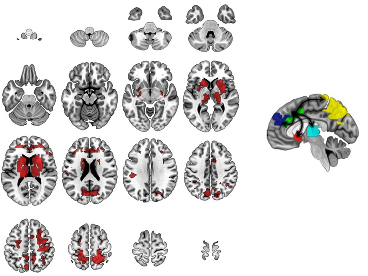
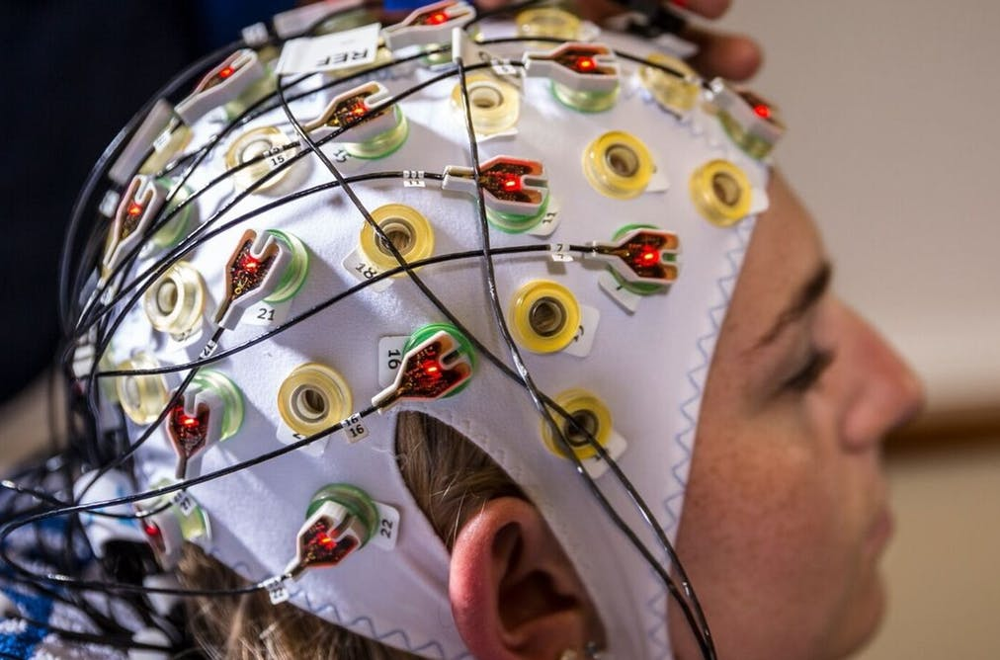

How seeing problems in the brain makes stigma disappear

#   ** How seeing problems in the brain makes stigma disappear **

 October 20, 2017 2.14am BST
 .

A pair of identical twins. The one on the right has OCD, while the one on the left does not. Brain Imaging Research Division, Wayne State University School of Medicine, [CC BY-SA](http://creativecommons.org/licenses/by-sa/4.0/)

 .
 .

### Author

1.   [   David Rosenberg](https://theconversation.com/profiles/david-rosenberg-407809)

Professor, Psychiatry and Neuroscience, Wayne State University

### Disclosure statement

David Rosenberg receives funding from the Children’s Hospital of Michigan Foundation, Detroit, MI, and a grant from the National Institute of Mental Health (R01MH59299).

### Partners

 

[Wayne State University](https://theconversation.com/institutions/wayne-state-university-989) provides funding as a member of The Conversation US.

The Conversation UK receives funding from Hefce, Hefcw, SAGE, SFC, RCUK, The Nuffield Foundation, The Ogden Trust, The Royal Society, The Wellcome Trust, Esmée Fairbairn Foundation and The Alliance for Useful Evidence, as well as sixty five university members.

[**View the full list**](https://theconversation.com/uk/partners)

 [Republish this article](https://theconversation.com/how-seeing-problems-in-the-brain-makes-stigma-disappear-83946?utm_source=nextdraft&utm_medium=email#republish)

  Republish our articles for free, online or in print, under Creative Commons licence.

- [**  Email](https://theconversation.com/how-seeing-problems-in-the-brain-makes-stigma-disappear-83946?utm_source=nextdraft&utm_medium=emailmailto:?subject=How%20seeing%20problems%20in%20the%20brain%20makes%20stigma%20disappear%20%E2%80%94%20The%20Conversation&body=Hi.%20I%20found%20an%20article%20that%20you%20might%20like%3A%20%22How%20seeing%20problems%20in%20the%20brain%20makes%20stigma%20disappear%22%20%E2%80%94%20http%3A%2F%2Ftheconversation.com%2Fhow-seeing-problems-in-the-brain-makes-stigma-disappear-83946)

- [**  Twitter](http://twitter.com/intent/tweet?text=How+seeing+problems+in+the+brain+makes+stigma+disappear&url=http%3A%2F%2Ftheconversation.com%2Fhow-seeing-problems-in-the-brain-makes-stigma-disappear-83946%3Futm_source%3Dtwitter%26utm_medium%3Dtwitterbutton&utm_campaign=none&via=ConversationUS)42

- [**  Facebook](http://www.facebook.com/sharer.php?u=http%3A%2F%2Ftheconversation.com%2Fhow-seeing-problems-in-the-brain-makes-stigma-disappear-83946%3Futm_source%3Dfacebook%26utm_medium%3Dfacebookbutton)268

- [**  LinkedIn](http://www.linkedin.com/shareArticle?mini=true&source=The+Conversation&summary=As+a+psychiatrist%2C+I+find+that+one+of+the+hardest+parts+of+my+job+is+telling+parents+and+their+children+that+they+are+not+to+blame+for+their+illness.%0A%0AChildren+with+emotional+and+behavioral+problem...&title=How+seeing+problems+in+the+brain+makes+stigma+disappear&url=http%3A%2F%2Ftheconversation.com%2Fhow-seeing-problems-in-the-brain-makes-stigma-disappear-83946%3Futm_source%3Dlinkedin%26utm_medium%3Dlinkedinbutton)20

- [** Print](https://theconversation.com/how-seeing-problems-in-the-brain-makes-stigma-disappear-83946?utm_source=nextdraft&utm_medium=email#)

As a psychiatrist, I find that one of the hardest parts of my job is telling parents and their children that they are not to blame for their illness.

Children with emotional and behavioral problems continue to suffer considerable stigma. Many in the medical community refer to them as “diagnostic and therapeutic orphans.” Unfortunately, for many, access to high-quality mental health care remains elusive.

An accurate diagnosis is the best way to tell whether or not someone will [respond well to treatment](http://dx.doi.org/10.1002/9781119958338), though that can be far more complicated than it sounds.

I have written three textbooks about using medication in children and adolescents with emotional and behavioral problems. I know that this is never a decision to take lightly.

But there’s reason for hope. While not medically able to diagnose any psychiatric condition, dramatic advances in brain imaging, genetics and other technologies are helping us objectively identify mental illness.

## Knowing the signs of sadness

All of us experience occasional sadness and anxiety, but persistent problems may be a sign of a deeper issue. Ongoing issues with sleeping, eating, weight, school and pathologic self-doubt may be signs of [depression, anxiety or obsessive-compulsive disorder](http://dsm.psychiatryonline.org/doi/book/10.1176/appi.books.9780890425596).

Separating out normal behavior from problematic behavior can be challenging. Emotional and behavior problems can also vary with age. For example, depression in pre-adolescent children [occurs equally in boys and girls](http://dx.doi.org/10.1111/j.1469-7610.1993.tb01094.x). During adolescence, however, depression rates increase much [more dramatically in girls](http://dx.doi.org/10.1177/0743558400154003) than in boys.

It can be very hard for people to accept that they – or their family member – are not to blame for their mental illness. That’s partly because there are no current objective markers of psychiatric illness, making it difficult to pin down. Imagine diagnosing and treating cancer based on history alone. Inconceivable! But that is exactly what mental health professionals do every day. This can make it harder for parents and their children to accept that they don’t have control over the situation.

Fortunately, there are now excellent [online tools](https://adaa.org/living-with-anxiety/ask-and-learn/screenings) that can help parents and their children screen for [common mental health issues](https://www.nimh.nih.gov/health/topics/index.shtml) such as depression, anxiety, panic disorder and more.

Most important of all is making sure your child is assessed by a licensed mental health professional experienced in diagnosing and treating children. This is particularly important when medications that affect the child’s brain are being considered.

# Seeing the problem

Thanks to recent developments in genetics, neuroimaging and the science of mental health, it’s becoming easier to characterize patients. New technologies may also make it easier to predict who is more likely to respond to a particular treatment or experience side effects from medication.

Our laboratory has used brain MRI studies to help unlock the underlying anatomy, chemistry and physiology underlying OCD. This repetitive, ritualistic illness – while sometimes used among laypeople to describe someone who is uptight – is actually a serious and often devastating behavioral illness that can paralyze children and their families.

 

 In children with OCD, the brain’s arousal center, the anterior cingulate cortex, is ‘hijacked.’ This causes critical brain networks to stop working properly.  [Image adapted from Diwadkar VA, Burgess A, Hong E, Rix C, Arnold PD, Hanna GL, Rosenberg DR. Dysfunctional activation and brain network profiles in youth with Obsessive-Compulsive Disorder: A focus on the dorsal anterior cingulate during working memory. Frontiers in Human Neuroscience. 2015; 9: 1-11.](https://www.frontiersin.org/files/Articles/126375/fnhum-09-00149-HTML/image_m/fnhum-09-00149-g001.jpg), [CC BY-SA](http://creativecommons.org/licenses/by-sa/4.0/)

 .

Through sophisticated, high-field brain imaging techniques – such as fMRI and magnetic resonance spectroscopy – that have become available recently, we can actually measure the child brain to [see malfunctioning areas](https://doi.org/10.3389/fnhum.2015.00149).

We have found, for example, that children 8 to 19 years old with OCD never get the “[all clear signal](http://dx.doi.org/10.1016/j.pscychresns.2016.12.005)” from a part of the brain called the anterior cingulate cortex. This signal is essential to feeling safe and secure. That’s why, for example, people with OCD may continue checking that the door is locked or repeatedly wash their hands. They have striking brain abnormalities that appear to normalize with effective treatment.

We have also begun a pilot study with a pair of identical twins. One has OCD and the other does not. We found brain abnormalities in the affected twin, but not in the unaffected twin. Further study is clearly warranted, but the results fit the pattern we have found in larger studies of children with OCD before and after treatment as compared to children without OCD.

Exciting brain MRI and genetic findings are also being reported in childhood [depression](http://dx.doi.org/10.1093/med/9780195398212.003.0009), [non-OCD anxiety](http://dx.doi.org/10.1016/j.psc.2009.05.004), [bipolar disorder](http://dx.doi.org/10.1002/9780470479216.corpsy0595), [ADHD](http://dx.doi.org/10.1002/ajmg.b.32542) and [schizophrenia](http://dx.doi.org/10.1016/j.chc.2013.06.004), among others.

Meanwhile, the field of psychiatry continues to grow. For example, [new techniques](http://dx.doi.org/10.1016/j.jaac.2009.12.022) may soon be able to identify children at increased genetic risk for psychiatric illnesses such as [bipolar disorder](http://dx.doi.org/10.3389/fpsyt.2014.00050) and [schizophrenia](http://dx.doi.org/10.3389/fpsyt.2014.00071).

New, more sophisticated brain imaging and genetics technology actually allows doctors and scientists to see what is going on in a child’s brain and genes. For example, by using MRI, our laboratory discovered that the [brain chemical glutamate](http://dx.doi.org/10.1097/00004583-200009000-00008), which serves as the brain’s “light switch,” plays a [critical role](https://dx.doi.org/10.1521/capn.2010.15.6.6) in childhood OCD.

# What a scan means

When I show families their child’s MRI brain scans, they often tell me they are relieved and reassured to “be able to see it.”

Children with mental illness continue to face enormous stigma. Often when they are hospitalized, families are frightened that others may find out. They may hesitate to let schools, employers or coaches know about a child’s mental illness. They often fear that other parents will not want to let their children spend too much time with a child who has been labeled mentally ill. Terms like “psycho” or “going mental” remain part of our everyday language.

The example I like to give is epilepsy. Epilepsy once had [all the stigma](https://www.theguardian.com/books/2016/aug/13/i-willed-him-to-wake-up-epilepsy-in-art-and-in-life) that mental illness today has. In the Middle Ages, one was considered to be possessed by the devil. Then, more advanced thinking said that people with epilepsy were crazy. Who else would shake all over their body or urinate and defecate on themselves but a crazy person? Many patients with epilepsy were locked in lunatic asylums.

Then in 1924, [psychiatrist Hans Berger](https://www.ncbi.nlm.nih.gov/pubmed/16334737) discovered something called the electroencephalogram (EEG). This showed that epilepsy was caused by electrical abnormalities in the brain. The specific location of these abnormalities dictated not only the diagnosis but the appropriate treatment.

That is the goal of modern biological psychiatry: to unlock the mysteries of the brain’s chemistry, physiology and structure. This can help better diagnose and precisely treat childhood onset mental illness. Knowledge heals, informs and defeats ignorance and stigma every time.

 **

- [Children](https://theconversation.com/topics/children-10)

- [Mental health](https://theconversation.com/topics/mental-health-343)

- [Depression](https://theconversation.com/topics/depression-669)

- [Teenagers](https://theconversation.com/topics/teenagers-698)

- [Brain imaging](https://theconversation.com/topics/brain-imaging-1109)

- [Epilepsy](https://theconversation.com/topics/epilepsy-3271)

- [OCD](https://theconversation.com/topics/ocd-3624)

- [mental health stigma](https://theconversation.com/topics/mental-health-stigma-20209)

- [children's health](https://theconversation.com/topics/childrens-health-33390)

 .

- [**  Tweet](http://twitter.com/intent/tweet?text=How+seeing+problems+in+the+brain+makes+stigma+disappear&url=http%3A%2F%2Ftheconversation.com%2Fhow-seeing-problems-in-the-brain-makes-stigma-disappear-83946%3Futm_source%3Dtwitter%26utm_medium%3Dtwitterbutton&utm_campaign=none&via=ConversationUS)

- [**  Share](http://www.facebook.com/sharer.php?u=http%3A%2F%2Ftheconversation.com%2Fhow-seeing-problems-in-the-brain-makes-stigma-disappear-83946%3Futm_source%3Dfacebook%26utm_medium%3Dfacebookbutton)

- [**  Get newsletter](https://theconversation.com/uk/newsletter)

## Help combat alt-facts and fake news and donate to independent journalism. Tax deductible.

 [Make a donation](https://donate.theconversation.com/uk?utm_source=theconversation.com&utm_medium=website&utm_campaign=content-donation-call-to-action-4)

 .

### You might also like

   .

## [How the stoicism of Roman philosophers can help us deal with depression](https://theconversation.com/how-the-stoicism-of-roman-philosophers-can-help-us-deal-with-depression-75593)

   .

## [What can be done to improve treatment for PTSD after a loss](https://theconversation.com/what-can-be-done-to-improve-treatment-for-ptsd-after-a-loss-84453)

   .

## [Melding mind and machine: How close are we?](https://theconversation.com/melding-mind-and-machine-how-close-are-we-75589)

   .

## [The real reason some people become addicted to drugs](https://theconversation.com/the-real-reason-some-people-become-addicted-to-drugs-81004)

 .

 .