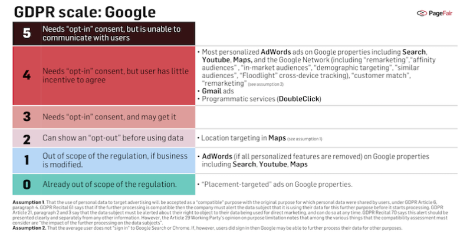
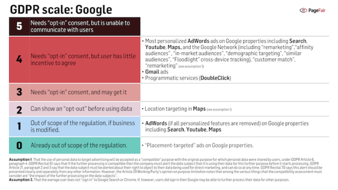
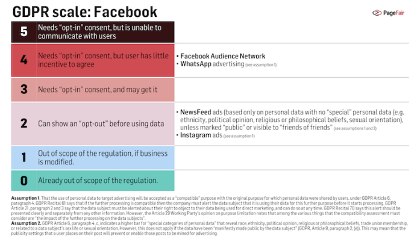

How the GDPR will disrupt Google and Facebook



# How the GDPR will disrupt Google and Facebook

** Dr Johnny Ryan/** August 30, 2017

*Google and Facebook will be disrupted by the new [European data protection rules](https://pagefair.com/datapolicydocs/#analysis) that are due to apply in May 2018. This note explains how. *

Google and Facebook will be unable to use the personal data they hold for advertising purposes without user permission. This is an acute challenge because, contrary to what some commentators have assumed, they cannot use a “service-wide” opt-in for everything. Nor can they deny access to their services to users who refuse to opt-in to tracking.[[1]](https://pagefair.com/blog/2017/gdpr_risk_to_the_duopoly/#_ftn1) Some parts of their businesses are likely to be disrupted more than others.

## The GDPR Scale

When one uses Google or Facebook.com one willingly discloses personal data. These businesses have the right to process these data to provide their services when one asks them to. However, the application of the GDPR will prevent them from using these personal data for any further purpose unless the user permits. The GDPR applies the principle of “purpose limitation”, under which personal data must only be “collected for specified, explicit and legitimate purposes and not further processed in a manner that is incompatible with those purposes”.[[2]](https://pagefair.com/blog/2017/gdpr_risk_to_the_duopoly/#_ftn1)

Google and Facebook cannot confront their users with broad, non-specific, consent requests that cover the entire breadth of their activities. Data protection regulators across the EU have made clear what they expect:

> open-quote

> “A purpose that is vague or general, such as for instance ‘Improving users’ experience’, ‘marketing purposes’, or ‘future research’ will – without further detail – usually not meet the criteria of being ‘specific’”.> [> [3]](https://pagefair.com/blog/2017/gdpr_risk_to_the_duopoly/#_ftn9)

A business cannot, for example, collect more data for a purpose than it needs and then retroactively ask to use those data for additional purposes.[[4]](https://pagefair.com/blog/2017/gdpr_risk_to_the_duopoly/#_ftn10)

It will be necessary to ask for consent, or present an opt-out choice, at different times, and for different things. This creates varying levels of risk. We estimate these risks on the “GDPR scale”, shown below.

The scale ranges from zero to five. Five, at the high end of the scale, describes the circumstances that many adtech companies that have no direct relationship with Internet users will find themselves in. They need to get the consent of the people whose data they rely on. But they have no channel of communication through which they can do so.

Four, next highest on the scale, refers to companies that have direct relationships with users, and can use this to ask for consent. However, users have little incentive to “opt-in” to being tracked for advertising. Whereas a user might opt-in to some form of profiling that comes with tangible benefits, such as a loyalty scheme, the same user might not be willing to opt-in to more extensive profiling that yields no benefit. The extensiveness of the profiling is important because, as the note at the [bottom of this page](https://pagefair.com/blog/2017/gdpr_risk_to_the_duopoly/#consent_notice_items) shows, users will be aware of the uses of their data when consent is sought. Thus adtech tracking across the web might rank as four, but a loyalty scheme might rank as three on the GDPR scale.

A slightly more attractive prospect, from Google and Facebook’s perspective, is to inform a user about what they want to do with the personal data, and give the user a chance to “opt-out” beforehand.[[5]](https://pagefair.com/wp-admin/post.php?post=30367&action=edit#_ftn5) This is two on the scale. This opt-out approach has the benefit – from the company’s perspective – that some users’ inaction may allow their data to be used. The GDPR permits the opt-out approach when the purposes that the companies want to use the data for are “compatible” with the original purpose for which personal data were shared by users.[[6]](https://pagefair.com/blog/2017/gdpr_risk_to_the_duopoly/#_ftn6) In addition to the opt-out notice, users also have to be told of their right to object at any time to the use of their data for direct marketing.[[7]](https://pagefair.com/blog/2017/gdpr_risk_to_the_duopoly/#_ftn7)

One on the scale refers to activities that currently involve the processing of personal data, but that do not need to do so. With modification, these activities could be put beyond the scope of the Regulation.

Activities at the zero end of the scale are outside the scope of the Regulation, because they use no personal data.

#### Google

Our estimate of Google, when applied to this scale, shows a significant range of products at four on the scale, with the proviso that some part of that set of products can be modified, which would lower their score from four to one.[Download PDF](https://pagefair.com/wp-content/uploads/2017/08/GDPR-scale-Google-Facebook.pdf)

All personalized[[8]](https://pagefair.com/blog/2017/gdpr_risk_to_the_duopoly/#_ftn8) advertising on Google sites such as Search, Youtube, Maps, and the websites where Google provides advertising is scored four because it will require that users opt-in to extensive tracking.

If, however, users have already “signed in” to Google Search or Chrome, Google may argue that the purpose of these technologies is “compatible” with purposes users agreed to, and hope to use an opt-out rather than an opt-in. Whether this would be successful, however, remains to be seen.

The technologies that will be affected include:

- Certain targeting features of AdWords such as “remarketing”,[[9]](https://pagefair.com/blog/2017/gdpr_risk_to_the_duopoly/#_ftn9) “affinity audiences”,[[10]](https://pagefair.com/blog/2017/gdpr_risk_to_the_duopoly/#_ftn10) “custom affinity audiences”,[[11]](https://pagefair.com/blog/2017/gdpr_risk_to_the_duopoly/#_ftn11) “in-market audiences”,[[12]](https://pagefair.com/blog/2017/gdpr_risk_to_the_duopoly/#_ftn12) “similar audiences”,[[13]](https://pagefair.com/blog/2017/gdpr_risk_to_the_duopoly/#_ftn13) “demographic targeting”,[[14]](https://pagefair.com/blog/2017/gdpr_risk_to_the_duopoly/#_ftn14) “Floodlight” cross-device tracking.[[15]](https://pagefair.com/blog/2017/gdpr_risk_to_the_duopoly/#_ftn15)
- “Customer Match”, which targets users and similar users based on personal data contributed by an advertisers.[[16]](https://pagefair.com/blog/2017/gdpr_risk_to_the_duopoly/#_ftn16) A prospect would have had to give their consent to the advertiser for this to occur.
- “Remarketing lists for search ads (RLSA)”, retargeting from site visitors by using Google Analytics, is likely to be prevented by the ePR.[[20]](https://pagefair.com/blog/2017/gdpr_risk_to_the_duopoly/#_ftn17)

Gmail, the most popular e-mail service in the world, will also be affected. Google mines the content and metadata of each email message sent and received in Gmail to target advertising. This could not have continued under the GDPR and ePR without each sender and recipient giving their consent. Clearly, few would do so, and Gmail is at four on the scale. This may be the real reason, or at least a contributing reason, why Google has recently announced that it will stop mining people’s emails for ads.[[21]](https://pagefair.com/blog/2017/gdpr_risk_to_the_duopoly/#_ftn21)

In addition, “programmatic” advertising services that Google provides to advertisers and publishers under its DoubleClick business will be affected. Operating these under the GDPR would require not only that a user consents to Google’s use of data for advertising targeting purposes, but to the [many other companies such as DMPs (data management platforms), DSPs (demand side platforms), and so forth](https://pagefair.com/data-leakage-in-online-behavioural-advertising/) processing these data too. The DoubleClick business is therefore at four on the scale.

At two on the scale is “location targeting”,[[22]](https://pagefair.com/blog/2017/gdpr_risk_to_the_duopoly/#_ftn22) and “location extensions”, technologies in Google Maps that enable advertising to target users based on geographical proximity. This score, however, is based on the assumption that advertising in map search results is accepted as a compatible purpose with the original purpose for which location data were shared by users.

Google’s AdWords product has the benefit that it can be modified to operate entirely outside the scope of the GDPR and ePR. This is why it appears at four on the scale, and at one. If Google discards personalized targeting features from AdWords, then it can continue to target advertisements to people based on what they search for.

Finally, at zero on the scale is Google’s “placement-targeted” advertisements.[[23]](https://pagefair.com/blog/2017/gdpr_risk_to_the_duopoly/#_ftn23) These target only by the context of the pages they appear on, rather than by using personal data. Therefore they are out of scope of the GDPR.

#### Facebook

Significant parts of Facebook’s business are at two and four on the scale.[Download PDF](https://pagefair.com/wp-content/uploads/2017/08/GDPR-scale-Google-Facebook.pdf)

The Facebook Audience Network is scored four because it requires the processing of personal data from Facebook users to target them on other websites. It is unlikely that this will be regarded as a compatible use. If it is, Facebook will have to convince users not to opt-out.

WhatsApp advertising is also scored four on the scale because it will be necessary for users to give their consent (an opt-in, rather than an opt-out) for their personal data on WhatsApp to be processed for purposes unrelated to WhatsApp functionality on Facebook properties other than WhatsApp.[[24]](https://pagefair.com/wp-admin/post.php?post=30367&action=edit#_ftn24)

Farther down the scale, at two, is Facebook’s Newsfeed, which may be able to use an opt-out approach to get some users to permit the processing of these personal data.

However, the nature of the content in the Newsfeed may limit the range of data it can process. Any information that reveals a person’s race, ethnicity, political opinion, religious or philosophical beliefs, trade union membership, or are related to a person’s sex life or sexual orientation are in “special categories of data”. These cannot be used without explicit consent, or unless they have been “manifestly made public by the data subject”.[[25]](https://pagefair.com/blog/2017/gdpr_risk_to_the_duopoly/#_ftn25) Facebook may not be able to mine some posts in the Newsfeed that are not marked “public” (or, perhaps, “friends of friends”[[26]](https://pagefair.com/blog/2017/gdpr_risk_to_the_duopoly/#_ftn26)). It may even be that the determination of which posts are “special categories” of data, and which are not, may itself be processing that goes to far.

The use of personal data from Instagram for advertising on Instagram may accepted as a compatible purpose, and enable Instagram to use an opt-out notice rather than request an opt-in.

#### **Conclusion **

Both Google and Facebook have direct relationships with their users, and have a well thought out design for their current privacy requests. However, they are not immune to disruption when the new regulations apply. Indeed, some parts of their businesses may be particularly susceptible to them. While they can process personal data necessary to provide services that their users request, using these data for any other purpose requires user-permission, or inaction, in the case of out-outs. The critical question for both businesses is whether users will click “yes”, when asked to consent.

#### PageFair Research

We are surveying sample industry-insiders’ insights into this question. Your shared insights may illuminate this issue. Please click the button below to take the survey.

[70 second survey](https://docs.google.com/forms/d/e/1FAIpQLSfTiphQfdMtZXpXvhQoeLkmRX6d3HST71Q7KXwmhj3-zhaGxg/viewform?entry.74111772=not_applicable)

We have designed the survey to take 70 seconds to complete. Thank you for your input – we will share the results.

# Notes

[[1]](https://pagefair.com/blog/2017/gdpr_risk_to_the_duopoly/#_ftnref1) Regulation (EU) 2016/679 of the European Parliament and of the Council of 27 April 2016 on the protection of natural persons with regard to the processing of personal data and on the free movement of such data, and repealing Directive 95/46/EC (General Data Protection Regulation) [2016] OJ L119/1. See Recital 42’s reference to “without detriment”, Recital 43’s discussion of “freely given” consent, and Article 7(2) prohibition of conditionality. See also the UK Information Commissioner’s Office’s draft guidance on consent, 31 March 2017, p. 21, which clearly prohibits so-called “tracking walls”.

[[2]](https://pagefair.com/blog/2017/gdpr_risk_to_the_duopoly/#_ftnref1) The GDPR, Article 5, paragraph 1, b.

[[3]](https://pagefair.com/blog/2017/gdpr_risk_to_the_duopoly/#_ftnref3) Article 29 Working Party, Opinion 03/2013 on purpose limitation, 2 April 2013, p. 16. This is evident in GDPR, Article 13, paragraph 1, c.

[[4]](https://pagefair.com/blog/2017/gdpr_risk_to_the_duopoly/#_ftnref4) The GDPR, Recital 32 notes that “When the processing has multiple purposes, consent should be given for all of them”. Recital 39 notes that “specific purposes for which personal data are processed should be explicit and legitimate and determined at the time of the collection of the personal data. The personal data should be adequate, relevant and limited to what is necessary for the purposes for which they are processed. This requires, in particular, ensuring that the period for which the personal data are stored is limited to a strict minimum”.

[[5]](https://pagefair.com/blog/2017/gdpr_risk_to_the_duopoly/#_ftnref5) ibid., Recital 61.

[[6]](https://pagefair.com/blog/2017/gdpr_risk_to_the_duopoly/#_ftnref6) ibid., Article 6, paragraph 4, and Recital 50.

The Article 29 Working Party has provided some guidance on how one should determine whether purposes are compatible. Among the issues to consider are “the impact of the further processing on the data subjects”. Article 29 Working Party, Opinion 03/2013 on purpose limitation, 2 April 2013, p. 3.

This may be a challenge for social platforms. Facebook, for example, was the subject of a scandal in May and April 2017 when a document leaked from its Australian business that described its capabilities to identify “moments when young people need a confidence boost”, or feel “worthless” or “insecure”, for marketing purposes. “Facebook targets insecure young people to sell ads”, The Australian, 1 May 2017 (URL: http://www.theaustralian.com.au/business/media/digital/facebook-targets-insecure-young-people-to-sell-ads/news-story/a89949ad016eee7d7a61c3c30c909fa6); see Facebook’s reply of 30 April 2017 (URL: https://newsroom.fb.com/news/h/comments-on-research-and-ad-targeting/).

[[7]](https://pagefair.com/blog/2017/gdpr_risk_to_the_duopoly/#_ftnref7) The GDPR, Article 21, paragraph 2 and 3; see also Recital 70 on the manner in which the user is to be informed of this right.

[[8]](https://pagefair.com/blog/2017/gdpr_risk_to_the_duopoly/#_ftnref8) “Personalized advertising”, Google Advertising Policies Help, (URL: https://support.google.com/adwordspolicy/answer/143465?hl=en). Note that even users who are not signed out receive personalised search results, as described in Brian Horling and Matthew Kulick, “Personalized Search for everyone”, 4 December 2009, Google Blog (URL: https://googleblog.blogspot.ie/2009/12/personalized-search-for-everyone.html).

[[9]](https://pagefair.com/blog/2017/gdpr_risk_to_the_duopoly/#_ftnref9) “About remarketing lists for search ads”, Google AdWords Help, (URL: https://support.google.com/adwords/answer/2701222?hl=en).

[[10]](https://pagefair.com/blog/2017/gdpr_risk_to_the_duopoly/#_ftnref10) According to Google, this is “based on their specific interests as they browse pages, apps, channels, videos, and content across YouTube and the Google Display Network as well as on YouTube search results”. See “About targeting your ads by audience interests”, Google AdWords Help, (URL:https://support.google.com/adwords/answer/2497941?hl=en).

[[11]](https://pagefair.com/blog/2017/gdpr_risk_to_the_duopoly/#_ftnref11) “About targeting your ads by audience interests”, Google AdWords Help (URL: https://support.google.com/adwords/answer/2497941?hl=en)

[[12]](https://pagefair.com/blog/2017/gdpr_risk_to_the_duopoly/#_ftnref12) “In-Market Audiences”, Think with Google (URL: https://www.thinkwithgoogle.com/products/in-market-audiences/).

[[13]](https://pagefair.com/blog/2017/gdpr_risk_to_the_duopoly/#_ftnref13) “AdWords looks at browsing activity on Display Network sites over the last 30 days, and uses this, along with its contextual engine, to understand the shared interests and characteristics of the people in your remarketing list.” “About similar audiences on the Display Network”, Google AdWords Help (URL: https://support.google.com/adwords/answer/2676774?hl=en).

[[14]](https://pagefair.com/blog/2017/gdpr_risk_to_the_duopoly/#_ftnref14) “When people are signed in from their Google Account, we may use demographics derived from their settings or activity on Google properties, depending on their account status”, “About demographic targeting”, AdWords Help (URL: https://support.google.com/adwords/answer/2580383?co=ADWORDS.IsAWNCustomer%3Dfalse&hl=en).

[[15]](https://pagefair.com/blog/2017/gdpr_risk_to_the_duopoly/#_ftnref15) “About Floodlight”, DoubleClick Digital Marketing Partners Help https://support.google.com/dcm/partner/answer/4304205?hl=en&ref_topic=4241549.

[[16]](https://pagefair.com/blog/2017/gdpr_risk_to_the_duopoly/#_ftnref16) “About Customer Match”, Google AdWords Help (URL: https://support.google.com/adwords/answer/6379332?hl=en).

[[17]](https://pagefair.com/blog/2017/gdpr_risk_to_the_duopoly/#_ftnref17) “About remarketing lists for search ads”, Google AdWords Help (URL: https://support.google.com/adwords/answer/2701222?hl=en).

[[21]](https://pagefair.com/blog/2017/gdpr_risk_to_the_duopoly/#_ftnref21) “Consumer Gmail content will not be used or scanned for any ads personalization after this change.” Diane Greene, 23 June 2017 (URL: https://www.blog.google/products/gmail/g-suite-gains-traction-in-the-enterprise-g-suites-gmail-and-consumer-gmail-to-more-closely-align/).

[[22]](https://pagefair.com/blog/2017/gdpr_risk_to_the_duopoly/#_ftnref22) “Target customers near an address with location extensions”, Google AdWords Help (URL:https://support.google.com/adwords/answer/2914785?hl=en&ref_topic=3119074).

[[23]](https://pagefair.com/blog/2017/gdpr_risk_to_the_duopoly/#_ftnref23) “Add, edit, and remove managed placements”, Google AdWords Help (URL: [https://support.google.com/adwords/answer/2471182)](https://support.google.com/adwords/answer/2471182).

[[24]](https://pagefair.com/wp-admin/post.php?post=30367&action=edit#_ftnref24) See the recent correspondence between the Irish regulator and Facebook “Data Protection Commissioner’s Statement on the Frequently Asked Questions published by WhatsApp”, 16 August 2017 (URL: https://www.dataprotection.ie/documents/press/16-08-17_whatapp_DPC_Statement.pdf).

[[25]](https://pagefair.com/blog/2017/gdpr_risk_to_the_duopoly/#_ftnref25) The prohibition is in the GDPR, Article 9. See also Article 6, paragraph 4, c. The exception is Article 9, paragraph 2, e. See also Recital 71.

[[26]](https://pagefair.com/blog/2017/gdpr_risk_to_the_duopoly/#_ftnref26) An average user has 40,000 friends of friends, though the 99th percentile has 800,000. See Lars Backstrom, “People you may know”, 12 July 2010 (URL: [www.graphanalysis.org/SIAM-AN10/01_Backstrom.pdf)](http://www.graphanalysis.org/SIAM-AN10/01_Backstrom.pdf)).

###### Consent Notice Items

*Businesses will have to provide the following information to internet users when seeking their consent.*

- *Who is collecting the data, and how to contact them or their European representative. *
- *What the personal information are being used for, and the legal basis of the data processing.*
- *The “legitimate interest” of the user of the data (This refers to a legal basis that may be used by direct marketing companies).*
- *With whom the data will be shared.*
- *Whether the controller intends to transfer data to a third country, and if so has the European Commission deemed this country’s protections adequate or what alternative safeguards or rules are in place.*
- *The duration of storage, or the criteria used to determine duration.*
- *That the user has the right to request rectification to mistakes in this personal information.*
- *That the user has the right to withdraw consent.*
- *How the user can lodge a complaint with the supervisory authority.*
- *What the consequences of not giving consent might be.*
- *In cases of automated decision-making, including profiling, what the logic of this process is, and what the significance of the outcomes may be.*

 [Share on Twitter](https://twitter.com/intent/tweet?text=How+the+GDPR+will+disrupt+Google+and+Facebook+-+https%3A%2F%2Fpagefair.com%2Fblog%2F2017%2Fgdpr_risk_to_the_duopoly%2F+via+%40pagefair)  [Share on Facebook](https://www.facebook.com/sharer/sharer.php?u=https://pagefair.com/blog/2017/gdpr_risk_to_the_duopoly/)

Dr Johnny Ryan

Head of Ecosystem at [PageFair](http://www.pagefair.com/). Author of [*A History of the Internet and the Digital Future*](http://www.amazon.com/A-History-Internet-Digital-Future/dp/1780231121). Previously Chief Innovation Officer of The Irish Times. **[Read full biography and press clips.](http://www.pagefair.com/drjohnnyryan/)**

 [@johnnyryan](https://www.twitter.com/@johnnyryan)