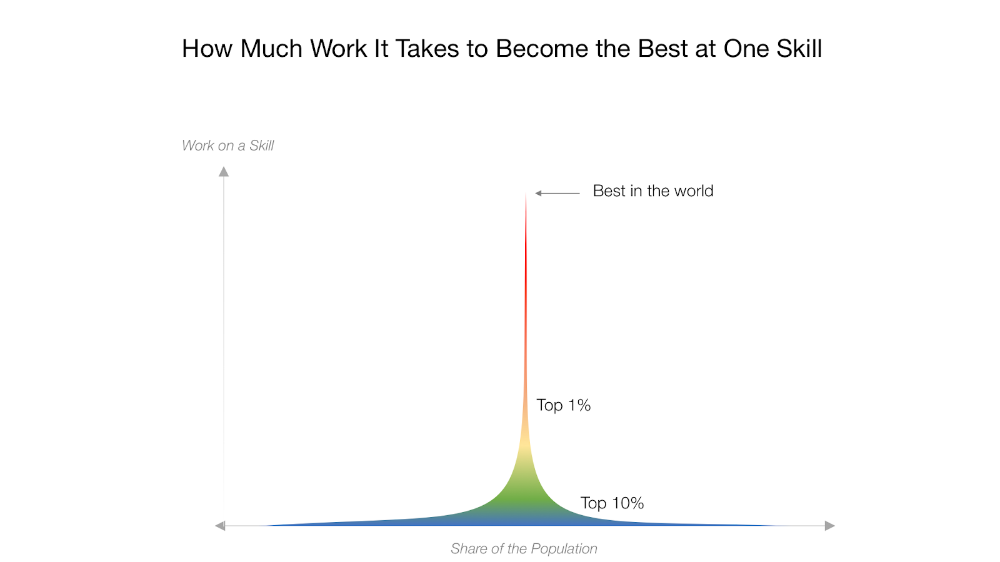
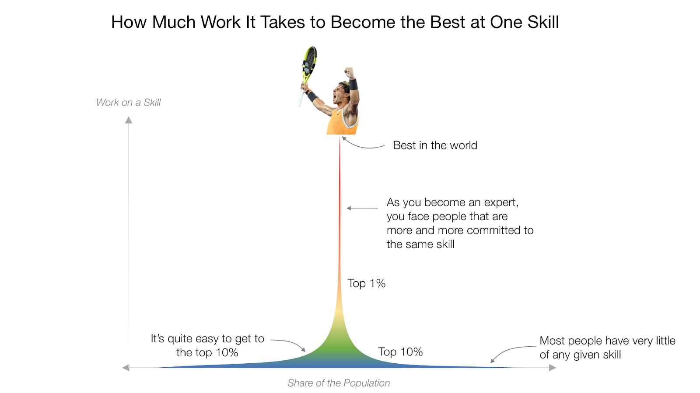
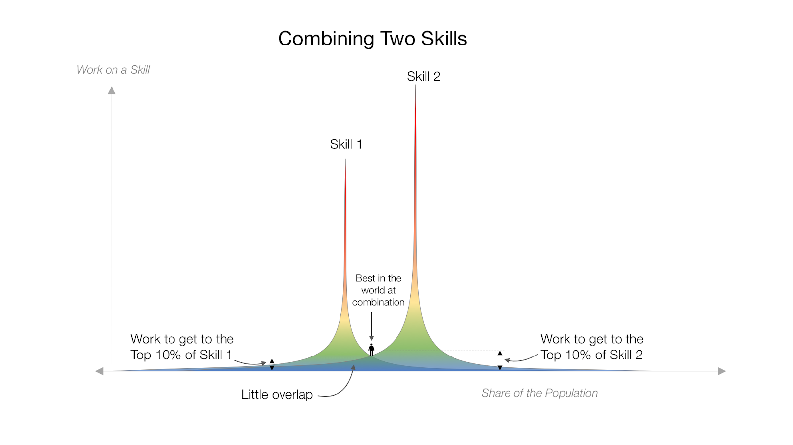
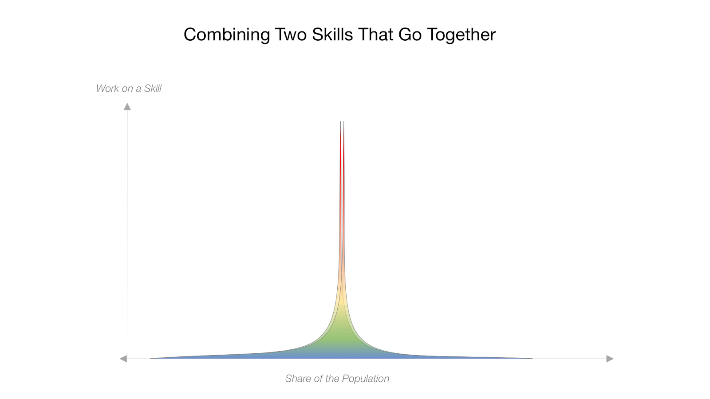
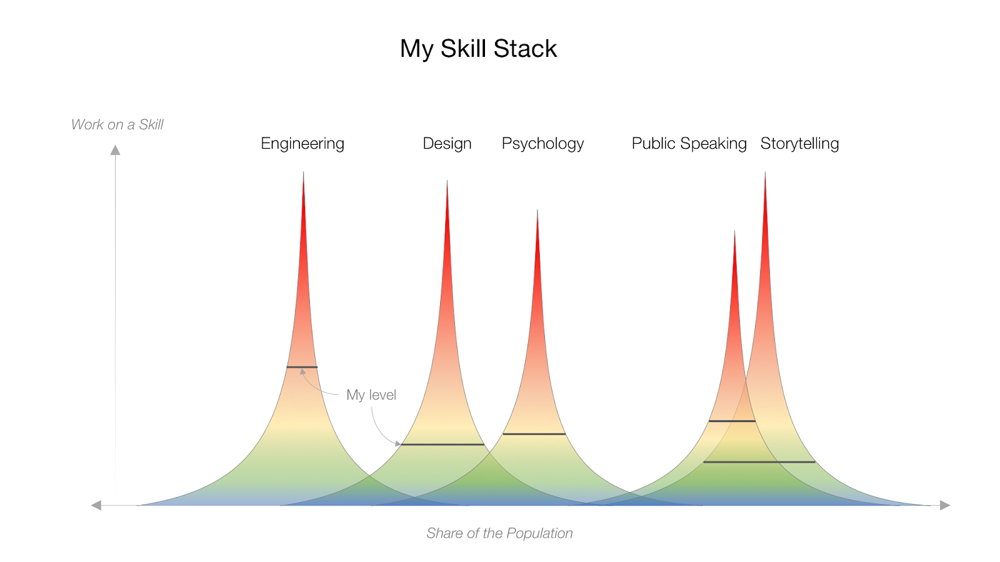
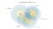
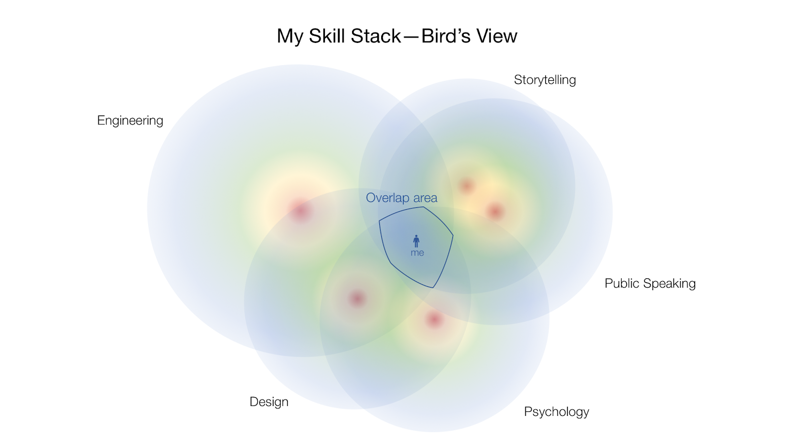

How to Become the Best in the World at Something - Forge

# How to Become the Best in the World at Something

## With skill stacking, you don’t need to be at the top to be extraordinary

[Tomas Pueyo](https://forge.medium.com/@tomaspueyo?source=post_page-----f1b658f93428----------------------)

[Oct 17, 2019](https://forge.medium.com/how-to-become-the-best-in-the-world-at-something-f1b658f93428?source=post_page-----f1b658f93428----------------------) · 7 min read

It’s better to have three okay tools than a single, perfect one. The axe is great at breaking obstacles, but not that useful to jump over pits. The grapple is great to jump over ice or pits, but not amazing for slaying dragons. The only way to win is by having both tools. Illustrations: Tomas Pueyo.

Consider what it takes to become an NBA player. Most of them have been honing their skills on the basketball court practically since infancy. Years of countless practices, camps, and games have helped each player develop a skill set based around shooting, ball-handling, passing, defense, and anything else that brings one success in basketball.

As you can imagine, the success rate for becoming an NBA player is remarkably low. There are 30 teams of about 15 players each, for a total of roughly 450 — not a ton of people, especially given the estimate that more than 500,000 young men play youth basketball. When you crunch the numbers, that means fewer than one in a thousand will make it to the pros.

Credit: Tomas Pueyo

So let’s be realistic. You aren’t going to make it to the NBA. You will not become the president of the United States. You will not be the world’s greatest writer, nor the top chess player, nor the most masterful public speaker. You will never be the best in the world at any given skill. There will always be someone working harder. There will always be someone with greater genetic gifts, or more luck, or both.

Most people (in the blue zone) have very little of a specific skill. A bit of work can quickly get you to the top 10% (the green zone). But as you join the elite, it becomes harder and harder to move up, because you are facing competitors who are deeply committed to that skill.

But trying to be the best at one thing isn’t the smartest path to success. Instead, you should put your effort into mastering a*  *combination*  *of skills. The solution is skill stacking, a concept popularized by [Scott Adams](https://blog.dilbert.com/2016/12/27/the-kristina-talent-stack/). Here’s how it works.

# **The basics**

Years ago, a friend of mine was about to take the GMAT. He was hoping to get into some of the top grad schools, and nailing this test was a key step in the process. His first-choice school, Stanford, would only accept the top 6% of applicants. That meant he needed to score in the 94th percentile to have a shot at getting in.

The day of the test, he was trembling. He sat in front of his computer in the test room, looking at the clock. One minute left to start. Twenty seconds. One. Begin.

> It’s easier and more effective to be in the top 10% in several different skills — your “stack” — than it is to be in the top 1% in any one skill.

After four intense hours, he finished the test. But he couldn’t rest because the results appeared almost instantly on the screen: He scored in the 90th percentile on the math portion, and in the 95th percentile on the verbal portion. “So that means I’m in the 92nd percentile?” he thought. His heart sank. Those scores wouldn’t cut it. Goodbye, Stanford.

But then, as he looked closer, he saw something else: His overall score was in the 98th percentile. What? How was this possible?

It turns out most math-minded test-takers were bad with words, and the word-loving ones couldn’t quite hack the fractions. So while my friend’s score wasn’t the best in any one section, it was among the best when these sections were considered in combination.

This is how skill stacking works. It’s easier and more effective to be in the top 10% in several different skills — your “stack” — than it is to be in the top 1% in any one skill. Take a look at this chart.

In this graph, each peak represents a skill. Getting to the top 10% (the green zone) of two skills requires much less work than becoming the best at a single one. And these two curves don’t overlap much, meaning most people who are good at one skill are not good at the other.

Let’s run some numbers on this. If your city has a million people, for example, and you belong to the top 10% of six skills, that’s 1,000,000 x 10% x 10% x 10% x 10% x 10% x 10% = 1. You’re the number one person in your city with those six skills. Bump that number up to 10 skills? Boom, you’re the best in the world at that combination of 10 skills.

Ideally, the skills would be unique, and also complementary. Imagine someone who is reasonably good at public speaking, fundraising, speech-writing, charisma, networking, social media, and persuasion. Who is this person? A successful politician. The most successful politicians don’t seem to be off-the-charts amazing at individual skills, but check off the right boxes that allow them to thrive.

This principle applies across all fields. A writer can be just about the best prose stylist there is, but probably won’t find as much success as the person who is a reasonably good prose stylist, a strong self-promoter, a pretty fast writer, an engaging public speaker, and has the interpersonal skills to connect with important people in the publishing industry.

# **Skill stackers in action**

Self-help guru [Gary Vaynerchuk](https://medium.com/u/c4ec9163657c?source=post_page-----f1b658f93428----------------------) is a great example of a skill stacker. He has 5.5 million Instagram followers, nearly 2 million Twitter followers, nearly 2 million YouTube subscribers, and an active blog that people read as if it were holy scripture. On these channels, you’ll find content that is solid but not exactly mind-blowing. The magic that sets Vaynerchuk apart is his skill stack: The fact that he’s not just a good writer but is also savvy on social media, good at public speaking, and great at personal branding is what makes him one of the top self-help gurus in his field.

The principle applies to Steve Jobs, too. At the heart of Jobs’ skill stack is a passion for design, be it fonts, packaging, or architecture. He was obsessive about the look and feel of his products. He was never the best in the world at design, but over time, he developed a keen understanding of winning design principles. He later combined his various design skills with deep insight about what people want, tech knowledge, a strategic mind, salesmanship, an ability to extract everything from his employees, and entrepreneurial skills. Together, these skills helped him form a company that was focused on advanced technology and beautiful design.

# **What is your special skill stack?**

In discovering your own skill stack, consider the combination of skills. You want them to be related in some way, but not too similar. For example, if you’re in the top 1% in journalism, also being in the top 1% in writing skills isn’t going to be a big differentiator. Most top journalists are good writers. What’s different about stacking is having skills that not only work together but also are varied enough to make you stand out.

Here, the two skills go hand in hand. Most people who master one also master the other one. It’s therefore harder to stand out than if you had two skills that are unrelated.

The best skills to choose are those that don’t tend to go together, but complement each other well. For example, engineers aren’t known to be great public speakers, so those who are have a huge professional advantage. (This is what’s called “covariance” in statistics. The math about the number of skills above assumes skills are completely independent.)

My own path to skill stacking has led me to give a [TEDx Talk](https://www.youtube.com/watch?v=VUT6GQveD0E) titled “Why Stories Captivate.”

When I was a child, my father, who worked in advertising, told me everything he knew about storytelling. I took that passion with me, reading about how to craft stories throughout my life. Later, as an engineering student, I wanted to understand how things are made. However, when reading about storytelling structure, I noticed experts just gave recipes on how to craft stories without explaining why. Thankfully, through my job designing online products, I learned a lot about psychology and experience design, which led me to connect the structure of stories with how our brains work. Finally, a decade ago, I started going to [Toastmasters](https://www.toastmasters.org/) to learn about public speaking because I was so afraid of it.

I’m one of a bunch of people in the world with enough knowledge about storytelling, design, and psychology to make a connection between all three. But of those people, only a few have an engineering mindset to deconstruct the problem. And of the very few who can do that, only a tiny fraction are good enough at public speaking to convert the theories into a TEDx Talk.

This combination of skills is quite uncommon: Usually, engineers don’t know much about design or psychology. Some designers know about psychology, but not too much. Very few of these know about public speaking and storytelling — which frequently go hand in hand.

Let’s collapse the vertical axis and look at it from above.

Even if I’m not in the yellow-red area in any of these skills, very few people overlap in all of them.

The takeaway: Stop trying to be the best at one thing. You’re setting yourself up for some serious disappointment. Instead, ask yourself: In what niche do I want to stand out? What combination of skills do I need to be unique in that niche? And am I passionate about most — or at least some — of these skills?

It’s not about being great at any one thing — you just need to be pretty good at an array of useful skills that, when combined, make you truly one of a kind.