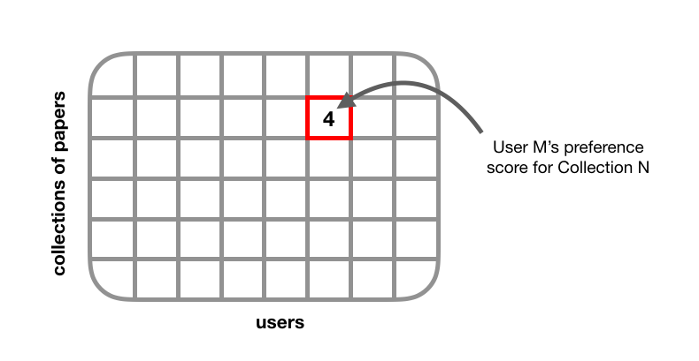
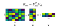
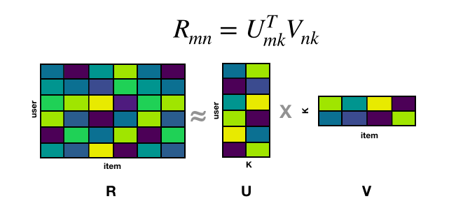
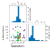
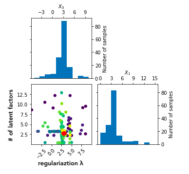
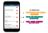
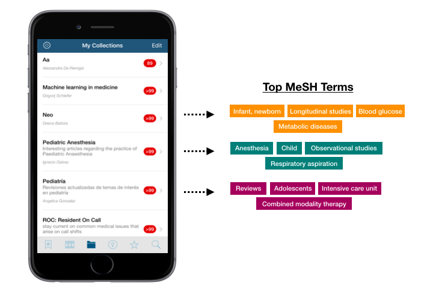

How to Build a Recommender Engine for Medical Research Papers

# How to Build a Recommender Engine for Medical Research Papers

## A step-by-step guide to building a recommender pipeline, from data wrangling to model evaluation

[Jill Cates](https://medium.com/@topspinj?source=post_page-----a9dc1bad12f2----------------------)

[Aug 16](https://medium.com/@topspinj/how-to-build-a-recommender-engine-for-medical-research-papers-a9dc1bad12f2?source=post_page-----a9dc1bad12f2----------------------) · 11 min read

In 2006, Netflix, which was then a DVD rental service, announced a data science competition for movie rating predictions. The company would offer a $1 million grand prize to the team that could improve their existing recommender system’s prediction accuracy by 10%. The competition garnered much interest from researchers and engineers in both academia and industry. Within the first year of the competition, over 40,000 teams from more than 100 countries had entered the competition [[1](https://en.wikipedia.org/wiki/Netflix_Prize#2007_Progress_Prize)].

In June 2009, the prize was awarded to BellKor’s Pragmatic Chaos, a team of AT&T engineers, who submitted the winning algorithm a few minutes earlier than the second-place team [[2](https://www.wired.com/2009/09/bellkors-pragmatic-chaos-wins-1-million-netflix-prize/)]. The paper describing their solution can be found [here](https://www.netflixprize.com/assets/GrandPrize2009_BPC_BellKor.pdf).

BellKor’s Pragmatic Chaos, the winning team of the Netflix Challenge (2009)

A decade later, recommender systems have become an active topic of research. It’s now being taught in computer science courses [[3](https://www.coursera.org/specializations/recommender-systems)] and discussed in international conferences [[4](https://recsys.acm.org/)]. A quick Google search of “recommender systems” will give you an overwhelming list of tutorials, papers, book chapters, and videos about the topic. However, much of this content focuses on the theory around recommenders, rather than practical application. This post is a step-by-step practical guide on how to build a recommender pipeline, using a case study of medical research papers.

# Overview

1. The Problem and Dataset
2. Data Pre-Processing
3. Model Selection
4. Hyperparameter Tuning
5. Model Training and Evaluation
6. Data Post-Processing

# The Problem and Dataset

In 2018, I collaborated with a team of data scientists to build a recommender system for [QxMD Read](https://qxmd.com/read-by-qxmd) — a mobile application that lets healthcare professionals stay up-to-date with the latest research in medicine. We were presented with the challenge of generating personalized recommendations for community-curated collections. A “collection” can be thought of as a Spotify “playlist” for research papers. It contains a selection of research papers hand-picked by a user of the QxMD platform.

QxMD’s “collection” is analogous to Spotify’s “playlist”

This problem was more complex than a traditional recommendation system because we were dealing with user-curated collections (i.e., playlists for papers), which could be updated at any time. We had data on which collections a user had subscribed to, and which papers a user had opened and read. While we knew when a paper was read and for how long, we did not have information on how the paper was accessed (i.e., via a collection, user’s home page, or search result). Our challenge was to identify relevant collections for users using their interaction data at the paper-level (rather than collection-level).

# **Step 1: Data Pre-Processing**

Our core recommender system was a collaborative filtering model, which requires data to be in the form of a user-item or “utility” matrix. In a utility matrix, each cell represents a user’s degree of preference towards a given item. User preference can be represented as explicit feedback (e.g., movie ratings) or implicit feedback (e.g., number of times a song was replayed). Though implicit feedback is inherently noisy, its quantity tends to outweigh the quantity of explicit feedback, which helps in building a more robust recommender system.

We were working with an implicit feedback dataset, so each cell in our utility matrix represented a user’s interaction with a given collection. This can be thought of as our response variable.

We tested different types of preference metrics such as:

- whether a user proceeded to read the full-text paper from the abstract
- whether a user shared a paper
- whether a user “favourited” a paper
- time spent reading a paper (dwell time) [[5](http://www.hongliangjie.com/publications/recsys2014.pdf)]

You can also define your own “preference score” based on what type of activity you want to optimize. If the goal is to get users to read more paper abstracts and share more frequently, you can construct a score that takes into account a user’s abstract views and sharing activity. To incorporate temporal information, you can modify for your score to give more weight to more recent interactions [[6](http://citeseerx.ist.psu.edu/viewdoc/download?doi=10.1.1.84.5471&rep=rep1&type=pdf)].

As part of our initial solution, we used number of abstract and full-text paper reads as our preference score. If a user has read many papers within a collection, we assumed that this was a strong signal of user preference. We identified outliers in our dataset as users with unusual bot-like behaviour, having thousands of “shares” and paper reads in a single day. These users were removed from the utility matrix. Our resulting utility matrix consisted of around 500,000 users and 10,000 collections, with a density of ~1%. As the matrix becomes more dense, recommendations tend to improve in quality.

# Step 2: Model Selection

We considered two different models that handle implicit feedback data: 1) Alternating Least Squares, and 2) Bayesian Personalized Ranking.

## 1. Alternating Least Squares

Alternating Least Squares (ALS) uses a technique called “matrix factorization” to generate item recommendations for a set of users [[7](http://collaborative%20filtering%20for%20implicit%20feedback%20datasets/)]. Matrix factorization involves decomposing a matrix, R, into two lower dimensional factor matrices, U and V, such that:

where “k” represents latent factors. By multiplying latent factor matrices *U* and *V*, we get a reconstructed matrix* R* with populated values representing estimated user ratings (or interaction score since we’re dealing with implicit feedback). In traditional matrix factorization, we solve for U and V simultaneously. With ALS, we fix U and compute V, then proceed to fix V and compute U. This process is repeated until the loss function converges. What makes ALS appealing is that it performs extremely well given sufficient data and it’s parallelizable, which makes it relatively inexpensive to tune hyperparameters.

## 2. Bayesian Personalized Ranking

Bayesian Personalized Ranking (BPR) uses a technique called “learning to rank” (LTR) to generate a personalized ranked list of items [[8](https://arxiv.org/pdf/1205.2618.pdf)]. LTR aims to optimize the order of a list of items. It doesn’t care as much about the predicted preference score (e.g., rating) of a given item, but rather the relative ordering among a set of items. LTR can be used in any application that involves ranking — for example, search engines, online advertising, and recommender systems. BPR is a type of LTR algorithm that was developed specifically for recommender systems that use implicit feedback. BPR is based on the assumption that a user prefers positive items (i.e., observed items) over non-observed items. The goal is to rank items in order of preference by maximizing the likelihood that user *u* prefers item *i *over item *j*. For more information on the technical implementation of BPR, check out [this paper](https://arxiv.org/pdf/1205.2618.pdf) by Rendle et al. [[8](https://arxiv.org/pdf/1205.2618.pdf)]. BPR can be implemented using matrix factorization, which means that it can be run over a distributed system like Spark [[9](https://stanford.edu/~rezab/classes/cme323/S16/projects_reports/rodrigo_oliveira.pdf)].

We ultimately chose **Alternating Least Squares** as our model for the recommender pipeline because it was 1) easier to implement, 2) computationally efficient, and 3) generated impressive results based on a smaller proof-of-concept prototype.

# Step 3: Hyperparameter Tuning

Hyperparameter tuning is a crucial step in the machine learning pipeline that seeks to optimize a model’s performance by choosing optimal hyperparameter values. As part of this step, you need to decide which evaluation metric you want to optimize. There are several evaluation metrics that can be used for recommender systems including precision@k, recall@k, and root mean squared error (RMSE). We will use precision@10, which measures the proportion of relevant items that are found in a user’s top 10 recommendations. Here, we define “relevance” as whether a user had previously interacted with a recommended item. If a user did interact with that item and it appeared in their top 10 recommendations, we assumed that this was a good indicator that the recommendation was “relevant” to the user. Our goal is to find the optimal combination of hyperparameters that maximizes the precision of a user’s top 10 recommendations.

We used a Python package called [scikit-optimize](https://scikit-optimize.github.io/) to tune the hyperparameters of our ALS model. If you take a look at scikit-optimize’s [documentation](https://scikit-optimize.github.io/), you’ll learn that it’s based on sequential model-based optimization (SMBO), which is more efficient and less exhaustive than other optimization techniques such as grid search. With SMBO, results from the previous iteration are used to improve the sampling method of the next iteration over a defined search space.

Sequential model-based optimization using scikit-optimize

The plot above illustrates how *scikit-optimize* works. In this example, there are two hyperparameters that are being optimized:

1. number of latent factors (int)
2. regularization factor (float, ranging from 0 to 1)

Each dot represents one iteration of the optimization process. Earlier iterations are represented by purple dots, while later iterations are represented by green and yellow dots. The red dot represents the optimal value of a given hyperparameter. As shown above, yellow dots are clustered around the red dot which suggests that as the number of iterations increases, we converge toward the optimal hyperparameter value.

Hyperparameter tuning is a dynamic process that needs to be re-run as more data enters the pipeline. Constantly tuning hyperparameters on the fly can get computationally expensive, especially if you’re dealing with a large dataset. To reduce the computation costs of hyperparameter tuning, you can set up a cron job that runs the tuning process at a reasonable time interval (e.g., hourly, daily, weekly). You can also use the “warm-start” technique which lets you initialize the current tuning process with input points calculated from a previous tuning process [[10](https://arxiv.org/abs/1710.06219)]. In other words, with warm-starting, you can continue the tuning process from where it left off.

# Step 4: Model Training and Evaluation

After identifying the optimal number of latent factors and regularization factor, we plugged these values into Alternating Least Squares and ran it on the entire dataset. We evaluated the recommendations generated by this model both quantitatively and qualitatively.

## Quantitative Evaluation

We first calculated precision@k and recall@k where k=10. Our average precision@10 across all users was around 0.65, which means that approximately 65% of recommendations were considered to be “relevant” to the user. This is a positive indicator of a well-performing recommender system. Recall@10 was harder to interpret because some users were relatively new to the system and therefore had fewer “relevant” collections, which resulted in lower recall@10 scores due to limited data.

## Qualitative Evaluation

While precision@k and recall@k are good metrics for quantitative evaluation, it is difficult to truly assess the quality of recommendations. The ultimate metric for evaluating the quality of a recommender system is A/B testing. We built a dashboard using [Bokeh](https://bokeh.pydata.org/en/latest/) that renders a user’s profile with their professional and specialty, along with their top recommendations. With this dashboard, we performed usability testing to ensure that recommendations made sense and weren’t completely off. For example, it would be worrisome if an orthopaedic surgeon whose reading history was focused on sports medicine was recommended papers in the field of gynaecology.

# Step 5: Data Post-Processing

The last step in our pipeline is to clean up our results. We filtered out collections based on the following criteria: 1) whether a user already subscribed to a collection, 2) whether a user had previously subscribed but subsequently unsubscribed to a collection, and 3) whether a user had access privileges to papers within a collection. For example, a user with limited journal access would be recommended collections with a higher proportion of open-source papers.

Another post-processing task was to generate more descriptive titles of our collections. Since collections are curated by users of QxMD, a title may not accurately represent the content of that collection. For example, let’s say a paediatric resident’s recommended collections are titled “Aa”, “Neo”, and “Pediatrià”. While the content of these collections may be highly relevant, the ambiguous titles may discourage the user from opening the collection and taking a look at the papers within it. To solve this issue, we used a technique called “term frequency–inverse document frequency” (TF-IDF) to extract the most relevant topics from a given collection. To solve this issue, we used medical subject headings (MeSH) to extract the most relevant topics from a given collection.

Upon publication, a peer-reviewed medical research paper will get assigned a set of medical subject headings (MeSH). These MeSH terms are essentially keywords that represent the main topics of a given paper. A collection can contain anywhere from a few to over 100 papers, with each paper having several MeSH terms. We can collect these MeSH terms and perform a technique called “term frequency–inverse document frequency” ([TF-IDF](https://en.wikipedia.org/wiki/Tf%E2%80%93idf)) to identify the most pertinent MeSH terms that describe the collection.

TF-IDF is a term-weighting schema that is often used for information retrieval and text mining. It works by looking at the frequency of a term in a given collection, and comparing it to the frequency across all collections. As the frequency of a terms increases within a given collection, its TF-IDF value increases which indicates that the term of interest is highly relevant to that collection. A term’s TF-IDF value is offset by the number of other collections that also contain this term, which ensures that we don’t overvalue terms that appear more frequently in general. We used [scikit-learn](https://scikit-learn.org/stable/modules/generated/sklearn.feature_extraction.text.TfidfVectorizer.html) to implement TF-IDF and chose the top 5 most relevant terms to describe a collection. The figure below is an example of the results from this process.

This MeSH feature will be deployed to production once appropriate changes to the UI have been made.

# Wrap Up

This post outlines the process of building a collaborative filtering recommender engine for medical research papers. We walked through how to create a “preference score” using implicit feedback, how to transform this data into a user-item matrix, hyperparameter tuning using sequential-based model optimization, and the process of describing collections of papers with MeSH terms using TF-IDF. We used medical research papers as a case study for building a recommender engine, but most of the techniques described in this post can be applied to any dataset.

# References

1. [Netflix Prize Wikipedia Page](https://en.wikipedia.org/wiki/Netflix_Prize#2007_Progress_Prize)

2. [BellKors Pragmatic Chaos Wins $1 Million Netflix Prize by Mere Minutes. Wired 2009.](https://www.wired.com/2009/09/bellkors-pragmatic-chaos-wins-1-million-netflix-prize/)

3. [Recommender Systems on Coursera](https://www.coursera.org/specializations/recommender-systems)

4. [ACM RecSys Conference](https://recsys.acm.org/)

5. [Yi et al. 2014. Beyond Clicks: Dwell Time for Personalization.](http://www.hongliangjie.com/publications/recsys2014.pdf)

6. [Lee et al. 2006. A Time-based Recommender System using Implicit Feedback.](http://citeseerx.ist.psu.edu/viewdoc/download?doi=10.1.1.84.5471&rep=rep1&type=pdf)

7. [Hu et al. 2008. Collaborative Filtering for Implicit Feedback Datasets](http://yifanhu.net/PUB/cf.pdf)

8. [Rendle et al. 2009. BPR: Bayesian Personalized Ranking from Implicit Feedback](https://arxiv.org/pdf/1205.2618.pdf)

9. [Rodrigo et al. 2016. Distributed Bayesian Personalized Ranking in Spark](https://stanford.edu/~rezab/classes/cme323/S16/projects_reports/rodrigo_oliveira.pdf)

10. [Kim et al. 2017. Learning to Warm-Start Bayesian Hyperparameter Optimization](https://arxiv.org/abs/1710.06219)