How to Build a Serverless Blog on CodePen - CodePen Blog

#  How to Build a Serverless Blog on CodePen

 January 15, 2018
**Serverless**.

It's kind of a phenomenon. All sorts of web developers can make use of it, including front-end developers! Here's one way to think about it: they allow you to take your front-end skills and do things that typically only a back-end can do. Depending on what you all make use of, serverless is possibly more accurately referred to as *Cloud Functions* or *Functions as a Service*.

Here's a rather remarkable thing serverless can make possible on the client: saving and reading things from a database. That's right! It's possible to have a database and deal with it entirely through front-end code. Technically, the database still exists on a server, so the word *serverless* can feel a little disingenuous, but it's not a server that you need to buy and build and maintain and deal with directly.

Why bother with doing a database this way? For one thing, it means you can host the rest of your site much more easily. Wanna build a React-powered blog on [GitHub pages](https://pages.github.com/)? You totally can! Wanna use the super fast static file host [Netlify](https://www.netlify.com/) to build a Vue-based community-driven recipe site? Do it.

I bet where you can see this is going: serverless opens up tons of possibilities for what you can build right here on CodePen! Let's dig into this and build ourselves a fully functional blog.

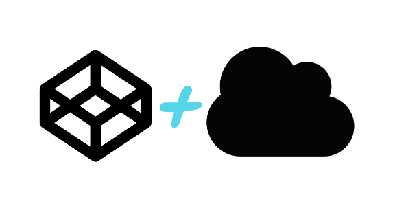

That's right, even though CodePen itself doesn't have data storage, you could use serverless technology to handle all that.

COOL RIGHT?! I sure think so. Let's do this.

### [#](https://blog.codepen.io/2018/01/15/build-serverless-blog-codepen/#table-of-contents-0)Table of Contents

Just looking for the final product and code?

- [GitHub Repo](https://github.com/CodePen/serverless-demos): For the cloud functions, sample data, and code snippets.
- [Final Demo](https://995efd87afaf43daaf9b410660395732.codepen.website/)
- [CodePen Project](https://codepen.io/team/codepen/project/editor/DWQRjB)

### [#](https://blog.codepen.io/2018/01/15/build-serverless-blog-codepen/#tools-of-the-trade-1)Tools of the Trade

From here on out, we're going to assume you know [the basics of the command line](https://abookapart.com/products/working-the-command-line) and [have npm installed](http://blog.npmjs.org/post/85484771375/how-to-install-npm) on your machine.

There are lots of possible tools in the world of serverless, but for this demo, in addition to building the front end on CodePen, we'll be doing the serverless stuff on [Firebase](https://firebase.google.com/), so you'll need a Google account.

### [#](https://blog.codepen.io/2018/01/15/build-serverless-blog-codepen/#step-1-set-up-a-firebase-project-2)Step 1) Set up a Firebase project

Let's create a project and then import some placeholder data (literally: some fake blog posts) that we can use initially as we develop our API.

1. Login to your Google account and navigate to [your Firebase console](https://console.firebase.google.com/)

2. Select the big **Add Project**

3. Create the project by providing a project name. The project ID is provided for you, but you can edit it, if you'd like. The **name** is just for finding your project again in your list of projects, but the ID is used in your actual code.

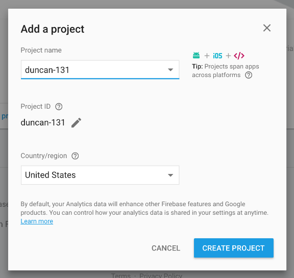

We're just working on the web here, but note that your Firebase projects can be used on both iOS and Android apps as well (like, simultaneously).

#### [#](https://blog.codepen.io/2018/01/15/build-serverless-blog-codepen/#lets-consider-the-data-for-a-blog-post-3)Let's consider the data for a blog post.

We have to put our content hats on for a minute and consider the bits of data that a blog post might have. Let's keep it real simple and go with `title` , `content` , `posted date` , and `author`. I'm sure you can imagine a more elaborate data structure, but this'll do for now. You aren't locked to this, it can always be changed later.

Given these, we can structure our first implementation data like this, with the `created` field being a [Unix timestamp](https://www.unixtimestamp.com/):

`{ [[NEWLINE]]  "posts": {[[NEWLINE]]    "101": {[[NEWLINE]]      "title": "Introduction to the Thesis of Theseus",[[NEWLINE]]      "content": "Lorem ipsum dolor sit amet, ...",[[NEWLINE]]      "created": 1483355533000,[[NEWLINE]]      "author": "Duncan"[[NEWLINE]]    },[[NEWLINE]]    "102": {[[NEWLINE]]      ...[[NEWLINE]]    }[[NEWLINE]]  }[[NEWLINE]]}[[NEWLINE]]`

#### [#](https://blog.codepen.io/2018/01/15/build-serverless-blog-codepen/#lets-import-some-fake-data-4)Let's import some fake data.

This will be easier for us to play around with some data in Firebase we can get our hands on.

1. Download the `posts.json` file as raw from [here](https://github.com/CodePen/serverless-demos/blob/master/blog-project/step_00_setup_list_posts/data/posts.json), Or create your own JSON file with the fields you can see in that example.

2. To initialize the data storage with our posts, select **Database** from the left side menu under the **DEVELOP** section.

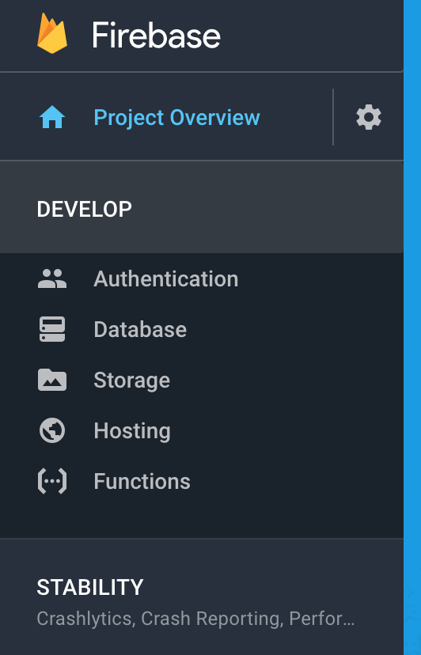
3. Click the "Get Started" button.
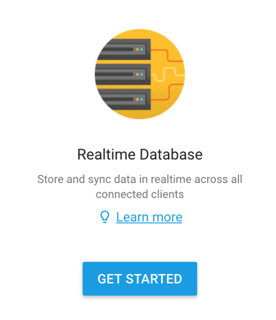

4. Open up the **...** menu on the right side of the menus, above the dismiss button, for access to the import/export menus

5. Select **Import JSON** menu item and the **Browse** button, selecting the `posts.json` file downloaded to import.

If you have an existing project you're reusing, this action will overwrite any data you currently have stored in your project, making a new project recommended for this tutorial.

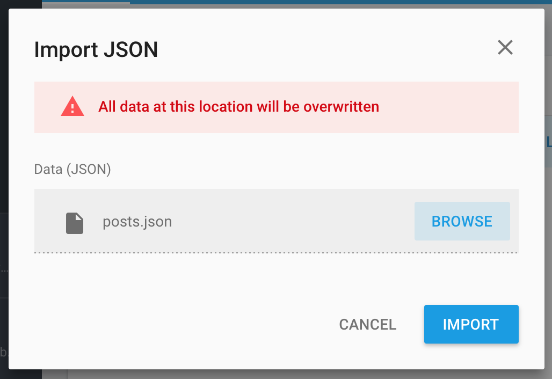
6. Select "Import" to save the initial data.

We now have our Firebase project created, development data in our data storage, and are ready to start developing in earnest!

### [#](https://blog.codepen.io/2018/01/15/build-serverless-blog-codepen/#step-2-set-up-cloud-functions-5)Step 2) Set Up Cloud Functions

**First, let's make something clear:** You don't *need* to work with Cloud Functions use Firebase realtime databases. We could make this project entirely through client-side JavaScript. We went the route of Cloud Functions because they are powerful and a big part of understanding the possibilities of **serverless*. Now let's get into what they are.

Firebase Cloud Functions are (nominally) small pieces of code that run on discrete data. In our case, we want to start with a function that will provide a list of all posts.

While the setup is slightly different for Cloud Functions than for many front-end libraries, developers comfortable with JavaScript on the front-end will feel at home with the Firebase Cloud Functions.

1. On the command line, install the firebase tools globally:
`npm install -g firebase-tools[[NEWLINE]]`

2. Once installed, create and/or navigate to your project directory. This is where the back-end, serverless code resides locally. We'll develop, test, and deploy from this project directory.In the project directory, run:

`firebase login[[NEWLINE]]`

3. The login command will provide a URL and open your default browser, where you can log in to your google account, and grant access to the firebase command line tools.Of note, I find that the authentication process happens entirely in the browser particularly awesome. That the process can be done from other devices if you're on a headless server, say, is even more spectacular. You can, for example, confirm the tools in your phone's browser. Totally awesome.

`$ firebase login[[NEWLINE]]? Allow Firebase to collect anonymous CLI usage and error reporting information? No[[NEWLINE]]Visit this URL on any device to log in:[[NEWLINE]]https://accounts.google.com/o/oauth2/auth?client_id=123-[[NEWLINE]]456.apps.googleusercontent.com&scope=...[[NEWLINE]]Waiting for authentication...[[NEWLINE]]✔ Success! Logged in as kitt@example.com[[NEWLINE]]`

With a successful login, we can develop our project locally and deploy our tested Cloud Functions to Firebase.

4. In the project directory, run:

	firebase init functions

Firebase has a number of features, functions is only one of them. You can also have hosting, file storage, and event triggers. We'll use only functions initially.

`? Select a default Firebase project for this directory:[[NEWLINE]][don't setup a default project][[NEWLINE]]❯ Duncan (duncan-131)[[NEWLINE]]Firebase Demo Project (fir-demo-project)[[NEWLINE]][create a new project][[NEWLINE]][[NEWLINE]]=== Functions Setup[[NEWLINE]][[NEWLINE]]A `functions` directory will be created in your project with a Node.js[[NEWLINE]]package pre-configured. Functions can be deployed with firebase deploy.[[NEWLINE]][[NEWLINE]]? What language would you like to use to write Cloud Functions? JavaScript[[NEWLINE]]✔ Wrote functions/package.json[[NEWLINE]]✔ Wrote functions/index.js? [[NEWLINE]][[NEWLINE]]Do you want to install dependencies with npm now? (Y/n)[[NEWLINE]]`

Allow firebase to install the dependencies by saying yes, to the dependencies install prompt:

`? Do you want to install dependencies with npm now? Yes[[NEWLINE]]...[[NEWLINE]]✔ Firebase initialization complete![[NEWLINE]]`

We'll now have the following files, and be ready to start developing our back-end API:

    - `.firebaserc`
    - `firebase.json`
    - `functions/index.js`
    - `functions/package.json`
    - `functions/node_modules`

### [#](https://blog.codepen.io/2018/01/15/build-serverless-blog-codepen/#step-3-api-development-list-all-posts-6)Step 3) API development: List All Posts

1. Open up the `functions/index.js` file in your favorite editor.

To make development easier, the Firebase functions module is already included. Our code will use this library to create functions and triggers in firebase.

We want to access the database, too, so include the firebase-admin module, too.

`// Firebase SDK call to create Cloud Functions and setup triggers.[[NEWLINE]]const functions = require('firebase-functions');[[NEWLINE]][[NEWLINE]]// The Firebase Admin SDK to access the Firebase Realtime Database. const admin = require('firebase-admin'); [[NEWLINE]]// new[[NEWLINE]]admin.initializeApp(functions.config().firebase); // new [[NEWLINE]]`

2. The first end API point we want lists all the posts we have in our blog.In the `functions/index.js` file, add this code:

`// List all the posts under the path /posts/[[NEWLINE]]exports.posts = functions.https.onRequest((req, res) => {[[NEWLINE]]  return admin.database().ref('/posts').once('value').then(function(snapshot) {[[NEWLINE]]      res.status(200).send(JSON.stringify(snapshot));[[NEWLINE]]  });[[NEWLINE]]});[[NEWLINE]]`

We are defining the cloud function `posts`. In it, we are using the Firebase real-time database (essentially a JSON object) for all the values below the `/posts` reference, which is at the top (or root) of our JSON.

Accessing values in the JSON is via the path into the JSON.

`once()` is a database action that triggers data retrieval one time. In our code, we want the `value` event. The `value` event is sent every time data is changed at or below the reference specified in the `ref()` call. Because every data change will trigger the `value` event, use it sparingly.

When the database reading is done and we have the `once()` call complete, we can send the snapshot of our data back on the request.

3. Now that we have code for our first API endpoint, we want to test it. We never, ever want to deploy untested code.

To test locally before deploying, the `firebase` command has a `serve` function that creates a local server which uses the remote datastore - we can access our database locally.

First run:
`firebase use --add[[NEWLINE]]`

And select your project you've already started. Then to start the local server, from your project directory, run:

`firebase serve --only functions[[NEWLINE]]`
This will start the local server and print a URL like:

	http://localhost:5000/PROJECT_NAME/PROJECT_REGION/posts

If the command doesn't open a new browser window, copy the localhost URL into your browser.

`$ firebase serve --only functions[[NEWLINE]]=== Serving from '/Users/codepen/duncan-131'...[[NEWLINE]]i functions: Preparing to emulate functions.[[NEWLINE]]✔ functions: posts: http://localhost:5000/duncan-131/us-central1/posts[[NEWLINE]]`

If all went well, you'll see the static JSON uploaded earlier.

4. Next, we want to upload our functions to Firebase. On the command line, in the project directory:

`firebase deploy --only functions[[NEWLINE]]`
The successful deployment will print out our API URL:

`$ firebase deploy[[NEWLINE]]=== Deploying to 'duncan-131'...[[NEWLINE]]i deploying functions[[NEWLINE]]i functions: ensuring necessary APIs are enabled...[[NEWLINE]]✔ functions: all necessary APIs are enabled[[NEWLINE]]i functions: preparing functions directory for uploading...[[NEWLINE]]i functions: packaged functions (1.04 KB) for uploading[[NEWLINE]]✔ functions: functions folder uploaded successfully[[NEWLINE]]i functions: updating function posts...[[NEWLINE]]✔ functions[posts]: Successful update operation.[[NEWLINE]]Function URL (posts): [https://us-central1-duncan-131.cloudfunctions.net/posts](https://us-central1-duncan-131.cloudfunctions.net/posts) [[NEWLINE]][[NEWLINE]]✔ Deploy complete![[NEWLINE]]Project Console: https://console.firebase.google.com/project/duncan-131/overview[[NEWLINE]]`

Viewing this URL, we see our development JSON:
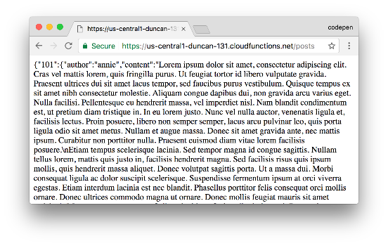
Yay! We're ready to use our API now.

### [#](https://blog.codepen.io/2018/01/15/build-serverless-blog-codepen/#step-4-setting-up-the-front-end-7)Step 4) Setting up the Front End

This is where CodePen comes in! We need someone where to build our front end. If you're just playing around, creating a Pen will do. If you're looking to really build this thing out, you'll probably want to create a Project (so ultimately you can break things up into multiple files, upload other resources, deploy it, etc.).

Here's where we're at so far:

See the Pen [A Serverless Blog](https://codepen.io/team/codepen/pen/BmgJqa/) by CodePen ([@codepen](https://codepen.io/codepen)) on [CodePen](https://codepen.io/).

#### [#](https://blog.codepen.io/2018/01/15/build-serverless-blog-codepen/#lets-start-with-some-clean-html-8)Let's start with some clean HTML

We'll ultimately be asking for posts data from our API, and formatting it into HTML. It's usually a smart idea to start with good HTML first. Here's an example of that, including a div with an id we can easily target with JavaScript to insert our articles ourselves later.

`<main class="site-wrap">[[NEWLINE]]  
[[NEWLINE]]    <article class="article-block">[[NEWLINE]]      <h2>This is the title of a blog post</h2>[[NEWLINE]]      <time>December 4, 2018</time>[[NEWLINE]]      
[[NEWLINE]]        
Lorem ipsum dolor sit amet consectetur adipisicing elit. Odit harum in ea consequuntur sit neque. Natus accusantium, ducimus, veritatis voluptas animi perspiciatis voluptate similique nihil quam vero dolorem atque error?
[[NEWLINE]]      
[[NEWLINE]]      <a href="#0">Read Post</a>[[NEWLINE]]    </article>[[NEWLINE]]  
[[NEWLINE]]</main>[[NEWLINE]]`

Next, let's load in the posts via an Ajax call.

`var blog_api_url = 'YOUR_FIREBASE_CLOUD_FUNCTIONS_URL';[[NEWLINE]]var posts_list = document.getElementById('posts-list');[[NEWLINE]]var posts_container = posts_list.querySelector('.posts-container');[[NEWLINE]][[NEWLINE]]var loadJsonFromFirebase = function(url, callback) {[[NEWLINE]] var xhr = new XMLHttpRequest();[[NEWLINE]]  xhr.addEventListener("load", function () {[[NEWLINE]]    callback(JSON.parse(this.response));[[NEWLINE]]  });[[NEWLINE]]  xhr.open("GET", url);[[NEWLINE]]  xhr.send();[[NEWLINE]]};[[NEWLINE]][[NEWLINE]]loadJsonFromFirebase(blog_api_url, function(data) {[[NEWLINE]]  let list = document.createElement('div');[[NEWLINE]]  Object.keys(data).forEach(function(key) {[[NEWLINE]]    let ts = data[key].created;[[NEWLINE]]    list.innerHTML += `<article class="article-block">[[NEWLINE]]      <h2>${data[key].title}</h2> [[NEWLINE]]      ${ts.toDateString()} [[NEWLINE]]      
 [[NEWLINE]]        
${data[key].content.substr(0, 150)}...
 [[NEWLINE]]      
 [[NEWLINE]]      <a href="#${key}">Read Post</a>[[NEWLINE]]   </article>`;[[NEWLINE]]  });[[NEWLINE]]  posts_container.insertBefore(list, posts_container.firstChild);[[NEWLINE]]});[[NEWLINE]]`

#### [#](https://blog.codepen.io/2018/01/15/build-serverless-blog-codepen/#uh-oh-cors-problems-9)Uh oh! CORS problems...

If we refresh the demo right now, you'll see our posts don't load. Viewing the JavaScript console, you can see the problem. We didn't set up our CORS headers:

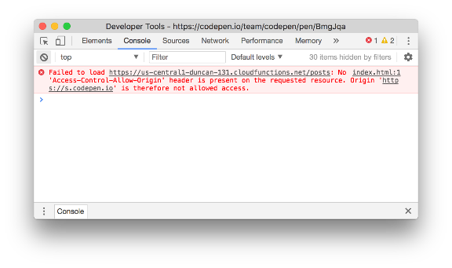

To add CORS headers, we can include the CORS module. This command, run from the project's `functions` directory, will grab this module for us and add it to the `package.json` file:

`npm install --save cors[[NEWLINE]]`

Next, we'll update `functions/index.js` to use the `cors()` call. Start by including the `cors` package at the beginning of the file, then wrap the returned data with the `cors()` call:

`const cors = require('cors')({origin: true});[[NEWLINE]][[NEWLINE]]// The Cloud Functions for Firebase SDK to create Cloud Functions and setup triggers.[[NEWLINE]]const functions = require('firebase-functions');[[NEWLINE]][[NEWLINE]]// The Firebase Admin SDK to access the Firebase Realtime Database.[[NEWLINE]]const admin = require('firebase-admin');[[NEWLINE]]admin.initializeApp(functions.config().firebase);[[NEWLINE]][[NEWLINE]]// List all the posts under the path /posts/[[NEWLINE]]exports.posts = functions.https.onRequest((req, res) => {[[NEWLINE]]  cors(req, res, () => {[[NEWLINE]]    return admin.database().ref('/posts').once('value').then(function(snapshot) {[[NEWLINE]]      res.status(200).send(JSON.stringify(snapshot));[[NEWLINE]]    });[[NEWLINE]]  });[[NEWLINE]]}[[NEWLINE]]`

For the changes to take effect, we need to send them to Firebase, which we do with another deploy call. Run this from the project's functions directory:

`firebase deploy --only functions[[NEWLINE]]`
Now when we reload the demo, our data loads! Yay!

The final code for this section is located [in this GitHub repo](https://github.com/CodePen/serverless-demos/tree/master/blog-project/step_00_setup_list_posts) for your reference.

### [#](https://blog.codepen.io/2018/01/15/build-serverless-blog-codepen/#step-5-single-posts-and-improving-our-api-10)Step 5) Single Posts (and improving our API)

As with most APIs like this, it should allow us to fetch a list of posts, **or full individual posts as well.**

[Good API design](https://hackernoon.com/restful-api-designing-guidelines-the-best-practices-60e1d954e7c9) would have us create GET URL's like `/posts` for the entire list (as we already have) and `/posts/ID` for a single post.

This means we need to add a parameter to our API URL.

The `exports.posts` syntax we used previously doesn't allow parameters in the URL, so we need to adjust our firebase functions code to use an [Express](https://expressjs.com/) app, which *does* allow URL parameters in its routes.

We begin this change by installing Express in the `functions` directory, and saving the dependency to the `package.json` file at the same time:

`npm install express --save[[NEWLINE]]`

Next, we'll adjust the request handling function by loading Express, then adding the two `/posts` and `/posts/ID` routes, as detailed in the [Express routing guide](https://expressjs.com/en/guide/routing.html) :

`const cors = require("cors")({ origin: true });[[NEWLINE]][[NEWLINE]]// The Cloud Functions for Firebase SDK to create functions & triggers.[[NEWLINE]]const functions = require("firebase-functions");[[NEWLINE]][[NEWLINE]]// The Firebase Admin SDK to access the Firebase Realtime Database.[[NEWLINE]]const admin = require("firebase-admin");[[NEWLINE]]admin.initializeApp(functions.config().firebase);[[NEWLINE]][[NEWLINE]]// The express app used for routing[[NEWLINE]]const app = require("express")();[[NEWLINE]][[NEWLINE]]// List all the posts under the path /posts[[NEWLINE]]app.get([[NEWLINE]]  ["/", "/:id"],[[NEWLINE]]  functions.https.onRequest((req, res) => {[[NEWLINE]]    const postid = req.params.id;[[NEWLINE]]    let reference = "posts";[[NEWLINE]]    reference += postid ? "/" + postid : "";[[NEWLINE]][[NEWLINE]]cors(req, res, () => {[[NEWLINE]]      return admin[[NEWLINE]]        .database()[[NEWLINE]]        .ref(reference)[[NEWLINE]]        .once("value")[[NEWLINE]]        .then(function(snapshot) {[[NEWLINE]]        if (snapshot.val() !== null) {[[NEWLINE]]          res.status(200).send(JSON.stringify(snapshot));[[NEWLINE]]        } else {[[NEWLINE]]          res.status(200).send({});[[NEWLINE]]        }[[NEWLINE]]      });[[NEWLINE]]    });[[NEWLINE]]  })[[NEWLINE]]);[[NEWLINE]][[NEWLINE]]// set the routes up under the /posts/ endpoint[[NEWLINE]]exports.posts = functions.https.onRequest(app);[[NEWLINE]]`

As always, test locally:
`firebase serve --only functions[[NEWLINE]]`

When testing, `/posts/` should return a JSON list of all of our test posts. The route `/posts/101` should return the JSON for the single post with ID `101`. The route `/posts/aaa` should return an empty JSON object, an error state we'll fix shortly.

What we might notice in testing is that while `/posts/` returns our full JSON posts list, `/posts` returns an error `Cannot GET null`. This is because the router is receiving an empty URL path. This is an odd quirk of the router that we can work around by replacing our `onRequest` call with a check for the missing trailing slash:

`exports.posts = functions.https.onRequest((req, res) => {[[NEWLINE]]  // Handle routing of /posts without a trailing /,[[NEWLINE]]  if (!req.path) {[[NEWLINE]]    // prepending "/" keeps query params, path params intact[[NEWLINE]]    req.url = `/${req.url}`;[[NEWLINE]]  }[[NEWLINE]]  return app(req, res);[[NEWLINE]]});[[NEWLINE]]`

Once we are happy with our manual testing, we can deploy our full list and individual posts API:

`firebase deploy --only functions[[NEWLINE]]`

Once we have our individual post API endpoint, we can use it! Let's add the HTML and JavaScript to display a single post.

Add the HTML element that an individual post can load into:
`<article id="article" class="article-whole">[[NEWLINE]]</article>[[NEWLINE]]`
Here's the JavaScript that will grab, format, and display a single post:

`...[[NEWLINE]][[NEWLINE]]var getQueryParam = function(param) {[[NEWLINE]]  let params = window.location.search.substr(1);[[NEWLINE]]  params = params.split("&");[[NEWLINE]]  let paramList = {};[[NEWLINE]]  for (let i = 0; i  {[[NEWLINE]]  let post_id = e.target.dataset.post;[[NEWLINE]]  if (post_id) {[[NEWLINE]]    // load the post from ajax call[[NEWLINE]]    loadJsonFromFirebase(blog_api_url + '/' + post_id, function(data) {[[NEWLINE]]      let div = document.createElement('div');[[NEWLINE]]      let ts = data.created;[[NEWLINE]]      div.innerHTML = `[[NEWLINE]]        <h1>${data.title}</h1>[[NEWLINE]]          ${ts.toDateString()}[[NEWLINE]]          
[[NEWLINE]]            
${data.content}
 [[NEWLINE]]          
[[NEWLINE]]        `;[[NEWLINE]]      post_full.replaceChild(div, post_full.firstChild);[[NEWLINE]]      // hide the full list[[NEWLINE]]      posts_container.classList.add('start-hidden');[[NEWLINE]]      // show the single post[[NEWLINE]]      post_full.classList.remove('start-hidden');[[NEWLINE]]    });[[NEWLINE]]  }[[NEWLINE]]};[[NEWLINE]][[NEWLINE]]// handle the bubbled-up click event[[NEWLINE]]posts_list.addEventListener('click', showPostClick);[[NEWLINE]][[NEWLINE]]...[[NEWLINE]]`

Now, when we click on the "Read More" links from our posts list, the individual blog entry displays.

We can quickly see where we can add UX enhancements such as adding a spinner when we select "Read More" to indicate to the viewer a post is loading, or a link to return to the list of posts. Creating new posts, however, is more exciting, so let's do that first.

Here's our progress so far:

See the Pen [A Serverless Blog](https://codepen.io/team/codepen/pen/OOeZbq/) by CodePen ([@codepen](https://codepen.io/codepen)) on [CodePen](https://codepen.io/).

### [#](https://blog.codepen.io/2018/01/15/build-serverless-blog-codepen/#step-6-creating-new-blog-posts-11)Step 6) Creating New Blog Posts

What we've done so far is fetch existing posts and display that. That's great, but if we're really building a blog, we need a way to *create* new blog posts as well.

Our current process for creating a new post would be to upload a JSON directly through the Firebase interface to add a new post. Possible, but that's no way to live. Let's allow ourselves to create a new blog post right from the site itself!

Keeping in line with API best practices, we want to add a POST action to our `/posts` API endpoint. The fields we have from our GET endpoint are: `author`, `content`, `created`, and `title`. The server should handle the `created` time field, so let's focus on the `content` and `title` fields.

To the `/posts` API endpoint with the POST method, we'll send JSON formatted like this:

`{ [[NEWLINE]]  "title": "The Post Title",[[NEWLINE]]  "content": "This is our example content for this post. It is currently unformatted. Formatting is important, though!"[[NEWLINE]]}[[NEWLINE]]`

To handle this incoming data, let's use the Express `.post` routing method, adding the new code just before the `exports.posts` call:

`// create a new post[[NEWLINE]]app.post([[NEWLINE]]  "/",[[NEWLINE]]  functions.https.onRequest((req, res) => {[[NEWLINE]]    cors(req, res, () => {[[NEWLINE]]      // set the content[[NEWLINE]]      let content = req.body.content ? req.body.content.trim() : null;[[NEWLINE]]      if (content === null) {[[NEWLINE]]        res.status(200).send({ error: "Missing content" });[[NEWLINE]]        return;[[NEWLINE]]      }[[NEWLINE]][[NEWLINE]]// title can be provided, or extracted from the content[[NEWLINE]]      let title = req.body.title[[NEWLINE]]        ? req.body.title.trim()[[NEWLINE]]        : req.body.content.substr(0, 20) + "...";[[NEWLINE]][[NEWLINE]]// we want the server to set the time, so use the firebase timestamp[[NEWLINE]]      let postDate = admin.database.ServerValue.TIMESTAMP;[[NEWLINE]][[NEWLINE]]let postData = { title: title, content: content, created: postDate };[[NEWLINE]][[NEWLINE]]// create a new ID with empty values[[NEWLINE]]      let postKey = admin[[NEWLINE]]        .database()[[NEWLINE]]        .ref("posts")[[NEWLINE]]        .push().key;[[NEWLINE]][[NEWLINE]]// set() will overwrite all values in the entry[[NEWLINE]]      // update() will overwrite only the values passed in[[NEWLINE]]      admin[[NEWLINE]]        .database()[[NEWLINE]]        .ref("/posts")[[NEWLINE]]        .child(postKey)[[NEWLINE]]        .set(postData, function() {[[NEWLINE]]          // Read the saved data back out[[NEWLINE]]          return admin[[NEWLINE]]            .database()[[NEWLINE]]            .ref("/posts/" + postKey)[[NEWLINE]]            .once("value")[[NEWLINE]]            .then(function(snapshot) {[[NEWLINE]]              if (snapshot.val() !== null) {[[NEWLINE]]                res.status(200).send(JSON.stringify(snapshot));[[NEWLINE]]              } else {[[NEWLINE]]                res.status(200).send({ error: "Unable to save post" });[[NEWLINE]]              }[[NEWLINE]]            });[[NEWLINE]]        });[[NEWLINE]]    });[[NEWLINE]]  })[[NEWLINE]]);[[NEWLINE]]`

We are wrapping our call in the `cors()` function again.

Of note, we use the `set()` method here for the creation of the post. The `set()` method will take all the incoming keys and save them and their data, and only them, removing any other JSON key values in the object. The `update()` method will save the new values of only the keys provided, making `update()` great for edits, and `set()` good for creation.

After adding the post function, we again test locally with `firebase serve --only functions` . To POST to the endpoint, we can use curl:

`curl -X POST -H "Content-Type:application/json" -d '{ "title" : "this is the post title", "content" : "this is the development post content"}' http://localhost:5000/PROJECT/REGION/posts[[NEWLINE]]`

To make testing easier, [save the CURL calls into a bash script](https://github.com/CodePen/serverless-demos/blob/master/blog-project/step_02_auth_and_post/data/post-test-post.sh). The bash script makes initial testing of multiple calls with different JSON values easier, too.

If the CURL POST call works, we will see the additional post item on the posts list when we refresh the pen.

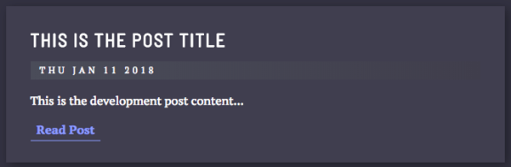

When everything is working, do the ol' `firebase deploy --only functions` to deploy.

With these changes, we've done several things with our data:
1. we've ignored the `author` field
2. we've just opened up our application to a huge security hole.

The former is part of the development iteration process, which test cases will help find. The last is a huge concern. We don't check or clean the incoming data for hacks, we don't check or clean the data we send back out, and we currently allow anyone to post to the URL, as we don't have any authentication on the POST endpoint.

Let's fix that last one by adding authentication. The first thing we want to do is lock down the API by limiting access. Navigate to the project's Firebase console:

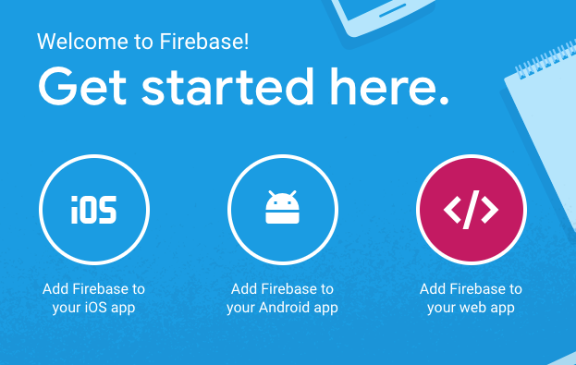

Selecting the **Add Firebase to your web app** will trigger a popup, with code that will handle authentication in the blog app.

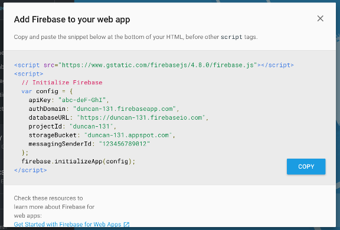
Copy these values, and paste them at the bottom of the HTML in the Pen.

Next, we'll select the sign-in methods allowed for the blog. In the Firebase console, under the Development tab on the left, select the **Authentication** menu.

Select the big **Set Up Sign-In Method** button for a list of providers.
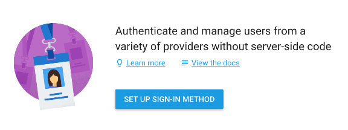

In the list, select the providers you'd like to support. Firebase provides a fantastic list of providers.

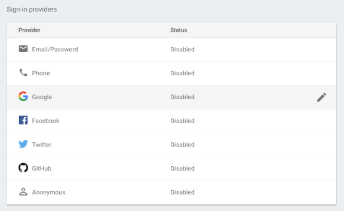
Select at least one.

Next, add "codepen.io" to the list of authorized domains on the sign-in method page. If you're using Projects, add "codepen.plumbing" and "codepen.website" as well.

Next, let's check for authentication on the incoming POST call in our `app.post()` call.

Authentication tokens from the client can be sent in the request headers or in the request body, depending on how we send them from the blog front-end. Let's send them in the request body's JSON to reduce complexity, using the `token` key.

With this, we can use `request.body.token` value to read the request's authentication token we're going to pass to the server, and Firebase's `verifyIdToken()` function to confirm the user is valid:

`cors(req, res, () => {[[NEWLINE]]  // we have something TO post, confirm we are ALLOWED to post[[NEWLINE]]  const tokenId = req.body.token;[[NEWLINE]]  admin[[NEWLINE]]    .auth()[[NEWLINE]]    .verifyIdToken(tokenId)[[NEWLINE]]    .then(function(decodedUser) {[[NEWLINE]]      // the rest of the app.post function inside the[[NEWLINE]]    })[[NEWLINE]]    .catch(err => res.status(401).send(err));[[NEWLINE]]});[[NEWLINE]]`

Using the decoded user fields, we can extract the user's name for storing in our post's JSON. This value is good for display, but not unique. As such, we'll use it in this iteration, but refactor to use the unique ID Firebase provides later.

`/* [[NEWLINE]] * @see [https://firebase.google.com/docs/auth/admin/verify-id-tokens](https://firebase.google.com/docs/auth/admin/verify-id-tokens) [[NEWLINE]] * decoded User fields: aud, auth_time, email, email_verified, exp,[[NEWLINE]] * iat, iss, name, picture, sub, uid, user_id[[NEWLINE]] */[[NEWLINE]][[NEWLINE]]// For the first pass, use user's Name. This isn't unique.[[NEWLINE]]let postAuthor = decodedUser.name;[[NEWLINE]]`

Next, let's clean the input data from the user.

Following [OWASP's XSS Prevention Cheat Sheet](https://www.owasp.org/index.php/XSS_(Cross_Site_Scripting)_Prevention_Cheat_Sheet#RULE_.236_-_Sanitize_HTML_Markup_with_a_Library_Designed_for_the_Job) recommendations, we can use the [sanitize-html](https://github.com/punkave/sanitize-html) module to strip all HTML from the submitted post data. We can later iterate and add back tags we want to preserve.

As before with the `cors` module, in our `functions` directory, we add the `sanitize-html` module with `npm`

`npm install --save sanitize-html[[NEWLINE]]`

Then we'll, again, update `functions/index.js`, but this time to use the `sanitizeHtml()` call. Start by including the `sanitize-html` package after our `cors` initializer:

`...[[NEWLINE]]const cors = require('cors')({origin: true});[[NEWLINE]]const sanitizeHtml = require('sanitize-html');[[NEWLINE]]...[[NEWLINE]]`

Then, clean up our `content` and `title` variables using the `sanitizeHtml` call:

`...[[NEWLINE]]let content = req.body.content ? sanitizeHtml(req.body.content, { allowedTags: [], allowedAttributes: [] }) : null;[[NEWLINE]]...[[NEWLINE]]let title = req.body.title ? sanitizeHtml(req.body.title, { allowedTags: [], allowedAttributes: [] }) : content.substr(0, 20) + '...';[[NEWLINE]]...[[NEWLINE]]`

And our last data change will be to include the newly created post's ID in the returned JSON:

`let postJSON = snapshot.val();[[NEWLINE]]postJSON.id = postKey;[[NEWLINE]]res.status(200).send(JSON.stringify(postJSON));[[NEWLINE]]`

The updated `app.post()` function in full:

`// create a new post[[NEWLINE]]app.post([[NEWLINE]]  "/",[[NEWLINE]]  functions.https.onRequest((req, res) => {[[NEWLINE]]    cors(req, res, () => {[[NEWLINE]]      let content = req.body.content ? sanitizeHtml(req.body.content, { allowedTags: [], allowedAttributes: [] }) : null;[[NEWLINE]]      if (content === null) {[[NEWLINE]]        res.status(200).send({ error: "Missing content" });[[NEWLINE]]        return;[[NEWLINE]]      }[[NEWLINE]]      // we have something TO post, confirm we are ALLOWED to post[[NEWLINE]]      const tokenId = req.body.token;[[NEWLINE]]      admin[[NEWLINE]]        .auth()[[NEWLINE]]        .verifyIdToken(tokenId)[[NEWLINE]]        .then(function(decodedUser) {[[NEWLINE]]          // title can be provided, or extracted from the content[[NEWLINE]]          let title = req.body.title ? sanitizeHtml(req.body.title, { allowedTags: [], allowedAttributes: [] }) : content.substr(0, 20) + '...';[[NEWLINE]]          // we want the server to set the time, so use firebase timestamp[[NEWLINE]]          let postDate = admin.database.ServerValue.TIMESTAMP;[[NEWLINE]]          /*[[NEWLINE]]     * @see [https://firebase.google.com/docs/auth/admin/verify-id-tokens](https://firebase.google.com/docs/auth/admin/verify-id-tokens) [[NEWLINE]]     * decoded User fields: aud, auth_time, email, email_verified, exp, iat, iss, name, picture, sub, uid, user_id */[[NEWLINE]]          // For the first pass, use user's Name. This isn't unique[[NEWLINE]]          let postAuthor = decodedUser.name;[[NEWLINE]][[NEWLINE]]// assembled data[[NEWLINE]]          let postData = {[[NEWLINE]]            author: postAuthor,[[NEWLINE]]            title: title,[[NEWLINE]]            content: content,[[NEWLINE]]            created: postDate[[NEWLINE]]          };[[NEWLINE]][[NEWLINE]]// create a new ID with empty values[[NEWLINE]]          let postKey = admin[[NEWLINE]]            .database()[[NEWLINE]]            .ref("posts")[[NEWLINE]]            .push().key;[[NEWLINE]][[NEWLINE]]// set() will overwrite all values in the entry[[NEWLINE]]          admin[[NEWLINE]]            .database()[[NEWLINE]]            .ref("/posts")[[NEWLINE]]            .child(postKey)[[NEWLINE]]            .set(postData, function() {[[NEWLINE]]              // Read the saved data back out[[NEWLINE]]              return admin[[NEWLINE]]                .database()[[NEWLINE]]                .ref("/posts/" + postKey)[[NEWLINE]]                .once("value")[[NEWLINE]]                .then(function(snapshot) {[[NEWLINE]]                  if (snapshot.val() !== null) {[[NEWLINE]]                    let postJSON = snapshot.val();[[NEWLINE]]                    postJSON.id = postKey;[[NEWLINE]]                    res.status(200).send(JSON.stringify(postJSON));[[NEWLINE]]                  } else {[[NEWLINE]]                    res.status(200).send({ error: "Unable to save post" });[[NEWLINE]]                  }[[NEWLINE]]                });[[NEWLINE]]            });[[NEWLINE]]        })[[NEWLINE]]        .catch(err => res.status(401).send(err));[[NEWLINE]]    });[[NEWLINE]]  })[[NEWLINE]]);[[NEWLINE]]`

Now when we test locally with our updated post function, again with `firebase serve --only functions`, we have authentication failures.

If we test on a second server, we also have CORS errors again. We can add the CORS middleware in the Express routing with this code outside of the `app.get()` and `app.post()` calls:

`app.use(function(req, res, next) {[[NEWLINE]]  res.header("Access-Control-Allow-Origin", "*");[[NEWLINE]]  res.header([[NEWLINE]]    "Access-Control-Allow-Headers",[[NEWLINE]]    "Origin, X-Requested-With, Content-Type, Accept"[[NEWLINE]]  );[[NEWLINE]]  next();[[NEWLINE]]});[[NEWLINE]]`

Test and deploy: `firebase serve --only functions` followed by `firebase deploy --only functions`.

The last bit we need to add is the ability to submit blog posts from our front-end. We previously added the Firebase authentication code to our HTML. Let's add a "Sign In" button to trigger the Firebase authentication process, and a "New Post" button, which we can display after sign-in:

`<a id="sign-in-button" class="button sign-in-button">[[NEWLINE]]  <svg width="24" height="24" viewBox="0 0 24 24">[[NEWLINE]]    <path d="M12,4A4,4 0 0,1 16,8A4,4 0 0,1 12,12A4,4 0 0,1 8,8A4,4 0 0,1 12,4M12,14C16.42,14 20,15.79 20,18V20H4V18C4,15.79 7.58,14 12,14Z"></path>[[NEWLINE]]  </svg>[[NEWLINE]]  Sign In[[NEWLINE]]</a>[[NEWLINE]]<a id="new-post-button" class="button sign-in-button start-hidden">[[NEWLINE]]  <svg width="24" height="24" viewBox="0 0 24 24">[[NEWLINE]]    <path d="M12,4A4,4 0 0,1 16,8A4,4 0 0,1 12,12A4,4 0 0,1 8,8A4,4 0 0,1 12,4M12,14C16.42,14 20,15.79 20,18V20H4V18C4,15.79 7.58,14 12,14Z"></path>[[NEWLINE]]  </svg>[[NEWLINE]]  New Post[[NEWLINE]]</a>[[NEWLINE]]`

Then, add the JavaScript to enable the authentication, which will trigger toggling the buttons' displays:

`// track authenticated user to avoid triggering on refresh[[NEWLINE]]var currentUID;[[NEWLINE]][[NEWLINE]]// Bindings on load.[[NEWLINE]]document.addEventListener("DOMContentLoaded", function() {[[NEWLINE]]  document[[NEWLINE]]    .getElementById("sign-in-button")[[NEWLINE]]    .addEventListener("click", function() {[[NEWLINE]]      var provider = new firebase.auth.GoogleAuthProvider();[[NEWLINE]]      firebase.auth().signInWithPopup(provider);[[NEWLINE]]    });[[NEWLINE]][[NEWLINE]]// Listen for auth state changes[[NEWLINE]]  firebase.auth().onAuthStateChanged(onLogInOutChange);[[NEWLINE]]});[[NEWLINE]][[NEWLINE]]// toggle buttons on sign in/out auth changes[[NEWLINE]]var onLogInOutChange = function(user) {[[NEWLINE]]  // Ignore token refresh events[[NEWLINE]]  if (user && currentUID === user.uid) {[[NEWLINE]]    return;[[NEWLINE]]  }[[NEWLINE]][[NEWLINE]]// If logged in, show the new post button[[NEWLINE]]  if (user) {[[NEWLINE]]    currentUID = user.uid;[[NEWLINE]]    document.getElementById("sign-in-button").style.display = "none";[[NEWLINE]]    document.getElementById("new-post-button").style.display = "block";[[NEWLINE]]  } else {[[NEWLINE]]    currentUID = null;[[NEWLINE]]    document.getElementById("sign-in-button").style.display = "block";[[NEWLINE]]    document.getElementById("new-post-button").style.display = "none";[[NEWLINE]]  }[[NEWLINE]]};[[NEWLINE]]`

After adding the JavaScript, give the log in a try. The "New Post" button should display after authentication, and only if a user is authenticated.

We can't rely on the button's display state for authentication status - a simple HTML change in the pen can display the "New Post" button. However, because we check authentication status in the POST API method, we are okay if this HTML change happens, as it won't introduce any security issues.

Now that we have our "New Post" button displaying after authentication, add the new post form:

`<section id="new-post" class="article-form" style="display: none;">[[NEWLINE]]  <h2>New Post</h2>[[NEWLINE]]  <form id="message-form" action="#">[[NEWLINE]]    <h4><label for="new-post-title">Title</label></h4>[[NEWLINE]]    <input type="text" id="new-post-title">[[NEWLINE]]    <h4><label for="new-post-content">Content</label></h4>[[NEWLINE]]    <textarea rows="3" id="new-post-content"></textarea>[[NEWLINE]]    <button type="submit">Add post</button>[[NEWLINE]]  </form>[[NEWLINE]]</section>[[NEWLINE]]`

And trigger its display on the "New Post" button click:

`// show the new post form[[NEWLINE]]document.getElementById('new-post-button').addEventListener('click', function() {[[NEWLINE]]  document.getElementById('new-post').style.display = '';[[NEWLINE]]});[[NEWLINE]]`

Next, connect the message submit button to the form submit to our API endpoint. We'll want to include the authentication token that Firebase provides for the submission.

`// Saves message on form submit.[[NEWLINE]]let messageForm = document.getElementById("message-form");[[NEWLINE]]messageForm.onsubmit = function(e) {[[NEWLINE]]  e.preventDefault();[[NEWLINE]][[NEWLINE]]let postTitle = document.getElementById("new-post-title");[[NEWLINE]]  let postContent = document.getElementById("new-post-content");[[NEWLINE]]  let title = postTitle.value;[[NEWLINE]]  let content = postContent.value;[[NEWLINE]][[NEWLINE]]if (content) {[[NEWLINE]]    // if the user is logged in, continue[[NEWLINE]]    firebase[[NEWLINE]]      .auth()[[NEWLINE]]      .currentUser.getIdToken(/* forceRefresh */ true)[[NEWLINE]]      .then(function(idToken) {[[NEWLINE]]        var xhr = new XMLHttpRequest();[[NEWLINE]]        xhr.addEventListener("load", function() {[[NEWLINE]]          // on success, display post @ top of the list and hide the form[[NEWLINE]]          postTitle.value = "";[[NEWLINE]]          postContent.value = "";[[NEWLINE]]          document.getElementById("new-post").style.display = "none";[[NEWLINE]][[NEWLINE]]let postDetails = JSON.parse(this.response);[[NEWLINE]]          let div = document.createElement("div");[[NEWLINE]]          let ts = postDetails.created;[[NEWLINE]]          div.innerHTML += `<article class="article-block">[[NEWLINE]]             <h2>${postDetails.title}</h2>[[NEWLINE]]             ${ts.toDateString()}[[NEWLINE]]             
[[NEWLINE]]               
${postDetails.content.substr(0, 150)}...
[[NEWLINE]]             
[[NEWLINE]]             <a>Read Post</a>[[NEWLINE]]           </article>`;[[NEWLINE]]          posts_container.insertBefore(div, posts_container.firstChild);[[NEWLINE]]        });[[NEWLINE]][[NEWLINE]]xhr.open("POST", blog_api_url);[[NEWLINE]]        xhr.setRequestHeader("Content-Type", "application/json");[[NEWLINE]]        xhr.send([[NEWLINE]]          JSON.stringify({ title: title, content: content, token: idToken })[[NEWLINE]]        );[[NEWLINE]]      })[[NEWLINE]]      .catch(function(error) {[[NEWLINE]]        // otherwise, TODO: handle error, user isn't authenticated yet[[NEWLINE]]      });[[NEWLINE]]  } else {[[NEWLINE]]    // TODO: display box around the missing content field[[NEWLINE]]  }[[NEWLINE]]};[[NEWLINE]]`

We're here!

See the Pen [A Serverless Blog](https://codepen.io/team/codepen/pen/QOepZb/) by CodePen ([@codepen](https://codepen.io/codepen)) on [CodePen](https://codepen.io/).

### [#](https://blog.codepen.io/2018/01/15/build-serverless-blog-codepen/#step-7-handle-url-changes-and-cleaning-up-12)Step 7) Handle URL Changes (and cleaning up)

We now have a list of all of our posts, we can view single posts, and we can create new posts. The site has the authentication "feature" that anyone with a Google account can create a new post, as well as the limitation that we are unable to link to a specific post.

We also know we can make the post rendering easier by creating a template, so let's start there, before tackling URL handling and authentication limits.

First up, create a render function that can render both a full post, as well as an excerpt:

`const renderPost = function(postId, postData, summary = false) {[[NEWLINE]]  let ts = new Date(postData.created);[[NEWLINE]]  if (summary) {[[NEWLINE]]    return `<article class="article-block">[[NEWLINE]]      <h2>${postData.title}</h2>[[NEWLINE]]      ${ts.toDateString()}[[NEWLINE]]      
[[NEWLINE]]        
${postData.content.substr(0, 150)}...
[[NEWLINE]]      
[[NEWLINE]]      <a>Read Post</a>[[NEWLINE]]    </article>`;[[NEWLINE]]  } else {[[NEWLINE]]    return `<article class="article-block">[[NEWLINE]]      <h2>${postData.title}</h2>[[NEWLINE]]      ${ts.toDateString()}[[NEWLINE]]      
[[NEWLINE]]        
${postData.content}
[[NEWLINE]]      
[[NEWLINE]]    </article>`;[[NEWLINE]]  }[[NEWLINE]]}[[NEWLINE]]`

Then, change the rendering calls to use the new function:

`// example, in messageForm.onsubmit function[[NEWLINE]]...[[NEWLINE]]  let postDetails = JSON.parse(this.response);[[NEWLINE]]  let div = document.createElement('div');[[NEWLINE]]  // this is the replaced rendering section[[NEWLINE]]  div.innerHTML += renderPost(postDetails.id, postDetails, false);[[NEWLINE]]  posts_container.insertBefore(div, posts_container.firstChild);[[NEWLINE]]...[[NEWLINE]][[NEWLINE]]// example, in showPostClick[[NEWLINE]]...[[NEWLINE]]  let div = document.createElement('div');[[NEWLINE]]  // this is the replaced rendering function[[NEWLINE]]  div.innerHTML = renderPost(post_id, data, false);[[NEWLINE]]  post_full.replaceChild(div, post_full.firstChild);[[NEWLINE]]...[[NEWLINE]][[NEWLINE]]// example in initial page data load[[NEWLINE]]...[[NEWLINE]]  let list = document.createElement('div');[[NEWLINE]]    Object.keys(data).forEach(function(key) {[[NEWLINE]]      // this is the new replaced code[[NEWLINE]]      list.innerHTML += renderPost(key, data[key], true);[[NEWLINE]]    });[[NEWLINE]]  posts_container.insertBefore(list, posts_container.firstChild);[[NEWLINE]]...[[NEWLINE]]`

Next, let's handle the URL change states - we want the browser URL to reflect the blog's content, either a specific post or the list of posts, that we load via the Firebase AJAX call. This is the perfect use for the [HTML5 History API](https://css-tricks.com/using-the-html5-history-api/), updating the URL on content changes, and using the updated URL to load individual posts.

First, a function to extract the `post_id` from the URL:

`const getAnchorParam = function() {[[NEWLINE]]  return (window.location.href.split('#').length > 1) ? window.location.href.split('#')[1] : null;[[NEWLINE]]}[[NEWLINE]]`

Then, using it when the page loads, replacing the [previous page load code](https://github.com/CodePen/serverless-demos/blob/master/blog-project/step_03_pushstate/codepen/js/index.js) with this new function:

`// load everything up[[NEWLINE]]let post_id = getAnchorParam();[[NEWLINE]]if (post_id) {[[NEWLINE]]  loadJsonFromFirebase(blog_api_url + post_id, function(postData) {[[NEWLINE]]    let list = document.createElement('div');[[NEWLINE]]    list.innerHTML += renderPost(postData.id, postData, true);[[NEWLINE]]    posts_container.insertBefore(list, posts_container.firstChild);[[NEWLINE]]  });[[NEWLINE]]} else {[[NEWLINE]]  loadJsonFromFirebase(blog_api_url, function(data) {[[NEWLINE]]    let list = document.createElement('div');[[NEWLINE]]    Object.keys(data).forEach(function(key) {[[NEWLINE]]      list.innerHTML += renderPost(key, data[key], true);[[NEWLINE]]    });[[NEWLINE]]    posts_container.insertBefore(list, posts_container.firstChild);[[NEWLINE]]  });[[NEWLINE]]}[[NEWLINE]]`

And last, we need to add our URL [pushState() and popstate()](https://css-tricks.com/using-the-html5-history-api/) handlers:

At the end of our `showPostClick` function, add the code to save the `post_id` to the History API queue:

`  const showPostClick = (e) => {[[NEWLINE]]    let post_id = e.target.dataset.post;[[NEWLINE]][[NEWLINE]]if (post_id) { [[NEWLINE]]      ...[[NEWLINE]]      // update the URL if we are not traversing history state[[NEWLINE]]      if (!e.skipPushState) {[[NEWLINE]]        history.pushState( { post_id: post_id }, null, '#/' + post_id);[[NEWLINE]]      }[[NEWLINE]]    }[[NEWLINE]]  }[[NEWLINE]]`

And again at the end of the `showListClick` function:

`const showListClick = (e) => {[[NEWLINE]]  // hide the single post[[NEWLINE]]  post_full.classList.add('start-hidden');[[NEWLINE]]  // show the full list[[NEWLINE]]  posts_container.classList.remove('start-hidden');[[NEWLINE]][[NEWLINE]]// adjust the URL back to the full list[[NEWLINE]]  if (!e.skipPushState) {[[NEWLINE]]    history.pushState({ post_id: 'full-list' }, null, window.location.href.split('#')[0]);[[NEWLINE]]  }[[NEWLINE]]`

Then, we can handle the browser button state by adding a window `popstate` listener:

`window.addEventListener('popstate', function(e) {[[NEWLINE]]  let post_id = e.state ? (e.state.post_id ? e.state.post_id : null) : null;[[NEWLINE]]  // we are using render function that adjust the pushstate, skip when calling here.[[NEWLINE]]  e.skipPushState = true;[[NEWLINE]]  // when the post_id is null, we don't have any managed history, so do nothing[[NEWLINE]]  if (post_id == null) { [[NEWLINE]]    return; [[NEWLINE]]  } else if (post_id == 'full-list') {[[NEWLINE]]    showListClick(e);[[NEWLINE]]  } else {[[NEWLINE]]    // add our missing data-post value so that we can use the showPostClick function[[NEWLINE]]    e.target.dataset = e.target.dataset ? e.target.dataset : {};[[NEWLINE]]    e.target.dataset.post = post_id;[[NEWLINE]]    showPostClick(e);[[NEWLINE]]  }[[NEWLINE]]});[[NEWLINE]]`

In a Pen here on CodePen, the preview displays in an iframe, which hides the URL. If we switch to a [CodePen Project](https://codepen.io/team/codepen/project/editor/DWQRjB) we can [deploy it](https://995efd87afaf43daaf9b410660395732.codepen.website/) to see the URL changes with the `pushState` and `popState` events.

We're here!

See the Pen [A Serverless Blog](https://codepen.io/team/codepen/pen/WdJyPv/) by CodePen ([@codepen](https://codepen.io/codepen)) on [CodePen](https://codepen.io/).

Lastly, we want to limit who can write data to our blog. Currently, the demo permissions are open: anyone authenticated with a Google account can read and write posts. We can change these access rules in the Firebase Console.

Navigate to [your Firebase console](https://console.firebase.google.com/)

Select the Database Tab under the Develop menu on the left side, then select the Rules tab in the main window.

We can see the default rules are "Site visitors are authenticated." We can update our rules so that anyone can access the API by changing the `.read` value:

`{[[NEWLINE]]  "rules": {[[NEWLINE]]    ".read": true,[[NEWLINE]]    ".write": "auth != null"[[NEWLINE]]  }[[NEWLINE]]}[[NEWLINE]]`

If we have different API endpoints, more than just our `posts` endpoint, we could limit who can read the endpoints, by specifying the endpoints in our rules:

`{[[NEWLINE]]  "rules": {[[NEWLINE]]    "posts": {[[NEWLINE]]      ".read": true,[[NEWLINE]]      ".write": "auth != null"[[NEWLINE]]    },[[NEWLINE]]    "admin": {[[NEWLINE]]      ".read": "auth.uid === 'abcdef'",[[NEWLINE]]      ".write": "auth.uid === 'abcdef'"[[NEWLINE]]    }[[NEWLINE]]  }[[NEWLINE]]}[[NEWLINE]]`

An easy example for a single user blog is to limit the write access to a single user:

`{[[NEWLINE]]  "rules": {[[NEWLINE]]    "posts": {[[NEWLINE]]      ".read": true,[[NEWLINE]]      ".write": "auth.uid === 'abcdef'"[[NEWLINE]]    }[[NEWLINE]]  }[[NEWLINE]]}[[NEWLINE]]`

A user's UID (`abcdef` is an invalid UID) can be found in the Authentication section of the Develop menu, in the Users tab in the main window:

This limits who can create a post to only a single authenticated account, which wraps up this serverless tutorial. We can view all our posts, view a single post, submit a new post, use the browser history, and authenticate users, all without spinning up a single server.

### [#](https://blog.codepen.io/2018/01/15/build-serverless-blog-codepen/#keep-on-going-13)Keep on going!

While we now have the basics of a blog hosted on CodePen using Firebase, all serverless, in a production scenario, we would set up development, staging, and production versions, then keep iterating: improving the design and adding features. Here are some ideas:

- Loading icons indicating API calls are happening
- A Markdown editor for styling
- Comments on posts from authenticated guest users
- Voting or favoriting posts
- Editing of posts by implementing the PUT action in our API
- Communal blogs with multiple authors, including filtering by author
- Refactor the author field with unique IDs provided by Firebase authentication, along with their displayed name
- Pagination
- Use something like Angular, Vue, or React

Again, we do all of this without having to spin up a traditional server. Awesome!