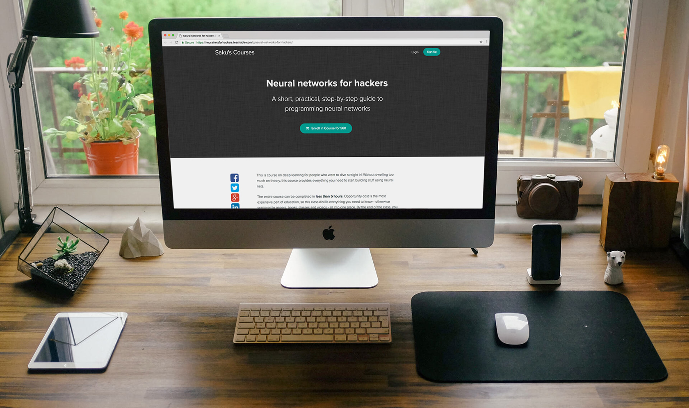

How to Create a MOOC in 28 Days – Indie Hackers

# How to Create a MOOC in 28 Days

[Saku Panditharatne](https://www.indiehackers.com/user/sknthla)  —
VR programmer, ex [@a16z](https://twitter.com/a16z)

25

 

I’ve just finished creating [Neural Networks for Hackers](https://neuralnetsforhackers.teachable.com/p/neural-networks-for-hackers), an easily digestible online course in neural networks. It took me around a month of part-time work, or around 150 hours in total. In the past 28 days, it’s grossed around $10k, and I project it will make around $5k a month from now on. This post is kind of a postmortem of what went right and wrong, and how it might be replicated.

## Day 1: Idea

Starting a lifestyle business had been at the back of my mind for a long time, mainly because I wanted some passive income so I’d be free to work on creative projects (in my case, VR games). I wasn’t sure exactly what to build, so I thought about what I had at my disposal —

- online Twitter audience of ~10k people, interested in tech, VR, economics and gaming

- 100k in free AWS credits

- computer graphics skills

- machine learning and neural networks skills

Some other ideas I had were building something like a balancing tool for game developers, or a cloud rendering service. The reason I decided to create a MOOC was that I saw a glaring problem with education in deep learning — the information you needed was buried deep within blog posts somewhere. It was often hard to know where to start, and you’d probably end up wasting a lot of time reading irrelevant or excessively academic information. Online education is in it’s early days, and the MOOCs available didn’t seem to quite match what people wanted.

The MOOC was a good fit with my online audience as well. My Twitter followers are generally tech-savvy curious people who love to learn. And “programmers” is a much larger set than something like “game developers”.

## Day 2–7: Draft

I spent the first week or so drafting the text of the course. My original idea was “neural networks through gifs” — I’d create a class where there were no equations, just diagrams explaining what each neural network would do. The reader could just flip through and get a sense for what each network structure did.

I realized this wouldn’t quite work, because most part of the difficulty for programmers today was about how to apply theory to practice. *Anyone could read a blog post about how a perceptron works — the hard part was understanding how and where to apply that knowledge.* I ended up settling on a series of blog posts plus a series of screencasts.

## Day 8: Indiegogo

My original plan was to create the course in full, and then release it to the public — but I was convinced by the online bootstrapping community to do otherwise. They told me I should sell pre-orders whilst I was finishing the product, which was fantastic advice. Mostly, it boosted my morale and confidence I wasn’t wasting my time.

The hardest part of creating an online campaign was creating a video, because I didn’t know what to put in it. [My campaign video](https://www.indiegogo.com/projects/neural-networks-for-hackers-education) was not great at all, but my thinking was ‘better done than perfect’ — it was better to have a video rather than no video, and better to not waste time on making a great video that I could have spent on the course.

In retrospect, I wish I had put more effort into it, since I needed to make a second marketing video later on, anyway. However, since I could leverage my online audience for quick sales, it was in some ways better to get something out there to validate the idea. I also published the draft, so people would know what was in the course, without the video needing to be good.

## Day 9–11: Audio recording

One of the biggest problems with online courses is completion — many people who start a MOOC will never finish. I had tried to make the writing as clear, readable, and engaging as possible, but I knew that people are busy and it wasn’t ideal for them to have to spend hours staring at a webpage.

I decided audio recordings were essential. That way people could listen to the class whilst coding or whilst in the gym. I originally wanted to hire a voice actor, since my own voice is somewhat quiet and a mix of different accents, but that would have been out of budget. I ended up settling on buying a high-quality mic, doing enunciation exercises, and recording it myself.

## Day 12: Diagrams

I tried creating the diagrams myself, but I quickly realized it was not my skill. I hired an up-and-coming design freelancer on Upwork to create the diagrams for me. It worked out pretty well — the diagrams cost around $400, and the quality wasn’t bad either.

## Day 13–20: Screencast prep

The hardest part of creating the course was the screencasts. The goal was to have 10 videos at around 10 minutes long where I’d go from theory to practice — taking a paper from arXiv and implementing it into Python. This required me to create a number of varied working examples of machine learning in practice. I relied pretty heavily on open source for this.

## Day 21–25: Screencast recording

Actually recording the screencasts was kind of like presenting a cooking show — “here’s one I made earlier,” “I’ll leave this one overnight,” etc. I’d start out just doing screen recordings, then I’d edit out all the repeated actions in iMovie, and finally create an audio recording over the top.

## Day 26: Putting it together

By this point, all the pieces were done. The freelancer had created the diagrams, the audio recordings were finished, and the screencasts were uploaded to YouTube. I tried using [Contentful](https://app.contentful.com/) to store and present everything, but soon realized that the platform [Teachable](https://teachable.com/) was much better, since it was made specifically for selling online courses. Unlike other MOOC platforms, Teachable had no specific requirements for video lectures.

## Day 27: Marketing

The first task was to send the class to everyone on Indiegogo who had already paid for the course. I had a few different mailing lists I’d gathered over the years to market to, all stored on MailChimp, and offered those people discount codes to sign up. Most of my sales (about 60%) come from Twitter, where I have a pinned tweet advertising the class. The other 40% came from content marketing posts I wrote on Medium.

Very soon, people started emailing me asking for bulk discounts for classes of students they were teaching. This was great for me — sales and credibility both in one! I wanted to encourage this behavior, so I added a note about bulk discounts to the front of the class page.

## Day 28: AdWords

The final step was to make this an ‘autonomous’ business. The ultimate goal was for the class to generate revenue without me having to pay much attention to it.

I set up some ads on Google AdWords with a budget of £20 per day, and ran some experiments. I was pleasantly surprised to notice that it would net me around 36 clicks per day, from which ~4 would result in sales. That gave me a customer acquisition cost (CAC) of £5 and a customer lifetime value (LTV) of £60! I increased the ad spend to £50 per day — I’m not sure how far this strategy will scale, but it looks promising.

## Conclusion

This is my first ever bootstrapped online business, and it’s been a lot more fun than I expected it to be. It’s kind of like a real life video game that makes money. It’s sort of fun to watch the stats of people starting and completing the class, watch ad spend fluctuate, watch content marketing posts blow up, and of course, watch the sales come in. The hardest part for me, was convincing myself that it would work, and dedicating time to an unproven thing. Nevertheless, I’m surprised at how much demand there is for online education, and it still seems like an area where the perfect product has not quite been figured out yet.

##  Subscribe to Indie Hackers

Get notified when we publish new stories from entrepreneurs.

1.
4

How did you manage to differentiate from the competition? There are free ML MOOCs (on Coursera etc) from high authority teachers. Was that an objection from some potential customers?

[   wimgz](https://www.indiehackers.com/user/wimgz)

·

[a month ago](https://www.indiehackers.com/forum/post/-KoMVH3MAEQwz8zCVeRe?commentId=-KoOEdXFw9NhgvsezE22)

·

reply

    1.
1

The differentiation was that this is less theoretical, easy to understand, and uses video screencasts of code examples.

[   sknthla](https://www.indiehackers.com/user/sknthla)

·

[a month ago](https://www.indiehackers.com/forum/post/-KoMVH3MAEQwz8zCVeRe?commentId=-KoOz_EFgSABJ8DSWLup)

·

reply

2.
4

How big was your social media/medium following when you started?

How much success do you attribute to that sort of free marketing vs paid AdWords?

[   throwaway](https://www.indiehackers.com/user/throwaway)

·

[a month ago](https://www.indiehackers.com/forum/post/-KoMVH3MAEQwz8zCVeRe?commentId=-KoNsuYO45PfP3iSWo6u)

·

reply

    1.
5

Hi there - I had around 10k Twitter followers and 3k Medium followers. The sales breakdown was about 50% Twitter, 30% Medium, 10% other free, 10% paid marketing

[   sknthla](https://www.indiehackers.com/user/sknthla)

·

[a month ago](https://www.indiehackers.com/forum/post/-KoMVH3MAEQwz8zCVeRe?commentId=-KoNuPnULQdzxTF4BBQn)

·

reply

        1.
0

Oops was trying to edit, accidentally deleted and now can't undelete my comment.

It's good to know how much it took for the marketing effort. Thanks again for sharing your story and the relevant stats!

[   throwaway](https://www.indiehackers.com/user/throwaway)

·

[a month ago](https://www.indiehackers.com/forum/post/-KoMVH3MAEQwz8zCVeRe?commentId=-KoPv2r2nSFp_AdUSHbh)

·

reply

        2.
0

[deleted a month ago]

[   throwaway](https://www.indiehackers.com/user/throwaway)

·

[a month ago](https://www.indiehackers.com/forum/post/-KoMVH3MAEQwz8zCVeRe?commentId=-KoOE2Eem6HLi86A-rfc)

3.
3

just wanted to say thanks for this great content. i'm just kicking around the idea of exploring a course and this provides a really nice roadmap for what i should be thinking about. congrats on your success!

[   czue](https://www.indiehackers.com/user/czue)

·

[a month ago](https://www.indiehackers.com/forum/post/-KoMVH3MAEQwz8zCVeRe?commentId=-KoRKYWGOaJQY5XVdf7P)

·

reply

4.
3

Thanks for sharing!

How did you market your Indiegogo campaign? What channels did you use besides your Twitter followers?

[   wimgz](https://www.indiehackers.com/user/wimgz)

·

[a month ago](https://www.indiehackers.com/forum/post/-KoMVH3MAEQwz8zCVeRe?commentId=-KoNpC6VSOtkijeFhg2b)

·

reply

    1.
3

Hi there!

I published about 20% of the course content as content marketing posts on Medium, which worked extremely well. Another thing that worked was giving the course away free to people with large social media followings. I also tried posting in Facebook and reddit groups but that was less successful.

[   sknthla](https://www.indiehackers.com/user/sknthla)

·

[a month ago](https://www.indiehackers.com/forum/post/-KoMVH3MAEQwz8zCVeRe?commentId=-KoNqbIT8y0O9a-kvkI7)

·

reply

        1.
0

Was it your first try at selling a course? Did you have to tweak some parts of the course after the launch based on feedback from students?

[   wimgz](https://www.indiehackers.com/user/wimgz)

·

[a month ago](https://www.indiehackers.com/forum/post/-KoMVH3MAEQwz8zCVeRe?commentId=-KoNurdAPD1RM-BxcT8G)

·

reply

            1.
1

Yes, this is my first try.

One thing I changed was greater emphasis on the screencasts - that proved to be much more popular than a straight up course.

[   sknthla](https://www.indiehackers.com/user/sknthla)

·

[a month ago](https://www.indiehackers.com/forum/post/-KoMVH3MAEQwz8zCVeRe?commentId=-KoNvepSQL4KZTltW12P)

·

reply

5.
2

Hi Saku! Thanks for creating this content. Is there a place where I can see reviews of the MOOC?

[   chinpokomon](https://www.indiehackers.com/user/chinpokomon)

·

[25 days ago](https://www.indiehackers.com/forum/post/-KoMVH3MAEQwz8zCVeRe?commentId=-KoV31jYKr_i1gIGdyJI)

·

reply

    1.
1

Not yet, as not many people have completed it yet. You can check out the draft content here [http://boiling-spire-94433.herokuapp.com](http://boiling-spire-94433.herokuapp.com/) or a sample screencast here https://www.youtube.com/edit?o=U&video_id=3rWiyUuPlf8

[   sknthla](https://www.indiehackers.com/user/sknthla)

·

[25 days ago](https://www.indiehackers.com/forum/post/-KoMVH3MAEQwz8zCVeRe?commentId=-KoV9Yc-mvaUG8R5TBtG)

·

reply

        1.
0

The youtube link you shared takes me to an editing page :(

[   chinpokomon](https://www.indiehackers.com/user/chinpokomon)

·

[24 days ago](https://www.indiehackers.com/forum/post/-KoMVH3MAEQwz8zCVeRe?commentId=-KoZ5o-aLQTf0lqGN9Xb)

·

reply

            1.
1

here https://www.youtube.com/watch?v=3rWiyUuPlf8

[   sknthla](https://www.indiehackers.com/user/sknthla)

·

[24 days ago](https://www.indiehackers.com/forum/post/-KoMVH3MAEQwz8zCVeRe?commentId=-KoZNdgSfK6J0FNfSofp)

·

reply

                1.
1

Cheers! I love the Paper based approach.

[   chinpokomon](https://www.indiehackers.com/user/chinpokomon)

·

[23 days ago](https://www.indiehackers.com/forum/post/-KoMVH3MAEQwz8zCVeRe?commentId=-KoceIjxFKLPG2mAfAzP)

·

reply

6.
2

I professionally recorded and edited a bunch of videos on best practices for freelance consulting. Right now I give them away for free to subscribers of CodeForCash, but I would love to collaborate with someone to turn them into a MOOC or separate online course. Let me know if you're available!

[   CodeForCash](https://www.indiehackers.com/user/CodeForCash)

·

[25 days ago](https://www.indiehackers.com/forum/post/-KoMVH3MAEQwz8zCVeRe?commentId=-KoSopxueEjbap-iekfe)

·

reply

    1.
2

Would love to. [saku.p@cantab.net](https://www.indiehackers.com/@sknthla/how-to-create-a-mooc-in-28-daysmailto:saku.p@cantab.net)

[   sknthla](https://www.indiehackers.com/user/sknthla)

·

[25 days ago](https://www.indiehackers.com/forum/post/-KoMVH3MAEQwz8zCVeRe?commentId=-KoT_wQXX2VLOfcIiDiA)

·

reply

        1.
0

Awesome!
Email sent!

[   CodeForCash](https://www.indiehackers.com/user/CodeForCash)

·

[22 days ago](https://www.indiehackers.com/forum/post/-KoMVH3MAEQwz8zCVeRe?commentId=-KogyXJuxqbqJDZuEUF0)

·

reply

7.
2

Thanks for sharing and congrats, that's quite some success you have (I created a course myself, it took much longer to produce and doesn't have (yet) those returns). I'd like to ask you two questions. 1) You don't offer any free preview. Is this on purpose? 2) How did you come up with the price? Did you experiment with it?

[   bewe](https://www.indiehackers.com/user/bewe)

·

[a month ago](https://www.indiehackers.com/forum/post/-KoMVH3MAEQwz8zCVeRe?commentId=-KoR7ju1Gml0e2fxGxqX)

·

reply

    1.
0

Hey there. I probably should offer a free preview - I think it would help a lot with sales - though the Teachable class outline does the job right now. I posted the entire draft content of the course on the Indiegogo page as I was running the campaign, and published about 20% of the edited content as content marketing posts. (You can see it here: https://boiling-spire-94433.herokuapp.com/)

I experimented with the price - started at £30-£90 for Kickstarter rewards and ended up settling somewhere in the middle.

[   sknthla](https://www.indiehackers.com/user/sknthla)

·

[a month ago](https://www.indiehackers.com/forum/post/-KoMVH3MAEQwz8zCVeRe?commentId=-KoRCfsdMgewjk2EQtaw)

·

reply

8.
2

I did your course, and personally I did not find it useful. I hope you accept this as constructive criticism. Your course title suggests a very hacker friendly approach to learning this material. So I expected lots of examples and code walk throughs and practical projects. There is very little of that. Each section has a small audio snippet with some diagrams and a paragraph of text.

I even funded your indiegogo campaign because I had a different expectation for the course based on your presentation. I really hope you take the income and invest it back in developing more material that actually goes deep in doing projects with TF and such, and diving into the actual use cases with projects for the various topics you discuss.

[   viperfx](https://www.indiehackers.com/user/viperfx)

·

[a month ago](https://www.indiehackers.com/forum/post/-KoMVH3MAEQwz8zCVeRe?commentId=-KoOG3V-_JHg9xCPcxal)

·

reply

    1.
0

[deleted a month ago]

[   sknthla](https://www.indiehackers.com/user/sknthla)

·

[a month ago](https://www.indiehackers.com/forum/post/-KoMVH3MAEQwz8zCVeRe?commentId=-KoOybpvCpqCFqyhqvWa)

9.
1

How did you build such a large following on Twitter and Medium?

[   geofftucker](https://www.indiehackers.com/user/geofftucker)

·

[25 days ago](https://www.indiehackers.com/forum/post/-KoMVH3MAEQwz8zCVeRe?commentId=-KoTlJywE2NZhthGwaX9)

·

reply

10.
0

100k of free AWS credits??!! Wow...how did you manage to get that?

[   vcteo](https://www.indiehackers.com/user/vcteo)

·

[24 days ago](https://www.indiehackers.com/forum/post/-KoMVH3MAEQwz8zCVeRe?commentId=-KoXMkXIHaX2RxUoo7if)

·

reply

    1.
0

I was briefly part of a startup accelerator a few months ago.

[   sknthla](https://www.indiehackers.com/user/sknthla)

·

[24 days ago](https://www.indiehackers.com/forum/post/-KoMVH3MAEQwz8zCVeRe?commentId=-KoXXO61D_5I_uOCuYCa)

·

reply

        1.
0

Wow!!!

Great progress much success. Hey, I'd like to talk to you offline about/regarding the AWS credits via the Accelerator program.

Can I give you an email for an offline discussion??
thanks
-bruce

[   tsmith](https://www.indiehackers.com/user/tsmith)

·

[23 days ago](https://www.indiehackers.com/forum/post/-KoMVH3MAEQwz8zCVeRe?commentId=-KoeCCD8vfZ-UVOspukm)

·

reply

footer: comments, links, author info, etc.