How to Create and Practice Flashcards Like a Boss

# How to Create and Practice Flashcards Like a Boss

[David Handel, MD](https://medium.com/@iDoRecall?source=post_page-----b7efb5a53293----------------------)

[Sep 25](https://medium.com/@iDoRecall/https-medium-com-idorecall-how-to-create-and-practice-flashcards-like-a-boss-b7efb5a53293?source=post_page-----b7efb5a53293----------------------) · 20 min read

The most powerful flashcards stimulate metacognition.

Okay, you’ve read some articles citing cognitive psychology research about how memory works. Maybe you even accept that retrieval practice, spaced over time, is the most powerful tandem for building durable long-term recallability of the concepts and facts that you want to remember. After all, these principles really are backed by science. The “[testing effect](https://psycnet.apa.org/record/2014-09454-014)” is the best way to train your brain’s recall ability.

There is no easier way to leverage the benefits of retrieval practice than with flashcards. You don’t need a friend or teacher to quiz you. Flashcards are always available at your beck and call.

But now you want to know 1) *What are the best practices for creating the most effective flashcards?* and 2) *How should I practice them to get the maximum ROI of my time?* Those two questions are the most frequent reasons that users reach out to us in chat support at [iDoRecall](https://idorecall.com/). We’re going to address them in-depth right here.

# **First a bit of housekeeping**

Many readers of this article are already iDoRecall (iDR) users and we’ll point out iDR-specific points where appropriate throughout the article. For instance, in iDR, we call our spaced-repetition flashcards **recalls**. But for the sake of our more general audience, I’ll refer to recalls as flashcards except when addressing some feature or brain-hack that’s specific or uniquely available in iDR. I will be using some images from the iDR user interface here so when you see the word *recalls *in the UI, think *flashcards*.

We’ll break this discussion into two parts: *How to create stick-to-your-synapses flashcards* and *Here’s how to practice flashcards for optimal effect*. We also will feature a special section about memorizing large lists of items. This is an important topic that deserves in-depth treatment.

I want to make it clear from the start that while there is science behind many of the “best practices” that follow, several of the tips are born more out of art and the personal experience of the author (moi), rather than science. Lastly, I hope that you will share in the comments section, your ideas for optimizing recalls and practice tactics that have yielded the maximal positive effects for you.

# **How to create stick-to-your-synapses flashcards**

**Don’t create a flashcard for a concept that you don’t yet comprehend. **Before we go too deep, you should be aware that *flashcards are utilized for building easy recall of the things that you’ve already learned*. If you read something that doesn’t make sense to you, and you just can’t yet wrap your head around it, go find another source that explains it in a way that delivers that *aha* realization. *Flashcards are not for learning*. You should live by the maxim “Learn before you memorize!” This is the reason why it’s not a great idea to go acquire a large set of flashcards created by someone else. Additionally, many third-party flashcard collections contain a lot of content on each flashcard. Flashcards are not meant to be an alternative format to replace a textbook. The word *flash* is there for a reason!

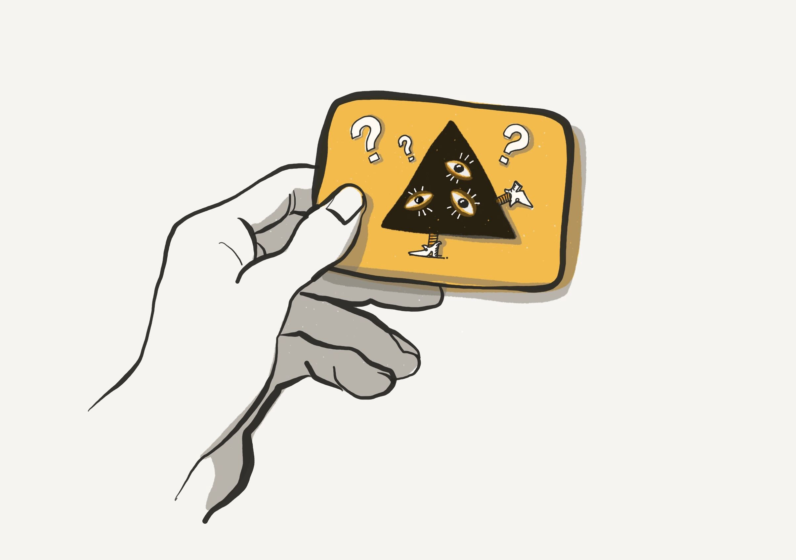

Never create a flashcard for a concept that you don’t yet understand. Flashcards or for training your memory. “Learn before you memorize!”

**Create your flashcards while consuming your learning content.** (When I use the word *content*, I’m referring to the academic materials that you can read, watch or listen to.) That way you will know that you have included everything that you want to remember in your flashcard collection. I am a huge proponent of *reading things only once*. Rereading is one of the biggest inefficiencies that cause students to lose precious time and set themselves back. Don’t reread. Don’t read, make highlights and then reread highlights over and over. Don’t read and make notes and then read your notes over and over. Don’t create your own summary and then read and reread your summary. All of those activities are passive approaches to remembering what you’ve learned. The only active approach is to *practice retrieving what you learn from memory*. So here is the blueprint for achieving academic success: Read once and create flashcards as you work your way through the material. Capture all of the concepts and facts that you want to ensure you’ll remember. Once you have *processed* that piece of learning content, meaning once you have read it in its entirety and created the necessary flashcards, mark it as completed. Then use the flashcards and retrieval practice as your primary tools for remembering the key concepts and facts forever.

**When you create a flashcard, draft the question and answer from memory. **Even though you have the opportunity to see the source content while you are creating a flashcard, you should focus all of your attention on the drafting of the flashcard**.** You should use the creation time to practice memory retrieval as you craft the text in your own words. It’s far more valuable to use your own words and your personal way of explaining a concept rather than copy|pasting from the source. (Users of iDR demanded that we facilitate easy copying of text from the source file and we have with some regret complied. When you use the iDR *highlight tool* to create a recall, the highlighted text is scooped up and pasted into the answer field of the recall. But we strongly recommend that you reword that text into your own wording and understanding.)

**On every flashcard, ask only one question and whenever possible, only have one answer**. You’re in control and you have the ability to limit the flashcard to asking a single question. You should always exercise this restraint.

**The most challenging flashcards are the ones where you have to retrieve a large collection of items from memory**. Sometimes the answer requires a listing of multiple items. Answers that have a large collection of items can be extremely challenging to recall. In a special section below, we’ll discuss tactics for dealing with this often-rigorous burden.

**Keep the question concise but make it just long enough to be explicit and clear**. Anyone reading the question should understand what you’re asking, even if they don’t know the answer. Consider your future self to be that theoretical *other person*. If the question on your flashcard is ”Lithium?” will you always know exactly what is being asked? You might say “Sure, it’s my flashcard and I know what I’m asking.” But a year from now you might forget. Maybe the implied question is “What group does lithium belong to on the periodic table?” or maybe it’s something very different. Don’t put your future self in the position of trying to figure out exactly what you were originally asking.

**Carefully craft your question to elicit the best and most complete answer**. The question should never contain the answer but its wording should help you retrieve it from memory. Thoughtfully compose your questions to best interrogate your memory. Think like a trial attorney who is examining a witness.

**It’s better for the question to be longer than the answer**. In fact, I’ll go further. The question should typically be longer than the answer because you are not trying to memorize an entire textbook with a single flashcard. Short answers rule. Don’t worry. Even a short answer usually will trigger a lengthier internal discourse with your inner voice. Get granular with each flashcard! Think of a flashcard as a custom piece of gym equipment devised to exercise your recall for a single concept or fact! Complex concepts are best divided up into a group of individual granular flashcards.

**Keep your answers short, simple and specific so that you can stimulate synaptic strengthening**. Make the first of these three S’s your mantra for crafting the best answers.

**It is far easier to retrieve a memory when you use a combination of words and images to encode it. **Add images to the question or answer to take advantage of the power of [dual coding](https://www.learningscientists.org/blog/2016/9/1-1), The combination of text and imagery is more powerful than either alone.

Adding imagery to text builds more recallable memories. (iDR UI)

**You can use an image as the question**. Someone’s face could be the question with their name as the answer. You can also create a question with a graphic that is missing a label, and then show the fully-labeled graphic as the answer.

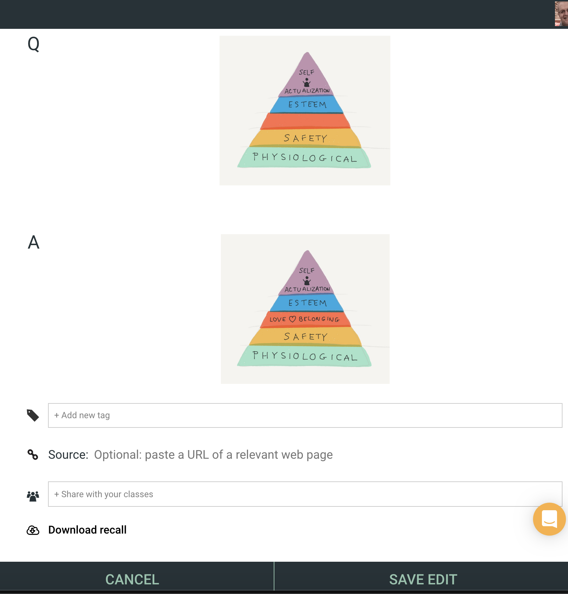

The question shows Maslow’s hierarchy of needs pyramid with one item missing. The answer reveals the missing item. (iDR UI)

**Use colors and rich text formatting to make the text more memorable**. Make the flashcard more interesting and stimulating and it will enhance recallability. Make liberal use of bold, italics, background/foreground colors, and font sizes to make key passages of the text jump out. If you have a lot of text, highlight or bold the key or difficult-to-remember points.

**Use humor, narratives and personal examples to make flashcards more interesting**. Use humor and real-world funny examples. Personal examples are especially powerful. [Humor](https://www.learningscientists.org/blog/2019/9/5-1) and storytelling make it a lot easier to remember just about anything.

Use humor and narrative to make your knowledge more memorable. Adding your personal fish-tale about the big one that got away to an ichthyology related flashcard can make it very memorable.

**Learn to create flashcards for the most important facts that represent the core material you’ll be expected to know**. It’s important to use discretion and only add to your collection flashcards for the facts and concepts that you either *need or want *to remember. There is an inherent future practice “burden” for each flashcard that you create. So, learn how to curate your knowledgebase. Create a barrier to entry. Don’t make flashcards for unimportant things.

**Create flashcards for both directions**. Some flashcard apps enable you to reverse practice flashcards, showing you the answer (definition) first and then showing you the question (term) after you “turn it over.”. The most common use-case meriting this functionality is for mastering a foreign language. Here you want to be able to practice seeing the definition of the word in your language,(assuming here that your native language is English) e.g. “hello” so that you can retrieve from memory the foreign language word, e.g. “bonjour”. It’s important in these appropriate scenarios to have cards that function in both directions. (In iDR we don’t offer this functionality for several reasons but we recommend that you create a recall for each direction so that the spaced-repetition algorithm can separately schedule the next review date of each version based on how well you are performing with each.)

**Use screengrabs liberally. They are wonderful for formulas and easier to use than LaTeX**. Screengrabs are an easy way to enhance questions and answers, (Here’s another iDR specific tip. You can add formulas to the Q and A fields using a[LaTeX](https://www.latex-project.org/) formula entered from iDR’s rich-text editing toolbar. But it is far easier to take a screengrab of the desired formula and upload that into the Q or A field.)

**Break it down into its component parts and test your comprehension**. It can be challenging to memorize long and complex scientific equations. There are some approaches that you can take that are short of full-blown regurgitation and instead assess your understanding. You can create a small set of flashcards for an equation that tests your recall of its derivational steps or inquires why specific components are present. You should test yourself about the meaning of the symbols in an equation and ensure that you know the units of measurement. You can ask *why something is squared* to test your grasp.

**Flashcards shouldn’t be overlooked as a powerful tool for use in all of the disciplines of the social sciences and humanities**. Memorizing poetry and lyrics leads to a deeper understanding of the piece and can give you a starting point for expressing your own views of the human experience. You can present a line or stanza as the question and ask for the next as the answer. We live in a world of shrinking attention spans and our minds are becoming limited to the maximum number of characters in a tweet. The application of memorization in the arts expands our minds.

**Tags are iDR’s superpower for organizing your recalls and library items**. Use tags to organize subjects, topics, and subtopics. [Tags are much more powerful than using folders](https://zapier.com/blog/how-to-use-tags-and-labels/) for organizing and finding things. So we don’t even offer folders. You should add a tag to every relevant recall and library item to identify which of your classes it is related. Use tags with names like “Biology 101” and “Macroeconomics”. Then you can add additional tags such as a chapter number, topic or subtopic. This makes it easy to search for specific groups of recalls and manually take them into practice. iDR enables you to take advantage of the benefits of [interleaving and variation](https://medium.com/better-humans/how-to-unlock-the-amazing-power-of-your-brain-and-become-a-top-student-369e5ba59484) and make your daily scheduled practices more effective at building robust recallability. But sometimes, such as the day before a quiz or a major exam, you’ll want to manually search by tag for the relevant recalls and give them an extra practice.

**Append a metacognitive question to the end of the answer**. Besides dutifully utilizing spaced retrieval practice, [skillful application of metacognition](https://medium.com/better-humans/how-to-read-academic-content-once-and-remember-it-forever-e44f26d82566) is probably the next most powerful tool that you can use to perform at an elite academic level. You could characterize this type of internal dialogue as a form of quality control and a method for more actively engaging with the content that you are consuming. It’s good to talk to yourself and during this dialogue check in with *how well am I paying attention?; Am I thinking about where the concepts and facts that I’m encountering fit within my existing knowledge?;* and a host of other questions that you should be asking yourself. It’s a good idea to ask a metacognitive question in the answer field that’s customized for the flashcard’s context.

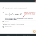
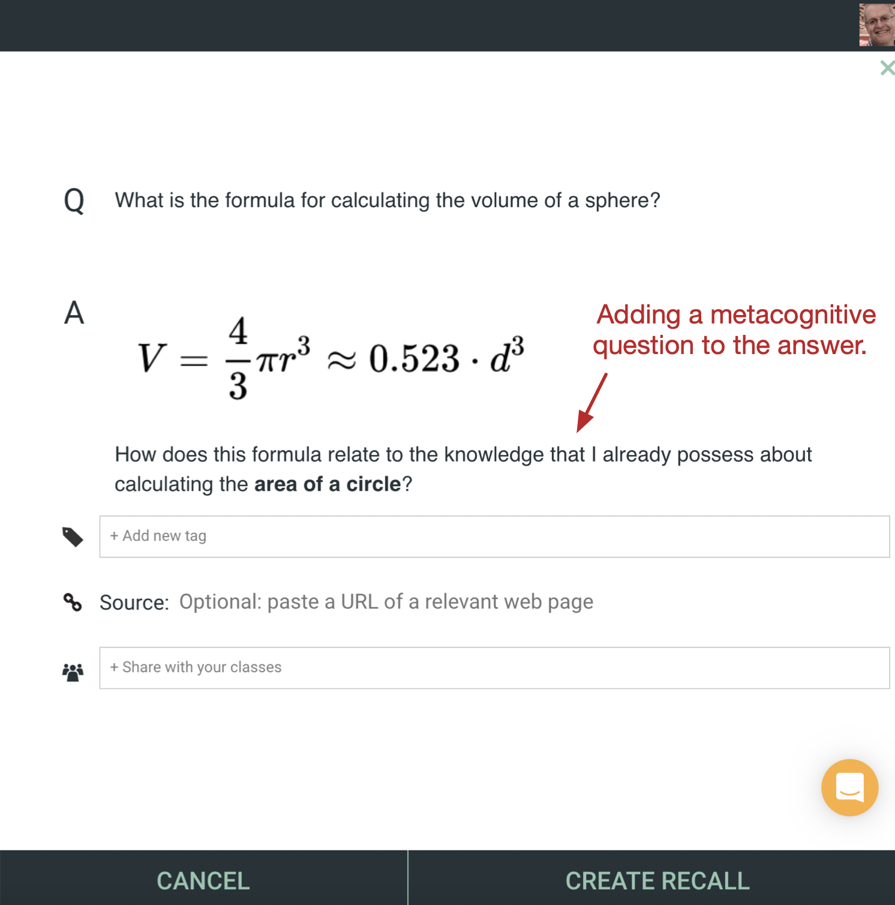

You should use the answer in your flashcards as an opportunity to exercise some metacognition and tie the flashcard’s nugget of knowledge to your existing knowledgebase.

**Cloze deletion type questions are easily simulated in iDR**. This is a very popular type of question that goes something like this:

> Question: In the year […], Japan attacked Pearl Harbor.
> Answer: In the year 1941, Japan attacked Pearl Harbor.

Cloze deletion questions are very useful for placing some *training-wheels* on a particular memory.

**Open-ended questions are more challenging than cloze deletion type or multiple-choice questions**. Challenging your recall ability is what cognitive psychologists call a [desirable difficulty](https://bjorklab.psych.ucla.edu/wp-content/uploads/sites/13/2016/04/EBjork_RBjork_2011.pdf). That’s a good thing. Further, open-ended questions offer the advantage that they don’t engender the risk of being [fooled by fluency](https://www.questia.com/magazine/1G1-464981040/fooled-by-fluency-understanding-illusions-and-misjudgments).

**Use flashcard answers as an opportunity to build associations with other parts of your knowledgebase**. You can think of your total collection of memories and knowledge as an internalized Intranet. [Memories are associative](https://f1000research.com/articles/8-457) and the triggering of recall of one memory causes other memories to rise into consciousness. We understand the neuroscience of this phenomenon. It involves the unit of memory called an* engram*. I’ve [discussed it before](https://medium.com/@iDoRecall/the-neuroscience-of-learning-memory-part-iii-6635da6e03c9) if you’re curious. The point that I want to make here is that you can hack your memory by referencing other parts of your existing knowledge in the answer of a flashcard.

**Craft *why* questions for your flashcards. Knowing *that* something exists or is true is a shallower level of knowledge than understanding *why* it is what it is.** For example, knowing the answer to *what is cancer?* is not as profound a level of knowledge as understanding *why cancer exists in nature*.

**Create multiple flashcards for the same concept that examine it from different viewpoints**. Different teachers may describe the same challenging concept from varying perspectives that may give you additional nuances of understanding. When you are dealing with a complex or very abstract concept, you should test your recall with a small set of flashcards that elicit varied nuances of the idea. This is a fabulous technique for maintaining a deep understanding of a difficult-to-grasp concept.

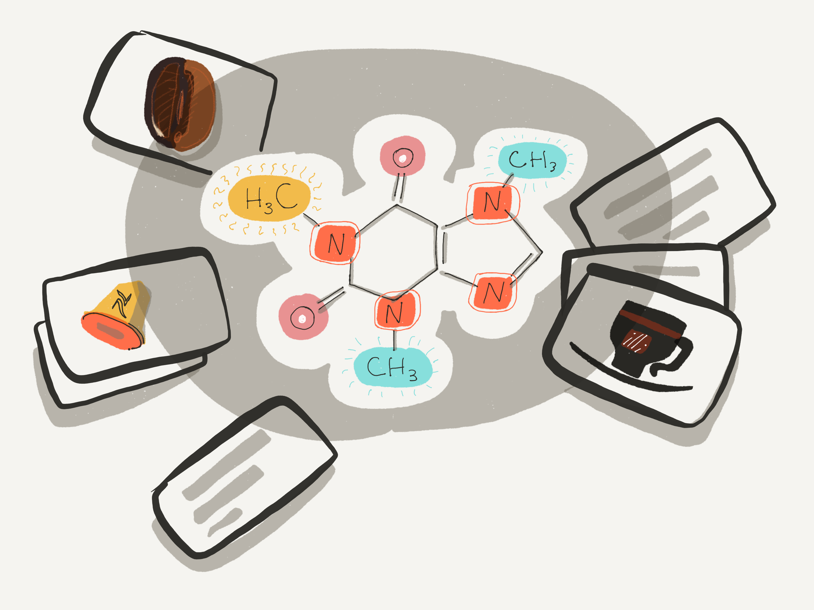

When dealing with an abstract and complex concept, create a small set of flashcards that test you from varying viewpoints and nuances.

**If you are going to use flashcards others have made, curate them carefully**. Students often like to take a shortcut and utilize flashcards created by other people. After considerable pressure, iDR began to offer the ability to import flashcards created on Quizlet and Anki. Some of the problems associated with using 3rd party flashcards include violating the “Learn before you memorize!” maxim and potentially adding misinformation to your knowledgebase. Additionally, you are more likely to create a bloated and difficult-to-manage collection of flashcards if you start hoarding easy-to-add 3rd-party flashcards. If you craft all of them by yourself, you’ll be stingier with your collection.

# **How to memorize large collections of items**

Okay, let’s deal with the seemingly unavoidable scenario, flashcard answers that consist of a large collection of items that you’ll be required to retrieve from memory. Having a long list as the answer is a setup for being fooled by fluency. You know the scenario. You read the question and try to think of the list of items in the answer. Then you turn it over and look at the list. You’ve successfully recalled 4 items on the list and you look at the other 2 and tell yourself “yep, I knew those too.” This phenomenon occurs because you recognized those items. You’ve seen them before and you are experiencing what cognitive psychologists call “fluency” with them. But being fluent is not the same as being capable of actively retrieving them from memory.

So, how do you mitigate this situation? The first thing to realize is that that it is more challenging to memorize a list that is a *set* than if it’s an *enumeration*. A *set* is a collection of well-defined unique items that can occur in any order. An example would be a set of stone fruits that contains the entries “peach, plum, nectarine, apricot, and cherry” It doesn’t matter in what sequence that you answer this list so long as you remember each item. On the contrary, an enumeration is a collection where the order of the answer does matter. An example would be where you are asked to provide the first ten digits of Pi. The order of the 10 digits matters. (BTW, the world record for memorizing the digits of Pi is 70,000!).

If you are dealing with a challenging long set of answers, try to break it down into manageable chunks. In other words, create flashcards with questions whose answer is a subset of the complete set you need to memorize. Then create a small group of flashcards with answers whose subset’s cover the entire set. For example, using the set of stone fruits:

*> Q: Can you name two stone fruits that are very close genetic relatives with the biggest difference that one has a gene for fuzz and the other doesn’t?*

*> A: Peaches and nectarines.*

*> Q: Name two stone fruits that are hardier in the garden than peaches, nectarines, and apricots.*

*> A: Cherries and plums*> .
and so forth.

Breaking down enumerations with cloze deletion type questions that reveal a portion of the sequence while asking for an intervening member is a popular approach. For example, using the 10 digits of Pi:

*> Q: The first 10 digits of Pi beginning to the right of the decimal place are 3.1415_26535*

*> A: 3.1415****> 9****> 26535*
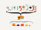
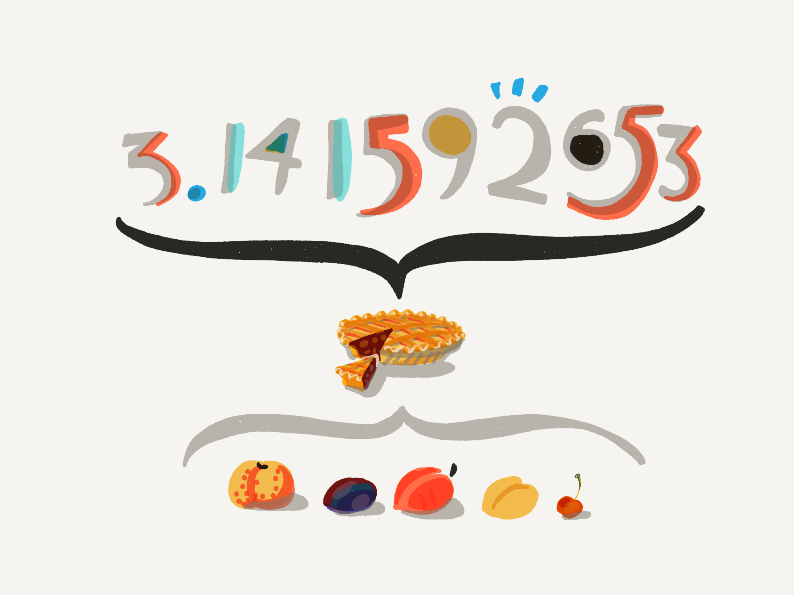

You can also add imagery to the answers of flashcards containing long sets and enumerations to help make them more memorable.

**If you have to deal with a long-list answer that you find too challenging, it’s time to whip out your toolbox of *mnemonic devices*.** These are a bag of tricks for giving your memory an assist.

**One of the most common of these tools is the acronym**. For instance, the order of precedence in math operators and coding is:

**P**arentheses, **E**xponents, **M**ultiply, **D**ivide, **A**dd, and **S**ubtract = **PEMDAS**.

Rhymes are a wonderful tool for memorizing enumerations. For example, to remember the rules for the ordering of “E” and “I” in words:

**> I**>  before **> E**> , except after **> C**

> Or when sounded like “**> A**> ” as in n**> ei**> ghbor, w**> ei**> gh and w**> ei**> ght

> Or when sounded like “**> eye**> ” as in h**> ei**> ght
> And “w**> ei**> rd” is just **> weird**

Other mnemonic devices include “name mnemonics” such as the classic **ROY G. BIV** for colors of the spectrum: **R**ed, **O**range, **Y**ellow, **G**reen, **B**lue, **I**ndigo, **V**iolet.

Another variety is the “word or phrase mnemonic”. An example is the use of the word mnemonic** SCALP** to memorize the layers of the scalp: **S**kin, dense **C**onnective tissue, epicranial **A**poneurosis, **L**oose areolar connective tissue, and **P**eriosteum. There are several [other categories](https://www.learningassistance.com/2006/january/mnemonics.html) of mnemonic devices.

One more mnemonic device that deserves special mention is the [memory palace](https://www.learningscientists.org/blog/2019/9/18/guest-post-the-memory-palace-how-to-remember-just-about-anything) also known as the *method of loci*. It’s especially helpful for memorizing enumerations since they require a sequential order. Here you picture yourself walking through a real or imaginary location. I like “taking a walk” into my house and then proceeding through the rooms in a particular order. I then picture the different items in the list placed in each location along the way. It helps to use elaboration, often with humorous and even ridiculous imagery to make each mental image more memorable. An example would be imagining the enumeration item plopped in your bathtub and the tub is full of Rocky Road ice cream. We have a tremendously powerful capacity for spatial memory that helps make this technique very effective.

# Here’s how to practice flashcards for optimal effect

**Never ever ever turn over a flashcard until you have made a solid effort to retrieve the answer from memory. **This is rule #1! It’s called *retrieval practice* for a reason. Always make your best effort to recall the answer. If you are unsuccessful, consciously admit that you don’t recall and only then turn the flashcard over. [Even a failed attempt at retrieval](https://sites.williams.edu/nk2/files/2011/08/Kornell.Hays_.Bjork_.2009.pdf) will help make the answer more recallable next time. But if you simply turn over the flashcard and recognize the answer, you will deceive yourself into believing that you knew the answer and will have accomplished zip.

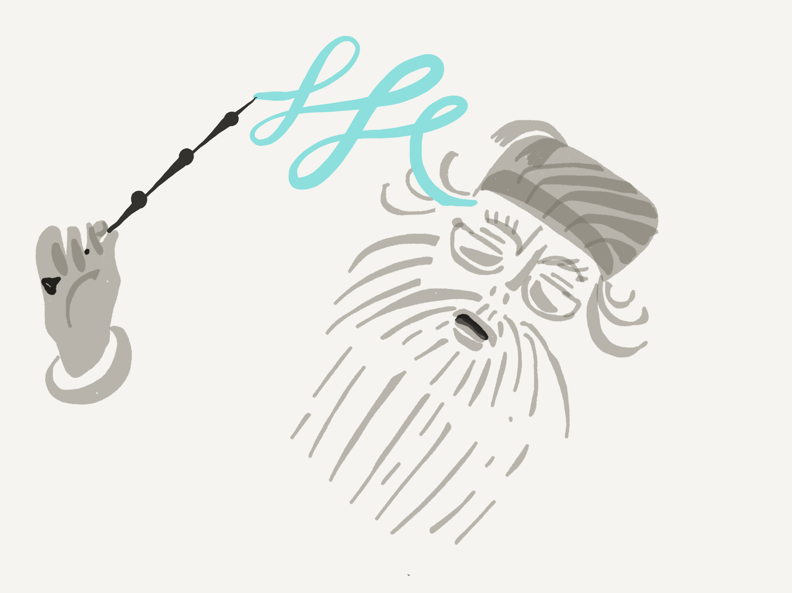

Always conjure up the answer or admit to yourself “I don’t recall” before you turn over a flashcard!

**Use tags for each of your courses and additional tags for different topics within a subject**. Practice different sections of your course together if you like. Then study the whole subject allowing [interleaving](https://youtu.be/l-1K61BalIA) to enhance the power of your practices.

**Take advantage of the spaced-repetition algorithm in iDoRecall but also manually study your recalls**. Every day, the PRACTICE tab will contain a queue of recalls that the algorithm has determined you are close to forgetting. Practice this set of recalls daily and keep on top of the work. Generally, it will only take a few minutes to maintain a large body of knowledge. Older recalls in your collection will typically appear in your daily practice only a few times a year. Remember that you can and should utilize the option of manually taking selected sets of recalls into practice. If it’s the day before a big exam, and you’ve been tagging your recalls by their related course, you can search for the course’s recalls and go through retrieval practice with them one more time. You can also sort your recall collection by *Grade* (the average star rating you’ve been giving them during practice) and take the ones that you are struggling with the most into an extra retrieval practice.

**When you’re on-the-go on, perform retrieval practices on your phone**. iDR also works on mobile device browsers (no app is needed). While the small screen may be suboptimal for reading long PDFs and creating linked recalls, performing your retrieval practice sessions on a phone is a breeze. Doing a retrieval practice while you’re out-and-about not only may take advantage of some free moments in your day, retrieval practice in different contexts helps build new associations that make those memories even more easily retrievable in the future.

**Respond out loud. It’s good to talk to yourself and promotes metacognition**. Read the question and answer out loud when performing your retrieval practice. Metacognition, “thinking about your thinking” engages you deeper in the learning process and having an out-loud conversation when you read the question and review the answer is a worthwhile habit.

**Use the R field in iDR’s PRACTICE mode. R stands for your response before you “turn over” the recall**. It’s optional but typing in the answer helps establish a deeper connection in your memory. Even if you are wrong and see the correct answer moments later, it will make you think more deeply.

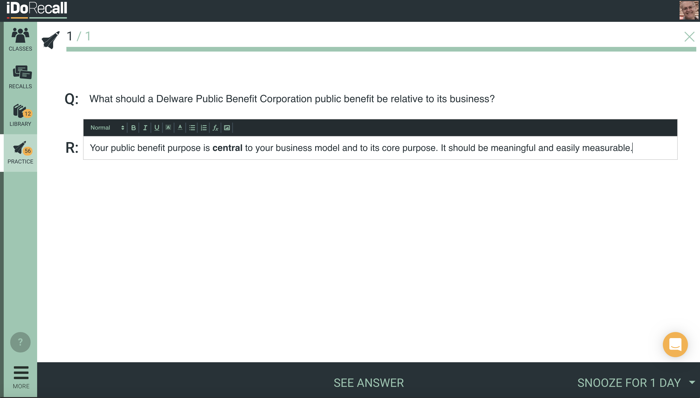

Use the optional R field in the iDR UI to type in your response before you turn over the recall. (iDR UI)

**Edit cards during practice to fix errors, add newer learnings and highlight areas where you are struggling**. With iDR, we make it easy to edit recalls while in the flow of retrieval practice. Use red to highlight a part of the answer where you are particularly struggling. Or even add a note to yourself for the next time you practice. That way you can add a bit of context and metacognition to your practice sessions.

**If you struggle with an answer, refresh your memory by going back to the source content**. With iDR, you can create your recalls as you consume your learning materials in the app. This gives you the opportunity to refresh your memory during retrieval practice. There is a source link on the back of these recalls that if clicked, will open the relevant file or video in your library at the exact spot where you created the recall. For you purists, truth be told, videos are reopened 10 seconds before the exact location in the timecode where you created the recall so that you can get your bearings as you begin to watch the relevant segment of the video.

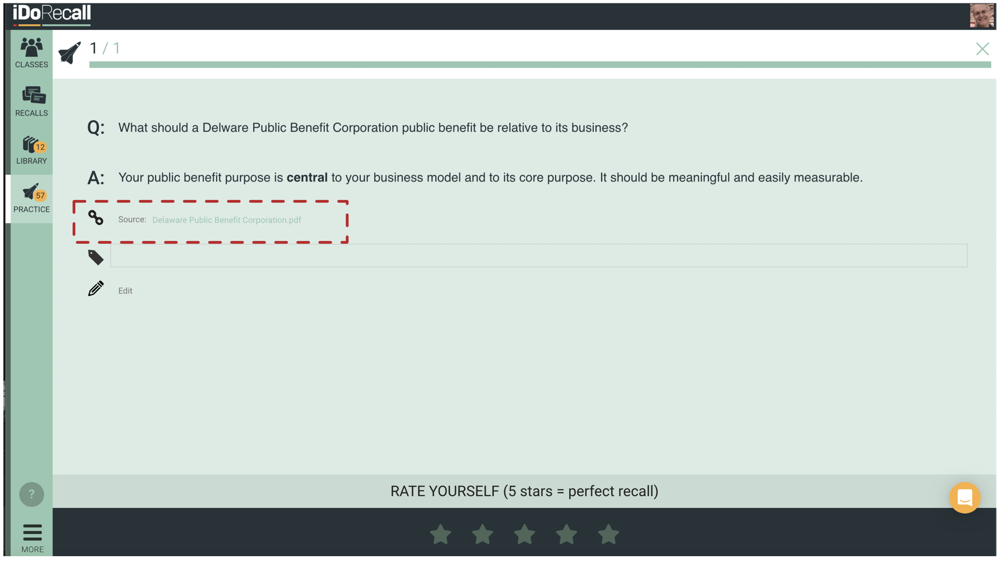

In iDR, when you “turn over” a recall during retrieval practice, if you struggled with the answer, you can click the source link (inside the red-dashed box above) and the source learning file in your library will open at the exact location where you created the recall. (see the next image)

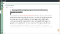

After you click the source link, the source learning file in your library will open at the exact location where you created the recall. If the source is a video, the video will open 10-seconds before the relevant timecode when you created the recall.

**Study at different times of the day and at multiple locations to create variation and new contexts that result in additional pathways in your brain to the answer**. It’s very popular to have a special study location and favorite time of day to do your learning. But it’s actually beneficial to building robust recallability if you add variety to the places and times of day that you perform your retrieval practice. Every time you retrieve a memory, it is altered and the context of where you are and what’s happening around you can add new associations that create new pathways for retrieving that nugget of knowledge from memory. Remember the classic neuroscience maxim “neurons that fire together wire together.” So go create some new patterns of wiring.

**Practice just before you sleep and take advantage of sleep’s memory consolidation powers**. The process of creating long-term memories is complicated but it is dependent on a process called *consolidation*. The time when your mind is “offline” such as when you relax, take a walk and especially while you sleep are critical in this process. Some believe that [learning something new just before you sleep](https://www.deseret.com/2015/12/6/20578175/when-is-the-best-time-to-study-research-says-right-before-bed#recall-improves-if-subjects-slept-eight-hours-after-studying-boston-hospital-study-finds) can make that new knowledge more likely to undergo consolidation. While I’m not convinced to the point that I’d move all of my retrieval practice to bedtime, I do some of my practice at bedtime. I make certain that I am alert when I do this.

**Break your practice sessions up into several pieces to make them less tedious**. You may have 50 or 75 flashcards to practice some days. They generally take me less than 30 seconds apiece. But it’s good to break up your practice sessions into bite-sized chunks so that you remain maximally engaged during each session.

# **Key takeaways**

All students struggle from to one degree to another with recalling academic material from memory. There probably is no such thing as a “photographic memory” and [very few public figures](https://en.m.wikipedia.org/wiki/List_of_people_claimed_to_possess_an_eidetic_memory) have even made the claim.

Using flashcards for retrieval practice, spaced over time, it the single most powerful tactic that you can employ to remember everything that you learn.

We presented here a series of what we consider the *best practices* for the creation and practice of flashcards. We’re not aware of any single authority on this subject and** we invite you to add your tips to our list in the comments**. Let’s build this list together!

Metacognition, so-called “thinking about your thinking”, is how elite students actively engage with and quality-control their learning experiences.

A second critical activity regularly used by elite students is metacognition. Commonly described as “thinking about your thinking”, metacognition also involves the self-regulation of your cognition, for example, recognizing a deficiency and then taking the necessary steps to correct it. While we all do this to some degree, passive learners use it much less often. [I’ve written about this](https://medium.com/better-humans/how-to-read-academic-content-once-and-remember-it-forever-e44f26d82566) elsewhere but I want to stress how important an opportunity the application of solid metacognition practices is for advancing your learning skills. You can use the answer portion of your flashcards to stimulate some metacognitive behavior.

Now please share with us your *best practices *for creating and using flashcards!