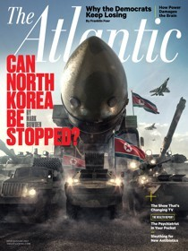
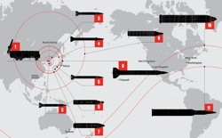

How to Deal With North Korea

# How to Deal With North Korea

There are no good options. But some are worse than others.

   

 Justin Metz

- [Mark Bowden](https://www.theatlantic.com/author/mark-bowden/)

- [July/August 2017 Issue](https://www.theatlantic.com/magazine/toc/2017/07/)

- [Global](https://www.theatlantic.com/international/)

-

- [Share](https://www.theatlantic.com/magazine/archive/2017/07/the-worst-problem-on-earth/528717/?utm_source=nextdraft&utm_medium=email#)

- [Tweet](https://www.theatlantic.com/magazine/archive/2017/07/the-worst-problem-on-earth/528717/?utm_source=nextdraft&utm_medium=email#)

-
   Text Size
 



Like *​The Atlantic*? Subscribe to **​**[The Atlantic Daily​](http://www.theatlantic.com/newsletters/daily/), our free weekday email newsletter.

[点击这里阅读中文版本 | Read this article in Chinese.](https://www.theatlantic.com/magazine/archive/2017/07/the-worst-problem-on-earth-chinese/530658/)

* * *

Thirty minutes. That’s about how long it would take a nuclear-tipped intercontinental ballistic missile (ICBM) launched from North Korea to reach Los Angeles. With the powers in Pyongyang working doggedly toward making this possible—building an ICBM and shrinking a nuke to fit on it—analysts now predict that Kim Jong Un will have the capability before Donald Trump completes one four-year term.

About which the president has tweeted, simply, “It won’t happen!”

Though given to reckless oaths, Trump is not in this case saying anything that departs significantly from the past half century of futile American policy toward North Korea. Preventing the Kim dynasty from having a nuclear device was an American priority long before Pyongyang exploded its first nuke, in 2006, during the administration of George W. Bush. The Kim regime detonated four more while Barack Obama was in the White House. In the more than four decades since Richard Nixon held office, the U.S. has tried to control North Korea by issuing threats, conducting military exercises, ratcheting up diplomatic sanctions, leaning on China, and most recently, it seems likely, committing cybersabotage.

article continues after advertisement

*Listen to the audio version of this article:*

[SoundCloud cookie policyCookie policy](https://soundcloud.com/pages/cookies)

 [(L)](https://soundcloud.com/user-154380542)

 [Download](https://api.soundcloud.com/tracks/327121945/download?client_id=cUa40O3Jg3Emvp6Tv4U6ymYYO50NUGpJ)

 [TheAtlantic](https://soundcloud.com/user-154380542)
   The Worst Problem on Earth - The Atlantic - Mark Bowden

 [(L)](https://w.soundcloud.com/player/?url=https%3A//api.soundcloud.com/tracks/327121945%3Fsecret_token%3Ds-yoqnd&color=ff5500&auto_play=false&hide_related=false&show_comments=true&show_user=true&show_reposts=false)

- 2.7K plays2.7K

## Explore more music & audio like

## The Worst Problem on Earth - The Atlantic - Mark Bowden

##  on SoundCloud.

 [       Hear more onSoundCloud](https://soundcloud.com/user-154380542)

 [(L)](https://soundcloud.com/user-154380542)

[*Download the Audm app*](https://goo.gl/ozqAwh)* for your iPhone to listen to more titles.*

For his part, Trump has also tweeted that North Korea is “looking for trouble” and that he intends to “solve the problem.” His administration has leaked plans for a “decapitation strike” that would target Kim, which seems like the very last thing a country ought to announce in advance.

None of which, we should all pray, will amount to much. Ignorant of the long history of the problem, Trump at least brings fresh eyes to it. But he is going to collide with the same harsh truth that has stymied all his recent predecessors: There are no good options for dealing with North Korea. Meanwhile, he is enthusiastically if unwittingly playing the role assigned to him by the comic-book-style foundation myth of the Democratic People’s Republic of Korea.

#### From Our July/August 2017 Issue

Try 2 FREE issues of *The Atlantic*
[Subscribe](http://www.theatlantic.com/subscribe/coverstory/)

The myth holds that Korea and the Kim dynasty are one and the same. It is built almost entirely on the promise of standing up to a powerful and menacing foreign enemy. The more looming the threat—and Trump excels at looming—the better the narrative works for Kim Jong Un. Nukes are needed to repel this threat. They are the linchpin of North Korea’s defensive strategy, the single weapon standing between barbarian hordes and the glorious destiny of the Korean people—all of them, North and South. Kim is the great leader, heir to divinely inspired ancestors who descended from Mount Paektu with mystical, magical powers of leadership, vision, diplomatic savvy, and military genius. Like his father, Kim Jong Il, and grandfather Kim Il Sung before him, Kim is the anointed defender of all Koreans, who are the purest of all races. Even South Korea, the Republic of Korea, should be thankful for Kim because, if not for him, the United States would have invaded long ago.

Even failed tests move North Korea closer to its goal—possessing nuclear weapons capable of hitting U.S. cities.

This racist mythology and belief in the supernatural status of the Mount Paektu bloodline defines North Korea, and illustrates how unlikely it is that diplomatic pressure will ever persuade the present Dear Leader to back down. Right now the best hope for keeping the country from becoming an operational nuclear power rests, as it long has, with China, which may or may not have enough economic leverage to influence Kim’s policy making—and which also may not particularly want to do so, since having a friendly neighbor making trouble for Washington and Seoul serves Beijing’s interests nicely at times.

article continues after advertisement

American sabotage has likely played a role in Pyongyang’s string of failed missile launches in recent years. According to David E. Sanger and William J. Broad of *The New York Times*, as the U.S. continued its covert cyberprogram last year, 88 percent of North Korea’s flight tests of its intermediate-range Musudan missiles ended in failure. Given that these missiles typically exploded, sometimes scattering in pieces into the sea, determining the precise cause—particularly for experts outside North Korea—is impossible. Failure is a big part of missile development, and missiles can blow up on their own for plenty of reasons, but the percentage of failures certainly suggests sabotage. The normal failure rate for developmental missile tests, according to *The Times*, is about 5 to 10 percent. It’s also possible that the sabotage program is not computer-related; it might, for instance, involve more old-fashioned techniques such as feeding faulty parts into the missiles’ supply chain. If sabotage of any kind is behind the failures, however, no one expects it to do more than slow progress. Even failed tests move Pyongyang closer to its announced goal: possessing nuclear weapons capable of hitting U.S. cities.

####  Related Story

 

[Mapping the Threat of North Korea](https://www.theatlantic.com/magazine/archive/2017/07/mapping-the-threat/528729/)

Kim’s regime may be evil and deluded, but it’s not stupid. It has made sure that the whole world knows its aims, and it has carried out public demonstrations of its progress, which double as a thumb in the eye of the U.S. and South Korea. The regime has also moved its medium-range No-dong and Scud missiles out of testing and into active service, putting on displays that show their reach—which now extends to South Korean port cities and military sites, as well as to the U.S. Marine Corps Air Station in Iwakuni, Japan. In mid-May, the regime successfully fired a missile that traveled, in a high arc, farther than one ever had before: 1,300 miles, into the Sea of Japan. Missile experts say it could have traveled 3,000 miles, well past American forces stationed in Guam, if the trajectory had been lower. Jeffrey Lewis, an arms-control expert at the Middlebury Institute of International Studies, wrote in *Foreign Policy *in March:

> North Korea’s military exercises leave little doubt that Pyongyang plans to use large numbers of nuclear weapons against U.S. forces throughout Japan and South Korea to blunt an invasion. In fact, the word that official North Korean statements use is “repel.” North Korean defectors have claimed that the country’s leaders hope that by inflicting mass casualties and destruction in the early days of a conflict, they can force the United States and South Korea to recoil from their invasion.

This isn’t new. This threat has been present for more than 20 years. “It is widely known inside North Korea that [the nation] has produced, deployed, and stockpiled two or three nuclear warheads and toxic material, such as over 5,000 tons of toxic gases,” Choi Ju-hwal, a North Korean colonel who defected, told a U.S. Senate subcommittee in 1997. “By having these weapons, the North is able to prevent itself from being slighted by such major powers as the United States, Russia, China, and Japan, and also they are able to gain the upper hand in political negotiations and talks with those superpowers.”

For years North Korea has had extensive batteries of conventional artillery—an estimated 8,000 big guns—just north of the demilitarized zone (DMZ), which is less than 40 miles from Seoul, South Korea’s capital, a metropolitan area of more than 25 million people. One high-ranking U.S. military officer who commanded forces in the Korean theater, now retired, told me he’d heard estimates that if a grid were laid across Seoul dividing it into three-square-foot blocks, these guns could, within hours, “pepper every single one.” This ability to rain ruin on the city is a potent existential threat to South Korea’s largest population center, its government, and its economic anchor. Shells could also deliver chemical and biological weapons. Adding nuclear ICBMs to this arsenal would put many more cities in the same position as Seoul. Nuclear-tipped ICBMs, according to Lewis, are the final piece of a defensive strategy “to keep Trump from doing anything regrettable after Kim Jong Un obliterates Seoul and Tokyo.”

### Video: The North Korea Crisis, Explained

To understand how the standoff between Pyongyang and the world became so dire, it helps to go back to the country's founding.

How should the United States proceed?

What to do about North Korea has been an intractable problem for decades. Although shooting stopped in 1953, Pyongyang insists that the Korean War never ended. It maintains as an official policy goal the reunification of the Korean peninsula under the Kim dynasty.

As tensions flared in recent months, fanned by bluster from both Washington and Pyongyang, I talked with a number of national-security experts and military officers who have wrestled with the problem for years, and who have held responsibility to plan and prepare for real conflict. Among those I spoke with were former officials from the White House, the National Security Council, and the Pentagon; military officers who have commanded forces in the region; and academic experts.

From these conversations, I learned that the U.S. has four broad strategic options for dealing with North Korea and its burgeoning nuclear program.

*1. Prevention: *A crushing U.S. military strike to eliminate Pyongyang’s arsenals of mass destruction, take out its leadership, and destroy its military. It would end North Korea’s standoff with the United States and South Korea, as well as the Kim dynasty, once and for all.

*2. Turning the screws: *A limited conventional military attack—or more likely a continuing series of such attacks—using aerial and naval assets, and possibly including narrowly targeted Special Forces operations. These would have to be punishing enough to significantly damage North Korea’s capability—but small enough to avoid being perceived as the beginning of a preventive strike. The goal would be to leave Kim Jong Un in power, but force him to abandon his pursuit of nuclear ICBMs.

*3. Decapitation:* Removing Kim and his inner circle, most likely by assassination, and replacing the leadership with a more moderate regime willing to open North Korea to the rest of the world.

*4. Acceptance: *The hardest pill to swallow—acquiescing to Kim’s developing the weapons he wants, while continuing efforts to contain his ambition.

Let’s consider each option. All of them are bad.

### 1 | Prevention

An all-out attack on North Korea would succeed. The U.S. and South Korea are fully capable of defeating its military forces and toppling the Kim dynasty.

For sheer boldness and clarity, this is the option that would play best to President Trump’s base. (Some campaign posters for Trump boasted, finally someone with balls.) But to work, a preventive strike would require the most massive U.S. military attack since the first Korean War—a commitment of troops and resources far greater than any seen by most Americans and Koreans alive today.

What makes a decisive first strike attractive is the fact that Kim’s menace is growing. Whatever the ghastly toll in casualties a peninsular war would produce today, multiply it exponentially once Kim obtains nuclear ICBMs. Although North Korea already has a million-man army, chemical and biological weapons, and a number of nuclear bombs, its current striking range is strictly regional. A sudden hammer blow before Kim’s capabilities go global is precisely the kind of solution that might tempt Trump.

Being able to reach U.S. territory with a nuclear weapon—right now the only adversarial powers with that ability are Russia and China—would make North Korea, because of its volatility, the biggest direct threat to American security in the world. Trump’s assertion of “America First” would seem to provide a rationale for drastic action regardless of the consequences to South Koreans, Japanese, and other people in the area. By Trumpian logic, the cost of all-out war might be acceptable if the war remains on the other side of the world—a thought that ought to keep South Koreans and Japanese up at night. The definition of “acceptable losses” depends heavily on whose population is doing the dying.

The brightest hope of prevention is that it could be executed so swiftly and decisively that North Korea would not have time to respond. This is a fantasy.

An American first strike would likely trigger one of the worst mass killings in human history.

“When you’re discussing nuclear issues and the potential of a nuclear attack, even a 1 percent chance of failure has potentially catastrophically high costs,” Abe Denmark, a former deputy assistant secretary of defense for East Asia under Barack Obama, told me in May. “You could get people who will give you General Buck Turgidson’s line from *Dr. Strangelove*,” he said, referring to the character played by George C. Scott in Stanley Kubrick’s classic film, who glibly acknowledges the millions of lives likely to be lost in a nuclear exchange by telling the president, “I’m not saying we wouldn’t get our hair mussed.”

Kim’s arsenal is a tough target. “It’s not possible that you get 100 percent of it with high confidence, for a couple of reasons,” Michèle Flournoy, a former undersecretary of defense in the Obama administration and currently the CEO of the Center for a New American Security, told me when we spoke this spring. “One reason is, I don’t believe anybody has perfect intelligence about where all the nuclear weapons are. Two, I think there is an expectation that, when they do ultimately deploy nuclear weapons, they will likely put them on mobile systems, which are harder to find, track, and target. Some may also be in hardened shelters or deep underground. So it’s a difficult target set—not something that could be destroyed in a single bolt-from-the-blue attack.”

North Korea is a forbidding, mountainous place, its terrain perfect for hiding and securing things. Ever since 1953, the country’s security and the survival of the Kim dynasty have relied on military stalemate. Resisting the American threat—surviving a first strike with the ability to respond—has been a cornerstone of the country’s military strategy for three generations.

And with only a few of its worst weapons, North Korea could, probably within hours, kill millions. This means an American first strike would likely trigger one of the worst mass killings in human history. In 2005, Sam Gardiner, a retired U.S. Air Force colonel who specialized in conducting war games at the National War College, estimated that the use of sarin gas alone would produce 1 million casualties. Gardiner now says, in light of what we have learned from gas attacks on civilians in Syria, that the number would likely be three to five times greater. And today North Korea has an even wider array of chemical and biological weapons than it did 12 years ago—the recent assassination of Kim’s half brother, Kim Jong Nam, demonstrated the potency of at least one compound, the nerve agent VX. The Kim regime is believed to have biological weapons including anthrax, botulism, hemorrhagic fever, plague, smallpox, typhoid, and yellow fever. And it has missiles capable of reaching Tokyo, a metropolitan area of nearly 38 million. In other words, any effort to crush North Korea flirts not just with heavy losses, but with one of the greatest catastrophes in human history.

[](https://www.theatlantic.com/magazine/archive/2017/07/the-worst-problem-on-earth/528717/?utm_source=nextdraft&utm_medium=email#)

*Pyongyang, April 15, 2017:* North Korean ballistic missiles pass through Kim Il Sung Square

during a military parade. In recent years, the rate at which the Kim regime has launched test missiles has increased. (STR / AFP / Getty)

Kim would bear the greatest share of responsibility for such a catastrophe, but for the U.S. to force his hand with a first strike, to do so without severe provocation or an immediate and dire threat, would be not only foolhardy but morally indefensible. That this decision now rests with Donald Trump, who has not shown abundant capacity for moral judgment, is not reassuring.

If mass civilian killings were not a factor—if the war were a military contest alone—South Korea by itself could defeat its northern cousin. It would be a lopsided fight. South Korea’s economy is the world’s 11th-largest, and in recent decades the country has competed with Saudi Arabia for the distinction of being the No. 1 arms buyer. And behind South Korea stands the formidable might of the U.S. military.

But lopsided does not necessarily mean easy. The combined air power would rapidly defeat North Korea’s air force, but would face ground-to-air missiles—a gantlet far more treacherous than anything American pilots have encountered since Vietnam. In the American method of modern war, which depends on control of the skies, a large number of aircraft are aloft over the battlefield at once—fighters, bombers, surveillance planes, drones, and flying command and control platforms. Maintaining this flying armada would require eliminating Pyongyang’s defenses.

Locating and securing North Korea’s nuclear stockpiles and heavy weapons would take longer. Some years ago, Thomas McInerney, a retired Air Force lieutenant general and a Fox News military analyst who has been an outspoken advocate of a preventive strike, estimated with remarkable optimism that eliminating North Korea’s military threat would take 30 to 60 days.

But let’s suppose (unrealistically) that a preventive strike did take out every single one of Kim’s missiles and artillery batteries. That still leaves his huge, well-trained, and well-equipped army. A ground war against it would likely be more difficult than the first Korean War. In David Halberstam’s book *The Coldest Winter*, he described the memories of Herbert “Pappy” Miller, a sergeant with the First Cavalry Division, after a battle with North Korean troops near the village of Taejon in 1950:

> No matter how well you fought, there were always more. Always. They would slip behind you, cut off your avenue of retreat, and then they would hit you on the flanks. They were superb at that, Miller thought. The first wave or two would come at you with rifles, and right behind them were soldiers without rifles ready to pick up the weapons of those who had fallen and keep coming. Against an army with that many men, everyone, he thought, needed an automatic weapon.

Today, American soldiers would all have automatic weapons—but so would the enemy. The North Koreans would not just make a frontal assault, either, the way they did in 1950. They are believed to have tunnels stretching under the DMZ and into South Korea. Special forces could be inserted almost anywhere in South Korea by tunnel, aircraft, boat, or the North Korean navy’s fleet of miniature submarines. They could wreak havoc on American and South Korean air operations and defenses, and might be able to smuggle a nuclear device to detonate under Seoul itself. And for those America Firsters who might view Asian losses as acceptable, consider that there are also some 30,000 Americans on the firing lines—and that even if those lives are deemed expendable, another immediate casualty of all-out war in Korea would likely be South Korea’s booming economy, whose collapse would be felt in markets all over the world.

So the cost of even a perfect first strike would be appalling. In 1969, long before Pyongyang had missiles or nukes, the risks were bad enough that Richard Nixon—hardly a man timid about using force—opted against retaliating after two North Korean aircraft shot down a U.S. spy plane, killing all 31 Americans on board.

Jim Walsh is a senior research associate at the MIT Security Studies Program and a board member of the Center for Arms Control and Non-Proliferation. I talked with him this spring, as tensions between North Korea and the U.S. escalated. “I had a friend who just returned from Seoul, where he had a chance to talk with U.S. Forces Korea—uniformed military officers—and he asked them, ‘Do you have a capability to remove North Korea’s nuclear weapons?’ And the response was ‘Can we use nuclear weapons or not?’ ”

Putting aside the irony of using nuclear weapons to prevent the use of nuclear weapons, the answer Walsh got in that scenario was still: No guarantee.

“If we don’t get everything, then we have a really pissed-off adversary who possesses nuclear weapons who has just been attacked,” Walsh said. “It’s not clear even with nukes that you could get all the artillery. And if you did use nukes, is that something South Korea is going to sign up for? There’s three minutes’ flight time from just north of the DMZ to Seoul. Do you really want to be dropping nuclear weapons that close to our ally’s capital? Think of the radioactive fallout. If you don’t take out all the batteries, then you have thousands of munitions raining down on Seoul. So I don’t get how an all-out attack works.” Even if a U.S. president could get Americans to support such an attack, Walsh added, the South Koreans would likely object. “All the fighting is going to happen on Korean soil. So it seems to me the South Koreans should certainly have a say in this. I don’t see them signing off.”

Especially not now, with the election in May of Moon Jae-in as president. Moon is a liberal who has said he might be willing to reopen talks with Pyongyang and, far from endorsing aggressive action, has criticized the recent deployment around Seoul of America’s thaad (Terminal High Altitude Area Defense) missiles, which are designed to intercept incoming missiles.

These aren’t the only problems with a preventive strike. To be effective, it would depend on surprise, on delivering the maximum amount of force as quickly as possible—which would in turn require a significant buildup of U.S. forces in the region. At the start of the Iraq War, American warplanes flew about 800 sorties a day. An all-out attack on North Korea, a far more formidable military power than Saddam Hussein’s Iraq, would almost certainly require more. In order to resist a ground invasion of South Korea, the U.S. would need to bolster the assets currently in place. U.S. Special Forces would need to be positioned to go after crucial nuclear sites and missile platforms; ships would have to be stationed in the Sea of Japan and the Yellow Sea. It’s highly improbable that all of this could happen without attracting Pyongyang’s notice. One of the things North Korea is better at than its southern neighbor is spying; recruiting and running spies is much easier in a free society than in a totalitarian one.

But suppose, just for argument’s sake, that a preventive strike could work without any of the collateral damage I’ve been describing. Suppose that U.S. forces could be positioned secretly, and that President Moon were on board. Suppose, further, that Pyongyang’s nukes could be disabled swiftly, its artillery batteries completely silenced, its missile platforms flattened, its leadership taken out—all before a counterstrike of any consequence could be made. And suppose still further that North Korea’s enormous army could be rapidly defeated, and that friendly casualties would remain surprisingly low, and that South Korea’s economy would not be significantly hurt. And suppose yet further that China and Russia agreed to sit on the sidelines and watch their longtime ally fall. Then Kim Jong Un, with his bad haircut and his legion of note-taking, big-hat-wearing, kowtowing generals, would be gone. South Korea’s fear of invasion from the North, gone. The menace of the state’s using chemical and biological weapons, gone. The nuclear threat, gone.

Such a stunning outcome would be a mighty triumph indeed! It would be a truly awesome display of American power and know-how.

What would be left? North Korea, a country of more than 25 million people, would be adrift. Immediate humanitarian relief would be necessary to prevent starvation and disease. An interim government would have to be put in place. If Iraq was a hard country to occupy and rebuild, imagine a suddenly stateless North Korea, possibly irradiated and toxic, its economy and infrastructure in ruins. There could still be hidden stockpiles of nuclear, biological, and chemical weapons scattered around the country, which would have to be found and secured before terrorists got to them. “Success,” in other words, would create the largest humanitarian crisis of modern times—Syria’s miseries would be a playground scuffle by comparison. Contemplating such a collapse in *The Atlantic* back in 2006, Robert D. Kaplan wrote that dealing with it “could present the world—meaning, really, the American military—with the greatest stabilization operation since the end of World War II.”

How long would it be before bands of armed fighters from Kim’s shattered army began taking charge, like Afghan warlords, in remote regions of the country? How long before they began targeting American occupation forces? Imagine China and South Korea beset by millions of desperate refugees. Would China sit still for a unified, American-allied Korea on its border? Having broken North Korea, the U.S. would own it for many, many years to come. Which would not be easy, or pretty.

The ensuing chaos and carnage and ongoing cost might just make America miss Kim Jong Un’s big-bellied strut.

Which brings us to the second option.

### 2 | Turning the Screws

What if the United States aimed to punish Pyongyang without provoking a full-on war—to leave Kim Jong Un in power and the North Korean state intact, but without a nuclear arsenal?

Given all the saber-rattling in Washington, but also the enormous downsides to a preventive strike, this middle route seems to be the most likely option that involves using force. The strategy would be to respond to the next North Korean affront—a nuclear test or missile launch or military attack—sharply enough to get Pyongyang’s full attention. The strike would have to set back the regime’s efforts significantly without looking like the start of an all-out, preventive war. If Kim responded with a counterattack, another, perhaps more devastating, American blow would follow. The hope is that this process might convince him that the U.S., as Trump has promised, will not allow him to succeed in developing a weapons program capable of threatening the American mainland.

This pattern of dealing with North Korea is an amped-up version of what Sydney A. Seiler, a North Korea expert who spent decades at the CIA, the National Security Council, and elsewhere, has called the “provocation cycle”: Pyongyang does something outrageous—such as its first successful nuclear test, in 2006—and then, having inflamed fears of war, offers to return to disarmament negotiations. When Pyongyang returned to talks in 2007, the Bush administration agreed to release illicit North Korean funds that had been frozen in Macau’s Banco Delta Asia bank—effectively rewarding Kim for his nuclear defiance.

[](https://www.theatlantic.com/magazine/archive/2017/07/the-worst-problem-on-earth/528717/?utm_source=nextdraft&utm_medium=email#)

*Baengnyeong Island, South Korea, April 24, 2010:* A crane salvages the South Korean warship *Cheonan*, which sank following a mysterious explosion near the disputed sea border with North Korea, leaving 46 crew members dead. (Jin Sung-chul / AP)

The Obama administration attempted to break this cycle. When North Korea sank the South Korean warship *Cheonan* with a torpedo in 2010, killing 46 of the vessel’s 104 crew members, South Korea imposed a near-total trade embargo on the North—the most serious response short of a military strike—and refused to reenter disarmament talks without a formal apology. Obama pursued a policy of “strategic patience,” using no force but also offering no concessions to restore good feelings and in fact working through regional allies to further isolate and punish Pyongyang. By stepping out of the provocation/charm cycle, the hope was that North Korea would behave like a more responsible nation. It didn’t work, or hasn’t worked—some feel that the effects of economic sanctions have yet to fully play out. Conservatives, and Donald Trump, tend to regard “strategic patience” as a failure. So why not radically turn the screws? The way to stop someone from calling your bluff is to stop bluffing.

An opening salvo would likely hit important nuclear sites or missile launchers. Perhaps the most tempting and obvious target is the nuclear test site at Punggye-ri, which made news in April when satellite images looking for signs of an expected underground detonation instead found North Korean soldiers playing volleyball. Another major piece of the nuclear program is the reactor at Yongbyon, which produces plutonium. Hitting either site would do more than send a message; it would impede Kim’s bomb program (although North Korea already has stockpiles of plutonium). The strikes themselves would be risky—radioactive material might be released, which would certainly draw widespread (and justified) international condemnation. Targeting missile launchers would entail less risk, but would require a larger and more complex mission, given the number of launchers that would need to be destroyed and the defenses around them.

Choosing how and where to strike would be a delicate thing. If the U.S. went after all or most of North Korea’s launchers at once, it might look to Pyongyang like an all-out attack, and trigger an all-out response. Targeting too few would advertise a reluctance to fully engage, which would just invite further provocation.

Key to the limited strike is the pause that comes after. Kim and his generals would have time to think. Some analysts feel that, in this scenario, he would be unlikely to unleash a devastating attack on Seoul.

But the threat of Seoul’s destruction by North Korean artillery “really constrains people, and it’s really hard to combat,” says John Plumb, a Navy submarine officer who served as a director of defense policy and strategy for the National Security Council during the Obama administration. “If I were the Trump administration, I would be looking at the threat to incinerate Seoul and trying to figure out how real it is. Because to me, it’s become such a catchphrase, and it almost—it starts to lose credibility. Attacking Seoul, a civilian population center, is different from attacking a remote military outpost. It’s dicey, there’s no doubt about it.”

The problem with trying to turn the screws on Pyongyang is that once the shooting starts, containing it may be extremely difficult. Any limited strike would almost certainly start an escalating cycle of attack/counterattack. Owing to miscalculation or misunderstanding, it could readily devolve into the full-scale peninsular war described earlier. For the strategy to work, Pyongyang would have to recognize America’s intent from the outset—and that is not a given. The country has a hair-trigger sensitivity to threat, and has been anticipating a big American invasion for more than half a century. As Jim Walsh of MIT’s Security Studies Program points out, just because America might consider an action limited doesn’t guarantee North Korea will see it that way.

And once the violence begins, North Korea would have an advantage, in that its people have no say in the matter. The death and misery of North Koreans would just be one more chapter in decades of misrule. The effects of North Korean strikes in the free society to the south would be a far different thing. The introduction of thaad missiles earlier this year brought thousands of protesters into the streets, where they clashed with police. It would be much harder for Moon and Trump to stoically absorb punishment in any protracted test of wills. And North Korea would have more to lose by folding first. For Kim and his generals, the endgame would require abandoning the linchpin of their national-defense strategy.

Pyongyang is, if anything, inclined to exaggerate threat. According to a 2013 analysis by Scott A. Snyder, a senior fellow at the Council on Foreign Relations, the regime “thrives on crisis and gains internal support from crisis situations.” Trump may believe it serves his purposes to be seen as dangerously erratic, but he is surrounded by relatively responsible military and congressional leaders and is presumably bound to act in concert with South Korea, which would be loath to act rashly. The American president can fulminate all he likes on Twitter, but he has constraints. Kim does not. His inner circle is regularly thinned by one-way trips to the firing range; lord help anyone who—forget about voicing an objection—fails to clap and cheer his pronouncements with enough enthusiasm. His power is absolute, and pugnacity is central to it. He may be one of the few people on Earth capable of out-blustering Trump. And he has repeatedly backed up his words with force, from the sinking of the *Cheonan* in 2010 to the shelling of Yeonpyeong Island that same year, in response to South Korean military exercises there. It takes far less than an actual military strike to set him off. Kim recently threatened to sink the U.S.S.* Carl Vinson*, which arrived in the region in April.

Sinking an aircraft carrier is hard. Kim’s forces would first have to find it, which, despite satellite technology, is not easy. Neither is hitting it, even for a very sophisticated military. But suppose North Korea did manage to find and attack an aircraft carrier. If tensions can be cranked this high just by sailing a carrier into Korean waters, imagine how fast things might escalate when actual shooting starts.

“If I am sitting in Pyongyang, and I think you are coming after me, I’ve got minutes to decide if this is an all-out attack, and if I wait, I lose,” Jim Walsh told me. “So it’s use nuclear weapons or lose them—which makes for an itchy trigger finger. The idea that the U.S. and South Korea are going to have a limited strike that the North Koreans are going to *perceive* as limited, and that they are willing to stand by and let happen, especially given the rhetorical context in which this has been playing out, complete with repeated, stupid statements about ‘decapitation’—I can’t see it happening.”

Even if Kim did perceive limited intent in a first strike, he would readily and correctly interpret the effort as an assault on his nuclear arsenal, and perhaps the initial steps on a road to regime change. Under those circumstances, with the fate of Seoul in the balance, which side would likely blink first?

Maybe Kim would. It’s possible. But given the nature of his regime and his own short history as Dear Leader, it would have to be considered a small chance. More likely is that a limited-intent first strike would slide quickly into exactly what it was designed to prevent.

### 3 | Decapitation

The third option has Hollywood appeal: Target Kim Jong Un himself and overthrow the dynasty.

South Korean Defense Minister Han Min-koo said earlier this year that his country was preparing a “special brigade” to remove the North’s wartime command structure. During military exercises in March, U.S. and South Korean troops took part in a rehearsal for a strike like this. That same month, the South Korean newspaper *Korea JoongAng Daily* reported that a U.S. Navy seal team had been deployed to train for just such a mission. In May, the North Korean government announced that it had foiled an assassination plot hatched by the CIA and South Korea’s National Intelligence Service.

The latter two claims have been officially denied, but decapitation is almost certainly being considered. The U.S.–South Korea war strategy, OPLAN 5015, portions of which have leaked to the South Korean press, calls for strikes targeting the country’s leaders. Any U.S. plot would be a breach of long-standing American policy—an executive order bans the assassination of foreign leaders. But such an order can be rewritten by whoever presides in the White House.

A former senior adviser to the White House on national security, who asked not to be named, told me recently: “Decapitation does seem to be a way to get out of this problem. If a new North Korean leader could arise who is willing to denuclearize and be somewhat of a normal actor, it might lead us out. But there are so many wild cards involved that I’ve been reluctant to endorse that approach so far.”

For a plot against Kim to succeed, it would most likely have to be initiated from inside Kim’s circle. It would be exceedingly difficult, even for a suicidal team of special operators, to get close enough to Kim to kill him, given the closed nature of the North Korean state and the security that surrounds him. Unless it came during a scheduled public appearance (when defenses would be on high alert), an aerial attack by cruise missile or drone would depend on accurate and timely intelligence regarding his whereabouts, something that only an insider could provide. Americans have successfully hunted down and killed al-Qaeda and Islamic State leaders with the aid of drones, which can conduct long-term, detailed surveillance and provide timely precision strikes. But the use of drones for these purposes depends on complete control of airspace. They are slow-moving and electronically noisy, so they are relatively easy to shoot down—and North Korea’s air defenses are robust.

[](https://www.theatlantic.com/magazine/archive/2017/07/the-worst-problem-on-earth/528717/?utm_source=nextdraft&utm_medium=email#)

*Pyongyang, April 15, 2017:* Kim Jong Un arrives for a military parade marking the 105th

anniversary of the birth of his grandfather Kim Il Sung. The Kim regime displayed

a panoply of new missiles for the occasion—but the test-firing of a missile the next day failed, perhaps as a result of American sabotage. (STR / AFP / Getty)

If China were sufficiently fed up with its belligerent neighbor, however, it might be capable of recruiting conspirators in Pyongyang. Money or the promise of power might be enough to turn someone in Kim’s inner circle, where his practice of having people executed is bound to have sown ill will and a desire for revenge. But the tyrant’s menace cuts both ways. It would be a terribly risky undertaking for anyone involved.

The consequences could also be disastrous: Given the reverence accorded Kim, his sudden death might trigger an automatic military response. And what guarantees are there that his replacement wouldn’t be worse?

Without some sense of what would follow, in both the short and long term, decapitation would be a huge gamble. You don’t play dice with nukes.

### 4 | Acceptance

Unless Kim Jong Un is killed and replaced by someone better, or some miracle of diplomacy occurs, or some shattering peninsular conflict intervenes, North Korea will eventually build ICBMs armed with nuclear warheads. In the words of one retired senior U.S. military commander: “It’s a done deal.”

Acceptance is likely because there are no good military options where North Korea is concerned. As frightening as it is to contemplate a Kim regime that can successfully strike the United States, accepting such a scenario means living with things only slightly worse than they are right now.

Pyongyang has long had the means to all but level Seoul, and weapons capable of killing tens of thousands of Americans stationed in South Korea—far more than those killed by al-Qaeda on September 11, 2001, an atrocity that spurred the U.S. to invade two countries and led to 16 years of war. Right now North Korea has missiles that could reach Japan (and possibly Guam) with weapons of mass destruction. The world is already accustomed to dealing with a North Korea capable of sowing unthinkable mayhem.

**Every option the United States has for dealing with North Korea is bad. But accepting it as a nuclear power may be the least bad.**

Pyongyang has been constrained by the same logic that has stayed the use of nuclear arms for some 70 years. Their use would invite swift annihilation. In the Cold War this brake was called mad (mutual assured destruction). In this case the brake on North Korea would be simply ad: assured destruction, since any launch of a nuclear weapon would invite an annihilating response; even though its missiles might hit North America, it cannot destroy the United States.

There is already a close-to-even chance that, in the 30 minutes it would take a North Korean ICBM to reach the West Coast of the United States, the missile would be intercepted and destroyed. But the other way of looking at those odds is that such a missile would have a close-to-even chance of hitting an American city.

This is terrible to ponder, but Americans lived with a far, far greater threat for almost half a century. Throughout the Cold War, the U.S. faced the potential for complete destruction. I was one of the kids who performed civil-defense drills in the 1950s, ducking under my school desk while sirens wailed. During the Cuban missile crisis, the possibility seemed imminent enough that I plotted the fastest route from school to home. The threat of nuclear attack is a feature of the modern world, and one that has grown far less existential to Americans over time.

It is expensive to build an atom bomb, and very hard to build one small enough to ride in a missile. It is also hard to build an ICBM. But these are all old technologies. The know-how exists and is widespread. Preventing a terrorist group from acquiring such a weapon may be possible, but when a nation—whether North Korea or Iran or any other—commits itself to the goal, stopping it is virtually impossible. A deal to halt Iran’s nuclear program was doable only because that country has extensive trading and banking ties with other nations. The Kim regime’s isolation means that no country besides China can really apply meaningful economic pressure. Persuading a nation to abandon nuclear arms depends less on military strength than on the collective determination of the world, and a decision made by the nation in question. What’s needed is the proper framework for disarmament—the right collection of incentives and disincentives to render the building of such a weapon a detriment and a waste—so the country decides that abandoning its pursuit of nukes is in its best interest.

It is hard to imagine Pyongyang making such a decision anytime soon, but creating a framework that renders that decision at least conceivable is the only sensible way forward. This is not a hopeless strategy. Over the years Pyongyang, in between its threats and provocations, has more than once dangled offers to freeze its nuclear progress. With the right inducements, Kim very well might decide to change direction. Or he might die. He’s an obese young man with bad habits, a family history of heart trouble, and a personal record of poor health. In such a system, things might change—for better or worse—overnight.

Moon Jae-in, South Korea’s new president, wants to steer his country away from confrontation with Pyongyang, and possibly open talks with Kim. This is likely to put him at odds with Donald Trump, but reduces the chances of the U.S. president doing something rash. China has also expressed more willingness to put pressure on Kim, although it has yet to act emphatically on this. And time might allow the working-out of a peaceful path to disarmament. Better to buy time than to risk mass death by provoking a military confrontation.

“I don’t think now is the time we should be substituting a policy of strategic haste for one of strategic patience—and I was a critic of strategic patience,” Jim Walsh said.

For all these reasons, acceptance is how the current crisis should and will most likely play out. No one is going to announce this policy. No president is going to openly acquiesce to Kim’s ownership of a nuclear-tipped ICBM, but just as George W. Bush quietly swallowed Pyongyang’s successful explosion of an atom bomb, and just as Barack Obama met North Korea’s subsequent nuclear tests and missile launches with strategic patience, Trump may well find himself living with something similar. If there were a tolerable alternative, it would long ago have been tried. Sabotage may continue to stall progress, but cannot stop it altogether. Draconian economic pressure, even with China’s help, is also unlikely to curb Pyongyang’s quest.

“The North Koreans have demonstrated a strong willingness to continue this program, regardless of the price, regardless of the isolation,” says Abe Denmark, the former deputy assistant secretary of defense for East Asia under Obama. “To be frank, my sense is that their leadership really could not care less about the country’s economic situation or the living standards of their people. As long as they are making progress toward nuclear weapons and ballistic missiles, and they can stay in power, then they seem to be willing to pay that price.”

In short, North Korea is a problem with no solution … except time.

True, time works in favor of Kim getting what he wants. Every test, successful or not, brings him closer to building his prized weapons. When he has nuclear ICBMs, North Korea will have a more potent and lethal strike capability against the United States and its allies, but no chance of destroying America, or winning a war, and therefore no better chance of avoiding the inevitable consequence of launching a nuke: national suicide. Kim may end up trapped in the circular logic of his strategy. He seeks to avoid destruction by building a weapon that, if used, assures his destruction.

His regime thrives on crisis. Perhaps when he feels safe enough with his arsenal, he might turn to more-sensible goals, like building the North Korean economy, opening trade, and ending its decades of extreme isolation. All of these are the very things that create the framework needed for disarmament.

But acceptance, while the right choice, is yet another bad one. With such missiles, Kim might feel emboldened to move on South Korea. Would the U.S. sacrifice Los Angeles to save Seoul? The same calculation drove the U.K. and France to develop their own nuclear weapons during the Cold War. Trump has already suggested that South Korea and Japan might want to consider building nuclear programs. In this way, acceptance could lead to more nuclear-armed states and ever greater chances that one will use the weapons.

With his arsenal, Kim may well become an even more destabilizing force in the region. There is a good chance that he would try to negotiate from strength with Seoul and Washington, forging some kind of confederation with the South that leads to the removal of U.S. forces from the peninsula. If talks were to resume, Trump had better enter them with his eyes open, because Kim, who sees himself as the divinely inspired heir to leadership of *all* the Korean people, is not likely to be satisfied with only his half of the peninsula.

There is no sign of panic in Seoul. Writing for *The New York Times* from the city in April, Motoko Rich found residents busy with their normal lives, eating at restaurants, crowding in bars, and clogging some of the most congested highways in the world. In a poll taken before the May election, fewer than 10 percent of South Koreans rated the North Korean nuclear threat as their top concern.

“Since I have been living here for so long, I am not scared anymore,” said Gwon Hyuck-chae, an elderly barber in Munsan, about five miles from the DMZ. “Even if there was a war now, it would not give us enough time to flee. We would all just die in an instant.”

Although in late April Trump called Kim “a madman with nuclear weapons,” perhaps the most reassuring thing about pursuing the acceptance option is that Kim appears to be neither suicidal nor crazy. In the five and a half years since assuming power at age 27, he has acted with brutal efficiency to consolidate that power; the assassination of his half brother is only the most recent example. As tyrants go, he’s shown appalling natural ability. For a man who occupies a position both powerful and perilous, his moves have been nothing if not deliberate and even cruelly rational.

And as the latest head of a family that has ruled for three generations, one whose primary purpose has been to survive, as a young man with a lifetime of wealth and power before him, how likely is he to wake up one morning and set fire to his world?

- [Share](https://www.theatlantic.com/magazine/archive/2017/07/the-worst-problem-on-earth/528717/?utm_source=nextdraft&utm_medium=email#)

- [Tweet](https://www.theatlantic.com/magazine/archive/2017/07/the-worst-problem-on-earth/528717/?utm_source=nextdraft&utm_medium=email#)

- [Comments](https://www.theatlantic.com/magazine/archive/2017/07/the-worst-problem-on-earth/528717/?utm_source=nextdraft&utm_medium=email#article-comments)

##   [Latest Video](https://www.theatlantic.com/video/)

 [     ## How North Korea Became a Crisis](https://www.theatlantic.com/video/index/530892/the-north-korea-crisis-explained/)

To understand how the standoff between Pyongyang and the world became so dire, it helps to go back to the country's founding

## About the Author

- 

 [Mark Bowden](https://www.theatlantic.com/author/mark-bowden/) is an *Atlantic* national correspondent. His most recent book is *[Huế 1968](http://www.amazon.com/exec/obidos/ISBN=0802127002/theatla05-20/).*