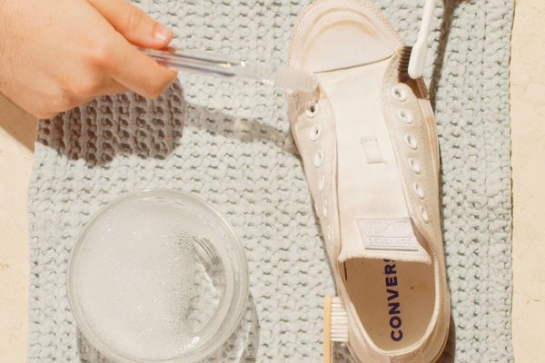

How to Do 2 Simple Magic Tricks — and Why You Should Learn Them - The New York Times

Credit...United Labor

# How to Do 2 Simple Magic Tricks — and Why You Should Learn ThemHow to Do 2 Simple Magic Tricks — and Why You Should Learn Them

You don’t have to be a wizard to do magic tricks. The secrets are simple, and anyone can learn them. Here are two easy tricks you can master today.

Credit...United Labor
By Ian Frisch

- Nov. 13, 2019

-

    - 
    - 
    - [](https://www.nytimes.com/2019/11/13/smarter-living/how-to-do-2-simple-magic-tricks-and-why-you-should-learn-them.html?fallback=false&recId=895036808&locked=1&geoContinent=EU&geoRegion=CMD&recAlloc=home-geo&geoCountry=GB&blockId=home-living&imp_id=137517864&action=click&module=Smarter%20Living&pgtype=Homepagemailto:?subject=NYTimes.com%3A%20How%20to%20Do%202%20Simple%20Magic%20Tricks%20%E2%80%94%20and%20Why%20You%20Should%20Learn%20Them&body=From%20The%20New%20York%20Times%3A%0A%0AHow%20to%20Do%202%20Simple%20Magic%20Tricks%20%E2%80%94%20and%20Why%20You%20Should%20Learn%20Them%0A%0AYou%20don%E2%80%99t%20have%20to%20be%20a%20wizard%20to%20do%20magic%20tricks.%20The%20secrets%20are%20simple%2C%20and%20anyone%20can%20learn%20them.%20Here%20are%20two%20easy%20tricks%20you%20can%20master%20today.%0A%0Ahttps%3A%2F%2Fwww.nytimes.com%2F2019%2F11%2F13%2Fsmarter-living%2Fhow-to-do-2-simple-magic-tricks-and-why-you-should-learn-them.html)

    -
    -

I could see the gold lion even before my cab came to a stop: the flowing mane, the three-foot-long fangs — leg muscles knotted, ready to pounce. It was as if he was taunting me to enter the 30-story building that he was so aggressively guarding: a massive casino.

It was August, 2017, and the lion was a statue outside the MGM Grand in Las Vegas. I was in Sin City for Magic Live, the largest convention for magicians in the United States. But this trip wasn’t just a playful jaunt. I was there to film a magic trick that I had invented, which would then be sold to other magicians through a prominent online retail outlet.

The two years leading up to this event had been sensational, almost impossible to believe: I stumbled into the underground world of magic, became friends with the most influential young magicians in the world, and I eventually became a magician myself. I got to rub elbows with David Blaine and Penn Jillette, and I even had the opportunity to perform magic for the late Anthony Bourdain. [The entire adventure became my first book, “Magic is Dead.”](https://info.harpercollins.com/magicisdead/)

## Smarter Living

A weekly roundup of the best advice from The Times on living a better, smarter, more fulfilling life.

Video

00:00

       

1:26

1:26Make a Coin Disappear
United Labor

My trip to Vegas was a success, and [the trick is now available online](https://magicstream.com/programs/flip-side?autoplay=true), where you can pay to learn how it’s done. But how did I, the random journalist who stumbled upon this world, come to understand magicians’ secrets? Aren’t magicians just, like, *born* with their abilities?

Nope. The secret — or method, in magic-speak — behind a trick is normally quite simple, but it’s the magician’s performative flair and masterly execution that makes it come to life.

Deception-as-performance, however, is not just finger dexterity or a cleverly designed contraption. Magic comes alive when it’s shared between two people; it’s meant to build a connection between performer and spectator. Moreover, a magician’s goal is not merely to create a fantasy for their audience, but to bend, twist, or break their sense of *objective* reality. That’s a powerful thing.

*[Like what you’re reading? *[*Sign up here*](https://www.nytimes.com/newsletters/smarter-living?module=inline)* for the Smarter Living newsletter to get stories like this (and much more!) delivered straight to your inbox every Monday morning.]*

And when that happens, a profound element of trust is instilled in the magician. Magic shows you what is possible in the world, and the spectator expects a magician to take them on a journey that they can’t obtain anywhere else. But, sure, we all know it’s just a trick, that some duplicity is afoot. But that break from reality is captivating. It’s something that we can’t find anywhere else. Magic isn’t just silly card tricks; it’s the *art* of deception — something wholly unique in its experience, an encounter so profound that we can’t help but carry it around with us for a while. The moment of astonishment, fleeting as it may be, becomes a crease in your heart.

## Editors’ Picks

[### She Hung Nooses on Halloween. What Happened Next Was Surprising.](https://www.nytimes.com/2019/11/15/nyregion/clinton-hill-halloween-decorations.html?fallback=false&recId=808021073&locked=0&geoContinent=EU&geoRegion=LND&recAlloc=story&geoCountry=GB&blockId=home-featured&imp_id=790385497)

[### ‘S.N.L.’ Turns Impeachment Inquiry Into a Soap Opera Starring Jon Hamm](https://www.nytimes.com/2019/11/17/arts/television/snl-impeachment-jon-hamm-harry-styles.html?fallback=false&recId=808021073&locked=0&geoContinent=EU&geoRegion=LND&recAlloc=story&geoCountry=GB&blockId=home-featured&imp_id=353634237)

[### Where Could They Get More for Their Money: Upper East Side or Upper West Side?](https://www.nytimes.com/interactive/2019/11/14/realestate/14hunt-barman.html?fallback=false&recId=808021073&locked=0&geoContinent=EU&geoRegion=LND&recAlloc=story&geoCountry=GB&blockId=home-featured&imp_id=729897995)

[Continue reading the main story](https://www.nytimes.com/2019/11/13/smarter-living/how-to-do-2-simple-magic-tricks-and-why-you-should-learn-them.html?fallback=false&recId=895036808&locked=1&geoContinent=EU&geoRegion=CMD&recAlloc=home-geo&geoCountry=GB&blockId=home-living&imp_id=137517864&action=click&module=Smarter%20Living&pgtype=Homepage&action=click&module=editorContent&pgtype=Article&region=CompanionColumn&contentCollection=Trending#after-pp_edpick)

 [ PAID POST: AUDEMARS PIGUET](https://adclick.g.doubleclick.net/pcs/click?xai=AKAOjst0nkBTTpuqXqJAr1PshvF_EMiQwmJvbZbwWpwcJRVVddvQjlGT7eSc5RWmBpxuRviRuPlDFa2zdqMoPDIqj5RH54xBp0iVzVQR8RUUfEpNxJIzfr9rTuVpo22pMbrIy2UVHPEZpVeARkC7RzTtXlgMyHyTgZYDuGld9hv9TPGwdApPxG0-3sDdVOmHFdPy9XNHqUWPT1YRh2ozkBHeMiIMHs3vSbAz2cDOf1kULEoJVtxcsF2PdHHv1fmIekjD-6Ovl8cjGFY6-Ndq&sig=Cg0ArKJSzJN9f_UIP2NtEAE&urlfix=1&adurl=https://www.nytimes.com/paidpost/audemars-piguet/beyond-watchmaking.html%3Fcpv_ap_id%3D50035063%26sr_source%3Dlift_ed%26tbs_nyt%3D2019-Nov-nytnative_ed)[ Behind the Scenes of the “Beyond Watchmaking” Show in Tokyo](https://adclick.g.doubleclick.net/pcs/click?xai=AKAOjst0nkBTTpuqXqJAr1PshvF_EMiQwmJvbZbwWpwcJRVVddvQjlGT7eSc5RWmBpxuRviRuPlDFa2zdqMoPDIqj5RH54xBp0iVzVQR8RUUfEpNxJIzfr9rTuVpo22pMbrIy2UVHPEZpVeARkC7RzTtXlgMyHyTgZYDuGld9hv9TPGwdApPxG0-3sDdVOmHFdPy9XNHqUWPT1YRh2ozkBHeMiIMHs3vSbAz2cDOf1kULEoJVtxcsF2PdHHv1fmIekjD-6Ovl8cjGFY6-Ndq&sig=Cg0ArKJSzJN9f_UIP2NtEAE&urlfix=1&adurl=https://www.nytimes.com/paidpost/audemars-piguet/beyond-watchmaking.html%3Fcpv_ap_id%3D50035063%26sr_source%3Dlift_ed%26tbs_nyt%3D2019-Nov-nytnative_ed)

Video

00:00

       

1:40

1:40Make Two Cards Jump Out of a Deck
United Labor

But what is life if not a quest for the spectacular? That’s why humans are naturally drawn to magic. It’s the only situation where people willingly say, without hesitation, *Yes, please trick me, please lie to me — and don’t tell me how you did it.*

And, really: Who, even as an adult, doesn’t want a break from reality once in a while?

I came away from my three-year adventure in the underground world of magic convinced that everyone should know a few simple magic tricks. Whether you’re at game night with your friends, a holiday party with co-workers or on an awkward first date, knowing a handful of easy effects can go a long way in breaking the ice, becoming the center of attention or merely jazzing up a night on the couch with your significant other.

Magic can bring people together, and when it’s done right, an unforgettable moment is shared. I myself have become someone who people call upon to spice up a low-key gathering by performing a handful of card tricks. And now I’m going to bestow onto you some of what I’ve learned during my journey alongside the world’s best magicians.

Whether you were the recipient of a kiddie magic kit that has since collected dust or met its fate at a family garage sale, or you’re someone who has never even touched a deck of cards, here are two simple magic tricks that you can start performing today.

- 
- 
- [](https://www.nytimes.com/2019/11/13/smarter-living/how-to-do-2-simple-magic-tricks-and-why-you-should-learn-them.html?fallback=false&recId=895036808&locked=1&geoContinent=EU&geoRegion=CMD&recAlloc=home-geo&geoCountry=GB&blockId=home-living&imp_id=137517864&action=click&module=Smarter%20Living&pgtype=Homepagemailto:?subject=NYTimes.com%3A%20How%20to%20Do%202%20Simple%20Magic%20Tricks%20%E2%80%94%20and%20Why%20You%20Should%20Learn%20Them&body=From%20The%20New%20York%20Times%3A%0A%0AHow%20to%20Do%202%20Simple%20Magic%20Tricks%20%E2%80%94%20and%20Why%20You%20Should%20Learn%20Them%0A%0AYou%20don%E2%80%99t%20have%20to%20be%20a%20wizard%20to%20do%20magic%20tricks.%20The%20secrets%20are%20simple%2C%20and%20anyone%20can%20learn%20them.%20Here%20are%20two%20easy%20tricks%20you%20can%20master%20today.%0A%0Ahttps%3A%2F%2Fwww.nytimes.com%2F2019%2F11%2F13%2Fsmarter-living%2Fhow-to-do-2-simple-magic-tricks-and-why-you-should-learn-them.html)

-

## [More in Smarter Living](https://www.nytimes.com/section/smarter-living?action=click&module=MoreInSection&pgtype=Article&region=Footer&contentCollection=Smarter%20Living)

[   Alvaro Dominguez](https://www.nytimes.com/2019/11/15/smarter-living/how-to-move-abroad.html?action=click&module=MoreInSection&pgtype=Article&region=Footer&contentCollection=Smarter%20Living)

[### How to Move Abroad](https://www.nytimes.com/2019/11/15/smarter-living/how-to-move-abroad.html?action=click&module=MoreInSection&pgtype=Article&region=Footer&contentCollection=Smarter%20Living)Nov. 15

[   Ted and Chelsea Cavanaugh](https://www.nytimes.com/2019/11/14/smarter-living/the-basics-of-caring-for-your-sneakers.html?action=click&module=MoreInSection&pgtype=Article&region=Footer&contentCollection=Smarter%20Living)

[### The Basics of Caring for Your Sneakers](https://www.nytimes.com/2019/11/14/smarter-living/the-basics-of-caring-for-your-sneakers.html?action=click&module=MoreInSection&pgtype=Article&region=Footer&contentCollection=Smarter%20Living)Nov. 14

[Continue reading the main story](https://www.nytimes.com/2019/11/13/smarter-living/how-to-do-2-simple-magic-tricks-and-why-you-should-learn-them.html?fallback=false&recId=895036808&locked=1&geoContinent=EU&geoRegion=CMD&recAlloc=home-geo&geoCountry=GB&blockId=home-living&imp_id=137517864&action=click&module=Smarter%20Living&pgtype=Homepage&action=click&module=MoreInSection&pgtype=Article&region=Footer&contentCollection=Smarter%20Living#after-pp_morein)

 [   PAID POST: BERLIN PARTNER](https://adclick.g.doubleclick.net/pcs/click?xai=AKAOjsvnpfnX5mPPxcpm4drZvZJqmVQUZqXaGjL3z2oXXitEMdj8STmM8W6VAd9ZK0OWjLAL4i_R0g6x9nSa2MqL9FIvgmilT-dbbOJGhPGTehIS_uj-jnVF1kwgZJnXtYaj7zxWSKbdBAlTG-4ReOTanNBGdVmqFKUHBs8zCHB40zhabqYwQB44x_CPUWShnplQuBmRcbUtXqkMGltp_BOfPpKdYxWd8h3PbCZKlLDsUjwFnaj2eTqFtLRhgGLaAKUsX63AnsPfIqB1i1Jb&sig=Cg0ArKJSzCb04rHfbGcJEAE&urlfix=1&adurl=https://www.nytimes.com/paidpost/berlin-partner/in-berlin-ai-start-ups-are-blazing-new-trails.html%3Fcpv_ap_id%3D50010626%26sr_source%3Dlift_morein%26tbs_nyt%3D2019-Sept-nytnative_morein)  [Why Is A.I. Talent Making the Move to Berlin?](https://adclick.g.doubleclick.net/pcs/click?xai=AKAOjsvnpfnX5mPPxcpm4drZvZJqmVQUZqXaGjL3z2oXXitEMdj8STmM8W6VAd9ZK0OWjLAL4i_R0g6x9nSa2MqL9FIvgmilT-dbbOJGhPGTehIS_uj-jnVF1kwgZJnXtYaj7zxWSKbdBAlTG-4ReOTanNBGdVmqFKUHBs8zCHB40zhabqYwQB44x_CPUWShnplQuBmRcbUtXqkMGltp_BOfPpKdYxWd8h3PbCZKlLDsUjwFnaj2eTqFtLRhgGLaAKUsX63AnsPfIqB1i1Jb&sig=Cg0ArKJSzCb04rHfbGcJEAE&urlfix=1&adurl=https://www.nytimes.com/paidpost/berlin-partner/in-berlin-ai-start-ups-are-blazing-new-trails.html%3Fcpv_ap_id%3D50010626%26sr_source%3Dlift_morein%26tbs_nyt%3D2019-Sept-nytnative_morein)

[](https://adclick.g.doubleclick.net/pcs/click?xai=AKAOjsvnpfnX5mPPxcpm4drZvZJqmVQUZqXaGjL3z2oXXitEMdj8STmM8W6VAd9ZK0OWjLAL4i_R0g6x9nSa2MqL9FIvgmilT-dbbOJGhPGTehIS_uj-jnVF1kwgZJnXtYaj7zxWSKbdBAlTG-4ReOTanNBGdVmqFKUHBs8zCHB40zhabqYwQB44x_CPUWShnplQuBmRcbUtXqkMGltp_BOfPpKdYxWd8h3PbCZKlLDsUjwFnaj2eTqFtLRhgGLaAKUsX63AnsPfIqB1i1Jb&sig=Cg0ArKJSzCb04rHfbGcJEAE&urlfix=1&adurl=https://www.nytimes.com/paidpost/berlin-partner/in-berlin-ai-start-ups-are-blazing-new-trails.html%3Fcpv_ap_id%3D50010626%26sr_source%3Dlift_morein%26tbs_nyt%3D2019-Sept-nytnative_morein)

[### Shopping for Cutting Boards](https://www.nytimes.com/2019/11/18/realestate/shopping-for-cutting-boards.html?action=click&module=MoreInSection&pgtype=Article&region=Footer&contentCollection=Smarter%20Living)1h ago

[   Linda Xiao for The New York Times. Food Stylist: Monica Pierini.](https://www.nytimes.com/2019/11/15/dining/grated-pie-crust.html?action=click&module=MoreInSection&pgtype=Article&region=Footer&contentCollection=Smarter%20Living)

[### The Shortcut to Crisp, Tender Pie Crust](https://www.nytimes.com/2019/11/15/dining/grated-pie-crust.html?action=click&module=MoreInSection&pgtype=Article&region=Footer&contentCollection=Smarter%20Living)Nov. 15

[   Raphaelle Macaron](https://www.nytimes.com/2019/11/15/travel/europcar-rentals-travel-disasters.html?action=click&module=MoreInSection&pgtype=Article&region=Footer&contentCollection=Smarter%20Living)

[### Help! Renting a Vehicle Through Europcar Drove Me Crazy!](https://www.nytimes.com/2019/11/15/travel/europcar-rentals-travel-disasters.html?action=click&module=MoreInSection&pgtype=Article&region=Footer&contentCollection=Smarter%20Living)Nov. 15

## Editors’ Picks

[   via Jim Sullivan Estate](https://www.nytimes.com/2019/11/14/arts/music/jim-sullivan.html?fallback=false&recId=299192780&locked=0&geoContinent=EU&geoRegion=LND&recAlloc=story&geoCountry=GB&blockId=home-featured&imp_id=119144319&action=click&module=editorsPicks&pgtype=Article&region=Footer)

[### Jim Sullivan, a Rock ’n’ Roll Mystery That Remains Stubbornly Unsolved](https://www.nytimes.com/2019/11/14/arts/music/jim-sullivan.html?fallback=false&recId=299192780&locked=0&geoContinent=EU&geoRegion=LND&recAlloc=story&geoCountry=GB&blockId=home-featured&imp_id=119144319&action=click&module=editorsPicks&pgtype=Article&region=Footer)Nov. 14

[   Ulet Ifansasti for The New York Times](https://www.nytimes.com/2019/11/14/world/asia/indonesia-tofu-dioxin-plastic.html?fallback=false&recId=299192780&locked=0&geoContinent=EU&geoRegion=LND&recAlloc=story&geoCountry=GB&blockId=home-featured&imp_id=36707005&action=click&module=editorsPicks&pgtype=Article&region=Footer)

[### To Make This Tofu, Start by Burning Toxic Plastic](https://www.nytimes.com/2019/11/14/world/asia/indonesia-tofu-dioxin-plastic.html?fallback=false&recId=299192780&locked=0&geoContinent=EU&geoRegion=LND&recAlloc=story&geoCountry=GB&blockId=home-featured&imp_id=36707005&action=click&module=editorsPicks&pgtype=Article&region=Footer)Nov. 14

[   Brian Rea](https://www.nytimes.com/2019/11/15/style/modern-love-not-putting-away-shirt.html?fallback=false&recId=299192780&locked=0&geoContinent=EU&geoRegion=LND&recAlloc=story&geoCountry=GB&blockId=home-featured&imp_id=16978273&action=click&module=editorsPicks&pgtype=Article&region=Footer)

[### He’s Never Going to Put Away That Shirt](https://www.nytimes.com/2019/11/15/style/modern-love-not-putting-away-shirt.html?fallback=false&recId=299192780&locked=0&geoContinent=EU&geoRegion=LND&recAlloc=story&geoCountry=GB&blockId=home-featured&imp_id=16978273&action=click&module=editorsPicks&pgtype=Article&region=Footer)Nov. 15

## Most Popular

### [At Howard University, Homecoming Is a Pilgrimage](https://www.nytimes.com/2019/11/15/arts/howard-university-homecoming.html?fallback=false&recId=93670972&locked=0&geoContinent=EU&geoRegion=LND&recAlloc=top_conversion&geoCountry=GB&blockId=published-assets-bq&imp_id=475399548&action=click&module=trending&pgtype=Article&region=Footer)

### [Opinion: Mueller and Comey Failed Their Tests. She Passed Hers.](https://www.nytimes.com/2019/11/17/opinion/marie-yovanovitch-impeachment.html?fallback=false&recId=93670972&locked=0&geoContinent=EU&geoRegion=LND&recAlloc=top_conversion&geoCountry=GB&blockId=published-assets-bq&imp_id=411999592&action=click&module=trending&pgtype=Article&region=Footer)

### [It Was Obvious from Day 1](https://www.nytimes.com/2019/11/15/fashion/weddings/it-was-obvious-from-day-1.html?fallback=false&recId=93670972&locked=0&geoContinent=EU&geoRegion=LND&recAlloc=top_conversion&geoCountry=GB&blockId=published-assets-bq&imp_id=821612329&action=click&module=trending&pgtype=Article&region=Footer)

### [They Love Trash](https://www.nytimes.com/2019/11/16/style/trash-pirates-festivals.html?fallback=false&recId=93670972&locked=0&geoContinent=EU&geoRegion=LND&recAlloc=top_conversion&geoCountry=GB&blockId=published-assets-bq&imp_id=83953104&action=click&module=trending&pgtype=Article&region=Footer)

### [In Louisiana, a Narrow Win for John Bel Edwards and a Hard Loss for Trump](https://www.nytimes.com/2019/11/16/us/louisiana-governor-edwards-rispone.html?fallback=false&recId=93670972&locked=0&geoContinent=EU&geoRegion=LND&recAlloc=top_conversion&geoCountry=GB&blockId=published-assets-bq&imp_id=442317809&action=click&module=trending&pgtype=Article&region=Footer)

### [Werner G. Doehner, Last Survivor of the Hindenburg, Dies at 90](https://www.nytimes.com/2019/11/16/us/werner-doehner-dead-hindenburg-disaster.html?fallback=false&recId=93670972&locked=0&geoContinent=EU&geoRegion=LND&recAlloc=top_conversion&geoCountry=GB&blockId=published-assets-bq&imp_id=939758608&action=click&module=trending&pgtype=Article&region=Footer)

### [Ford Wants to Sell You an Electric S.U.V. It’s Called a Mustang.](https://www.nytimes.com/2019/11/17/business/ford-mustang-electric-suv.html?fallback=false&recId=93670972&locked=0&geoContinent=EU&geoRegion=LND&recAlloc=top_conversion&geoCountry=GB&blockId=published-assets-bq&imp_id=805056132&action=click&module=trending&pgtype=Article&region=Footer)

### [Even Nobodies Have Fans Now. (For Better or Worse.)](https://www.nytimes.com/interactive/2019/11/13/magazine/internet-fandom-podcast.html?fallback=false&recId=93670972&locked=0&geoContinent=EU&geoRegion=LND&recAlloc=top_conversion&geoCountry=GB&blockId=published-assets-bq&imp_id=218333129&action=click&module=trending&pgtype=Article&region=Footer)

### [Trump Went for a Medical Checkup That Was Not on His Public Schedule](https://www.nytimes.com/2019/11/17/us/politics/-trump-annual-physical.html?fallback=false&recId=93670972&locked=0&geoContinent=EU&geoRegion=LND&recAlloc=top_conversion&geoCountry=GB&blockId=published-assets-bq&imp_id=565517236&action=click&module=trending&pgtype=Article&region=Footer)

### [‘S.N.L.’ Turns Impeachment Inquiry Into a Soap Opera Starring Jon Hamm](https://www.nytimes.com/2019/11/17/arts/television/snl-impeachment-jon-hamm-harry-styles.html?fallback=false&recId=93670972&locked=0&geoContinent=EU&geoRegion=LND&recAlloc=top_conversion&geoCountry=GB&blockId=published-assets-bq&imp_id=831418018&action=click&module=trending&pgtype=Article&region=Footer)

Advertisement

[Continue reading the main story](https://www.nytimes.com/2019/11/13/smarter-living/how-to-do-2-simple-magic-tricks-and-why-you-should-learn-them.html?fallback=false&recId=895036808&locked=1&geoContinent=EU&geoRegion=CMD&recAlloc=home-geo&geoCountry=GB&blockId=home-living&imp_id=137517864&action=click&module=Smarter%20Living&pgtype=Homepage#after-bottom)