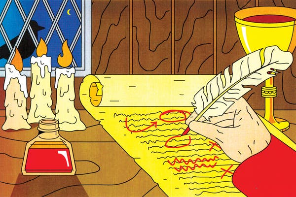

How to Edit Your Own Writing - The New York Times

# How to Edit Your Own Writing

Writing is hard, but don’t overlook the difficulty — and the importance — of editing your own work before letting others see it. Here’s how.

Credit...George Wylesol
By Harry Guinness

- April 7, 2020

-

    - 
    - 
    - [](https://www.nytimes.com/2020/04/07/smarter-living/how-to-edit-your-own-writing.htmlmailto:?subject=NYTimes.com%3A%20How%20to%20Edit%20Your%20Own%20Writing&body=From%20The%20New%20York%20Times%3A%0A%0AHow%20to%20Edit%20Your%20Own%20Writing%0A%0AWriting%20is%20hard%2C%20but%20don%E2%80%99t%20overlook%20the%20difficulty%20%E2%80%94%20and%20the%20importance%20%E2%80%94%20of%20editing%20your%20own%20work%20before%20letting%20others%20see%20it.%20Here%E2%80%99s%20how.%0A%0Ahttps%3A%2F%2Fwww.nytimes.com%2F2020%2F04%2F07%2Fsmarter-living%2Fhow-to-edit-your-own-writing.html%3Fsmid%3Dem-share)

    -
    -

The secret to good writing is good editing. It’s what separates hastily written, randomly punctuated, incoherent rants from learned polemics and op-eds, and cringe-worthy fan fiction from a critically acclaimed novel. By the time this article is done, I’ll have edited and rewritten each line at least a few times. Here’s how to start editing your own work.

##   Understand that what you write first is a draft

It doesn’t matter how good you think you are as a writer — the first words you put on the page are a first draft. Writing is thinking: It’s rare that you’ll know exactly what you’re going to say before you say it. At the end, you need, at the very least, to go back through the draft, tidy everything up and make sure the introduction you wrote at the start matches what you eventually said.

My former writing teacher, the essayist and cartoonist Timothy Kreider, explained revision to me: “One of my favorite phrases is l’esprit d’escalier, ‘the spirit of the staircase’ — meaning that experience of realizing, too late, what the perfect thing to have said at the party, in a conversation or argument or flirtation would have been. Writing offers us one of the rare chances in life at a do-over: to get it right and say what we meant this time. To the extent writers are able to appear any smarter or wittier than readers, it’s only because they’ve cheated by taking so much time to think up what they meant to say and refining it over days or weeks or, yes, even years, until they’ve said it as clearly and elegantly as they can.”

The time you put into editing, reworking and refining turns your first draft into a second — and then into a third and, if you keep at it, eventually something great. The biggest mistake you can make as a writer is to assume that what you wrote the first time through was good enough.

Now, let’s look at how to do the actual editing.

##   Watch for common errors

Most writing mistakes are despairingly common; good writers just get better at catching them before they hit the page. If you’re serious about improving your writing, I recommend you read “The Elements of Style” by William Strunk Jr. and E.B. White, a how-to guide on writing good, clear English and avoiding the most common mistakes. “[Politics and the English Language](https://faculty.washington.edu/rsoder/EDLPS579/HonorsOrwellPoliticsEnglishLanguage.pdf)” by George Orwell is also worth studying if you want to avoid “ugly and inaccurate” writing.

Some of the things you’ll learn to watch for (and that I have to fix all the time in my own writing) are:

- **Overuse of jargon and business speak**. Horrible jargon like “utilize,” “endeavor” or “communicate” — instead of “use,” “try” or “chat” — creep in when people (myself included) are trying to sound smart. It’s the kind of writing that Orwell railed against in his essay. All this sort of writing does is obscure the point you want to make behind false intellectualism. As Orwell said, “Never use a long word when a short one will do.”
- **Clichés.** Clichés are as common as mud but at least getting rid of them is low-hanging fruit. If you’re not sure whether something is a cliché, it’s better to just avoid it. Awful, right? Clichés are stale phrases that have lost their impact and novelty through overuse. At some point, “The grass is always greener on the other side” was a witty observation, but it’s a cliché now. Again, Orwell said it well: “Never use a metaphor, simile, or other figure of speech which you are used to seeing in print.” Oh, and memes very quickly become clichés — be warned.
- **The passive voice.** In most cases, the subject of the sentence should be the person or thing taking action, not the thing being acted on. For example, “This article was written by Harry” is written in the passive voice because the subject (“this article”) is the thing being acted on. The equivalent active construction would be: “Harry wrote this article.” Prose written in the passive voice tends to have an aloofness and passivity to it, which is why it’s generally better to write an active sentence.
- **Rambling**. When you’re not quite sure what you want to say, it’s easy to ramble around a point, phrasing it in three or four different ways and then, instead of cutting them down to a single concise sentence, slapping all four together into a clunky, unclear paragraph. A single direct sentence is almost always better than four that tease around a point.

##   Give your work some space

When you write something, you get very close to it. It’s almost impossible to have the distance to edit properly straight away. Instead, you need to step away and come back later with fresh eyes. The longer you can leave a draft before editing it, the better. I have some essays I go back to every few months for another pass — they’re still not done yet. For most things, though, somewhere from half an hour to two days is enough of a break that you can then edit well. Even 10 minutes will do in a pinch for things like emails.

And when you sit down to edit, read your work out loud.

By forcing yourself to speak the words, rather than just scanning them on a computer screen, you’ll catch more problems and get a better feel for how everything flows. If you stumble over something, your reader will probably stumble over it, too. Some writers even print out their drafts and make edits with a red pen while they read them aloud.

##   Cut, cut, cut

Overwriting is a bigger problem than underwriting. It’s much more likely you’ve written too much than too little. It’s a lot easier to throw words at a problem than to take the time to find the right ones. As Blaise Pascal, a 17th-century writer and scientist (no, not Mark Twain) wrote in a letter, “I have made this longer than usual because I have not had time to make it shorter.”

The rule for most writers is, “If in doubt, cut it.” The Pulitzer Prize-winning writer John McPhee has called the process “writing by omission.” William Faulkner exhorted, “In writing you must kill all your darlings.” This is true at every level: If a word isn’t necessary in a sentence, cut it; if a sentence isn’t necessary in a paragraph, cut it; and if a paragraph isn’t necessary, cut it, too.

## Editors’ Picks

[  ### Larry David, Master of His Quarantine](https://www.nytimes.com/2020/04/04/style/larry-david-curb-your-enthusiasm-coronavirus-psa.html?algo=als1_desk_filter&fellback=false&imp_id=537793785&imp_id=839480852&action=click&module=editorContent&pgtype=Article&region=CompanionColumn&contentCollection=Trending)

[  ### They All Retired Before They Hit 40. Then This Happened.](https://www.nytimes.com/2020/04/02/style/fire-movement-stock-market-coronavirus.html?algo=als1_desk_filter&fellback=false&imp_id=368447956&imp_id=101525707&action=click&module=editorContent&pgtype=Article&region=CompanionColumn&contentCollection=Trending)

[  ### A Renter Realizes He Can Do Better Than Manhattan. Which of These Homes Did He Choose?](https://www.nytimes.com/interactive/2020/04/02/realestate/02hunt-cullen.html?algo=als1_desk_filter&fellback=false&imp_id=968180852&imp_id=567077442&action=click&module=editorContent&pgtype=Article&region=CompanionColumn&contentCollection=Trending)

Advertisement

[Continue reading the main story](https://www.nytimes.com/2020/04/07/smarter-living/how-to-edit-your-own-writing.html#after-story-ad-2)

Go through what you’ve written and look for the bits you can cut without affecting the whole — and cut them. It will tighten the work and make everything you’re trying to say clearer.

##   Spend the most time on the beginning

The beginning of anything you write is the most important part. If you can’t catch someone’s attention at the start, you won’t have a chance to hold it later. Whether you’re writing a novel or an email, you should spend a disproportionate amount of time working on the first few sentences, paragraphs or pages. A lot of problems that can be glossed over in the middle are your undoing at the start.

##   Pay attention to structure

The structure is what your writing hangs on. It doesn’t matter how perfectly the individual sentences are phrased if the whole thing is a nonsensical mess. For emails and other short things, the old college favorite of a topic sentence followed by supporting paragraphs and a conclusion is hard to get wrong. Just make sure you consider your intended audience. A series of long, unrelenting paragraphs will discourage people from reading. Break things up into concise points and, where necessary, insert subheads — as there are in this article. If I’d written this without them, you would just be looking at a stark wall of text.

For longer pieces, structure is something you’ll need to put a lot of work into. Stream of consciousness writing rarely reads well and you generally don’t have the option to break up everything into short segments with subheads. Narratives need to flow and arguments need to build. You have to think about what you’re trying to say in each chapter, section or paragraph, and consider whether it’s working — or if that part would be better placed elsewhere. It’s normal (and even desirable) that the structure of your work will change drastically between drafts; it’s a sign that you’re developing the piece as a whole, rather than just fixing the small problems.

A lot of the time when something you’ve written “just doesn’t work” for people, the structure is to blame. They might not be able to put the problems into words, but they can feel something’s off.

##   Use all the resources you can

While you might not be lucky enough to have access to an editor (Hey, Alan!), there are services that can help.

[Grammarly](https://www.grammarly.com/) is a writing assistant that flags common writing, spelling and grammatical errors; it’s great for catching simple mistakes and cleaning up drafts of your work. A good thesaurus (or even [Thesaurus.com](https://www.thesaurus.com/)) is also essential for finding just the right word. And don’t neglect a second pair of eyes: Ask relatives and friends to read over your work. They might catch some things you missed and can tell you when something is amiss.

Editing your work is at least as important as writing it in the first place. The tweaking, revisiting and revising is what takes something that could be good — and makes it good. Don’t neglect it.

Advertisement

[Continue reading the main story](https://www.nytimes.com/2020/04/07/smarter-living/how-to-edit-your-own-writing.html#after-bottom)