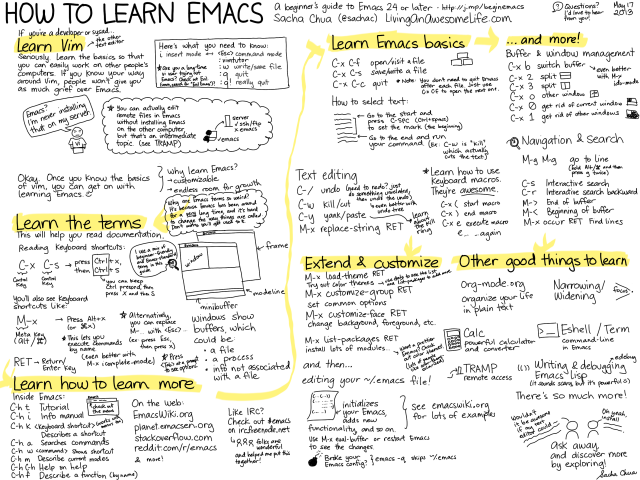

How to Learn Emacs: A Hand-drawn One-pager for Beginners / A visual tutorial –

## [How to Learn Emacs: A Hand-drawn One-pager for Beginners / A visual tutorial](https://sachachua.com/blog/2013/05/how-to-learn-emacs-a-hand-drawn-one-pager-for-beginners/)

Posted on May 17th, 2013 |  by Sacha Chua

More posts about: [emacs](https://sachachua.com/blog/category/geek/emacs/), [sketches](https://sachachua.com/blog/category/visual/sketches/) Tags: [emacs-basics](https://sachachua.com/blog/tag/emacs-basics/), [guide](https://sachachua.com/blog/tag/guide/) // **[44 Comments](https://sachachua.com/blog/2013/05/how-to-learn-emacs-a-hand-drawn-one-pager-for-beginners/#disqus_thread)**

This entry is part 1 of 4 in the series [A Visual Guide to Emacs](https://sachachua.com/blog/series/a-visual-guide-to-emacs/)

UPDATE 2016-12-31: Removed dead link to maplib.

UPDATE 2014-12-30: Added link to [Emacs beginner resources](https://sachachua.com/blog/2014/04/emacs-beginner-resources/)

UPDATE 2013-09-23: New, much larger version – see below!

**Here’s version 2 (September 2013).** You can print this at 16.5″x10.75″ at 300dpi. Have an ordinary printer? Check out [PosteRazor](https://sourceforge.net/projects/posterazor)!

* * *

Original post from May 2013:

[(L)](https://sachachua.com/blog/wp-content/uploads/2013/05/How-to-Learn-Emacs8.png)I thought I’d draw a one-page guide for some of the things that people often ask me about or that would help people learn Emacs (and enjoy it). You can click on the image for a larger version that you can scroll through or download. It should print all right on 8.5×11″ paper (landscape) if you want to keep it around as a reminder. Might even work at 11×17″. =)

You can find the image on [Imgur](https://imgur.com/m0WsEvH) too.

If you’re completely new to Emacs, start with these [Emacs beginner resources](https://sachachua.com/blog/2014/04/emacs-beginner-resources/). If you’re comfortable with Emacs and you want to learn Emacs Lisp, check out my [Read Lisp, Tweak Emacs](https://sachachua.com/blog/series/read-lisp-tweak-emacs/) series. For more Emacs inspiration, check out [Planet Emacsen](http://planet.emacsen.org/).

Feel free to share, reuse, or modify this under the Creative Commons Attribution Licence. Enjoy!

Possibly counterintuitive point: if you’re a developer or system administrator, t’s good to learn at least the basics of Vim. Despite the perception of a “Emacs vs. Vi” holy war (one of the classic battles in computer science), it makes sense to know both editors especially if you work with people who use Vi a lot. Know enough Vi to find your way around, and then learn how to customize Emacs to fit you to a tee. That way, you’ll avoid the pressure of not being able to work well with your team or your infrastructure, and you’ll have the space to explore Emacs. =) Emacs is totally awesome.

Need help with Emacs? Feel free to leave a comment or [get in touch with me](https://sachachua.com/blog/contact). I’m often in the #emacs channel on irc.freenode.net , and I also occasionally schedule time to [help people one-on-one](https://sachachua.com/blog/2013/04/emacs-chat-intro/). Also, the Emacs community (mailing lists, newsgroups, IRC channel) can be wonderful, so definitely reach out to them too. =)

*Meta discussion: *How can I make this even better? What else would you like me to draw a guide for? I’d love to hear your thoughts! Also, thanks to dash, nicferrier, fledermaus, ijp, hypnocat, Fuco, macrobat, taylanub, axrfnu, Sebboh, thorkill, jave_, jrm, and the rest of #emacs for suggestions and feedback!

*Update 2013-05-18: *Check out the conversations on [Hacker News](https://news.ycombinator.com/item?id=5728296) and [Reddit](https://www.reddit.com/r/emacs/comments/1ejdu6/how_to_learn_emacs_a_handdrawn_onepager_for/)!

Series Navigation[How to learn Emacs keyboard shortcuts (a visual tutorial for newbies) »](https://sachachua.com/blog/2013/09/how-to-learn-emacs-keyboard-shortcuts-a-visual-tutorial-for-newbies/)

More posts about: [emacs](https://sachachua.com/blog/category/geek/emacs/), [sketches](https://sachachua.com/blog/category/visual/sketches/) Tags: [emacs-basics](https://sachachua.com/blog/tag/emacs-basics/), [guide](https://sachachua.com/blog/tag/guide/) | [See in index](http://pages.sachachua.com/sharing/blog.html?url=https://sachachua.com/blog/2013/05/how-to-learn-emacs-a-hand-drawn-one-pager-for-beginners/) // **[44 Comments](https://sachachua.com/blog/2013/05/how-to-learn-emacs-a-hand-drawn-one-pager-for-beginners/#disqus_thread)**

### 11 Pingbacks/Trackbacks

**19 May 2013 at 1:05am**
[...] ...

- [Article: How to Learn Emacs: A Hand-drawn One-pager for Beginners » sacha chua :: living an awesome life | Least Action](https://leastaction.wordpress.com/2013/05/19/article-how-to-learn-emacs-a-hand-drawn-one-pager-for-beginners-sacha-chua-living-an-awesome-life/)

**19 May 2013 at 3:05am**

[...] How to Learn Emacs: A Hand-drawn One-pager for Beginners ::: Sacha Chua ...

- [Visto nel Web – 79 | Ok, panico](https://okpanico.wordpress.com/2013/05/19/visto-nel-web-79/)

**20 May 2013 at 12:05pm**
[...] via Hacker News ...

- [How to Learn Emacs: A Hand-drawn One-pager for Beginners | Interesting Reads](https://jeredhiggins.wordpress.com/2013/05/20/how-to-learn-emacs-a-hand-drawn-one-pager-for-beginners/)

**21 May 2013 at 9:05pm**
[...] 这里是图的原文。 ...

- [国外的一个Emacser写的如何学习Emacs » 了解并拥有](http://saharabear.com/weblog/?p=3227)

**28 May 2013 at 11:05am**

[...] Sketchnoting is an excellent example of this and she has already had a very ...

- [Google Hangout with Sacha Chua – koma's world](http://komasworld.com/blog/google-hangout-with-sacha-chua/)

**12 June 2013 at 3:06am**

[...] to disappoint (nothing can live up to that amount of hype). As my one piece of ...

- [Joey's Blog | Web’s Dead, Baby: Part 2](https://josephbales.wordpress.com/2013/06/12/webs-dead-baby-part-2/)

**02 September 2013 at 8:09am**

[…] you like this, you might also like the similar hand-drawn one-page guide I made ...

- [How to learn Emacs keyboard shortcuts (a visual tutorial for newbies) » sacha chua :: living an awesome life](https://sachachua.com/blog/2013/09/how-to-learn-emacs-keyboard-shortcuts-a-visual-tutorial-for-newbies/)

**10 October 2013 at 9:10pm**
[…] Fuente original ...

- [Cómo aprender Emacs |](http://www.cyberhades.com/2013/10/11/como-aprender-emacs/)

**10 August 2014 at 2:08pm**
[…] ...

- [Learn Emacs! | TODO: need cool title here](https://jerdmann.wordpress.com/2014/08/10/learn-emacs/)

**03 August 2016 at 2:08pm**
[…] How to Learn Emacs: A Hand-drawn One-pager for Beginners ...

- [Clojure Gazette 1.42 | Clojure Gazette](http://new.clojuregazette.com/clojure-gazette-1-42/)

**24 September 2016 at 6:09am**
[…] How to learn Emacs ...

- [Debian es fiable, pero no a prueba de soberbios! – Quijote Libre](http://quijotelibre.com/debian-es-fiable-pero-no-a-prueba-de-soberbios/)

- [44 comments]()
- [**sacha chua :: living an awesome life**](https://disqus.com/home/forums/sachac/)
- [Marc Cohen](https://disqus.com/embed/comments/?base=default&f=sachac&t_i=24836%20http%3A%2F%2Fsachachua.com%2Fblog%2F%3Fp%3D24836&t_u=https%3A%2F%2Fsachachua.com%2Fblog%2F2013%2F05%2Fhow-to-learn-emacs-a-hand-drawn-one-pager-for-beginners%2F&t_e=How%20to%20Learn%20Emacs%3A%20A%20Hand-drawn%20One-pager%20for%20Beginners%20%2F%20A%20visual%20tutorial&t_d=How%20to%20Learn%20Emacs%3A%20A%20Hand-drawn%20One-pager%20for%20Beginners%20%2F%20A%20visual%20tutorial%20%E2%80%93&t_t=How%20to%20Learn%20Emacs%3A%20A%20Hand-drawn%20One-pager%20for%20Beginners%20%2F%20A%20visual%20tutorial&s_o=default#)
- [](https://disqus.com/home/inbox/)
- [ Recommend  2](https://disqus.com/embed/comments/?base=default&f=sachac&t_i=24836%20http%3A%2F%2Fsachachua.com%2Fblog%2F%3Fp%3D24836&t_u=https%3A%2F%2Fsachachua.com%2Fblog%2F2013%2F05%2Fhow-to-learn-emacs-a-hand-drawn-one-pager-for-beginners%2F&t_e=How%20to%20Learn%20Emacs%3A%20A%20Hand-drawn%20One-pager%20for%20Beginners%20%2F%20A%20visual%20tutorial&t_d=How%20to%20Learn%20Emacs%3A%20A%20Hand-drawn%20One-pager%20for%20Beginners%20%2F%20A%20visual%20tutorial%20%E2%80%93&t_t=How%20to%20Learn%20Emacs%3A%20A%20Hand-drawn%20One-pager%20for%20Beginners%20%2F%20A%20visual%20tutorial&s_o=default#)
- tTweetfShare
- [Sort by Newest](https://disqus.com/embed/comments/?base=default&f=sachac&t_i=24836%20http%3A%2F%2Fsachachua.com%2Fblog%2F%3Fp%3D24836&t_u=https%3A%2F%2Fsachachua.com%2Fblog%2F2013%2F05%2Fhow-to-learn-emacs-a-hand-drawn-one-pager-for-beginners%2F&t_e=How%20to%20Learn%20Emacs%3A%20A%20Hand-drawn%20One-pager%20for%20Beginners%20%2F%20A%20visual%20tutorial&t_d=How%20to%20Learn%20Emacs%3A%20A%20Hand-drawn%20One-pager%20for%20Beginners%20%2F%20A%20visual%20tutorial%20%E2%80%93&t_t=How%20to%20Learn%20Emacs%3A%20A%20Hand-drawn%20One-pager%20for%20Beginners%20%2F%20A%20visual%20tutorial&s_o=default#)

Join the discussion…

[(L)](https://disqus.com/embed/comments/?base=default&f=sachac&t_i=24836%20http%3A%2F%2Fsachachua.com%2Fblog%2F%3Fp%3D24836&t_u=https%3A%2F%2Fsachachua.com%2Fblog%2F2013%2F05%2Fhow-to-learn-emacs-a-hand-drawn-one-pager-for-beginners%2F&t_e=How%20to%20Learn%20Emacs%3A%20A%20Hand-drawn%20One-pager%20for%20Beginners%20%2F%20A%20visual%20tutorial&t_d=How%20to%20Learn%20Emacs%3A%20A%20Hand-drawn%20One-pager%20for%20Beginners%20%2F%20A%20visual%20tutorial%20%E2%80%93&t_t=How%20to%20Learn%20Emacs%3A%20A%20Hand-drawn%20One-pager%20for%20Beginners%20%2F%20A%20visual%20tutorial&s_o=default#)

-

    - [−](https://disqus.com/embed/comments/?base=default&f=sachac&t_i=24836%20http%3A%2F%2Fsachachua.com%2Fblog%2F%3Fp%3D24836&t_u=https%3A%2F%2Fsachachua.com%2Fblog%2F2013%2F05%2Fhow-to-learn-emacs-a-hand-drawn-one-pager-for-beginners%2F&t_e=How%20to%20Learn%20Emacs%3A%20A%20Hand-drawn%20One-pager%20for%20Beginners%20%2F%20A%20visual%20tutorial&t_d=How%20to%20Learn%20Emacs%3A%20A%20Hand-drawn%20One-pager%20for%20Beginners%20%2F%20A%20visual%20tutorial%20%E2%80%93&t_t=How%20to%20Learn%20Emacs%3A%20A%20Hand-drawn%20One-pager%20for%20Beginners%20%2F%20A%20visual%20tutorial&s_o=default#)
    - [****](https://disqus.com/embed/comments/?base=default&f=sachac&t_i=24836%20http%3A%2F%2Fsachachua.com%2Fblog%2F%3Fp%3D24836&t_u=https%3A%2F%2Fsachachua.com%2Fblog%2F2013%2F05%2Fhow-to-learn-emacs-a-hand-drawn-one-pager-for-beginners%2F&t_e=How%20to%20Learn%20Emacs%3A%20A%20Hand-drawn%20One-pager%20for%20Beginners%20%2F%20A%20visual%20tutorial&t_d=How%20to%20Learn%20Emacs%3A%20A%20Hand-drawn%20One-pager%20for%20Beginners%20%2F%20A%20visual%20tutorial%20%E2%80%93&t_t=How%20to%20Learn%20Emacs%3A%20A%20Hand-drawn%20One-pager%20for%20Beginners%20%2F%20A%20visual%20tutorial&s_o=default#)

Steve  •  [2 years ago](https://sachachua.com/blog/2013/05/how-to-learn-emacs-a-hand-drawn-one-pager-for-beginners/#comment-3631843103)

So happy to find this!! And the poster print tools as well

-

    - [−](https://disqus.com/embed/comments/?base=default&f=sachac&t_i=24836%20http%3A%2F%2Fsachachua.com%2Fblog%2F%3Fp%3D24836&t_u=https%3A%2F%2Fsachachua.com%2Fblog%2F2013%2F05%2Fhow-to-learn-emacs-a-hand-drawn-one-pager-for-beginners%2F&t_e=How%20to%20Learn%20Emacs%3A%20A%20Hand-drawn%20One-pager%20for%20Beginners%20%2F%20A%20visual%20tutorial&t_d=How%20to%20Learn%20Emacs%3A%20A%20Hand-drawn%20One-pager%20for%20Beginners%20%2F%20A%20visual%20tutorial%20%E2%80%93&t_t=How%20to%20Learn%20Emacs%3A%20A%20Hand-drawn%20One-pager%20for%20Beginners%20%2F%20A%20visual%20tutorial&s_o=default#)
    - [****](https://disqus.com/embed/comments/?base=default&f=sachac&t_i=24836%20http%3A%2F%2Fsachachua.com%2Fblog%2F%3Fp%3D24836&t_u=https%3A%2F%2Fsachachua.com%2Fblog%2F2013%2F05%2Fhow-to-learn-emacs-a-hand-drawn-one-pager-for-beginners%2F&t_e=How%20to%20Learn%20Emacs%3A%20A%20Hand-drawn%20One-pager%20for%20Beginners%20%2F%20A%20visual%20tutorial&t_d=How%20to%20Learn%20Emacs%3A%20A%20Hand-drawn%20One-pager%20for%20Beginners%20%2F%20A%20visual%20tutorial%20%E2%80%93&t_t=How%20to%20Learn%20Emacs%3A%20A%20Hand-drawn%20One-pager%20for%20Beginners%20%2F%20A%20visual%20tutorial&s_o=default#)

 [Timothy Hoyoung Lee](https://disqus.com/by/timothy733/)    •  [2 years ago](https://sachachua.com/blog/2013/05/how-to-learn-emacs-a-hand-drawn-one-pager-for-beginners/#comment-3622072412)

Thanks for this. It encouraged me to actually start learning Emacs.

I was a Emacs 'muggle' for most of my life until I stumbled upon a YouTube video introducing Org-Mode just two days ago. Seeing Org-Mode in action for the first time is like seeing someone pull off a magic trick. That got me interested to try out Emacs. Once I read your guide, I had a good sense of what to expect when I learn Emacs. Now I'm half-way through the Emacs built-in tutorials. I'm really looking forward to the day I start using Org-Mode for my personal workflows!

-

    - [−](https://disqus.com/embed/comments/?base=default&f=sachac&t_i=24836%20http%3A%2F%2Fsachachua.com%2Fblog%2F%3Fp%3D24836&t_u=https%3A%2F%2Fsachachua.com%2Fblog%2F2013%2F05%2Fhow-to-learn-emacs-a-hand-drawn-one-pager-for-beginners%2F&t_e=How%20to%20Learn%20Emacs%3A%20A%20Hand-drawn%20One-pager%20for%20Beginners%20%2F%20A%20visual%20tutorial&t_d=How%20to%20Learn%20Emacs%3A%20A%20Hand-drawn%20One-pager%20for%20Beginners%20%2F%20A%20visual%20tutorial%20%E2%80%93&t_t=How%20to%20Learn%20Emacs%3A%20A%20Hand-drawn%20One-pager%20for%20Beginners%20%2F%20A%20visual%20tutorial&s_o=default#)
    - [****](https://disqus.com/embed/comments/?base=default&f=sachac&t_i=24836%20http%3A%2F%2Fsachachua.com%2Fblog%2F%3Fp%3D24836&t_u=https%3A%2F%2Fsachachua.com%2Fblog%2F2013%2F05%2Fhow-to-learn-emacs-a-hand-drawn-one-pager-for-beginners%2F&t_e=How%20to%20Learn%20Emacs%3A%20A%20Hand-drawn%20One-pager%20for%20Beginners%20%2F%20A%20visual%20tutorial&t_d=How%20to%20Learn%20Emacs%3A%20A%20Hand-drawn%20One-pager%20for%20Beginners%20%2F%20A%20visual%20tutorial%20%E2%80%93&t_t=How%20to%20Learn%20Emacs%3A%20A%20Hand-drawn%20One-pager%20for%20Beginners%20%2F%20A%20visual%20tutorial&s_o=default#)

 [Emmanuel Goldstein](https://disqus.com/by/disqus_XC2dDbPpFz/)    •  [2 years ago](https://sachachua.com/blog/2013/05/how-to-learn-emacs-a-hand-drawn-one-pager-for-beginners/#comment-3455947965)

Thanks Sacha. A question that I have been trying to solve on my own, unsuccessfully: is it possible to attach warnings to time stamps which are not SCHEDULE or DEADLINE? Let's say I have a doctor appointment (so it's not a deadline or a schedule task - because I don't intend to work on that). Just a mere one time event. Is it possible that emacs notifies me in the agenda a number of days in advance? Thanks! This would really useful

    -

        - [−](https://disqus.com/embed/comments/?base=default&f=sachac&t_i=24836%20http%3A%2F%2Fsachachua.com%2Fblog%2F%3Fp%3D24836&t_u=https%3A%2F%2Fsachachua.com%2Fblog%2F2013%2F05%2Fhow-to-learn-emacs-a-hand-drawn-one-pager-for-beginners%2F&t_e=How%20to%20Learn%20Emacs%3A%20A%20Hand-drawn%20One-pager%20for%20Beginners%20%2F%20A%20visual%20tutorial&t_d=How%20to%20Learn%20Emacs%3A%20A%20Hand-drawn%20One-pager%20for%20Beginners%20%2F%20A%20visual%20tutorial%20%E2%80%93&t_t=How%20to%20Learn%20Emacs%3A%20A%20Hand-drawn%20One-pager%20for%20Beginners%20%2F%20A%20visual%20tutorial&s_o=default#)
        - [****](https://disqus.com/embed/comments/?base=default&f=sachac&t_i=24836%20http%3A%2F%2Fsachachua.com%2Fblog%2F%3Fp%3D24836&t_u=https%3A%2F%2Fsachachua.com%2Fblog%2F2013%2F05%2Fhow-to-learn-emacs-a-hand-drawn-one-pager-for-beginners%2F&t_e=How%20to%20Learn%20Emacs%3A%20A%20Hand-drawn%20One-pager%20for%20Beginners%20%2F%20A%20visual%20tutorial&t_d=How%20to%20Learn%20Emacs%3A%20A%20Hand-drawn%20One-pager%20for%20Beginners%20%2F%20A%20visual%20tutorial%20%E2%80%93&t_t=How%20to%20Learn%20Emacs%3A%20A%20Hand-drawn%20One-pager%20for%20Beginners%20%2F%20A%20visual%20tutorial&s_o=default#)

 [sachac](https://disqus.com/by/sachac/)  Mod  [*>* Emmanuel Goldstein](https://sachachua.com/blog/2013/05/how-to-learn-emacs-a-hand-drawn-one-pager-for-beginners/#comment-3455947965)  •  [2 years ago](https://sachachua.com/blog/2013/05/how-to-learn-emacs-a-hand-drawn-one-pager-for-beginners/#comment-3460566861)

I'd probably use DEADLINE for automatic warnings (and just remember to mark it as done afterwards), or maybe add an active timestamp with C-c . (org-time-stamp). Active timestamps look like <2017-08-09 Wed> and cause the entry to show up in the agenda view. [http://orgmode.org/manual/T...](http://disq.us/url?url=http%3A%2F%2Forgmode.org%2Fmanual%2FTimestamps.html%3AIBiBY7uAhRobp-asUwWQMKCudU4&cuid=71937) has more info. Good luck!

        -

            - [−](https://disqus.com/embed/comments/?base=default&f=sachac&t_i=24836%20http%3A%2F%2Fsachachua.com%2Fblog%2F%3Fp%3D24836&t_u=https%3A%2F%2Fsachachua.com%2Fblog%2F2013%2F05%2Fhow-to-learn-emacs-a-hand-drawn-one-pager-for-beginners%2F&t_e=How%20to%20Learn%20Emacs%3A%20A%20Hand-drawn%20One-pager%20for%20Beginners%20%2F%20A%20visual%20tutorial&t_d=How%20to%20Learn%20Emacs%3A%20A%20Hand-drawn%20One-pager%20for%20Beginners%20%2F%20A%20visual%20tutorial%20%E2%80%93&t_t=How%20to%20Learn%20Emacs%3A%20A%20Hand-drawn%20One-pager%20for%20Beginners%20%2F%20A%20visual%20tutorial&s_o=default#)
            - [****](https://disqus.com/embed/comments/?base=default&f=sachac&t_i=24836%20http%3A%2F%2Fsachachua.com%2Fblog%2F%3Fp%3D24836&t_u=https%3A%2F%2Fsachachua.com%2Fblog%2F2013%2F05%2Fhow-to-learn-emacs-a-hand-drawn-one-pager-for-beginners%2F&t_e=How%20to%20Learn%20Emacs%3A%20A%20Hand-drawn%20One-pager%20for%20Beginners%20%2F%20A%20visual%20tutorial&t_d=How%20to%20Learn%20Emacs%3A%20A%20Hand-drawn%20One-pager%20for%20Beginners%20%2F%20A%20visual%20tutorial%20%E2%80%93&t_t=How%20to%20Learn%20Emacs%3A%20A%20Hand-drawn%20One-pager%20for%20Beginners%20%2F%20A%20visual%20tutorial&s_o=default#)

 [Emmanuel Goldstein](https://disqus.com/by/disqus_XC2dDbPpFz/)    [*>* sachac](https://sachachua.com/blog/2013/05/how-to-learn-emacs-a-hand-drawn-one-pager-for-beginners/#comment-3460566861)  •  [2 years ago](https://sachachua.com/blog/2013/05/how-to-learn-emacs-a-hand-drawn-one-pager-for-beginners/#comment-3464754752)

Thansk Sasha. as for the active timestamps, is there a way for emacs to notify (warn) in advance for those such as for deadlines? Thank you.

            -

                - [−](https://disqus.com/embed/comments/?base=default&f=sachac&t_i=24836%20http%3A%2F%2Fsachachua.com%2Fblog%2F%3Fp%3D24836&t_u=https%3A%2F%2Fsachachua.com%2Fblog%2F2013%2F05%2Fhow-to-learn-emacs-a-hand-drawn-one-pager-for-beginners%2F&t_e=How%20to%20Learn%20Emacs%3A%20A%20Hand-drawn%20One-pager%20for%20Beginners%20%2F%20A%20visual%20tutorial&t_d=How%20to%20Learn%20Emacs%3A%20A%20Hand-drawn%20One-pager%20for%20Beginners%20%2F%20A%20visual%20tutorial%20%E2%80%93&t_t=How%20to%20Learn%20Emacs%3A%20A%20Hand-drawn%20One-pager%20for%20Beginners%20%2F%20A%20visual%20tutorial&s_o=default#)
                - [****](https://disqus.com/embed/comments/?base=default&f=sachac&t_i=24836%20http%3A%2F%2Fsachachua.com%2Fblog%2F%3Fp%3D24836&t_u=https%3A%2F%2Fsachachua.com%2Fblog%2F2013%2F05%2Fhow-to-learn-emacs-a-hand-drawn-one-pager-for-beginners%2F&t_e=How%20to%20Learn%20Emacs%3A%20A%20Hand-drawn%20One-pager%20for%20Beginners%20%2F%20A%20visual%20tutorial&t_d=How%20to%20Learn%20Emacs%3A%20A%20Hand-drawn%20One-pager%20for%20Beginners%20%2F%20A%20visual%20tutorial%20%E2%80%93&t_t=How%20to%20Learn%20Emacs%3A%20A%20Hand-drawn%20One-pager%20for%20Beginners%20%2F%20A%20visual%20tutorial&s_o=default#)

 [sachac](https://disqus.com/by/sachac/)  Mod  [*>* Emmanuel Goldstein](https://sachachua.com/blog/2013/05/how-to-learn-emacs-a-hand-drawn-one-pager-for-beginners/#comment-3464754752)  •  [2 years ago](https://sachachua.com/blog/2013/05/how-to-learn-emacs-a-hand-drawn-one-pager-for-beginners/#comment-3469142472)

I like using a weekly agenda view and a 2-day agenda view. You could also add extra active timestamps or additional entries.

-

    - [−](https://disqus.com/embed/comments/?base=default&f=sachac&t_i=24836%20http%3A%2F%2Fsachachua.com%2Fblog%2F%3Fp%3D24836&t_u=https%3A%2F%2Fsachachua.com%2Fblog%2F2013%2F05%2Fhow-to-learn-emacs-a-hand-drawn-one-pager-for-beginners%2F&t_e=How%20to%20Learn%20Emacs%3A%20A%20Hand-drawn%20One-pager%20for%20Beginners%20%2F%20A%20visual%20tutorial&t_d=How%20to%20Learn%20Emacs%3A%20A%20Hand-drawn%20One-pager%20for%20Beginners%20%2F%20A%20visual%20tutorial%20%E2%80%93&t_t=How%20to%20Learn%20Emacs%3A%20A%20Hand-drawn%20One-pager%20for%20Beginners%20%2F%20A%20visual%20tutorial&s_o=default#)
    - [****](https://disqus.com/embed/comments/?base=default&f=sachac&t_i=24836%20http%3A%2F%2Fsachachua.com%2Fblog%2F%3Fp%3D24836&t_u=https%3A%2F%2Fsachachua.com%2Fblog%2F2013%2F05%2Fhow-to-learn-emacs-a-hand-drawn-one-pager-for-beginners%2F&t_e=How%20to%20Learn%20Emacs%3A%20A%20Hand-drawn%20One-pager%20for%20Beginners%20%2F%20A%20visual%20tutorial&t_d=How%20to%20Learn%20Emacs%3A%20A%20Hand-drawn%20One-pager%20for%20Beginners%20%2F%20A%20visual%20tutorial%20%E2%80%93&t_t=How%20to%20Learn%20Emacs%3A%20A%20Hand-drawn%20One-pager%20for%20Beginners%20%2F%20A%20visual%20tutorial&s_o=default#)

 [Bart](https://disqus.com/by/disqus_azwoDG1U6P/)    •  [3 years ago](https://sachachua.com/blog/2013/05/how-to-learn-emacs-a-hand-drawn-one-pager-for-beginners/#comment-3076215336)

maplib seems to have died unfortunately :(

    -

        - [−](https://disqus.com/embed/comments/?base=default&f=sachac&t_i=24836%20http%3A%2F%2Fsachachua.com%2Fblog%2F%3Fp%3D24836&t_u=https%3A%2F%2Fsachachua.com%2Fblog%2F2013%2F05%2Fhow-to-learn-emacs-a-hand-drawn-one-pager-for-beginners%2F&t_e=How%20to%20Learn%20Emacs%3A%20A%20Hand-drawn%20One-pager%20for%20Beginners%20%2F%20A%20visual%20tutorial&t_d=How%20to%20Learn%20Emacs%3A%20A%20Hand-drawn%20One-pager%20for%20Beginners%20%2F%20A%20visual%20tutorial%20%E2%80%93&t_t=How%20to%20Learn%20Emacs%3A%20A%20Hand-drawn%20One-pager%20for%20Beginners%20%2F%20A%20visual%20tutorial&s_o=default#)
        - [****](https://disqus.com/embed/comments/?base=default&f=sachac&t_i=24836%20http%3A%2F%2Fsachachua.com%2Fblog%2F%3Fp%3D24836&t_u=https%3A%2F%2Fsachachua.com%2Fblog%2F2013%2F05%2Fhow-to-learn-emacs-a-hand-drawn-one-pager-for-beginners%2F&t_e=How%20to%20Learn%20Emacs%3A%20A%20Hand-drawn%20One-pager%20for%20Beginners%20%2F%20A%20visual%20tutorial&t_d=How%20to%20Learn%20Emacs%3A%20A%20Hand-drawn%20One-pager%20for%20Beginners%20%2F%20A%20visual%20tutorial%20%E2%80%93&t_t=How%20to%20Learn%20Emacs%3A%20A%20Hand-drawn%20One-pager%20for%20Beginners%20%2F%20A%20visual%20tutorial&s_o=default#)

 [sachac](https://disqus.com/by/sachac/)  Mod  [*>* Bart](https://sachachua.com/blog/2013/05/how-to-learn-emacs-a-hand-drawn-one-pager-for-beginners/#comment-3076215336)  •  [3 years ago](https://sachachua.com/blog/2013/05/how-to-learn-emacs-a-hand-drawn-one-pager-for-beginners/#comment-3076494046)

Thanks for letting me know! I removed the link. You should still be able to get the hi-res version of the image and pan/zoom around it in your favourite image tool. Ah, bitrot!

-

    - [−](https://disqus.com/embed/comments/?base=default&f=sachac&t_i=24836%20http%3A%2F%2Fsachachua.com%2Fblog%2F%3Fp%3D24836&t_u=https%3A%2F%2Fsachachua.com%2Fblog%2F2013%2F05%2Fhow-to-learn-emacs-a-hand-drawn-one-pager-for-beginners%2F&t_e=How%20to%20Learn%20Emacs%3A%20A%20Hand-drawn%20One-pager%20for%20Beginners%20%2F%20A%20visual%20tutorial&t_d=How%20to%20Learn%20Emacs%3A%20A%20Hand-drawn%20One-pager%20for%20Beginners%20%2F%20A%20visual%20tutorial%20%E2%80%93&t_t=How%20to%20Learn%20Emacs%3A%20A%20Hand-drawn%20One-pager%20for%20Beginners%20%2F%20A%20visual%20tutorial&s_o=default#)
    - [****](https://disqus.com/embed/comments/?base=default&f=sachac&t_i=24836%20http%3A%2F%2Fsachachua.com%2Fblog%2F%3Fp%3D24836&t_u=https%3A%2F%2Fsachachua.com%2Fblog%2F2013%2F05%2Fhow-to-learn-emacs-a-hand-drawn-one-pager-for-beginners%2F&t_e=How%20to%20Learn%20Emacs%3A%20A%20Hand-drawn%20One-pager%20for%20Beginners%20%2F%20A%20visual%20tutorial&t_d=How%20to%20Learn%20Emacs%3A%20A%20Hand-drawn%20One-pager%20for%20Beginners%20%2F%20A%20visual%20tutorial%20%E2%80%93&t_t=How%20to%20Learn%20Emacs%3A%20A%20Hand-drawn%20One-pager%20for%20Beginners%20%2F%20A%20visual%20tutorial&s_o=default#)

 [Marcos Estigarribia](https://disqus.com/by/marcosestigarribia/)    •  [4 years ago](https://sachachua.com/blog/2013/05/how-to-learn-emacs-a-hand-drawn-one-pager-for-beginners/#comment-2241019796)

Great ¡¡¡

-

    - [−](https://disqus.com/embed/comments/?base=default&f=sachac&t_i=24836%20http%3A%2F%2Fsachachua.com%2Fblog%2F%3Fp%3D24836&t_u=https%3A%2F%2Fsachachua.com%2Fblog%2F2013%2F05%2Fhow-to-learn-emacs-a-hand-drawn-one-pager-for-beginners%2F&t_e=How%20to%20Learn%20Emacs%3A%20A%20Hand-drawn%20One-pager%20for%20Beginners%20%2F%20A%20visual%20tutorial&t_d=How%20to%20Learn%20Emacs%3A%20A%20Hand-drawn%20One-pager%20for%20Beginners%20%2F%20A%20visual%20tutorial%20%E2%80%93&t_t=How%20to%20Learn%20Emacs%3A%20A%20Hand-drawn%20One-pager%20for%20Beginners%20%2F%20A%20visual%20tutorial&s_o=default#)
    - [****](https://disqus.com/embed/comments/?base=default&f=sachac&t_i=24836%20http%3A%2F%2Fsachachua.com%2Fblog%2F%3Fp%3D24836&t_u=https%3A%2F%2Fsachachua.com%2Fblog%2F2013%2F05%2Fhow-to-learn-emacs-a-hand-drawn-one-pager-for-beginners%2F&t_e=How%20to%20Learn%20Emacs%3A%20A%20Hand-drawn%20One-pager%20for%20Beginners%20%2F%20A%20visual%20tutorial&t_d=How%20to%20Learn%20Emacs%3A%20A%20Hand-drawn%20One-pager%20for%20Beginners%20%2F%20A%20visual%20tutorial%20%E2%80%93&t_t=How%20to%20Learn%20Emacs%3A%20A%20Hand-drawn%20One-pager%20for%20Beginners%20%2F%20A%20visual%20tutorial&s_o=default#)

 [ej](https://disqus.com/by/disqus_AYBj5W37sU/)    •  [5 years ago](https://sachachua.com/blog/2013/05/how-to-learn-emacs-a-hand-drawn-one-pager-for-beginners/#comment-1433345535)

I really enjoyed this, thanks.

-

    - [−](https://disqus.com/embed/comments/?base=default&f=sachac&t_i=24836%20http%3A%2F%2Fsachachua.com%2Fblog%2F%3Fp%3D24836&t_u=https%3A%2F%2Fsachachua.com%2Fblog%2F2013%2F05%2Fhow-to-learn-emacs-a-hand-drawn-one-pager-for-beginners%2F&t_e=How%20to%20Learn%20Emacs%3A%20A%20Hand-drawn%20One-pager%20for%20Beginners%20%2F%20A%20visual%20tutorial&t_d=How%20to%20Learn%20Emacs%3A%20A%20Hand-drawn%20One-pager%20for%20Beginners%20%2F%20A%20visual%20tutorial%20%E2%80%93&t_t=How%20to%20Learn%20Emacs%3A%20A%20Hand-drawn%20One-pager%20for%20Beginners%20%2F%20A%20visual%20tutorial&s_o=default#)
    - [****](https://disqus.com/embed/comments/?base=default&f=sachac&t_i=24836%20http%3A%2F%2Fsachachua.com%2Fblog%2F%3Fp%3D24836&t_u=https%3A%2F%2Fsachachua.com%2Fblog%2F2013%2F05%2Fhow-to-learn-emacs-a-hand-drawn-one-pager-for-beginners%2F&t_e=How%20to%20Learn%20Emacs%3A%20A%20Hand-drawn%20One-pager%20for%20Beginners%20%2F%20A%20visual%20tutorial&t_d=How%20to%20Learn%20Emacs%3A%20A%20Hand-drawn%20One-pager%20for%20Beginners%20%2F%20A%20visual%20tutorial%20%E2%80%93&t_t=How%20to%20Learn%20Emacs%3A%20A%20Hand-drawn%20One-pager%20for%20Beginners%20%2F%20A%20visual%20tutorial&s_o=default#)

 [Nick Horton](https://disqus.com/by/theironsamurai/)    •  [6 years ago](https://sachachua.com/blog/2013/05/how-to-learn-emacs-a-hand-drawn-one-pager-for-beginners/#comment-1197774588)

This is wonderful. Thank you! :-)

-

    - [−](https://disqus.com/embed/comments/?base=default&f=sachac&t_i=24836%20http%3A%2F%2Fsachachua.com%2Fblog%2F%3Fp%3D24836&t_u=https%3A%2F%2Fsachachua.com%2Fblog%2F2013%2F05%2Fhow-to-learn-emacs-a-hand-drawn-one-pager-for-beginners%2F&t_e=How%20to%20Learn%20Emacs%3A%20A%20Hand-drawn%20One-pager%20for%20Beginners%20%2F%20A%20visual%20tutorial&t_d=How%20to%20Learn%20Emacs%3A%20A%20Hand-drawn%20One-pager%20for%20Beginners%20%2F%20A%20visual%20tutorial%20%E2%80%93&t_t=How%20to%20Learn%20Emacs%3A%20A%20Hand-drawn%20One-pager%20for%20Beginners%20%2F%20A%20visual%20tutorial&s_o=default#)
    - [****](https://disqus.com/embed/comments/?base=default&f=sachac&t_i=24836%20http%3A%2F%2Fsachachua.com%2Fblog%2F%3Fp%3D24836&t_u=https%3A%2F%2Fsachachua.com%2Fblog%2F2013%2F05%2Fhow-to-learn-emacs-a-hand-drawn-one-pager-for-beginners%2F&t_e=How%20to%20Learn%20Emacs%3A%20A%20Hand-drawn%20One-pager%20for%20Beginners%20%2F%20A%20visual%20tutorial&t_d=How%20to%20Learn%20Emacs%3A%20A%20Hand-drawn%20One-pager%20for%20Beginners%20%2F%20A%20visual%20tutorial%20%E2%80%93&t_t=How%20to%20Learn%20Emacs%3A%20A%20Hand-drawn%20One-pager%20for%20Beginners%20%2F%20A%20visual%20tutorial&s_o=default#)

Dennis Kibbe  •  [6 years ago](https://sachachua.com/blog/2013/05/how-to-learn-emacs-a-hand-drawn-one-pager-for-beginners/#comment-1095580492)

Sascha, What a treasure you are for the Emacs community! This one-pager is perfect for my CIS students. :-)

    -

        - [−](https://disqus.com/embed/comments/?base=default&f=sachac&t_i=24836%20http%3A%2F%2Fsachachua.com%2Fblog%2F%3Fp%3D24836&t_u=https%3A%2F%2Fsachachua.com%2Fblog%2F2013%2F05%2Fhow-to-learn-emacs-a-hand-drawn-one-pager-for-beginners%2F&t_e=How%20to%20Learn%20Emacs%3A%20A%20Hand-drawn%20One-pager%20for%20Beginners%20%2F%20A%20visual%20tutorial&t_d=How%20to%20Learn%20Emacs%3A%20A%20Hand-drawn%20One-pager%20for%20Beginners%20%2F%20A%20visual%20tutorial%20%E2%80%93&t_t=How%20to%20Learn%20Emacs%3A%20A%20Hand-drawn%20One-pager%20for%20Beginners%20%2F%20A%20visual%20tutorial&s_o=default#)
        - [****](https://disqus.com/embed/comments/?base=default&f=sachac&t_i=24836%20http%3A%2F%2Fsachachua.com%2Fblog%2F%3Fp%3D24836&t_u=https%3A%2F%2Fsachachua.com%2Fblog%2F2013%2F05%2Fhow-to-learn-emacs-a-hand-drawn-one-pager-for-beginners%2F&t_e=How%20to%20Learn%20Emacs%3A%20A%20Hand-drawn%20One-pager%20for%20Beginners%20%2F%20A%20visual%20tutorial&t_d=How%20to%20Learn%20Emacs%3A%20A%20Hand-drawn%20One-pager%20for%20Beginners%20%2F%20A%20visual%20tutorial%20%E2%80%93&t_t=How%20to%20Learn%20Emacs%3A%20A%20Hand-drawn%20One-pager%20for%20Beginners%20%2F%20A%20visual%20tutorial&s_o=default#)

Sacha Chua  [*>* Dennis Kibbe](https://sachachua.com/blog/2013/05/how-to-learn-emacs-a-hand-drawn-one-pager-for-beginners/#comment-1095580492)  •  [6 years ago](https://sachachua.com/blog/2013/05/how-to-learn-emacs-a-hand-drawn-one-pager-for-beginners/#comment-1095590660)

Hooray! Don't miss the [keyboard shortcuts one-pager](http://disq.us/url?url=http%3A%2F%2Fsach.ac%2Fp%2F26006%3ALtNIXgfwHa8ianYwW5_BpMnWi-A&cuid=71937), which would be good to print on the back. =)

-

    - [−](https://disqus.com/embed/comments/?base=default&f=sachac&t_i=24836%20http%3A%2F%2Fsachachua.com%2Fblog%2F%3Fp%3D24836&t_u=https%3A%2F%2Fsachachua.com%2Fblog%2F2013%2F05%2Fhow-to-learn-emacs-a-hand-drawn-one-pager-for-beginners%2F&t_e=How%20to%20Learn%20Emacs%3A%20A%20Hand-drawn%20One-pager%20for%20Beginners%20%2F%20A%20visual%20tutorial&t_d=How%20to%20Learn%20Emacs%3A%20A%20Hand-drawn%20One-pager%20for%20Beginners%20%2F%20A%20visual%20tutorial%20%E2%80%93&t_t=How%20to%20Learn%20Emacs%3A%20A%20Hand-drawn%20One-pager%20for%20Beginners%20%2F%20A%20visual%20tutorial&s_o=default#)
    - [****](https://disqus.com/embed/comments/?base=default&f=sachac&t_i=24836%20http%3A%2F%2Fsachachua.com%2Fblog%2F%3Fp%3D24836&t_u=https%3A%2F%2Fsachachua.com%2Fblog%2F2013%2F05%2Fhow-to-learn-emacs-a-hand-drawn-one-pager-for-beginners%2F&t_e=How%20to%20Learn%20Emacs%3A%20A%20Hand-drawn%20One-pager%20for%20Beginners%20%2F%20A%20visual%20tutorial&t_d=How%20to%20Learn%20Emacs%3A%20A%20Hand-drawn%20One-pager%20for%20Beginners%20%2F%20A%20visual%20tutorial%20%E2%80%93&t_t=How%20to%20Learn%20Emacs%3A%20A%20Hand-drawn%20One-pager%20for%20Beginners%20%2F%20A%20visual%20tutorial&s_o=default#)

 [Sylver Stone](https://disqus.com/by/sylver_stone/)    •  [7 years ago](https://sachachua.com/blog/2013/05/how-to-learn-emacs-a-hand-drawn-one-pager-for-beginners/#comment-903775025)

Yeap, I had to get all above summarized through (and much more) when starting with emacs. I found this post so illustrative, I've enjoyed it. I'm trying with emacs-prelude now and trying to learn lisp. I heard about using slime as IDE for this but I'm still at the "setting-all" stage, so crossing-fingers and go ahead.. thanks for this post..

-

    - [−](https://disqus.com/embed/comments/?base=default&f=sachac&t_i=24836%20http%3A%2F%2Fsachachua.com%2Fblog%2F%3Fp%3D24836&t_u=https%3A%2F%2Fsachachua.com%2Fblog%2F2013%2F05%2Fhow-to-learn-emacs-a-hand-drawn-one-pager-for-beginners%2F&t_e=How%20to%20Learn%20Emacs%3A%20A%20Hand-drawn%20One-pager%20for%20Beginners%20%2F%20A%20visual%20tutorial&t_d=How%20to%20Learn%20Emacs%3A%20A%20Hand-drawn%20One-pager%20for%20Beginners%20%2F%20A%20visual%20tutorial%20%E2%80%93&t_t=How%20to%20Learn%20Emacs%3A%20A%20Hand-drawn%20One-pager%20for%20Beginners%20%2F%20A%20visual%20tutorial&s_o=default#)
    - [****](https://disqus.com/embed/comments/?base=default&f=sachac&t_i=24836%20http%3A%2F%2Fsachachua.com%2Fblog%2F%3Fp%3D24836&t_u=https%3A%2F%2Fsachachua.com%2Fblog%2F2013%2F05%2Fhow-to-learn-emacs-a-hand-drawn-one-pager-for-beginners%2F&t_e=How%20to%20Learn%20Emacs%3A%20A%20Hand-drawn%20One-pager%20for%20Beginners%20%2F%20A%20visual%20tutorial&t_d=How%20to%20Learn%20Emacs%3A%20A%20Hand-drawn%20One-pager%20for%20Beginners%20%2F%20A%20visual%20tutorial%20%E2%80%93&t_t=How%20to%20Learn%20Emacs%3A%20A%20Hand-drawn%20One-pager%20for%20Beginners%20%2F%20A%20visual%20tutorial&s_o=default#)

Guest  •  [7 years ago](https://sachachua.com/blog/2013/05/how-to-learn-emacs-a-hand-drawn-one-pager-for-beginners/#comment-903022563)

Nice tutorial. Once in a while someone posts about Emacs, and I get tempted again to play with the devil. When two three days passes, I find I can't do something, and I even don't bother looking it up. I silently go back to vim and wait for yet another tutorial.

-

    - [−](https://disqus.com/embed/comments/?base=default&f=sachac&t_i=24836%20http%3A%2F%2Fsachachua.com%2Fblog%2F%3Fp%3D24836&t_u=https%3A%2F%2Fsachachua.com%2Fblog%2F2013%2F05%2Fhow-to-learn-emacs-a-hand-drawn-one-pager-for-beginners%2F&t_e=How%20to%20Learn%20Emacs%3A%20A%20Hand-drawn%20One-pager%20for%20Beginners%20%2F%20A%20visual%20tutorial&t_d=How%20to%20Learn%20Emacs%3A%20A%20Hand-drawn%20One-pager%20for%20Beginners%20%2F%20A%20visual%20tutorial%20%E2%80%93&t_t=How%20to%20Learn%20Emacs%3A%20A%20Hand-drawn%20One-pager%20for%20Beginners%20%2F%20A%20visual%20tutorial&s_o=default#)
    - [****](https://disqus.com/embed/comments/?base=default&f=sachac&t_i=24836%20http%3A%2F%2Fsachachua.com%2Fblog%2F%3Fp%3D24836&t_u=https%3A%2F%2Fsachachua.com%2Fblog%2F2013%2F05%2Fhow-to-learn-emacs-a-hand-drawn-one-pager-for-beginners%2F&t_e=How%20to%20Learn%20Emacs%3A%20A%20Hand-drawn%20One-pager%20for%20Beginners%20%2F%20A%20visual%20tutorial&t_d=How%20to%20Learn%20Emacs%3A%20A%20Hand-drawn%20One-pager%20for%20Beginners%20%2F%20A%20visual%20tutorial%20%E2%80%93&t_t=How%20to%20Learn%20Emacs%3A%20A%20Hand-drawn%20One-pager%20for%20Beginners%20%2F%20A%20visual%20tutorial&s_o=default#)

naivnomore  •  [7 years ago](https://sachachua.com/blog/2013/05/how-to-learn-emacs-a-hand-drawn-one-pager-for-beginners/#comment-902066889)

Hand drawn one pager is done very nicely. Good work. Succinct intro for beginners. However, It will be nice to have another one pager organized by the most frequently used commands. BTW, what did you use to create this one pager? It is really done very well. Thanks.

-

    - [−](https://disqus.com/embed/comments/?base=default&f=sachac&t_i=24836%20http%3A%2F%2Fsachachua.com%2Fblog%2F%3Fp%3D24836&t_u=https%3A%2F%2Fsachachua.com%2Fblog%2F2013%2F05%2Fhow-to-learn-emacs-a-hand-drawn-one-pager-for-beginners%2F&t_e=How%20to%20Learn%20Emacs%3A%20A%20Hand-drawn%20One-pager%20for%20Beginners%20%2F%20A%20visual%20tutorial&t_d=How%20to%20Learn%20Emacs%3A%20A%20Hand-drawn%20One-pager%20for%20Beginners%20%2F%20A%20visual%20tutorial%20%E2%80%93&t_t=How%20to%20Learn%20Emacs%3A%20A%20Hand-drawn%20One-pager%20for%20Beginners%20%2F%20A%20visual%20tutorial&s_o=default#)
    - [****](https://disqus.com/embed/comments/?base=default&f=sachac&t_i=24836%20http%3A%2F%2Fsachachua.com%2Fblog%2F%3Fp%3D24836&t_u=https%3A%2F%2Fsachachua.com%2Fblog%2F2013%2F05%2Fhow-to-learn-emacs-a-hand-drawn-one-pager-for-beginners%2F&t_e=How%20to%20Learn%20Emacs%3A%20A%20Hand-drawn%20One-pager%20for%20Beginners%20%2F%20A%20visual%20tutorial&t_d=How%20to%20Learn%20Emacs%3A%20A%20Hand-drawn%20One-pager%20for%20Beginners%20%2F%20A%20visual%20tutorial%20%E2%80%93&t_t=How%20to%20Learn%20Emacs%3A%20A%20Hand-drawn%20One-pager%20for%20Beginners%20%2F%20A%20visual%20tutorial&s_o=default#)

 [behemoth](https://disqus.com/by/b3h3m0th/)    •  [7 years ago](https://sachachua.com/blog/2013/05/how-to-learn-emacs-a-hand-drawn-one-pager-for-beginners/#comment-902023085)

very nice

-

    - [−](https://disqus.com/embed/comments/?base=default&f=sachac&t_i=24836%20http%3A%2F%2Fsachachua.com%2Fblog%2F%3Fp%3D24836&t_u=https%3A%2F%2Fsachachua.com%2Fblog%2F2013%2F05%2Fhow-to-learn-emacs-a-hand-drawn-one-pager-for-beginners%2F&t_e=How%20to%20Learn%20Emacs%3A%20A%20Hand-drawn%20One-pager%20for%20Beginners%20%2F%20A%20visual%20tutorial&t_d=How%20to%20Learn%20Emacs%3A%20A%20Hand-drawn%20One-pager%20for%20Beginners%20%2F%20A%20visual%20tutorial%20%E2%80%93&t_t=How%20to%20Learn%20Emacs%3A%20A%20Hand-drawn%20One-pager%20for%20Beginners%20%2F%20A%20visual%20tutorial&s_o=default#)
    - [****](https://disqus.com/embed/comments/?base=default&f=sachac&t_i=24836%20http%3A%2F%2Fsachachua.com%2Fblog%2F%3Fp%3D24836&t_u=https%3A%2F%2Fsachachua.com%2Fblog%2F2013%2F05%2Fhow-to-learn-emacs-a-hand-drawn-one-pager-for-beginners%2F&t_e=How%20to%20Learn%20Emacs%3A%20A%20Hand-drawn%20One-pager%20for%20Beginners%20%2F%20A%20visual%20tutorial&t_d=How%20to%20Learn%20Emacs%3A%20A%20Hand-drawn%20One-pager%20for%20Beginners%20%2F%20A%20visual%20tutorial%20%E2%80%93&t_t=How%20to%20Learn%20Emacs%3A%20A%20Hand-drawn%20One-pager%20for%20Beginners%20%2F%20A%20visual%20tutorial&s_o=default#)

Andrew  •  [7 years ago](https://sachachua.com/blog/2013/05/how-to-learn-emacs-a-hand-drawn-one-pager-for-beginners/#comment-901775376)

Fantastic Stuff

-

    - [−](https://disqus.com/embed/comments/?base=default&f=sachac&t_i=24836%20http%3A%2F%2Fsachachua.com%2Fblog%2F%3Fp%3D24836&t_u=https%3A%2F%2Fsachachua.com%2Fblog%2F2013%2F05%2Fhow-to-learn-emacs-a-hand-drawn-one-pager-for-beginners%2F&t_e=How%20to%20Learn%20Emacs%3A%20A%20Hand-drawn%20One-pager%20for%20Beginners%20%2F%20A%20visual%20tutorial&t_d=How%20to%20Learn%20Emacs%3A%20A%20Hand-drawn%20One-pager%20for%20Beginners%20%2F%20A%20visual%20tutorial%20%E2%80%93&t_t=How%20to%20Learn%20Emacs%3A%20A%20Hand-drawn%20One-pager%20for%20Beginners%20%2F%20A%20visual%20tutorial&s_o=default#)
    - [****](https://disqus.com/embed/comments/?base=default&f=sachac&t_i=24836%20http%3A%2F%2Fsachachua.com%2Fblog%2F%3Fp%3D24836&t_u=https%3A%2F%2Fsachachua.com%2Fblog%2F2013%2F05%2Fhow-to-learn-emacs-a-hand-drawn-one-pager-for-beginners%2F&t_e=How%20to%20Learn%20Emacs%3A%20A%20Hand-drawn%20One-pager%20for%20Beginners%20%2F%20A%20visual%20tutorial&t_d=How%20to%20Learn%20Emacs%3A%20A%20Hand-drawn%20One-pager%20for%20Beginners%20%2F%20A%20visual%20tutorial%20%E2%80%93&t_t=How%20to%20Learn%20Emacs%3A%20A%20Hand-drawn%20One-pager%20for%20Beginners%20%2F%20A%20visual%20tutorial&s_o=default#)

Nrkkalyan  •  [7 years ago](https://sachachua.com/blog/2013/05/how-to-learn-emacs-a-hand-drawn-one-pager-for-beginners/#comment-901319502)

Nice

-

    - [−](https://disqus.com/embed/comments/?base=default&f=sachac&t_i=24836%20http%3A%2F%2Fsachachua.com%2Fblog%2F%3Fp%3D24836&t_u=https%3A%2F%2Fsachachua.com%2Fblog%2F2013%2F05%2Fhow-to-learn-emacs-a-hand-drawn-one-pager-for-beginners%2F&t_e=How%20to%20Learn%20Emacs%3A%20A%20Hand-drawn%20One-pager%20for%20Beginners%20%2F%20A%20visual%20tutorial&t_d=How%20to%20Learn%20Emacs%3A%20A%20Hand-drawn%20One-pager%20for%20Beginners%20%2F%20A%20visual%20tutorial%20%E2%80%93&t_t=How%20to%20Learn%20Emacs%3A%20A%20Hand-drawn%20One-pager%20for%20Beginners%20%2F%20A%20visual%20tutorial&s_o=default#)
    - [****](https://disqus.com/embed/comments/?base=default&f=sachac&t_i=24836%20http%3A%2F%2Fsachachua.com%2Fblog%2F%3Fp%3D24836&t_u=https%3A%2F%2Fsachachua.com%2Fblog%2F2013%2F05%2Fhow-to-learn-emacs-a-hand-drawn-one-pager-for-beginners%2F&t_e=How%20to%20Learn%20Emacs%3A%20A%20Hand-drawn%20One-pager%20for%20Beginners%20%2F%20A%20visual%20tutorial&t_d=How%20to%20Learn%20Emacs%3A%20A%20Hand-drawn%20One-pager%20for%20Beginners%20%2F%20A%20visual%20tutorial%20%E2%80%93&t_t=How%20to%20Learn%20Emacs%3A%20A%20Hand-drawn%20One-pager%20for%20Beginners%20%2F%20A%20visual%20tutorial&s_o=default#)

 [Dave Marquardt](https://disqus.com/by/davemarquardt/)    •  [7 years ago](https://sachachua.com/blog/2013/05/how-to-learn-emacs-a-hand-drawn-one-pager-for-beginners/#comment-901251629)

Hey, remember how I couldn't see your drawing? It was a Feedly thing, and I can see the drawing just fine on your web site.

-

    - [−](https://disqus.com/embed/comments/?base=default&f=sachac&t_i=24836%20http%3A%2F%2Fsachachua.com%2Fblog%2F%3Fp%3D24836&t_u=https%3A%2F%2Fsachachua.com%2Fblog%2F2013%2F05%2Fhow-to-learn-emacs-a-hand-drawn-one-pager-for-beginners%2F&t_e=How%20to%20Learn%20Emacs%3A%20A%20Hand-drawn%20One-pager%20for%20Beginners%20%2F%20A%20visual%20tutorial&t_d=How%20to%20Learn%20Emacs%3A%20A%20Hand-drawn%20One-pager%20for%20Beginners%20%2F%20A%20visual%20tutorial%20%E2%80%93&t_t=How%20to%20Learn%20Emacs%3A%20A%20Hand-drawn%20One-pager%20for%20Beginners%20%2F%20A%20visual%20tutorial&s_o=default#)
    - [****](https://disqus.com/embed/comments/?base=default&f=sachac&t_i=24836%20http%3A%2F%2Fsachachua.com%2Fblog%2F%3Fp%3D24836&t_u=https%3A%2F%2Fsachachua.com%2Fblog%2F2013%2F05%2Fhow-to-learn-emacs-a-hand-drawn-one-pager-for-beginners%2F&t_e=How%20to%20Learn%20Emacs%3A%20A%20Hand-drawn%20One-pager%20for%20Beginners%20%2F%20A%20visual%20tutorial&t_d=How%20to%20Learn%20Emacs%3A%20A%20Hand-drawn%20One-pager%20for%20Beginners%20%2F%20A%20visual%20tutorial%20%E2%80%93&t_t=How%20to%20Learn%20Emacs%3A%20A%20Hand-drawn%20One-pager%20for%20Beginners%20%2F%20A%20visual%20tutorial&s_o=default#)

 [Raymond Zeitler](https://disqus.com/by/disqus_uUUjpjbyPy/)    •  [7 years ago](https://sachachua.com/blog/2013/05/how-to-learn-emacs-a-hand-drawn-one-pager-for-beginners/#comment-901214111)

Excellent! This 13-year user didn't know about C-h w <command>. I would always invoke M-x <command> and then stare at the mini buffer for the brief message that says what keystroke (if any) it's bound to.

Undo was on my short list of must-have text editor features. So it was one of the first things I looked up, and I used it often. But I learned the C-x u keystroke, not C-/, even though the latter is shown on the reference card.

I appreciate the vim help. Sometimes it's all there is. Besides it's hilariously funny! :)

Thanks so much!

    -

        - [−](https://disqus.com/embed/comments/?base=default&f=sachac&t_i=24836%20http%3A%2F%2Fsachachua.com%2Fblog%2F%3Fp%3D24836&t_u=https%3A%2F%2Fsachachua.com%2Fblog%2F2013%2F05%2Fhow-to-learn-emacs-a-hand-drawn-one-pager-for-beginners%2F&t_e=How%20to%20Learn%20Emacs%3A%20A%20Hand-drawn%20One-pager%20for%20Beginners%20%2F%20A%20visual%20tutorial&t_d=How%20to%20Learn%20Emacs%3A%20A%20Hand-drawn%20One-pager%20for%20Beginners%20%2F%20A%20visual%20tutorial%20%E2%80%93&t_t=How%20to%20Learn%20Emacs%3A%20A%20Hand-drawn%20One-pager%20for%20Beginners%20%2F%20A%20visual%20tutorial&s_o=default#)
        - [****](https://disqus.com/embed/comments/?base=default&f=sachac&t_i=24836%20http%3A%2F%2Fsachachua.com%2Fblog%2F%3Fp%3D24836&t_u=https%3A%2F%2Fsachachua.com%2Fblog%2F2013%2F05%2Fhow-to-learn-emacs-a-hand-drawn-one-pager-for-beginners%2F&t_e=How%20to%20Learn%20Emacs%3A%20A%20Hand-drawn%20One-pager%20for%20Beginners%20%2F%20A%20visual%20tutorial&t_d=How%20to%20Learn%20Emacs%3A%20A%20Hand-drawn%20One-pager%20for%20Beginners%20%2F%20A%20visual%20tutorial%20%E2%80%93&t_t=How%20to%20Learn%20Emacs%3A%20A%20Hand-drawn%20One-pager%20for%20Beginners%20%2F%20A%20visual%20tutorial&s_o=default#)

 [sachac](https://disqus.com/by/sachac/)  Mod  [*>* Raymond Zeitler](https://sachachua.com/blog/2013/05/how-to-learn-emacs-a-hand-drawn-one-pager-for-beginners/#comment-901214111)  •  [7 years ago](https://sachachua.com/blog/2013/05/how-to-learn-emacs-a-hand-drawn-one-pager-for-beginners/#comment-901224403)

Hilarity! =) Glad it helped. You can also find keybindings with C-h f <function-name>

Undo-tree is pretty darn cool. =)

-

    - [−](https://disqus.com/embed/comments/?base=default&f=sachac&t_i=24836%20http%3A%2F%2Fsachachua.com%2Fblog%2F%3Fp%3D24836&t_u=https%3A%2F%2Fsachachua.com%2Fblog%2F2013%2F05%2Fhow-to-learn-emacs-a-hand-drawn-one-pager-for-beginners%2F&t_e=How%20to%20Learn%20Emacs%3A%20A%20Hand-drawn%20One-pager%20for%20Beginners%20%2F%20A%20visual%20tutorial&t_d=How%20to%20Learn%20Emacs%3A%20A%20Hand-drawn%20One-pager%20for%20Beginners%20%2F%20A%20visual%20tutorial%20%E2%80%93&t_t=How%20to%20Learn%20Emacs%3A%20A%20Hand-drawn%20One-pager%20for%20Beginners%20%2F%20A%20visual%20tutorial&s_o=default#)
    - [****](https://disqus.com/embed/comments/?base=default&f=sachac&t_i=24836%20http%3A%2F%2Fsachachua.com%2Fblog%2F%3Fp%3D24836&t_u=https%3A%2F%2Fsachachua.com%2Fblog%2F2013%2F05%2Fhow-to-learn-emacs-a-hand-drawn-one-pager-for-beginners%2F&t_e=How%20to%20Learn%20Emacs%3A%20A%20Hand-drawn%20One-pager%20for%20Beginners%20%2F%20A%20visual%20tutorial&t_d=How%20to%20Learn%20Emacs%3A%20A%20Hand-drawn%20One-pager%20for%20Beginners%20%2F%20A%20visual%20tutorial%20%E2%80%93&t_t=How%20to%20Learn%20Emacs%3A%20A%20Hand-drawn%20One-pager%20for%20Beginners%20%2F%20A%20visual%20tutorial&s_o=default#)

FreakSQuirreL  •  [7 years ago](https://sachachua.com/blog/2013/05/how-to-learn-emacs-a-hand-drawn-one-pager-for-beginners/#comment-901171272)

Really nice! I got here after a friend shared a link to your blog :) I will keep spreading your work to help those who want to use emacs.

Btw, you blog is really interesting! keep the good work ;)
greetings from the land of the rising sun ;)

-

    - [−](https://disqus.com/embed/comments/?base=default&f=sachac&t_i=24836%20http%3A%2F%2Fsachachua.com%2Fblog%2F%3Fp%3D24836&t_u=https%3A%2F%2Fsachachua.com%2Fblog%2F2013%2F05%2Fhow-to-learn-emacs-a-hand-drawn-one-pager-for-beginners%2F&t_e=How%20to%20Learn%20Emacs%3A%20A%20Hand-drawn%20One-pager%20for%20Beginners%20%2F%20A%20visual%20tutorial&t_d=How%20to%20Learn%20Emacs%3A%20A%20Hand-drawn%20One-pager%20for%20Beginners%20%2F%20A%20visual%20tutorial%20%E2%80%93&t_t=How%20to%20Learn%20Emacs%3A%20A%20Hand-drawn%20One-pager%20for%20Beginners%20%2F%20A%20visual%20tutorial&s_o=default#)
    - [****](https://disqus.com/embed/comments/?base=default&f=sachac&t_i=24836%20http%3A%2F%2Fsachachua.com%2Fblog%2F%3Fp%3D24836&t_u=https%3A%2F%2Fsachachua.com%2Fblog%2F2013%2F05%2Fhow-to-learn-emacs-a-hand-drawn-one-pager-for-beginners%2F&t_e=How%20to%20Learn%20Emacs%3A%20A%20Hand-drawn%20One-pager%20for%20Beginners%20%2F%20A%20visual%20tutorial&t_d=How%20to%20Learn%20Emacs%3A%20A%20Hand-drawn%20One-pager%20for%20Beginners%20%2F%20A%20visual%20tutorial%20%E2%80%93&t_t=How%20to%20Learn%20Emacs%3A%20A%20Hand-drawn%20One-pager%20for%20Beginners%20%2F%20A%20visual%20tutorial&s_o=default#)

vec  •  [7 years ago](https://sachachua.com/blog/2013/05/how-to-learn-emacs-a-hand-drawn-one-pager-for-beginners/#comment-901143230)

nice sheet though, maybe that'll help me to get into emacs

-

    - [−](https://disqus.com/embed/comments/?base=default&f=sachac&t_i=24836%20http%3A%2F%2Fsachachua.com%2Fblog%2F%3Fp%3D24836&t_u=https%3A%2F%2Fsachachua.com%2Fblog%2F2013%2F05%2Fhow-to-learn-emacs-a-hand-drawn-one-pager-for-beginners%2F&t_e=How%20to%20Learn%20Emacs%3A%20A%20Hand-drawn%20One-pager%20for%20Beginners%20%2F%20A%20visual%20tutorial&t_d=How%20to%20Learn%20Emacs%3A%20A%20Hand-drawn%20One-pager%20for%20Beginners%20%2F%20A%20visual%20tutorial%20%E2%80%93&t_t=How%20to%20Learn%20Emacs%3A%20A%20Hand-drawn%20One-pager%20for%20Beginners%20%2F%20A%20visual%20tutorial&s_o=default#)
    - [****](https://disqus.com/embed/comments/?base=default&f=sachac&t_i=24836%20http%3A%2F%2Fsachachua.com%2Fblog%2F%3Fp%3D24836&t_u=https%3A%2F%2Fsachachua.com%2Fblog%2F2013%2F05%2Fhow-to-learn-emacs-a-hand-drawn-one-pager-for-beginners%2F&t_e=How%20to%20Learn%20Emacs%3A%20A%20Hand-drawn%20One-pager%20for%20Beginners%20%2F%20A%20visual%20tutorial&t_d=How%20to%20Learn%20Emacs%3A%20A%20Hand-drawn%20One-pager%20for%20Beginners%20%2F%20A%20visual%20tutorial%20%E2%80%93&t_t=How%20to%20Learn%20Emacs%3A%20A%20Hand-drawn%20One-pager%20for%20Beginners%20%2F%20A%20visual%20tutorial&s_o=default#)

vec  •  [7 years ago](https://sachachua.com/blog/2013/05/how-to-learn-emacs-a-hand-drawn-one-pager-for-beginners/#comment-901142877)

> “Emacs vs. Vi” holy war (one of the classic battles in computer science)
no, not really! computer science deals in way more complex problems.

    -

        - [−](https://disqus.com/embed/comments/?base=default&f=sachac&t_i=24836%20http%3A%2F%2Fsachachua.com%2Fblog%2F%3Fp%3D24836&t_u=https%3A%2F%2Fsachachua.com%2Fblog%2F2013%2F05%2Fhow-to-learn-emacs-a-hand-drawn-one-pager-for-beginners%2F&t_e=How%20to%20Learn%20Emacs%3A%20A%20Hand-drawn%20One-pager%20for%20Beginners%20%2F%20A%20visual%20tutorial&t_d=How%20to%20Learn%20Emacs%3A%20A%20Hand-drawn%20One-pager%20for%20Beginners%20%2F%20A%20visual%20tutorial%20%E2%80%93&t_t=How%20to%20Learn%20Emacs%3A%20A%20Hand-drawn%20One-pager%20for%20Beginners%20%2F%20A%20visual%20tutorial&s_o=default#)
        - [****](https://disqus.com/embed/comments/?base=default&f=sachac&t_i=24836%20http%3A%2F%2Fsachachua.com%2Fblog%2F%3Fp%3D24836&t_u=https%3A%2F%2Fsachachua.com%2Fblog%2F2013%2F05%2Fhow-to-learn-emacs-a-hand-drawn-one-pager-for-beginners%2F&t_e=How%20to%20Learn%20Emacs%3A%20A%20Hand-drawn%20One-pager%20for%20Beginners%20%2F%20A%20visual%20tutorial&t_d=How%20to%20Learn%20Emacs%3A%20A%20Hand-drawn%20One-pager%20for%20Beginners%20%2F%20A%20visual%20tutorial%20%E2%80%93&t_t=How%20to%20Learn%20Emacs%3A%20A%20Hand-drawn%20One-pager%20for%20Beginners%20%2F%20A%20visual%20tutorial&s_o=default#)

 [Cherious](https://disqus.com/by/yuri_cherio/)    [*>* vec](https://sachachua.com/blog/2013/05/how-to-learn-emacs-a-hand-drawn-one-pager-for-beginners/#comment-901142877)  •  [2 years ago](https://sachachua.com/blog/2013/05/how-to-learn-emacs-a-hand-drawn-one-pager-for-beginners/#comment-3913207631)

One is for Dems another is for Reps. Ha-ha, I am joking. I'd like to think there is a niche for each. They are utterly different, fit for different types of brains, background, needs or purpose.

-

    - [−](https://disqus.com/embed/comments/?base=default&f=sachac&t_i=24836%20http%3A%2F%2Fsachachua.com%2Fblog%2F%3Fp%3D24836&t_u=https%3A%2F%2Fsachachua.com%2Fblog%2F2013%2F05%2Fhow-to-learn-emacs-a-hand-drawn-one-pager-for-beginners%2F&t_e=How%20to%20Learn%20Emacs%3A%20A%20Hand-drawn%20One-pager%20for%20Beginners%20%2F%20A%20visual%20tutorial&t_d=How%20to%20Learn%20Emacs%3A%20A%20Hand-drawn%20One-pager%20for%20Beginners%20%2F%20A%20visual%20tutorial%20%E2%80%93&t_t=How%20to%20Learn%20Emacs%3A%20A%20Hand-drawn%20One-pager%20for%20Beginners%20%2F%20A%20visual%20tutorial&s_o=default#)
    - [****](https://disqus.com/embed/comments/?base=default&f=sachac&t_i=24836%20http%3A%2F%2Fsachachua.com%2Fblog%2F%3Fp%3D24836&t_u=https%3A%2F%2Fsachachua.com%2Fblog%2F2013%2F05%2Fhow-to-learn-emacs-a-hand-drawn-one-pager-for-beginners%2F&t_e=How%20to%20Learn%20Emacs%3A%20A%20Hand-drawn%20One-pager%20for%20Beginners%20%2F%20A%20visual%20tutorial&t_d=How%20to%20Learn%20Emacs%3A%20A%20Hand-drawn%20One-pager%20for%20Beginners%20%2F%20A%20visual%20tutorial%20%E2%80%93&t_t=How%20to%20Learn%20Emacs%3A%20A%20Hand-drawn%20One-pager%20for%20Beginners%20%2F%20A%20visual%20tutorial&s_o=default#)

 [Adam Awan](https://disqus.com/by/adamawan/)    •  [7 years ago](https://sachachua.com/blog/2013/05/how-to-learn-emacs-a-hand-drawn-one-pager-for-beginners/#comment-901141773)  •  edited

Thanks Sacha, great sketch. I found it hard to move away from Vim until I found Evil (Extensible Vi Layer) for Emacs [http://www.emacswiki.org/em...](http://disq.us/url?url=http%3A%2F%2Fwww.emacswiki.org%2Femacs%2FEvil%3AkYiclMapfaZy9jl1tlB4JNQiBeE&cuid=71937) This replaces any need I had to use Vim.

-

    - [−](https://disqus.com/embed/comments/?base=default&f=sachac&t_i=24836%20http%3A%2F%2Fsachachua.com%2Fblog%2F%3Fp%3D24836&t_u=https%3A%2F%2Fsachachua.com%2Fblog%2F2013%2F05%2Fhow-to-learn-emacs-a-hand-drawn-one-pager-for-beginners%2F&t_e=How%20to%20Learn%20Emacs%3A%20A%20Hand-drawn%20One-pager%20for%20Beginners%20%2F%20A%20visual%20tutorial&t_d=How%20to%20Learn%20Emacs%3A%20A%20Hand-drawn%20One-pager%20for%20Beginners%20%2F%20A%20visual%20tutorial%20%E2%80%93&t_t=How%20to%20Learn%20Emacs%3A%20A%20Hand-drawn%20One-pager%20for%20Beginners%20%2F%20A%20visual%20tutorial&s_o=default#)
    - [****](https://disqus.com/embed/comments/?base=default&f=sachac&t_i=24836%20http%3A%2F%2Fsachachua.com%2Fblog%2F%3Fp%3D24836&t_u=https%3A%2F%2Fsachachua.com%2Fblog%2F2013%2F05%2Fhow-to-learn-emacs-a-hand-drawn-one-pager-for-beginners%2F&t_e=How%20to%20Learn%20Emacs%3A%20A%20Hand-drawn%20One-pager%20for%20Beginners%20%2F%20A%20visual%20tutorial&t_d=How%20to%20Learn%20Emacs%3A%20A%20Hand-drawn%20One-pager%20for%20Beginners%20%2F%20A%20visual%20tutorial%20%E2%80%93&t_t=How%20to%20Learn%20Emacs%3A%20A%20Hand-drawn%20One-pager%20for%20Beginners%20%2F%20A%20visual%20tutorial&s_o=default#)

 [Abelard Lindsay](https://disqus.com/by/disqus_qj16cWeAka/)    •  [7 years ago](https://sachachua.com/blog/2013/05/how-to-learn-emacs-a-hand-drawn-one-pager-for-beginners/#comment-901118509)

I love vim but find myself wanting emacs modes for ml and lisp. Thanks.

-

    - [−](https://disqus.com/embed/comments/?base=default&f=sachac&t_i=24836%20http%3A%2F%2Fsachachua.com%2Fblog%2F%3Fp%3D24836&t_u=https%3A%2F%2Fsachachua.com%2Fblog%2F2013%2F05%2Fhow-to-learn-emacs-a-hand-drawn-one-pager-for-beginners%2F&t_e=How%20to%20Learn%20Emacs%3A%20A%20Hand-drawn%20One-pager%20for%20Beginners%20%2F%20A%20visual%20tutorial&t_d=How%20to%20Learn%20Emacs%3A%20A%20Hand-drawn%20One-pager%20for%20Beginners%20%2F%20A%20visual%20tutorial%20%E2%80%93&t_t=How%20to%20Learn%20Emacs%3A%20A%20Hand-drawn%20One-pager%20for%20Beginners%20%2F%20A%20visual%20tutorial&s_o=default#)
    - [****](https://disqus.com/embed/comments/?base=default&f=sachac&t_i=24836%20http%3A%2F%2Fsachachua.com%2Fblog%2F%3Fp%3D24836&t_u=https%3A%2F%2Fsachachua.com%2Fblog%2F2013%2F05%2Fhow-to-learn-emacs-a-hand-drawn-one-pager-for-beginners%2F&t_e=How%20to%20Learn%20Emacs%3A%20A%20Hand-drawn%20One-pager%20for%20Beginners%20%2F%20A%20visual%20tutorial&t_d=How%20to%20Learn%20Emacs%3A%20A%20Hand-drawn%20One-pager%20for%20Beginners%20%2F%20A%20visual%20tutorial%20%E2%80%93&t_t=How%20to%20Learn%20Emacs%3A%20A%20Hand-drawn%20One-pager%20for%20Beginners%20%2F%20A%20visual%20tutorial&s_o=default#)

NerdFlanders  •  [7 years ago](https://sachachua.com/blog/2013/05/how-to-learn-emacs-a-hand-drawn-one-pager-for-beginners/#comment-901105522)

I have a tip how to make this better:
add a "or switch to VIM" bubble....

-

    - [−](https://disqus.com/embed/comments/?base=default&f=sachac&t_i=24836%20http%3A%2F%2Fsachachua.com%2Fblog%2F%3Fp%3D24836&t_u=https%3A%2F%2Fsachachua.com%2Fblog%2F2013%2F05%2Fhow-to-learn-emacs-a-hand-drawn-one-pager-for-beginners%2F&t_e=How%20to%20Learn%20Emacs%3A%20A%20Hand-drawn%20One-pager%20for%20Beginners%20%2F%20A%20visual%20tutorial&t_d=How%20to%20Learn%20Emacs%3A%20A%20Hand-drawn%20One-pager%20for%20Beginners%20%2F%20A%20visual%20tutorial%20%E2%80%93&t_t=How%20to%20Learn%20Emacs%3A%20A%20Hand-drawn%20One-pager%20for%20Beginners%20%2F%20A%20visual%20tutorial&s_o=default#)
    - [****](https://disqus.com/embed/comments/?base=default&f=sachac&t_i=24836%20http%3A%2F%2Fsachachua.com%2Fblog%2F%3Fp%3D24836&t_u=https%3A%2F%2Fsachachua.com%2Fblog%2F2013%2F05%2Fhow-to-learn-emacs-a-hand-drawn-one-pager-for-beginners%2F&t_e=How%20to%20Learn%20Emacs%3A%20A%20Hand-drawn%20One-pager%20for%20Beginners%20%2F%20A%20visual%20tutorial&t_d=How%20to%20Learn%20Emacs%3A%20A%20Hand-drawn%20One-pager%20for%20Beginners%20%2F%20A%20visual%20tutorial%20%E2%80%93&t_t=How%20to%20Learn%20Emacs%3A%20A%20Hand-drawn%20One-pager%20for%20Beginners%20%2F%20A%20visual%20tutorial&s_o=default#)

 [lolfox](https://disqus.com/by/lolfox/)    •  [7 years ago](https://sachachua.com/blog/2013/05/how-to-learn-emacs-a-hand-drawn-one-pager-for-beginners/#comment-901094273)

chuck norris once used emacs after using vim.

-

    - [−](https://disqus.com/embed/comments/?base=default&f=sachac&t_i=24836%20http%3A%2F%2Fsachachua.com%2Fblog%2F%3Fp%3D24836&t_u=https%3A%2F%2Fsachachua.com%2Fblog%2F2013%2F05%2Fhow-to-learn-emacs-a-hand-drawn-one-pager-for-beginners%2F&t_e=How%20to%20Learn%20Emacs%3A%20A%20Hand-drawn%20One-pager%20for%20Beginners%20%2F%20A%20visual%20tutorial&t_d=How%20to%20Learn%20Emacs%3A%20A%20Hand-drawn%20One-pager%20for%20Beginners%20%2F%20A%20visual%20tutorial%20%E2%80%93&t_t=How%20to%20Learn%20Emacs%3A%20A%20Hand-drawn%20One-pager%20for%20Beginners%20%2F%20A%20visual%20tutorial&s_o=default#)
    - [****](https://disqus.com/embed/comments/?base=default&f=sachac&t_i=24836%20http%3A%2F%2Fsachachua.com%2Fblog%2F%3Fp%3D24836&t_u=https%3A%2F%2Fsachachua.com%2Fblog%2F2013%2F05%2Fhow-to-learn-emacs-a-hand-drawn-one-pager-for-beginners%2F&t_e=How%20to%20Learn%20Emacs%3A%20A%20Hand-drawn%20One-pager%20for%20Beginners%20%2F%20A%20visual%20tutorial&t_d=How%20to%20Learn%20Emacs%3A%20A%20Hand-drawn%20One-pager%20for%20Beginners%20%2F%20A%20visual%20tutorial%20%E2%80%93&t_t=How%20to%20Learn%20Emacs%3A%20A%20Hand-drawn%20One-pager%20for%20Beginners%20%2F%20A%20visual%20tutorial&s_o=default#)

Walter Vargas  •  [7 years ago](https://sachachua.com/blog/2013/05/how-to-learn-emacs-a-hand-drawn-one-pager-for-beginners/#comment-901085437)

looks great, I'll print this out and hang it on the wall of the office.

-

    - [−](https://disqus.com/embed/comments/?base=default&f=sachac&t_i=24836%20http%3A%2F%2Fsachachua.com%2Fblog%2F%3Fp%3D24836&t_u=https%3A%2F%2Fsachachua.com%2Fblog%2F2013%2F05%2Fhow-to-learn-emacs-a-hand-drawn-one-pager-for-beginners%2F&t_e=How%20to%20Learn%20Emacs%3A%20A%20Hand-drawn%20One-pager%20for%20Beginners%20%2F%20A%20visual%20tutorial&t_d=How%20to%20Learn%20Emacs%3A%20A%20Hand-drawn%20One-pager%20for%20Beginners%20%2F%20A%20visual%20tutorial%20%E2%80%93&t_t=How%20to%20Learn%20Emacs%3A%20A%20Hand-drawn%20One-pager%20for%20Beginners%20%2F%20A%20visual%20tutorial&s_o=default#)
    - [****](https://disqus.com/embed/comments/?base=default&f=sachac&t_i=24836%20http%3A%2F%2Fsachachua.com%2Fblog%2F%3Fp%3D24836&t_u=https%3A%2F%2Fsachachua.com%2Fblog%2F2013%2F05%2Fhow-to-learn-emacs-a-hand-drawn-one-pager-for-beginners%2F&t_e=How%20to%20Learn%20Emacs%3A%20A%20Hand-drawn%20One-pager%20for%20Beginners%20%2F%20A%20visual%20tutorial&t_d=How%20to%20Learn%20Emacs%3A%20A%20Hand-drawn%20One-pager%20for%20Beginners%20%2F%20A%20visual%20tutorial%20%E2%80%93&t_t=How%20to%20Learn%20Emacs%3A%20A%20Hand-drawn%20One-pager%20for%20Beginners%20%2F%20A%20visual%20tutorial&s_o=default#)

Garjola  •  [7 years ago](https://sachachua.com/blog/2013/05/how-to-learn-emacs-a-hand-drawn-one-pager-for-beginners/#comment-901043778)

Great! I am making a t-shirt with your image.

-

    - [−](https://disqus.com/embed/comments/?base=default&f=sachac&t_i=24836%20http%3A%2F%2Fsachachua.com%2Fblog%2F%3Fp%3D24836&t_u=https%3A%2F%2Fsachachua.com%2Fblog%2F2013%2F05%2Fhow-to-learn-emacs-a-hand-drawn-one-pager-for-beginners%2F&t_e=How%20to%20Learn%20Emacs%3A%20A%20Hand-drawn%20One-pager%20for%20Beginners%20%2F%20A%20visual%20tutorial&t_d=How%20to%20Learn%20Emacs%3A%20A%20Hand-drawn%20One-pager%20for%20Beginners%20%2F%20A%20visual%20tutorial%20%E2%80%93&t_t=How%20to%20Learn%20Emacs%3A%20A%20Hand-drawn%20One-pager%20for%20Beginners%20%2F%20A%20visual%20tutorial&s_o=default#)
    - [****](https://disqus.com/embed/comments/?base=default&f=sachac&t_i=24836%20http%3A%2F%2Fsachachua.com%2Fblog%2F%3Fp%3D24836&t_u=https%3A%2F%2Fsachachua.com%2Fblog%2F2013%2F05%2Fhow-to-learn-emacs-a-hand-drawn-one-pager-for-beginners%2F&t_e=How%20to%20Learn%20Emacs%3A%20A%20Hand-drawn%20One-pager%20for%20Beginners%20%2F%20A%20visual%20tutorial&t_d=How%20to%20Learn%20Emacs%3A%20A%20Hand-drawn%20One-pager%20for%20Beginners%20%2F%20A%20visual%20tutorial%20%E2%80%93&t_t=How%20to%20Learn%20Emacs%3A%20A%20Hand-drawn%20One-pager%20for%20Beginners%20%2F%20A%20visual%20tutorial&s_o=default#)

 [Brad Collins](https://disqus.com/by/deerpig/)    •  [7 years ago](https://sachachua.com/blog/2013/05/how-to-learn-emacs-a-hand-drawn-one-pager-for-beginners/#comment-900927477)

Great job! I am now teaching our office manager emacs, and we will be teaching it in a Cambodian version of hackerschool that we're starting here in phnom penh and soon in Vientiane, Laos. Maybe we could even translate your one-pager into Khmer and Lao?

One for org-mode would be wonderful. And I like the idea of Git, but do it for emacs users so that it revolves around a workflow using magit for basic stuff and eterm for the more complex....

    -

        - [−](https://disqus.com/embed/comments/?base=default&f=sachac&t_i=24836%20http%3A%2F%2Fsachachua.com%2Fblog%2F%3Fp%3D24836&t_u=https%3A%2F%2Fsachachua.com%2Fblog%2F2013%2F05%2Fhow-to-learn-emacs-a-hand-drawn-one-pager-for-beginners%2F&t_e=How%20to%20Learn%20Emacs%3A%20A%20Hand-drawn%20One-pager%20for%20Beginners%20%2F%20A%20visual%20tutorial&t_d=How%20to%20Learn%20Emacs%3A%20A%20Hand-drawn%20One-pager%20for%20Beginners%20%2F%20A%20visual%20tutorial%20%E2%80%93&t_t=How%20to%20Learn%20Emacs%3A%20A%20Hand-drawn%20One-pager%20for%20Beginners%20%2F%20A%20visual%20tutorial&s_o=default#)
        - [****](https://disqus.com/embed/comments/?base=default&f=sachac&t_i=24836%20http%3A%2F%2Fsachachua.com%2Fblog%2F%3Fp%3D24836&t_u=https%3A%2F%2Fsachachua.com%2Fblog%2F2013%2F05%2Fhow-to-learn-emacs-a-hand-drawn-one-pager-for-beginners%2F&t_e=How%20to%20Learn%20Emacs%3A%20A%20Hand-drawn%20One-pager%20for%20Beginners%20%2F%20A%20visual%20tutorial&t_d=How%20to%20Learn%20Emacs%3A%20A%20Hand-drawn%20One-pager%20for%20Beginners%20%2F%20A%20visual%20tutorial%20%E2%80%93&t_t=How%20to%20Learn%20Emacs%3A%20A%20Hand-drawn%20One-pager%20for%20Beginners%20%2F%20A%20visual%20tutorial&s_o=default#)

 [sachac](https://disqus.com/by/sachac/)  Mod  [*>* Brad Collins](https://sachachua.com/blog/2013/05/how-to-learn-emacs-a-hand-drawn-one-pager-for-beginners/#comment-900927477)  •  [7 years ago](https://sachachua.com/blog/2013/05/how-to-learn-emacs-a-hand-drawn-one-pager-for-beginners/#comment-900954612)

Yes, please feel free to translate it! I would be delighted.

-

    - [−](https://disqus.com/embed/comments/?base=default&f=sachac&t_i=24836%20http%3A%2F%2Fsachachua.com%2Fblog%2F%3Fp%3D24836&t_u=https%3A%2F%2Fsachachua.com%2Fblog%2F2013%2F05%2Fhow-to-learn-emacs-a-hand-drawn-one-pager-for-beginners%2F&t_e=How%20to%20Learn%20Emacs%3A%20A%20Hand-drawn%20One-pager%20for%20Beginners%20%2F%20A%20visual%20tutorial&t_d=How%20to%20Learn%20Emacs%3A%20A%20Hand-drawn%20One-pager%20for%20Beginners%20%2F%20A%20visual%20tutorial%20%E2%80%93&t_t=How%20to%20Learn%20Emacs%3A%20A%20Hand-drawn%20One-pager%20for%20Beginners%20%2F%20A%20visual%20tutorial&s_o=default#)
    - [****](https://disqus.com/embed/comments/?base=default&f=sachac&t_i=24836%20http%3A%2F%2Fsachachua.com%2Fblog%2F%3Fp%3D24836&t_u=https%3A%2F%2Fsachachua.com%2Fblog%2F2013%2F05%2Fhow-to-learn-emacs-a-hand-drawn-one-pager-for-beginners%2F&t_e=How%20to%20Learn%20Emacs%3A%20A%20Hand-drawn%20One-pager%20for%20Beginners%20%2F%20A%20visual%20tutorial&t_d=How%20to%20Learn%20Emacs%3A%20A%20Hand-drawn%20One-pager%20for%20Beginners%20%2F%20A%20visual%20tutorial%20%E2%80%93&t_t=How%20to%20Learn%20Emacs%3A%20A%20Hand-drawn%20One-pager%20for%20Beginners%20%2F%20A%20visual%20tutorial&s_o=default#)

Nicolas G. Querol  •  [7 years ago](https://sachachua.com/blog/2013/05/how-to-learn-emacs-a-hand-drawn-one-pager-for-beginners/#comment-900796668)

This is wonderful! I'll be showing to this to any person that asks me about Emacs :)

-

    - [−](https://disqus.com/embed/comments/?base=default&f=sachac&t_i=24836%20http%3A%2F%2Fsachachua.com%2Fblog%2F%3Fp%3D24836&t_u=https%3A%2F%2Fsachachua.com%2Fblog%2F2013%2F05%2Fhow-to-learn-emacs-a-hand-drawn-one-pager-for-beginners%2F&t_e=How%20to%20Learn%20Emacs%3A%20A%20Hand-drawn%20One-pager%20for%20Beginners%20%2F%20A%20visual%20tutorial&t_d=How%20to%20Learn%20Emacs%3A%20A%20Hand-drawn%20One-pager%20for%20Beginners%20%2F%20A%20visual%20tutorial%20%E2%80%93&t_t=How%20to%20Learn%20Emacs%3A%20A%20Hand-drawn%20One-pager%20for%20Beginners%20%2F%20A%20visual%20tutorial&s_o=default#)
    - [****](https://disqus.com/embed/comments/?base=default&f=sachac&t_i=24836%20http%3A%2F%2Fsachachua.com%2Fblog%2F%3Fp%3D24836&t_u=https%3A%2F%2Fsachachua.com%2Fblog%2F2013%2F05%2Fhow-to-learn-emacs-a-hand-drawn-one-pager-for-beginners%2F&t_e=How%20to%20Learn%20Emacs%3A%20A%20Hand-drawn%20One-pager%20for%20Beginners%20%2F%20A%20visual%20tutorial&t_d=How%20to%20Learn%20Emacs%3A%20A%20Hand-drawn%20One-pager%20for%20Beginners%20%2F%20A%20visual%20tutorial%20%E2%80%93&t_t=How%20to%20Learn%20Emacs%3A%20A%20Hand-drawn%20One-pager%20for%20Beginners%20%2F%20A%20visual%20tutorial&s_o=default#)

 [Tom Ritchford](https://disqus.com/by/TomSwirly/)    •  [7 years ago](https://sachachua.com/blog/2013/05/how-to-learn-emacs-a-hand-drawn-one-pager-for-beginners/#comment-900771451)

I was hoping to send this to my less-computer-y friends who need an editor.

But the idea of saying, "Hey, learn this other editor with a completely different metaphor and then learn emacs" - because "people won't give you grief"?

It's really like training people to ride a bicycle by teaching them to drive a car first....

    -

        - [−](https://disqus.com/embed/comments/?base=default&f=sachac&t_i=24836%20http%3A%2F%2Fsachachua.com%2Fblog%2F%3Fp%3D24836&t_u=https%3A%2F%2Fsachachua.com%2Fblog%2F2013%2F05%2Fhow-to-learn-emacs-a-hand-drawn-one-pager-for-beginners%2F&t_e=How%20to%20Learn%20Emacs%3A%20A%20Hand-drawn%20One-pager%20for%20Beginners%20%2F%20A%20visual%20tutorial&t_d=How%20to%20Learn%20Emacs%3A%20A%20Hand-drawn%20One-pager%20for%20Beginners%20%2F%20A%20visual%20tutorial%20%E2%80%93&t_t=How%20to%20Learn%20Emacs%3A%20A%20Hand-drawn%20One-pager%20for%20Beginners%20%2F%20A%20visual%20tutorial&s_o=default#)
        - [****](https://disqus.com/embed/comments/?base=default&f=sachac&t_i=24836%20http%3A%2F%2Fsachachua.com%2Fblog%2F%3Fp%3D24836&t_u=https%3A%2F%2Fsachachua.com%2Fblog%2F2013%2F05%2Fhow-to-learn-emacs-a-hand-drawn-one-pager-for-beginners%2F&t_e=How%20to%20Learn%20Emacs%3A%20A%20Hand-drawn%20One-pager%20for%20Beginners%20%2F%20A%20visual%20tutorial&t_d=How%20to%20Learn%20Emacs%3A%20A%20Hand-drawn%20One-pager%20for%20Beginners%20%2F%20A%20visual%20tutorial%20%E2%80%93&t_t=How%20to%20Learn%20Emacs%3A%20A%20Hand-drawn%20One-pager%20for%20Beginners%20%2F%20A%20visual%20tutorial&s_o=default#)

 [sachac](https://disqus.com/by/sachac/)  Mod  [*>* Tom Ritchford](https://sachachua.com/blog/2013/05/how-to-learn-emacs-a-hand-drawn-one-pager-for-beginners/#comment-900771451)  •  [7 years ago](https://sachachua.com/blog/2013/05/how-to-learn-emacs-a-hand-drawn-one-pager-for-beginners/#comment-900791625)

Mmm, I added a note suggesting Vim if you're a developer or a sysad. If your friends aren't, they can totally skip that part!

-

    - [−](https://disqus.com/embed/comments/?base=default&f=sachac&t_i=24836%20http%3A%2F%2Fsachachua.com%2Fblog%2F%3Fp%3D24836&t_u=https%3A%2F%2Fsachachua.com%2Fblog%2F2013%2F05%2Fhow-to-learn-emacs-a-hand-drawn-one-pager-for-beginners%2F&t_e=How%20to%20Learn%20Emacs%3A%20A%20Hand-drawn%20One-pager%20for%20Beginners%20%2F%20A%20visual%20tutorial&t_d=How%20to%20Learn%20Emacs%3A%20A%20Hand-drawn%20One-pager%20for%20Beginners%20%2F%20A%20visual%20tutorial%20%E2%80%93&t_t=How%20to%20Learn%20Emacs%3A%20A%20Hand-drawn%20One-pager%20for%20Beginners%20%2F%20A%20visual%20tutorial&s_o=default#)
    - [****](https://disqus.com/embed/comments/?base=default&f=sachac&t_i=24836%20http%3A%2F%2Fsachachua.com%2Fblog%2F%3Fp%3D24836&t_u=https%3A%2F%2Fsachachua.com%2Fblog%2F2013%2F05%2Fhow-to-learn-emacs-a-hand-drawn-one-pager-for-beginners%2F&t_e=How%20to%20Learn%20Emacs%3A%20A%20Hand-drawn%20One-pager%20for%20Beginners%20%2F%20A%20visual%20tutorial&t_d=How%20to%20Learn%20Emacs%3A%20A%20Hand-drawn%20One-pager%20for%20Beginners%20%2F%20A%20visual%20tutorial%20%E2%80%93&t_t=How%20to%20Learn%20Emacs%3A%20A%20Hand-drawn%20One-pager%20for%20Beginners%20%2F%20A%20visual%20tutorial&s_o=default#)

Guest  •  [7 years ago](https://sachachua.com/blog/2013/05/how-to-learn-emacs-a-hand-drawn-one-pager-for-beginners/#comment-900731541)

Great!

-

    - [−](https://disqus.com/embed/comments/?base=default&f=sachac&t_i=24836%20http%3A%2F%2Fsachachua.com%2Fblog%2F%3Fp%3D24836&t_u=https%3A%2F%2Fsachachua.com%2Fblog%2F2013%2F05%2Fhow-to-learn-emacs-a-hand-drawn-one-pager-for-beginners%2F&t_e=How%20to%20Learn%20Emacs%3A%20A%20Hand-drawn%20One-pager%20for%20Beginners%20%2F%20A%20visual%20tutorial&t_d=How%20to%20Learn%20Emacs%3A%20A%20Hand-drawn%20One-pager%20for%20Beginners%20%2F%20A%20visual%20tutorial%20%E2%80%93&t_t=How%20to%20Learn%20Emacs%3A%20A%20Hand-drawn%20One-pager%20for%20Beginners%20%2F%20A%20visual%20tutorial&s_o=default#)
    - [****](https://disqus.com/embed/comments/?base=default&f=sachac&t_i=24836%20http%3A%2F%2Fsachachua.com%2Fblog%2F%3Fp%3D24836&t_u=https%3A%2F%2Fsachachua.com%2Fblog%2F2013%2F05%2Fhow-to-learn-emacs-a-hand-drawn-one-pager-for-beginners%2F&t_e=How%20to%20Learn%20Emacs%3A%20A%20Hand-drawn%20One-pager%20for%20Beginners%20%2F%20A%20visual%20tutorial&t_d=How%20to%20Learn%20Emacs%3A%20A%20Hand-drawn%20One-pager%20for%20Beginners%20%2F%20A%20visual%20tutorial%20%E2%80%93&t_t=How%20to%20Learn%20Emacs%3A%20A%20Hand-drawn%20One-pager%20for%20Beginners%20%2F%20A%20visual%20tutorial&s_o=default#)

 [Tom Ritchford](https://disqus.com/by/TomSwirly/)    •  [7 years ago](https://sachachua.com/blog/2013/05/how-to-learn-emacs-a-hand-drawn-one-pager-for-beginners/#comment-900709546)

Your flicker image is unfortunately missing. :-( Consider imgur?

    -

        - [−](https://disqus.com/embed/comments/?base=default&f=sachac&t_i=24836%20http%3A%2F%2Fsachachua.com%2Fblog%2F%3Fp%3D24836&t_u=https%3A%2F%2Fsachachua.com%2Fblog%2F2013%2F05%2Fhow-to-learn-emacs-a-hand-drawn-one-pager-for-beginners%2F&t_e=How%20to%20Learn%20Emacs%3A%20A%20Hand-drawn%20One-pager%20for%20Beginners%20%2F%20A%20visual%20tutorial&t_d=How%20to%20Learn%20Emacs%3A%20A%20Hand-drawn%20One-pager%20for%20Beginners%20%2F%20A%20visual%20tutorial%20%E2%80%93&t_t=How%20to%20Learn%20Emacs%3A%20A%20Hand-drawn%20One-pager%20for%20Beginners%20%2F%20A%20visual%20tutorial&s_o=default#)
        - [****](https://disqus.com/embed/comments/?base=default&f=sachac&t_i=24836%20http%3A%2F%2Fsachachua.com%2Fblog%2F%3Fp%3D24836&t_u=https%3A%2F%2Fsachachua.com%2Fblog%2F2013%2F05%2Fhow-to-learn-emacs-a-hand-drawn-one-pager-for-beginners%2F&t_e=How%20to%20Learn%20Emacs%3A%20A%20Hand-drawn%20One-pager%20for%20Beginners%20%2F%20A%20visual%20tutorial&t_d=How%20to%20Learn%20Emacs%3A%20A%20Hand-drawn%20One-pager%20for%20Beginners%20%2F%20A%20visual%20tutorial%20%E2%80%93&t_t=How%20to%20Learn%20Emacs%3A%20A%20Hand-drawn%20One-pager%20for%20Beginners%20%2F%20A%20visual%20tutorial&s_o=default#)

 [sachac](https://disqus.com/by/sachac/)  Mod  [*>* Tom Ritchford](https://sachachua.com/blog/2013/05/how-to-learn-emacs-a-hand-drawn-one-pager-for-beginners/#comment-900709546)  •  [7 years ago](https://sachachua.com/blog/2013/05/how-to-learn-emacs-a-hand-drawn-one-pager-for-beginners/#comment-900734486)

Sorry about that! Added imgur link. Hope that helps!

-

    - [−](https://disqus.com/embed/comments/?base=default&f=sachac&t_i=24836%20http%3A%2F%2Fsachachua.com%2Fblog%2F%3Fp%3D24836&t_u=https%3A%2F%2Fsachachua.com%2Fblog%2F2013%2F05%2Fhow-to-learn-emacs-a-hand-drawn-one-pager-for-beginners%2F&t_e=How%20to%20Learn%20Emacs%3A%20A%20Hand-drawn%20One-pager%20for%20Beginners%20%2F%20A%20visual%20tutorial&t_d=How%20to%20Learn%20Emacs%3A%20A%20Hand-drawn%20One-pager%20for%20Beginners%20%2F%20A%20visual%20tutorial%20%E2%80%93&t_t=How%20to%20Learn%20Emacs%3A%20A%20Hand-drawn%20One-pager%20for%20Beginners%20%2F%20A%20visual%20tutorial&s_o=default#)
    - [****](https://disqus.com/embed/comments/?base=default&f=sachac&t_i=24836%20http%3A%2F%2Fsachachua.com%2Fblog%2F%3Fp%3D24836&t_u=https%3A%2F%2Fsachachua.com%2Fblog%2F2013%2F05%2Fhow-to-learn-emacs-a-hand-drawn-one-pager-for-beginners%2F&t_e=How%20to%20Learn%20Emacs%3A%20A%20Hand-drawn%20One-pager%20for%20Beginners%20%2F%20A%20visual%20tutorial&t_d=How%20to%20Learn%20Emacs%3A%20A%20Hand-drawn%20One-pager%20for%20Beginners%20%2F%20A%20visual%20tutorial%20%E2%80%93&t_t=How%20to%20Learn%20Emacs%3A%20A%20Hand-drawn%20One-pager%20for%20Beginners%20%2F%20A%20visual%20tutorial&s_o=default#)

mbork  •  [7 years ago](https://sachachua.com/blog/2013/05/how-to-learn-emacs-a-hand-drawn-one-pager-for-beginners/#comment-900682327)

- What else would you like me to draw a guide for?
- Git! Git! Git!

A few more comments: (i) this is awesome. (ii) I guess you called incremental search "interactive search" on purpose, right? (iii) When is part II (intermediate) going to appear?

    -

        - [−](https://disqus.com/embed/comments/?base=default&f=sachac&t_i=24836%20http%3A%2F%2Fsachachua.com%2Fblog%2F%3Fp%3D24836&t_u=https%3A%2F%2Fsachachua.com%2Fblog%2F2013%2F05%2Fhow-to-learn-emacs-a-hand-drawn-one-pager-for-beginners%2F&t_e=How%20to%20Learn%20Emacs%3A%20A%20Hand-drawn%20One-pager%20for%20Beginners%20%2F%20A%20visual%20tutorial&t_d=How%20to%20Learn%20Emacs%3A%20A%20Hand-drawn%20One-pager%20for%20Beginners%20%2F%20A%20visual%20tutorial%20%E2%80%93&t_t=How%20to%20Learn%20Emacs%3A%20A%20Hand-drawn%20One-pager%20for%20Beginners%20%2F%20A%20visual%20tutorial&s_o=default#)
        - [****](https://disqus.com/embed/comments/?base=default&f=sachac&t_i=24836%20http%3A%2F%2Fsachachua.com%2Fblog%2F%3Fp%3D24836&t_u=https%3A%2F%2Fsachachua.com%2Fblog%2F2013%2F05%2Fhow-to-learn-emacs-a-hand-drawn-one-pager-for-beginners%2F&t_e=How%20to%20Learn%20Emacs%3A%20A%20Hand-drawn%20One-pager%20for%20Beginners%20%2F%20A%20visual%20tutorial&t_d=How%20to%20Learn%20Emacs%3A%20A%20Hand-drawn%20One-pager%20for%20Beginners%20%2F%20A%20visual%20tutorial%20%E2%80%93&t_t=How%20to%20Learn%20Emacs%3A%20A%20Hand-drawn%20One-pager%20for%20Beginners%20%2F%20A%20visual%20tutorial&s_o=default#)

Jeremy Le JyBy  [*>* mbork](https://sachachua.com/blog/2013/05/how-to-learn-emacs-a-hand-drawn-one-pager-for-beginners/#comment-900682327)  •  [7 years ago](https://sachachua.com/blog/2013/05/how-to-learn-emacs-a-hand-drawn-one-pager-for-beginners/#comment-911462360)

part II could be on the .emacs.d structure for personalizing emacs: it's helpful even for beginners, and it would be helpful for some like me who started a configuration file .emacs 15 years ago and would like to structure it in the "new" way....

    -

        - [−](https://disqus.com/embed/comments/?base=default&f=sachac&t_i=24836%20http%3A%2F%2Fsachachua.com%2Fblog%2F%3Fp%3D24836&t_u=https%3A%2F%2Fsachachua.com%2Fblog%2F2013%2F05%2Fhow-to-learn-emacs-a-hand-drawn-one-pager-for-beginners%2F&t_e=How%20to%20Learn%20Emacs%3A%20A%20Hand-drawn%20One-pager%20for%20Beginners%20%2F%20A%20visual%20tutorial&t_d=How%20to%20Learn%20Emacs%3A%20A%20Hand-drawn%20One-pager%20for%20Beginners%20%2F%20A%20visual%20tutorial%20%E2%80%93&t_t=How%20to%20Learn%20Emacs%3A%20A%20Hand-drawn%20One-pager%20for%20Beginners%20%2F%20A%20visual%20tutorial&s_o=default#)
        - [****](https://disqus.com/embed/comments/?base=default&f=sachac&t_i=24836%20http%3A%2F%2Fsachachua.com%2Fblog%2F%3Fp%3D24836&t_u=https%3A%2F%2Fsachachua.com%2Fblog%2F2013%2F05%2Fhow-to-learn-emacs-a-hand-drawn-one-pager-for-beginners%2F&t_e=How%20to%20Learn%20Emacs%3A%20A%20Hand-drawn%20One-pager%20for%20Beginners%20%2F%20A%20visual%20tutorial&t_d=How%20to%20Learn%20Emacs%3A%20A%20Hand-drawn%20One-pager%20for%20Beginners%20%2F%20A%20visual%20tutorial%20%E2%80%93&t_t=How%20to%20Learn%20Emacs%3A%20A%20Hand-drawn%20One-pager%20for%20Beginners%20%2F%20A%20visual%20tutorial&s_o=default#)

 [sachac](https://disqus.com/by/sachac/)  Mod  [*>* mbork](https://sachachua.com/blog/2013/05/how-to-learn-emacs-a-hand-drawn-one-pager-for-beginners/#comment-900682327)  •  [7 years ago](https://sachachua.com/blog/2013/05/how-to-learn-emacs-a-hand-drawn-one-pager-for-beginners/#comment-900689604)

Oooh, Git would be good. I'll need to do some research, though - Git boggles me from time to time! <laugh>

(i) Thanks!

(ii) Yeah, incremental is another one of those Emacs terms that I'm not sure people will understand right away... =)

(iii) Intermediate Emacs is harder to think about because the possibilities are so broad! <laugh> It might be interesting to do one on Org and another one on Emacs Lisp...

        -

            - [−](https://disqus.com/embed/comments/?base=default&f=sachac&t_i=24836%20http%3A%2F%2Fsachachua.com%2Fblog%2F%3Fp%3D24836&t_u=https%3A%2F%2Fsachachua.com%2Fblog%2F2013%2F05%2Fhow-to-learn-emacs-a-hand-drawn-one-pager-for-beginners%2F&t_e=How%20to%20Learn%20Emacs%3A%20A%20Hand-drawn%20One-pager%20for%20Beginners%20%2F%20A%20visual%20tutorial&t_d=How%20to%20Learn%20Emacs%3A%20A%20Hand-drawn%20One-pager%20for%20Beginners%20%2F%20A%20visual%20tutorial%20%E2%80%93&t_t=How%20to%20Learn%20Emacs%3A%20A%20Hand-drawn%20One-pager%20for%20Beginners%20%2F%20A%20visual%20tutorial&s_o=default#)
            - [****](https://disqus.com/embed/comments/?base=default&f=sachac&t_i=24836%20http%3A%2F%2Fsachachua.com%2Fblog%2F%3Fp%3D24836&t_u=https%3A%2F%2Fsachachua.com%2Fblog%2F2013%2F05%2Fhow-to-learn-emacs-a-hand-drawn-one-pager-for-beginners%2F&t_e=How%20to%20Learn%20Emacs%3A%20A%20Hand-drawn%20One-pager%20for%20Beginners%20%2F%20A%20visual%20tutorial&t_d=How%20to%20Learn%20Emacs%3A%20A%20Hand-drawn%20One-pager%20for%20Beginners%20%2F%20A%20visual%20tutorial%20%E2%80%93&t_t=How%20to%20Learn%20Emacs%3A%20A%20Hand-drawn%20One-pager%20for%20Beginners%20%2F%20A%20visual%20tutorial&s_o=default#)

mbork  [*>* sachac](https://sachachua.com/blog/2013/05/how-to-learn-emacs-a-hand-drawn-one-pager-for-beginners/#comment-900689604)  •  [7 years ago](https://sachachua.com/blog/2013/05/how-to-learn-emacs-a-hand-drawn-one-pager-for-beginners/#comment-900711143)

(iii) True. For me, a natural choice would be e.g. things like C-t, M-t, M-a/M-e/M-k, since I write *a lot* of texts in natural languages in Emacs (and LaTeX/ConTeXt), but many people never use those commands, I guess. But I think there are a few things good for the intermediate level (Elisp would be too advanced, I guess). One of them would be regexen; another keyboard macros (you mentioned them here, I know, but they deserve more space); yet another, the notions of major and minor modes. Also, the idea of "argument" (as in C-u) is definitely worth explaining. Then, navigation in a buffer (one thing I love in Emacs is C-M-v;)), maybe display tricks like C-l, narrowing, visual-line-mode...

In general, I think it might be a good idea to write something like an alternative Emacs tutorial; the C-h t one is a bit too verbose (and contains imho unnecessary things, like concentrating too much on C-b/C-f/C-p/C-n).

- [Powered by Disqus](https://disqus.com/)
- [*✉*Subscribe*✔*](https://disqus.com/embed/comments/?base=default&f=sachac&t_i=24836%20http%3A%2F%2Fsachachua.com%2Fblog%2F%3Fp%3D24836&t_u=https%3A%2F%2Fsachachua.com%2Fblog%2F2013%2F05%2Fhow-to-learn-emacs-a-hand-drawn-one-pager-for-beginners%2F&t_e=How%20to%20Learn%20Emacs%3A%20A%20Hand-drawn%20One-pager%20for%20Beginners%20%2F%20A%20visual%20tutorial&t_d=How%20to%20Learn%20Emacs%3A%20A%20Hand-drawn%20One-pager%20for%20Beginners%20%2F%20A%20visual%20tutorial%20%E2%80%93&t_t=How%20to%20Learn%20Emacs%3A%20A%20Hand-drawn%20One-pager%20for%20Beginners%20%2F%20A%20visual%20tutorial&s_o=default#)
- [*d*Add Disqus to your site](https://publishers.disqus.com/engage?utm_source=sachac&utm_medium=Disqus-Footer)
- [**Disqus' Privacy Policy](https://help.disqus.com/customer/portal/articles/466259-privacy-policy)