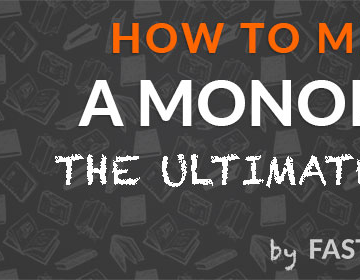

How to Memorise a Monologue: The Ultimate Guide to Word-Perfect Memory

How to Memorise a Monologue: The Ultimate Guide to Word-Perfect Memory

https://fastertomaster.com/how-to-memorise-a-monologue/?utm_medium=email&utm_source=other&utm_campaign=opencourse.GdeNrll1EeSROyIACtiVvg.announcements~opencourse.GdeNrll1EeSROyIACtiVvg.cZxNUYwkEei5jhLNla0OGg

Need to learn how to memorise a monologue? This practical, step-by-step guide will show you exactly how, no matter who you are or how tight your deadline.