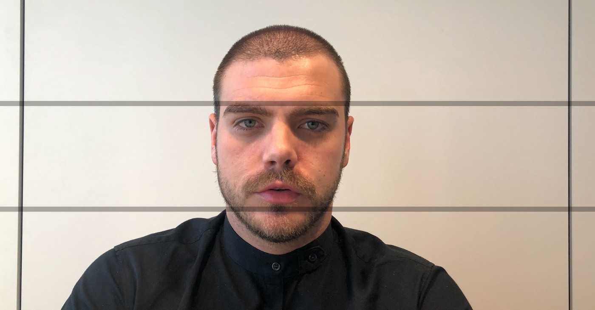
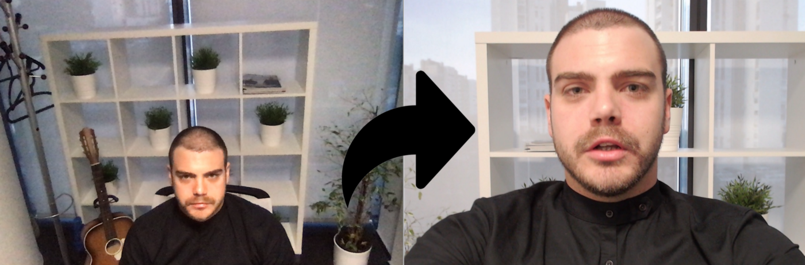
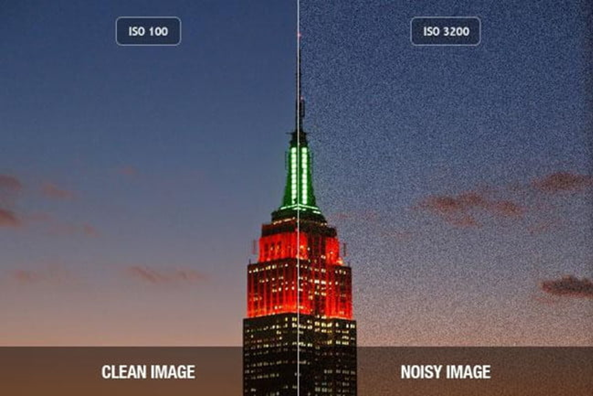
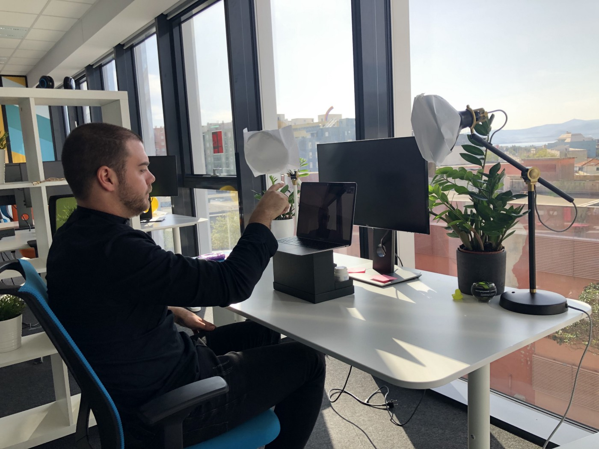

How to Prep for Speaking at a Virtual Conference - Shiftconf - Medium

# 1. Adjust the Frame

First and foremost, to ensure a professional look during your virtual conference, you need to use proper camera framing. **Make sure your webcam is at eye-level**. If you shoot from an angle too low, your speakers will have double chins. Too high and it looks like your speakers are on their knees praying.

If you’re using your laptop’s integrated camera, it can be difficult to get the angle right. If this is the case, try stacking it on some books and or boxes to achieve the ideal angle.

If the angle still isn’t perfect, that’s acceptable — but make sure to put yourself in the center of the frame.

*Picture 1. How the camera should frame you.*

If you break your frame into thirds with horizontal lines, your eyes should be around the intersection of the top and middle third (see below). If this cuts off your hair or head in the frame, move the camera a bit further away. Your entire head should be visible in the frame.

# 2. Minimize Surfaces

It’s also important to minimize the number of surfaces (walls, floor or ceiling) in your frame. Ideally, you should have only **one wall behind you**. Check out Picture 2. In the left image, the frame catches two walls and the floor, making things look cluttered and unfocused. Whereas in the right image, there is only one surface in the frame (the wall behind the speaker), which gives a feeling of symmetry. Plus, this puts **the focus only on the speaker** (you).

*Picture 2. Recording with multiple surfaces vs. only one surface behind you.*
In other words, you always want your background to be a single surface.

# 3. Choose a Simple Background

Regardless of your home decor, you’ll want as little of it as possible in the frame. Why? Because it might be distracting to the point that the viewer’s attention is focused on your wall art and furniture instead of you, which is not good. As a rule of thumb, we suggest putting yourself in front of a single-colored wall. And, if possible, the wall should be white or another lighter color.

*Picture 3. Recording with no distractions on the wall behind you.*

# 4. Align Your Screen

If you can’t find a solid-colored background, that’s fine. You shouldn’t ask speakers to redecorate — obviously, that would be a bit much. However, try to minimize the number of things that are in your background, get rid of any asymmetries and attempt to align the edges of your screen with the background.

*Picture 4. Error with alignment of background and frame*

Make sure that the horizontal items in your room are aligned with the horizontal border of the recorded screen, and the vertical walls (or things) are in line with the vertical screen recording.

As you can see in the previous Picture 3, the alignment wasn’t done as it should be. The red line should be parallel with the **horizontal edge of the frame/camera** (the green line).

# 5. Let There Be Light!

This is **one of the most important steps you must take**. I cannot overstate the importance of lighting. Make sure you highlight this section. Dog ear it. Print it out. You need as much light in the room as possible when recording with a camera. Video quality drops rapidly when you’re filming in a poorly lit room.

*Picture 5. How lighting affects your video image.*

If there’s not enough light in the room, the camera has to compensate by lowering the shutter speed (and in return frames per second, or FPS) and increasing ISO. In digital photography, **ISO** measures the sensitivity of the image sensor; the lower the number the better. When that happens, what you get is a video that is blurry (when you try waving your hands, trails of smudges remain where your hands were), noisy (an overlay that is similar to those on old TVs when the channel was blank) and noticeably choppier. Most videos that you watch are played at 30 frames per second (FPS), while your webcam can fall under 20 FPS when recording in low-lit rooms.

How do you mitigate this problem? Maximize the light in your room! Open your blinds and curtains, **let the sun shine in and turn on all lights in the room**. You want as much light on you as possible. So, if you have any extra bedside lamps or floor laps, put them in the room (just beware of shadows), and play around with the lights till you get it right.

*Picture 6. Your video will be difficult to see with a brightly lit window behind you.*

But once we let the light in, we have another problem. **We can’t have the sun or the light hitting your camera frame directly.** There are two things that can go wrong here: First, the camera focuses on you and it can’t make a good contrast with the amount of light coming in from somewhere else. (See the picture to the left). Secondly, the camera focuses on the light coming from the outside, and it automatically darkens you and your room.

What you want to do is sit across the window and move any light sources away from the frame. If you can, try to make light sources point at you.

Picture 7. Perfect setup. Windows in front of you, two lamps at eye hight, and camera elevated.

# 6. Hide Your Chair

It is **highly recommended** that you do not sit in a high-backed chair that is visible to the camera. After all, you don’t want your audience distracted by anything but you. Chairs can ruin the frame composition. As a possible solution, you may **choose to stand** while doing your presentation.

*Picture 8. Having no chair, keeps the focus on you.*

# 7. Look at the Camera

Virtual conferences are supposed to simulate you, as the speaker, talking directly to each viewer. The best way to accomplish this is to look directly into your web camera, not your screen. This gives the viewers a sense that you are making eye contact with them.

We know it might feel a tad awkward to look at a camera while you talk, but this will help immensely for your storytelling. Also, it will create a stronger sense of engagement with your audience because they will think you are talking directly to them. This is a very important feature for a successful virtual conference. Eye contact, even virtually, is what connects you to your audience.

# 8. Ditch the Headphones

If you have been attending some of the online conferences and events that have been popping up lately, you probably notice some people use headphones, air pods or headsets. We believe headphones look unnatural and unprofessional for business events or conferences, even if they are virtual.

These days, most laptops are equipped with high-quality microphones and software that successfully blocks out most background noise. So, if you want to look professional, ditch the headphones.

# 9. Dress for Success

Considering there will a lot of people with various tastes attending a virtual event, we believe *business casual* attire is the way to go. Above all else, make sure your speakers are wearing pants!

Furthermore, we *highly recommend* wearing unicolor clothing, as it will look better on camera. Stripes and busy patterns can often be distracting. Additionally, you should probably **refrain** from attire that includes **logos and/or images on them**, as we believe these also distract the audience from your talk.

# 10. Adapt Your Presentation

A speech that works well in a live venue may not translate well to a virtual one. You may not realize it at first, but large gestures and other visual cues that you (sometimes unknowingly) use during a live speech won’t work in a virtual event. For this reason, you should tap into special materials for this delivery medium, such as a modified slide deck. This can help convey information or emotion that may not otherwise be communicated effectively across a digital medium.

# 11. Stay in the Frame

Once you’ve gotten to this point, do yourself a solid and make sure you know the boundaries of your camera frame. See how much you can move to the right and to the left without going out of the frame as well as how close can you get to the camera. Once you start giving your presentation, it’s easy to accidentally slip out of the frame because you won’t see yourself on the screen. This is why it’s important to practice beforehand.

# 12. Create Symmetry with Other Speakers

*Picture 9. Example of how it looks when all speaker’s bodies are in similar positioning.*

During a virtual conference, particularly when there is more than one person on the screen, it is important that all speakers are in the same position, or at least as similar as possible. This helps create symmetry, and symmetry is what our mind defines as beautiful (or in this case professional/high quality).

This should not be an issue if you followed **Step 1. Adjust the Frame**. This step is mission critical for the overall look and feel of an interview.

# 13. Pace Yourself

It is difficult to capture the essence of an in-person conversation via video conference. But there are a few things you can do to accomplish this. First (as mentioned in Step 7), it’s important to look *directly *in the camera when you are speaking and listening.

Second, and this is key — slow down the pace of the conversation. Once you say something, **give pause**, so the other speaker has time to reply.

Also, when someone else is speaking, be sure to show you are listening by making **nodding movements** every so often. This will show not only that you are listening, but also that the speaker’s cameras did not freeze. Make sure these gestures are natural and not sudden, jerky movements.

# 14. Prep for Enjoyable Panels

It can be challenging to hold successful panels via video conference, or at least in a manner that is enjoyable to the audience. Panels are most engaging when panelists debate and interact with each other, but that format can prove difficult in a virtual conference.

Because of the boundaries of a virtual panel, the moderator must give every panelist a chance to talk, and there must be strict guidelines of not interrupting one another. A virtual panel should go more like this: Moderator to panelist, back to moderator, on to the next panelist, and so on.

Do panels at your own risk — and with much caution and we suggest practice and dry runs to minimize mistakes.

# 15. Eliminate Distractions

When you are giving an in-person talk, you probably put away your phone and turn off all notifications on your laptop. At that moment you are focused on only one thing: presenting to the audience. The same holds for a virtual talk: Put your phone away. Turn off alarms, make sure your dog does not bark and your kids don’t come barging in during the presentation. While you are speaking, you should only be interacting only with your audience.