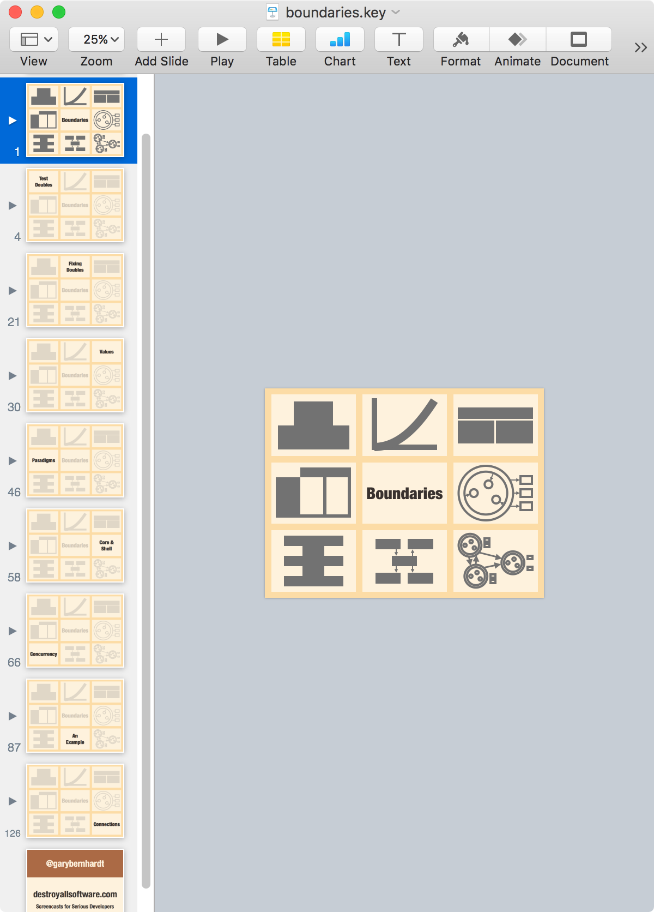
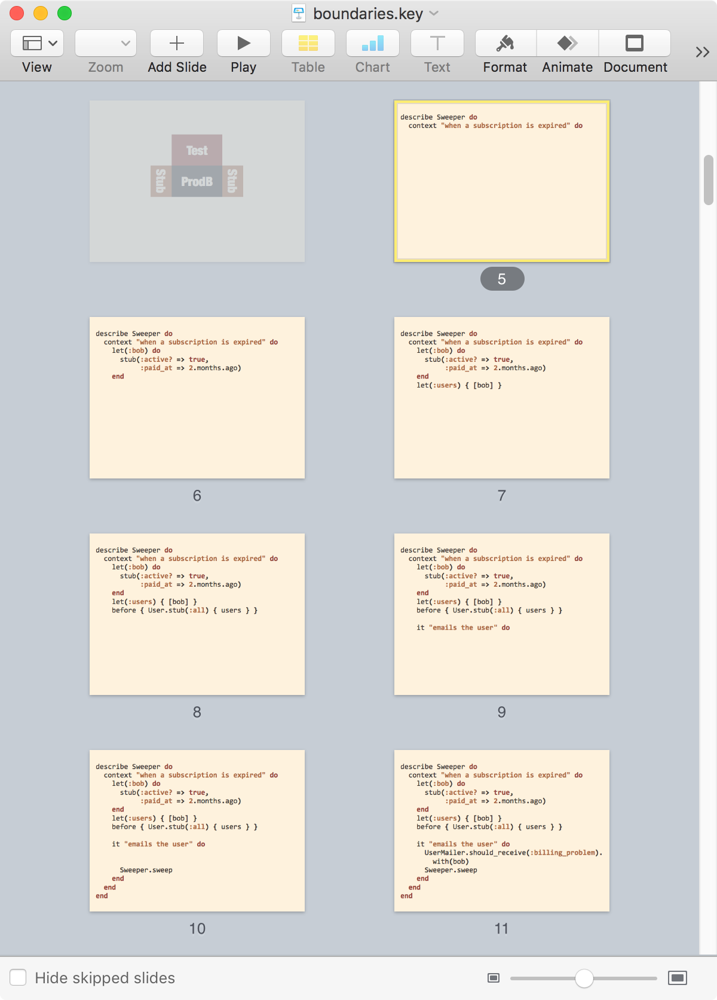

How to Prepare a Talk – Deconstruct

Once you [have a talk idea](https://www.deconstructconf.com/blog/how-to-choose-a-talk-topic), it's time to build the talk. Conference talks are scary, so you'll want to avoid it. You'll silently make slides or silently write an outline. These would be great preparations if you were going to stand on stage and perform the act of silently writing notes in a text editor. You're going to stand on stage and talk, so your preparation should be made up primarily of talking.

I'll warn you up front: this process is labor-intensive. Is 20 (or 50) hours too long to spend on a talk? Well, suppose you have an audience of 500 people. A 30-minute talk will consume 30*500 = 15,000 person-minutes, which is 250 person-hours. Spending 20 of your hours to optimize 250 of other peoples' hours is a good trade-off.

Then there's the video. A popular talk video can see 50,000 views or more. With 50,000 views, you just optimized 25,000 person-hours, or about 3.9 person-years, all for the cost of 20 to 50 of your own hours. Assuming 20 hours of prep, that's a 1,250-to-1 ratio of viewer time to preparation time. Of course, the effort and practice you put in also increase the chance that 50,000 people will want to watch the talk! In short: I think that, no, 20 hours isn't too long to spend.

I'll describe talk preparation as if you're actually doing it. This isn't The One True Way to build a talk; the second person is just expedient.

A brief note on my credentials. I've spoken at about fifty conferences. As I write this, my [most popular full-length talk](https://www.destroyallsoftware.com/talks/the-birth-and-death-of-javascript) has been watched about half a million times. ([Wat](https://www.destroyallsoftware.com/talks/wat) has been watched at least three million times, but it's a lightning talk so the process described here didn't apply.) I also organize [a conference](https://www.deconstructconf.com/), whose site you're on now.

### The Outline

Your first step is to [choose a topic](https://www.deconstructconf.com/blog/how-to-choose-a-talk-topic); we'll assume that you've done that. Find a room where no one can hear you. Stand up and start talking about your topic to no one, projecting your voice rather than mumbling. Wander around a bit. In short: act like you're on stage.

Every part of this is important. If no one can hear you, then you won't feel embarrassed to speak freely. If you speak out loud, project your voice, and walk around a bit, then you'll condition yourself to stand on stage and give a talk. By the time you're on stage, it'll be so ingrained that even performance stress won't stop you. More on that later.

You'll be tempted to think "this part doesn't matter; I can do it silently and get the same effect." You can't! You can't learn to play a guitar by writing music, you can't learn to write by talking, and you can't learn to give a talk by writing an outline. Every talk is new, so you have to relearn every time. You need to hear the jokes to know whether they're funny; hear the pace to know whether you're becoming boring; and hear your confidence (or lack thereof) to tell you when you're straying into territory that you don't understand.

However, there's no need for a plan, and it's OK to digress into subtopics that go nowhere. Your goal here is to discover what you know and what you might have to say, even if only 5% of it is used in the final talk.

Sometimes, as you walk around your empty living room and talk to yourself, you'll hear yourself say something novel. When that happens, make a note of it in your slide software of choice. Nothing fancy: just an empty slide with a couple words to remind you of the idea.

None of this has to be "good". You don't have to sound "smart". No one can hear you and no one will read your notes! You're just finding out what you know.

Talk until you feel like you're out of ideas, whether it takes 15 minutes or two hours. Then close your slide software; you're done for the day.

### Repetition

You've now spent about an hour on your talk. It's time to meet the core of the process: repetition. You're going to repeat the talk many times, watching it change on its own. You're not going to repeat the same words or even the same approximate paragraphs; it's not that kind of repetition.

Practice your talk three more times, in the same way as before: stand up and talk through the topic where no one can hear you. Forget that you've already "given the talk". Start back at the beginning, going wherever it takes you. Like before, take notes as you go: add note slides to your existing slides, rearrange them if the ordering doesn't feel right, and don't be afraid to delete.

It's important to do this only once per day. Your brief note slides will ensure that you don't forget any big points that seemed interesting in the past. But you do want to forget the exact, fine-grained details of what you said. Each time you come back to it the partial forgetting will lead you to discover new ways of approaching the core topic, as represented by your note slides.

Limiting yourself to an hour or so per day also stops it from feeling like work. You'll notice new topics coming up, and your explanation of existing topics get tighter, both of which are very rewarding.

In these practice runs, look for consistent high points: do you perk up whenever you talk about a certain topic? Can you make the other topics move "toward" those more exciting points, so the whole thing builds toward your favorite part? If so, rearrange your note slides so that they build toward that point, then see whether tomorrow's run through seems to have a stronger direction.

You've now learned the core of this talk preparation technique: improvising over and over again. You're not writing and memorizing a talk that's serialized into words; you're getting your thoughts themselves in order so that you understand them and can traverse them on stage. The minor forgetting during your day-long breaks stops the talk from becoming rigid and robotic. You always have to work a bit to find the individual words of the talk, even though the order of the ideas is similar each time.

### Organization

You've now spent about four hours on your talk. You have a set of note slides with a few words each, each representing an interesting idea that you had. There are perhaps 30 slides (15 is fine; 45 is fine; 60 is borderline; 90 is too many).

The slides are in a sensible order because they arose from your natural thought process, with editing when they felt awkward. It won't be the order you would've put them in if you wrote an outline, but that's fine. Find a way to group the proto-slides into 4 to 8 sections. Give the sections short names that remind you of the topic as a whole. These are hints at the topic, not explanations.

For example, here are the sections in [Boundaries](https://www.destroyallsoftware.com/talks/boundaries).

- Test Doubles
- Fixing Doubles
- Values
- Paradigms
- Core & Shell
- Concurrency
- An Example
- Connections

Each section gets its own intro slide. Make the note slides within that section its children, so you can collapse the sections to see the list of topics directly. Here are the sections from the final version of [Boundaries](https://www.destroyallsoftware.com/talks/boundaries).

My slides here are designed, but yours shouldn't be yet. Make all of your note slides black text on white backgrounds, then make all of the section slides white on black. We'll tone that contrast down later. For now, the stark contrast will help you remember the points where the screen color inverts.

### More Repetition

You've now spent about five hours on your talk. Do the talk a few more times in the same way.

Pay attention to the boundaries between sections; spend a little more time there to ease yourself from one topic to another. The section boundaries are newly added, so they'll be a little rougher than the content inside the sections.

As you practice, watch for the talk becoming more consistent. You want to feel the transitions between slides coming naturally: you start transitioning from slide to slide without needing to see the next slide. This sounds hard, but it will happen with practice, piece by piece.

Continue to add slides if new topics come up. If you find yourself bored with a topic, remove that slide. If it's important, it will probably come back on its own later, maybe in a more interesting form. The spoken word should rule the process; your note slides are only a rough list of the topics that you're finding.

As before, try to limit yourself to one run per day. You need a break to forget your exact wording from last time, or else you risk turning into a recitation robot!

### Slides

You've now spent about eight hours on your talk over the course of a couple weeks. You found a topic, then expanded and honed it by listening to yourself talk.

Finally, it's time to give the talk some visual treatment. In some cases, the notes you wrote will work as your final slides. Slides shouldn't be a book that the audience can read. You want enough visuals to keep people's minds from wandering, but not so much that they stop listening to read your slides.

Arrange your short note slides into visual patterns according to Zach Holman's excellent [2011 post](https://zachholman.com/posts/slide-design-for-developers/) on slide design. That post is short, but there's a lot to learn in it. (I'm still learning to follow his advice: most notably, I consistently use less contrast than I should.) This isn't to say that you have to make your talk look like Zach's, which always look very nice. But by starting with his advice, you'll find some techniques that you like and others that you don't.

Sometimes you'll need smaller fonts, most notably for code. Here's a rule of thumb for font size. Put a capital X on your slide. Create a box shape as tall as the X. Now divide the height of that box into the height of the slide. To be safe, the box should be at least 0.03 times the height of the slide. (This is based on tests from the back seats of a deep theater that I spoke in years ago.)

Large fonts may tempt you to pack content in by going all the way to the edge. Leave a "safety zone" around the screen, about 0.05 times the screen width (and height) along each side. That will save you from [overscan](https://en.wikipedia.org/wiki/Overscan) caused by the projector, video scalers, recorders, and other devices that might be old and analog.

Your most information-dense slides will be tables and code. These need to be simplified to make them understandable in the few seconds they're visible. You should explicitly talk about everything that appears on the screen; nothing should go unmentioned. Otherwise, you're asking your audience to read one piece of material while you're talking about something else.

It's best to build up tables, code, etc. piece by piece. Here are some slides from [Boundaries](https://www.destroyallsoftware.com/talks/boundaries). Building the code in steps lets me talk about each step as it's revealed. I don't need to worry about the audience reading line 9 while I'm talking about line 2.

Notice that these slides aren't strictly in order. Slide 11 fills in a "hole" in the code left by slide 10. (You'll have to watch the talk to see why that makes sense!)

This isn't limited to code; I use the same technique to reveal my Rumsfeld table at the beginning [Ideology](https://www.destroyallsoftware.com/talks/ideology).

(As a practical note: I build slides like this by building the complete slide first. I color the code by pasting it into GitHub and back out. Then I copy the slide and delete a piece, then copy and delete the next piece, etc., building the slides "backward" in time until I have each step as a slide. It's not exciting, but it only takes a minute or two per example.

### Even More Repetition

You've now spent about ten hours on your talk. Surprise: do the talk a few more times! Continue to edit your slides: add new ones when interesting topics come up, and remove slides that you find boring you.

It's OK to pause for a moment in the middle of a run to add a slide, but don't style it while you're practicing; that risks breaking your flow. You can always style it later.

As you practice, you'll find that you don't have to think as much about what you're saying, which will free your mind up to listen to the talk as you give it. That will sound strange if you're reading this without preparing a talk as you go, but you'll see what I mean.

As you continue to practice and tweak, you might find that one section becomes much bigger than the others. Or you might find the opposite: one section shrinks to be only a couple slides long. Often, both of these things happen.

This is all fine. Your verbal performance of the talk is your guide. The slides should accommodate the talk and add a bit of visual structure.

Split large sections, rearrange sections, collapse small sections into the previous one, or even delete them. Worst case, you can change it back before your next attempt.

### The Cut

You've now spent about 13 hours on your talk: around ten practice runs, plus some extra time for splitting sections and designing. In many practice runs, the talk grows a bit as you add a few notes, or add more detail to your verbal explanation. At some point, you find yourself annoyed at how long the talk is. That's good!

When the talk is long enough that a practice run is annoying, it's time to cut. Collapse all of your sections, so that you can only see the title slides. You've talked through each of these sections several times; you know these topics. Which one is the least interesting? Which section leads you to talk in a low-energy voice, as if you're waiting for it to end? Expand that section, select the entire thing (including its title slide), and mark it as "skipped" (Keynote) or "hidden" (PowerPoint).

Now do the talk; the skipped section won't show up. It's probably a better talk. Congratulations; you're an editor! If it's not better, unskip it and try cutting another section.

Cutting sections will wreak havoc on your transitions between them. Don't be afraid to buckle down and practice the boundary between two sections.

When I cut a section, I'll often back up by a couple slides, then perform the talk from that point until a couple slides after the transition. If that takes a minute, then ten repetitions take ten minutes, which brings the new transition up to the repetition level of the talk as a whole. Your delivery might get a little robotic with that repetition, but that will smooth out with your one-run-per-day cadence.

(This also works if there's a tricky part of the talk where you keep stumbling, and where you can't seem to ease the stumbling with edits.)

### Talk Length

You've now spent about 15 hours on your talk. It got too big, and then you cut it down. The cut is a good sign that it might be ready. Finally, we can think about time.

We've only mentioned time subjectively so far: did you find yourself getting annoyed and bored while practicing? Now, we have to fit the talk into a slot. Right now, your talk is probably between 25 and 50 minutes. I think that 25 minutes is the best length for a "full length" talk, give or take. Most 50-minute talks are 25-minute talks that didn't experience reduction via repetition and a cut.

If you land at 30 minutes, or 25, and you feel good about the talk, and it feels dense, and there are no parts that feel like they're dragging, then that's your talk! But what if the conference told you that your slot is 45 minutes? Fine; do a 30-minute talk and give the attendees an extra 15-minute break.

You're probably afraid to take that advice because it seems like you "should" fill your slot. One option is to do Q&A, but Q&A is often boring because it's unpracticed, and you're stressed out because you just did a public performance, and so your mind blanks.

My preferred option for "filling" a long slot is to not fill it. I've ended early dozens of times, adding up to many thousand total audience members. Often, people thank me for being brief. No one has ever complained that time was left over.

So much for short talks; what if your talk is coming in at 50 minutes? You use the same reduction process as before: skip (or hide) the least-interesting section and see how it flows. If it doesn't work, undo and try skipping another section. If that doesn't work, you might have to get a bit more creative by looking for reductions in your sections.

I once had a stubborn talk that was too long, and I couldn't figure out what to cut. Here's what I did:

- Deleted all section markers to "flatten" the slides.
- Removed all supporting slides: every slide that wasn't directly making an important point. (I made a backup first, as I always do, and which I never go back to, but making a backup makes me feel safe in doing this kind of thing.)
- Ran through the talk as usual, re-adding the minimum detail to make it flow.
- Introduced new section boundaries based on what's left.
- Now the talk was shorter and tighter!

The slides are a guide about which topics you'll hit, not what you'll say about them. High-level edits to the slides like this are a great way to manipulate the talk's overall structure.

In another talk, I deleted two of six sections of the talk, so a third of the total content. This was during a period where I'd somehow forgotten how to cut. Fortunately, [Zach](http://theotherzach.com/) watched me do the talk in my hotel room and told me that I should cut those two sections, and he was right. That was the night before the talk itself, which is dangerous and I wouldn't recommend it. I was lucky and it didn't require any reorganization, so I practiced the new section transition ten times or so and was ready to go.

### Final Practice

You've now spent about 20 hours on your talk. It's in roughly its final form. But until now, it's been in continual flux: you keep adding, removing, and rearranging pieces. Do a few more practice runs. You shouldn't feel pressed to change anything; that's how you know that it's done.

Why continue to practice when it's not changing? Because this is the point where you're conditioning yourself to execute the final version; you're replacing any old memories of past versions of the talk. These last few practice runs are what really make it flow. If you find yourself stumbling anywhere, practice just that minute or two of the talk a few times to clear it up.

I've been making up times for my "you've now spent x hours" statements. But I also don't think about time much when I'm preparing a talk, and I never track how much time I'm spending. This entire process is based on following the ideas that you find interesting, so it shouldn't feel like work. (If it feels like work, you should probably start over with another topic that seems fun!)

Sometimes I realize that a talk isn't working, so I delete all but a few of my note slides and start the whole process over from them. Often, I abandon talks because they're not working out. Sometimes, a talk comes together on its own. Some have taken 20 hours; others have taken a lot more.

### Doing The Talk

It's not useful to write down instructions for giving a talk. You're going to be on a stage in front of a lot of people, scared, trying to focus on what you're saying. You won't have extra mental capacity to think about what you "should" do. This is why you practiced your talk many times, with a realistic voice, standing up, and in full from end to end: you've now conditioned yourself to give the talk despite the fear. You don't need to think about how to give the talk because it's automatic for you now.

This works for any high-pressure activity. For example: [using your gun as a police officer](https://www.psychologytoday.com/blog/choke/201005/want-success-under-stress-close-the-gap-between-practice-and-competition). "You might wonder if this type of 'pressure training' is really effective, given that the stress simulated in training is not nearly as overwhelming as that of a real, high-stakes performance. [...] The answer is, yes, because even practicing under mild levels of stress can prevent people from falling victim to the dreaded choke when high levels of stress come around."

Fly to the conference. Don't eat the airplane food if you can avoid it; it's gross. Practice in your hotel room on the night before your talk, and on the morning of the talk. In your final practice runs and even on stage, the wording will change slightly each time. That's fine and even desirable.

### Talk Day Pitfalls

Now some short warnings that I wish I'd had.

First, resist the urge to practice over and over again, especially at the conference; you risk making the talk robotic. Once per day is ideal. Definitely never practice more than once on the day of the talk; you risk wearing out your voice. Give your throat at least a two-hour break before your last practice run and the talk itself. Listen to me; I know this from experience!

Second, never eat immediately before a talk; there are biological failure modes you don't want to trigger. But you also don't want to be hungry. Eating a snack or light meal about an hour before the talk is ideal.

Third, drink a lot of water on the day of the talk; dry mouths don't sound nice in recordings. Avoid dairy for the same reason. Use the bathroom before the talk so the water doesn't have its revenge.

Fourth, don't include parts of the talk that you "might" do if time permits, or if you feel like it. Trust me; you're asking for trouble. If you're given 40 minutes, practice to 35, or better yet 30, and you'll be OK even if you slow down a bit.

### Giving The Talk

You might find that your "30-minute" talk becomes 25 minutes or 35 minutes; it varies by person, by mood, etc. Speeding up seems more common, so when I've referred to your "30-minute talk", I've always meant "25 minutes, but your practice target should be a bit longer so it compresses to 25 when given." (I think that 25 is a sweet spot for length.)

If you stick to the one-run-per-day rule, prep can take a month. Fortunately, you only do an hour or so of work every day, so it's not so bad. Making it a part of your daily schedule works well.

This process is the core of all of [my full-length talks](https://www.destroyallsoftware.com/talks). There are always deviations, some of which I've mentioned, but the core is to start with an extemporaneous speech and hone it into a tight talk.

Talks aren't blog posts or books or even slides; they're verbal performances. Your talk is authentic because it's descended from the words that you said at the very beginning, as you paced your living room talking to yourself without any plan. Since then, you've refined the ideas, but the entire talk traces back to that original spontaneous, unstructured speech. The audience will appreciate the clean execution and lack of fluff that practice brings, but they'll also appreciate the honesty of the words!

### Postscript

To see some examples of talks that I like, come to [Deconstruct](https://www.deconstructconf.com/). (We don't demand that speakers use any particular preparation style; they can do whatever they want!)

If you're considering your first talk, Deconstruct has a [CFP](https://www.deconstructconf.com/speak) that opens several months before the conference each year. We'll pay you for your time, fly you to Seattle, put you in a hotel, give you a single-track audience who's rooting for you, and mentor you on talk preparation. Don't worry; accepted speakers aren't required to use the process described here. Our main request is that you commit to practicing in some form!