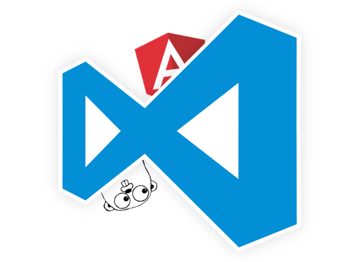

How to Set up Visual Studio Code for Web Development in Golang. Part 1: Back End

# How to Set up Visual Studio Code for Web Development in Golang. Part 1: Back End

So, I’ve completed setting up my Visual Studio Code to develop a site using Go and Angular 2 and I thought that this information may be useful for somebody.

In the first part of the article we’ll set up our back end, and the front end we’ll set up in the second part.

### A note about operating system

I’m using OS X, so every Terminal command in this article is specific to this OS. If you find a command on an other operating system that does the same, please let me know in the comments below or [Twitter](http://twitter.com/randexdev) and I’ll update the article!

## Separation

At first, we need to clarify some things here. It’s pretty hard and not really convenient to keep your front end and back end code in one project, especially if they’re written in different languages like in my case. Moreover, a Go project must be inside a workspace that contains a specific set of folders (`src`, `pkg` and `bin`).

Because of all that, I decided to create two separate projects: one for Go back end and one for Angular 2 front end, so the whole goal for setting up VS Code was to just simplify concurrent development of two projects.

## Back End Part

The set up at the back end part of the project consists of 2 steps:
1. Setting up a Build Task to quickly build and launch the project.
2. Setting up debugging environment.

### Setting up a Build Task

Press **F1** on your keyboard and type *Task*. It’ll show you the list of different things that you can do with tasks in Visual Studio Code. Choose **Tasks: Configure Task Runner** in the menu. The command will create a new folder inside your project’s root directory called `.vscode`. Inside that directory it’ll create a file named `tasks.json`. This is where you’ll write your tasks.

Delete everything from the file and paste the following JSON into it:
1
2
3
4
5
6
7
8
9
10
11
12
13
14
15
16
17
18
19
[object Object]
[object Object][object Object]
[object Object][object Object]
[object Object][object Object]
[object Object][object Object]
[object Object][object Object]
[object Object][object Object]
[object Object][object Object]
[object Object][object Object]
[object Object][object Object]
[object Object][object Object]
[object Object][object Object]
[object Object][object Object]
[object Object][object Object]
[object Object][object Object]
[object Object][object Object]
[object Object][object Object]
[object Object][object Object]
[object Object]
Let me explain what’s going on here.

- In `"command": "bash"` flag we’re specifying what command to execute in the shell (notice `"isShellCommand": true`, it’s an important flag).
- By saying `"showOutput": "always"` we’re telling that we want to see the output of the task. What output? Output of the compiler when our app is compiling and output of our app when it’s running.
- The `-c` in the arguments list is important: our shell command will look like this: `bash -c` and then goes the command that we want to execute in `bash`, depending on the task.
- Now in the `tasks` array we need to list all commands that we want to execute, and they all must be terminal commands.
    - `taskName` is just the name of your command. You use that command if you want to call the task by name.
    - If `surpressTaskName` is set to `true`, VSCode will not treat value of the `taskName` as a shell command.
    - If `isBuildCommand` is set to `true`, VSCode will execute this task if you select **Run Build Task** from the *Command Palette*.
    - And then goes the `args` array where we specify our shell command.

So when you press **Shift+Cmd+B** or select **Run Build Task** form the *Command Palette*, VS Code will execute this command:

1
[object Object]

The `server-app-name` here is the name of your go program, which will be the same as your project folder name (that is how `go install` works). Double-ampersand (`&&`) means *“execute command on the right side of `&&` only if the command on the left side completed successfully”*, in other words, your server will run only if it compiled without errors.

Ok, so we’re done with the Build Task, let’s move on to

### Setting up debugging environment

This part is really simple, but it requires you to install Go extension for VS Code.

1. Open up *Command Palette* by pressing **F1** or **Shift+Cmd+P**.

2. Search for *Extensions: Install Extension* and press **Enter** (or **Return**, if you wish).

3. Type *Go* and install Go extension by *lukehoban*.
4. Restart VS Code when it asks to.
Now you’re ready to debug. Almost.
1. Click on debug icon on the left sidebar in VS Code (with crossed out bug).
2. At the top of debugging sidebar click on a cogwheel icon.
3. VS Code prompts to choose a debugging environment. Choose **Go**, of course.

Now you’re done. Place some breakpoints in your code and play with the debug mode. It is a pretty powerful thing in this editor :)

The second part of the article where we’ll talk about setting up front end, is now available [here](http://randexdev.com/2016/08/vscode-golang-front/)!

### Share this:

- [Facebook](https://randexdev.com/2016/05/vscode-golang-angular2/?share=facebook&nb=1)
- [Twitter](https://randexdev.com/2016/05/vscode-golang-angular2/?share=twitter&nb=1)
- [Google](https://randexdev.com/2016/05/vscode-golang-angular2/?share=google-plus-1&nb=1)

-

Author   [Randex](https://randexdev.com/author/randex/)/Posted on [May 1, 2016](https://randexdev.com/2016/05/vscode-golang-angular2/)/Categories [Code](https://randexdev.com/category/code/)/Tags [backend](https://randexdev.com/tag/backend/), [golang](https://randexdev.com/tag/golang/), [vscode](https://randexdev.com/tag/vscode/), [web](https://randexdev.com/tag/web/)