How to Solve The New York Times Crossword

[(L)](https://www.nytimes.com/)[Crossword](https://www.nytimes.com/spotlight/guides)

[*g*]()

00:08How to Solve The New York Times Crossword

- [How to Get Started]()
- [A Step Further]()
- [Cracking the Harder Clues]()
- [Bonus: Crossword Themes]()

# How to Solve The New York Times Crossword

By Deb Amlen [@NYTimesWordplay](https://www.twitter.com/NYTimesWordplay)
 [*f* Save for Later]()

[a](https://www.facebook.com/sharer/sharer.php?u=https://www.nytimes.com/guides/crosswords/how-to-solve-a-crossword-puzzle)[b](https://twitter.com/intent/tweet?text=NY%20Times%20%7C%20Crossword%3A%20How%20to%20Solve%20The%20New%20York%20Times%20Crossword&url=https://www.nytimes.com/guides/crosswords/how-to-solve-a-crossword-puzzle)[c](https://www.nytimes.com/guides/crosswords/how-to-solve-a-crossword-puzzlemailto:?subject=NY%20Times%20%7C%20Crossword%3A%20How%20to%20Solve%20The%20New%20York%20Times%20Crossword&body=Once%20you%20master%20a%20few%20basic%20strategies%2C%20you%E2%80%99ll%20find%20that%20crossword%20puzzle-solving%20is%20not%20only%20possible%2C%20but%20highly%20addictive.%20So%20let%E2%80%99s%20get%20solving!%0A%0Ahttps://www.nytimes.com/guides/crosswords/how-to-solve-a-crossword-puzzle?utm_source%3Dsharetools%26utm_medium%3Demail%26utm_campaign%3Dwebsite)

Would you like to improve your mental flexibility, learn a few interesting things every day and establish bragging rights among your friends? Solving crossword puzzles is like mental yoga — both challenging and relaxing at the same time. Plus, it’s fun, especially if you appreciate words and wordplay as much as I do. I believe that with patience and practice anyone can learn to solve crosswords. Once you master a few basic strategies, you’ll find that puzzle-solving is not only possible, but highly addictive. So let’s get solving!

Ad

[Fast Track Reclaim](https://googleads.g.doubleclick.net/aclk?sa=l&ai=Chd7y8gAnWtSsF87Ab9H1vIgMlb-azE3SlaLp8wP2qr64NxABIMjW9Rlgu76ug9AKoAGwxe3hA8gBBqkC0G6etO2Itj7gAgCoAwHIAwKqBOIBT9CWzmbm7FpCjbgkPx2VEbf0sZwObuvkUbVohaIp_pS3QI1jedvi-53-LU-Aqg3TsDTlctWLmRBUsp-mjJBODPamAUk4_R52BhTxbCSufUoTfoXPE8MFMcLIDb6HkrH3_zz-7e_nQyM0qBfsDd71dflWTSMxgex8-iw5h75T56NpJngnyUYNAaCJf_ySDvWgLJ1peAAPS8EsobEZzBc561Bo6V3aMigMRMEUCgWxY0nhcrhLwj70NwgWzGN01cqEeEOwzcgCviGGQ36_eEMNcGCA0ErKAcNhd3GBqqIOx-B_7eAEAaAGN4AHuLqSHqgHpr4b2AcB0ggHCIxjEAEYAbEJM2LV6VDpivqACgPYEww&num=1&sig=AOD64_2SfEu_YGMETQC_w5wp9vRx3hKGOg&client=ca-pub-4177862836555934&adurl=http://www.fasttrackreclaim.com)

[](https://googleads.g.doubleclick.net/aclk?sa=l&ai=Chd7y8gAnWtSsF87Ab9H1vIgMlb-azE3SlaLp8wP2qr64NxABIMjW9Rlgu76ug9AKoAGwxe3hA8gBBqkC0G6etO2Itj7gAgCoAwHIAwKqBOIBT9CWzmbm7FpCjbgkPx2VEbf0sZwObuvkUbVohaIp_pS3QI1jedvi-53-LU-Aqg3TsDTlctWLmRBUsp-mjJBODPamAUk4_R52BhTxbCSufUoTfoXPE8MFMcLIDb6HkrH3_zz-7e_nQyM0qBfsDd71dflWTSMxgex8-iw5h75T56NpJngnyUYNAaCJf_ySDvWgLJ1peAAPS8EsobEZzBc561Bo6V3aMigMRMEUCgWxY0nhcrhLwj70NwgWzGN01cqEeEOwzcgCviGGQ36_eEMNcGCA0ErKAcNhd3GBqqIOx-B_7eAEAaAGN4AHuLqSHqgHpr4b2AcB0ggHCIxjEAEYAbEJM2LV6VDpivqACgPYEww&num=1&sig=AOD64_2SfEu_YGMETQC_w5wp9vRx3hKGOg&client=ca-pub-4177862836555934&adurl=http://www.fasttrackreclaim.com)

[Find Out If You've Paid PPI](https://googleads.g.doubleclick.net/aclk?sa=l&ai=Chd7y8gAnWtSsF87Ab9H1vIgMlb-azE3SlaLp8wP2qr64NxABIMjW9Rlgu76ug9AKoAGwxe3hA8gBBqkC0G6etO2Itj7gAgCoAwHIAwKqBOIBT9CWzmbm7FpCjbgkPx2VEbf0sZwObuvkUbVohaIp_pS3QI1jedvi-53-LU-Aqg3TsDTlctWLmRBUsp-mjJBODPamAUk4_R52BhTxbCSufUoTfoXPE8MFMcLIDb6HkrH3_zz-7e_nQyM0qBfsDd71dflWTSMxgex8-iw5h75T56NpJngnyUYNAaCJf_ySDvWgLJ1peAAPS8EsobEZzBc561Bo6V3aMigMRMEUCgWxY0nhcrhLwj70NwgWzGN01cqEeEOwzcgCviGGQ36_eEMNcGCA0ErKAcNhd3GBqqIOx-B_7eAEAaAGN4AHuLqSHqgHpr4b2AcB0ggHCIxjEAEYAbEJM2LV6VDpivqACgPYEww&num=1&sig=AOD64_2SfEu_YGMETQC_w5wp9vRx3hKGOg&client=ca-pub-4177862836555934&adurl=http://www.fasttrackreclaim.com)

[No Account Numbers Needed](https://googleads.g.doubleclick.net/aclk?sa=l&ai=Chd7y8gAnWtSsF87Ab9H1vIgMlb-azE3SlaLp8wP2qr64NxABIMjW9Rlgu76ug9AKoAGwxe3hA8gBBqkC0G6etO2Itj7gAgCoAwHIAwKqBOIBT9CWzmbm7FpCjbgkPx2VEbf0sZwObuvkUbVohaIp_pS3QI1jedvi-53-LU-Aqg3TsDTlctWLmRBUsp-mjJBODPamAUk4_R52BhTxbCSufUoTfoXPE8MFMcLIDb6HkrH3_zz-7e_nQyM0qBfsDd71dflWTSMxgex8-iw5h75T56NpJngnyUYNAaCJf_ySDvWgLJ1peAAPS8EsobEZzBc561Bo6V3aMigMRMEUCgWxY0nhcrhLwj70NwgWzGN01cqEeEOwzcgCviGGQ36_eEMNcGCA0ErKAcNhd3GBqqIOx-B_7eAEAaAGN4AHuLqSHqgHpr4b2AcB0ggHCIxjEAEYAbEJM2LV6VDpivqACgPYEww&num=1&sig=AOD64_2SfEu_YGMETQC_w5wp9vRx3hKGOg&client=ca-pub-4177862836555934&adurl=http://www.fasttrackreclaim.com)

[Visit Site](https://googleads.g.doubleclick.net/aclk?sa=l&ai=Chd7y8gAnWtSsF87Ab9H1vIgMlb-azE3SlaLp8wP2qr64NxABIMjW9Rlgu76ug9AKoAGwxe3hA8gBBqkC0G6etO2Itj7gAgCoAwHIAwKqBOIBT9CWzmbm7FpCjbgkPx2VEbf0sZwObuvkUbVohaIp_pS3QI1jedvi-53-LU-Aqg3TsDTlctWLmRBUsp-mjJBODPamAUk4_R52BhTxbCSufUoTfoXPE8MFMcLIDb6HkrH3_zz-7e_nQyM0qBfsDd71dflWTSMxgex8-iw5h75T56NpJngnyUYNAaCJf_ySDvWgLJ1peAAPS8EsobEZzBc561Bo6V3aMigMRMEUCgWxY0nhcrhLwj70NwgWzGN01cqEeEOwzcgCviGGQ36_eEMNcGCA0ErKAcNhd3GBqqIOx-B_7eAEAaAGN4AHuLqSHqgHpr4b2AcB0ggHCIxjEAEYAbEJM2LV6VDpivqACgPYEww&num=1&sig=AOD64_2SfEu_YGMETQC_w5wp9vRx3hKGOg&client=ca-pub-4177862836555934&adurl=http://www.fasttrackreclaim.com)

## How to Get Started

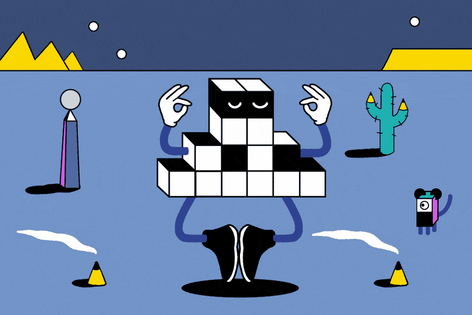

> “Solving crosswords eliminates worries. They make you a calmer and more focused person.”

–Will Shortz, New York Times crossword editor and NPR puzzle master.

If you’ve ever picked up a crossword puzzle and said to yourself, “I am not smart enough” or “I don’t have a big enough vocabulary for this,” please allow us to let you in on a little secret:

> A crossword puzzle is not a test of intelligence, and solving is not really about the size of your vocabulary. Becoming a good solver is about understanding what the clues are asking you to do.

You can absolutely learn to do that. We’re here to let you in on some of the rules that most clues follow, and to teach you how to read those clues so that they become easier to solve. It would be impossible to cover every instance of clueing, but we can get you up and running.

We’ve even included some tips and encouragement from the puzzle pros to help keep you motivated, like our very funny friend, Megan Amram, a writer for television shows like “The Simpsons” and “The Good Place.” Ms. Amram is a devoted solver and has also [*made a puzzle *](https://www.nytimes.com/crosswords/game/daily/2016/06/23)that ran in The New York Times.

> “I understand how intimidating starting the crossword can be, but the bottom line is, believe in yourself. YOU ARE SMART ENOUGH TO DO THE PUZZLE. Look at me. I do The New York Times crossword puzzle every day, and I once tried to shoot a basket on the wrong hoop when I was on my 6th grade basketball team. Crossword puzzles are not about intelligence, they are about keeping your mind nimble and knowing what the sneaky trickster Will Shortz is asking of you. Show Will Shortz who's boss by attempting the puzzle!” — > [*> Megan Amram.*](https://twitter.com/meganamram)

Got it? Now let’s get started.

### Start With the Monday Puzzles

The Monday New York Times Crosswords are the easiest, and the puzzles get harder as the week goes on. Solve as many of the Mondays as you can before pushing yourself to Tuesday puzzles. You can thank us later.

This is probably a beginning solver’s most common mistake.You know what it’s like: You have some downtime on a Saturday and you look around for something to pass the time. Your officemate keeps bragging about his ability to finish The New York Times Crossword. You hate your officemate.

So, not to be outdone, you pick up the paper or download our app and turn to the Saturday puzzle. How hard could it be?

**The Saturday crossword is actually the hardest puzzle of the week.** Mondays have the most straightforward clues and Saturday clues are the hardest, or involve the most wordplay. Contrary to popular belief, the Sunday puzzles are midweek difficulty, not the hardest. They’re just bigger.

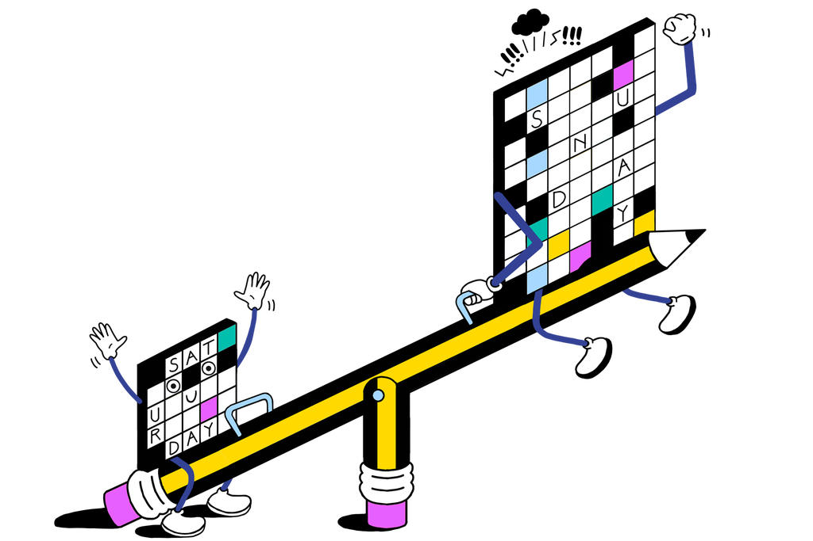

A typical Monday clue will be very straightforward and drive you almost directly to the answer. Don’t believe us?

 [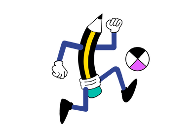   ### The Mini  #### Monday-Level Easy   Try this Monday-level mini crossword and show yourself what you can do. Just click here to get your solve on.](https://www.nytimes.com/crosswords/game/special/monday-easy)

Just to drive the point home, let’s take a look at the difference between a Monday clue and a late-week clue for a popular crossword entry.

**The Monday Clue: ***“Nabisco cookie,” “Cookie with creme filling” or “‘Twist, Lick, Dunk’ cookie”*

**The Saturday Clue: ***“Snack since 1912,” “It has 12 flowers on each side” or “Sandwich often given a twist”*

The answer to all of these clues is the same: “OREO.” Those delicious sandwich cookies are so popular in crossword puzzles that they’ve been dubbed by some as the “official” cookie of the crossword.

But we weren’t kidding you. There is a *big* difference between a Monday puzzle clue and a Saturday puzzle one. Late-week clues might require more specialized knowledge about these delicious treats.

If you’re just getting started, **make your life easy and solve as many Monday puzzles as you can**. Eventually, you’ll be ready for more of a challenge, and that’s when you move on to the Tuesday puzzles.

### Practice Makes, If Not Perfect, a Much Better Solver

Once you’ve learned some of the shorter answers and how they are clued, you can almost be sure you’ll see them again. The brain works in weird and wonderful ways, and when you start solving crosswords consistently, you will feel really good when you can say, “Hey, I know that one!”

> “*> Do more puzzles. The more you solve, the better you’ll get. It’s also useful to read *> [**> Wordplay**](https://www.nytimes.com/column/wordplay)*>  and other puzzle blogs, which helped me internalize the tricks and tropes of crossword clues while I was learning the ropes.” – ****> Dan Feyer****> , seven-time champion of the *> [**> American Crossword Puzzle Tournament.**](http://www.crosswordtournament.com/)

And don’t worry if you make a mistake. Everyone makes mistakes. That’s what erasers and the backspace key are for. It even happens to advanced solvers, so don’t let it get you down if you don’t know something or need to change an answer.

*> “Try to solve as much as you can in each puzzle, and don't stress when you can't finish one. For the ones you don’t know, if it's something way out of your knowledge comfort zone, look it up and read a bit more about it. It's fun, really! There is no shame in missing an answer or not finishing the puzzle. The key is learning what you missed. The more puzzles you solve, the easier it gets.”  *> — ***> Howard Barkin****> , 2016 champion of the American Crossword Puzzle Tournament.*

### Find Your ‘Gimmes’

When you start a puzzle, get comfortable, pour yourself a glass of your favorite beverage — it’s important to stay hydrated — and then scan the clue list before solving.

**Pick out the clues that are meant to be the easiest**  **and tackle them first.** See anything you definitely know? Those are your ‘gimmes.’ Are there any fill-in-the-blanks clues? Those are usually the easiest.

Trust us: There’s no better boost to your solving ego than to be able to fill in a few entries right off the bat.

You already know more than you think you do. To borrow a sports term, a puzzle or individual clue on topics that you know well is said to be “in your wheelhouse.” You’ll be able to find at least a few entries in each puzzle that you know.

*> “Good crosswords connect to everything in life.” – ****> Will Shortz.***
Fill-in-the-blank clues tend to be easier because they have definite answers.
Don’t believe us? Try these clues that are designed to be easy for most people:
1. Clue:** “Winnie-the-___” **

*Your brain knows the answer to this: It’s POOH, the “hunny”-loving bear from the stories by A. A. Milne*

Easy clues don’t even have to be fill-in-the-blanks. Your brain will fill them in even when there is no blank.

2. Clue: **“Actor Brad of ‘12 Years a Slave’”***Somewhere in your travels, your brain must have noticed that actor Brad PITT was in the award-winning movie “12 Years a Slave”*

Once you have a few answers in the puzzle, sit back and congratulate yourself. You’re solving!

Ready for another mini?

 [   ### The Mini  #### Fill-in-the-Blanks   Try this puzzle, with all fill-in-the-blank clues, and watch your brain work in ways you might not have expected:](https://www.nytimes.com/crosswords/game/special/fill-in-the-blank)

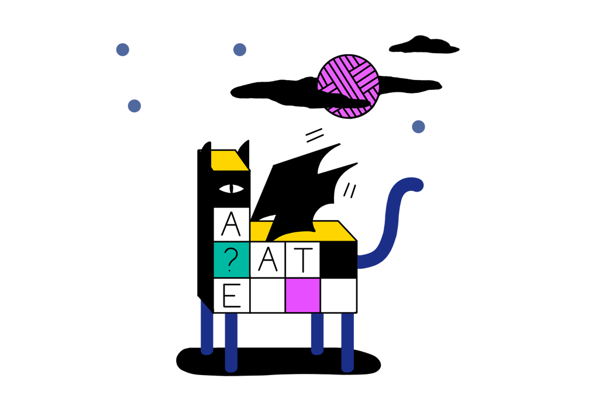

### Use the Crossings, Luke

**Tip: **You can confirm whether an answer is right by solving the entries that cross it.

Let’s look at an example of why it pays to work those crossings. You might not see this in a Monday puzzle, but say the clue is “Black Halloween animal,” and you have confidently written in “CAT.”

Then you look at the entry that crosses the first letter of CAT and the clue is “Honest ___ (presidential moniker).” The answer to that one is ABE, so CAT must be wrong.

Now what do you do?

Stay flexible and remember that a BAT is *also* a “black Halloween animal.” Yes, it’s tricky, but it’s doable.

Conversely, you can also work your way through an answer that you can’t get completely by solving the crossings. Once you have enough letters filled in, take your best guess based on the pattern of letters you’ve uncovered.

*> “The key to solving crosswords is mental flexibility. If one answer doesn’t seem to be working out, try something else.” – Will Shortz.*>

### It’s Not Cheating, It’s Learning

**Tip:** Don’t be afraid to look up answers. You’ll become a better solver for it.

Let me say something that may be controversial, but it needs to be said: It’s O.K. to look something up when solving a crossword.

Crosswords are ultimately learning tools, whether you’re learning some trivia or an interesting new word or phrase. When you look something up, you’re learning so you’ll know it for next time.

Of course, some solvers may tell you that looking up the answer to a clue is “cheating,” but to us, that way lies frustration and a path to giving up. And that’s no fun. Crosswords are a game, and games are supposed to be fun.

Still not sure looking things up is fair? Here is outright permission:

> “It’s your puzzle. Solve it any way you like.” **> –**>   > [*> Will Weng, the second crosswords editor of The New York Times*](https://www.nytimes.com/interactive/2017/02/14/crosswords/new-york-times-crossword-timeline.html?_r=0&mcubz=3)>  (1969 - 1977).

### Take a Break if You Get Stuck

We’re big fans of the brain here, especially its incredible work ethic. But even brains get tired, so if you are stuck at some point in the puzzle, one of the best things you can do is put it down and take a break from it for a while.

I’m not sure how this works, but your brain will continue working on the clue in the background while you go about your day. When you come back to it, you might be surprised at the “Aha!” moment you experience when you thought you didn’t know the answer.

### Solve With a Friend

**Tip: **Solving with another person can work to your advantage.

Your wheelhouse might be stuffed with [*sports*](https://www.nytimes.com/interactive/2017/04/01/crosswords/CROSSWORDS-baseball-terms.html)  [*trivia*](https://www.nytimes.com/interactive/2017/04/19/crosswords/CROSSWORDS-sports-names.html). Your BFF’s wheelhouse might be crammed to the rafters with a deep knowledge of [*opera*](https://www.nytimes.com/interactive/2017/07/19/crosswords/CROSSWORDS-operas.html?rref=collection%2Fcolumn%2Fwordplay). *Vive la différence*, right?

You know things your friend doesn’t know, and he or she knows things that you don’t know. That’s roughly twice as much stuff that you can solve, and it’s a good excuse to spend time together.

In fact, you never know when it could lead to something more, [like a marriage proposal. ](https://www.youtube.com/watch?v=73EDetVQzCs)

### Sit Back and Enjoy Your Accomplishment

Yay, you! You’ve started solving The New York Times Crossword!

Solving a New York Times crossword is not easy, but it should be satisfying. Even if you only get a few answers the first few times, keep on solving. It just gets easier – and better – from there.

But don’t limit yourself. Try to master the skills you need to get started, and then push yourself to go further into the week. That’s where all of that devious, delicious wordplay is tucked into the clues, and where the fun in solving crosswords lies.

Are you ready to take your solving a step further?

### Words to Know

**Clue:** A crossword clue is a hint that the solver must decipher to find the answer that is then entered into the puzzle grid. Clues are not necessarily dictionary definitions; they can involve puns, anagrams and other types of wordplay.

**Crossing:** The intersection between an Across entry and a Down one. Crosswords are intended to play fair with solvers, so a difficult or obscure entry will ideally cross a more “gettable” one.

**Entry: **The answer to a clue that solvers write into the crossword puzzle. Entries that are part of a theme are called — wait for it — theme entries. **Fun fact: **In a typical American-style crossword, an entry must have at least three letters.

**Fill: **A general term for the words or phrases that fill a crossword.

**Fill-in-the-blank: **A clue that contains a blank where the answer goes. One of the easiest types of clues to solve.

**Mini crossword: **A 5x5 crossword offered by The New York Times. For comparison, the size of a Times daily crossword is 15x15 and the Sunday crossword is 21x21.

Ad

[www.grammarly.com](https://googleads.g.doubleclick.net/aclk?sa=l&ai=CBde7S04oWpSIE8eKbYu-tIAPurGm6k3Ovb2LwAXAjbcBEAEgyNb1GWC7vq6D0AqgAeKM4_YDyAEB4AIAqAMByAObBKoE4gFP0ISTACZSvhpxHvHA2xDO5lbvvf3E8QAHfX6mo7n53MlB7xa7IHIcfynKCxGVRsRXN8BgocnFTlO1zMXZGFmi7u75YpT_NZg3KnqI-yuyncP56YzPc9NOO5sjNzl8aVXDwu2MbXIpu8f7WL1CzjNVm7lR1HzcA0CMouhdggIIohgWF3Zy-SQTxvydD6uinA9XZ0-7skUTs_14shyJ2jbIMnRPhHUXbkaLUdna7vRxVN9qkHLuA6AkG1d3zNUmhOGKBlt5qkfdFkp6YSZJJ8Khzc0OTpEhVEXmSEg1QT9-pi2_4AQBgAeG85wJqAemvhvYBwHSCAcIjGMQARgBsQmrIUnRI6L7BoAKA9gTDA&num=1&sig=AOD64_2C1xACf0Bqls6eRRWDo1uWDVVOSQ&client=ca-pub-4177862836555934&adurl=http://www.grammarly.com/%3Fq%3Dgrammar%26utm_source%3Dgoogle%26utm_medium%3Dcpc%26utm_campaign%3Dsdc2%26utm_content%3D207819670318%26utm_term%3D%26matchtype%3D%26placement%3D6f1c8c9a3e96ee38.anonymous.google%26network%3Dd)

[](https://googleads.g.doubleclick.net/aclk?sa=l&ai=CBde7S04oWpSIE8eKbYu-tIAPurGm6k3Ovb2LwAXAjbcBEAEgyNb1GWC7vq6D0AqgAeKM4_YDyAEB4AIAqAMByAObBKoE4gFP0ISTACZSvhpxHvHA2xDO5lbvvf3E8QAHfX6mo7n53MlB7xa7IHIcfynKCxGVRsRXN8BgocnFTlO1zMXZGFmi7u75YpT_NZg3KnqI-yuyncP56YzPc9NOO5sjNzl8aVXDwu2MbXIpu8f7WL1CzjNVm7lR1HzcA0CMouhdggIIohgWF3Zy-SQTxvydD6uinA9XZ0-7skUTs_14shyJ2jbIMnRPhHUXbkaLUdna7vRxVN9qkHLuA6AkG1d3zNUmhOGKBlt5qkfdFkp6YSZJJ8Khzc0OTpEhVEXmSEg1QT9-pi2_4AQBgAeG85wJqAemvhvYBwHSCAcIjGMQARgBsQmrIUnRI6L7BoAKA9gTDA&num=1&sig=AOD64_2C1xACf0Bqls6eRRWDo1uWDVVOSQ&client=ca-pub-4177862836555934&adurl=http://www.grammarly.com/%3Fq%3Dgrammar%26utm_source%3Dgoogle%26utm_medium%3Dcpc%26utm_campaign%3Dsdc2%26utm_content%3D207819670318%26utm_term%3D%26matchtype%3D%26placement%3D6f1c8c9a3e96ee38.anonymous.google%26network%3Dd)

[Level Up Your Writing](https://googleads.g.doubleclick.net/aclk?sa=l&ai=CBde7S04oWpSIE8eKbYu-tIAPurGm6k3Ovb2LwAXAjbcBEAEgyNb1GWC7vq6D0AqgAeKM4_YDyAEB4AIAqAMByAObBKoE4gFP0ISTACZSvhpxHvHA2xDO5lbvvf3E8QAHfX6mo7n53MlB7xa7IHIcfynKCxGVRsRXN8BgocnFTlO1zMXZGFmi7u75YpT_NZg3KnqI-yuyncP56YzPc9NOO5sjNzl8aVXDwu2MbXIpu8f7WL1CzjNVm7lR1HzcA0CMouhdggIIohgWF3Zy-SQTxvydD6uinA9XZ0-7skUTs_14shyJ2jbIMnRPhHUXbkaLUdna7vRxVN9qkHLuA6AkG1d3zNUmhOGKBlt5qkfdFkp6YSZJJ8Khzc0OTpEhVEXmSEg1QT9-pi2_4AQBgAeG85wJqAemvhvYBwHSCAcIjGMQARgBsQmrIUnRI6L7BoAKA9gTDA&num=1&sig=AOD64_2C1xACf0Bqls6eRRWDo1uWDVVOSQ&client=ca-pub-4177862836555934&adurl=http://www.grammarly.com/%3Fq%3Dgrammar%26utm_source%3Dgoogle%26utm_medium%3Dcpc%26utm_campaign%3Dsdc2%26utm_content%3D207819670318%26utm_term%3D%26matchtype%3D%26placement%3D6f1c8c9a3e96ee38.anonymous.google%26network%3Dd)

[Write better online and avoid embarrassing mistakes](https://googleads.g.doubleclick.net/aclk?sa=l&ai=CBde7S04oWpSIE8eKbYu-tIAPurGm6k3Ovb2LwAXAjbcBEAEgyNb1GWC7vq6D0AqgAeKM4_YDyAEB4AIAqAMByAObBKoE4gFP0ISTACZSvhpxHvHA2xDO5lbvvf3E8QAHfX6mo7n53MlB7xa7IHIcfynKCxGVRsRXN8BgocnFTlO1zMXZGFmi7u75YpT_NZg3KnqI-yuyncP56YzPc9NOO5sjNzl8aVXDwu2MbXIpu8f7WL1CzjNVm7lR1HzcA0CMouhdggIIohgWF3Zy-SQTxvydD6uinA9XZ0-7skUTs_14shyJ2jbIMnRPhHUXbkaLUdna7vRxVN9qkHLuA6AkG1d3zNUmhOGKBlt5qkfdFkp6YSZJJ8Khzc0OTpEhVEXmSEg1QT9-pi2_4AQBgAeG85wJqAemvhvYBwHSCAcIjGMQARgBsQmrIUnRI6L7BoAKA9gTDA&num=1&sig=AOD64_2C1xACf0Bqls6eRRWDo1uWDVVOSQ&client=ca-pub-4177862836555934&adurl=http://www.grammarly.com/%3Fq%3Dgrammar%26utm_source%3Dgoogle%26utm_medium%3Dcpc%26utm_campaign%3Dsdc2%26utm_content%3D207819670318%26utm_term%3D%26matchtype%3D%26placement%3D6f1c8c9a3e96ee38.anonymous.google%26network%3Dd)

[Visit Site](https://googleads.g.doubleclick.net/aclk?sa=l&ai=CBde7S04oWpSIE8eKbYu-tIAPurGm6k3Ovb2LwAXAjbcBEAEgyNb1GWC7vq6D0AqgAeKM4_YDyAEB4AIAqAMByAObBKoE4gFP0ISTACZSvhpxHvHA2xDO5lbvvf3E8QAHfX6mo7n53MlB7xa7IHIcfynKCxGVRsRXN8BgocnFTlO1zMXZGFmi7u75YpT_NZg3KnqI-yuyncP56YzPc9NOO5sjNzl8aVXDwu2MbXIpu8f7WL1CzjNVm7lR1HzcA0CMouhdggIIohgWF3Zy-SQTxvydD6uinA9XZ0-7skUTs_14shyJ2jbIMnRPhHUXbkaLUdna7vRxVN9qkHLuA6AkG1d3zNUmhOGKBlt5qkfdFkp6YSZJJ8Khzc0OTpEhVEXmSEg1QT9-pi2_4AQBgAeG85wJqAemvhvYBwHSCAcIjGMQARgBsQmrIUnRI6L7BoAKA9gTDA&num=1&sig=AOD64_2C1xACf0Bqls6eRRWDo1uWDVVOSQ&client=ca-pub-4177862836555934&adurl=http://www.grammarly.com/%3Fq%3Dgrammar%26utm_source%3Dgoogle%26utm_medium%3Dcpc%26utm_campaign%3Dsdc2%26utm_content%3D207819670318%26utm_term%3D%26matchtype%3D%26placement%3D6f1c8c9a3e96ee38.anonymous.google%26network%3Dd)

## A Step Further: How to Read Crossword Clues

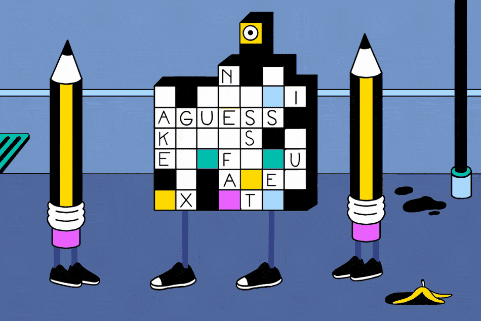

> “A crossword puzzle is a battle between the puzzle maker and editor on one side and the solver on the other. But unlike most battles, both sides here have the same goal — for the solver to win.”

— Will Shortz

Some good news about crossword puzzles: A clue and answer pairing will always be fair, even if it takes solvers a while to see it. And who doesn’t *love* being set up to win, even if it’s after a mental tug-of-war?

But how *are* you supposed to win? How are you supposed to beat your braggart of an officemate in a solving race? **The key is to learn some easy-to-remember ways to read those devilish crossword clues**.

To keep things fair between constructor, editor and solver, most crossword clues follow certain predictable “rules.”**  **We’re going to let you in on some of those rules and, if you practice using the Minis that are included in this guide, you will get a lot further in your solving.

### "Must Match" Clues

- [Tense]()
- [Part of Speech]()
- [Plural]()
- [Language]()
- No surprise here. **If you see a foreign language clue, expect a foreign language answer. **

If there is a non-English word or phrase in the crossword, the clue will signal it by either including a word or phrase in the same language, or by connecting the answer to a place where that language is spoken or a person who might speak it. For the most part, foreign words or phrases included in puzzles they are very common words that most people will know, providing they paid attention in their high school language classes.

For example, the Spanish word ESTA, which means “this” or “it is,” might be clued early in the week as “It is, en español.” Don’t worry, the answer is in your brain somewhere. And remember: If you need to, take a break and come back to the puzzle. And work those crossings.

You might also see ESTA clued as “It is, in Ibiza” or “This, in Tijuana.”

A tantalizing glimpse at the late week wordplay you can look forward to when you push past the Mondays: If the entry was in a deviously tricky late-week puzzle, you might see the clue: “What this is in Spain.”

And no, the puzzle constructors and editors don’t hate you. They just want you to stretch your mind a bit.

 [   ### The Mini  #### Foreign Language   Parlez-vous français? We’ve put an “*” by the clues that adhere to the ‘foreign language’ rule to help.](https://www.nytimes.com/crosswords/game/special/foreign-words)

### More Types of Crossword Clues

- [Partner Clues]()
- [Cross-Referenced]()
- [Abbreviations]()
- **A partner clue wants you to come up with a word that is typically partnered with another word, separated by the word “and.” **

An example of this would be the clue, “Partner of live” for which the answer would be LEARN, because the popular phrase is “Live and learn.” Occasionally, the word “and” is not needed as a separator, as in the clue “Partner of neither,” for the answer NOR, because “neither” and “nor” are partnered in sentences.

So let your mind wander and try to think of possible partners for the word in the clue. If you need to come up with an answer for the clue “Partner of sciences,” for example, the answer would be either “Sciences and ___” or “___ and sciences.” In this case, the answer is ARTS, for “arts and sciences.”

 [   ### The Mini  #### Partners   Partner up with this mini. We’ve put an “*” by the clues that adhere to the ‘partner’ rule.](https://www.nytimes.com/crosswords/game/special/partners)

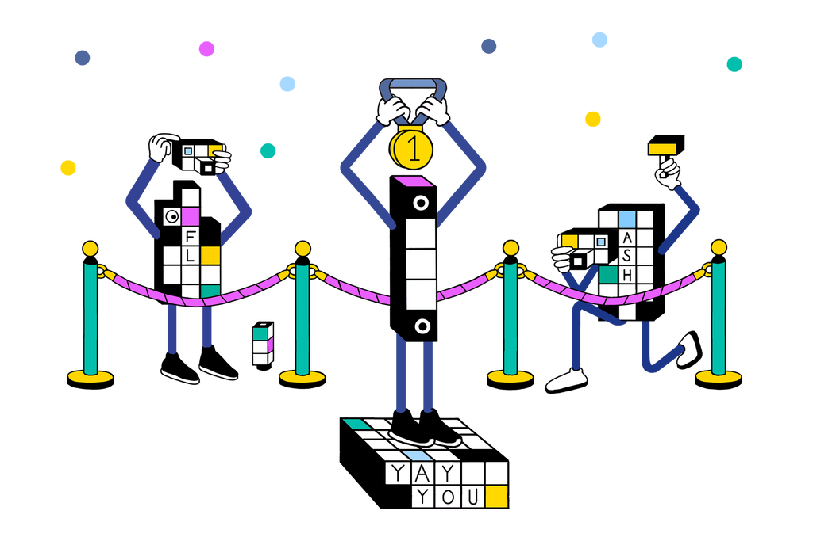

### Go Big

You now know enough clue secrets to get you most, if not all the way, through an early week puzzle. That wasn’t so tough, right?

Ready to try it? Will Shortz has selected 11 of his favorite Monday puzzles from our archive for you, so you can get some practice. Don’t worry: You’ve got this.

 [   ###   #### 11 Remarkable Crosswords for New Solvers   Ready to conquer The New York Times Crossword? Here's a sampling — hand-picked by Will Shortz — to get you started.](https://www.nytimes.com/interactive/2017/02/14/cricticschoice/crosswords/remarkable-puzzles-will-shortz.html?_r=0)

Remember, don’t be afraid to make mistakes. Learn from them and move on. Above all, have fun.

### Words to Know

**Constructor:** The person who creates the crossword puzzle. The constructor develops the theme if it’s a themed puzzle, fills the puzzle with interlocking words or phrases and writes the clues. In other countries, the constructor might be called a compiler or setter.

**Cross-Reference: **Two entries whose clues are linked to each other. In the Mini Crossword below, 1-Across and 4-Across are cross-referenced.

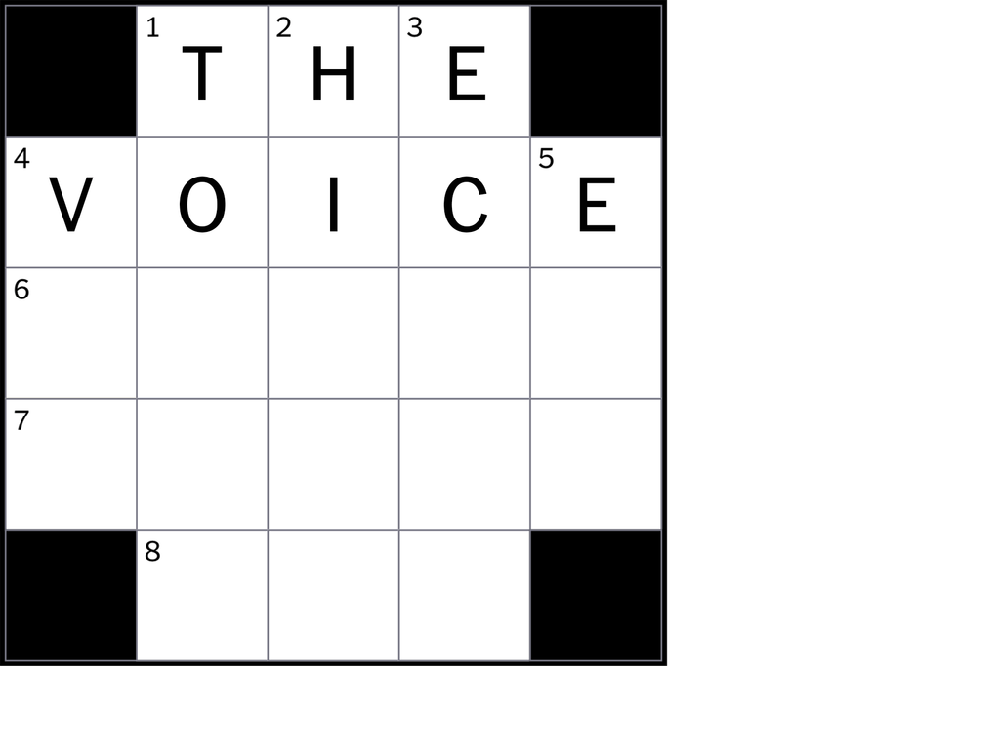

**Grid:** The diagram of black and white squares that contains the entries. Most daily puzzles are 15 squares by 15 squares and most Sunday puzzles are 21 squares by 21 squares.

**Interlock:** The crossing of entries inside the grid. An American-style crossword has “all-over interlock,” which means that no part of the grid can be completely cut off by the black squares. In theory, a solver should be able to solve from any section of a puzzle to another without having to stop.

**Symmetry: **Standard crosswords have 180 degree rotational symmetry, which means that if you turn a crossword puzzle upside down, the black and white squares will still be in the same place.

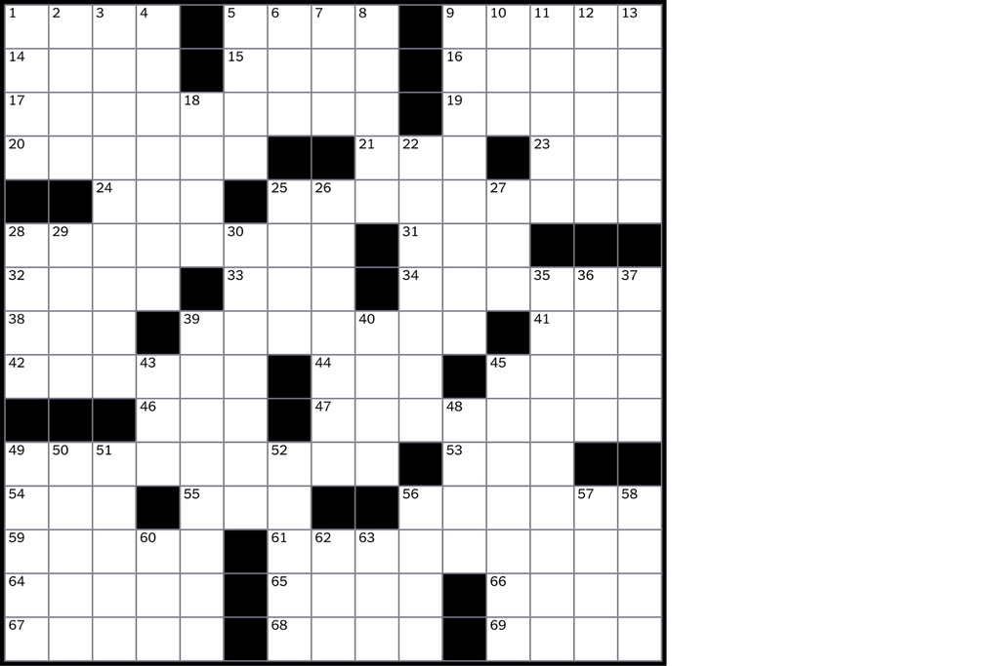
Occasionally, left-right or mirror symmetry is used instead.
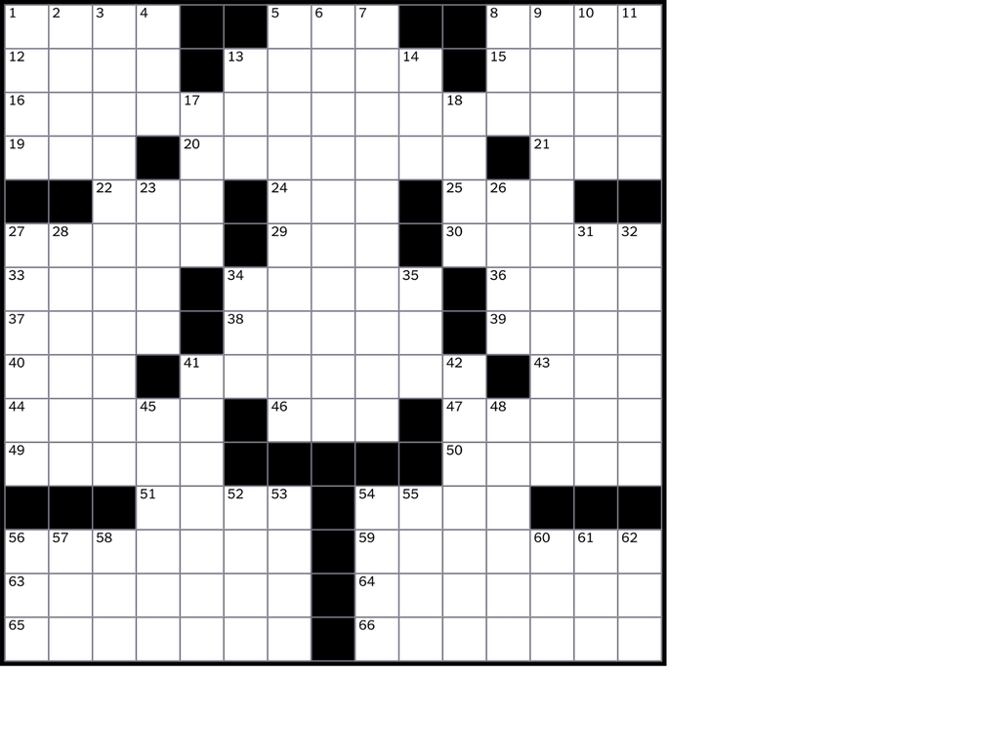

**Word count**: The word count is the number of answers in a crossword. In a New York Times crossword, a themed 15x15 square puzzle typically has no more than 78 answers. A 15x15 themeless puzzle has a maximum word count of 72 answers. A 21x21 Sunday puzzle usually has no more than 140 answers.

Ad

[Anova Culinary](https://googleads.g.doubleclick.net/aclk?sa=l&ai=C3kcvk04oWuDRMoaQbcbEotAL-oey6U7z8cC-pAbJw_WysAkQASDI1vUZYLu-roPQCqABsI39wgPIAQbgAgCoAwHIAwKqBOgBT9AY-RZornwIUHJc7o2q9c1SgDfQomv8v4t8mKgd8GW-pgJ1f7dUF-flGj8syS3b6sf8TcKdFu9Jx1PJjfUk1fkzHf-W2yEeSzPZVfbyOSxJqIxLG66_t0PzrXb_47-SZL55ENEpkX6Ob0JxnGW3wUVfNA3FCInsteMKU-cQlF6A2yc9slk20-bl4q5GJk9ARy4rVdK-8FJ64EltyA71noUCLMkk4Gev2WH3G_Ng1ih0SyEulrekw_hhubGAK00x_O4ucp3JCv4FATSFN-n_Uc2ukWvK8k1_uZxoOZ-oOu7HbQhs1En1_-AEAaAGN4AHkNPAR6gHpr4b2AcB0ggHCIxjEAEYAbEJUqAxrv8VWlWACgPYEww&num=1&sig=AOD64_3w3qu7IkxXxw_bEXXYHSkMRLZlog&client=ca-pub-4177862836555934&adurl=https://anovaculinary.com/anova-precision-cooker/)

[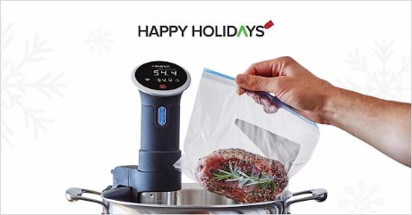](https://googleads.g.doubleclick.net/aclk?sa=l&ai=C3kcvk04oWuDRMoaQbcbEotAL-oey6U7z8cC-pAbJw_WysAkQASDI1vUZYLu-roPQCqABsI39wgPIAQbgAgCoAwHIAwKqBOgBT9AY-RZornwIUHJc7o2q9c1SgDfQomv8v4t8mKgd8GW-pgJ1f7dUF-flGj8syS3b6sf8TcKdFu9Jx1PJjfUk1fkzHf-W2yEeSzPZVfbyOSxJqIxLG66_t0PzrXb_47-SZL55ENEpkX6Ob0JxnGW3wUVfNA3FCInsteMKU-cQlF6A2yc9slk20-bl4q5GJk9ARy4rVdK-8FJ64EltyA71noUCLMkk4Gev2WH3G_Ng1ih0SyEulrekw_hhubGAK00x_O4ucp3JCv4FATSFN-n_Uc2ukWvK8k1_uZxoOZ-oOu7HbQhs1En1_-AEAaAGN4AHkNPAR6gHpr4b2AcB0ggHCIxjEAEYAbEJUqAxrv8VWlWACgPYEww&num=1&sig=AOD64_3w3qu7IkxXxw_bEXXYHSkMRLZlog&client=ca-pub-4177862836555934&adurl=https://anovaculinary.com/anova-precision-cooker/)

[Enjoy crazy good savings on the Anova Precision Cooker.](https://googleads.g.doubleclick.net/aclk?sa=l&ai=C3kcvk04oWuDRMoaQbcbEotAL-oey6U7z8cC-pAbJw_WysAkQASDI1vUZYLu-roPQCqABsI39wgPIAQbgAgCoAwHIAwKqBOgBT9AY-RZornwIUHJc7o2q9c1SgDfQomv8v4t8mKgd8GW-pgJ1f7dUF-flGj8syS3b6sf8TcKdFu9Jx1PJjfUk1fkzHf-W2yEeSzPZVfbyOSxJqIxLG66_t0PzrXb_47-SZL55ENEpkX6Ob0JxnGW3wUVfNA3FCInsteMKU-cQlF6A2yc9slk20-bl4q5GJk9ARy4rVdK-8FJ64EltyA71noUCLMkk4Gev2WH3G_Ng1ih0SyEulrekw_hhubGAK00x_O4ucp3JCv4FATSFN-n_Uc2ukWvK8k1_uZxoOZ-oOu7HbQhs1En1_-AEAaAGN4AHkNPAR6gHpr4b2AcB0ggHCIxjEAEYAbEJUqAxrv8VWlWACgPYEww&num=1&sig=AOD64_3w3qu7IkxXxw_bEXXYHSkMRLZlog&client=ca-pub-4177862836555934&adurl=https://anovaculinary.com/anova-precision-cooker/)

[Enjoy pro-level results from the comfort of your home.](https://googleads.g.doubleclick.net/aclk?sa=l&ai=C3kcvk04oWuDRMoaQbcbEotAL-oey6U7z8cC-pAbJw_WysAkQASDI1vUZYLu-roPQCqABsI39wgPIAQbgAgCoAwHIAwKqBOgBT9AY-RZornwIUHJc7o2q9c1SgDfQomv8v4t8mKgd8GW-pgJ1f7dUF-flGj8syS3b6sf8TcKdFu9Jx1PJjfUk1fkzHf-W2yEeSzPZVfbyOSxJqIxLG66_t0PzrXb_47-SZL55ENEpkX6Ob0JxnGW3wUVfNA3FCInsteMKU-cQlF6A2yc9slk20-bl4q5GJk9ARy4rVdK-8FJ64EltyA71noUCLMkk4Gev2WH3G_Ng1ih0SyEulrekw_hhubGAK00x_O4ucp3JCv4FATSFN-n_Uc2ukWvK8k1_uZxoOZ-oOu7HbQhs1En1_-AEAaAGN4AHkNPAR6gHpr4b2AcB0ggHCIxjEAEYAbEJUqAxrv8VWlWACgPYEww&num=1&sig=AOD64_3w3qu7IkxXxw_bEXXYHSkMRLZlog&client=ca-pub-4177862836555934&adurl=https://anovaculinary.com/anova-precision-cooker/)

[Shop Now](https://googleads.g.doubleclick.net/aclk?sa=l&ai=C3kcvk04oWuDRMoaQbcbEotAL-oey6U7z8cC-pAbJw_WysAkQASDI1vUZYLu-roPQCqABsI39wgPIAQbgAgCoAwHIAwKqBOgBT9AY-RZornwIUHJc7o2q9c1SgDfQomv8v4t8mKgd8GW-pgJ1f7dUF-flGj8syS3b6sf8TcKdFu9Jx1PJjfUk1fkzHf-W2yEeSzPZVfbyOSxJqIxLG66_t0PzrXb_47-SZL55ENEpkX6Ob0JxnGW3wUVfNA3FCInsteMKU-cQlF6A2yc9slk20-bl4q5GJk9ARy4rVdK-8FJ64EltyA71noUCLMkk4Gev2WH3G_Ng1ih0SyEulrekw_hhubGAK00x_O4ucp3JCv4FATSFN-n_Uc2ukWvK8k1_uZxoOZ-oOu7HbQhs1En1_-AEAaAGN4AHkNPAR6gHpr4b2AcB0ggHCIxjEAEYAbEJUqAxrv8VWlWACgPYEww&num=1&sig=AOD64_3w3qu7IkxXxw_bEXXYHSkMRLZlog&client=ca-pub-4177862836555934&adurl=https://anovaculinary.com/anova-precision-cooker/)

## Cracking the Harder Clues

> “It’s kind of fun to be pulled out of your comfort zone. Puzzles are a kind of nonthreatening way to remind us that there is still mystery in the world.”

— Jason Silva, “Wonder junkie” and former host of NatGeo’s “Brain Games”

The real fun and challenge of crossword solving lies in cracking the really tough clues.

From being duped by magic tricks to pondering those brain-twisting crossword clues, why do humans [so love being fooled?](https://wordplay.blogs.nytimes.com/2013/09/12/fool-for-being-fooled/) Is it the rush of the “Aha!” moment, when their expectations are defied?

Of course, some solvers say simply that figuring out a really tricky clue makes them feel smart. And there is nothing wrong with that, especially when you’re learning how to decipher them.

Here are some more clue types to conquer:

### More Clue Types

- [Clues With a "?"]()
- [Slang]()
- ["Quotes" and [Brackets]]()
- [Veiled Capitals]()
- **Tip: **Watch out for one of the most devious cluing traps in crosswords: Hiding a proper name at the beginning of a clue.

Talk about tough cluing. This type of clue requires careful reading.

When the crossword constructor and the editors are feeling particularly diabolical, you might see an innocent-looking clue like this for a three letter entry:

**“Brave opponent”**

Hey, someone is calling their adversary “brave.” That’s nice. On the surface, this clue looks like a compliment, doesn’t it?

Not this time. The answer to that clue is RED. Depending on the puzzle, it might also be MET.

We know. That makes no sense at first glance, but don’t give up. There’s logic behind this, we promise.

Let’s take a closer look at the clue: The word “Brave” has a capital B because it is at the beginning of the clue, but that is *not the only reason it’s capitalized*. It has a capital B because it *also* happens to be the name of a professional baseball player, an Atlanta Brave. The puzzle maker and the editors put it at the beginning of the clue to capitalize on (sorry), or take advantage of, the capital letter.

And a three letter “Brave opponent,” or an opponent of an Atlanta Brave, could be a Cincinnati RED. It might also be a New York MET.

As we said, there may be a lot of forehead slapping as you get into the late week puzzles, but hang in there. We promise you’ll start to enjoy the lengths to which the puzzle makers and editors go to twist your brain.

 [   ### The Mini  #### Veiled Capitals   Time to practice again. Watch out for those capital letters!](https://www.nytimes.com/crosswords/game/special/veiled-capitals)

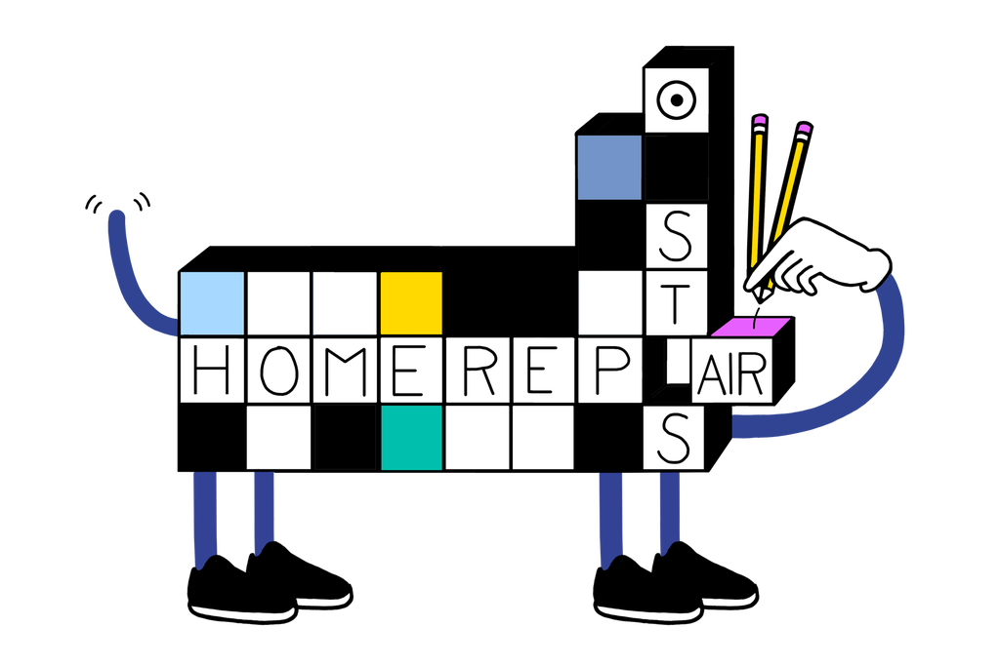

### Rebuses

**Tip: **When you find yourself cursing at the puzzle because none of your expected answers fit, it probably has a rebus element.

Solvers either love rebuses or they hate them.

A rebus element can be a letter, number or symbol that represents a word, but in many crosswords, **the rebus will be a word or group of letters that need to be written inside**  **a single square***. *Many solvers ask if they are supposed to be warned that a rebus exists in a puzzle, and the answer is no, that’s part of the fun of solving. It’s also frustrating if you don’t figure out what’s going on. (That’s also why rebuses are generally reserved for Thursday and Sunday puzzles, says Joel Fagliano, the digital puzzles editor.)

Let’s say you see a clue that reads “Do-it-yourselfer's activity,” and the allotted space you are given for the answer is eight squares. Maybe you guessed right off the bat (or you used those crossings!) that the answer is HOME REPAIR. But HOME REPAIR would need 10 squares.

So, start to consider the theme of the puzzle. If you tighten your belt and squeeze multiple letters into a single square, you’ll end up with the word “air” in one square. This puzzle maker made the word AIR a rebus element in eight squares, where the rebus worked for both the Across and Down clues.

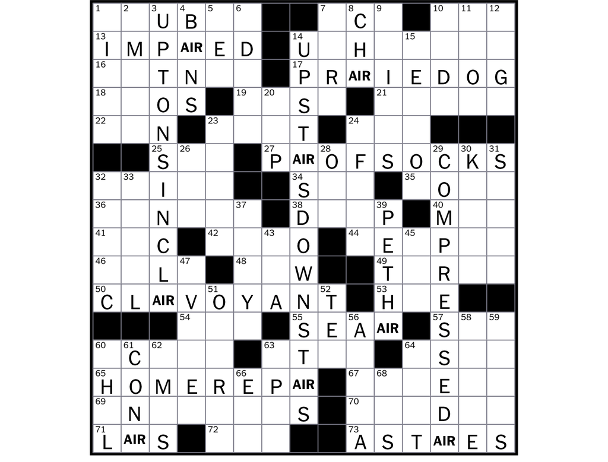
Jules Markey, August 20, 2015

And what was the purpose of squeezing AIR into one square? To make “compressed AIR,” of course. Now that’s a nice Thursday theme.

Part of the fun is determining where in the entry the rebus belongs. You’ll really need to work the crossings to figure that out. If you are solving in print, of course, filling in the rebus will simply be a matter of writing small.

If you are solving online or in one of our apps, however, [*there is an easy way to enter multiple letters in a single square.*](https://www.nytimes.com/2017/06/01/crosswords/yes-you-can-write-more-than-one-letter-in-a-square.html?_r=0)

 [   ### The Mini  #### Rebus   Read up on how to put more than one letter in a square above and then practice with this mini puzzle.](https://www.nytimes.com/crosswords/game/special/rebus)

### Clues That Use Heteronyms

**Tip:** We’ve saved the most confounding type of clue for last. Some clues use heteronyms to misdirect you. (We swear this is fun.)

Heteronyms are two or more words that are spelled identically but have different pronunciations and meanings, like “minute” (*MIN-it*), which is a unit of time, and “minute” (*my-NOOT*), which might mean tiny.

Imagine how much that unique facet of language enthralls our puzzle makers and editors. And they use it to their advantage.This might not seem completely fair, but if you’ve been learning the tricks to understanding the clues in the rest of this guide, it’s well within the bounds of fairness. You just have to learn to think like a constructor.

How about a short quiz to help you figure this out? Here are some particularly sneaky heteronym examples and the number of letters in their answers. We’d like you to guess those answers. You might want to spend some time staring at them until the heteronym reveals itself.

Remember, question *everything*. Don’t allow any word to go unexamined.
**Heteronym Clues**

1. “Minute, to a tot” (4 letters)

2. “Nice one” (3 letters)

3. “Light shower” (5 letters)

4. “Polish person” (5 letters)

5. “Refuse work?” (4, 3 letters)

6. “Kitchen drawer?” (5 letters)

7. “Begin at the beginning?” (8 letters)

8. “Knockout number?” (5 letters)

9. “One of them does?” (4 letters)

10. “Moving supply” (5 letters)  *(This one is Will Shortz’s favorite. He says it fooled everyone!)*

Are you getting the hang of this yet? These are not easy, but keep staring, because that “Aha!” moment is really worth it.

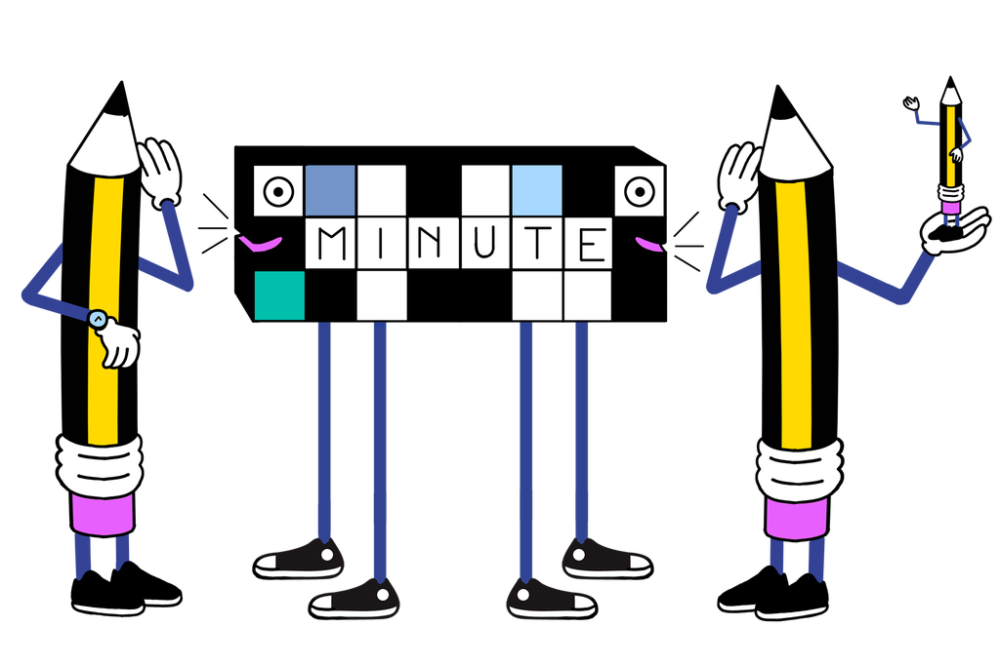

Still stuck? Here are the answers with the reasoning behind them:
**Answers**

1. **ITTY**: In this case, as in the example above, the word “minute” (pronounced ‘MIN-it’) is not meant to be a unit of time. It is the “minute” (‘my-NOOT’) meant to mean “small,” and a tot might use the word ITTY.

2. **UNE**: “Nice one” is a familiar phrase, but instead of the word “nice” meaning “good,” this “Nice” is capitalized because it is really the city in France. And the article “one” in French is the word UNE.

3. **PRISM**:  Yes, we know. Bear with us. Typically, a “Light shower” would be a mild rainstorm. In this case, the word “shower” is not pronounced using the “ow” sound. It’s pronounced using the “oh” sound, as in something that shows light. And that would be a PRISM.

4. **WAXER**: Not “Polish” as in someone from Poland.” “Polish” as in someone who buffs things.

5. **JUNK ART**: To “Refuse work” *could* mean to turn down a job. Or, it could mean working with refuse or garbage, which means that one is creating JUNK ART.

6. **AROMA**: Everyone knows what a “Kitchen drawer” is, right? It’s that thing you keep your utensils in. Except when it’s something that lures people — or draws them — into the kitchen. And that “drawer” would be an AROMA.

7. **MENACHEM**: Remember when we talked about capitalized words at the beginnings of clues? “Begin at the beginning” is a common idiom, but in this clue the word “Begin” doesn’t mean to start; it refers to the former prime minister of Israel, MENACHEM Begin. “ … at the beginning” is an indicator that the clue is looking for what goes *before* “Begin.”

8. **ETHER**: On the surface, a “Knockout number” might be a really dazzling song and dance number. But there are other ways of knocking someone out and there are other meanings to the word “number,” even if they are diabolical. In this case, we are knocking someone out and numbing them with the use of the gas ETHER.

9. **DEER**: “One of them does?” sounds like a statement about compliance. But when pronounced with a long “O,” the word “does” in this clue is actually the word for female DEER.

10. **LITHE**: How long did you stare at the word “supply” before you got it? Not to worry, it took us a long time, too. A “Moving supply” (pronounced suh-PLY) could be a box, but we need a five letter word. What if we freed our minds up and thought about the word “supply” in a different way? Could it be ‘SUP-lee’ as in a “supple” move? Sure it could. To move supply is to be LITHE.

### You Can Do It!

Kudos to you for hanging in there with us! If you’ve been practicing, you should be able to tackle a midweek puzzle at least, if not a later-in-the-week puzzle. All it takes is dedication to solving and learning. Oh, and a willingness to have fun. Because as we said, crosswords are a game, and games are meant to be fun.

 [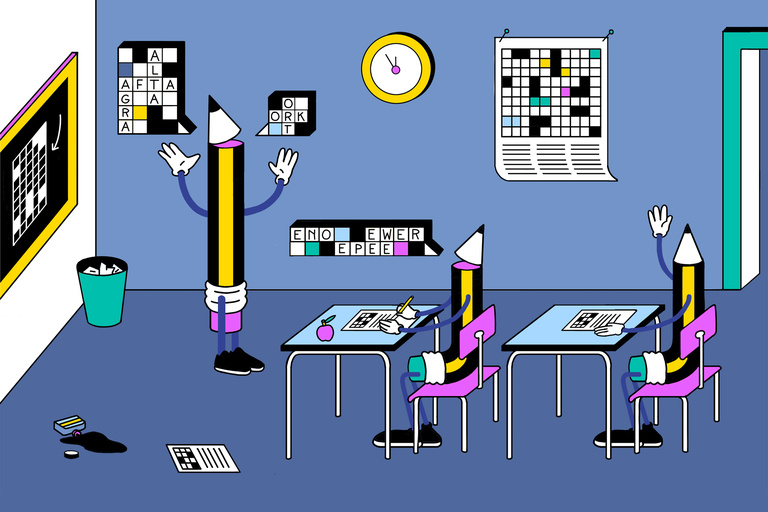   ### Quiz  #### How Well Do You Know Your Crosswordese?   Take this quiz to familiarize yourself with some of the more common obscure crossword entries.](https://www.nytimes.com/interactive/2017/11/28/crosswords/crosswordese-quiz.html?_r=0)

 [(L)](http://adclick.g.doubleclick.net/pcs/click?xai=AKAOjssF8UG5mEztXtG39xyMKWjuOO95pjuIGyJqUANawCQotQCjkxkXe2piIkP96OiC_6e-MRm8U03k44yOEdoCVXs_OoyHJ893LHUjRbg-XY9mWlqcrGnw5u9XgMa-YuUi8kb1riOLBoYFNXHQoQvcPrMBbmHXOxDp6I5itEj7KRA1-wHPWQgnrwniuqAz2tG0m4E1XNgTTSKzDaYI65eqDesaDoFfk-SKyz_sMZZWtoABR3c3DsloX10_QiQ2AQfIsn9zN0nHBFI&sig=Cg0ArKJSzEHFeZX56_nCEAE&urlfix=1&adurl=http://www.visitguatemala.com)

ADVERTISEMENT: Guatemala

 
Discover the Heart of the Mayan World with Your Own Eyes

Gran Jaguar Temple

 [Read More](http://adclick.g.doubleclick.net/pcs/click?xai=AKAOjssF8UG5mEztXtG39xyMKWjuOO95pjuIGyJqUANawCQotQCjkxkXe2piIkP96OiC_6e-MRm8U03k44yOEdoCVXs_OoyHJ893LHUjRbg-XY9mWlqcrGnw5u9XgMa-YuUi8kb1riOLBoYFNXHQoQvcPrMBbmHXOxDp6I5itEj7KRA1-wHPWQgnrwniuqAz2tG0m4E1XNgTTSKzDaYI65eqDesaDoFfk-SKyz_sMZZWtoABR3c3DsloX10_QiQ2AQfIsn9zN0nHBFI&sig=Cg0ArKJSzEHFeZX56_nCEAE&urlfix=1&adurl=http://www.visitguatemala.com)

 1 of 3

 [(L)](http://adclick.g.doubleclick.net/pcs/click?xai=AKAOjssF8UG5mEztXtG39xyMKWjuOO95pjuIGyJqUANawCQotQCjkxkXe2piIkP96OiC_6e-MRm8U03k44yOEdoCVXs_OoyHJ893LHUjRbg-XY9mWlqcrGnw5u9XgMa-YuUi8kb1riOLBoYFNXHQoQvcPrMBbmHXOxDp6I5itEj7KRA1-wHPWQgnrwniuqAz2tG0m4E1XNgTTSKzDaYI65eqDesaDoFfk-SKyz_sMZZWtoABR3c3DsloX10_QiQ2AQfIsn9zN0nHBFI&sig=Cg0ArKJSzEHFeZX56_nCEAE&urlfix=1&adurl=http://www.visitguatemala.com)

 [(L)](http://adclick.g.doubleclick.net/pcs/click?xai=AKAOjssF8UG5mEztXtG39xyMKWjuOO95pjuIGyJqUANawCQotQCjkxkXe2piIkP96OiC_6e-MRm8U03k44yOEdoCVXs_OoyHJ893LHUjRbg-XY9mWlqcrGnw5u9XgMa-YuUi8kb1riOLBoYFNXHQoQvcPrMBbmHXOxDp6I5itEj7KRA1-wHPWQgnrwniuqAz2tG0m4E1XNgTTSKzDaYI65eqDesaDoFfk-SKyz_sMZZWtoABR3c3DsloX10_QiQ2AQfIsn9zN0nHBFI&sig=Cg0ArKJSzEHFeZX56_nCEAE&urlfix=1&adurl=http://www.visitguatemala.com)

 [(L)](http://adclick.g.doubleclick.net/pcs/click?xai=AKAOjssF8UG5mEztXtG39xyMKWjuOO95pjuIGyJqUANawCQotQCjkxkXe2piIkP96OiC_6e-MRm8U03k44yOEdoCVXs_OoyHJ893LHUjRbg-XY9mWlqcrGnw5u9XgMa-YuUi8kb1riOLBoYFNXHQoQvcPrMBbmHXOxDp6I5itEj7KRA1-wHPWQgnrwniuqAz2tG0m4E1XNgTTSKzDaYI65eqDesaDoFfk-SKyz_sMZZWtoABR3c3DsloX10_QiQ2AQfIsn9zN0nHBFI&sig=Cg0ArKJSzEHFeZX56_nCEAE&urlfix=1&adurl=http://www.visitguatemala.com)

## Bonus: Crossword Themes

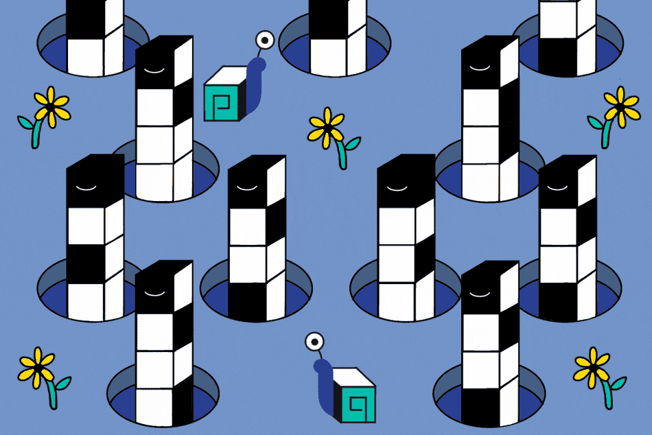

> “Discovering a crossword's theme is often half the fun of solving. And once you nail one answer in a puzzle's theme, figuring out the other long answers is usually much easier.”

— Will Shortz

There is so much more to a crossword puzzle than just a list of clues and space for you to write in the answers. We want you to be able to wring every drop of enjoyment out of your puzzle. That’s one reason you should know about crossword themes. A crossword theme is like bonus content; it is an extra puzzle-within-the-puzzle for you to solve.

Not all crosswords have themes, but for those that do, finding them will help you be a better solver. That’s another good reason to know about them.

### What Is a Theme?

Some crosswords contain a set of entries that all have something in common. Puzzle makers have a knack for spotting oddities in our language, and when they can put enough of the same kind of oddity together, they have developed a theme set. As the solver, you not only get to do the crossword puzzle, you also get to piece together the theme.

The number of types of themes you might see in crosswords is nearly infinite, so we can’t describe them here. But most commonly they involve playing with words.

They can use puns, anagrams, hidden words, common elements, letters added to familiar phrases to make new phrases, and much more. Some puzzle themes have visual themes. Be on the lookout for these, because they can be amazing.

### Why Is There a Theme?

A theme is an extra bit of entertainment that can also be a solving aid.

Once you understand the theme and can guess what the other theme entries might be, you will have a leg up on solving the rest of the puzzle. Think of it as the frame of a house;** the crossword’s theme is the basis on which the rest of the puzzle is built.**

### Where is There a Theme?

Themes can be placed anywhere in the crossword grid, depending on the creativity of the puzzle constructor. But most commonly it will be in the longest Across and Down entries.

Let’s look at one type of easy theme you might see in a Monday puzzle.
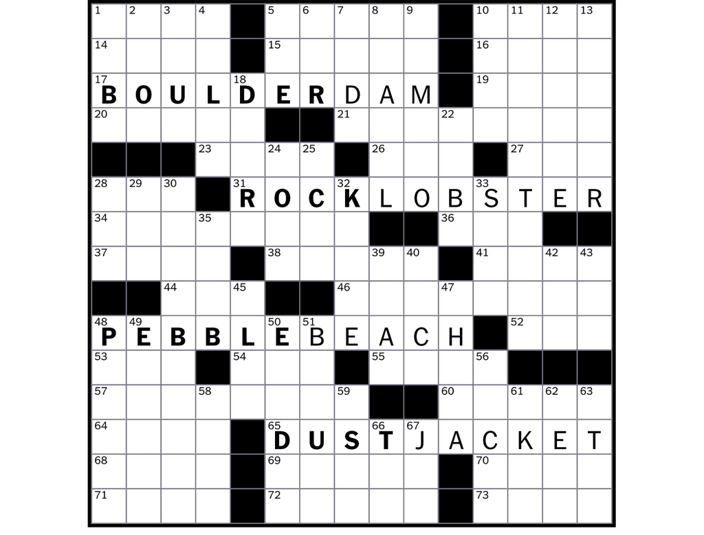
Howard Barkin, January 11, 2016

### Where Is the Theme?

The entries **BOULDER** DAM, **ROCK** LOBSTER, **PEBBLE** BEACH and **DUST** JACKET all involve some sort of stone — and the size of the stone **(BOULDER → ROCK → PEBBLE → DUST) **gets smaller as you go from the top of the grid to the bottom. Below is how these answers were clued in this puzzle. The theme clues are pretty straightforward — fittingly for a Monday puzzle — although the clue for DUST JACKET is playing with us. Even so, it’s not that hard, especially if you work the crossings.

- **BOULDER** DAM: “Colorado River landmark dedicated by F.D.R.”

- **ROCK** LOBSTER: “Novelty B-52's song with the lyric ‘Watch out for that piranha”

- **PEBBLE** BEACH: “California locale of several golf U.S. Opens”

- **DUST** JACKET: “One covering a big story?”

Most solvers don’t fill in a theme entry without first solving some of the crossings, so don’t worry if you don’t know them right off the bat. But do notice that these particular entries cover a range of topics: Topography, pop culture, sports and, well, a pun about book covers. There’s something for nearly everyone.

Some themes change part of a familiar word or phrase to make a pun. Here’s one that changes an ‘S’ to an ‘SH’ at the start of the second word of a familiar phrase to turn it into something completely different: At 17-Across, for example, BEST SELLER becomes BEST SHELLER. Three more long Across answers work similarly.

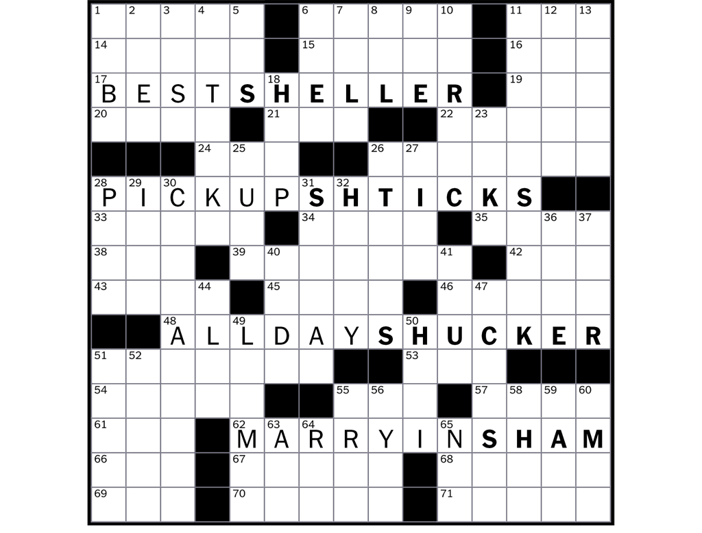
Lynn Lempel, May 8, 2012

In this puzzle, the theme entries were clued to make you think. They describe the punny phrase, not the one it’s based on, so it’s up to you to figure that out. Here’s how this puzzled was clued:

- BEST** SHELLER**: “Winner of a pea-preparing contest?” (Original phrase: BEST SELLER)

- PICK UP** SHTICKS**: “Lotharios' lines in a singles bar?” (Original phrase: PICK UP STICKS)

- ALL DAY** SHUCKER**: “One preparing corn for long hours?” (Original phrase: ALL DAY SUCKER)

- MARRY IN **SHAM**: “Phony wedding?” (Original phrase: MARRYIN’ SAM)

Now imagine opening your Sunday New York Times Magazine to the crossword and seeing a museum come to life. Here’s a Sunday puzzle from 2009 that celebrated the 50th anniversary of the Solomon R. Guggenheim Museum in New York City:

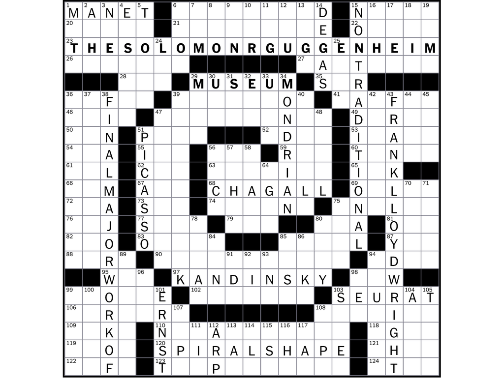
Elizabeth Gorski, October 18, 2009

In this puzzle, the black squares imitate the spiral shape of the halls of the Guggenheim Museum, and works of art that hang in the museum can be found throughout the puzzle by artist name, along with the name of the museum and other bonus theme content.

The Times has even run puzzles where solvers had to write the theme *outside* the grid. Talk about thinking outside the box! If you’re feeling daring, [*you can try one of those here*](https://www.nytimes.com/crosswords/game/daily/2006/04/01).

There is so much wonderful variety in New York Times crossword themes. These examples are just to get you started, but once you dive in and start solving, prepare to be surprised by the incredible creativity of the puzzle makers.

 [(L)](http://adclick.g.doubleclick.net/pcs/click?xai=AKAOjstvKWRbuaa0GiBc5sV2fWPeOIBJ3uynTskR8ag-l9e9A_UlzwpQikMUgHp1nSCa3rmSJ2z0KmZcJG7dZprKnYl4owq2YalNUsl6xuscpgzlAMpSq8YW4_St20CatKLV83Fr90oeLEUJ7z17vlC9B7wwLpFoJxuRcB6EKNwwb8FRvKS845OGN6NJcrUmAfHPMJzOjdcD83IrG3X-Rbrhed4Qz17QgK5qAeQ5-gyPakauHhjiScED0rRVwuNg3Au3vlqsb3kkrnU&sig=Cg0ArKJSzJtUd-RRIVfeEAE&urlfix=1&adurl=http://www.visitguatemala.com)

ADVERTISEMENT: Guatemala

 
Discover the Heart of the Mayan World with Your Own Eyes

Gran Jaguar Temple

 [Read More](http://adclick.g.doubleclick.net/pcs/click?xai=AKAOjstvKWRbuaa0GiBc5sV2fWPeOIBJ3uynTskR8ag-l9e9A_UlzwpQikMUgHp1nSCa3rmSJ2z0KmZcJG7dZprKnYl4owq2YalNUsl6xuscpgzlAMpSq8YW4_St20CatKLV83Fr90oeLEUJ7z17vlC9B7wwLpFoJxuRcB6EKNwwb8FRvKS845OGN6NJcrUmAfHPMJzOjdcD83IrG3X-Rbrhed4Qz17QgK5qAeQ5-gyPakauHhjiScED0rRVwuNg3Au3vlqsb3kkrnU&sig=Cg0ArKJSzJtUd-RRIVfeEAE&urlfix=1&adurl=http://www.visitguatemala.com)

 1 of 3

 [(L)](http://adclick.g.doubleclick.net/pcs/click?xai=AKAOjstvKWRbuaa0GiBc5sV2fWPeOIBJ3uynTskR8ag-l9e9A_UlzwpQikMUgHp1nSCa3rmSJ2z0KmZcJG7dZprKnYl4owq2YalNUsl6xuscpgzlAMpSq8YW4_St20CatKLV83Fr90oeLEUJ7z17vlC9B7wwLpFoJxuRcB6EKNwwb8FRvKS845OGN6NJcrUmAfHPMJzOjdcD83IrG3X-Rbrhed4Qz17QgK5qAeQ5-gyPakauHhjiScED0rRVwuNg3Au3vlqsb3kkrnU&sig=Cg0ArKJSzJtUd-RRIVfeEAE&urlfix=1&adurl=http://www.visitguatemala.com)

 [(L)](http://adclick.g.doubleclick.net/pcs/click?xai=AKAOjstvKWRbuaa0GiBc5sV2fWPeOIBJ3uynTskR8ag-l9e9A_UlzwpQikMUgHp1nSCa3rmSJ2z0KmZcJG7dZprKnYl4owq2YalNUsl6xuscpgzlAMpSq8YW4_St20CatKLV83Fr90oeLEUJ7z17vlC9B7wwLpFoJxuRcB6EKNwwb8FRvKS845OGN6NJcrUmAfHPMJzOjdcD83IrG3X-Rbrhed4Qz17QgK5qAeQ5-gyPakauHhjiScED0rRVwuNg3Au3vlqsb3kkrnU&sig=Cg0ArKJSzJtUd-RRIVfeEAE&urlfix=1&adurl=http://www.visitguatemala.com)

 [(L)](http://adclick.g.doubleclick.net/pcs/click?xai=AKAOjstvKWRbuaa0GiBc5sV2fWPeOIBJ3uynTskR8ag-l9e9A_UlzwpQikMUgHp1nSCa3rmSJ2z0KmZcJG7dZprKnYl4owq2YalNUsl6xuscpgzlAMpSq8YW4_St20CatKLV83Fr90oeLEUJ7z17vlC9B7wwLpFoJxuRcB6EKNwwb8FRvKS845OGN6NJcrUmAfHPMJzOjdcD83IrG3X-Rbrhed4Qz17QgK5qAeQ5-gyPakauHhjiScED0rRVwuNg3Au3vlqsb3kkrnU&sig=Cg0ArKJSzJtUd-RRIVfeEAE&urlfix=1&adurl=http://www.visitguatemala.com)

## About the Author

Deb Amlen is the columnist and editor of [Wordplay,](https://www.nytimes.com/column/wordplay) the crossword column of The New York Times. She believes that, with enough peer pressure, anyone can learn to solve crosswords and enjoy them.

Special thanks to: Sam Ezersky, Joel Fagliano, Jason Silva, Megan Amram, Dan Feyer, Howard Barkin and Will Shortz.

Twitter: [@NYTimesWordplay](https://www.twitter.com/NYTimesWordplay)

 Illustrations by Elena Xausa. Animations by Lorenzo Fonda.

 [(L)](https://www.nytimes.com/)

- [NYTimes.com](https://www.nytimes.com/)
- |[Guides](https://www.nytimes.com/spotlight/guides)
- |[Send us Feedback](https://nyt.qualtrics.com/jfe/form/SV_7VuAQJbpWqaxzUh?AGENT_ID=56168689beb7aa09747a13530f044d53b7beb59e15d5e7b5cfb93606981520d1)
- [Privacy Policy](http://www.nytimes.com/privacy)
- |[Terms of Service](http://www.nytimes.com/ref/membercenter/help/agree.html)
- |[© The New York Times Company](http://www.nytimes.com/content/help/rights/copyright/copyright-notice.html)