How to Think of Pandas Data Visualization If You’re Coming From Excel

# How to Think of Pandas Data Visualization If You’re Coming From Excel

## Building a Mental Model for Data Visualization in Pandas

[Kenneth Infante](https://towardsdatascience.com/@iamkennethcpa?source=post_page-----7af9f933e212----------------------)

[May 2](https://towardsdatascience.com/how-to-think-of-pandas-data-visualization-if-youre-coming-from-excel-7af9f933e212?source=post_page-----7af9f933e212----------------------) · 5 min read

Photo by [Kristopher Roller](https://unsplash.com/@krisroller?utm_source=medium&utm_medium=referral) on [Unsplash](https://unsplash.com/?utm_source=medium&utm_medium=referral)

Having read a lot of tutorials on Pandas data visualization, I still can’t grasp the mechanics of it. Creating even a simple plot always requires me to look into the documentation.

And even after running the code and getting the plot right, it doesn’t make me confident to try it on my own. Perhaps, I’m looking for the familiarity of Excel. The connection between the plot and data just seems to be intuitive using the GUI.

With that in mind, can I somehow bring this to Pandas?

# Charting in Excel and Pandas

So what I did is to plot a simple line plot in Excel. Consider the following data (get it [here](https://github.com/kennethjhim/medium_pandas_data_viz_from_excel)).

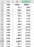
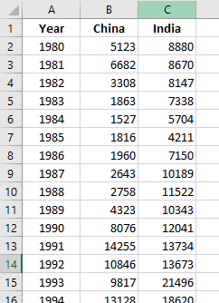
No. of Immigrants to Canada from China and India 1980–2013
Then I plot a line chart using the Excel’s Recommended Charts feature
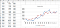
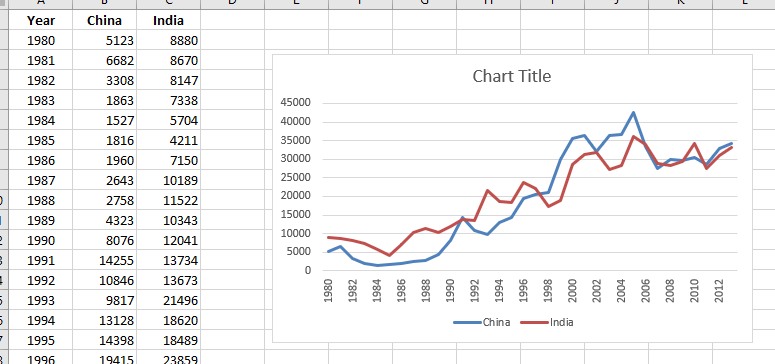
Alright. Nice and Easy.
How about the same data but in a different format?
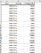
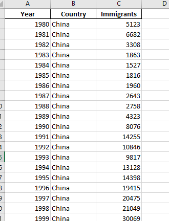
No. of Immigrants to Canada from China and India 1980–2013 (long-form)
Plotting this..

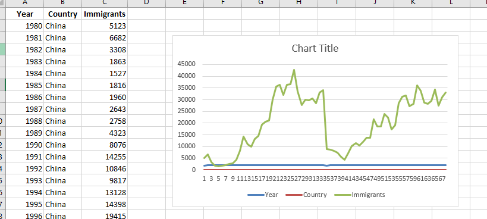
Ok. That’s a mess.
*How about in Pandas? Let’s plot the first dataframe.*
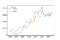
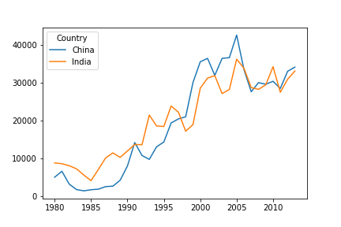
Ok. That works.
How about the second dataframe?
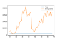

Both the Excel and Pandas showed the same plot for both dataframes.
*It seems Excel and Pandas render plot the same way!* I’m on to something.

# Wide-form vs. Long-form Data

The data we have dealt a while ago are the wide-form and long-form data respectively.

Both are sensible patterns for storing data in a tabular format; briefly, the difference is this:

- wide-form data has one row per *independent variable*, with metadata recorded in the *row and column labels*.
- long-form data has one row per *observation*, with metadata recorded within the table as *values*.

And this was my aha! moment.

*> The wide-form has worked well with line chart because I’m basically plotting an independent variable (year) against its metadata (the Haiti and China series).*

Now, will this line of thinking work? Let’s found out.

# Creating Basic Plots with Pandas

Now, let’s try to create different plots for our wide-form data to test my hypothesis.

**Bar Chart**

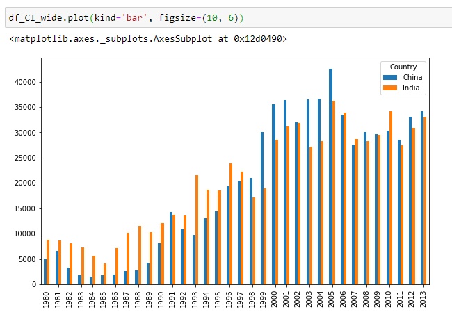
**Area Plot**
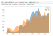
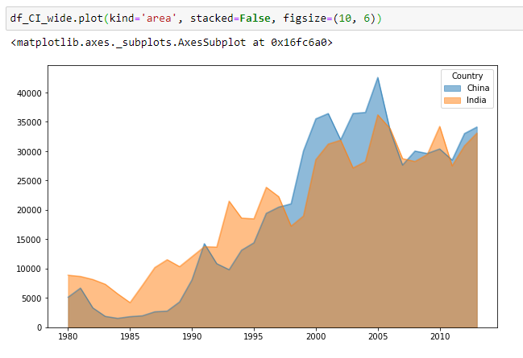
**Box Plots**
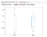
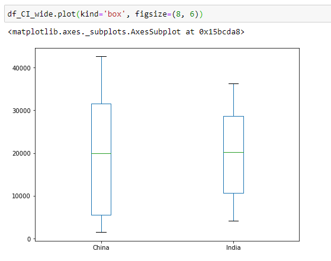
**Histograms**
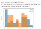

**Scatter Plots**

Eh? What’s going on?
Unfortunately, the scatter plot result in an error.

# My Second Aha Moment

So looking back to the previous plots, it’s now making sense.

*> If you’re plotting multiple Series against an independent variable, then you use the wide-form. Otherwise, use the long-form.*

Let’s test again this hypothesis and see if it holds true. Let’s do a scatter plot.

**Scatter Plot**
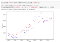
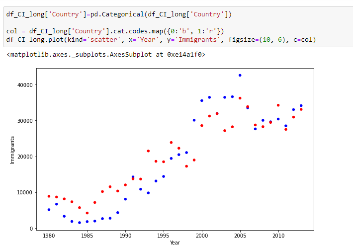
Hooray! That works.

So I’m really not comparing two series in the scatter plot, rather I’m plotting the observation to see their distribution. The colors are optional and I can do the same without it.

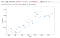
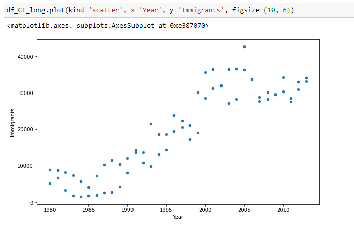

# But There are Other Libraries Out There…

I chose to limit the plotting discussed here to the DataFrame's `plot` method.

When you’re new to Pandas coming From Excel, you want to evaluate quickly if you can reproduce the usual charts that you’re using in Excel to warrant the switch and continuous use of Pandas.

Besides, effective data analysis hinges with fast creation of plots; plot this, manipulate data, plot again, and so on. Hence, you’re going to be bogged down if I try to incorporate different plotting methods here.

> Take this as Pareto principle as applied to visualization — you only need to know 20% of the plotting techniques to get productive.

# Conclusion

In summary, data in wide-form works well when you’re comparing or plotting multiple Series against the same index. Otherwise, it’s better to stick with the long-form.

The workflow here is that you need to get the data first in the right form to get the desired plot which dictates the right format in the first place.

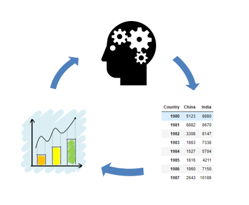

Feedback loop between the data, plot, and you. (Brain gear icon from freesvg.org and plot icon from needpix.com)

Only then you could design or add elements to the plot to make it more appealing.

This is similar to Excel when doing data visualization. You have to get the right data first for Excel to spit out the right chart without the bells and whistles. Then you change chart elements, add title, etc. to more it more effective.

Rather than reading a lot of tutorials on Pandas data visualization, having a mental model of how the data corresponds to the plot makes data visualization more fun. The feedback loop between your mental model and tool makes learning more effective.

That’s it! Happy coding!

***Thank you for reading my article. Follow me on ***[***Twitter***](https://twitter.com/iamkennethcpa)*** and ***[***Linkedin***](https://www.linkedin.com/in/kennethinfante/)***.***