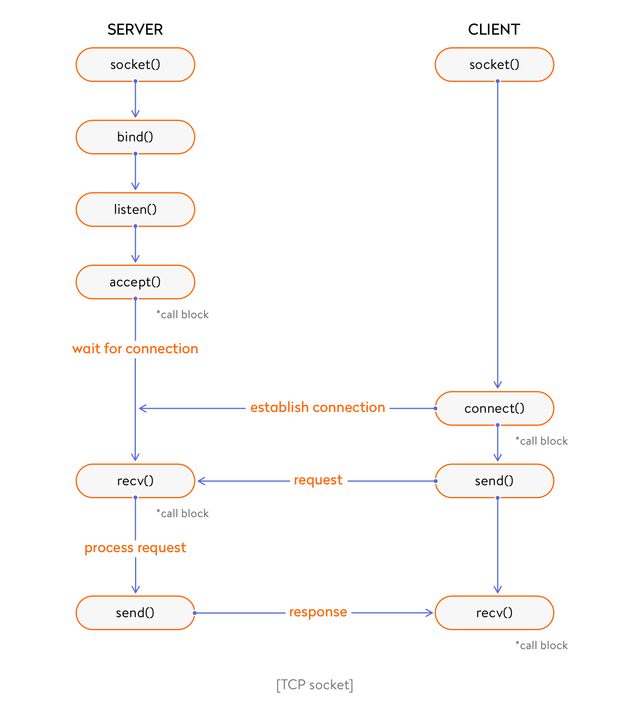
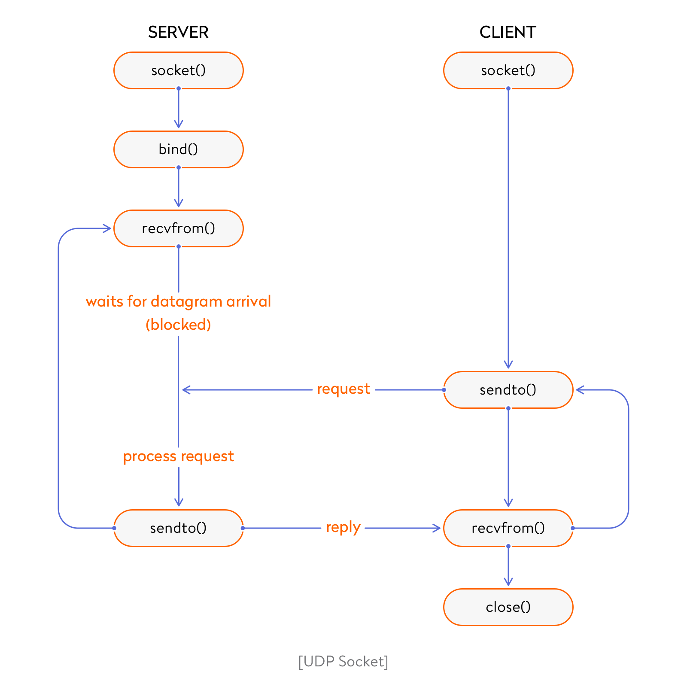
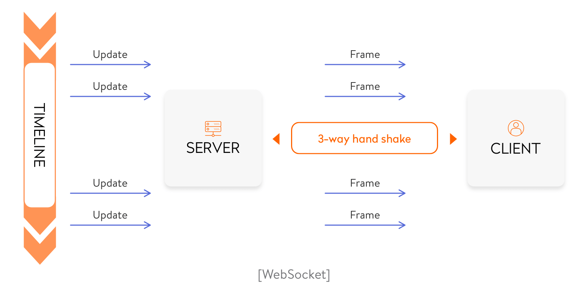
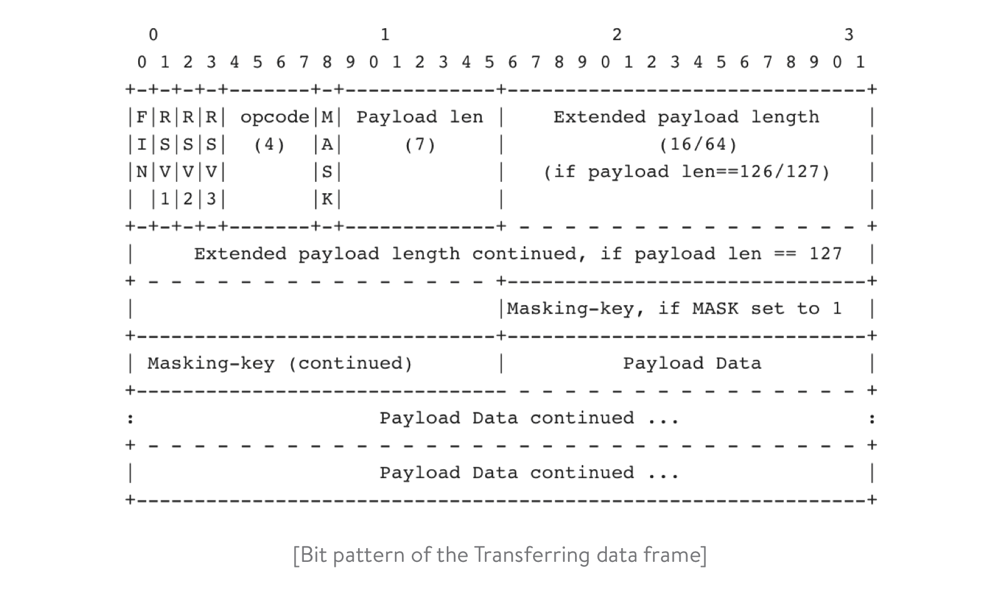
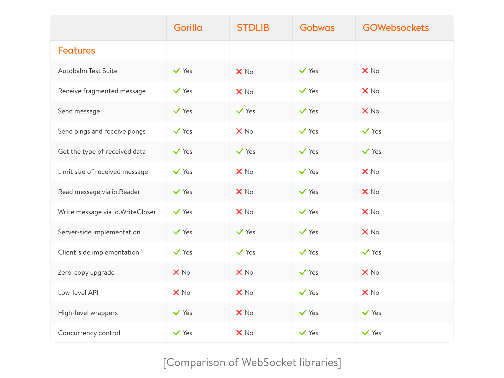
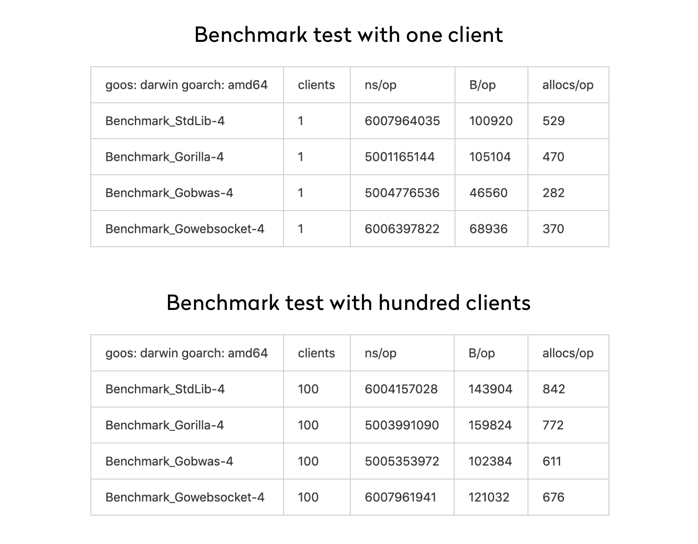

How to Use Websockets in Golang : Best Tools and Step-by-Step Guide

- [Yalantis](https://yalantis.com/)
- ›
- [Blog](https://yalantis.com/blog/)
- ›
- [Tech](https://yalantis.com/blog/category/tech/)

# How to Use Websockets in Golang : Best Tools and Step-by-Step Guide

Aleksandr Ryzhyi
Golang developer

Sending a message and getting an instant response without refreshing the page is something we take for granted. But in the past, enabling real-time functionality was a real challenge for developers. The developer community has come a long way from HTTP long polling and AJAX and has finally found a solution for building truly real-time apps.

This solution comes in the form of WebSockets, which make it possible to open an interactive session between a user’s browser and a server. WebSockets allow a browser to send messages to a server and receive event-driven responses without having to poll the server for a reply.

For now, WebSockets are the number one solution for building real-time applications: online games, instant messengers, tracking apps, and so on. This guide explains how WebSockets operate and shows how we can build WebSocket applications in Go programming language. We also compare the most popular WebSocket libraries so you can choose the best one for your needs.

## Network sockets vs WebSockets

Getting started with WebSockets in go, let’s draw the line between network sockets and WebSockets.

### Network socket

A network socket, or simply a socket, serves as an internal endpoint for exchanging data between applications running on the same computer or on different computers on the same network.

Sockets are a key part of Unix and Windows-based operating systems, and they make it easier for developers to create network-enabled software. Instead of constructing network connections from scratch, app developers can include sockets in their programs. Since network sockets are used for a number of different network protocols (HTTP, FTP, etc.), several sockets can be used simultaneously.

Sockets are created and used with a set of function calls, which are sometimes referred to as a socket’s application programming interface ([API](https://searchmicroservices.techtarget.com/definition/application-program-interface-API)). Thanks to function calls, sockets can be opened just like regular files.

There are several types of network sockets:
-

**Datagram sockets **(SOCK_DGRAM), also known as connectionless sockets, use the User Datagram Protocol (UDP). Datagram sockets support a bidirectional flow of messages and preserve record boundaries.

-

**Stream sockets** (SOCK_STREAM), also known as connection-oriented sockets, use the Transmission Control Protocol (TCP), Stream Control Transmission Protocol (SCTP), or Datagram Congestion Control Protocol (DCCP). These sockets provide a bidirectional, reliable, sequenced, and unduplicated flow of data with no record boundaries.

-

**Raw sockets** (or raw IP sockets) are typically available in routers and other networking equipment. These sockets are normally datagram-oriented, although their exact characteristics depend on the interface provided by the protocol. Raw sockets are not used by most applications. They’re provided to support the development of new communication protocols and to provide access to more esoteric facilities of existing protocols.

**Socket communication **

First, let’s figure out how to ensure that every socket is unique. If they’re not, you can’t establish a reliable communication channel.

Giving every process a unique PID helps to deal with the problem locally. But such an approach doesn’t work over a network. To create a unique socket, we recommend using the TCP/IP protocol. With TCP/IP, the IP addresses of the network layer are unique within a given network, and the protocol and port are unique among host applications.

TCP and UDP are two major protocols for communicating between hosts. Let’s see how your app can connect to TCP and UDP sockets.

-
**Connecting to a TCP socket**

To establish a TCP connection, a Go client uses the DialTCP function in the net package. DialTCP returns a TCPConn object. When a connection is established, the client and server begin exchanging data: the client sends a request to the server through a TCPConn, the server parses the request and sends a response, and the TCPConn receives the response from the server.

This connection remains valid until the client or server closes it. The functions for creating a connection are as follows:

Client side:

	 // init
	   tcpAddr, err := net.ResolveTCPAddr(resolver, serverAddr)
	   if err != nil {
	        // handle error
	   }
	   conn, err := net.DialTCP(network, nil, tcpAddr)
	   if err != nil {
	           // handle error
	   }

	   // send message
	    _, err = conn.Write({message})
	   if err != nil {
	        // handle error
	   }

	   // receive message
	   var buf [{buffSize}]byte
	   _, err := conn.Read(buf[0:])
	   if err != nil {
	        // handle error
	   }

Server side:

	// init
	   tcpAddr, err := net.ResolveTCPAddr(resolver, serverAddr)
	       if err != nil {
	           // handle error
	       }

	       listener, err := net.ListenTCP("tcp", tcpAddr)
	    if err != nil {
	        // handle error
	    }

	    // listen for an incoming connection
	    conn, err := listener.Accept()
	    if err != nil {
	        // handle error
	    }

	    // send message
	    if _, err := conn.Write({message}); err != nil {
	        // handle error
	    }
	    // receive message
	    buf := make([]byte, 512)
	    n, err := conn.Read(buf[0:])
	    if err != nil {
	        // handle error
	    }

-
**Connecting to a UDP socket**

In contrast to a TCP socket, with a UDP socket, the client just sends a datagram to the server. There’s no Accept function, since the server doesn’t need to accept a connection and just waits for datagrams to arrive.

Other TCP functions have UDP counterparts; just replace TCP with UDP in the functions above.

Client side:

	// init
	    raddr, err := net.ResolveUDPAddr("udp", address)
	    if err != nil {
	        // handle error
	    }

	    conn, err := net.DialUDP("udp", nil, raddr)
	    if err != nil {
	        // handle error
	    }
	        .......
	    // send message
	    buffer := make([]byte, maxBufferSize)
	    n, addr, err := conn.ReadFrom(buffer)
	    if err != nil {
	        // handle error
	    }
	         .......
	    // receive message
	    buffer := make([]byte, maxBufferSize)
	    n, err = conn.WriteTo(buffer[:n], addr)
	    if err != nil {
	        // handle error
	    }

Server side:

	    // init
	    udpAddr, err := net.ResolveUDPAddr(resolver, serverAddr)
	    if err != nil {
	        // handle error
	    }

	    conn, err := net.ListenUDP("udp", udpAddr)
	    if err != nil {
	        // handle error
	    }
	        .......
	    // send message
	    buffer := make([]byte, maxBufferSize)
	    n, addr, err := conn.ReadFromUDP(buffer)
	    if err != nil {
	        // handle error
	    }
	         .......
	    // receive message
	    buffer := make([]byte, maxBufferSize)
	    n, err = conn.WriteToUDP(buffer[:n], addr)
	    if err != nil {
	        // handle error
	    }

### What WebSockets are

The WebSocket communication protocol provides a full-duplex communication channel over a single TCP connection. In contrast to HTTPs, WebSockets don’t require you to send a request in order to get a  response. They allow for bidirectional data flows, so you can just wait for the server to respond. It will send you a message when it’s available.

WebSockets are a good solution for services that require continuous data exchange – for instance, instant messengers, online games, and real-time trading systems. You can find complete information about the WebSocket protocol in the[RFC 6455 specification](https://tools.ietf.org/html/rfc6455).

WebSocket connections are requested by browsers and are responded to by servers, after which a connection is established. This process is often called a [handshake](https://en.wikipedia.org/wiki/Handshaking). The special kind of header in WebSockets requires only one handshake between a browser and server for establishing a connection that will remain active throughout its lifetime.

WebSockets solve many of the headaches of real-time web development and have several benefits over traditional HTTP:

-
The lightweight header reduces data transmission overhead.
-
Only one TCP connection is required for a single web client.
-
WebSocket servers can push data to web clients.

The WebSocket protocol is relatively simple to implement. It uses the HTTP protocol for the initial handshake. After a successful handshake, a connection is established and the WebSocket essentially uses raw TCP to read/write data.

This is what a client request looks like:

	  GET /chat HTTP/1.1
	    Host: server.example.com
	    Upgrade: websocket
	    Connection: Upgrade
	    Sec-WebSocket-Key: x3JJHMbDL1EzLkh9GBhXDw==
	    Sec-WebSocket-Protocol: chat, superchat
	    Sec-WebSocket-Version: 13
	    Origin: http://example.com

And here’s the server response:

	    HTTP/1.1 101 Switching Protocols
	    Upgrade: websocket
	    Connection: Upgrade
	    Sec-WebSocket-Accept: HSmrc0sMlYUkAGmm5OPpG2HaGWk=
	    Sec-WebSocket-Protocol: chat

## How to create WebSocket app in Go

To write a simple WebSocket echo server based on the `net/http `library, you need to:

1. 1)
Initiate a handshake
2. 2)
Receive data frames from the client
3. 3)
Send data frames to the client
4. 4)
Close the handshake
First, let’s create an HTTP handler with a WebSocket endpoint:

	// HTTP server with WebSocket endpoint
	        func Server() {
	        http.HandleFunc("/", func(w http.ResponseWriter, r *http.Request) {
	            ws, err := NewHandler(w, r)
	            if err != nil {
	                 // handle error
	            }
	            if err = ws.Handshake(); err != nil {
	                // handle error
	            }
	        …

Then initialize the WebSocket structure.

The initial handshake request always comes from the client. Once the server has defined a WebSocket request, it needs to reply with a handshake response.

Bear in mind that you can’t write the response using the http.ResponseWriter, since it will close the underlying TCP connection once you start sending the response.

So you need to use HTTP Hijacking. Hijacking allows you to take over the underlying TCP connection handler and bufio.Writer. This gives you the possibility to read and write data without closing the TCP connection.

	// NewHandler initializes a new handler
	        func NewHandler(w http.ResponseWriter, req *http.Request) (*WS, error) {
	        hj, ok := w.(http.Hijacker)
	        if !ok {
	            // handle error
	        }                  .....
	}

To complete the handshake, the server must respond with the appropriate headers.

	// Handshake creates a handshake header
	    func (ws *WS) Handshake() error {

	        hash := func(key string) string {
	            h := sha1.New()
	            h.Write([]byte(key))
	            h.Write([]byte("258EAFA5-E914-47DA-95CA-C5AB0DC85B11"))

	        return base64.StdEncoding.EncodeToString(h.Sum(nil))
	        }(ws.header.Get("Sec-WebSocket-Key"))
	      .....
	}

`“Sec-WebSocket-key”` is generated randomly and is [Base64](https://en.wikipedia.org/wiki/Base64)-encoded. The server needs to append this key to a fixed string after accepting a request. Assume your have the `x3JJHMbDL1EzLkh9GBhXDw== `key. In this case, you can use SHA-1 to compute the binary value and use Base64 to encode it. You’ll get `HSmrc0sMlYUkAGmm5OPpG2HaGWk=`. Use this as the value of the `Sec-WebSocket-Accept `response header.

### Transferring the data frame

When the handshake has been successfully completed, your app can read and write data from and to the client. The[WebSocket specification](https://tools.ietf.org/html/rfc6455#section-5.2) defines a specific frame format that’s used between a client and server. Here is a bit pattern of the frame:

Use the following code to decode the client payload:

	// Recv receives data and returns a Frame
	    func (ws *WS) Recv() (frame Frame, _ error) {
	        frame = Frame{}
	        head, err := ws.read(2)
	        if err != nil {
	            // handle error
	        }

In turn, these lines of code allow for encoding data:

	// Send sends a Frame
	    func (ws *WS) Send(fr Frame) error {
	        // make a slice of bytes of length 2
	        data := make([]byte, 2)

	        // Save fragmentation & opcode information in the first byte
	        data[0] = 0x80 | fr.Opcode
	        if fr.IsFragment {
	            data[0] &= 0x7F
	        }
	        .....

### Closing a handshake

A handshake is closed when one of the parties sends a close frame with a close status as the payload. Optionally, the party sending the close frame can send a close reason in the payload. If closing is initiated by the client, the server should send a corresponding close frame in response.

	// Close sends a close frame and closes the TCP connection
	func (ws *Ws) Close() error {
	    f := Frame{}
	    f.Opcode = 8
	    f.Length = 2
	    f.Payload = make([]byte, 2)
	    binary.BigEndian.PutUint16(f.Payload, ws.status)
	    if err := ws.Send(f); err != nil {
	        return err
	    }
	    return ws.conn.Close()
	}

## List of WebSocket libraries

There are several third-party libraries that ease developers’ lives and greatly facilitate working with WebSockets.

-
**STDLIB ( x/net/websocket )**

This WebSocket library is part of the standard library. It implements a client and server for the WebSocket protocol, as described in the RFC 6455 specification. It doesn’t need to be installed and has good[official documentation](https://godoc.org/golang.org/x/net/websocket). But on the other hand, it still lacks some features that can be found in other WebSocket libraries. Golang WebSocket implementations in the /x/net/websocket package do not allow users to reuse I/O buffers between connections in a clear way.

Let’s check how the STDLIB package works. Here’s an example of code for performing basic functions like creating a connection and sending and receiving messages.

First of all, to install and use this library, you should add this line of code to your:

`import "golang.org/x/net/websocket"`
Client side:

	    // create connection
	    // schema can be ws:// or wss://
	    // host, port – WebSocket server
	    conn, err := websocket.Dial("{schema}://{host}:{port}", "", op.Origin)
	    if err != nil {
	        // handle error
	    }
	    defer conn.Close()
	             .......
	      // send message
	        if err = websocket.JSON.Send(conn, {message}); err != nil {
	         // handle error
	    }
	              .......
	        // receive message
	    // messageType initializes some type of message
	    message := messageType{}
	    if err := websocket.JSON.Receive(conn, &message); err != nil {
	          // handle error
	    }
	        .......

Server side:

	    // Initialize WebSocket handler + server
	    mux := http.NewServeMux()
	        mux.Handle("/", websocket.Handler(func(conn *websocket.Conn) {
	            func() {
	                for {

	                    // do something, receive, send, etc.
	                }
	            }
	            .......
	        // receive message
	    // messageType initializes some type of message
	    message := messageType{}
	    if err := websocket.JSON.Receive(conn, &message); err != nil {
	        // handle error
	    }
	        .......
	    // send message
	    if err := websocket.JSON.Send(conn, message); err != nil {
	        // handle error
	    }
	        ........

-
**GORILLA**

The WebSocket package in the [Gorilla web toolkit](https://www.gorillatoolkit.org/pkg/websocket) boasts a complete and tested implementation of the WebSocket protocol as well as a stable package API. The WebSocket package is well-documented and easy to use. You can find documentation on the official Gorilla website.

Installation

	go get github.com/gorilla/websocket
	Examples of code
	Client side:
	 // init
	    // schema – can be ws:// or wss://
	    // host, port – WebSocket server
	    u := url.URL{
	        Scheme: {schema},
	        Host:   {host}:{port},
	        Path:   "/",
	    }
	    c, _, err := websocket.DefaultDialer.Dial(u.String(), nil)
	    if err != nil {
	        // handle error
	    }
	        .......
	    // send message
	    err := c.WriteMessage(websocket.TextMessage, {message})
	    if err != nil {
	        // handle error
	    }
	        .......
	    // receive message
	    _, message, err := c.ReadMessage()
	    if err != nil {
	        // handle error
	    }
	        .......

Server side:

	  // init
	    u := websocket.Upgrader{}
	    c, err := u.Upgrade(w, r, nil)
	    if err != nil {
	        // handle error
	    }
	        .......
	    // receive message
	    messageType, message, err := c.ReadMessage()
	    if err != nil {
	        // handle error
	    }
	        .......
	    // send message
	    err = c.WriteMessage(messageType, {message})
	    if err != nil {
	        // handle error
	    }
	        .......

-
**GOBWAS**

This tiny WebSocket packahe has a powerful list of features, such as a zero-copy upgrade and a low-level API that allows for building custom packet handling logic. GOBWAS requires no intermediate allocations during I/O. It also boasts high-level wrappers and helpers around the API in the wsutil package, allowing developers to start fast without digging into the internals of the protocol. This library has a flexible API, but that comes at the cost of usability and clarity.

Documentation is available on the [GoDoc website](https://godoc.org/github.com/gobwas/ws). You can install it by including the following line of code:

`go get github.com/gobwas/ws`
Client side:

	    // init
	    // schema – can be ws or wss
	    // host, port – ws server
	    conn, _, _, err := ws.DefaultDialer.Dial(ctx, {schema}://{host}:{port})
	    if err != nil {
	        // handle error
	    }
	        .......
	    // send message
	    err = wsutil.WriteClientMessage(conn, ws.OpText, {message})
	    if err != nil {
	        // handle error
	    }

	        .......
	    // receive message
	    msg, _, err := wsutil.ReadServerData(conn)
	    if err != nil {
	        // handle error
	    }
	        .......

Server side:

	   // init
	    listener, err := net.Listen("tcp", op.Port)
	    if err != nil {
	        // handle error
	    }
	    conn, err := listener.Accept()
	    if err != nil {
	        // handle error
	    }
	    upgrader := ws.Upgrader{}
	    if _, err = upgrader.Upgrade(conn); err != nil {
	        // handle error
	    }
	        .......
	    // receive message
	    for {
	         reader := wsutil.NewReader(conn, ws.StateServerSide)
	         _, err := reader.NextFrame()
	         if err != nil {
	             // handle error
	         }
	         data, err := ioutil.ReadAll(reader)
	         if err != nil {
	             // handle error
	         }
	            .......
	    }
	        .......
	    // send message
	    msg := "new server message"
	    if err := wsutil.WriteServerText(conn, {message}); err != nil {
	        // handle error
	    }
	        .......

-
**GOWebsockets**

This tool offers a wide range of easy-to-use features. It allows for concurrency control, data compression, and setting request headers. GoWebsockets supports proxies and subprotocols for emitting and receiving text and binary data. Developers can also enable or disable SSL verification.

You can find documentation for and examples of how to use GOWebsockets on the[GoDoc website](https://godoc.org/github.com/sacOO7/GoWebsocket) and on the project’s [GitHub page](https://github.com/sacOO7/gowebsocket/). Install the package by adding the following line of code:

`go get github.com/sacOO7/gowebsocket`
Client side:

	    // init
	    // schema – can be ws or wss
	    // host, port – ws server
	    socket := gowebsocket.New({schema}://{host}:{port})
	    socket.Connect()
	        .......
	    // send message
	    socket.SendText({message})
	    or
	    socket.SendBinary({message})
	        .......
	    // receive message
	    socket.OnTextMessage = func(message string, socket gowebsocket.Socket) {
	        // hande received message
	    };
	    or
	    socket.OnBinaryMessage = func(data [] byte, socket gowebsocket.Socket) {
	        // hande received message
	    };
	        .......

Server side:

	    // init
	    // schema – can be ws or wss
	    // host, port – ws server
	    conn, _, _, err := ws.DefaultDialer.Dial(ctx, {schema}://{host}:{port})
	    if err != nil {
	        // handle error
	    }
	        .......
	    // send message
	    err = wsutil.WriteClientMessage(conn, ws.OpText, {message})
	    if err != nil {
	        // handle error
	    }
	        .......
	    // receive message
	    msg, _, err := wsutil.ReadServerData(conn)
	    if err != nil {
	        // handle error
	    }

### Comparing existing solutions

We’ve described four of the most widely used WebSocket libraries for Golang. The table below contains a detailed comparison of these tools.

To better analyze their performance, we also conducted a couple of benchmarks. The results are the following:

-

As you can see, GOBWAS has a significant advantage over others libraries. It has fewer allocations per operation and uses less memory and time per allocation. Plus, it has zero I/O allocation. Besides, GOBWAS has all the methods you need to create WebSocket client–server interactions and receive message fragments. You can also use it to easily work with TCP sockets.

-

If you really don’t like GOBWAS, you can use Gorilla. It’s quite simple and has almost all the same features. You can also use STDLIB, but it’s not as good in production because it lacks many necessary features and, as you can see in the benchmarks, offers weaker performance. GOWebsocket is about the same as STDLIB. But if you need to quickly build a prototype or MVP, it can be a reasonable choice.

Besides these tools, there are also several alternative implementations that allow you to build powerful steaming solutions. Among them there are:

-
[go-socket.io](https://github.com/googollee/go-socket.io)
-
[Apache Thrift  ](https://thrift.apache.org/tutorial/go)
-
[gRPC](https://grpc.io/)
-
[Package rpc](https://golang.org/pkg/net/rpc/)

The constant development of streaming technologies and the availability of well-documented tools such as WebSockets make it easy for developers to create truly real-time applications. [Write us](https://yalantis.com/contacts/) if you need advice on or help with creating a real-time app using WebSockets. We hope, this tutorial helped you a lot.

4.6/ 5.0
Article rating
74
Reviews

Remember those Facebook reactions? Well, we aren't Facebook but we love reactions too. They can give us valuable insights on how to improve what we're doing. Would you tell us how you feel about this article?

[Get stories to your email every Thursday!](https://yalantis.com/blog/how-to-build-websockets-in-go/#)

[##### Insights  #### Why Use the Go Language for Your Project? →](https://yalantis.com/blog/why-use-go/)

[##### Tech  #### Node.js vs Go: Which Is Better for Backend Web Development? →](https://yalantis.com/blog/golang-vs-nodejs-comparison/)

[##### Tech  #### What Are Real-Time Features and Why Does Your App Need Them? →](https://yalantis.com/blog/real-time-features/)

##### Discover what we use to create robust applications

[Check our technology index](https://yalantis.com/technologies/)