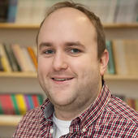
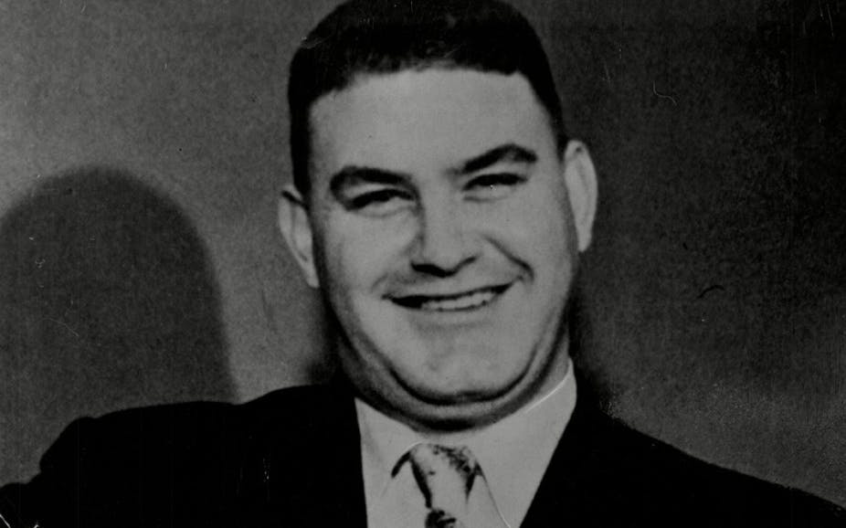
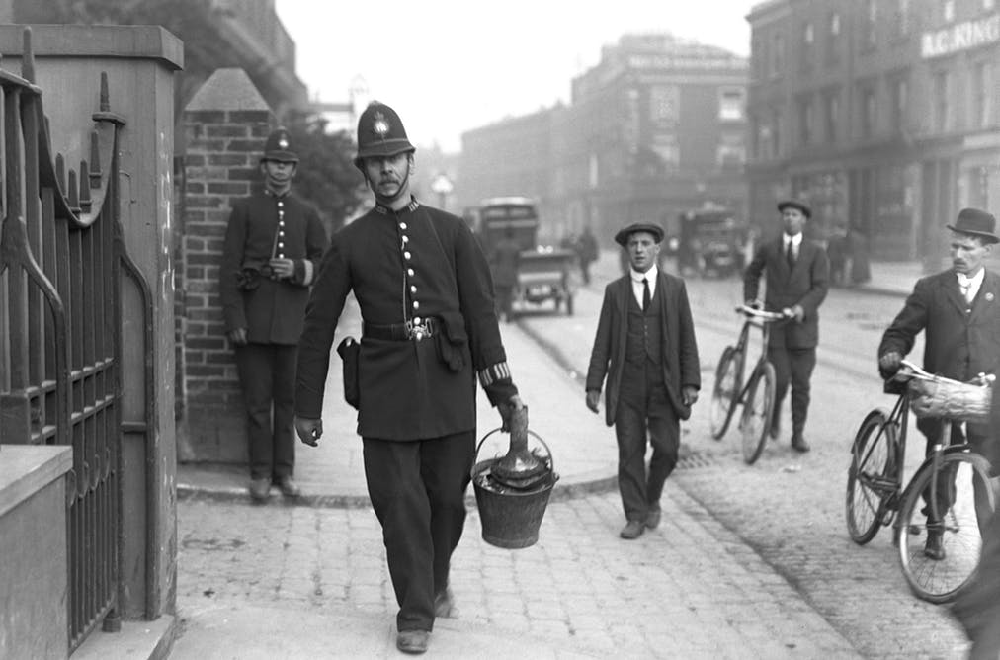
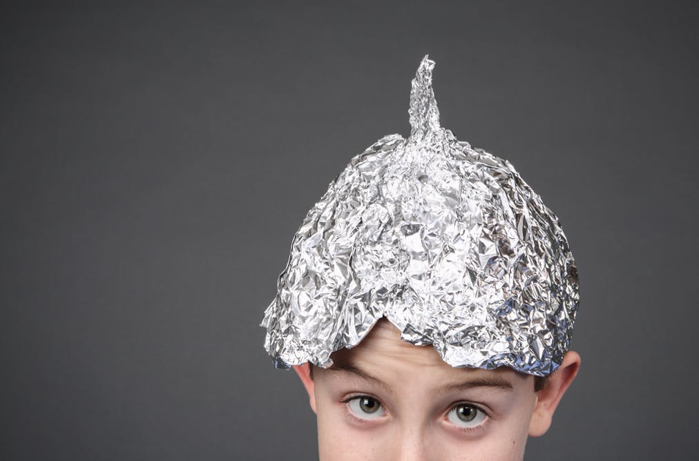
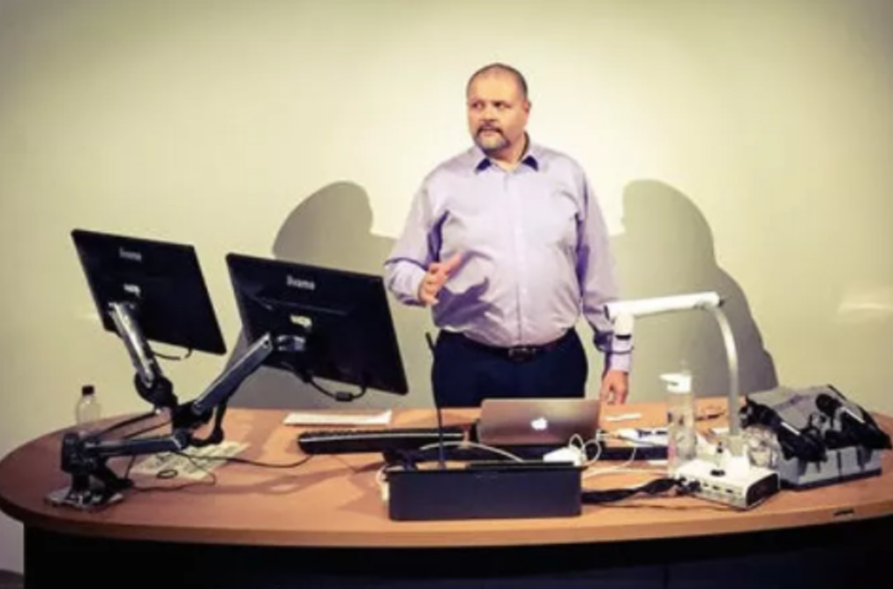

How to become a great impostor

#   ** How to become a great impostor **

 August 22, 2019 10.53am BST

 .

### Author

1.   [   Tim Holmes](http://theconversation.com/profiles/tim-holmes-503427)

Lecturer in Criminology & Criminal Justice, Bangor University

### Disclosure statement

Tim Holmes does not work for, consult, own shares in or receive funding from any company or organisation that would benefit from this article, and has disclosed no relevant affiliations beyond their academic appointment.

### Partners

 

[Bangor University](http://theconversation.com/institutions/bangor-university-1221) provides funding as a member of The Conversation UK.

The Conversation UK receives funding from these organisations
[**View the full list**](http://theconversation.com/uk/partners)

 [Republish this article](http://theconversation.com/how-to-become-a-great-impostor-98798#republish)

  Republish our articles for free, online or in print, under Creative Commons licence.

 
Ferdinand Waldo Demara.
.

- [**  Email](http://theconversation.com/how-to-become-a-great-impostor-98798mailto:?subject=How%20to%20become%20a%20great%20impostor%20%E2%80%94%20The%20Conversation&body=Hi.%20I%20found%20an%20article%20that%20you%20might%20like%3A%20%22How%20to%20become%20a%20great%20impostor%22%20%E2%80%94%20http%3A%2F%2Ftheconversation.com%2Fhow-to-become-a-great-impostor-98798)

- [**  Twitter57](http://twitter.com/intent/tweet?text=How+to+become+a+great+impostor&url=http%3A%2F%2Ftheconversation.com%2Fhow-to-become-a-great-impostor-98798%3Futm_source%3Dtwitter%26utm_medium%3Dtwitterbutton&utm_campaign=none&via=ConversationUK)

- [**  Facebook93](http://www.facebook.com/sharer.php?u=http%3A%2F%2Ftheconversation.com%2Fhow-to-become-a-great-impostor-98798%3Futm_source%3Dfacebook%26utm_medium%3Dfacebookbutton)

- [**  LinkedIn](http://www.linkedin.com/shareArticle?mini=true&source=The+Conversation&summary=Unlike+%5Bother+icons+who+have+appeared+on+the+front%5D%28http%3A%2F%2Ftime.com%2F3878450%2Flife-magazine-10-iconic-covers-from-the-famed-weekly%2F%29+of+Life+magazine%2C+Ferdinand+Waldo+Demara+was+not+famed+as+an+astro...&title=How+to+become+a+great+impostor&url=http%3A%2F%2Ftheconversation.com%2Fhow-to-become-a-great-impostor-98798%3Futm_source%3Dlinkedin%26utm_medium%3Dlinkedinbutton)

- [** Print](http://theconversation.com/how-to-become-a-great-impostor-98798#)

Unlike [other icons who have appeared on the front](http://time.com/3878450/life-magazine-10-iconic-covers-from-the-famed-weekly/) of Life magazine, Ferdinand Waldo Demara was not famed as an astronaut, actor, hero or politician. In fact, his 23-year career was rather varied. He was, [among other things](https://www.nytimes.com/1982/06/09/obituaries/ferdinand-waldo-demara-60-an-impostor-in-varied-fields.html), a doctor, professor, prison warden and monk. Demara was not some kind of genius either – he actually left school without any qualifications. Rather, he was “The Great Impostor”, a charming rogue who tricked his way to notoriety.

My research speciality is crimes by deception and Demara is a man who I find particularly interesting. For, unlike other notorious con-artists, imposters and fraudsters, he did not steal and defraud for the money alone. Demara’s goal was to attain prestige and status. As [his biographer Robert Crichton noted](https://archive.org/details/greatimpostor010210mbp/page/n7) in 1959, “Since his aim was to do good, anything he did to do it was justified. With Demara the end always justifies the means.”

Though we know what he did, and his motivations, there is still one big question that has been left unanswered – why did people believe him? While we don’t have accounts from everyone who encountered Demara, my investigation into his techniques has uncovered some of the secrets of how he managed to keep his high level cons going for so long.

* * *

 *  ** Read more: [Why do we fall for scams?](http://theconversation.com/why-do-we-fall-for-scams-55543)  **  *

* * *

Upon leaving education in 1935, Demara lacked the skills to succeed in the organisations he was drawn to. He wanted the status that came with being a priest, an academic or a military officer, but didn’t have the patience to achieve the necessary qualifications. And so his life of deception started. At just 16-years-old, with a desire to become a member of a silent order of Trappist monks, Demara ran away from his home in Lawrence, Massachusetts, lying about his age to gain entry.

When he was found by his parents he was allowed to stay, as they believed he would eventually give up. Demara remained with the monks long enough to gain his hood and habit, but was ultimately forced out of the monastery at the age of 18 as his fellow monks felt he lacked the right temperament.

Demara then attempted to join other orders, including the Brothers of Charity children’s home in West Newbury, Massachusetts, but again failed to follow the rules. In response, he stole funds and a car from the home, and joined the army in 1941, at the age of 19. But, as it turned out, the army was not for him either. He disliked military life so much that he stole a friend’s identity and fled, eventually deciding to join the navy instead.

## From monk to medicine

While in the navy, Demara was accepted for medical training. He passed the basic course but due to his lack of education was not allowed to advance. So, in order to get into the medical school, Demara created his first set of fake documents indicating he already had the needed college qualifications. He was so pleased with his creations that he decided to skip applying to medical school and tried to gain a commission as an officer instead. When his falsified papers were discovered, Demara faked his own death and went on the run again.

* * *

 *  ** Read more: [The men who impersonate military personnel for stolen glory](http://theconversation.com/the-men-who-impersonate-military-personnel-for-stolen-glory-62233)  **  *

* * *

In 1942, Demara took the identity of Dr Robert Linton French, a former navy officer and psychologist. Demara found French’s details in an old college prospectus which had profiled French when he worked there. Though he worked as a college teacher using French’s name till the end of the war in 1945, Demara was eventually caught and the authorities decided to prosecute him for desertion.

However, due to good behaviour, he only served 18 months of the six-year sentence handed to him, but upon his release he went back to his old ways. This time Demara created a new identity, Cecil Hamann, and enrolled at Northeastern University. Tiring of the effort and time needed to complete his law degree, Demara awarded himself a PhD and, under the persona of “Dr” Cecil Hamann, took up another teaching post at a Christian college, The Brother of Instruction, in Maine in the summer of 1950.

It was here that Demara met and befriended Canadian doctor Joseph Cyr, who was moving to the US to set up a medical practice. Needing help with the immigration paperwork, Cyr gave all his identifying documents to Demara, who offered to fill in the application for him. After the two men parted ways, Demara took copies of Cyr’s paperwork and moved up to Canada. Pretending to be Dr Cyr, Demara approached the Canadian Navy with an ultimatum: make me an officer or I will join the army. Not wanting to lose a trained doctor, Demara’s application was fast tracked.

As a commissioned officer during the Korean war, Demara first served at Stadacona naval base, where he convinced other doctors to contribute to a medical booklet he claimed to be producing for lumberjacks living in remote parts of Canada. With this booklet and the knowledge gained from his time in the US Navy, Demara was able to pass successfully as Dr Cyr.

## A military marvel

 

 Demara worked aboard HMCS Cayuga as ship’s doctor (pictured in 1954).
 .

In 1951, Demara was transferred to be ship’s doctor on the destroyer HMCS Cayuga. Stationed off the coast of Korea, Demara relied on his sick berth attendant, petty officer Bob Horchin, to handle all minor injuries and complaints. Horchin was pleased to have a superior officer who did not interfere in his work and who empowered him to take on more responsibilities.

Though he very successfully passed as a doctor aboard the Cayuga, Demara’s time there came to a dramatic end after three Korean refugees were brought on in need of medical attention. Relying on textbooks and Horchin, Demara successfully treated all three – even completing the amputation of one man’s leg. Recommended for a commendation for his actions, the story was reported in the press where the real Dr Cyr’s mother [saw a picture of Demara impersonating her son](https://navalandmilitarymuseum.org/archives/articles/characters/ferdinand-waldo-demara). Wanting to avoid further public scrutiny and scandal, the Canadian government elected to simply deport Demara back to the US in November 1951.

After returning to America, there were news reports on his actions, and Demara sold his story to Life magazine in 1952. In his biography, Demara notes that he spent the time after his return to the US using his own name and working in different short-term jobs. While he enjoyed the prestige he had gained in his impostor roles, he started to dislike life as Demara, “the great impostor”, gaining weight and developing a drinking problem.

In 1955, Demara somehow acquired the credentials of a Ben W. Jones and disappeared again. As Jones, Demara began working as a guard at Huntsville Prison in Texas, and was eventually put in charge of the maximum security wing that housed the most dangerous prisoners. In 1956, an educational programme that provided prisoners with magazines to read led to Demara’s discovery once more. One of the prisoners found the Life magazine article and showed the cover picture of Demara to prison officals. Despite categorically denying to the prison warden that he was Demara, and pointing to positive feedback he had received from prison officials and inmates about his performance there, Demara chose to run. In 1957, he was caught in North Haven, Maine and served a six-month prison sentence for his actions.

After his release he made several television appearances including on the game show [You Bet Your Life](https://www.youtube.com/watch?v=33Rz5yYCeks&t=8s), and made a cameo in horror film [The Hypnotic Eye](https://en.wikipedia.org/wiki/The_Hypnotic_Eye). From this point until his death in 1981, Demara would struggle to escape his past notoriety. He eventually returned to the church, getting ordained using his own name and worked as a counsellor at a hospital in California.

 .

## How Demara did it

According to biographer Crichton, Demara had an impressive memory, and through his impersonations accumulated a wealth of knowledge on different topics. This, coupled with charisma and good instincts, about human nature helped him trick all those around him. Studies of [professional criminals](https://www.penguin.co.uk/books/1034375/the-big-con/) often observe that con artists are skilled actors and that a con game is essentially an elaborate performance where only the victim is unaware of what is really going on.

Demara also capitalised on workplace habits and social conventions. He is a prime example of why recruiters shouldn’t rely on paper qualifications over demonstrations of skill. And his habit of allowing subordinates to do things he should be doing meant Demara’s ability went untested, while at the same time engendering appreciation from junior staff.

He observed of his time in academia that there was always opportunity to gain authority and power in an organisation. There were ways to set himself as an authority figure without challenging or threatening others by “expanding into the power vacuum”. He would set up his own committees, for example, rather than joining established groups of academics. Demara says in the biography that starting fresh committees and initiatives often gave him the cover he needed to avoid conflict [and scrutiny](https://archive.org/details/greatimpostor010210mbp/page/n7).

**

> …there’s no competition, no past standards to measure you by. How can anyone tell you aren’t running a top outfit? And then there’s no past laws or rules or precedents to hold you down or limit you. Make your own rules and interpretations. Nothing like it. Remember it, expand into the power vacuum.

**

Working from a position of authority as the head of his own committees further entrenched Demara in professions he was not qualified for. It can be argued that Demara’s most impressive attempt at expansion into the “power vacuum” occurred when teaching as Dr Hamann.

Hamann was considered a prestigious appointee for a small Christian college. Claiming to be a cancer researcher, Demara proposed converting the college into a state-approved university where he would be chancellor. The plans proceeded but Demara was not given a prominent role in the new institution. It was then that Demara decided to take Cyr’s identity and leave for Canada. If Demara had succeeded in becoming chancellor of the new LaMennais College (which would go onto become [Walsh University](https://www.walsh.edu/)) it is conceivable that he would have been able to avoid scrutiny or questioning thanks to his position of authority.

## Inherently trustworthy

Other notable serial impostors and fakes have relied on techniques similar to Demara’s. [Frank Abagnale](https://www.businessinsider.com/frank-abagnale-crimes-2012-4?r=US&IR=T#he-faked-it-as-a-doctor-by-joking-whenever-he-didnt-know-the-answer-6) also recognised the reliance people in large organisations placed on paperwork and looking the part. This insight allowed him at 16 to pass as a 25-year-old airline pilot for Pan Am Airways as portrayed in the film, [Catch Me If You Can](https://www.imdb.com/title/tt0264464/).

More recently, [Gene Morrison](https://www.thetimes.co.uk/article/how-to-fake-a-living-qsd5zcvmdbp) was jailed after it was discovered that he had spent 26 years running a fake forensic science business in the UK. After buying a PhD online, Morrison set up Criminal and Forensic Investigations Bureau (CFIB) and gave expert evidence in over 700 criminal and civil cases from 1977 to 2005. Just like Demara used others to do his work, Morrison subcontracted other forensic experts and then presented the findings in court [as his own](http://news.bbc.co.uk/1/hi/england/manchester/6383307.stm).

* * *

 *  ** Read more: [How to get away with fraud: the successful techniques of scamming](http://theconversation.com/how-to-get-away-with-fraud-the-successful-techniques-of-scamming-99523)  **  *

* * *

Marketing and psychology expert Robert Cialdini’s work on the techniques of persuasion in business might offer insight into how people like Demara can succeed, and why it is that others believe them. Cialdini found that there are [six universal principles of influence](https://www.bakadesuyo.com/2013/06/robert-cialdini-influence/) that are used to persuade business professionals: reciprocity, consistency, social proof, getting people to like you, authority and scarcity.

Demara used all of these skills at various points in his impersonations. He would give power to subordinates to hide his lack of knowledge and enable his impersonations (reciprocity). By using other people’s credentials, he was able to manipulate organisations into accepting him, using their own regulations against them (consistency and social proof). Demara’s success in his impersonations points to how likeable he was and how much of an authority he appeared to be. By impersonating academics and professionals, Demara focused on career paths where at the time there was high demand and a degree of scarcity, too.

Laid bare, one can see how Demara tricked his unsuspecting colleagues into believing his lies through manipulation. Yet within this it is interesting to also consider how often we all rely on gut instinct and the appearance of ability rather than witnessed proof. Our gut instinct is built on five questions we ask ourselves when presented with information: does a fact come from a credible source? Do others believe it? Is there plenty of evidence to support it? Is it compatible with what I believe? Does it tell a good story?

Researchers of social trust and solidarity argue that people also have a [fundamental need to trust](https://www.researchgate.net/publication/295478583_Making_The_Truth_Stick_and_The_Myths_Fade_Lessons_from_Cognitive_Psychology) strangers to tell the truth in order for society to function. As sociologist [Niklas Luhmann](https://pdfs.semanticscholar.org/a5ae/78f779284090b9cadb9c5b05501c223f9c23.pdf) said, “[A complete absence of trust would prevent (one) even getting up in the morning](https://www.history.ac.uk/reviews/review/287a).” Trust in people is in a sense a default setting, so to mistrust requires a loss of confidence in someone which must be sparked by some indicator of a lie.

It was only after the prisoner showed the Life article to the Huntsville Prison warden, that they began to ask questions. Until this point, Demara had offered everything his colleagues would need to believe he was a capable member of staff. People accepted Demara’s claims because it felt right to believe him. He had built a rapport and influenced people’s views of who he was and what he could do.

* * *

 *  ** Read more: [Five psychological reasons why people fall for scams – and how to avoid them](http://theconversation.com/five-psychological-reasons-why-people-fall-for-scams-and-how-to-avoid-them-102421)  **  *

* * *

Another factor to consider when asking why people would believe Demara was the rising dependency on paper proofs of identity at that time. Following World War II, improvements in and a shift towards reliance on paper documentation occurred as social and economic mobility changed in America. Underlying Demara’s impersonations and the actions of many modern con artists is the reliance we have long placed in first paper proofs of identity such as birth certificates, ID cards and, more recently, digital forms of identification.

As his preoccupation was more with prestige than money, it can be argued that Demara had a harder time than other impostors who were only driven by profit. Demara stood out as a surgeon and a prison guard, he was a good fake and influencer, but the added attention that came from his attempts at multiple important professions and media attention led to his downfall. Abagnale similarly had issues with the attention that came with pretending to be an airline pilot, lawyer and surgeon. In contrast, Morrison stuck to his one impersonation for years, avoiding detection and making money until the quality of his work was investigated.

The trick, it appears, to being a good impostor is essentially to be friendly, have access to a history of being trusted by others, have the right paperwork, build others’ confidence in you and understand the social environment you are entering. Although, when Demara was asked to explain why he committed his crimes he simply said, “Rascality, pure rascality”.

 **

- [Fraud](http://theconversation.com/topics/fraud-1782)

- [Deception](http://theconversation.com/topics/deception-1814)

- [Canada](http://theconversation.com/topics/canada-2257)

- [In depth](http://theconversation.com/topics/in-depth-38616)

- [fraudsters](http://theconversation.com/topics/fraudsters-52124)

 .

- [**  Tweet](http://twitter.com/intent/tweet?text=How+to+become+a+great+impostor&url=http%3A%2F%2Ftheconversation.com%2Fhow-to-become-a-great-impostor-98798%3Futm_source%3Dtwitter%26utm_medium%3Dtwitterbutton&utm_campaign=none&via=ConversationUK)

- [**  Share](http://www.facebook.com/sharer.php?u=http%3A%2F%2Ftheconversation.com%2Fhow-to-become-a-great-impostor-98798%3Futm_source%3Dfacebook%26utm_medium%3Dfacebookbutton)

- [**  Get newsletter](http://theconversation.com/uk/newsletters)

### You might also like

   .

## [Five psychological reasons why people fall for scams – and how to avoid them](http://theconversation.com/five-psychological-reasons-why-people-fall-for-scams-and-how-to-avoid-them-102421)

   .

## [Crime and conmen in the black out: the violent side of the World War I home front](http://theconversation.com/crime-and-conmen-in-the-black-out-the-violent-side-of-the-world-war-i-home-front-58618)

 .

   .

## [Brain scans show who’s likely to trust strangers – something conmen can only dream about](http://theconversation.com/brain-scans-show-whos-likely-to-trust-strangers-something-conmen-can-only-dream-about-32767)

 .

   .

## [How the ‘Original Internet Godfather’ walked away from his cybercrime past – interview](http://theconversation.com/how-the-original-internet-godfather-walked-away-from-his-cybercrime-past-interview-88822)

 .
 .

 .