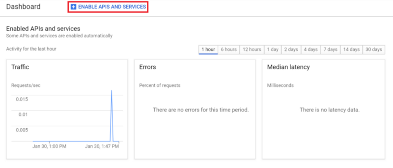
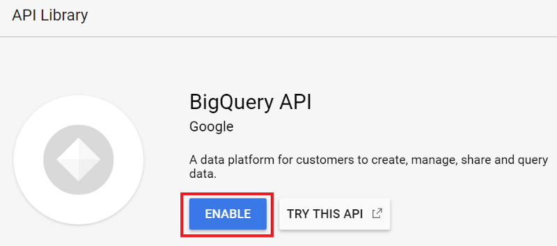
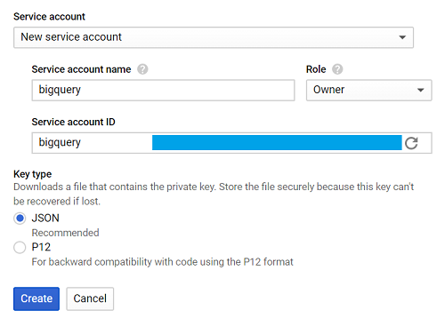
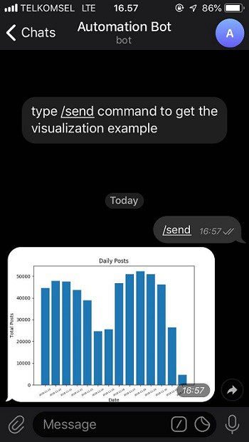

How to build a bot to automate your mindless tasks using Python and Google BigQuery

# How to build a bot to automate your mindless tasks using Python and Google BigQuery

[Dzaky Widya Putra](https://medium.freecodecamp.org/@dzakyputra)

Mar 8·6 min read

Photo by [Lukas](https://www.pexels.com/@goumbik?utm_content=attributionCopyText&utm_medium=referral&utm_source=pexels) from [Pexels](https://www.pexels.com/photo/person-writing-on-notebook-669615/?utm_content=attributionCopyText&utm_medium=referral&utm_source=pexels)

Do you have repetitive tasks? Something that you do regularly, every week or even every day? Reporting might be one of your weekly or daily tasks. You query or ask for the data, and do some visualizations, then give it to your boss. What if, instead of doing it manually, you were to automate it so you don’t have to do the boring stuff, and you can use your precious time to do other things?

In this tutorial, we are going to make a Telegram Bot that will automate the boring parts of your job — reporting. Oh, and did I mention that it won’t take more than 50 lines of code to build it? ;)

If this is your first time building a Telegram Bot, you might want to read [this post](https://medium.freecodecamp.org/learn-to-build-your-first-bot-in-telegram-with-python-4c99526765e4) first.

### Getting started

#### 1. Install the libraries

We are going to use [google-cloud-bigquery](https://github.com/googleapis/google-cloud-python) to query the data from Google BigQuery. [matplotlib](https://matplotlib.org/), [numpy](http://www.numpy.org/)and [pandas](https://pandas.pydata.org/) will help us with the data visualization. [python-telegram-bot](https://github.com/python-telegram-bot/python-telegram-bot) will send the visualization image through Telegram Chat.

pip3 install google-cloud-bigquery matplotlib numpy pandas python-telegram-bot

#### 2. Enable Google BigQuery API

We need to enable the Google BigQuery API first if we want to use the service.

Go to [Google Developers Console](https://console.developers.google.com/) and create a new project (or select the one you have).

In the project dashboard, click **ENABLE APIS AND SERVICES**, and search for BigQuery API.

Click **ENABLE** to enable the API.

#### 3. Create the service account key

If we want to use Google Cloud services like Google BigQuery, we need a service account key. This is like our credentials to use Google’s services.

Go to [Google Developers Console](https://console.developers.google.com/), click the **Credentials** tab, choose **Create credentials** and click **Service account key**.

Choose **New service account**, in the **Service account name** field, enter a name.

From the **Role** drop-down list, select **Project **> **Owner, **then click **Create**.

There is a .json file that will be automatically downloaded, name it `creds.json`.

Set the `GOOGLE_APPLICATION_CREDENTIALS` with the path of our `creds.json` file in the terminal.

export GOOGLE_APPLICATION_CREDENTIALS='[PATH_TO_CREDS.JSON]'
Everything should be good now, it is time to write our program.

### Write the program

We are going to write the program that will query the data from BigQuery (we assume the data is stored there). Then we will visualize the data and save as an image. The image will then be sent through Telegram Chat.

For this tutorial, we are using the `bigquery-public-data.stackoverflow` dataset, and we will take the daily total posts data for our report.

The workflow of our program is pretty simple:

**> Query **> the table -> **> Visualize **> the data -> **> Save **> the visualization -> **> Send **> the image

Let’s make a single function to define each flow.

#### 1. Query to BigQuery

Import the library first.
from google.cloud import bigquery

Make a function called `query_to_bigquery` which takes `query` as the parameter.

def query_to_bigquery(query):
client = bigquery.Client()
query_job = client.query(query)
result = query_job.result()
dataframe = result.to_dataframe()
return dataframe
This function will return the data as a dataframe.

#### 2. Visualize the data

We are going to use matplotlib to visualize the data.
import matplotlib.pyplot as plt

We take five parameters which are `x` as the x-axis data, `x_label` as the x-axis label name, `y` as the y-axis data, `y_label` as the y-axis label name, and `title` as our visualization title.

def visualize_bar_chart(x, x_label, y, y_label, title):
plt.title(title)
plt.xlabel(x_label)
plt.ylabel(y_label)
index = np.arange(len(x))
plt.xticks(index, x, fontsize=5, rotation=30)
plt.bar(index, y)
return plt

#### 3. Save the image

Let’s use the two functions above to create a visualization then save the image.

Like I mentioned before, we want to send the daily total posts data. Write the query first.

query = """
SELECT DATE(creation_date) date, COUNT(*) total_posts
FROM `bigquery-public-data.stackoverflow.post_history`
GROUP BY 1
HAVING date > DATE_SUB('2018-12-02', INTERVAL 14 DAY)
ORDER BY 1
"""

Note that in the query above, `HAVING date > DATE_SUB('2018-12-02', INTERVAL 14 DAY)` means we want to gather the data starting 14 days ago from 2018–12–02.

We use that date because `2018-12-02` is the last data recorded in `bigquery-public-data.stackoverflow.post_history`, in different cases you might want to use `CURRENT_DATE()` instead so you will get the newest data.

Call `query_to_bigquery` function to get the data.
dataframe = query_to_bigquery(query)

Take the `date` column as our x-axis data, and `total_posts` column as our y-axis data.

x = dataframe['date'].tolist()
y = dataframe['total_posts'].tolist()

Visualize the data using the `visualize_bar_chart` function, then save it as an image.

plt = visualize_bar_chart(x=x, x_label='Date', y=y, y_label='Total Posts', title='Daily Posts')

plt.savefig('viz.png')
Wrap that code in a function called `get_and_save_image`.
def get_and_save_image():
query = """
SELECT DATE(creation_date) date, COUNT(*) total_posts
FROM `bigquery-public-data.stackoverflow.post_history`
GROUP BY 1
HAVING date > DATE_SUB('2018-12-02', INTERVAL 14 DAY)
ORDER BY 1
"""
dataframe = query_to_bigquery(query)
x = dataframe['date'].tolist()
y = dataframe['total_posts'].tolist()

plt = visualize_bar_chart(x=x, x_label='Date', y=y, y_label='Total Posts', title='Daily Posts')

plt.savefig('viz.png')

#### 4. Send the image

To be able to send it to the right person, we need to know their `chat_id` because that is one of the required parameters.

Go to the [userinfobot](https://telegram.me/userinfobot) then type `/start`. The bot will reply with our user information, and our `chat_id` is the number in the `Id` field.

Make a function called `send_image`. This function will call `get_and_save_image` function first to get and save the visualization, then send it to the person whose chat_id is declared in the `chat_id` variable.

def send_image(bot, update):
get_and_save_image()
chat_id = 'CHAT_ID_RECEIVER'
bot.send_photo(chat_id=chat_id, photo=open('viz.png','rb'))

#### 5. Main program

Lastly, create another function called `main` to run our program. **Don’t forget to change**  `YOUR_TOKEN` with your bot’s token.

Remember, this program will send the image automatically based on the day and time we defined.

For example in this tutorial we will set it to 9:00 AM every day.
def main():
updater = Updater('YOUR_TOKEN')

updater.job_queue.run_daily(send_image, time=datetime.datetime.strptime('9:00AM', '%I:%M%p').time(), days=(0,1,2,3,4,5,6))

updater.start_polling()
updater.idle()
if __name__ == '__main__':
main()
At the end your code should look like this:

|     |     |
| --- | --- |
| 1   | from google.cloud import bigquery |
| 2   | from telegram.ext import Updater |
| 3   |     |
| 4   | import matplotlib.pyplot as plt |
| 5   | import numpy as np |
| 6   | import datetime |
| 7   |     |
| 8   | def  query_to_bigquery(query): |
| 9   | client = bigquery.Client() |
| 10  | query_job = client.query(query) |
| 11  | result = query_job.result() |
| 12  | dataframe = result.to_dataframe() |
| 13  |  return dataframe |
| 14  |     |
| 15  | def  visualize_bar_chart(x, x_label, y, y_label, title): |
| 16  | plt.title(title) |
| 17  | plt.xlabel(x_label) |
| 18  | plt.ylabel(y_label) |
| 19  | index = np.arange(len(x)) |
| 20  | plt.xticks(index, x, fontsize=5, rotation=30) |
| 21  | plt.bar(index, y) |
| 22  |  return plt |
| 23  |     |
| 24  | def  get_and_save_image(): |
| 25  | query =  """ |
| 26  | SELECT DATE(creation_date) date, COUNT(*) total_posts |
| 27  | FROM `bigquery-public-data.stackoverflow.post_history` |
| 28  | GROUP BY 1 |
| 29  | HAVING date > DATE_SUB('2018-12-02', INTERVAL 14 DAY) |
| 30  | ORDER BY 1 |
| 31  |  """ |
| 32  | dataframe = query_to_bigquery(query) |
| 33  | x = dataframe['date'].tolist() |
| 34  | y = dataframe['total_posts'].tolist() |
| 35  | plt = visualize_bar_chart(x=x, x_label='Date', y=y, y_label='Total Posts', title='Daily Posts') |
| 36  | plt.savefig('viz.png') |
| 37  |     |
| 38  | def  send_image(bot, update): |
| 39  | get_and_save_image() |
| 40  | chat_id =  'CHAT_ID_RECEIVER' |
| 41  | bot.send_photo(chat_id=chat_id, photo=open('viz.png', 'rb')) |
| 42  |     |
| 43  | def  main(): |
| 44  | updater = Updater('YOUR_TOKEN') |
| 45  | updater.job_queue.run_daily(send_image, time=datetime.datetime.strptime('9:00AM', '%I:%M%p').time(), days=(0,1,2,3,4,5,6)) |
| 46  | updater.start_polling() |
| 47  | updater.idle() |
| 48  |     |
| 49  | if  __name__  ==  '__main__': |
| 50  | main() |

 [view raw](https://gist.github.com/dzakyputra/aea410343cb247740301e29529be7e32/raw/8462ff188a6293a14912e7b0425a88e863164b4a/main.py)  [main.py](https://gist.github.com/dzakyputra/aea410343cb247740301e29529be7e32#file-main-py) hosted with ❤ by [GitHub](https://github.com/)

Save the file and name it `main.py`.
Run the program by typing this command in the terminal.
python3 main.py

Great! Now you have an automatic report generator built with no more than 50 lines of code — pretty cool right?

Go check the bot in [here](https://telegram.me/automatereportbot), and type the `/send` command to see the example of the image visualization.

The image below shows the visualization that the bot will send. Now you can just sit back, relax, and wait for the bot to send the report to you everyday :)

You can visit my [GitHub](https://github.com/dzakyputra/automatebot)to get the code, and please do not hesitate to connect and leave a message in my [Linkedin](https://www.linkedin.com/in/dzakywp/)profile if you want to ask about anything.

Please leave a comment if you think there are any errors in my code or writing.

If you have interest in data science or machine learning, you might want to read my post on [building sentiment analyzer](https://medium.freecodecamp.org/how-to-make-your-own-sentiment-analyzer-using-python-and-googles-natural-language-api-9e91e1c493e).

Once again, thank you and good luck! :)