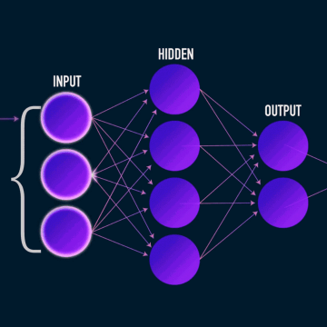

How to build your own Neural Network from scratch in Python

How to build your own Neural Network from scratch in Python

https://towardsdatascience.com/how-to-build-your-own-neural-network-from-scratch-in-python-68998a08e4f6

A beginner’s guide to understanding the inner workings of Deep Learning