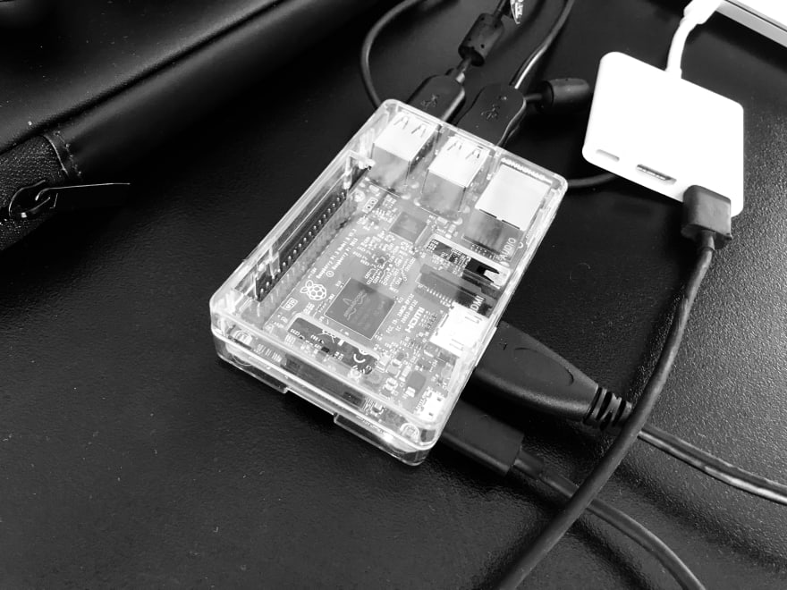
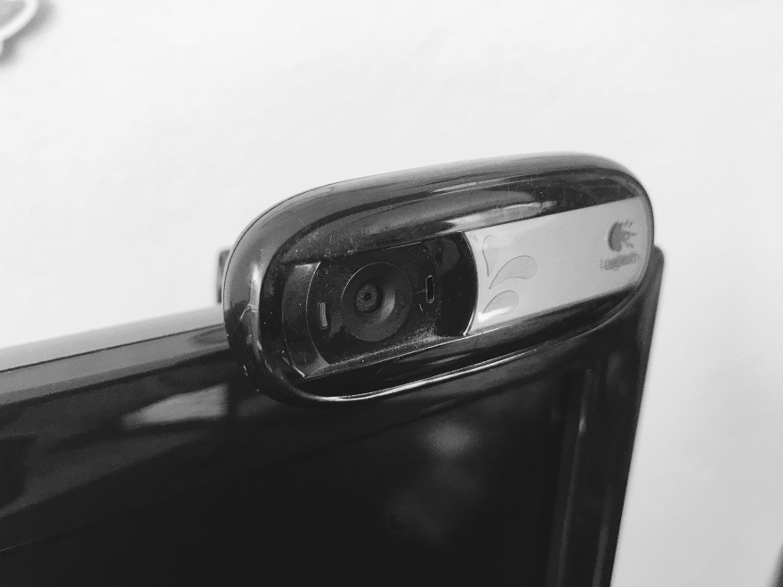
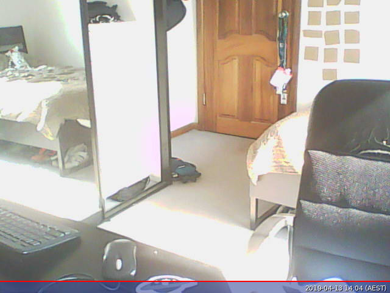

How to build your own primitive surveillance system with Raspberry Pi in less than one hour 🔥

#  How to build your own primitive surveillance system with Raspberry Pi in less than one hour

###     [  [4e02e4eb-86f2-4cde-8bf1-b67b7950e186.webp](../_resources/2f3abdcae8b61394bc018161dbd3121a.webp)  Nick Shulhin](https://dev.to/nickitax)    [![](data:image/svg+xml,%3csvg xmlns='http://www.w3.org/2000/svg' width='438.549' height='438.549' viewBox='0 0 438.549 438.549' role='img' aria-labelledby='aeka5max87hrq16pkcy81qe8yyt3p2g7' class='icon-img js-evernote-checked' data-evernote-id='362'%3e%3ctitle id='aeka5max87hrq16pkcy81qe8yyt3p2g7'%3egithub logo%3c/title%3e%3cpath d='M409.132 114.573c-19.608-33.596-46.205-60.194-79.798-79.8C295.736 15.166 259.057 5.365 219.27 5.365c-39.78 0-76.47 9.804-110.062 29.408-33.596 19.605-60.192 46.204-79.8 79.8C9.803 148.168 0 184.853 0 224.63c0 47.78 13.94 90.745 41.827 128.906 27.884 38.164 63.906 64.572 108.063 79.227 5.14.954 8.945.283 11.42-1.996 2.474-2.282 3.71-5.14 3.71-8.562 0-.57-.05-5.708-.144-15.417-.098-9.71-.144-18.18-.144-25.406l-6.567 1.136c-4.187.767-9.47 1.092-15.846 1-6.375-.09-12.992-.757-19.843-2-6.854-1.23-13.23-4.085-19.13-8.558-5.898-4.473-10.085-10.328-12.56-17.556l-2.855-6.57c-1.903-4.374-4.9-9.233-8.992-14.56-4.093-5.33-8.232-8.944-12.42-10.847l-1.998-1.43c-1.332-.952-2.568-2.1-3.71-3.43-1.143-1.33-1.998-2.663-2.57-3.997-.57-1.335-.097-2.43 1.428-3.29 1.525-.858 4.28-1.275 8.28-1.275l5.708.853c3.807.763 8.516 3.042 14.133 6.85 5.615 3.807 10.23 8.755 13.847 14.843 4.38 7.807 9.657 13.755 15.846 17.848 6.184 4.093 12.42 6.136 18.7 6.136 6.28 0 11.703-.476 16.273-1.423 4.565-.95 8.848-2.382 12.847-4.284 1.713-12.758 6.377-22.56 13.988-29.41-10.847-1.14-20.6-2.857-29.263-5.14-8.658-2.286-17.605-5.996-26.835-11.14-9.235-5.137-16.896-11.516-22.985-19.126-6.09-7.614-11.088-17.61-14.987-29.98-3.9-12.373-5.852-26.647-5.852-42.825 0-23.035 7.52-42.637 22.557-58.817-7.044-17.318-6.38-36.732 1.997-58.24 5.52-1.715 13.706-.428 24.554 3.853 10.85 4.284 18.794 7.953 23.84 10.995 5.046 3.04 9.09 5.618 12.135 7.708 17.706-4.947 35.977-7.42 54.82-7.42s37.116 2.473 54.822 7.42l10.85-6.85c7.418-4.57 16.18-8.757 26.26-12.564 10.09-3.806 17.803-4.854 23.135-3.14 8.562 21.51 9.325 40.923 2.28 58.24 15.035 16.18 22.558 35.788 22.558 58.818 0 16.178-1.958 30.497-5.853 42.966-3.9 12.47-8.94 22.457-15.125 29.98-6.19 7.52-13.9 13.85-23.13 18.985-9.233 5.14-18.183 8.85-26.84 11.135-8.663 2.286-18.416 4.004-29.264 5.146 9.894 8.563 14.842 22.078 14.842 40.54v60.237c0 3.422 1.19 6.28 3.572 8.562 2.38 2.278 6.136 2.95 11.276 1.994 44.163-14.653 80.185-41.062 108.068-79.226 27.88-38.16 41.826-81.126 41.826-128.906-.01-39.77-9.818-76.454-29.414-110.05z'%3e%3c/path%3e%3c/svg%3e)](http://github.com/NickitaX)  Apr 13  ・4 min read

 [#diy](https://dev.to/t/diy)  [#raspberrypi](https://dev.to/t/raspberrypi)  [#tech](https://dev.to/t/tech)  [#project](https://dev.to/t/project)

Recently I got my hands on a Raspberry Pi 3 B+ which I purchased used from classifieds website for around A$30 dollars.

And straight away decided to make some mini project to get familiar with a system.

One of the first ideas was to make a use of my old Logitech C170 camera, which was collecting a dust in my wardrobe for many years.

That’s how surveillance system project came up!

In this tutorial I will explain how to build a very easy and primitive system to take pictures of your room and download them.

For this tutorial we will need only two components: Raspberry Pi and a web camera.

My Raspberry Pi was running Ubuntu Mate, but you can install any other disto according to your preference.

You can download Ubuntu Mate [here](https://ubuntu-mate.org/download/)
Once Pi is connected and running, let’s attach camera to one of the USB ports.

You can always check plugged devices by running `lsusb` command, which will output all connected devices:

	Bus 001 Device 006: ID 046d:082b Logitech, Inc. Webcam C170
	Bus 001 Device 005: ID 045e:00cb Microsoft Corp. Basic Optical Mouse v2.0
	Bus 001 Device 004: ID 045e:07f8 Microsoft Corp. Wired Keyboard 600 (model 1576)
	Bus 001 Device 003: ID 0424:ec00 Standard Microsystems Corp. SMSC9512/9514 Fast Ethernet Adapter
	Bus 001 Device 002: ID 0424:9514 Standard Microsystems Corp. SMC9514 Hub
	Bus 001 Device 001: ID 1d6b:0002 Linux Foundation 2.0 root hub

In Linux environment, attached camera hardware can be checked from /dev space on your system.

To ensure our camera is connected, run `ls -lts /dev/ | grep video` command:

	0 crw-rw----  1 root video   238,   0 Apr 13 12:30 media0
	0 crw-rw----+ 1 root video    81,   0 Apr 13 12:30 video0
	0 crw-rw----  1 root video   240,   0 Jan 29  2018 vchiq
	0 crw-rw----  1 root video   241,   0 Jan 29  2018 vcsm
	0 crw-rw----  1 root video    29,   0 Jan 29  2018 fb0
	0 crw-rw----  1 root video   245,   0 Jan 29  2018 vcio

Awesome, `video0` is there!
Yay!
Now we need to find a way how to capture a single photo from our web camera!

In this tutorial for the sake of simplicity we are not going to write any custom Go solutions, but just to use already existing tool which is called `fswebcam`.

We can install it with `apt-get` (don’t forget to update packages beforehand):

`sudo apt-get install fswebcam`
Now, it is time to take a first picture!

	fswebcam -r 640x480 --jpeg 100 -D 3 -S 13 /home/user/Desktop/picture.jpg -d /dev/video0

Command above will snap a VGA resolution picture in JPEG format with delay of 3 seconds for processing.

Let's see what we have got:

...I do need some cleaning in my room... but anyway...
We got it! Congratulations!!!
But how can we do it remotely?

Of course we can write an API to invoke this command + expose it with NGROK or similar tool, but let’s do something more simple.

At my home I had an access to router, as well as WAN address and NAT configuration.

WAN address represents a Wide Area Network IP address which can be reached from outside your home local network.

Network Address Translation (or NAT) allows us to translate incoming connections to particular local IP addresses (in our case a Raspberry Pi).

First step is to create a persistent lease of our local IP address for Raspberry Pi. We are doing this to ensure that local IP address will be always the same for our Pi. This binding is done to MAC address.

Second step is to make a NAT forwarding. For the sake of simplicity we can use port 22 binding to enable Secure Shell to our Raspberry.

Let’s check if it works:

	ssh user@raspberry_pi

It does! But it asks for a password...

Now we are able to SSH to our Raspberry Pi from anywhere in the World. Good job!

To make sure we don’t have to constantly login for connection, it is a good practice to generate public/private keys.

On a host machine which makes a connection to Raspberry Pi, generate a public/private key pair:

	ssh-keygen -t rsa -b 4096 -C “your@email.to"

And now you can copy a created key to your Raspberry Pi with:

	ssh-copy-id user@raspberry_pi //of your raspberry pi

Voila! Now we can SSH to our Pi with a help of a key and no password! Sweet!

Finally, let’s try to write a small script which would SSH to our Raspberry Pi, invoke capture image command and download it to the host.

	echo “Executing picture capture on Raspberry Pi..."
	ssh -t user@raspberry_pi 'bash fswebcam -r 640x480 --jpeg 100 -D 3 -S 13 /home/user/Desktop/picture.jpg -d /dev/video0'
	echo "Copying picture from Raspberry Pi to host desktop..."
	scp user@raspberry_pi:/home/user/Desktop/picture.jpg ~/Desktop/

Create `take_picture.sh`, put above content inside and execute a script!
And now we have our remote picture :)

If you have any questions or suggestions - feel free to ask!