How to easily Detect Objects with Deep Learning on Raspberry Pi

# How to easily Detect Objects with Deep Learning on Raspberry Pi

## The real world poses challenges like having limited data and having tiny hardware like Mobile Phones and Raspberry Pis which can’t run complex Deep Learning models. This post demonstrates how you can detect objects using a Raspberry Pi. Like cars on a road, oranges in a fridge, signatures in a document and teslas in space.

*Disclaimer: I’m building *[*nanonets.com*](https://nanonets.com/objectdetection/?utm_source=medium.com&utm_medium=content&utm_campaign=How%20to%20easily%20Detect%20Objects%20with%20Deep%20Learning%20on%20RaspberryPi&utm_content=top)* to help build ML with less data and no hardware*

*> If you’re impatient scroll to the bottom of the post for the Github Repos*

Detecting Vehicles on the Road of Mumbai

### Why Object Detection?, Why Raspberry Pi?

The raspberry pi is a neat piece of hardware that has captured the hearts of a generation with ~15M devices sold, with hackers building even [cooler projects](http://www.trustedreviews.com/opinion/best-raspberry-pi-projects-pi-3-pi-zero-2949390) on it. Given the popularity of Deep Learning and the [Raspberry Pi Camera](https://www.raspberrypi.org/products/camera-module-v2/) we thought it would be nice if we could detect any object using Deep Learning on the Pi.

Now you will be able to detect a photobomber in your selfie, someone entering Harambe’s cage, where someone kept the Sriracha or an Amazon delivery guy entering your house.

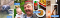
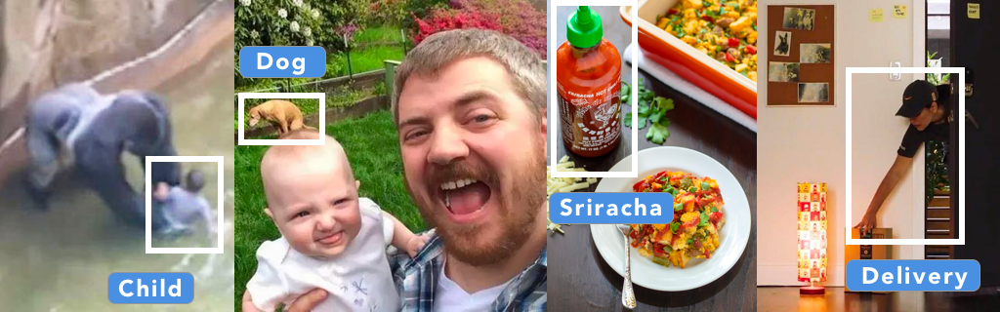

### What is Object Detection?

20Myears of evolution have made human vision fairly evolved. The human brain has [30***%*** of it’s Neurons work on processing vision (as compared with 8 percent for touch and just 3 percent for hearing)](http://discovermagazine.com/1993/jun/thevisionthingma227). Humans have two major advantages when compared with machines. One is stereoscopic vision, the second is an almost infinite supply of training data (an infant of 5 years has had approximately 2.7B Images sampled at 30fps).

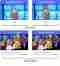
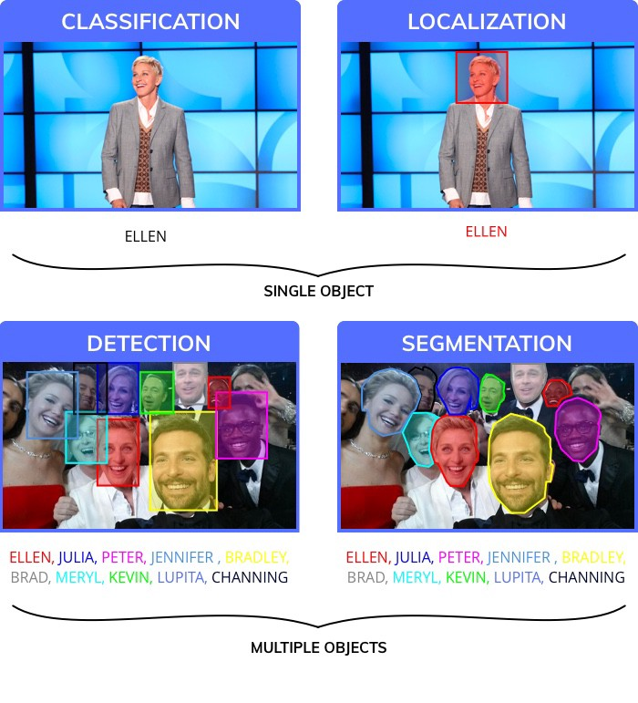

To mimic human level performance scientists broke down the visual perception task into four different categories.

1. **Classification**, assigns a label to an entire image
2. **Localization**, assigns a bounding box to a particular label
3. **Object Detection**, draws multiple bounding boxes in an image

4. **Image segmentation**, creates precise segments of where objects lie in an image

Object detection has been good enough for a variety of applications (even though image segmentation is a much more precise result, it suffers from the complexity of creating training data. It typically takes a human annotator 12x more time to segment an image than draw bounding boxes; this is more anecdotal and lacks a source). Also, after detecting objects, it is separately possible to segment the object from the bounding box.

#### Using Object Detection:

Object detection is of significant practical importance and has been used across a variety of industries. Some of the examples are mentioned below:

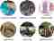
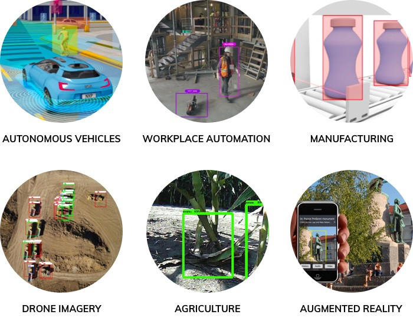

### How do I use Object Detection to solve my own problem?

Object Detection can be used to answer a variety of questions. These are the broad categories:

1. **Is an object present** in my Image or not? eg is there an intruder in my house

2. **Where is an object** in the image? eg when a car is trying to navigate it’s way through the world, its important to know where an object is.

3. **How many objects** are there in an image? Object detection is one of the most efficient ways of counting objects. eg How many boxes in a rack inside a warehouse

4. **What are the different types of objects** in the Image? eg Which animal is there in which part of the Zoo?

5. **What is the size of an object? **Especially with a static camera, it is easy to figure out the size of an object. eg What is the size of the Mango

6. **How are different objects interacting with each other? **egHow does the formation on a football field effect the result?

7. **Where is an object with respect to time (Tracking an Object). eg **Tracking a moving object like a train and calculating it’s speed etc.

### Object Detection in under 20 Lines of Code

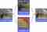
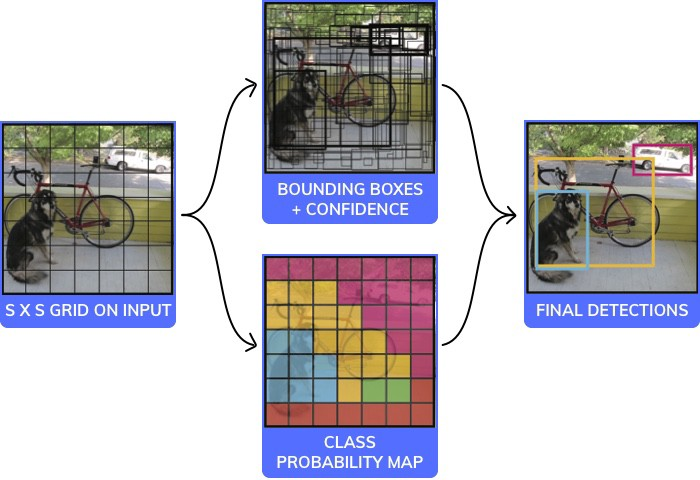
YOLO Algorithm Visualized

There are a variety of models/architectures that are used for object detection. Each with trade-offs between speed, size, and accuracy. We picked one of the most popular ones: [YOLO](https://pjreddie.com/darknet/yolo/) (You only look once). and have shown how it works below in under 20 lines of code (if you ignore the comments).

**Note: This is pseudo code, not intended to be a working example. It has a black box which is the CNN part of it which is fairly standard and shown in the image below.**

You can read the full paper here: https://pjreddie.com/media/files/papers/yolo_1.pdf

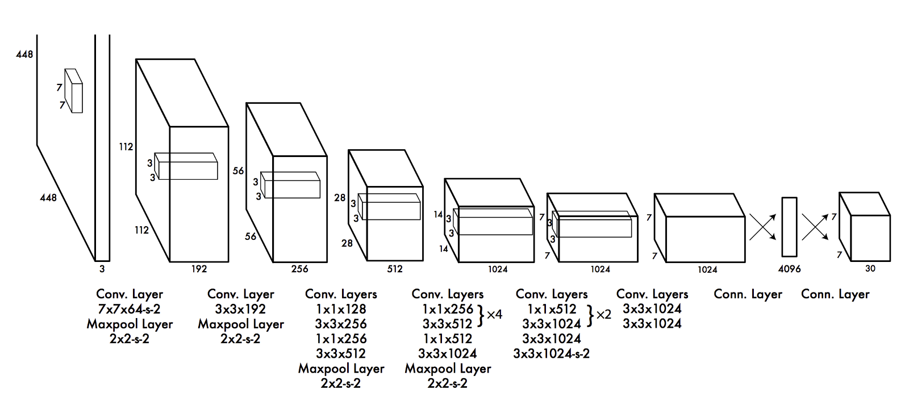
Architecture of the Convolutional Neural Network used in YOLO

YOLO in <20 lines of code, explained

### How do we build a Deep Learning model for Object Detection?

#### The workflow for Deep Learning has 6 Primary Steps Broken into 3 Parts

1. Gathering Training Data
2. Training the model
3. Predictions on New Images
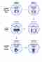
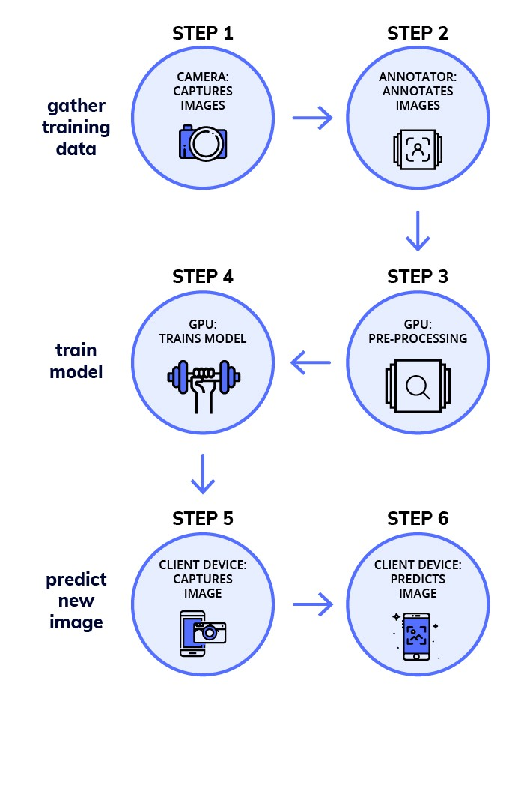

### Phase 1 — Gather Training Data

#### **Step 1. Collect Images (at least 100 per Object):**

For this task, you probably need a few 100 Images per Object. Try to capture data as close to the data you’re going to finally make predictions on.

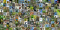
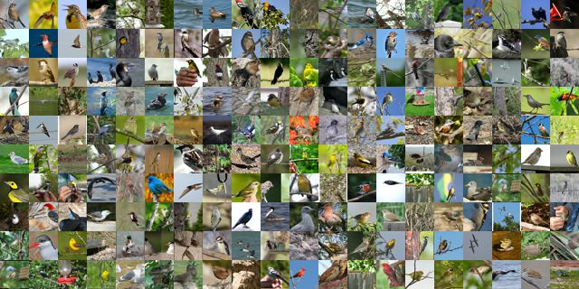

#### **Step 2. Annotate (draw boxes on those Images manually):**

Draw bounding boxes on the images. You can use a tool like [labelImg](https://github.com/tzutalin/labelImg). You will typically need a few people who will be working on annotating your images. This is a fairly intensive and time consuming task.

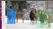
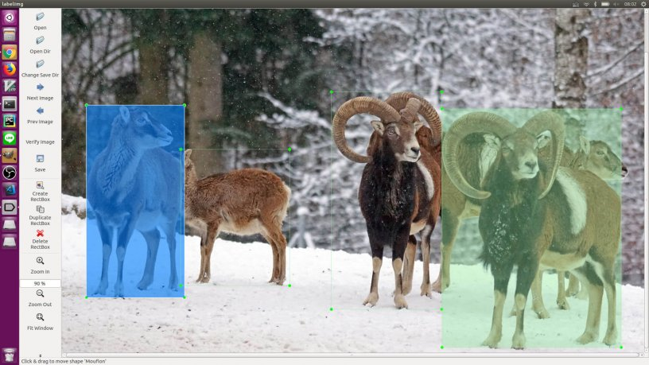

### Phase 2 — Training a Model on a GPU Machine

#### **Step 3. Finding a Pretrained Model for Transfer Learning:**

You can read more about this at [medium.com/nanonets/nanonets-how-to-use-deep-learning-when-you-have-limited-data-f68c0b512cab](http://medium.com/nanonets/nanonets-how-to-use-deep-learning-when-you-have-limited-data-f68c0b512cab). You need a pretrained model so you can reduce the amount of data required to train. Without it, you might need a few 100k images to train the model.

[You can find a bunch of pretrained models here](https://github.com/tensorflow/models/blob/master/research/object_detection/g3doc/detection_model_zoo.md)

#### **Step 4. Training on a GPU (cloud service like AWS/GCP etc or your own GPU Machine):**

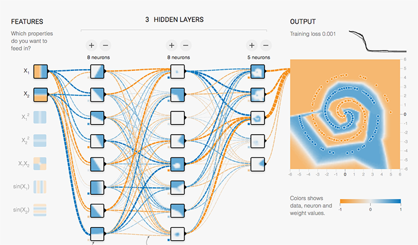

#### Docker Image

The process of training a model is unnecessarily difficult to simplify the process we created a docker image would make it easy to train.

To start training the model you can run:

`sudo nvidia-docker run -p 8000:8000 -v `pwd`:data docker.nanonets.com/pi_training -m train -a ssd_mobilenet_v1_coco -e ssd_mobilenet_v1_coco_0 -p '{"batch_size":8,"learning_rate":0.003}'`

#### [Please refer to this link for details on how to use](https://github.com/NanoNets/RaspberryPi-ObjectDetection-TensorFlow)

The docker image has a run.sh script that can be called with the following parameters

`run.sh [-m mode] [-a architecture] [-h help] [-e experiment_id] [-c checkpoint] [-p hyperparameters]`

`-h          display this help and exit[[NEWLINE]]-m          mode: should be either `train` or `export`[[NEWLINE]]-p          key value pairs of hyperparameters as json string[[NEWLINE]]-e          experiment id. Used as path inside data folder to run current experiment[[NEWLINE]]-c          applicable when mode is export, used to specify checkpoint to use for export`

You can find more details at:
**To train a model you need to select the right hyper parameters.**
**Finding the right parameters**

The art of “Deep Learning” involves a little bit of hit and try to figure out which are the best parameters to get the highest accuracy for your model. There is some level of black magic associated with this, along with a little bit of theory. [This is a great resource for finding the right parameters](https://blog.slavv.com/37-reasons-why-your-neural-network-is-not-working-4020854bd607).

**Quantize Model (make it smaller to fit on a small device like the Raspberry Pi or Mobile)**

Small devices like Mobile Phones and Rasberry PI have very little memory and computation power.

Training neural networks is done by applying many tiny nudges to the weights, and these small increments typically need floating point precision to work (though there are research efforts to use quantized representations here too).

Taking a pre-trained model and running inference is very different. One of the magical qualities of Deep Neural Networks is that they tend to cope very well with high levels of noise in their inputs.

**Why Quantize?**

Neural network models can take up a lot of space on disk, with the original AlexNet being over 200 MB in float format for example. Almost all of that size is taken up with the weights for the neural connections, since there are often many millions of these in a single model.

The Nodes and Weights of a neural network are originally stored as 32-bit floating point numbers. The simplest motivation for quantization is to shrink file sizes by storing the min and max for each layer, and then compressing each float value to an eight-bit integer.The size of the files is reduced by 75%.

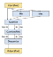
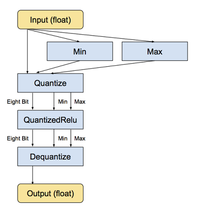
**Code for Quantization:**

curl -L "https://storage.googleapis.com/download.tensorflow.org/models/inception_v3_2016_08_28_frozen.pb.tar.gz" |

tar -C tensorflow/examples/label_image/data -xz
bazel build tensorflow/tools/graph_transforms:transform_graph
bazel-bin/tensorflow/tools/graph_transforms/transform_graph \

--in_graph=tensorflow/examples/label_image/data/inception_v3_2016_08_28_frozen.pb \

--out_graph=/tmp/quantized_graph.pb \
--inputs=input \
--outputs=InceptionV3/Predictions/Reshape_1 \

--transforms='add_default_attributes strip_unused_nodes(type=float, shape="1,299,299,3")

remove_nodes(op=Identity, op=CheckNumerics) fold_constants(ignore_errors=true)
fold_batch_norms fold_old_batch_norms quantize_weights quantize_nodes
strip_unused_nodes sort_by_execution_order
> Note: Our docker image has quantization built into it.

### **Phase 3: Predictions on New Images using the Raspberry Pi**

#### **Step 5. Capture a new Image via the camera**

You need the Raspberry Pi camera live and working. Then capture a new Image
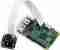
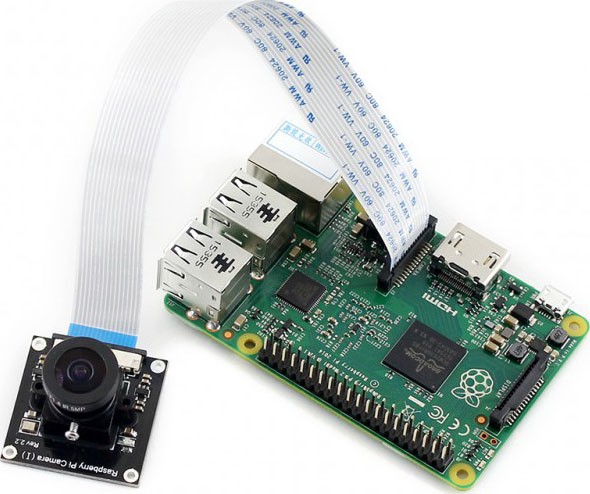

For instructions on how to install checkout this [link](https://thepihut.com/blogs/raspberry-pi-tutorials/16021420-how-to-install-use-the-raspberry-pi-camera)

Code to Capture a new Image

#### Step 6. Predicting a new Image

**Download Model**

Once your done training the model you can download it on to your pi. To export the model run:

`sudo nvidia-docker run -v `pwd`:data docker.nanonets.com/pi_training -m export -a ssd_mobilenet_v1_coco -e ssd_mobilenet_v1_coco_0 -c /data/0/model.ckpt-8998`

Then download the model onto the Raspberry Pi.
**Install TensorFlow on the Raspberry Pi**
Depending on your device you might need to change the installation a little

`sudo apt-get install libblas-dev liblapack-dev python-dev libatlas-base-dev gfortran python-setuptools libjpeg-dev`

`sudo pip install Pillow`

`sudo pip install http://ci.tensorflow.org/view/Nightly/job/nightly-pi-zero/lastSuccessfulBuild/artifact/output-artifacts/tensorflow-1.4.0-cp27-none-any.whl`

git clone https://github.com/tensorflow/models.git
`sudo apt-get install -y protobuf-compiler`

`cd models/research/[[NEWLINE]]protoc object_detection/protos/*.proto --python_out=.`

`export PYTHONPATH=$PYTHONPATH:/home/pi/models/research:/home/pi/models/research/slim`

**Run model for predicting on the new Image**

`python ObjectDetectionPredict.py --model data/0/quantized_graph.pb --labels data/label_map.pbtxt --images /data/image1.jpg /data/image2.jpg`

### Performance Benchmarks on Raspberry Pi

The Raspberry Pi has constraints on both Memory and Compute (a version of Tensorflow Compatible with the Raspberry Pi GPU is still not available). Therefore, it is important to benchmark how much time do each of the models take to make a prediction on a new image.

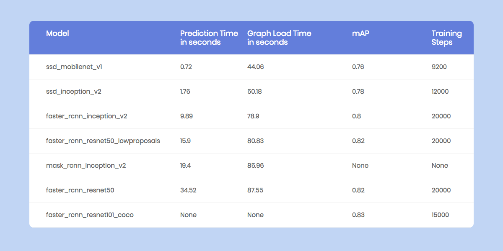
Benchmarks for different Object Detection Models running on Raspberry Pi

### Workflow with NanoNets:

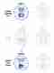
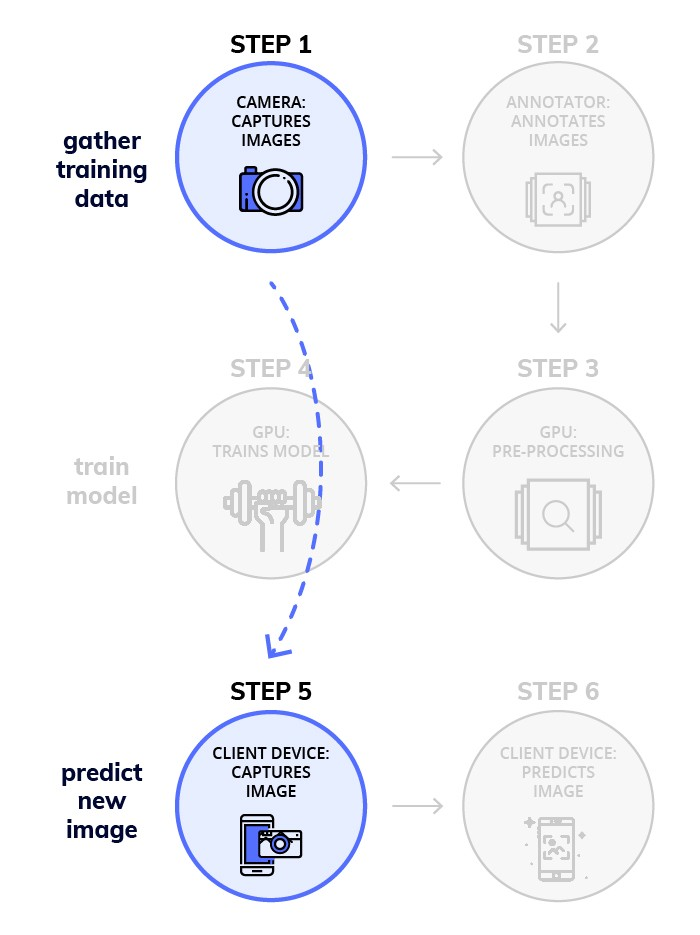

#### We at NanoNets have a goal of making working with Deep Learning super easy. Object Detection is a major focus area for us and we have made a workflow that solves a lot of the challenges of implementing Deep Learning models.

### How NanoNets make the Process Easier:

#### 1. No Annotation Required

We have removed the need to annotate Images, we have expert annotators who will **annotate your images for you**.

#### 2. Automatic Best Model and Hyper Parameter Selection

We **automatically train the best mode**l for you, to achieve this we run a battery of model with different parameters to select the best for your data

#### 3. No Need for expensive Hardware and GPUs

NanoNets is **entirely in the cloud** and runs without using any of your hardware. Which makes it much easier to use.

#### 4. Great for Mobile devices like the Raspberry Pi

Since devices like the Raspberry Pi and mobile phones were not built to run complex compute heavy tasks, you can outsource the workload to our cloud which does all of the compute for you

### Here is a simple snippet to make prediction on an image using the NanoNets API

Code to make a prediction on a new Image using NanoNets

### Build your Own NanoNet

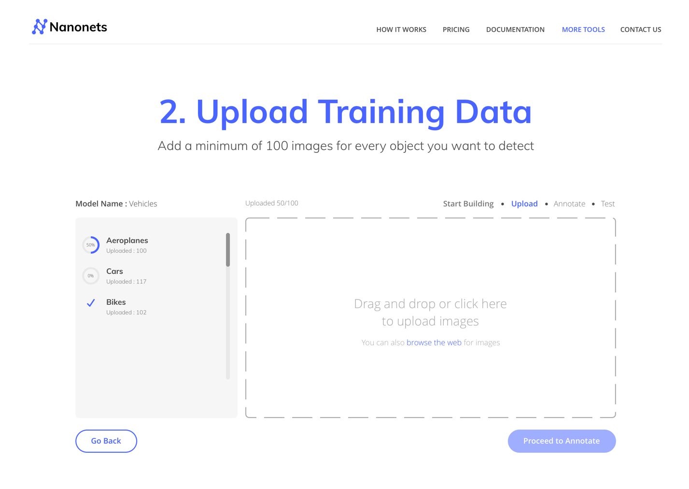

### You can try building your own model from:

### 1. Using a GUI (also auto annotate Images): [https://nanonets.com/objectdetection/](https://nanonets.com/objectdetection/?utm_source=medium.com&utm_medium=content&utm_campaign=How%20to%20easily%20Detect%20Objects%20with%20Deep%20Learning%20on%20RaspberryPi&utm_content=bottom)

### 2. Using our API: https://github.com/NanoNets/object-detection-sample-python

#### Step 1: Clone the Repo

git clone https://github.com/NanoNets/object-detection-sample-python.git
cd object-detection-sample-python
sudo pip install requests

#### Step 2: Get your free API Key

Get your free API Key from http://app.nanonets.com/user/api_key

#### Step 3: Set the API key as an Environment Variable

export NANONETS_API_KEY=YOUR_API_KEY_GOES_HERE

#### Step 4: Create a New Model

python ./code/create-model.py
> Note: This generates a MODEL_ID that you need for the next step

#### Step 5: Add Model Id as Environment Variable

export NANONETS_MODEL_ID=YOUR_MODEL_ID

#### Step 6: Upload the Training Data

Collect the images of object you want to detect. You can annotate them either using our web UI (https://app.nanonets.com/ObjectAnnotation/?appId=YOUR_MODEL_ID) or use open source tool like [labelImg](https://github.com/tzutalin/labelImg). Once you have dataset ready in folders, `images` (image files) and `annotations` (annotations for the image files), start uploading the dataset.

python ./code/upload-training.py

#### Step 7: Train Model

Once the Images have been uploaded, begin training the Model
python ./code/train-model.py

#### Step 8: Get Model State

The model takes ~2 hours to train. You will get an email once the model is trained. In the meanwhile you check the state of the model

watch -n 100 python ./code/model-state.py

#### Step 9: Make Prediction

Once the model is trained. You can make predictions using the model
python ./code/prediction.py PATH_TO_YOUR_IMAGE.jpg