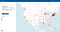
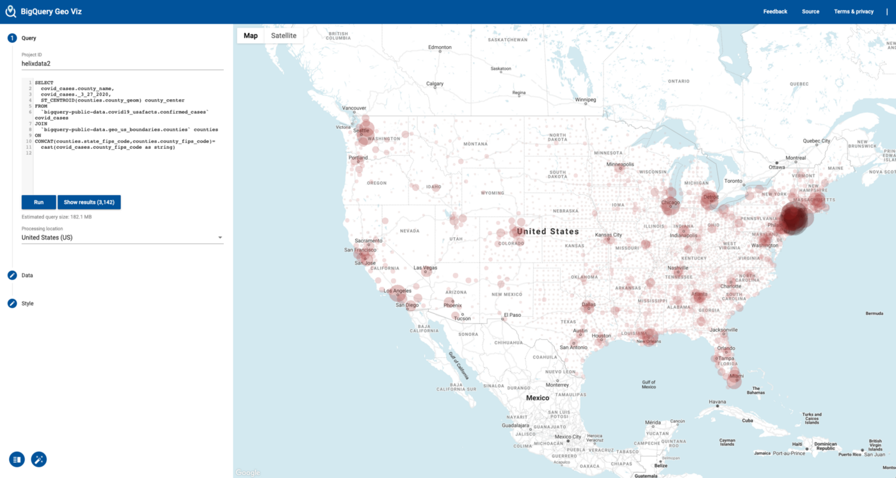
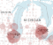
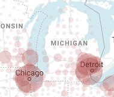
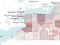
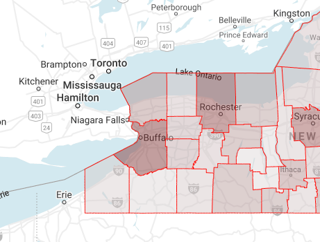
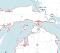
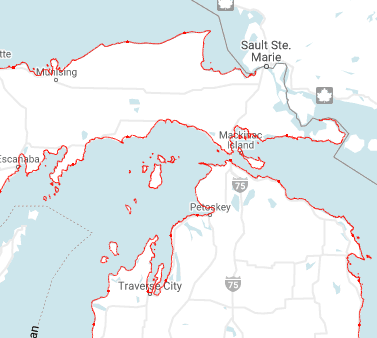

How to find the interior centroid of US counties using BigQuery GIS

# How to find the interior centroid of US counties using BigQuery GIS

## How to handle the problem of centroids being in the Great Lakes

[Lak Lakshmanan](https://medium.com/@lakshmanok?source=post_page-----de396f0fad03----------------------)

[Apr 16](https://medium.com/google-cloud/how-to-find-the-interior-centroid-of-us-counties-using-bigquery-gis-de396f0fad03?source=post_page-----de396f0fad03----------------------) · 5 min read

*with *[*Eric Schmidt*](https://medium.com/@easchmidt)

Trying to plot county-by-county confirmed cases of COVID-19 data using a just-launched BigQuery dataset, we noticed a problem. Overall, the map seems fine:

## The problem caused by state-and-country maritime borders

In the case of maps, though, details are important. Every user of this map will zoom into to where they live. Any user who lives on the coastline of Upper Michigan will immediately notice a problem:

Note that their county’s data is in the water! Why is that?

It’s because US county boundaries go to the state or country boundary. Normally, that’s not a problem, but here, the border is the maritime boundary and is located halfway in the Great Lakes. Here’s another example, this time on the US-Canadian border:

When you create maps like the confirmed cases of COVID-19, you want the marker to be where people live, not out in the water. In this article, I will show you how to create a map marker that is located in the centroid of the land part of the county.

## Idea 1: Coastlines

First idea is to do a spatial join against a dataset of coast-line boundaries and then find the intersection (common area) between the county boundaries and the coastline. This should give us the land areas only.

BigQuery has a public dataset of US geo boundaries, so we can do that:
WITH land_only AS (
SELECT
county_name,
 ** ST_Intersection**(county_geom, coastline_geom) AS county_geom
FROM `bigquery-public-data.geo_us_boundaries.counties`,
`bigquery-public-data.geo_us_boundaries.coastline`
WHERE state_fips_code = '26' -- Michigan
AND ST_Intersects(county_geom, coastline_geom)
)SELECT
county_name,
ST_Centroid(county_geom) AS map_marker,
county_geom
FROM land_only

We can visualize the result using BigQuery GeoViz and this tell us that the method didn’t work:

Notice that the technique worked beautifully for the islands (because the islands are polygons), but not for the other counties because in general, the US coastline consists of multilines, and not polygons.

## Idea 2: Joining with zipcodes

US Zipcodes are actually a bounding box for a collection of postal routes. Since the post office will not deliver mail in the water, we can treat zipcode boundaries are comprising population areas.

Let’s look at what the zipcodes look like for each county:
SELECT
county,
TO_JSON_STRING(ARRAY_AGG(zip_code)) AS zip_codes,
FROM `bigquery-public-data`.geo_us_boundaries.zip_codes
WHERE state_fips_code = '26' -- Michigan
GROUP BY county

## 3. Cleaning up the zipcode data

We notice that some zipcodes (e.g. 49684) cover several counties:

So, we need to split the county field and put 49864 into every county. There is another problem. In some cases, the county name is written as Ostego, Ostego county, or ostego County. So, here’s a function that will do the necessary cleanup:

CREATE OR REPLACE FUNCTION advdata.cleanup_county_name(county_split STRING) AS
(
TRIM(REPLACE(UPPER(county_split), 'COUNTY', ''))
)

and create a table of counties to zipcodes, and make a union of all the geometries:

CREATE OR REPLACE TABLE advdata.michigan_zipcodes AS
SELECT
advdata.cleanup_county_name(county_split) AS county,
TO_JSON_STRING(ARRAY_AGG(zip_code)) AS zip_codes,
 **ST_Union**(ARRAY_AGG(zip_code_geom)) AS population_geom

FROM `bigquery-public-data`.geo_us_boundaries.zip_codes, UNNEST(SPLIT(county, ',')) AS county_split

WHERE state_fips_code = '26' -- Michigan
GROUP BY advdata.cleanup_county_name(county_split)

## 4. Creating markers

Now, we can do markers, one for each county by doing the intersection against the zipcode bounds:

CREATE OR REPLACE TABLE advdata.michigan_landareas ASWITH land_only AS (
SELECT
lsad_name, int_point_geom,
ST_Intersection(county_geom, population_geom) AS county_geom
FROM `bigquery-public-data.geo_us_boundaries.counties`
JOIN advdata.michigan_zipcodes
ON advdata.cleanup_county_name(lsad_name) = county
WHERE state_fips_code = '26' -- Michigan
)SELECT
lsad_name,
int_point_geom,
ST_Centroid(county_geom) AS map_marker,
county_geom
FROM land_only

After doing this, we now have table where, for each county, we have a map_marker point. We can use this to map any point-based county-level data.

## 5. Scale to do all states

The queries so far were for Michigan only, so that we could quickly try them out. Now, instead of hardcoding state_fips_code=’26', let’s do it for all the US states. We’ll store the results in a dataset named reference.

The county clean up function:

CREATE OR REPLACE FUNCTION reference.cleanup_county_name(county_split STRING) AS

(
TRIM(REPLACE(UPPER(county_split), 'COUNTY', ''))
)

Note the addition of state fips to the GROUP BY and removal of Michigan from where clause:

CREATE OR REPLACE TABLE reference.zipcodes AS
SELECT
state_fips_code,
reference.cleanup_county_name(county_split) AS county,
TO_JSON_STRING(ARRAY_AGG(zip_code)) AS zip_codes,
ST_Union(ARRAY_AGG(zip_code_geom)) AS population_geom

FROM `bigquery-public-data`.geo_us_boundaries.zip_codes, UNNEST(SPLIT(county, ',')) AS county_split

GROUP BY state_fips_code, reference.cleanup_county_name(county_split)
The same thing to the landareas query:

CREATE OR REPLACE TABLE reference.landareas AS# join back using state fips and county name

WITH land_only AS (
SELECT
counties.state_fips_code,
lsad_name, int_point_geom,
ST_Intersection(county_geom, population_geom) AS county_geom
FROM `bigquery-public-data.geo_us_boundaries.counties` as counties
JOIN reference.zipcodes as zips
ON reference.cleanup_county_name(lsad_name) = county
AND counties.state_fips_code = zips.state_fips_code
)SELECT
state_fips_code,
lsad_name,
int_point_geom,
ST_Centroid(county_geom) AS map_marker,
county_geom
FROM land_only
Finally, audit the table:
select area.* EXCEPT(county_geom), county.geo_id FROM
`covid19-analytics.reference.landareas` as area
FULL JOIN `bigquery-public-data.geo_us_boundaries.counties` as county
ON area.state_fips_code = county.state_fips_code
and area.lsad_name = county.lsad_name

It turns out that there are 7 counties that do not have geo information due to lack of zip code or missing information in the counties table.

Enjoy!