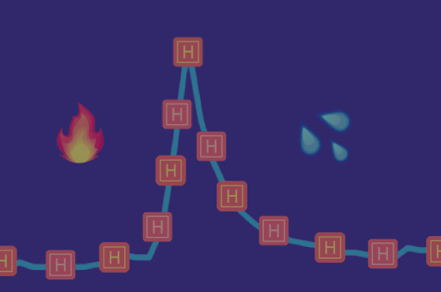
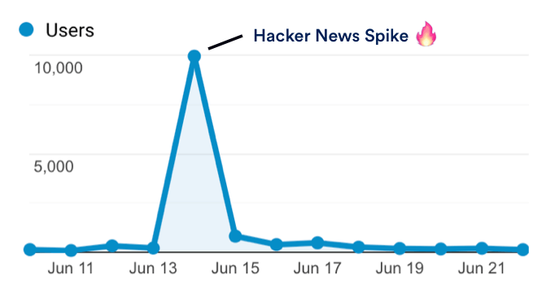
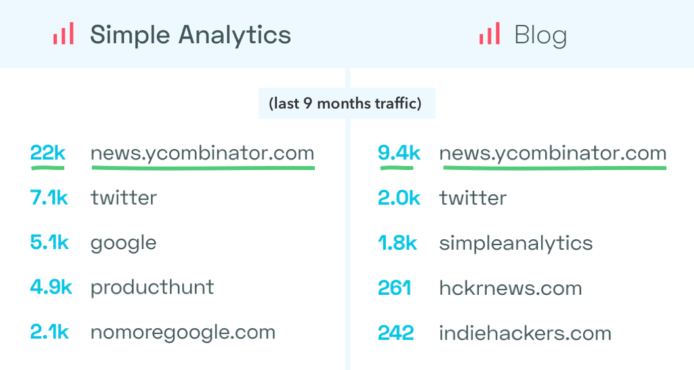
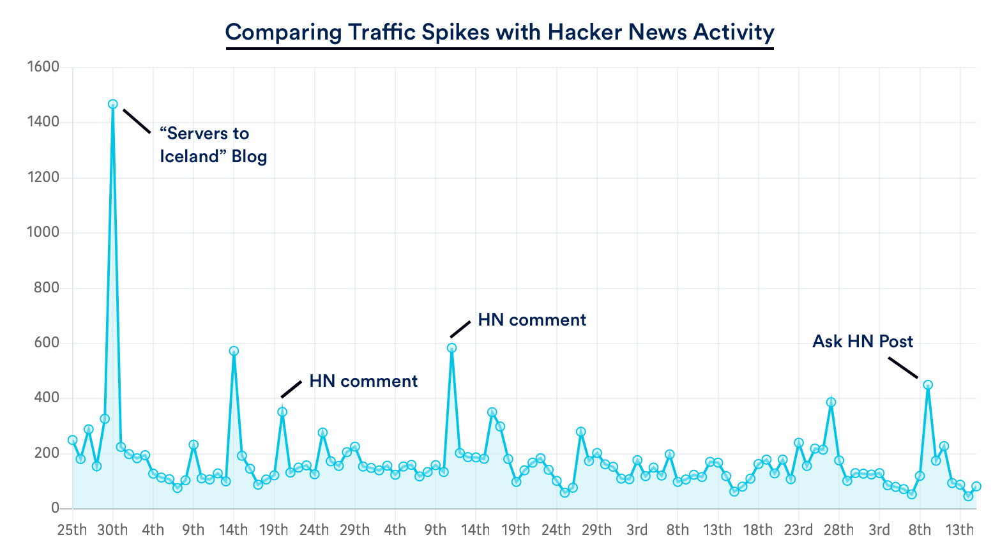
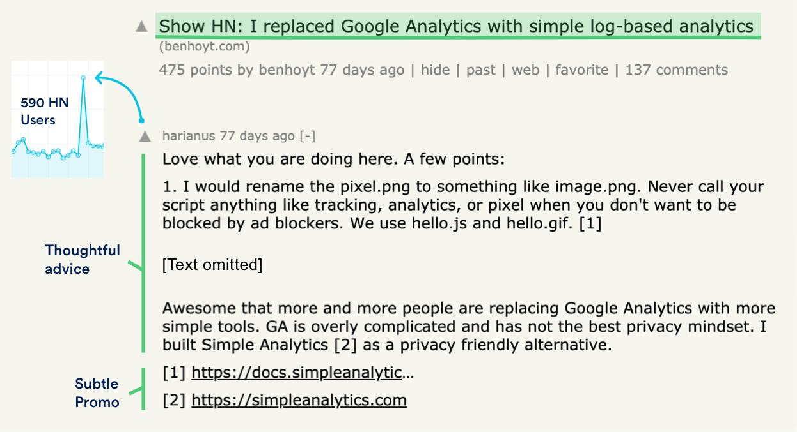
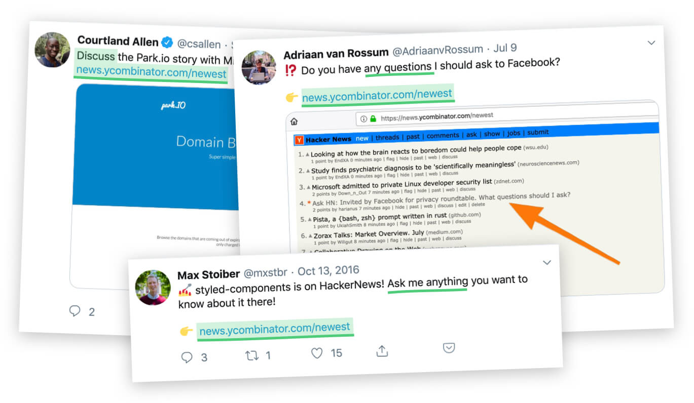

How to get 30,000 Hacker News visitors to your website

# How to get 30,000 Hacker News visitors to your website

' fill='%23FFFFFF' data-evernote-id='395' class='js-evernote-checked'%3e %3cg id='Idea' transform='translate(282.000000%2c 300.000000)' data-evernote-id='396' class='js-evernote-checked'%3e %3cpath d='M9.61002288%2c2.55171625 C9.96831288%2c2.55171625 10.2587643%2c2.26126482 10.2587643%2c1.90297483 L10.2587643%2c1.03798627 C10.2587643%2c0.679696278 9.96831288%2c0.389244851 9.61002288%2c0.389244851 C9.25173289%2c0.389244851 8.96128146%2c0.679696278 8.96128146%2c1.03798627 L8.96128146%2c1.90297483 C8.96128146%2c2.26126482 9.25173289%2c2.55171625 9.61002288%2c2.55171625 Z' id='Shape' data-evernote-id='397' class='js-evernote-checked'%3e%3c/path%3e %3cpath d='M18.9086499%2c8.39038902 L18.0436613%2c8.39038902 C17.6853713%2c8.39038902 17.3949199%2c8.68084044 17.3949199%2c9.03913043 C17.3949199%2c9.39742043 17.6853713%2c9.68787185 18.0436613%2c9.68787185 L18.9086499%2c9.68787185 C19.2669399%2c9.68787185 19.5573913%2c9.39742043 19.5573913%2c9.03913043 C19.5573913%2c8.68084044 19.2669399%2c8.39038902 18.9086499%2c8.39038902 Z' id='Shape' data-evernote-id='398' class='js-evernote-checked'%3e%3c/path%3e %3cpath d='M2.25762014%2c9.03913043 C2.25762014%2c8.68084044 1.96716871%2c8.39038902 1.60887872%2c8.39038902 L0.74389016%2c8.39038902 C0.385600168%2c8.39038902 0.0951487414%2c8.68084044 0.0951487414%2c9.03913043 C0.0951487414%2c9.39742043 0.385600168%2c9.68787185 0.74389016%2c9.68787185 L1.60887872%2c9.68787185 C1.96716871%2c9.68787185 2.25762014%2c9.39742043 2.25762014%2c9.03913043 Z' id='Shape' data-evernote-id='399' class='js-evernote-checked'%3e%3c/path%3e %3cpath d='M15.6346682%2c4.7401373 C15.8066671%2c4.73998588 15.9715662%2c4.67153721 16.0931121%2c4.54983982 L16.707254%2c3.94002288 C16.9454363%2c3.68441033 16.9384082%2c3.28608312 16.6913571%2c3.03903195 C16.4443059%2c2.79198077 16.0459787%2c2.78495275 15.7903661%2c3.02313501 L15.1762243%2c3.63295195 C14.9909261%2c3.81848059 14.9355341%2c4.0973142 15.0358479%2c4.33958144 C15.1361617%2c4.58184867 15.3724541%2c4.73990666 15.6346682%2c4.7401373 Z' id='Shape' data-evernote-id='400' class='js-evernote-checked'%3e%3c/path%3e %3cpath d='M4.04382151%2c3.63295195 L3.42967963%2c3.02313501 C3.17406708%2c2.78495275 2.77573987%2c2.79198077 2.5286887%2c3.03903195 C2.28163752%2c3.28608312 2.2746095%2c3.68441033 2.51279176%2c3.94002288 L3.12693364%2c4.54983982 C3.38254619%2c4.78802208 3.7808734%2c4.78099406 4.02792458%2c4.53394288 C4.27497576%2c4.2868917 4.28200377%2c3.8885645 4.04382151%2c3.63295195 L4.04382151%2c3.63295195 Z' id='Shape' data-evernote-id='401' class='js-evernote-checked'%3e%3c/path%3e %3cpath d='M16.9624256%2c14.0128146 C16.7068131%2c13.7746324 16.3084859%2c13.7816604 16.0614347%2c14.0287116 C15.8143835%2c14.2757628 15.8073555%2c14.67409 16.0455378%2c14.9297025 L16.6596796%2c15.5395195 C16.9152922%2c15.7777017 17.3136194%2c15.7706737 17.5606706%2c15.5236225 C17.8077218%2c15.2765713 17.8147498%2c14.8782441 17.5765675%2c14.6226316 L16.9624256%2c14.0128146 Z' id='Shape' data-evernote-id='402' class='js-evernote-checked'%3e%3c/path%3e %3cpath d='M2.25762014%2c14.0128146 L1.64347826%2c14.6226316 C1.405296%2c14.8782441 1.41232402%2c15.2765713 1.65937519%2c15.5236225 C1.90642637%2c15.7706737 2.30475358%2c15.7777017 2.56036613%2c15.5395195 L3.17450801%2c14.9297025 C3.41269027%2c14.67409 3.40566225%2c14.2757628 3.15861108%2c14.0287116 C2.9115599%2c13.7816604 2.51323269%2c13.7746324 2.25762014%2c14.0128146 Z' id='Shape' data-evernote-id='403' class='js-evernote-checked'%3e%3c/path%3e %3cpath d='M15.8811899%2c10.1203661 C15.8853465%2c7.14978535 13.7338947%2c4.61490016 10.8021463%2c4.1361317 C7.87039801%2c3.65736324 5.02430524%2c5.37612561 4.0832281%2c8.19370281 C3.14215096%2c11.01128 4.38405588%2c14.0954428 7.01505721%2c15.4746453 C6.88016159%2c15.6834799 6.80810426%2c15.9266733 6.80745995%2c16.175286 L6.80745995%2c17.4727689 C6.80745995%2c18.9059288 7.96926566%2c20.0677346 9.40242563%2c20.0677346 L10.2674142%2c20.0677346 C11.7005742%2c20.0677346 12.8623799%2c18.9059288 12.8623799%2c17.4727689 L12.8623799%2c16.175286 C12.8617356%2c15.9266733 12.7896782%2c15.6834799 12.6547826%2c15.4746453 C14.6396464%2c14.4259753 15.8814231%2c12.3652254 15.8811899%2c10.1203661 Z M11.5562471%2c16.175286 L11.5562471%2c16.6077803 L9.39377574%2c16.6077803 C9.03548575%2c16.6077803 8.74503432%2c16.8982317 8.74503432%2c17.2565217 C8.74503432%2c17.6148117 9.03548575%2c17.9052632 9.39377574%2c17.9052632 L11.4783982%2c17.9052632 C11.2955619%2c18.422409 10.8072773%2c18.7687101 10.2587643%2c18.7702517 L9.39377574%2c18.7702517 C8.67719576%2c18.7702517 8.09629291%2c18.1893489 8.09629291%2c17.4727689 L8.09629291%2c16.175286 L11.5562471%2c16.175286 Z M9.82627002%2c14.8778032 L9.82627002%2c14.8778032 C7.19881008%2c14.8778032 5.06883295%2c12.7478261 5.06883295%2c10.1203661 C5.06883295%2c7.49290619 7.19881008%2c5.36292906 9.82627002%2c5.36292906 C12.45373%2c5.36292906 14.5837071%2c7.49290619 14.5837071%2c10.1203661 C14.5837076%2c11.3828666 14.0818854%2c12.5935952 13.1887573%2c13.4859122 C12.2956291%2c14.3782291 11.084445%2c14.8789509 9.82194508%2c14.8778032 L9.82627002%2c14.8778032 Z' id='Shape' data-evernote-id='404' class='js-evernote-checked'%3e%3c/path%3e %3cpath d='M9.82627002%2c6.44416476 C9.46798003%2c6.44416476 9.1775286%2c6.73461619 9.1775286%2c7.09290618 C9.1775286%2c7.45119617 9.46798003%2c7.7416476 9.82627002%2c7.7416476 C11.1390128%2c7.74402792 12.2026082%2c8.80762339 12.2049886%2c10.1203661 C12.2049886%2c10.4786561 12.49544%2c10.7691076 12.85373%2c10.7691076 C13.21202%2c10.7691076 13.5024714%2c10.4786561 13.5024714%2c10.1203661 C13.5000882%2c8.09104416 11.855592%2c6.44654799 9.82627002%2c6.44416476 L9.82627002%2c6.44416476 Z' id='Shape' data-evernote-id='405' class='js-evernote-checked'%3e%3c/path%3e %3c/g%3e %3c/g%3e %3c/g%3e %3c/svg%3e)

[Simple Analytics](https://simpleanalytics.com/)
Content

For those of you who don’t know, [Hacker News](https://news.ycombinator.com/) is a news website focusing on computer science and entrepreneurship. If you’re on the hunt for some geeky landing page traffic there are few places you’d rather be on the front page of.

Last month my story about [How Nike sold its first shoes](https://marketingexamples.com/direct/how-nike-sold-first-shoes) made it and the traffic spike is … pretty ridiculous.

In spite of this success, I’ll be the first to admit that I am pretty clueless when it comes to Hacker News. So in putting together this case study I needed to learn from the experts.

## Introducing Adriaan Van Rossum

[Adriaan](https://twitter.com/adriaanvrossum) runs a privacy-focused analytics platform called [Simple Analytics](https://simpleanalytics.com/?ref=marketingexamples.com).

Since he launched 9 months ago Hacker News has been the number one source of traffic to both his main site and blog. We’re talking more than 30,000 total visits. A staggering 60% of total traffic.

How is he doing this? Well, fortunately, all Simple Analytics traffic is [open](https://simpleanalytics.com/simpleanalytics.com/?start=2018-09-14&end=2019-07-27) so it was possible to compare traffic spikes with Adriaan’s Hacker News activity and figure it out.

What follows is everything I've learnt from Adriaan condensed into four simple lessons.

## Lesson 1 - Write the title for your audience

Traditionally, marketers are rewarded for writing titles that lure the Homer Simpson archetype into clicking. On Hacker News, you are rewarded for writing titles that lure the Professor Frink archetype into clicking.

Here are a couple of Adriaan's titles:

1. I made a privacy-first minimalist Google Analytics - [968 points](https://news.ycombinator.com/item?id=19526521)

2. We moved our servers to Iceland - [241 points](https://news.ycombinator.com/item?id=19526521)

They are matter-of-fact, unemotional and understated. And that’s what works best. You want to bleed out all the superfluousness.

Arguably the most famous Hacker News post of all time is titled [I sell onions on the internet](https://marketingexamples.com/content/drive-traffic-from-hacker-news). If it was titled, *You won’t believe these 5 crazy reasons why I sell onions online* I'm not sure it would have got the same attention.

## Lesson 2 - Comments are underappeciated

On Hacker News, comments:
a) Can get several thousands of views.
b) Allow clickable links to be included (unlike text posts).

This makes them a great alcove for self-promotion. Adriaan's reply to someone who made a simple log-based analytics is the textbook example.

He finds a post relevant to his domain, offers thoughtful advice, and then links his own product. The result: 590 Hacker News users check out his website.

Notice how Adriaan links *the Hacker News way* with [ 1 ]. This shows he knows the platform and also puts his links in a more prominent position.

## Lesson 3 - How to launch

There are close to 1000 submissions every day on Hacker News. That means no matter how amazing your creation there’s a good chance it will go completely unnoticed.

My friend [David](https://github.com/mfbx9da4) learned this the hard way last month. He built, “[A 24/7 TV station](https://www.crowdform.co.uk/hntv/live) made up from the best Hacker News videos”. We both thought it was a shoo-in with the Hacker News audience. It didn’t get one single upvote.

How can you turn the odds in your favour? Well, Adriaan let me in on two tips:

1) *Always launch to the [Show HN](https://news.ycombinator.com/show) page. The lower frequency of posts means you will have more chance of being seen.*

2) *Post a good first comment. For example, I often show a technical hurdle and explain how I overcame it (HN loves that).*

## Lesson 4 - How to share

All this advice is cool but can’t I just share my post with friends for them to upvote?

No! Hacker News isn’t like Product Hunt:
1) Upvotes don't count from anyone who arrives at your post via direct link
2) It’s 1 upvote per IP address
This means that people have to find and upvote your post organically.

What I’ve noticed some people do is put out a tweet directing people to the [newest](https://news.ycombinator.com/newest) page. This gives their followers an easy route to find their post.

Notice how the above posters are all encouraging discussion and not asking for upvotes. Requesting upvotes is 100% banned!

## Conclusion

So there we have it. 9 months. One big launch, several blog posts, comments and questions, and Adriaan has driven more than 30,000 users to his website from Hacker News.

But to call him a great *marketer* I think misses the point. On Hacker News a *marketer* is about as popular as a porcupine on a nudist beach.

Adriaan is a great *Hacker News user*. He understands the intricacies of the forum, offers thoughtful insight, and is never pushy with his business.

The naked eye doesn’t see self-promotion. It sees someone passionate about privacy. He isn't a *marketer* on Hacker News, he's a *Hacker News user* on Hacker News.

## One final thought

The point is that once you start hanging with your perfect audience, conventional marketing goes out the window. You don't have to try so hard.

Find the place where your tribe hangs out. Show up, help people out, talk about what you're doing, and the rest will take care of itself.

## Support

If you liked this article please do share the thread on Twitter.

I'd like to thank [EmailOctopus](https://emailoctopus.com/?ref=marketingexamples) for sponsoring the site. They provide email marketing for a fraction of the price of MailChimp. Any questions, or help getting set up feel free to [email me.](https://marketingexamples.com/content/drive-traffic-from-hacker-newsmailto:harry@marketingexamples.com)

Share the article

[![](data:image/svg+xml,%3csvg viewBox='0 0 49 41' class='twitterSVG js-evernote-checked' version='1.1' xmlns='http://www.w3.org/2000/svg' xmlns:xlink='http://www.w3.org/1999/xlink' data-evernote-id='408'%3e %3cdefs data-evernote-id='409' class='js-evernote-checked'%3e%3c/defs%3e %3cg id='Page-1' stroke='none' stroke-width='1' fill='' fill-rule='evenodd' data-evernote-id='410' class='js-evernote-checked'%3e %3cg id='social_twitter_fill' fill='' data-evernote-id='411' class='js-evernote-checked'%3e %3cpath d='M15.40952%2c40.6279381 C33.90016%2c40.6279381 44.01376%2c24.9959381 44.01376%2c11.4399381 C44.01376%2c10.9959381 44.01376%2c10.5539381 43.98436%2c10.1139381 C45.9518695%2c8.66175977 47.6502567%2c6.86369685 49%2c4.80393806 C47.165203%2c5.63354161 45.2188254%2c6.17759536 43.22584%2c6.41793806 C45.3244982%2c5.13590218 46.8952021%2c3.11948203 47.64564%2c0.743938063 C45.6722287%2c1.93884869 43.5132664%2c2.7809621 41.26192%2c3.23393806 C38.1456822%2c-0.14727338 33.1940099%2c-0.974836769 29.1835166%2c1.21529792 C25.1730232%2c3.40543261 23.101099%2c8.06858952 24.12956%2c12.5899381 C16.0463156%2c12.1764371 8.51517253%2c8.28058461 3.4104%2c1.87193806 C0.742100602%2c6.55922752 2.10501625%2c12.555657 6.52288%2c15.5659381 C4.92301275%2c15.5175532 3.35802757%2c15.0771644 1.96%2c14.2819381 L1.96%2c14.4119381 C1.96130954%2c19.295124 5.33463292%2c23.5010084 10.0254%2c24.4679381 C8.54534441%2c24.8798182 6.99245795%2c24.9400267 5.48604%2c24.6439381 C6.80305794%2c28.8227837 10.5772861%2c31.6855058 14.87836%2c31.7679381 C11.3184807%2c34.6228019 6.92087664%2c36.1725935 2.39316%2c36.1679381 C1.59329099%2c36.1663712 0.794199968%2c36.116953 0%2c36.0199381 C4.59744646%2c39.0304912 9.94683027%2c40.6273719 15.40952%2c40.6199381' id='Shape' data-evernote-id='412' class='js-evernote-checked'%3e%3c/path%3e %3c/g%3e %3c/g%3e%3c/svg%3e)](https://twitter.com/intent/tweet?url=https%3A%2F%2Fmarketingexamples.com/content/drive-traffic-from-hacker-news&via=GoodMarketingHQ%20&text=How%20to%20get%2030,000%20Hacker%20News%20visitors%20to%20your%20website)

' fill='%238795A1' data-evernote-id='415' class='js-evernote-checked'%3e %3cg id='coldemails' transform='translate(148.000000%2c 490.000000)' data-evernote-id='416' class='js-evernote-checked'%3e %3cg id='Mail' transform='translate(29.000000%2c 0.000000)' data-evernote-id='417' class='js-evernote-checked'%3e %3cpath d='M18.5422222%2c0.177777778 L1.65333333%2c0.177777778 C0.916953667%2c0.177777778 0.32%2c0.774731445 0.32%2c1.51111111 L0.32%2c13.9555556 C0.32%2c14.6919352 0.916953667%2c15.2888889 1.65333333%2c15.2888889 L18.5422222%2c15.2888889 C19.2786019%2c15.2888889 19.8755556%2c14.6919352 19.8755556%2c13.9555556 L19.8755556%2c1.51111111 C19.8755556%2c0.774731445 19.2786019%2c0.177777778 18.5422222%2c0.177777778 Z M18.5422222%2c13.0133333 L15.0133333%2c9.48444444 C14.750658%2c9.23968101 14.3413247%2c9.24690322 14.0874473%2c9.50078062 C13.8335699%2c9.75465802 13.8263477%2c10.1639913 14.0711111%2c10.4266667 L17.6%2c13.9555556 L2.59555556%2c13.9555556 L6.12444444%2c10.4266667 C6.36920788%2c10.1639913 6.36198567%2c9.75465802 6.10810827%2c9.50078062 C5.85423086%2c9.24690322 5.44489756%2c9.23968101 5.18222222%2c9.48444444 L1.65333333%2c13.0133333 L1.65333333%2c4.45777778 L9.65333333%2c10.4888889 C9.89037037%2c10.6666667 10.2162963%2c10.6666667 10.4533333%2c10.4888889 L18.5333333%2c4.45333333 L18.5422222%2c13.0133333 Z M18.5422222%2c1.51111111 L18.5422222%2c2.79111111 L10.0666667%2c9.12444444 L1.65333333%2c2.79111111 L1.65333333%2c1.51111111 L18.5422222%2c1.51111111 Z' id='Shape' data-evernote-id='418' class='js-evernote-checked'%3e%3c/path%3e %3c/g%3e %3c/g%3e %3c/g%3e %3c/g%3e %3c/svg%3e)

Subscribe for new tips