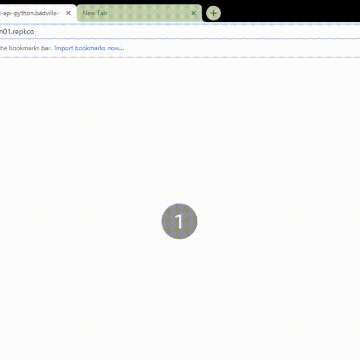

How to make Rest Api in Python

How to make Rest Api in Python

https://repl.it/talk/learn/How-to-make-Rest-Api-in-Python/9038

Introduction In today's lesson, we will learn how to build basic in and . We will specifically focus on two different way of creating apis, both will be using flask. List of two ways. 1. using flask 2. using flask extension called In this Lesson we are going to use to make our final api. But I'm also going to show to how to create one in `flask using flask is not the most official way of creating api. Flask is not efficient, code will look bad and have difficulty managing large files. flask