How to practice effectively…for just about anything - StumbleUpon

 [  Stumble](http://www.stumbleupon.com/to/stumble/go/?clientid=4544d41498a10a385d3e4a8a43dfc6b1&client_type=bookmark&version=1.0)

 

 

 [](#)

   

All Interests
 

 [    Liked by:               + 306 Others.](http://www.stumbleupon.com/content/AJroHt)

 

 

Get 5 smart videos delivered to your inbox every week.

Smart videos for curious minds of all ages.

- [science](http://thekidshouldseethis.com/tagged/science/)•
- [technology](http://thekidshouldseethis.com/tagged/technology/)•
- [space](http://thekidshouldseethis.com/tagged/space/)•
- [animals](http://thekidshouldseethis.com/tagged/animals/)•
- [nature](http://thekidshouldseethis.com/tagged/nature/)•
- [food](http://thekidshouldseethis.com/tagged/food/)•
- [diy](http://thekidshouldseethis.com/tagged/diy/)•
- [music](http://thekidshouldseethis.com/tagged/music/)•
- [art](http://thekidshouldseethis.com/tagged/art/)•
- [animation](http://thekidshouldseethis.com/tagged/animation/)•
- [about tksst](http://thekidshouldseethis.com/about)•
- [saved videos](http://thekidshouldseethis.com/saved/)•
- [Gift Guide](http://tksstgiftguide.com/)•

# How to practice effectively…for just about anything

[save video](#)

[Share](http://www.facebook.com/sharer.php?u=http%3A%2F%2Fthekidshouldseethis.com%2Fpost%2Fhow-to-practice-effectively-for-just-about-anything)[Tweet](https://twitter.com/intent/tweet?text=How%20to%20practice%20effectively%E2%80%A6for%20just%20about%20anything&url=http://thekidshouldseethis.com/post/how-to-practice-effectively-for-just-about-anything&via=thekidshouldsee)

> Mastering any physical skill takes > [> practice](http://thekidshouldseethis.com/tagged/practice)> . Practice is the repetition of an action with the goal of improvement, and it helps us perform with more ease, speed, and confidence. But what does practice actually do to make us better at things?

From [TED Ed](http://thekidshouldseethis.com/tagged/ted-ed), Annie Bosler, and Don Greene, find out [how practice affects the inner workings of our brains](https://youtu.be/f2O6mQkFiiw).

Related reading: [Is your brain like a muscle, really?](http://www.newsweek.com/brain-muscle-really-223348)

Watch this next: [How playing an instrument benefits your brain](http://thekidshouldseethis.com/post/ted-ed-how-playing-an-instrument-benefits-your-brain).

### See more videos about...

[ballet](http://thekidshouldseethis.com/tagged/ballet)  [biology](http://thekidshouldseethis.com/tagged/biology)  [body](http://thekidshouldseethis.com/tagged/body)  [brain](http://thekidshouldseethis.com/tagged/brain)  [dance](http://thekidshouldseethis.com/tagged/dance)  [exercise](http://thekidshouldseethis.com/tagged/exercise)  [how things work](http://thekidshouldseethis.com/tagged/how-things-work)  [human body](http://thekidshouldseethis.com/tagged/human-body)  [instruments](http://thekidshouldseethis.com/tagged/instruments)  [music](http://thekidshouldseethis.com/tagged/music)  [practice](http://thekidshouldseethis.com/tagged/practice)  [science](http://thekidshouldseethis.com/tagged/science)  [sports](http://thekidshouldseethis.com/tagged/sports)  [technology](http://thekidshouldseethis.com/tagged/technology)  [TED Ed](http://thekidshouldseethis.com/tagged/ted-ed)  [work](http://thekidshouldseethis.com/tagged/work)

Posted by Rion Nakaya
1 week ago

[Share](http://www.facebook.com/sharer.php?u=http%3A%2F%2Fthekidshouldseethis.com%2Fpost%2Fhow-to-practice-effectively-for-just-about-anything)[Tweet](https://twitter.com/intent/tweet?text=How%20to%20practice%20effectively%E2%80%A6for%20just%20about%20anything&url=http://thekidshouldseethis.com/post/how-to-practice-effectively-for-just-about-anything&via=thekidshouldsee)

- [PREV VIDEO](http://thekidshouldseethis.com/post/yukino-otani-the-huge-snow-walls-of-the-tateyama-snow-corridor)
- [NEXT VIDEO](http://thekidshouldseethis.com/post/sweet-savory-morning-buns-with-chef-april-bloomfield-tartine)

### More related videos

[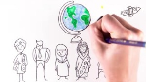](http://thekidshouldseethis.com/post/the-psychology-behind-us-vs-them-braincraft)

## [The psychology behind ‘Us vs Them’ – BrainCraft](http://thekidshouldseethis.com/post/the-psychology-behind-us-vs-them-braincraft)

## [The science of milk](http://thekidshouldseethis.com/post/the-science-of-milk)

## [Why are we so attached to our things? – TED Ed](http://thekidshouldseethis.com/post/why-are-we-so-attached-to-our-things-ted-ed)

[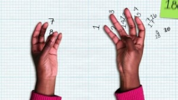](http://thekidshouldseethis.com/post/how-high-can-you-count-on-your-fingers)

## [How high can you count on your fingers?](http://thekidshouldseethis.com/post/how-high-can-you-count-on-your-fingers)

[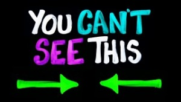](http://thekidshouldseethis.com/post/you-cant-see-this-mind-tricks-asapscience)

## [You Can’t See This (Mind Tricks)](http://thekidshouldseethis.com/post/you-cant-see-this-mind-tricks-asapscience)

[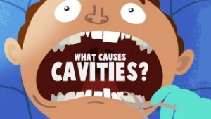](http://thekidshouldseethis.com/post/what-causes-cavities-in-teeth-ted-ed)

## [What causes cavities?](http://thekidshouldseethis.com/post/what-causes-cavities-in-teeth-ted-ed)

[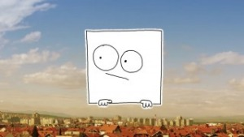](http://thekidshouldseethis.com/post/the-importance-of-staring-out-of-the-window)

## [The Importance of Staring Out Of The Window](http://thekidshouldseethis.com/post/the-importance-of-staring-out-of-the-window)

[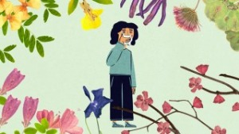](http://thekidshouldseethis.com/post/why-do-some-people-have-seasonal-allergies)

## [Why do some people have seasonal allergies?](http://thekidshouldseethis.com/post/why-do-some-people-have-seasonal-allergies)

[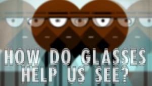](http://thekidshouldseethis.com/post/how-do-glasses-help-us-see-ted-ed)

## [How do eyes work & how do glasses help us see?](http://thekidshouldseethis.com/post/how-do-glasses-help-us-see-ted-ed)

[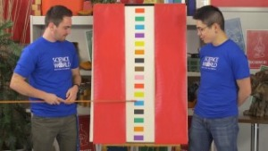](http://thekidshouldseethis.com/post/the-stroop-test)

## [The Stroop Test](http://thekidshouldseethis.com/post/the-stroop-test)

Search & enjoy 2,900+ smart & super-cool, “not-made-for-kids, but perfect for them” videos in the classroom or together at home. Click play and start a conversation.

[About](http://thekidshouldseethis.com/about)

### Don’t miss a video. Follow TKSST

- [](https://twitter.com/thekidshouldsee)
- [](https://facebook.com/thekidshouldseethis)
- [](http://thekidshouldseethis.tumblr.com/)
- [](http://thekidshouldseethis.com/rss)
- [](http://eepurl.com/zpTA5)

### Shop + Support TKSST

[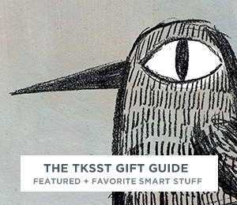](http://tksstgiftguide.tumblr.com/)

### Trending Now

-

[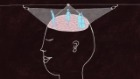](http://thekidshouldseethis.com/post/how-to-practice-effectively-for-just-about-anything)

-

-

[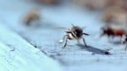](http://thekidshouldseethis.com/post/46937771628)

-

-

[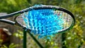](http://thekidshouldseethis.com/post/jelly-tennis-the-slow-mo-guys)

-

[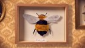](http://thekidshouldseethis.com/post/help-your-local-bees-plant-a-bee-friendly-garden)

- [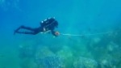](http://thekidshouldseethis.com/post/when-your-job-is-saving-the-ocean-how-she-works)
- [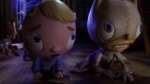](http://thekidshouldseethis.com/post/im-scared-a-stop-motion-short)
- [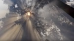](http://thekidshouldseethis.com/post/why-the-giant-sequoia-needs-fire-to-grow)
- 
- [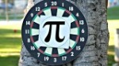](http://thekidshouldseethis.com/post/calculating-pi-%cf%80-with-darts)
- [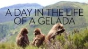](http://thekidshouldseethis.com/post/spend-a-day-with-the-worlds-only-grass-eating-monkeys-gelada)
- [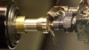](http://thekidshouldseethis.com/post/how-a-bach-stradivarius-trumpet-is-made)
- [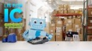](http://thekidshouldseethis.com/post/i-is-for-ic-circuit-playground)
- [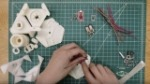](http://thekidshouldseethis.com/post/building-a-soft-robotic-cube-that-jumps)
- [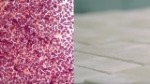](http://thekidshouldseethis.com/post/seashell-inspiration-biomason-grows-cement-bricks-with-bacteria)
- [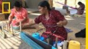](http://thekidshouldseethis.com/post/how-scientists-and-citizens-are-protecting-ancient-ruins-in-peru)
- [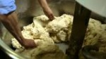](http://thekidshouldseethis.com/post/sweet-savory-morning-buns-with-chef-april-bloomfield-tartine)
- [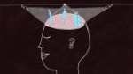](http://thekidshouldseethis.com/post/how-to-practice-effectively-for-just-about-anything)
- [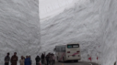](http://thekidshouldseethis.com/post/yukino-otani-the-huge-snow-walls-of-the-tateyama-snow-corridor)
- 
- 
- [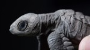](http://thekidshouldseethis.com/post/a-night-adventure-to-see-nicaraguas-sea-turtles)
- [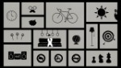](http://thekidshouldseethis.com/post/a-circle-thief-%e3%81%be%e3%82%8b%e3%81%a9%e3%82%8d%e3%81%bc%e3%81%86)

[(L)](http://thekidshouldseethis.com/post/how-to-practice-effectively-for-just-about-anything#)[(L)](http://thekidshouldseethis.com/post/how-to-practice-effectively-for-just-about-anything#)

Start conversations. Spark questions. Inspire offline exploration.
Get 5 smart videos delivered every week.

Copyright 2011-2017 The Kid Should See This™. All rights reserved.

Made with ♥ in Oakland, California by [Rion Nakaya](http://about.me/nakaya).  |  [About](http://thekidshouldseethis.com/About)  |  [Browse](http://thekidshouldseethis.com/Browse)  |  [Shop](http://tksstgiftguide.com/)

- [](https://twitter.com/thekidshouldsee)
- [](https://facebook.com/thekidshouldseethis)
- [](http://thekidshouldseethis.tumblr.com/)
- [](http://thekidshouldseethis.com/rss)
- [](http://eepurl.com/zpTA5)

This is an advertisement! 