How to query geographic raster data in BigQuery efficiently

# How to query geographic raster data in BigQuery efficiently

## Run-length encode the raster image when loading it into BigQuery

[Lak Lakshmanan](https://medium.com/@lakshmanok?source=post_page-----b178b1a5e723----------------------)

[Mar 7](https://medium.com/google-cloud/how-to-query-geographic-raster-data-in-bigquery-efficiently-b178b1a5e723?source=post_page-----b178b1a5e723----------------------) · 7 min read

A couple months ago, I wrote an article on [how you can query GIS raster data in BigQuer](https://medium.com/@lakshmanok/querying-geographic-raster-data-in-bigquery-the-brute-force-way-1da46799d65f)y. BigQuery is meant for structured and semi-structured data and supports the ST_* family of GIS functions. So, to work with raster images, I showed that you could represent each pixel of the raster as its own polygon, and showed that the resulting queries were efficient even for global imagery at 30-arcsecond (approx 0.9 km) resolution.

But it’s been niggling me that there has got to be a more efficient way to represent raster data. In this article, I will show you a more efficient way. On the population density data, the storage reduces by 3–5x and queries get correspondingly faster.

## Represent the data as rectangles

One of the simplest compression methods for images is to do run-length encoding. This is where, instead of storing the image data pixel-by-pixel, you store the image as a pixel value followed by a run-length. What does this translate to, in the realm of geographic images?

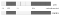
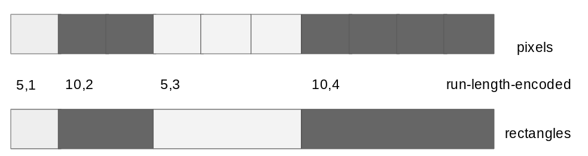

Run-length encoding in GIS translates to storing the data as rectangles instead of pixels

That’s right! Instead of storing the data pixel-by-pixel, we are simply storing it as rectangles (assuming that we don’t wrap around from one row to the next). In the GIS form, a rectangle uses up the exact same storage as a pixel (4 vertices), so the storage cost of using rectangles will always be similar or better to storing individual pixels.

|     |     |
| --- | --- |
| 1   | def  create_rectangle_geo(LATRES, LONRES, ORIGIN_LAT, ORIGIN_LON, rowno, startcol, linedata): |
| 2   |  # find a rectangle of pixels with the same value, and represent that pixel instead |
| 3   |  endcol  =  startcol |
| 4   |  while (endcol  <  len(linedata)) and (linedata[endcol] ==  linedata[startcol]): |
| 5   |  endcol  =  endcol  +  1 |
| 6   |  return  create_geo(LATRES, LONRES, ORIGIN_LAT, ORIGIN_LON, rowno, startcol, endcol) |

 [view raw](https://gist.github.com/lakshmanok/580a45f76b6191b5b7ecc97a55b1c411/raw/cb3b984fd126b9c05c76336dc79db1ca58bf0bf6/convert_to_rect.py)  [convert_to_rect.py](https://gist.github.com/lakshmanok/580a45f76b6191b5b7ecc97a55b1c411#file-convert_to_rect-py) hosted with ❤ by [GitHub](https://github.com/)

My code is [on GitHub](https://github.com/GoogleCloudPlatform/training-data-analyst/tree/master/blogs/popdensity), so look at that repo for larger context — [convert_to_rect.py](https://github.com/GoogleCloudPlatform/training-data-analyst/blob/master/blogs/popdensity/convert_to_rect.py) is the new code that uses rectangles while [convert_to_geo.py](https://github.com/GoogleCloudPlatform/training-data-analyst/blob/master/blogs/popdensity/convert_to_geo.py) is the old code that uses pixels. Note that creating a rectangle is essentially looking forward in the row for pixels with the same value and creating a geo of the end-points.

The geographic representation is:

|     |     |
| --- | --- |
| 1   |     |
| 2   |     |
| 3   | def  create_geo(LATRES, LONRES, ORIGIN_LAT, ORIGIN_LON, rowno, startcol, endcol): |
| 4   |  # represent each rectangle by a polygon of its corners |
| 5   |  top  =  ORIGIN_LAT  -  rowno  *  LATRES |
| 6   |  bot  =  ORIGIN_LAT  - (rowno+1) *  LATRES |
| 7   |  left  =  ORIGIN_LON  +  startcol  *  LONRES |
| 8   |  right  =  ORIGIN_LON  +  endcol  *  LONRES |
| 9   |     |
| 10  |  poly  =  json.dumps({ |
| 11  |  'type': 'Polygon', |
| 12  |  'coordinates': [ |
| 13  | [ # polygon 1 |
| 14  | [left, top], # topleft |
| 15  | [left, bot], # botleft |
| 16  | [right, bot], # botright |
| 17  | [right, top], # topright |
| 18  | [left, top] # same as first point |
| 19  | ]   |
| 20  | ]   |
| 21  | })  |
| 22  |     |
| 23  |  center  =  'POINT({:2f} {:2f})'.format( (left+right)/2, (top+bot)/2 ) |
| 24  |  return  poly, center, endcol |
| 25  |     |

 [view raw](https://gist.github.com/lakshmanok/26c7276fdaab495ec55b8c71739125d6/raw/53ed6a997d7a75cf7f64b415a3d6a541f04cdefb/convert_to_rect2.py)  [convert_to_rect2.py](https://gist.github.com/lakshmanok/26c7276fdaab495ec55b8c71739125d6#file-convert_to_rect2-py) hosted with ❤ by [GitHub](https://github.com/)

There is one interesting difference here. In the original article, I represented a pixel polygon using the Well Known Text (WKT) format and walking through the pixel’s vertices in counter-clockwise order:

POLYGON((-11.3000 -72.3000, -11.3000 -72.4000, -11.2000 -72.4000, -11.2000 -72.3000, -11.3000 -72.3000))

Unfortunately, this fails when representing larger rectangles like:

POLYGON((-11.3000 -72.3000, **-11.3000** -72.4000, **169.9000** -72.4000, 169.9000 -72.3000, -11.3000 -72.3000))

since the shortest path from longitude=-11.3 to longitude=-169.9 isn’t to go eastwards but to go westwards, and the sides are actually great circles! The WKT format, because it is defined on a spherical earth, has no easy way to represent this polygon as we intend — the actual definition ends up being something rather weird:

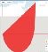
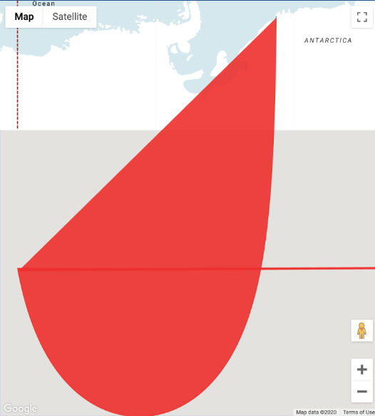

The weird shape that results if we use WKT’s spherical representation for large polygons

Because of this, we should use GeoJSON to write out the rectangles:

SELECT ST_GeogFromGeoJson("{ \"type\":\"Polygon\", \"coordinates\": [ [ [-11.3000, -72.3000], [-11.3000, -72.4000], [169.9000, -72.4000], [169.9000, -72.3000], [-11.3000, -72.3000]]] }") AS geom

which provides the shape that we actually intended (Use [BigQuery GeoViz](https://bigquerygeoviz.appspot.com/) to visualize individual shapes like this):

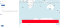
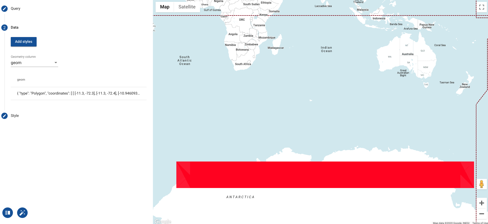

The GeoJson representation gives us what we intended: huge swaths of Antartica have the same population density, and instead of representing as pixels, we can represent it as a single rectangle.

## Loading the table with rectangles

After running the program to create rectangles on the NASA population density dataset, I loaded the new-line delimited JSON into BigQuery:

bq load --replace \
--source_format NEWLINE_DELIMITED_JSON \
--range_partitioning=year,1900,2100,5 \
--clustering_fields tile \
advdata.${TABLE} $GCSFILE schema.json
where the schema specified that this column is of GEOGRAPHY type:
{
"description": "polygon representing boundary of rectangle",
"mode": "REQUIRED",
"name": "bounds",
"type": "GEOGRAPHY"
},

I saw that the storage reduced 5-fold and the number of rows in the resulting table reduced 7-fold:

Pixels: 457 MB, 2139k rows
Rectangles: 96 MB, 319k rows

Run-length encoding the population dataset as rectangles instead of pixels really helps!

## Querying the table

Let’s run a query to find the most populated cities in the state of Washington. We can do this by joining the raster-to-rectangle data with a public dataset of urban boundaries:

WITH urban_populations AS (
SELECT
lsad_name
, SUM(ST_AREA(ST_INTERSECTION(bounds, urban_area_geom))/1000000) AS area_sqkm
, COUNT(1) AS num_rectangles
, AVG(population_density) AS pop_density

FROM advdata.popdensity_nasa, `bigquery-public-data.geo_us_boundaries.urban_areas`

WHERE ST_INTERSECTS(bounds, urban_area_geom)
AND STRPOS(lsad_name, ', WA') > 0
GROUP BY lsad_name
)
SELECT
*, (area_sqkm * pop_density / 1000000) AS population_millions
FROM urban_populations
ORDER BY area_sqkm DESC
LIMIT 10

Now, we process half the data compared to the pixel-wise dataset (so is twice as cost-effective) and is 20% faster. The result:

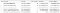
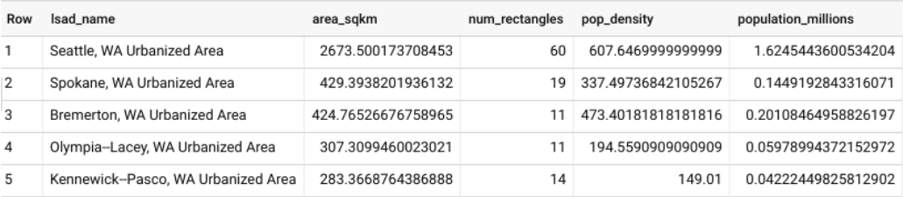

If you are comparing to the result in the previous blog, you’ll notice that the the Seattle population (1.6 million) is less than what we got last time (3 million). That’s because this query is actually more accurate.

When we had pixel-wise data, I simply summed up the area of all the pixels that overlapped Seattle’s boundaries:

ST_AREA(bounds)

Now that the rectangles are potentially much larger, though, I have to compute the area only of the actual actual intersection:

ST_AREA(ST_INTERSECTION(bounds, urban_area_geom))

Obviously, this is much more accurate and is what I should have done even when using pixel-wise data. However, there is a rather ironic problem because the population density is computed on larger squares. The more accurate computation on low resolution data will yield results with a larger error!

## ELT from pixels to rectangles

In the previous section, I rewrote the ETL program to transform the population density raster grid into GeoJson rectangles and reloaded the data into BigQuery.

Can we avoid having to recreate the ETL script? In the previous article, I loaded up higher-resolution data from SEDAC into BigQuery as pixels — considering that this is 100x the NASA data, there is an advantage if I can avoid having to reload the data.*  *So … can I simply convert that pixel data into rectangles?

Yes! Group the pixel data into rows and call ST_Union. In BigQuery, St_UNION dissolves boundaries, and so the end-result will be a set of rectangles.

CREATE OR REPLACE TABLE advdata.sedac_rectangles AS
PARTITION BY RANGE_BUCKET(year, GENERATE_ARRAY(2000, 2100, 5))
CLUSTER BY tile
OPTIONS(require_partition_filter=True)with dissolved AS (
SELECT
year, tile, rowno, population_density,
ST_UNION( ARRAY_AGG(bounds) ) AS bounds,
FROM advdata.sedac_pixels
GROUP BY year, tile, rowno, population_density
)SELECT *, ST_CENTROID(bounds) AS location
FROM dissolved

This reduces the storage of table by 3.5x and the number of the table by 9x, as with the NASA data:

Pixels: 57.03 GB 223m rows
Rectangles: 17.79 GB 28m rows

Note that many of the rows are MultiPolygons, which is why the storage improvement is not as significant as the improvement in the number of rows. It is not as good as reloading the data from scratch since what we get will be MultiPolygons (consider the case where there are multiple rectangles with the same population density in a tile):

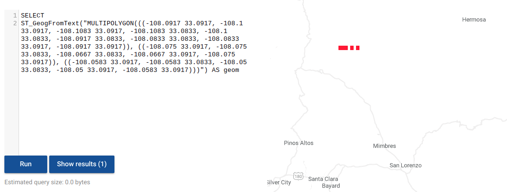

When doing a ST_Union, you will get MultiPolygon and this is not as efficient for spatial querying as the Polygons that result if we were to do the run-length encoding in the ETL program

This indicates that some of the spatial optimizations that BigQuery does to decide whether or not to process a row will not work as well on this data. Therefore, if we have the ability to do so, we should load in rectangles if we can as I did with the NASA data (previous section) and not transform it post-hoc using ST_Union. *As I write this, I’m working from home (thanks to the cornavirus) and my home bandwidth will not allow me to download and upload the SEDAC data ... so I don’t have the choice … *Anyway, this just goes to show that BigQuery is powerful and flexible, and if you want you can ELT large raster grids if you need …

We can try the same query as before, making sure to specify the tile:
WITH urban_populations AS (
SELECT
lsad_name
, SUM(ST_AREA(ST_INTERSECTION(bounds, urban_area_geom))/1000000) AS area_sqkm
, COUNT(1) AS num_rectangles
, AVG(population_density) AS pop_density

FROM advdata.popdensity_sedac_rectangles, `bigquery-public-data.geo_us_boundaries.urban_areas`

 **WHERE **year = 2020
AND **tile = 'gpw_v4_population_density_rev11_2020_30_sec_1.asc'**
AND ST_INTERSECTS(bounds, urban_area_geom)
AND STRPOS(lsad_name, ', WA') > 0
GROUP BY lsad_name
)
SELECT
*, (area_sqkm * pop_density / 1000000) AS population_millions
FROM urban_populations
ORDER BY area_sqkm DESC
LIMIT 10
The result shows the higher-resolution of the result (see num_rectangles):
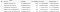
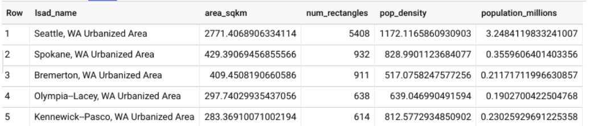

This query processes half the data (2.6 GB vs 5.4 GB) as the corresponding pixels query but takes the four times as long (26 sec vs. 6 sec)because of the inability to filter away as many MultiPolygons.

Bottom line: although you can load the data as pixels and then transform them into polygons using ST_Union, it is not as effective as doing run-length encoding of the pixels into polygons in your ETL program itself.

## Next steps:

1. Read the previous article on [raster data in BigQuery](https://medium.com/@lakshmanok/querying-geographic-raster-data-in-bigquery-the-brute-force-way-1da46799d65f) for more context

2. Browse the [code on GitHub](https://github.com/GoogleCloudPlatform/training-data-analyst/tree/master/blogs/popdensity)

3. Try out the code by following the steps in the README.md file

## Key points:

1. When loading raster data into BigQuery, represent the image as a set of rectangles. This is akin to run-length encoding the data and will cut your storage costs and speed up your queries.

2. Prefer the GeoJson representation over the WKT representation since the planar representation of GeoJson is much more intuitive

3. You can quickly troubleshoot shapes using BigQuery GeoViz

4. You can do ELT of raster data as pixels and then transform them into rectangles in BigQuery with ST_Union. However, it is not as effective as load the data as rectangles into BigQuery by doing run-length encoding in your ETL program.

*Acknowledgment: Thanks to my colleagues Michael Entin and Eric Engle for many helpful discussions.*